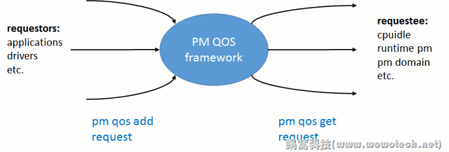

# 前言

QOS 是 Quality Of Service(服务质量)的简称, 对PM QoS 而言, 表示 Linux kernel 电源管理相关的服务质量. 那到底什么是服务质量呢? 

我们知道, Linux PM 的主要功能, 是节省功耗, 但同时, 会付出一定的性能代价, 例如延迟(latency)增加、吞吐量(throughput)下降. 可以把 PM 当作一种服务, 把它对性能的影响, 类比为服务的质量(QoS). 对性能的影响越大, QoS 越低, 反之越高. 

不过, PM QoS framework 的存在, 并不是为了定义并测量系统的服务质量(Linux系统对实际的 qos 没有任何兴趣), 而是为了定义一套框架, 以满足系统各个实体(如进程、设备驱动等等)对 QoS 的期望为终极目标. 根据实际的场景, 这些期望可描述为: xxx不大于某个值; xxx不小于某个值; 等等. 

这个终极目标, 是基于这样的事实: 机器是极端的实用主义者. 最理想的状况, 是刚刚满足系统各个实体对 QoS 的期望, 因而可以在满足需求的同时, 最大化的省电. 粗俗一点, 就是"我能考60分, 为什么要多花一点力气去考61分? ". 这样的思路, 值得我们深思. 

本文将基于PM QoS framework 整体的软件架构, 介绍它的功能、应用场景、使用方式等. 

# 工作原理

kernel将"系统各个实体对QoS的期望"抽象为一个一个的constraint(可以理解为约束), 围绕这些constraint, 可以将系统的实体分为三类: requestor、pm qos framework和requestee. 示意图如下: 

Linux PM QoS framework(1)_概述和软件架构: http://www.wowotech.net/pm_subsystem/pm_qos_overview.html
