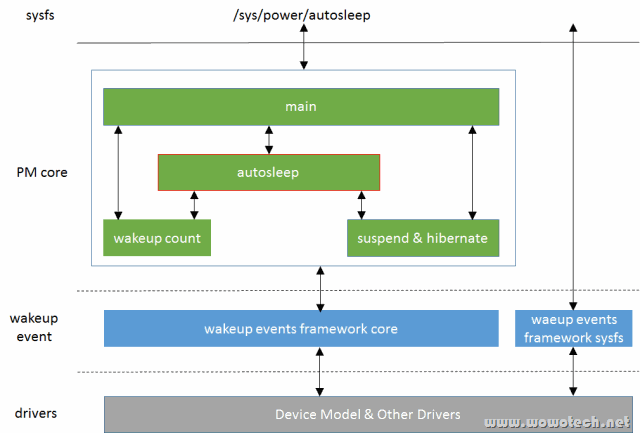

<!-- @import "[TOC]" {cmd="toc" depthFrom=1 depthTo=6 orderedList=false} -->

<!-- code_chunk_output -->

- [1. 概述](#1-概述)
- [2. 功能总结和实现原理](#2-功能总结和实现原理)
- [3. 架构](#3-架构)
- [4. 代码分析](#4-代码分析)
  - [4.1. sys 节点](#41-sys-节点)
  - [4.2. pm_autosleep_init](#42-pm_autosleep_init)
  - [4.3. pm_autosleep_set_state](#43-pm_autosleep_set_state)
    - [4.3.1. pm_wakep_autosleep_enabled](#431-pm_wakep_autosleep_enabled)
    - [4.3.2. queue_up_suspend_work](#432-queue_up_suspend_work)
  - [4.4. suspend_work](#44-suspend_work)
    - [hibernate/pm_suspend](#hibernatepm_suspend)
  - [4.5. pm_autosleep_state](#45-pm_autosleep_state)

<!-- /code_chunk_output -->

# 1. 概述

autosleep 是在 Android 上的 **wakelocks** patchset(https://lwn.net/Articles/479711/)演化而来的, 用于**取代** wakelock 中的自动休眠功能.

它基于 **wakeup source** 实现. 从代码逻辑上讲,  autosleep 是一个简单的功能, 但是背后却埋藏这一个令人深思的问题.

计算机的休眠(通常是 STR, Standby, Hibernate 等 suspend 操作),  应当在什么时候, 由谁触发?

* 对于pc, 笔记本来说:  由**用户**在其**不想使用**或**不再使用**时;

* 对于移动设备: 用户随时随地都可能使用设备, 上面的回答就不再成立. 这时, Android提出了"Opportunistic suspend"("机会主义睡眠", 也就是有机会就睡)的理论, 通俗来讲, 就是"逮到机会就睡". 而 autosleep 功能, 无论是基于 Android **wakelocks** 的 autosleep, 还是基于 Linux Kernel 的 **wakeup source** 的 autosleep, 都是为了实现 "Opportunistic suspend". 困难的点在于如何判定系统没有事情可做.

相比较"对多样的系统组件单独控制"的电源管理方案(如Linux kernel的Dynamic PM), "Opportunistic suspend"是非常简单的, 只要检测到系统没有事情在做(逮到机会), 就 suspend 整个系统. 这对系统的开发人员(特别是 driver 开发者)来说, 很容易实现, 几乎不需要特别处理.

但困难的是, "**系统没有事情在做**" 的**判断依据**是什么? 能判断准确吗? 会不会浪费过多的资源在 "susend->resume-supsend..." 的无聊动作上? 如果只有一个设备在做事情, 其它设备岂不是也得陪着耗电? 等等...

所以, 实现 "Opportunistic suspend" 机制的 autosleep 功能, 是充满争议的. 说实话, 也是不优雅的. 但它可以解燃眉之急, 因而虽然受非议, 却在 Android 设备中广泛使用.

其实 Android 中很多机制都是这样的(如 wakelocks, 如 binder, 等等), 可以这样比方: Android 是设计中的现实主义, Linux kernel 是设计中的理想主义, 当理想和现实冲突时, 怎么调和? 没有答案, 但有一个原则: 不要偏执, 不要试图追求非黑即白的真理！

因为此名字比较有争议, 最后修改为 autosleep.

同样 autosleep.c 的注释可以说明 autosleep 的前身是 Opportunistic sleep.

```cpp
/*
 * kernel/power/autosleep.c
 *
 * Opportunistic sleep support.
 *
 * Copyright (C) 2012 Rafael J. Wysocki <rjw@sisk.pl>
 */
```

详细文章可见:  https://lwn.net/Articles/479841/

# 2. 功能总结和实现原理

Autosleep 的功能很已经很直白了, "系统没有事情在做"的时候, 就将系统切换到低功耗状态.

根据使用场景, 低功耗状态可以是 **Freeze**, **Standby**, **Suspend to RAM** 和 **suspend to disk** 中的**任意一种**.  而怎么判断系统没有事情在做呢? 依赖 **wakeup events framework**.  只要**系统没有正在处理和新增的 wakeup events**, 就尝试 suspend, 如果 suspend 过程中有events 产生, 再 resume 就是了.

由于 suspend/resume 的操作如此频繁, 解决同步问题就越发重要, 这也要依赖 wakeup events framework 及其 wakeup count 功能.

1. 当**系统没有任何事情做**的时候, 就尝试 susupend.

2. 当系统中**没有 wakeup event 事件发生**的时候, 就可以尝试 suspend, 需要 wakeup event framework 机制支持.

3. autosleep 功能需要在 kernel config 中开启 `CONFIG_PM_AUTOSLEEP=y`. `CONFIG_PM_AUTOSLEEP` 依赖 `CONFIG_PM_SLEEP`, `CONFIG_PM_SLEEP` 依赖 `CONFIG_SUSPEND` 或者 `CONFIG_HIBERNATE_CALLBACKS`

4. 通过写 "mem, disk, standby, freeze" 到 `/sys/power/autosleep` 可以开启 autosleep.

5. 通过写 "off" 到 `/sys/power/autosleep` 就可以关闭autosleep.

# 3. 架构

autosleep 的实现位于 `kernel/power/autosleep.c` 中, 基于 **wakeup count** 和 **suspend** & **hibernate** 功能, 并通过 PM core的 main 模块向用户空间提供 sysfs 文件(`/sys/power/autosleep`)



之前讨论过 wakeup count 功能, 本文的 autosleep, 就是使用 wakeup count 的一个实例.

# 4. 代码分析

## 4.1. sys 节点

读取该节点

```cpp
// kernel/power/autosleep.c
// 定义, 默认是0, 即默认 PM_SUSPEND_ON
// PM_SUSPEND_ON 表明关闭 autosleep
static suspend_state_t autosleep_state;

suspend_state_t pm_autosleep_state(void)
{
    return autosleep_state;
}

// kernel/power/main.c
// kernel config 要求
#ifdef CONFIG_PM_AUTOSLEEP
static ssize_t autosleep_show(struct kobject *kobj,
                  struct kobj_attribute *attr,
                  char *buf)
{
    // 返回autosleep_state值
    suspend_state_t state = pm_autosleep_state();

    // 返回off, 表明关闭了
    if (state == PM_SUSPEND_ON)
        return sprintf(buf, "off\n");

// kernel config 要求
#ifdef CONFIG_SUSPEND
    if (state < PM_SUSPEND_MAX)
        // 返回 freeze/standby/mem 其中之一
        return sprintf(buf, "%s\n", pm_states[state] ?
                    pm_states[state] : "error");
#endif
#ifdef CONFIG_HIBERNATION
    // 返回 disk
    return sprintf(buf, "disk\n");
#else
    // 不支持CONFIG_SUSPEND和CONFIG_HIBERNATION
    // 输出 error
    return sprintf(buf, "error");
#endif
}
// kernel/power/power.h
#IFDEF CONFIG_PM_AUTOSLEEP
extern suspend_state_t pm_autosleep_state(void);
#ELSE /* !CONFIG_PM_AUTOSLEEP */ /* 没有配置 CONFIG_PM_AUTOSLEEP, 那么 SUSPEND 是可用的 */
static inline suspend_state_t pm_autosleep_state(void) { return PM_SUSPEND_ON; }
#ENDIF /* !CONFIG_PM_AUTOSLEEP */
```

通过执行 "`echo mem > /sys/power/autosleep`" 此命令, 系统就会在没有事情可做的时候, 选择执行 suspend 的流程.

```cpp
// kernel/power/main.c
static ssize_t autosleep_store(struct kobject *kobj,
                   struct kobj_attribute *attr,
                   const char *buf, size_t n)
{
    // 第一
    // 参照 suspend 节
    // 解析传入的参数, 返回 0/1/2/3/4
    suspend_state_t state = decode_state(buf, n);
    int error;
    // ON的时候, 传入不是 off 直接返回
    if (state == PM_SUSPEND_ON
        && strcmp(buf, "off") && strcmp(buf, "off\n"))
        return -EINVAL;

    if (state == PM_SUSPEND_MEM)
        // 参照 suspend 节
        state = mem_sleep_current;
    // 第二
    // 设置autosleep_state
    error = pm_autosleep_set_state(state);
    return error ? error : n;
}

power_attr(autosleep);
#endif /* CONFIG_PM_AUTOSLEEP */
```

第一. 解析传参, 参照 suspend 节. 只接受 "**freeze**", "**standby**", "**mem**", "**disk**",  "**off**" 等5个字符串中的一个

第二. `PM_SUSPEND_ON` 但输入不是 "**off**", 直接返回; 否则调用 `pm_autosleep_set_state`

## 4.2. pm_autosleep_init

开始之前, 先介绍一下 autosleep 的初始化函数, 该函数在 kernel PM 初始化时(`kernel/power/main.c: pm_init`)被调用, 负责初始化 autosleep 所需的 2 个全局参数:

1) 注册了一个名称为 "`autosleep`" 的 **wakeup source**(`autosleep_ws`), 在 autosleep 执行关键操作时, 用来**阻止系统休眠**(我们可以从中理解 wakeup source 的应用场景和使用方法).

2) 分配了一个名称为 "`autosleep`" 的**有序 workqueue**, 用于**触发实际的休眠动作**(休眠应由**进程**或者**线程**触发). 这里我们要提出 2 个问题: 什么是有序 workqueue? 为什么要使用有序workqueue? 后面分析.

```cpp
// kernel/power/autosleep.c
static struct workqueue_struct *autosleep_wq;
static struct wakeup_source *autosleep_ws;

int __init pm_autosleep_init(void)
{
    // 第一
    autosleep_ws = wakeup_source_register(NULL, "autosleep");
    if (!autosleep_ws)
        return -ENOMEM;
    // 第二
    autosleep_wq = alloc_ordered_workqueue("autosleep", 0);
    if (autosleep_wq)
        return 0;
    ...
}
```

第一. 注册了一个 **wakeup source**, 名字叫 "**autosleep**". 因为是虚拟的, 所以关联的 dev 是 NULL. 代码实现见 "Wakeup events framework", 因为没有关联真实设备, 所以 sysfs 节点是 `/sys/devices/wakeup0`, 并没有在 `/sys/class/wakeup/wakeup0`

同时, 在 `/sys/kernel/debug/wakeup_sources` 中可以看到该信息

第二. 分配了一个 workqueue.

## 4.3. pm_autosleep_set_state

`pm_autosleep_set_state` 负责设置 autosleep 的状态, autosleep 状态和 suspend 节描述的一致, 一共 freeze、standby、STR、STD 和 off 五种(具体依赖于系统实际支持的电源管理状态).

```cpp
// kernel/power/autosleep.c
int pm_autosleep_set_state(suspend_state_t state)
{
    // 第一
#ifndef CONFIG_HIBERNATION
    if (state >= PM_SUSPEND_MAX)
        return -EINVAL;
#endif
    // 第二
    __pm_stay_awake(autosleep_ws);
    // 拿锁
    mutex_lock(&autosleep_lock);
    // 第三
    // 设置 autosleep_state
    autosleep_state = state;
    // 第四
    __pm_relax(autosleep_ws);
    // 第五
    if (state > PM_SUSPEND_ON) {
        // enable
        pm_wakep_autosleep_enabled(true);
        queue_up_suspend_work();
    } else {
        // 相当于输入是 off, disable
        pm_wakep_autosleep_enabled(false);
    }

    mutex_unlock(&autosleep_lock);
    return 0;

}
```

第一. 判断参数是否合法.

第二. 通过 `__pm_stay_awake` 给 PM core 上报一个 wakeup events, 保持系统不会休眠.

第三. 设置全局变量 `autosleep_state` 值.

第四. 调用 `__pm_relax`, 释放 wakeup events, **允许系统睡眠**.

第五. 判断 state 的值, 如果是 off, 调用 wakeup events framework 提供的 `pm_wakep_autosleep_enabled` 函数 禁用 autosleep, 否则调用 `pm_wakep_autosleep_enabled` 函数 使能 autosleep 功能, 同时调用 `queue_up_suspend_work` 将 **suspend work** 挂到 autosleep **workqueue** 中.

注: 由这里的实例可以看出, 此时wakeup source不再是wakeup events的载体, 而更像一个lock(Android wakelocks的影子).

注: 该接口并没有对 autosleep state 的当前值做判断, 也就意味着用户程序可以**不停的调用该接口**, 设置 autosleep state, 如写"mem", 写"freeze", 写"disk"等等. 那么 suspend work 将会**多次** queue 到 **wrokqueue** 上. 而在**多核 CPU** 上, **普通的 workqueue** 是可以在**多个 CPU** 上**并行执行多个 work** 的. 这恰恰是 **autosleep** 所**不能接受**的, 因此 autosleep workqueue 就必须是 orderd workqueue. 所谓 ordered workqueue, 就是**同一时刻**最多执行**一个 work** 的 **worqueue**(具体可参考 `include\linux\workqueue.h` 中的注释). 那我们再问, 为什么不判断一下状态内? 首先, orderd workqueue 可以节省资源. 其次, 这样已经够了, 何必多费心思呢? 简洁就是美.

### 4.3.1. pm_wakep_autosleep_enabled

`pm_wakep_autosleep_enabled` 主要用于更新 wakeup source 中和 autosleep 有关的信息

```cpp
void pm_wakep_autosleep_enabled(bool set)
{
    struct wakeup_source *ws;
    ktime_t now = ktime_get();
    int srcuidx;

    srcuidx = srcu_read_lock(&wakeup_srcu);
    // 遍历所有的 wakeup source
    list_for_each_entry_rcu_locked(ws, &wakeup_sources, entry) {
        spin_lock_irq(&ws->lock);
        if (ws->autosleep_enabled != set) {
            // 修改 autosleep_enabled 标志
            // 第一
            ws->autosleep_enabled = set;
            // wakeup source 是 active 的
            if (ws->active) {
                // 第二
                if (set)
                    // 表明从现在开始就已经阻止autosleep的功能
                    ws->start_prevent_time = now;
                else
                    // 第三
                    update_prevent_sleep_time(ws, now);
            }
        }
        spin_unlock_irq(&ws->lock);
    }
    srcu_read_unlock(&wakeup_srcu, srcuidx);
}
```

第一. 更新系统**所有 wakeup souce** 的 `autosleep_enabled` 标志

第二. 如果 wakeup source 处于 active 状态(意味着它会**阻止 autosleep**), 且当前 autosleep 为 enable, 将 `start_prevent_time` 设置为当前时间(开始阻止).

第三. 如果 wakeup source 处于 active 状态, 且 autosleep 为 disable(说明这个 wakeup source 一直坚持到 autosleep 被禁止), 调用 `update_prevent_sleep_time` 接口, 更新 wakeup source 的 `prevent_sleep_time`.

### 4.3.2. queue_up_suspend_work

`queue_up_suspend_work` 比较简单, 就是把 `suspend_work` 挂到 workqueue, 等待被执行. 而 `suspend_work` 的处理函数为 `try_to_suspend`

```cpp
// kernel/power/autosleep.c
static DECLARE_WORK(suspend_work, try_to_suspend);

void queue_up_suspend_work(void)
{
    if (autosleep_state > PM_SUSPEND_ON)
        queue_work(autosleep_wq, &suspend_work);
}
```

无论是 `queue_work` 还是 `schedule_work`, 或是别的触发工作任务的接口, 最终都是调用到 `queue_work_on`, 最终调用 `wake_up_process()` 唤醒 worker thread.

> `alloc_workqueue` 时候回申请线程池(pwq)并链接到 wq.

## 4.4. suspend_work

`try_to_suspend` 是 suspend 的实际触发者.

该接口是 **wakeup count** 的一个**例子**, 根据 "Wakeup count 功能" 的分析, 就是 **read wakeup count**, **write wakeup count**, **suspend**, 具体来讲

```cpp
// kernel/power/autosleep.c
static void try_to_suspend(struct work_struct *work)
{
    unsigned int initial_count, final_count;
    // 第一
    // 获取系统中产生的所有wakeup event总数
    if (!pm_get_wakeup_count(&initial_count, true))
        goto out;

    mutex_lock(&autosleep_lock);
    // 第二
    // 再次写入, false 表明不能 suspend
    if (!pm_save_wakeup_count(initial_count) ||
        system_state != SYSTEM_RUNNING) {
        // 第三
        mutex_unlock(&autosleep_lock);
        goto out;
    }

    if (autosleep_state == PM_SUSPEND_ON) {
        mutex_unlock(&autosleep_lock);
        // 只有这里 return
        return;
    }
    // 第二
    if (autosleep_state >= PM_SUSPEND_MAX)
        hibernate();
    else
        pm_suspend(autosleep_state);

    mutex_unlock(&autosleep_lock);
    // 第四
    if (!pm_get_wakeup_count(&final_count, false))
        goto out;

    /*
     * If the wakeup occurred for an unknown reason, wait to prevent the
     * system from trying to suspend and waking up in a tight loop.
     */
    // 第五
    if (final_count == initial_count)
        schedule_timeout_uninterruptible(HZ / 2);

 out:
    // 再次自动 suspend_work
    // 第六
    queue_up_suspend_work();
}
```

第一. 调用 `pm_get_wakeup_count`(block 为 true), 获取 wakeup count, 保存在 `initial_count` 中. 如果有 wakeup events 正在处理, 阻塞等待.

第二. 将读取的 count, **写入**. 如果成功, 且当前系统状态为 running, 根据 autosleep 状态, 调用 hibernate 或者 pm_suspend, suspend 系统.

第三. 如果写 count 失败, 说明读写的过程有 events 产生或者有 events 正在被处理, 退出, 重新把 `suspend_work` 挂到 workqueue, 进行下一次尝试.

第四. 如果 suspend 的过程中, 或者是 suspend 之后, 产生了 events, 醒来, 再读一次 wakeup count(此时不再阻塞), 保存在 final_count 中.

第五. 如果 `final_count` 和 `initial_count` 相同, 发生怪事了, **没有产生 events**, 竟然醒了. 可能有异常, 不能再立即启动 autosleep(恐怕陷入 `sleep->wakeup->sleep->wakeup` 的快速 loop 中), 等待 0.5s, 再尝试 autosleep.

第六. 会一直把 `suspend_work` 挂到 workqueue. 直到 `autosleep_state`(`/sys/power/autosleep`) 被置为 off.

### hibernate/pm_suspend

里面频繁调用了 `pm_wakeup_pending`, 见 "Wakeup events framework"

## 4.5. pm_autosleep_state

该接口比较简单, 获取 `autosleep_state` 的值返回即可