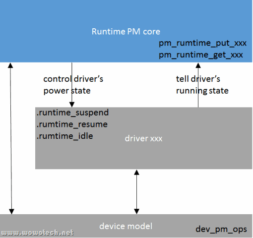

# 概述

从个人的角度讲, 我很推崇使用RPM进行日常的动态电源管理, 而不是suspend机制.

软件工程的基本思想就是模块化: 高内聚和低耦合. 通俗地讲呢, 就是"各人自扫门前雪", 尽量扫好自己的(高内聚), 尽量不和别人交互(低耦合). 而RPM正体现了这一思想: 每个设备(包括CPU)都处理好自身的电源管理工作, 尽量以最低的能耗完成交代的任务, 尽量在不需要工作的时候进入低功耗状态, 尽量不和其它模块有过多耦合. 每个设备都是最节省的话, 整个系统一定是最节省的, 最终达到无所谓睡、无所谓醒的天人合一状态.

# 软件框架

听多了RPM的传说, 有种莫名的恐惧, 觉的会很复杂. 但看代码, 也就是 "drivers/base/power/runtime.c" 中1400行而已.

从设计思路上讲, 它确实简单. 下面是一个大概的软件框架:

