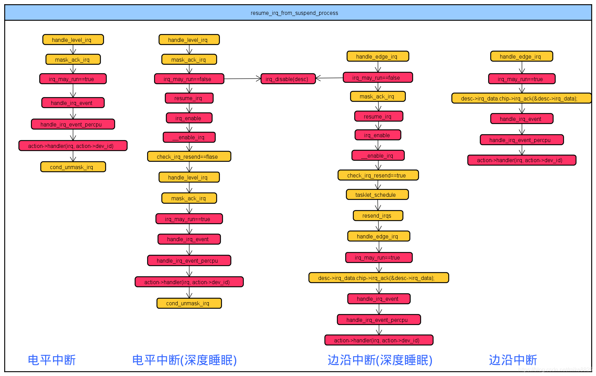
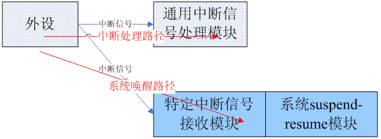

# 设备IRQ的suspend和resume

本小节主要解决这样一个问题: 在系统休眠过程中, 如何 suspend 设备中断(IRQ)? 在从休眠中唤醒的过程中, 如何resume设备 IRQ?

## suspend

一般而言, 在系统 suspend 过程的后期, **各个设备**的 **IRQ**(`interrupt request line`)会被 **disable** 掉.

具体的时间点是在**各个设备**的 **late suspend 阶段之后**. 代码如下(删除了部分无关代码):

```cpp
static int suspend_enter(suspend_state_t state, bool *wakeup)

{
    ……
    // suspend late阶段
    error = dpm_suspend_late(PMSG_SUSPEND);
    error = platform_suspend_prepare_late(state);
    // suspend noirq的阶段
    //下面的代码中会disable各个设备的irq
    error = dpm_suspend_noirq(PMSG_SUSPEND);
    error = platform_suspend_prepare_noirq(state);
    ……
}

int dpm_suspend_noirq(pm_message_t state)
{
    // 武装所有wakeup irqs
	device_wakeup_arm_wake_irqs();
    // disable掉所有设备的irq
	suspend_device_irqs();
    // 针对系统中的每一个 device,
    // 调用device_suspend_noirq来执行该设备 noirq 情况下的 suspend callback函数
	ret = dpm_noirq_suspend_devices(state);
	...
}
```

在 `dpm_suspend_noirq` 函数中, 会针对系统中的**每一个 device**, 依次调用 `device_suspend_noirq` 来执行**该设备 noirq** 情况下的 suspend callback 函数, 当然, 在此之前会调用 `suspend_device_irqs` 函数来 disable 所有设备的 irq.

之所以这么做, 其思路是这样的: 在**各个设备驱动**完成了 **late suspend** 之后, 按理说这些**已经被 suspend** 的**设备不应该再触发中断**了. 如果还有一些设备**没有被正确的 suspend**, 那么我们最好的策略是 **mask 该设备的 irq**, 从而**阻止中断的递交**. 此外, 在过去的代码中(指 `interrupt handler`), 我们对**设备共享 IRQ**的情况处理的不是很好, 存在这样的问题: 在**共享 IRQ 的设备们**完成 **suspend** 之后, 如果有中断触发, 这时候设备驱动的 `interrupt handler` 并没有准备好. 在有些场景下, `interrupt handler` 会访问已经 suspend 设备的 IO 地址空间, 从而导致不可预知的 issue. 这些 issue 很难 debug, 因此, 我们引入了 `suspend_device_irqs()` 以及**设备 noirq 阶段的 callback 函数**.

```cpp
void suspend_device_irqs(void)
{
	struct irq_desc *desc;
	int irq;

	for_each_irq_desc(irq, desc) {
		......
		sync = suspend_device_irq(desc);
		...
	}
}

static inline bool irqd_is_wakeup_set(struct irq_data *d)
{
	return __irqd_to_state(d) & IRQD_WAKEUP_STATE;
}

static bool suspend_device_irq(struct irq_desc *desc)
{
	unsigned long chipflags = irq_desc_get_chip(desc)->flags;
	struct irq_data *irqd = &desc->irq_data;

	if (!desc->action || irq_desc_is_chained(desc) ||
	    desc->no_suspend_depth)
		return false;

	if (irqd_is_wakeup_set(irqd)) {
		irqd_set(irqd, IRQD_WAKEUP_ARMED);
		/*
		 * We return true here to force the caller to issue
		 * synchronize_irq(). We need to make sure that the
		 * IRQD_WAKEUP_ARMED is visible before we return from
		 * suspend_device_irqs().
		 */
		return true;
	}

	desc->istate |= IRQS_SUSPENDED;
	__disable_irq(desc);

	/*
	 * Hardware which has no wakeup source configuration facility
	 * requires that the non wakeup interrupts are masked at the
	 * chip level. The chip implementation indicates that with
	 * IRQCHIP_MASK_ON_SUSPEND.
	 */
	if (chipflags & IRQCHIP_MASK_ON_SUSPEND)
		mask_irq(desc);
	return true;
}
```

从上面的代码可以看出, 如果 no_suspend_depth 计数不为0或者有设置 `IRQD_WAKEUP_STATE` 标志,就不会关闭该中断. 

方法1: 可以在**申请中断时**, 加入参数 `IRQF_NO_SUSPEND`, `no_suspend_depth` 计数不为 0, 其原理如下

```cpp
static inline int __must_check request_irq(unsigned int irq, irq_handler_t handler, unsigned long flags,
	    const char *name, void *dev)
{
	return request_threaded_irq(irq, handler, NULL, flags, name, dev);
}
 
int request_threaded_irq(unsigned int irq, irq_handler_t handler,irq_handler_t thread_fn, unsigned long irqflags,const char *devname, void *dev_id)
{
	desc = irq_to_desc(irq);
	if (!desc)
		return -EINVAL;
	action = kzalloc(sizeof(struct irqaction), GFP_KERNEL);
	if (!action)
		return -ENOMEM;
 
	action->handler = handler;
	action->thread_fn = thread_fn;
	action->flags = irqflags;
	action->name = devname;
	action->dev_id = dev_id;
 
	retval = __setup_irq(irq, desc, action);
}
 
static int __setup_irq(unsigned int irq, struct irq_desc *desc, struct irqaction *new)
{
	irq_pm_install_action(desc, new);
}
 
void irq_pm_install_action(struct irq_desc *desc, struct irqaction *action)
{
	desc->nr_actions++;
 
	if (action->flags & IRQF_FORCE_RESUME)
		desc->force_resume_depth++;
 
	WARN_ON_ONCE(desc->force_resume_depth &&
		     desc->force_resume_depth != desc->nr_actions);
 
	if (action->flags & IRQF_NO_SUSPEND)
		desc->no_suspend_depth++;
	else if (action->flags & IRQF_COND_SUSPEND)
		desc->cond_suspend_depth++;
 
	WARN_ON_ONCE(desc->no_suspend_depth &&
		     (desc->no_suspend_depth +
```

方法2: 在进入 suspend 函数中加入 irq_set_irq_wake(irq,1), 该方法会设置 IRQD_WAKEUP_STATE 标志,resume函数中加入irq_set_irq_wake(irq,0) 其原理如下

```cpp

int irq_set_irq_wake(unsigned int irq, unsigned int on)
{
    unsigned long flags;
    struct irq_desc *desc = irq_get_desc_buslock(irq, &flags, IRQ_GET_DESC_CHECK_GLOBAL);
    int ret = 0;
 
    if (on) {
        if (desc->wake_depth++ == 0) {
            ret = set_irq_wake_real(irq, on);
            if (ret)
                desc->wake_depth = 0;
            else
                irqd_set(&desc->irq_data, IRQD_WAKEUP_STATE);
        }
    } else {
        if (desc->wake_depth == 0) {
            WARN(1, "Unbalanced IRQ %d wake disable\n", irq);
        } else if (--desc->wake_depth == 0) {
            ret = set_irq_wake_real(irq, on);
            if (ret)
                desc->wake_depth = 1;
            else
                irqd_clear(&desc->irq_data, IRQD_WAKEUP_STATE);
        }
    }
 
    return ret;
}
 
 
static int set_irq_wake_real(unsigned int irq, unsigned int on)
{
    struct irq_desc *desc = irq_to_desc(irq);
    int ret = -ENXIO;
 
    if (irq_desc_get_chip(desc)->flags &  IRQCHIP_SKIP_SET_WAKE)
        return 0;
 
    if (desc->irq_data.chip->irq_set_wake)
        ret = desc->irq_data.chip->irq_set_wake(&desc->irq_data, on);
 
    return ret;
}
```

该函数实际调用的是中断相关芯片的set_wake操作, 实际就是在 suspend 期间允许相关中断的寄存器配置操作

另外, 休眠和唤醒流程中有如下函数

```cpp
// drivers/base/power/main.c
int dpm_suspend_noirq(pm_message_t state)
{
    // 武装所有 wakeup irqs
    device_wakeup_arm_wake_irqs();
}

// drivers/base/power/wakeup.c
void device_wakeup_arm_wake_irqs(void)
{
    struct wakeup_source *ws;
    int srcuidx;
 
    srcuidx = srcu_read_lock(&wakeup_srcu);
    // 遍历所有唤醒源
    list_for_each_entry_rcu(ws, &wakeup_sources, entry) {
        if (ws->wakeirq)
            // 武装每一个唤醒源
            dev_pm_arm_wake_irq(ws->wakeirq);
    }
    srcu_read_unlock(&wakeup_srcu, srcuidx);
}
// drivers/base/power/wakeirq.c
void dev_pm_arm_wake_irq(struct wake_irq *wirq)
{
    if (!wirq)
        return;
    // 判断 dev->power.can_wakeup
    if (device_may_wakeup(wirq->dev)) {
        if (wirq->status & WAKE_IRQ_DEDICATED_ALLOCATED &&
            !pm_runtime_status_suspended(wirq->dev))
            enable_irq(wirq->irq);

        enable_irq_wake(wirq->irq);
    }
}
```

关于唤醒源, 系统有专门的 class

```cpp
// drivers/base/power/wakeup_stats.c
static int __init wakeup_sources_sysfs_init(void)
{
    // 生成 /sys/class/wakeup/
    // 所有的 wakup source 都可以在当前目录下看到
    wakeup_class = class_create(THIS_MODULE, "wakeup");

    return PTR_ERR_OR_ZERO(wakeup_class);
}
postcore_initcall(wakeup_sources_sysfs_init);
```

如果设备具有唤醒功能 (`dev->power.can_wakeup`), 在设备初始化的时候会添加到该 class 中(在 sysfs 中添加相应节点).

```
# LL /sys/class/wakeup/
total 0
drwxr-xr-x  2 root root 0 Oct  8 03:19 ./
drwxr-xr-x 68 root root 0 Oct  8 03:19 ../
lrwxrwxrwx  1 root root 0 Oct  8 03:19 wakeup0 -> ../../devices/LNXSYSTM:00/LNXSYBUS:00/PNP0A03:00/device:00/wakeup/wakeup0/
lrwxrwxrwx  1 root root 0 Oct  8 03:19 wakeup1 -> ../../devices/LNXSYSTM:00/LNXSYBUS:00/PNP0A03:00/device:01/wakeup/wakeup1/
lrwxrwxrwx  1 root root 0 Oct  8 03:19 wakeup10 -> ../../devices/pnp0/00:05/rtc/rtc0/alarmtimer.0.auto/wakeup/wakeup10/
lrwxrwxrwx  1 root root 0 Oct  8 03:19 wakeup11 -> ../../devices/LNXSYSTM:00/LNXSYBUS:00/PNP0A03:00/QEMU0002:00/wakeup/wakeup11/
lrwxrwxrwx  1 root root 0 Oct  8 03:19 wakeup2 -> ../../devices/LNXSYSTM:00/LNXSYBUS:00/PNP0A03:00/device:03/wakeup/wakeup2/
lrwxrwxrwx  1 root root 0 Oct  8 03:19 wakeup3 -> ../../devices/LNXSYSTM:00/LNXSYBUS:00/PNP0A03:00/device:04/wakeup/wakeup3/
lrwxrwxrwx  1 root root 0 Oct  8 03:19 wakeup4 -> ../../devices/LNXSYSTM:00/LNXSYBUS:00/PNP0A03:00/device:05/wakeup/wakeup4/
lrwxrwxrwx  1 root root 0 Oct  8 03:19 wakeup5 -> ../../devices/LNXSYSTM:00/LNXSYBUS:00/PNP0A03:00/device:06/wakeup/wakeup5/
lrwxrwxrwx  1 root root 0 Oct  8 03:19 wakeup6 -> ../../devices/LNXSYSTM:00/LNXSYBUS:00/PNP0A03:00/device:07/wakeup/wakeup6/
lrwxrwxrwx  1 root root 0 Oct  8 03:19 wakeup7 -> ../../devices/LNXSYSTM:00/LNXSYBUS:00/PNP0A03:00/wakeup/wakeup7/
lrwxrwxrwx  1 root root 0 Oct  8 03:19 wakeup8 -> ../../devices/LNXSYSTM:00/LNXPWRBN:00/wakeup/wakeup8/
lrwxrwxrwx  1 root root 0 Oct  8 03:19 wakeup9 -> ../../devices/pnp0/00:05/wakeup/wakeup9/
```

```cpp 
void dpm_resume_noirq(pm_message_t state)
{
    device_wakeup_disarm_wake_irqs();
}

void dev_pm_disarm_wake_irq(struct wake_irq *wirq)
{
    if (!wirq)
        return;
 
    if (device_may_wakeup(wirq->dev))
        disable_irq_wake(wirq->irq);
}
void device_wakeup_disarm_wake_irqs(void)
{
    struct wakeup_source *ws;
    int srcuidx;
 
    srcuidx = srcu_read_lock(&wakeup_srcu);
    list_for_each_entry_rcu(ws, &wakeup_sources, entry) {
        if (ws->wakeirq)
            dev_pm_disarm_wake_irq(ws->wakeirq);
    }
    srcu_read_unlock(&wakeup_srcu, srcuidx);
}
 
int device_wakeup_attach_irq(struct device *dev,
                 struct wake_irq *wakeirq)
{
    struct wakeup_source *ws;
 
    ws = dev->power.wakeup;
    if (!ws) {
        dev_err(dev, "forgot to call call device_init_wakeup?\n");
        return -EINVAL;
    }
 
    if (ws->wakeirq)
        return -EEXIST;
 
    ws->wakeirq = wakeirq;
    return 0;
}
 
static int dev_pm_attach_wake_irq(struct device *dev, int irq,struct wake_irq *wirq)
{
    err = device_wakeup_attach_irq(dev, wirq);
}
 
int dev_pm_set_wake_irq(struct device *dev, int irq)
{
    struct wake_irq *wirq;
    int err;
 
    if (irq < 0)
        return -EINVAL;
 
    wirq = kzalloc(sizeof(*wirq), GFP_KERNEL);
    if (!wirq)
        return -ENOMEM;
 
    wirq->dev = dev;
    wirq->irq = irq;
 
    err = dev_pm_attach_wake_irq(dev, irq, wirq);
    if (err)
        kfree(wirq);
 
    return err;
}
 
static inline int device_init_wakeup(struct device *dev, bool val)
{
    device_set_wakeup_capable(dev, val);
    device_set_wakeup_enable(dev, val);
    return 0;
}
```

在初始化中加入如下函数, 系统默认会自动调用 irq_set_irq_wake 开启和关闭中断唤醒. 

```cpp
device_init_wakeup(struct device *dev, bool val)
dev_pm_set_wake_irq(struct device *dev, int irq)
```

总结

１. 申请中断时加入 `IRQF_NO_SUSPEND` 标志. 

中断唤醒 cpu 后, 如果中断处理里有调用某些资源(如i2c), 内核会报 i2c 处于 suspend 状态, 这是因为 i2c 还没唤醒, 需要进行一定的延时, 建议使用 `irq_set_irq_wake` 函数, 因为按照休眠唤醒逻辑, i2c 已经唤醒了. 其深度休眠, 唤醒流程跟非深度休眠流程一致. 

2. 休眠时开中断唤醒, 唤醒时关闭中断唤醒. 

```cpp
irq_set_irq_wake(irq,1)
irq_set_irq_wake(irq,0)
```

对应某些场景, 我们需要中断总是能唤醒 cpu(而不是由用户设置), 我们可以在 probe 函数里直接调用 `irq_set_irq_wake(irq,1)` 即可(不需要关闭). 

3. 初始化调用如下函数, 其原理是自动调用 `irq_set_irq_wake` 函数. 

```cpp
device_init_wakeup(struct device *dev, bool val)
dev_pm_set_wake_irq(struct device *dev, int irq)
```

具体唤醒流程参考: `Linux\Interrupt\Linux kernel的中断子系统\14. 中断唤醒系统流程.md`

唤醒后, 通过 `irq_set_irq_wake(irq,1)` 设置的中断, 处理流程如下

```cpp

bool irq_pm_check_wakeup(struct irq_desc *desc)
{
	if (irqd_is_wakeup_armed(&desc->irq_data)) {
		irqd_clear(&desc->irq_data, IRQD_WAKEUP_ARMED);
		desc->istate |= IRQS_SUSPENDED | IRQS_PENDING;
		desc->depth++;
		irq_disable(desc);-----------------------------先关闭irq
		pm_system_irq_wakeup(irq_desc_get_irq(desc));
		return true;
	}
	return false;
}
 
static bool irq_may_run(struct irq_desc *desc)
{
	unsigned int mask = IRQD_IRQ_INPROGRESS | IRQD_WAKEUP_ARMED;
 
	/*
	 * If the interrupt is not in progress and is not an armed
	 * wakeup interrupt, proceed.
	 */
	if (!irqd_has_set(&desc->irq_data, mask))
		return true;
 
	/*
	 * If the interrupt is an armed wakeup source, mark it pending
	 * and suspended, disable it and notify the pm core about the
	 * event.
	 */
	if (irq_pm_check_wakeup(desc))
		return false;
 
	/*
	 * Handle a potential concurrent poll on a different core.
	 */
	return irq_check_poll(desc);
}
 
static inline void mask_ack_irq(struct irq_desc *desc)
{
	if (desc->irq_data.chip->irq_mask_ack)
		desc->irq_data.chip->irq_mask_ack(&desc->irq_data);
	else {
		desc->irq_data.chip->irq_mask(&desc->irq_data);
		if (desc->irq_data.chip->irq_ack)
			desc->irq_data.chip->irq_ack(&desc->irq_data);
	}
	irq_state_set_masked(desc);
}
 
void __enable_irq(struct irq_desc *desc)
{
	switch (desc->depth) {
	case 0:
 err_out:
		WARN(1, KERN_WARNING "Unbalanced enable for IRQ %d\n",
		     irq_desc_get_irq(desc));
		break;
	case 1: {
		if (desc->istate & IRQS_SUSPENDED)
			goto err_out;
		/* Prevent probing on this irq: */
		irq_settings_set_noprobe(desc);
		irq_enable(desc);-----------------------------再开启irq
		check_irq_resend(desc);
		/* fall-through */
	}
	default:
		desc->depth--;
	}
}
 
void irq_enable(struct irq_desc *desc)
{
	irq_state_clr_disabled(desc);
	if (desc->irq_data.chip->irq_enable)
		desc->irq_data.chip->irq_enable(&desc->irq_data);
	else
		desc->irq_data.chip->irq_unmask(&desc->irq_data);
	irq_state_clr_masked(desc);
}
 
void check_irq_resend(struct irq_desc *desc)
{
	/*
	 * We do not resend level type interrupts. Level type
	 * interrupts are resent by hardware when they are still
	 * active. Clear the pending bit so suspend/resume does not
	 * get confused.
	 */
	if (irq_settings_is_level(desc)) {
		desc->istate &= ~IRQS_PENDING;
		return;
	}
	if (desc->istate & IRQS_REPLAY)
		return;
	if (desc->istate & IRQS_PENDING) {
		desc->istate &= ~IRQS_PENDING;
		desc->istate |= IRQS_REPLAY;
 
		if (!desc->irq_data.chip->irq_retrigger ||
		    !desc->irq_data.chip->irq_retrigger(&desc->irq_data)) {
#ifdef CONFIG_HARDIRQS_SW_RESEND
			unsigned int irq = irq_desc_get_irq(desc);
 
			/*
			 * If the interrupt is running in the thread
			 * context of the parent irq we need to be
			 * careful, because we cannot trigger it
			 * directly.
			 */
			if (irq_settings_is_nested_thread(desc)) {
				/*
				 * If the parent_irq is valid, we
				 * retrigger the parent, otherwise we
				 * do nothing.
				 */
				if (!desc->parent_irq)
					return;
				irq = desc->parent_irq;
			}
			/* Set it pending and activate the softirq: */
			set_bit(irq, irqs_resend);
			tasklet_schedule(&resend_tasklet);
#endif
		}
	}
}
 
void handle_level_irq(struct irq_desc *desc)
{
	raw_spin_lock(&desc->lock);
	mask_ack_irq(desc);
 
	if (!irq_may_run(desc))
		goto out_unlock;
 
	desc->istate &= ~(IRQS_REPLAY | IRQS_WAITING);
	kstat_incr_irqs_this_cpu(desc);
 
	/*
	 * If its disabled or no action available
	 * keep it masked and get out of here
	 */
	if (unlikely(!desc->action || irqd_irq_disabled(&desc->irq_data))) {
		desc->istate |= IRQS_PENDING;
		goto out_unlock;
	}
 
	handle_irq_event(desc);
 
	cond_unmask_irq(desc);
 
out_unlock:
	raw_spin_unlock(&desc->lock);
}
 
void handle_edge_irq(struct irq_desc *desc)
{
	raw_spin_lock(&desc->lock);
 
	desc->istate &= ~(IRQS_REPLAY | IRQS_WAITING);
 
	if (!irq_may_run(desc)) {
		desc->istate |= IRQS_PENDING;
		mask_ack_irq(desc);
		goto out_unlock;
	}
 
	/*
	 * If its disabled or no action available then mask it and get
	 * out of here.
	 */
	if (irqd_irq_disabled(&desc->irq_data) || !desc->action) {
		desc->istate |= IRQS_PENDING;
		mask_ack_irq(desc);
		goto out_unlock;
	}
 
	kstat_incr_irqs_this_cpu(desc);
 
	/* Start handling the irq */
	desc->irq_data.chip->irq_ack(&desc->irq_data);
 
	do {
		if (unlikely(!desc->action)) {
			mask_irq(desc);
			goto out_unlock;
		}
 
		/*
		 * When another irq arrived while we were handling
		 * one, we could have masked the irq.
		 * Renable it, if it was not disabled in meantime.
		 */
		if (unlikely(desc->istate & IRQS_PENDING)) {
			if (!irqd_irq_disabled(&desc->irq_data) &&
			    irqd_irq_masked(&desc->irq_data))
				unmask_irq(desc);
		}
 
		handle_irq_event(desc);
 
	} while ((desc->istate & IRQS_PENDING) &&
		 !irqd_irq_disabled(&desc->irq_data));
 
out_unlock:
	raw_spin_unlock(&desc->lock);
}
```

check_irq_resend 直译过来就是检查irq并重发(软件模拟)

对于电平中断来说, `handle_level_irq` 关掉中断后, 再次开启 irq, 中断信号还在, 会重新调用 handle_level_irq

对应边沿中断来说, 只会触发一次, `handle_edge_irq` 已经关掉了一次, 再次开启 irq 时, 由于没信号过来了, 需要软件模拟中断过来, 即重新调用一遍 `desc->handle_irq()`/`handle_edge_irq()`

```cpp
static DECLARE_TASKLET(resend_tasklet, resend_irqs, 0);
static void resend_irqs(unsigned long arg)
{
	struct irq_desc *desc;
	int irq;
 
	while (!bitmap_empty(irqs_resend, nr_irqs)) {
		irq = find_first_bit(irqs_resend, nr_irqs);
		clear_bit(irq, irqs_resend);
		desc = irq_to_desc(irq);
		local_irq_disable();
		desc->handle_irq(desc);
		local_irq_enable();
	}
}
```

电平中断和边沿中断的处理流程有差异, 见下图



## resume

系统 resume 过程中, 在各个设备的 **early resume 过程之前**, 各个设备的 IRQ 会被重新打开, 具体代码如下(删除了部分无关代码):

```cpp
static int suspend_enter(suspend_state_t state, bool *wakeup)
{
    ……
    // 首先执行noirq阶段的resume
    platform_resume_noirq(state);
    // 在这里会恢复irq, 然后进入early resume阶段
    dpm_resume_noirq(PMSG_RESUME);
    platform_resume_early(state);
    dpm_resume_early(PMSG_RESUME);
    ……
}

void dpm_resume_noirq(pm_message_t state)
{
    // 各个设备的noirq回调
	dpm_noirq_resume_devices(state);
    // enable各个设备的irq, 里面也会恢复中断handler在软中断上下文执行
	resume_device_irqs();
	device_wakeup_disarm_wake_irqs();
}
```

在 `dpm_resume_noirq` 函数中, 会调用各个设备驱动的 noirq callback, 在此之后, 调用 `resume_device_irqs` 函数, 完成各个设备 irq 的 enable.

# 关于 IRQF_NO_SUSPEND Flag

> 仅表明该 irq 一直开启, 会触发执行 interrupt handler
>
> 不能用来唤醒系统, 需要调用 enable_irq_wake(), 但是 IRQF_NO_SUSPEND 的 irq 一般不应该调用

当然, 有些**中断**需要在整个系统的 `suspend-resume` 过程中(包括在 noirq 阶段, 包括将 nonboot CPU 推送到 offline 状态以及系统 resume 后, 将其重新设置为 online 的阶段)**保持能够触发的状态**. 一个简单的例子就是 **timer 中断**, 此外 **IPI** 以及一些**特殊目的设备中断**也需要如此.

在**中断申请**的时候, `IRQF_NO_SUSPEND flag` 可以用来告知 **IRQ subsystem**, 这个中断就是上一段文字中描述的那种中断: 需要在系统的 suspend-resume 过程中**保持 enable 状态**. 有了这个 flag, `suspend_device_irqs` 并**不会 disable 该 IRQ**, 从而让该中断在随后的 suspend 和 resume 过程中, **保持中断开启**. 当然, 这并**不能保证**该中断**可以将系统唤醒**. 如果想要达到**唤醒系统**的目的, 请调用 `enable_irq_wake`.

需要注意的是: `IRQF_NO_SUSPEND flag` 影响使用该 IRQ 的所有外设(一个 IRQ 可以被多个外设共享, 不过 ARM 中不会这么用). 如果一个 IRQ 被多个外设共享, 并且各个外设都注册了对应的 `interrupt handler`, 如果其一在申请中断的时候使用了 `IRQF_NO_SUSPEND flag`, 那么在系统 suspend 的时候(指 `suspend_device_irqs` **之后**, 按理说各个 IRQ 已经被 disable 了), 所有该 IRQ 上的各个设备的 interrupt handler 都可以**被正常的触发执行**, 即便是**有些设备**在调用 `request_irq`(或者其他中断注册函数)的时候**没有设定** `IRQF_NO_SUSPEND flag`. 正因为如此, 我们应该尽可能的避免同时使用 `IRQF_NO_SUSPEND` 和 `IRQF_SHARED` 这两个flag.

# 系统中断唤醒接口: enable_irq_wake() 和 disable_irq_wake()

> 仅用于系统唤醒, 不会执行 interrupt handler. 真要 suspend 了, cpu offline 了, 肯定无法执行, 无法理解?
>
> 除非 irq 有 IRQF_NO_SUSPEND flag

**有些中断**可以将系统从**睡眠状态中唤醒**, 我们称之 "可以唤醒系统的中断", 当然, "可以唤醒系统的中断"需要配置才能启动唤醒系统这样的功能. 这样的中断一般在工作状态的时候就是作为**普通 I/O interrupt** 出现, 只要在准备使能唤醒系统功能的时候, 才会发起一些特别的配置和设定.

这样的配置和设定有可能是和硬件系统(例如 SOC)上的信号处理逻辑相关的, 我们可以考虑下面的 HW block 图:



**外设的中断信号**被送到 "**通用的中断信号处理模块**" 和 "**特定中断信号接收模块**".

* **正常工作**的时候, 我们会 **turn on** "**通用的中断信号处理模块**" 的处理逻辑, 而 **turn off** "**特定中断信号接收模块**" 的处理逻辑.

* 但是, 在**系统进入睡眠状态**的时候, 有可能 "**通用的中断信号处理模块**" 已经 **off** 了, 这时候, 我们需要**启动** "**特定中断信号接收模块**" 来接收**中断信号**, 从而让系统 suspend-resume 模块(它往往是 suspend 状态时候唯一能够工作的 HW block了)可以正常的被该中断信号唤醒.

* 一旦唤醒, 我们最好是 **turn off** "**特定中断信号接收模块**", 让外设的中断处理回到正常的工作模式, 同时, 也避免了**系统 suspend-resume 模块**收到**不必要的干扰**.

**IRQ 子系统**提供了两个接口函数来完成这个功能:

* `enable_irq_wake()` 函数用来打开**该外设中断线**通往系统**电源管理模块**(也就是上面的 suspend-resume 模块)之路;

  * `suspend_devices_and_enter()` -> `dpm_suspend_start(PMSG_SUSPEND)` -> `dpm_suspend()` 中调用 device 的 suspend 回调函数, 进而调用 `enable_irq_wake()`, 即 `dpm_suspend` 阶段

* `disable_irq_wake()`, 用来**关闭该外设中断线**通往系统**电源管理模块**路径上的各种 HW block.

调用了 `enable_irq_wake` 会影响系统 suspend 过程中的 `suspend_device_irqs` 处理, 代码如下:

```cpp
static bool suspend_device_irq(struct irq_desc *desc)
{
    ……
    if (irqd_is_wakeup_set(&desc->irq_data)) {
        // 设置IRQD_WAKEUP_ARMED flag
        irqd_set(&desc->irq_data, IRQD_WAKEUP_ARMED);
        // 不会disable irq
        return true;
    }
    省略 Disable 中断的代码
}
```

也就是说:

* 一旦调用 `enable_irq_wake` 设定了**该设备的中断**作为系统 suspend 的**唤醒源**, 那么在该外设的**中断不会被 disable**, 只是被**标记一个** `IRQD_WAKEUP_ARMED` 的标记.

* 对于那些**不是 wakeup source 的中断**, 在 `suspend_device_irq` 函数中会标记 `IRQS_SUSPENDED` 并 **disable 该设备的 irq**.

在系统唤醒过程中(`resume_device_irqs`), 被 diable 的中断会重新 enable.

当然, 如果在 suspend 的过程中发生了某些事件(例如 wakeup source 产生了有效信号), 从而导致本次 suspend abort, 那么这个 abort 事件也会通知到 PM core 模块. 事件并不需要被立刻通知到 PM core 模块, 一般而言, suspend thread 会在某些点上去检查 pending 的 wakeup event.

在系统 suspend 的过程中, 每一个来自 wakeup source 的中断都会终止 suspend 过程或者将系统唤醒(如果系统已经进入 suspend 状态). 但是, 在执行了 `suspend_device_irqs` 之后, **普通的中断被屏蔽了**, 这时候, 即便 **HW** 触发了**中断信号**也**无法执行**其 interrupt handler. 作为 **wakeup source** 的 **IRQ** 会怎样呢? 虽然它的中断**没有被 mask 掉**, 但是其 interrupt handler 也不会执行(这时候的 HW Signal **只是**用来**唤醒系统**). 唯一有机会执行的 **interrupt handler** 是那些标记 `IRQF_NO_SUSPEND flag` 的 **IRQ**, 因为它们的中断**始终是 enable 的**. 当然, 这些中断**不应该**调用 `enable_irq_wake` 进行**唤醒源的设定**.

> 按照 `Linux\Power\系统学习\Linux电源管理子系统\系统休眠和设备中断处理.md`, 还是会执行 interrupt handler 的. 这里无法理解?

# Interrupts and Suspend-to-Idle

Suspend-to-idle (也被称为"freeze" 状态)是一个相对比较新的系统电源管理状态, 相关代码如下:

```cpp
static int suspend_enter(suspend_state_t state, bool *wakeup)
{
    ……
    各个设备的late suspend阶段
    各个设备的noirq suspend阶段
	if (state == PM_SUSPEND_TO_IDLE) {
        s2idle_loop();
        goto Platform_wake;
    }
    ……
}
```

Freeze 和 suspend 的前面的操作基本是一样的: 首先冻结系统中的进程, 然后是 suspend 系统中的形形色色的 device, 不一样的地方在 **noirq suspend 完成之后**, freeze 不会 disable 那些 non-BSP 的处理器和 syscore suspend 阶段, 而是调用 `s2idle_loop()` 函数, 把**所有的处理器**推送到 **idle** 状态. 这时候:

* **任何的 enable 的中断**都可以**将系统唤醒**. 而这也就意味着那些标记 `IRQF_NO_SUSPEND`(其 IRQ **没有**在 `suspend_device_irqs` 过程中**被 mask 掉**)是有能力将处理器从 idle 状态中唤醒(不过, 需要注意的是: 这种信号并**不会触发一个系统唤醒信号**);

* 而**普通中断**由于其 IRQ 被 **disable** 了, 因此无法唤醒 idle 状态中的处理器.

那些能够**唤醒系统**的 **wakeup interrupt** 呢? 由于**其中断没有被 mask 掉**, 因此**也可以**将系统从 suspend-to-idle 状态中唤醒. 整个过程和将系统从suspend状态中唤醒一样, 唯一不同的是: 将系统从 **freeze** 状态唤醒走的**中断处理路径**, 而将系统从 **suspend** 状态唤醒走的**系统唤醒处理路径**, 需要**电源管理 HW BLOCK** 中**特别的中断处理逻辑**的参与.

# IRQF_NO_SUSPEND 标志和 enable_irq_wake 函数不能同时使用

针对一个设备, 在申请中断的时候使用 `IRQF_NO_SUSPEND flag`, 又同时调用 enable_irq_wake 设定唤醒源是不合理的, 主要原因如下:

1) 如果 IRQ 没有共享, 使用 `IRQF_NO_SUSPEND flag` 说明你想要在整个系统的 suspend-resume 过程中(包括 `suspend_device_irqs` 之后的阶段)**保持中断打开**以便正常的调用其 **interrupt handler**. 而调用 `enable_irq_wake` 函数则说明你想要将**该设备的 irq 信号**设定为**中断源**, 因此并不期望调用其 interrupt handler. 而这两个**需求**明显是**互斥**的.

2) `IRQF_NO_SUSPEND` 标志和 `enable_irq_wake` 函数**都不是**针对**一个 interrupt handler** 的, 而是针对该 IRQ 上的所有注册的 handler 的. 在一个 IRQ 上**共享唤醒源**以及no suspend中断源是比较荒谬的.

不过, 在非常特殊的场合下, 一个 IRQ 可以被设定为 wakeup source, 同时也设定 IRQF_NO_SUSPEND 标志. 为了代码逻辑正确, 该设备的驱动代码需要满足一些特别的需求.

# QA

## 

Q: 在休眠的过程中产生了一个中断, 然后中断的下半部分去操作 i2c, 此时 i2c 已经休眠了, 所以一直在报错. 这个**中断**已经设置为 `enable_irq_wake` 了, **为什么**在休眠流程过程中产生中断**不会去唤醒系统**呢, 而且直接走CPU kill 流程. 这中断只能完全进去 suspend 后才能wakeup 系统. 怎么样让中断持有 wakeup source

A: i2c一般会通过2.2k上拉接到一个单独的regulator(和touch IC的regulator不同), 你在DTS和driver里需要单独配置这个regulator, 确保系统休眠时, touch使用的i2c还有上拉, 如果你的driver里只配置了touch IC的regulator, 就会导致这个问题

## 

Q: 假如suspend的过程一切顺利, 进入到 suspend_ops->enter, 休眠一段时间后, 外部中断唤醒产生 wakeup event,这时候程序是从哪里开始跑起来的呢, 继续 `events_check_enabled = false;` 这样往下跑吗

```cpp
{
        *wakeup = pm_wakeup_pending();
        if (!(suspend_test(TEST_CORE) || *wakeup)) {
            error = suspend_ops->enter(state);
            events_check_enabled = false;
        }
        syscore_resume();
}
```

A:

是的, 这样往下跑. 但中间会经历很多操作, 比如通过 psci 处理 `suspend_ops->enter` 时, 要经过和 TZ 的通信; 唤醒第一步是在 TZ 里处理的, 然后再到 EL1 的 linux-kernel 中的 cpu_resume. 

分享下通过psci处理 system_suspend, suspend_ops->enter的流程

1) psci 初始化: suspend_set_ops(&psci_suspend_ops);

```cpp
static const struct platform_suspend_ops psci_suspend_ops = {
    .enter          = psci_system_suspend_enter,
};
```

2) suspend_ops->enter, 即    

```cpp
static int psci_system_suspend_enter(suspend_state_t state)
{
    return cpu_suspend(0, psci_system_suspend);
}

// arch/arm64/kernel/suspend.c
int cpu_suspend(unsigned long arg, int (*fn)(unsigned long))
{
    struct sleep_stack_data state;
    
    这里类似fork, 有返回两次的效果: 
    if (__cpu_suspend_enter(&state)) {
        //第一次返回1,  往下走
        ret = invoke_psci_fn(PSCI_FN_NATIVE(1_0, SYSTEM_SUSPEND),
                    __pa_symbol(cpu_resume), 0, 0);;
    } else {
        //第二次由于cpu_resume返回值为0, 往这走: 
        __cpu_suspend_exit();
    }
```

2.1. 这里通过 psci 组装 smc 指令, 跳转到 TZ 执行 tzbsp_psci_cpu_suspend_wrapper; 

TZ会和RPM通信配置lpm mode,比如power down l3/ power down cpu-core; 

PSCI(Power State Coordination Interface), 是arm定义的一套处理cpu on/off/suspend等的协议, 
比如Linux-kernel发送相应的cpu operation到和Trust-Zone(EL3 by smc)或Hypervirsor(EL2 by hvc), 再由TZ或Hyp做对应的操作: 

比如:  Linux-kernel 要 offline、suspen d一个 cpu, Hypervisor 只是把这个 cpu 给其它的OS使用. 

2.2. cpu_resume 是物理地址; 唤醒cpu重新power-up时, cpu 会call cpu_resume; 因为此时mmu还未打开, 所以 2.2 必须传入cpu_resume的物理地址;  cpu_resume中会打开mmu; 
        
2.3 __cpu_suspend_enter两次返回的效果: 
        
* __cpu_suspend_enter做一些准备工作后返回 1, then call smc into TZ and suspend system/cpu;

* 重新唤醒cpu时, cpu call cpu_resume() and return 0 to the next instruction of __cpu_suspend_enter; 因为是0, 所以会call __cpu_suspend_exit. 
        
3. `arch/arm64/kernel/sleep.S`

```assembly
ENTRY(__cpu_suspend_enter)
//第一步保存当前lr到state中
stp     x29, lr, [x0, #SLEEP_STACK_DATA_CALLEE_REGS]
...
mov     x0, #1        //这里返回1
ret
ENDPROC(__cpu_suspend_enter)

ENTRY(cpu_resume)
        bl      el2_setup               // if in EL2 drop to EL1 cleanly
        bl      __cpu_setup
        /* enable the MMU early - so we can access sleep_save_stash by va */
        bl      __enable_mmu
        ldr     x8, =_cpu_resume
        br      x8
ENDPROC(cpu_resume)

ENTRY(_cpu_resume)
    ...
    ldp     x29, lr, [x29]    //从之前的state中恢复lr
    mov     x0, #0            //返回值为0
    ret                        //return到__cpu_suspend_enter下一行
ENDPROC(_cpu_resume)
```

4. for cpu suspend, intead of system suspend:

```cpp
static int psci_suspend_finisher(u32 state, unsigned long entry_point)
{
    int err;
    u32 fn;

    fn = psci_function_id[PSCI_FN_CPU_SUSPEND];
    err = invoke_psci_fn(fn, state, __pa_symbol(cpu_resume), 0);
    return psci_to_linux_errno(err);
}

cpu_suspend(state_id, psci_suspend_finisher);
```

# reference

http://www.wowotech.net/pm_subsystem/suspend-irq.html

内核文档 power/suspend-and-interrupts.txt