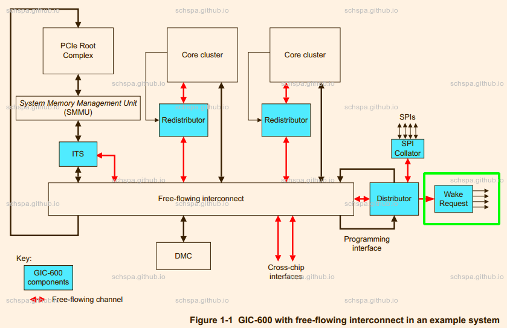

# 术语

TRM: Technical Reference Manual

GIC: Generic Interrupt Controller

smccc: SMC CALLING CONVENTION

# 硬件架构

在本篇文章中基于AARCH64平台, GIC作为中断控制器来进行讨论

下面是GIC-600的系统框架图:

看图可知, Wake Request 模块就是为了唤醒功能提供的信号输出. 

## gic对唤醒功能的支持

在 gic600 的 TRM 手册中, 可以看到 gic600 有 `wake_request` 的输出信号, Power controller 可以根据这个信号来将对应的 cpu 唤醒. 

唤醒信号:

# 

http://www.wowotech.net/pm_subsystem/491.html