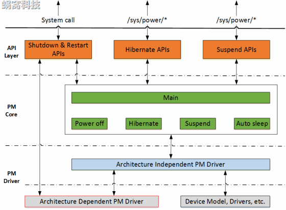

# 概述

Linux系统中那些常规的电源管理手段, 包括关机(Power off)、待机(Standby or Hibernate)、重启(Reboot)等. 这些手段是在嵌入式Linux普及之前的PC或者服务器时代使用的. 在那个计算机科学的蛮荒时代, 人类在摩尔定律的刺激下, 孜孜追求的是计算机的计算能力、处理性能, 因此并不特别关心Power消耗.

在这种背景下发展出来的 Linux 电源管理机制, 都是粗放的、静态的、被动的.

# 表现形式

Linux操作系统中, 和 Generic PM 有关的操作如下:

# 常规电源管理的软件架构

根据上面的描述可知, Generic PM主要处理关机、重启、冬眠(Hibernate)、睡眠(Sleep, 在Kernel中也称作Suspend). 在内核中, 大致可以分为三个软件层次:

API Layer, 用于向用户空间提供接口, 其中关机和重启的接口形式是系统调用(在新的内核中, 关机接口还有一种新方式, 具体讲到的时候再说), Hibernate和Suspend的接口形式是sysfs.

PM Core, 位于kernel/power/目录下, 主要处理和硬件无关的核心逻辑.

PM Driver, 分为两个部分, 一是体系结构无关的Driver, 提供Driver框架(Framework). 另一部分是具体的体系结构相关的Driver, 这也是电源管理驱动开发需要涉及到的内容(图中红色边框的模块).

另外, 电源管理是一个系统级的模块, 因而会涉及到设备模型、进程管理等等方方面面的内容, 我们可以在后续具体的分析过程中, 细细品味.