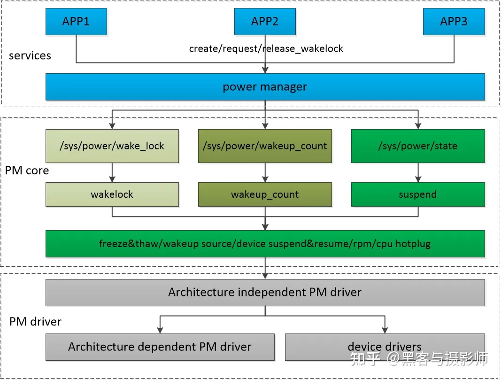
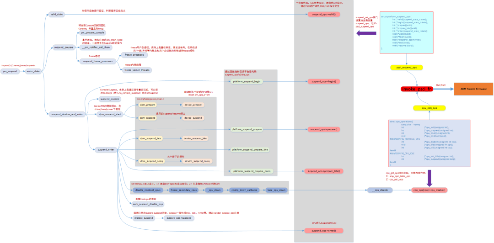
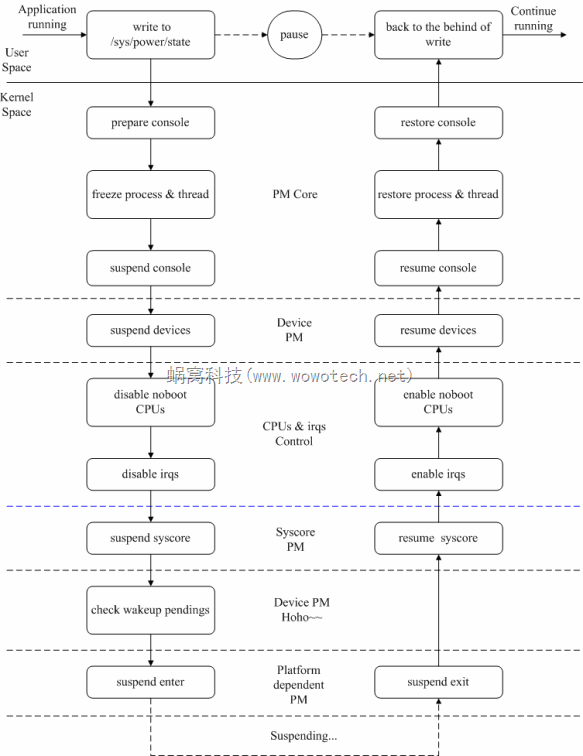
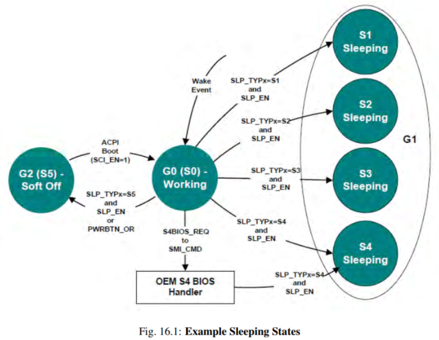
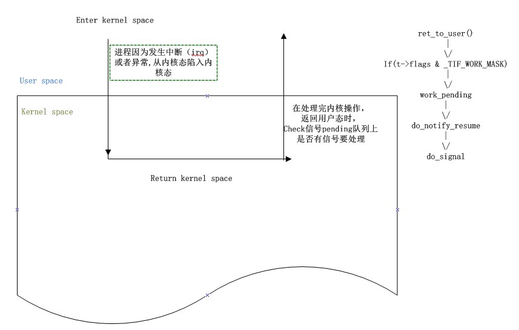
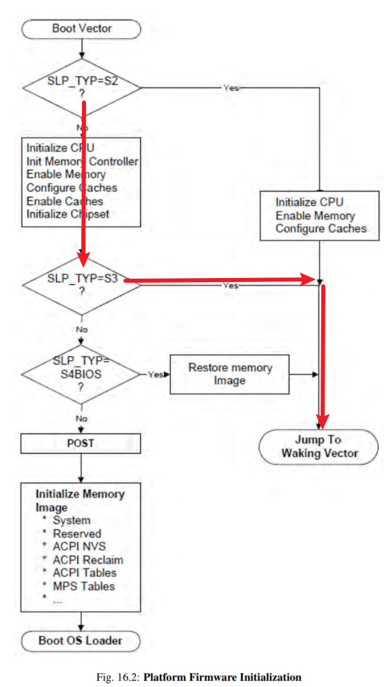
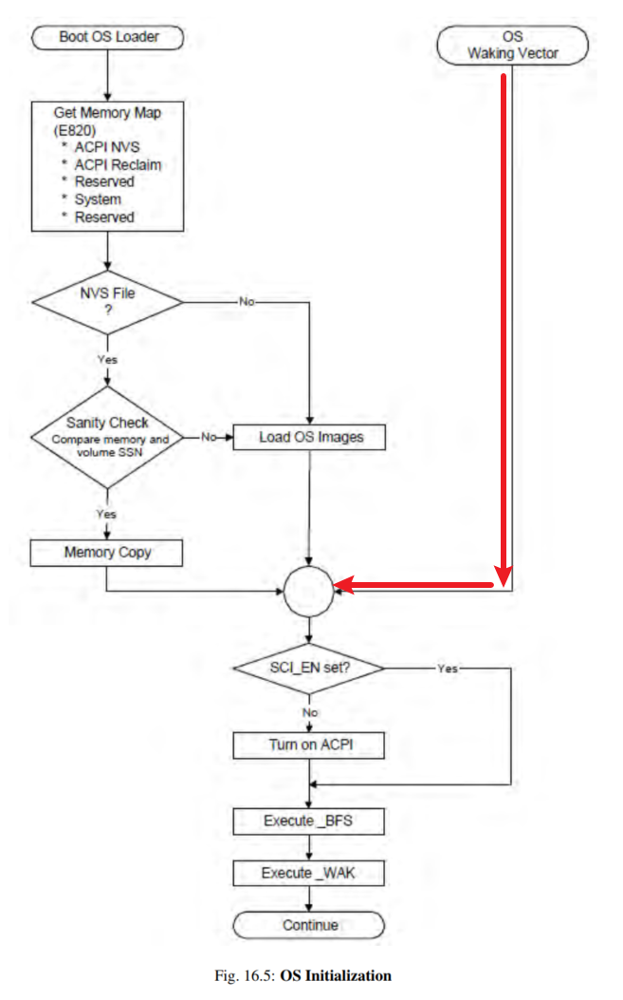

<!-- @import "[TOC]" {cmd="toc" depthFrom=1 depthTo=6 orderedList=false} -->

<!-- code_chunk_output -->

- [1. 介绍](#1-介绍)
- [2. 框架](#2-框架)
  - [2.1. 代码分布](#21-代码分布)
    - [2.1.1. PM core](#211-pm-core)
    - [2.1.2. Device PM](#212-device-pm)
    - [2.1.3. Platform dependent PM](#213-platform-dependent-pm)
- [3. 分析方法](#3-分析方法)
  - [3.1. kernel build](#31-kernel-build)
  - [3.2. OVMF](#32-ovmf)
  - [3.3. 命令行](#33-命令行)
  - [3.4. 相关操作](#34-相关操作)
    - [3.4.1. pm_test](#341-pm_test)
    - [3.4.2. pm_async](#342-pm_async)
  - [3.5. debug 选项](#35-debug-选项)
    - [3.5.1. pm_pr_dbg](#351-pm_pr_dbg)
    - [3.5.2. acpi log](#352-acpi-log)
    - [3.5.3. pm_print_times](#353-pm_print_times)
    - [3.5.4. initcall_debug](#354-initcall_debug)
    - [3.5.5. pm_trace](#355-pm_trace)
    - [3.5.6. console_suspend](#356-console_suspend)
    - [3.5.7. ftrace](#357-ftrace)
      - [3.5.7.1. trace event](#3571-trace-event)
      - [3.5.7.2. suspend 以及 resume 的时间](#3572-suspend-以及-resume-的时间)
        - [3.5.7.2.1. suspend](#35721-suspend)
        - [3.5.7.2.2. resume](#35722-resume)
  - [3.6. 结果](#36-结果)
    - [3.6.1. S2idle](#361-s2idle)
    - [3.6.2. S3](#362-s3)
  - [3.7. 性能评估](#37-性能评估)
- [4. 流程总结](#4-流程总结)
- [5. ACPI 支持](#5-acpi-支持)
- [6. 系统初始化](#6-系统初始化)
- [7. suspend 入口](#7-suspend-入口)
  - [7.1. state_store 函数分析](#71-state_store-函数分析)
  - [7.2. pm_suspend 函数分析](#72-pm_suspend-函数分析)
  - [7.3. enter_state 函数分析](#73-enter_state-函数分析)
- [8. suspend_prepare 函数分析](#8-suspend_prepare-函数分析)
- [9. 进程冻结](#9-进程冻结)
  - [9.1. 用户进程冻结流程](#91-用户进程冻结流程)
  - [9.2. 内核线程冻结](#92-内核线程冻结)
  - [9.3. workqueue 冻结](#93-workqueue-冻结)
  - [9.4. 冻结进程何时被打断](#94-冻结进程何时被打断)
- [10. suspend_devices_and_enter 函数分析](#10-suspend_devices_and_enter-函数分析)
  - [10.1. dpm_suspend_start 函数分析](#101-dpm_suspend_start-函数分析)
  - [10.2. suspend_enter 函数分析](#102-suspend_enter-函数分析)
- [11. 虚拟化支持](#11-虚拟化支持)
  - [查看 guest portio](#查看-guest-portio)
  - [注册 pio](#注册-pio)
  - [guest 写 pm1a/pm1b](#guest-写-pm1apm1b)
- [12. resume 入口](#12-resume-入口)
  - [12.1. native](#121-native)
  - [12.2. OVMF](#122-ovmf)
- [13. kernel 入口](#13-kernel-入口)
- [14. 相关思考](#14-相关思考)
- [15. 关于设备](#15-关于设备)
- [16. 小结](#16-小结)

<!-- /code_chunk_output -->

# 1. 介绍

Linux 中提供了**三种 Suspend**: Freeze、Standby 和 STR(Suspend to RAM), 在用户空间向 "`/sys/power/state`" 文件分别写入 "freeze"、"standby" 和 "mem", 即可触发它们.

在**休眠之前**会**配置唤醒源**, 当系统休眠下去后, 通过这些唤醒源(比如, **按键**、**RTC**、**屏幕**、**USB 拔插**等)可以在需要的时候**唤醒**(resume)系统. 这样在系统进入了休眠状态后, 用户可以选择什么时刻, 通过什么方式将系统快速唤醒, 即兼顾了功耗低, 又兼顾了时间短.

内核中, Suspend 及 Resume 过程涉及到 PM Core 框架, Device PM 框架, 用户进程及内核线程或 worker, 各个设备的驱动, Platform dependent PM, CPU control 等多个模块, 涉及了 console switch, process freeze, CPU hotplug, wakeup 处理, ddr 自刷新等多个知识点.

# 2. 框架



系统休眠唤醒的框架包括三部分: **services**、**PM core**、**PM driver**. PM core 实现 power manage 的核心逻辑, 为上层 services 提供操作休眠唤醒的相关接口, 通过利用底层相关的技术实现休眠唤醒过程中的 cpu hotplug、wakup source enable/disable、设备的`suspend&resume` 等. 上层 service 通过 wakelock 的使用, 在系统不需要工作的时候经由 power manager 利用 PM core 提供的文件节点发起休眠. 然后, 休眠的过程中 PM driver 会配置、取消唤醒源, 调用设备的 `suspend&resume` 函数, 进行 syscore 的 `suspend&resume` 操作.

Services 部分由两类 service 组成, power manager service 及普通的 app service. 其中, power manager service 提供了 wakelock 锁的 create/request/release 管理功能, 当没有 services 持有 wakelock 的话, power manager service 会通过往文件节点 `/sys/power/state` 写 **mem** 发起内核的休眠.

PM core 部分提供了 wakelock(决定是否发起休眠)的实现, `wakeup_count`(用于各 services 释放 wakelock 后, 到发起内核休眠的期间是否有唤醒源, 从而是否进行 resume 的管理)的实现, suspend 的实现. 这三个功能分别向上层提供了相应的文件节点, 供上层操作. 休眠、唤醒的过程中会涉及到进程的 freeze&thaw, wakeup source 的使能、失能, 设备的休眠、唤醒, power domain 的关、开, cpu 的拔、插等功能或框架.

PM driver 部分主要实现了设备驱动的 suspend&resume 实现, 架构驱动(gpio、irq、timer 等)低功耗相关的操作.

## 2.1. 代码分布

内核中 Suspend 功能有关的代码包括 PM core, Device PM, Platform PM 等几大块,具体如下:

### 2.1.1. PM core

```
kernel/power/main.c         ----    提供用户空间接口 (/sys/power/state)

kernel/power/suspend.c      ----    Suspend 功能的主逻辑

kernel/power/suspend_test.c ----    Suspend 功能的测试逻辑

kernel/power/console.c      ----    Suspend 过程中对控制台的处理逻辑

kernel/power/process.c      ----    Suspend 过程中对进程的处理逻辑
```

### 2.1.2. Device PM

```
drivers/base/power/*        ----    具体可参考 "4. 接口" 的描述.

设备驱动                     ----    具体设备驱动的位置,不再涉及.
```

### 2.1.3. Platform dependent PM

```
include/linux/suspend.h     ----    定义 platform dependent PM 有关的操作函数集

arch/xxx/ma ch- xxx/xxx.c 或者

arch/xxx/plat-xxx/xxx.c     ----    平台相关的电源管理操作
```

# 3. 分析方法

利用 qemu-kvm 虚拟化进行分析.

## 3.1. kernel build

```
mkdir build

cp kernel_config build/.config

make olddefconfig O=build

make -j 12 O=build

make modules_install INSTALL_MOD_PATH=rootfs O=build

tar zcvf /home/ubuntu/haiwei/modules.tar.gz ./build/rootfs/lib/modules

cp ./build/arch/x86_64/boot/bzImage /home/ubuntu/haiwei/
```

需要将 modules 拷贝到 guest image 中

## 3.2. OVMF

```
git clone https://github.com/tianocore/edk2.git
cd edks
git submodule update --init

cp BaseTool/Conf/target.template Conf/target.txt
```

编辑 Conf/target.txt

```
ACTIVE_PLATFORM       = OvmfPkg/OvmfPkgX64.dsc
TARGET                = DEBUG
TARGET_ARCH           = X64
TOOL_CHAIN_TAG        = GCC5
```

```
OvmfPkg/build.sh -a X64 -D DEBUG_ON_SERIAL_PORT

ll Build/OvmfX64/DEBUG_GCC5/FV/OVMF.fd
```

## 3.3. 命令行

debug ovmf:

>qemu-system-x86_64 -name ubuntu -accel kvm -drive file=/home/ubuntu/haiwei/edk2/Build/OvmfX64/DEBUG_GCC5/FV/OVMF.fd,format=raw,if=pflash -cpu host -m 2G -smp 2 -drive file=/home/ubuntu/haiwei/ubuntu22.04.qcow2,format=qcow2,if=none,id=drive-virtio-disk0,cache=none -object iothread,id=iothread0 -device virtio-blk-pci,iothread=iothread0,scsi=off,drive=drive-virtio-disk0,id=virtio-disk0,bootindex=1 -netdev user,id=hostnet0 -device rtl8139,netdev=hostnet0,id=net0,mac=52:54:00:36:32:aa,bus=pci.0,addr=0x5 -chardev socket,id=montest,server=on,wait=off,path=/tmp/mon_test -mon chardev=montest,mode=readline -serial mon:stdio -nographic

```shell
/root/workspace/codes/s3/qemu/build/qemu-system-x86_64 \
    -name ubuntu -accel kvm \
    -drive file=/root/workspace/codes/s3/edk2/Build/OvmfX64/DEBUG_GCC5/FV/OVMF.fd,format=raw,if=pflash \
    -cpu host,host-cache-info=true \
    -m 2G -smp 2 \
    -drive file=/root/workspace/tools/ubuntu22.04.qcow2,format=qcow2,if=none,id=drive-virtio-disk0,cache=none \
    -object iothread,id=iothread0 \
    -device virtio-blk-pci,iothread=iothread0,scsi=off,drive=drive-virtio-disk0,id=virtio-disk0,bootindex=1 \
    -netdev user,id=hostnet0 -device rtl8139,netdev=hostnet0,id=net0,mac=52:54:00:36:32:aa,bus=pci.0,addr=0x5 \
    -chardev socket,id=montest,server=on,wait=off,path=/tmp/mon_test -mon chardev=montest,mode=readline \
    -serial mon:stdio -nographic
```

debug kernel:

> qemu-system-x86_64 -name ubuntu -accel kvm -cpu host,host-cache-info=true -m 2G -smp 2 -hda /home/ubuntu/haiwei/ubuntu22.04.qcow2 -netdev user,id=hostnet0 -device rtl8139,netdev=hostnet0,id=net0,mac=52:54:00:36:32:aa,bus=pci.0,addr=0x5 -kernel /home/ubuntu/haiwei/linux/build/arch/x86_64/boot/bzImage -append "root=/dev/sda1 ro console=tty1 console=ttyS0 intel_iommu=sm_on,on loglevel=8 pm_debug_messages dyndbg='file pciehp* +p'" -chardev socket,id=montest,server=on,wait=off,path=/tmp/mon_test -mon chardev=montest,mode=readline -serial mon:stdio -nographic -full-screen

```shell
/root/workspace/codes/s3/qemu/build/qemu-system-x86_64 \
    -name ubuntu -accel kvm \
    -cpu host,host-cache-info=true \
    -m 2G -smp 2 \
    -drive file=/root/workspace/tools/ubuntu22.04.qcow2,format=qcow2,if=none,id=drive-virtio-disk0,cache=none \
    -object iothread,id=iothread0 \
    -device virtio-blk-pci,iothread=iothread0,scsi=off,drive=drive-virtio-disk0,id=virtio-disk0,bootindex=1 \
    -netdev user,id=hostnet0 -device rtl8139,netdev=hostnet0,id=net0,mac=52:54:00:36:32:aa,bus=pci.0,addr=0x5 \
    -kernel /root/workspace/codes/s3/linux/build/arch/x86/boot/bzImage \
    -append "root=/dev/vda1 ro console=tty1 console=ttyS0 intel_iommu=sm_on,on loglevel=8 pm_debug_messages dyndbg='file pciehp* +p'" \
    -chardev socket,id=montest,server=on,wait=off,path=/tmp/mon_test -mon chardev=montest,mode=readline \
    -serial mon:stdio -nographic
```

## 3.4. 相关操作

在 guest 中触发 kernel suspend

```
echo 8 4 1 7 > /proc/sys/kernel/printk

echo 1 > /sys/power/pm_debug_messages

loglevel=8 i915.nuclear_pageflip=1 swiotlb=131072 dyndbg='file pciehp* +p'

systemctl restart rsyslog

echo mem > /sys/power/state
```

在 qemu monitor 中触发 kernel resume

```
# NC -U /TMP/MON_TEST
QEMU 6.2.0 monitor - type 'help' for more information
(qemu) system_wakeup
system_wakeup
```

当然也可以通过 rtcwake 功能:

```
# 让系统进入 S3, 睡 10 秒再自动唤醒

rtcwake -v -s 10 -m mem
```

rtcwake: https://github.com/phien-ntace/rtcwake/blob/master/rtcwake.c

相当于

```
echo +10 > /sys/class/rtc/rtc0/wakealarm && echo mem > /sys/power/state
```

`/sys/class/rtc/rtc0/wakealarm` 表示什么时间 resume 唤醒, `+10` 表明是当前时间 10s 后

### 3.4.1. pm_test

PM test 用于对电源管理功能的测试: `/sys/power/pm_test`

见前一节

### 3.4.2. pm_async

`/sys/power/pm_async`, 使用 async(默认)/sync 的方式执行 suspend/resume 流程.

见前一节

## 3.5. debug 选项

### 3.5.1. pm_pr_dbg

kernel 中的 debug 函数 `pm_pr_dbg()`: 确保 guest kernel 有 `CONFIG_PM_SLEEP_DEBUG` 这个选项, 并且 `echo 1 > /sys/power/pm_debug_messages` 或者添加 kernel parameter `pm_debug_messages`

打开后就会有下面的 log:

```
[17274.251947] PM: Preparing system for sleep (deep)
```

```cpp
// include/linux/suspend.h
#IFDEF CONFIG_PM_SLEEP_DEBUG
extern bool pm_print_times_enabled;
extern bool pm_debug_messages_on;
// 有 CONFIG_PM_SLEEP_DEBUG 就会是这里
extern __printf(2, 3) void __pm_pr_dbg(bool defer, const char *fmt, ...);
#ELSE
#DEFINE PM_PRINT_TIMES_ENABLED  (FALSE)
#DEFINE PM_DEBUG_MESSAGES_ON    (FALSE)

#INCLUDE <LINUX/PRINTK.H>

// 必须定义 CONFIG_PM_SLEEP_DEBUG
#DEFINE __PM_PR_DBG(DEFER, FMT, ...) \
        no_printk(KERN_DEBUG fmt, ##__VA_ARGS__)
#ENDIF
// pm_pr_dbg 的定义
#DEFINE PM_PR_DBG(FMT, ...) \
    __pm_pr_dbg(fmt, ##__VA_ARGS__)

// kernel/power/main.c
// CONFIG_PM_SLEEP_DEBUG 是前提
#IFDEF CONFIG_PM_SLEEP_DEBUG
...
// 对于 pm_debug_messages 的定义
bool pm_debug_messages_on __read_mostly;
static ssize_t pm_debug_messages_store(struct kobject *kobj,
                                       struct kobj_attribute *attr,
                                       const char *buf, size_t n)
{
        unsigned long val;

        if (kstrtoul(buf, 10, &val))
                return -EINVAL;

        if (val > 1)
                return -EINVAL;

        pm_debug_messages_on = !!val;
        return n;
}
static int __init pm_debug_messages_setup(char *str)
{
        pm_debug_messages_on = true;
        return 1;
}
// 内核启动参数
__setup("pm_debug_messages", pm_debug_messages_setup);

void __pm_pr_dbg(bool defer, const char *fmt, ...)
{
        struct va_format vaf;
        va_list args;
        // pm_debug_messages_on 必须是 1
        if (!pm_debug_messages_on)
                return;

        va_start(args, fmt);

        vaf.fmt = fmt;
        vaf.va = &args;

        if (defer)
                printk_deferred(KERN_DEBUG "PM: %pV", &vaf);
        else
                printk(KERN_DEBUG "PM: %pV", &vaf);

        va_end(args);
}

#ELSE /* !CONFIG_PM_SLEEP_DEBUG */
static inline void pm_print_times_init(void) {}
#ENDIF /* CONFIG_PM_SLEEP_DEBUG */
```

### 3.5.2. acpi log

```
echo 0x00003FFF > /sys/module/acpi/parameters/debug_layer

echo 0xF00002FF > /sys/module/acpi/parameters/debug_level
```

### 3.5.3. pm_print_times

```
echo 1 > /sys/power/pm_print_times //在每个设备发起 休眠 和 唤醒 流程的时候就能打印出来
```

```
[32504.406166] rtc rtc0: PM: calling rtc_suspend+0x0/0x180 @ 1067, parent: 00:05
[32504.406175] rtc rtc0: PM: rtc_suspend+0x0/0x180 returned 0 after 0 usecs
......
[32504.407647] rtc_cmos 00:05: PM: calling pnp_bus_suspend+0x0/0x20 @ 1067, parent: pnp0
[32504.407869] rtc_cmos 00:05: PM: pnp_bus_suspend+0x0/0x20 returned 0 after 215 usecs
......
[32504.412482] pci 0000:00:01.0: PM: calling pci_pm_suspend+0x0/0x1b0 @ 1067, parent: pci0000:00
[32504.412488] pci 0000:00:01.0: PM: pci_pm_suspend+0x0/0x1b0 returned 0 after 0 usecs
[32504.412494] pci 0000:00:00.0: PM: calling pci_pm_suspend+0x0/0x1b0 @ 1067, parent: pci0000:00
[32504.412500] pci 0000:00:00.0: PM: pci_pm_suspend+0x0/0x1b0 returned 0 after 0 usecs
...
// suspend 统计
[32504.412617] PM: suspend of devices complete after 30.575 msecs
[32504.412622] PM: start suspend of devices complete after 30.706 msecs
......
[32504.412899] pci 0000:00:01.0: PM: calling pci_pm_suspend_late+0x0/0x50 @ 1067, parent: pci0000:00
[32504.412904] pci 0000:00:01.0: PM: pci_pm_suspend_late+0x0/0x50 returned 0 after 0 usecs
[32504.412910] pci 0000:00:00.0: PM: calling pci_pm_suspend_late+0x0/0x50 @ 1067, parent: pci0000:00
[32504.412916] pci 0000:00:00.0: PM: pci_pm_suspend_late+0x0/0x50 returned 0 after 0 usecs
......
// late suspend 统计
[32504.413011] PM: late suspend of devices complete after 0.385 msecs
......
[32504.414809] pci 0000:00:01.0: PM: calling pci_pm_suspend_noirq+0x0/0x2b0 @ 1067, parent: pci0000:00
[32504.415124] pci 0000:00:01.0: PM: pci_pm_suspend_noirq+0x0/0x2b0 returned 0 after 309 usecs
[32504.415131] pci 0000:00:00.0: PM: calling pci_pm_suspend_noirq+0x0/0x2b0 @ 1067, parent: pci0000:00
[32504.415447] pci 0000:00:00.0: PM: pci_pm_suspend_noirq+0x0/0x2b0 returned 0 after 310 usecs
// noirq suspend 统计
[32504.415503] PM: noirq suspend of devices complete after 2.311 msecs
......
[32507.714071] pci 0000:00:00.0: PM: calling pci_pm_resume_noirq+0x0/0x170 @ 1067, parent: pci0000:00
[32507.714406] pci 0000:00:00.0: PM: pci_pm_resume_noirq+0x0/0x170 returned 0 after 321 usecs
[32507.714413] pci 0000:00:01.0: PM: calling pci_pm_resume_noirq+0x0/0x170 @ 1067, parent: pci0000:00
[32507.714738] pci 0000:00:01.0: PM: pci_pm_resume_noirq+0x0/0x170 returned 0 after 318 usecs
......
// noirq resume 统计
[32507.719333] PM: noirq resume of devices complete after 5.351 msecs
......
[32507.719347] pci 0000:00:00.0: PM: calling pci_pm_resume_early+0x0/0x30 @ 1067, parent: pci0000:00
[32507.719348] pci 0000:00:00.0: PM: pci_pm_resume_early+0x0/0x30 returned 0 after 0 usecs
......
// early resume 统计
[32507.719383] PM: early resume of devices complete after 0.045 msecs
......
[32507.719399] pci 0000:00:00.0: PM: calling pci_pm_resume+0x0/0x100 @ 1067, parent: pci0000:00
[32507.719411] pci 0000:00:00.0: PM: pci_pm_resume+0x0/0x100 returned 0 after 10 usecs
// resume 统计
[32507.727988] PM: resume of devices complete after 8.604 msecs
```

```cpp
// kernel/power/main.c
// 这是基础
#IFDEF CONFIG_PM_SLEEP_DEBUG
// 默认为 0
bool pm_print_times_enabled;

static ssize_t pm_print_times_store(struct kobject *kobj,
                    struct kobj_attribute *attr,
                    const char *buf, size_t n)
{
    unsigned long val;

    if (kstrtoul(buf, 10, &val))
        return -EINVAL;

    if (val > 1)
        return -EINVAL;

    pm_print_times_enabled = !!val;
    return n;
}

power_attr(pm_print_times);

static inline void pm_print_times_init(void)
{
    // 初始化值也取决于系统 initcall_debug 参数,见下面
    pm_print_times_enabled = !!initcall_debug;
}
```

也会根据

### 3.5.4. initcall_debug

内核参数 `initcall_debug`:

`echo Y > /sys/module/kernel/parameters/initcall_debug`

内核启动时候在调用每一个 init 函数前有一句打印, 结束后再有一句打印并且输出了该 Init 函数运行的时间, 通过这个信息可以用来定位启动过程中哪个 init 函数运行失败以及哪些 init 函数运行时间较长.

同时, 在系统休眠唤醒过程中也会增加如下形式的日志,可以用来定位休眠唤醒失败及休眠唤醒时间太长的问题.

```
[  212.905422] pci 0000:00:00.0: calling  quirk_passive_release+0x0/0xa0 @ 9
[  212.905498] pci 0000:00:00.0: quirk_passive_release+0x0/0xa0 took 68 usecs

[   91.436036] mei_hdcp 0000:00:16.0-b638ab7e-94e2-4ea2-a552-d1c54b627f04: bound 0000:00:02.0 (ops i915_hdcp_component_ops [i915])
[   91.436361] probe of 0000:00:16.0-b638ab7e-94e2-4ea2-a552-d1c54b627f04 returned 0 after 834 usecs
```

### 3.5.5. pm_trace

"PM trace" 机制, 在重新启动后会在 RTC 内存中保存最后一次 suspend 或 resume 的 event point.

见前一节.

### 3.5.6. console_suspend

内核启动参数:`no_console_suspend`, 会打印更多 log, 默认会 suspend console

```
echo N > /sys/module/printk/parameters/console_suspend //休眠的时候保持终端打开
```

```
// Y, console_suspend 时候
[31801.619487] printk: Suspending console(s) (use no_console_suspend to debug)

// N, 保持终端打开
不会有上面的 log
```

### 3.5.7. ftrace

ftrace 里的**跟踪机制**总结起来主要有**两种**, 分别是**函数**和**tracepoint**.

* `函数`属于"傻瓜式"操作, GCC 编译会自动在内核函数加入一段代码;

* `tracepoint`可以理解为一个 Linux 内核中的**占位符函数**, 包括 `trace_printk` 和`trace event`, 开发者可以自己定义并多加一些变量等信息.

#### 3.5.7.1. trace event

`suspend&resume` 的 trace event 是 `suspend_resume`, 在 ftrace 中记录 suspend 和 resume 中的时间, 可以用来做性能分析

定义如下:

```cpp
// include/trace/events/power.h
TRACE_EVENT(suspend_resume,

    TP_PROTO(const char *action, int val, bool start),

    TP_ARGS(action, val, start),

    TP_STRUCT__entry(
        __field(const char *, action)
        __field(int, val)
        __field(bool, start)
    ),

    TP_fast_assign(
        __entry->action = action;
        __entry->val = val;
        __entry->start = start;
    ),

    TP_printk("%s[%u] %s", __entry->action, (unsigned int)__entry->val,
        (__entry->start)?"begin":"end")
);
```

```
# ll /sys/kernel/debug/tracing/events/power/suspend_resume/
total 0
drwxr-x---  2 root root 0 11月  7 09:41 ./
drwxr-x--- 26 root root 0 11月  7 09:41 ../
-rw-r-----  1 root root 0 11月  7 09:41 enable
-rw-r-----  1 root root 0 11月  7 09:41 filter
-r--r-----  1 root root 0 11月  7 09:41 format
-r--r-----  1 root root 0 11月  7 09:41 hist
-r--r-----  1 root root 0 11月  7 09:41 id
--w-------  1 root root 0 11月  7 09:41 inject
-rw-r-----  1 root root 0 11月  7 09:41 trigger
```

触发:


```
# cat available_events | grep -i suspend_resume
power:suspend_resume

cd /sys/kernel/debug/tracing
echo nop > current_tracer
echo > trace

echo suspend_resume > set_event
或者
echo 1 > events/power/suspend_resume/enable

echo 1 > tracing_on

rtcwake -v -s 3 -m mem

echo 0 > tracing_on

echo > set_event
或者
echo 0 > events/power/suspend_resume/enable

cp /sys/kernel/debug/tracing/trace /data/perf_test/suspend_resume
```

结果如下:

```
# TRACER: NOP
#
# ENTRIES-IN-BUFFER/ENTRIES-WRITTEN: 38/38   #P:2
#
#                                _-----=> IRQS-OFF/BH-DISABLED
#                               / _----=> NEED-RESCHED
#                              | / _---=> HARDIRQ/SOFTIRQ
#                              || / _--=> PREEMPT-DEPTH
#                              ||| / _-=> MIGRATE-DISABLE
#                              |||| /     DELAY
#           TASK-PID     CPU#  |||||  TIMESTAMP  FUNCTION
#              | |         |   |||||     |         |
         rtcwake-999     [000] ..... 17274.256805: suspend_resume: suspend_enter[3] begin
         rtcwake-999     [000] ..... 17274.256808: suspend_resume: sync_filesystems[0] begin
         rtcwake-999     [000] ..... 17274.256921: suspend_resume: sync_filesystems[0] end
         rtcwake-999     [000] ..... 17274.257031: suspend_resume: freeze_processes[0] begin
         rtcwake-999     [000] ..... 17274.259735: suspend_resume: freeze_processes[0] end
         rtcwake-999     [000] ..... 17274.259736: suspend_resume: suspend_enter[3] end
         rtcwake-999     [000] ..... 17274.259756: suspend_resume: dpm_prepare[2] begin
         rtcwake-999     [000] ..... 17274.259879: suspend_resume: dpm_prepare[2] end
         rtcwake-999     [000] ..... 17274.259880: suspend_resume: dpm_suspend[2] begin
         rtcwake-999     [000] ..... 17274.274770: suspend_resume: dpm_suspend[2] end
         rtcwake-999     [000] ..... 17274.274776: suspend_resume: dpm_suspend_late[2] begin
         rtcwake-999     [000] ..... 17274.275116: suspend_resume: dpm_suspend_late[2] end
         rtcwake-999     [000] ..... 17274.275326: suspend_resume: dpm_suspend_noirq[2] begin
         rtcwake-999     [000] ..... 17274.277697: suspend_resume: dpm_suspend_noirq[2] end
         rtcwake-999     [000] ..... 17274.277841: suspend_resume: CPU_OFF[1] begin
         rtcwake-999     [000] ..... 17274.280291: suspend_resume: CPU_OFF[1] end
         rtcwake-999     [000] d.... 17274.280293: suspend_resume: syscore_suspend[0] begin
         rtcwake-999     [000] d.... 17274.281350: suspend_resume: syscore_suspend[0] end
         rtcwake-999     [000] d.... 17274.281351: suspend_resume: machine_suspend[3] begin
         rtcwake-999     [000] d.... 17274.281352: suspend_resume: acpi_suspend[3] begin
         rtcwake-999     [000] d.... 17277.910406: suspend_resume: acpi_suspend[3] end
         rtcwake-999     [000] d.... 17277.910429: suspend_resume: machine_suspend[3] end
         rtcwake-999     [000] d.... 17277.910430: suspend_resume: syscore_resume[0] begin
         rtcwake-999     [000] dN... 17277.911072: suspend_resume: syscore_resume[0] end
         rtcwake-999     [000] ..... 17277.911094: suspend_resume: CPU_ON[1] begin
         rtcwake-999     [000] ..... 17277.911548: suspend_resume: CPU_ON[1] end
         rtcwake-999     [000] ..... 17277.911626: suspend_resume: dpm_resume_noirq[16] begin
         rtcwake-999     [000] ..... 17277.913595: suspend_resume: dpm_resume_noirq[16] end
         rtcwake-999     [000] ..... 17277.913599: suspend_resume: dpm_resume_early[16] begin
         rtcwake-999     [000] ..... 17277.913730: suspend_resume: dpm_resume_early[16] end
         rtcwake-999     [000] ..... 17277.913730: suspend_resume: dpm_resume[16] begin
         rtcwake-999     [001] ..... 17277.919752: suspend_resume: dpm_resume[16] end
         rtcwake-999     [001] ..... 17277.919753: suspend_resume: dpm_complete[16] begin
         rtcwake-999     [001] ..... 17277.919819: suspend_resume: dpm_complete[16] end
         rtcwake-999     [001] ..... 17277.919819: suspend_resume: resume_console[3] begin
         rtcwake-999     [001] ..... 17277.921475: suspend_resume: resume_console[3] end
         rtcwake-999     [001] ..... 17277.921483: suspend_resume: thaw_processes[0] begin
         rtcwake-999     [000] ..... 17277.922266: suspend_resume: thaw_processes[0] end
```

#### 3.5.7.2. suspend 以及 resume 的时间

以上机制都会有运行时间以及有些会有打印开销的, 所以不能用来作为系统 suspend/resume 的时间开销计算, 用来做 performance 分析比较合适

对于 OS的 S3 来说(不考虑虚拟化场景以及hw开销), 时间是:

* Suspend: 从 kernel 的 `state_store()` 函数(`echo mem > /sys/power/state` 入口, 或者 `pm_suspend()`)  到 `acpi_hw_write_pm1_control()` 函数(写 acpi reg)的时间

* Resume: 从 `wakingvector` (`real_mode_header->wakeup_start`) 到 打印 log "`PM: suspend exit`"(`pm_suspend()` 函数中)的时间

OS 中的 suspend 以及 resume 时间统计可以按照下面策略:

##### 3.5.7.2.1. suspend

方法一: 两个函数都是有 trace event 的(function trace), 所以可以通过ftrace(function tracer) 得到 suspend 时间

```
cd /sys/kernel/debug/tracing
echo 0 > tracing_on
echo function > current_tracer
echo > trace
echo pm_suspend > set_ftrace_filter
echo acpi_hw_write_pm1_control >> set_ftrace_filter
echo 1 > tracing_on

rtcwake -v -s 3 -m mem

echo 0 > tracing_on


# cat set_ftrace_filter
pm_suspend
acpi_hw_write_pm1_control
```

查看结果

```
# tracer: function

#

# entries-in-buffer/entries-written: 4/4   #P:32

#

#                                _-----=> irqs-off/BH-disabled

#                               / _----=> need-resched

#                              | / _---=> hardirq/softirq

#                              || / _--=> preempt-depth

#                              ||| / _-=> migrate-disable

#                              |||| /     delay

#           TASK-PID     CPU#  |||||  TIMESTAMP  FUNCTION

#              | |         |   |||||     |         |

         rtcwake-4226    [012] ...1.  6766.844902: pm_suspend <-state_store

         rtcwake-4226    [000] d..2.  6767.237895: acpi_hw_write_pm1_control <-acpi_hw_legacy_sleep

         rtcwake-4226    [000] d..2.  6767.245267: acpi_hw_write_pm1_control <-acpi_hw_legacy_sleep

         rtcwake-4226    [000] d..1.  6767.245267: acpi_hw_write_pm1_control <-acpi_hw_legacy_wake_prep
```

为上面为例, suspend 在我当前系统中时间是 `6767.245267 - 6766.844902`

方法二: 根据kernel 中的代码流程, 有两个 `trace event`(trace point)就在上面那两个函数附近, 分别是 `trace_suspend_resume(TPS("suspend_enter"), state, true)` 和 `trace_suspend_resume(TPS("acpi_suspend"), acpi_state, true);`, 所以可以利用这两个 trace point进行时间统计

```
cd /sys/kernel/debug/tracing

echo nop > current_tracer

echo > trace

echo 1 > events/power/suspend_resume/enable

echo 'start == 1 && (action == "suspend_enter" || action == "acpi_suspend")' > events/power/suspend_resume/filter
```

结果类似于:

```
# tracer: nop

#

# entries-in-buffer/entries-written: 2/2   #P:32

#

#                                _-----=> irqs-off/BH-disabled

#                               / _----=> need-resched

#                              | / _---=> hardirq/softirq

#                              || / _--=> preempt-depth

#                              ||| / _-=> migrate-disable

#                              |||| /     delay

#           TASK-PID     CPU#  |||||  TIMESTAMP  FUNCTION

#              | |         |   |||||     |         |

         rtcwake-5622    [003] ..... 25290.381541: suspend_resume: suspend_enter[3] begin

         rtcwake-5622    [000] d.... 25290.774597: suspend_resume: acpi_suspend[3] begin
```

##### 3.5.7.2.2. resume

也有两个 trace event(trace point), 分别是 `trace_suspend_resume(TPS("acpi_suspend"), acpi_state, false);` 和 `trace_suspend_resume(TPS("thaw_processes"), 0, false);`

```
cd /sys/kernel/debug/tracing

echo nop > current_tracer

echo > trace

echo 1 > events/power/suspend_resume/enable

echo 'start == 0 && (action == "thaw_processes" || action == "acpi_suspend")' > events/power/suspend_resume/filter
```

结果类似于:

```
rtcwake-5653    [000] d.... 25791.342523: suspend_resume: acpi_suspend[3] end
rtcwake-5653    [002] ..... 25792.149064: suspend_resume: thaw_processes[0] en
```

当然也可以找两个函数作为 trace event 进行统计.

## 3.6. 结果

### 3.6.1. S2idle

native OS 执行 s2idle的 log

```
[3012215.576826] PM: suspend entry (s2idle)
[3012215.577860] Filesystems sync: 0.001 seconds
[3012215.588144] Freezing user space processes
[3012215.591309] Freezing user space processes completed (elapsed 0.003 seconds)
[3012215.591318] OOM killer disabled.
[3012215.591320] Freezing remaining freezable tasks
[3012215.592726] Freezing remaining freezable tasks completed (elapsed 0.001 seconds)
[3012215.592735] printk: Suspending console(s) (use no_console_suspend to debug)
[3012215.651152] serial 00:03: disabled
[3012215.651798] e1000e: EEE TX LPI TIMER: 00000011
[3012215.672729] sd 4:0:0:0: [sda] Synchronizing SCSI cache
[3012215.673090] sd 4:0:0:0: [sda] Stopping disk
[3012216.006795] ACPI: EC: interrupt blocked
[3012218.242571] ACPI: EC: interrupt unblocked
[3012218.285474] serial 00:03: activated
[3012218.292369] i915 0000:00:02.0: [drm] GT0: GuC firmware i915/tgl_guc_70.bin version 70.5.1
[3012218.292373] i915 0000:00:02.0: [drm] GT0: HuC firmware i915/tgl_huc.bin version 7.9.3
[3012218.294791] i915 0000:00:02.0: [drm] GT0: HuC: authenticated for all workloads
[3012218.295309] i915 0000:00:02.0: [drm] GT0: GUC: submission enabled
[3012218.295311] i915 0000:00:02.0: [drm] GT0: GUC: SLPC enabled
[3012218.295721] i915 0000:00:02.0: [drm] GT0: GUC: RC enabled
[3012218.434745] nvme nvme0: 15/0/0 default/read/poll queues
[3012218.634448] ata5: SATA link up 6.0 Gbps (SStatus 133 SControl 300)
[3012218.634466] ata7: SATA link down (SStatus 4 SControl 300)
[3012218.634483] ata6: SATA link down (SStatus 4 SControl 300)
[3012218.635307] ata5.00: ACPI cmd 00/00:00:00:00:00:a0(NOP) rejected by device (Stat=0x51 Err=0x04)
[3012218.638326] ata8: SATA link down (SStatus 4 SControl 300)
[3012221.889063] e1000e 0000:00:1f.6 enp0s31f6: NIC Link is Up 1000 Mbps Full Duplex, Flow Control: None
[3012222.424211] ata5.00: ACPI cmd 00/00:00:00:00:00:a0(NOP) rejected by device (Stat=0x51 Err=0x04)
[3012222.425069] ata5.00: configured for UDMA/133
[3012222.426425] OOM killer enabled.
[3012222.426428] Restarting tasks ...
[3012222.426452] mei_hdcp 0000:00:16.0-b638ab7e-94e2-4ea2-a552-d1c54b627f04: bound 0000:00:02.0 (ops i915_hdcp_ops [i915])
[3012222.427330] mei_pxp 0000:00:16.0-fbf6fcf1-96cf-4e2e-a6a6-1bab8cbe36b1: bound 0000:00:02.0 (ops i915_pxp_tee_component_ops [i915])
[3012222.430539] done.
[3012222.430555] random: crng reseeded on system resumption
[3012222.433892] PM: suspend exit
```

### 3.6.2. S3

guest 进入 S3 的自身日志

```
[   38.671957] PM: suspend entry (deep)
[   38.671977] ACPI: PM: acpi_suspend_state_valid 662
[   39.044905] Filesystems sync: 0.372 seconds
[   39.044918] PM: Preparing system for sleep (deep)
[   39.044923] ACPI: PM: acpi_suspend_state_valid 662
[   39.045527] Freezing user space processes
[   39.047035] Freezing user space processes completed (elapsed 0.001 seconds)
[   39.047049] OOM killer disabled.
[   39.047053] Freezing remaining freezable tasks
[   39.048322] Freezing remaining freezable tasks completed (elapsed 0.001 seconds)
[   39.048351] PM: Suspending system (deep)
[   39.048356] ACPI: PM: acpi_suspend_state_valid 662
[   39.048362] ACPI: PM: acpi_suspend_begin 566 1
[   39.048367] ACPI: PM: acpi_suspend_begin 576
[   39.048371] ACPI: PM: acpi_pm_start 522
[   39.048375] ACPI: PM: acpi_sleep_tts_switch 40 3
[   39.048407] printk: Suspending console(s) (use no_console_suspend to debug)
[   39.052935] ------------[ cut here ]------------
[   39.052947] WARNING: CPU: 0 PID: 667 at kernel/workqueue.c:3167 __flush_work.isr0
[   39.052965] Modules linked in: binfmt_misc nls_iso8859_1 intel_rapl_msr intel_ra4
[   39.053118] CPU: 0 PID: 667 Comm: kworker/u4:8 Not tainted 6.3.0-dirty #4
[   39.053125] Hardware name: QEMU Standard PC (i440FX + PIIX, 1996), BIOS 1.15.0-14
[   39.053129] Workqueue: events_unbound async_run_entry_fn
[   39.053140] RIP: 0010:__flush_work.isra.0+0x7c/0x90
[   39.053150] Code: 48 2b 14 25 28 00 00 00 75 26 4c 8b 65 f8 c9 c3 cc cc cc cc 480
[   39.053156] RSP: 0000:ffffaadb40ddbc38 EFLAGS: 00010246
[   39.053162] RAX: 0000000000000001 RBX: 0000000000000000 RCX: ffffffffa7dc7b60
[   39.053167] RDX: 0000000000000001 RSI: 0000000000000001 RDI: ffff907ac3556b30
[   39.053171] RBP: ffffaadb40ddbc98 R08: 0000000000000000 R09: ffff907ac9b88f74
[   39.053174] R10: 000000000000000f R11: 000000000000000f R12: ffff907ac3556b30
[   39.053177] R13: 0000000000000001 R14: ffff907ac2f70000 R15: 0000000000000002
[   39.053181] FS:  0000000000000000(0000) GS:ffff907b3dc00000(0000) knlGS:000000000
[   39.053186] CS:  0010 DS: 0000 ES: 0000 CR0: 0000000080050033
[   39.053191] CR2: 00007fb063930768 CR3: 000000000dc1a001 CR4: 0000000000370ef0
[   39.053202] DR0: 0000000000000000 DR1: 0000000000000000 DR2: 0000000000000000
[   39.053206] DR3: 0000000000000000 DR6: 00000000fffe0ff0 DR7: 0000000000000400
[   39.053210] Call Trace:
[   39.053223]  <TASK>
[   39.053226]  ? native_send_call_func_single_ipi+0x1b/0x30
[   39.053248]  ? try_to_grab_pending+0xe8/0x190
[   39.053257]  __cancel_work_timer+0x11d/0x1a0
[   39.053267]  ? _raw_spin_unlock_irq+0xe/0x30
[   39.053274]  ? __wait_for_common+0x15b/0x190
[   39.053280]  ? _raw_spin_unlock_irqrestore+0xe/0x40
[   39.053291]  cancel_delayed_work_sync+0x13/0x20
[   39.053301]  drm_kms_helper_poll_disable+0x33/0x50 [drm_kms_helper]
[   39.053518]  drm_mode_config_helper_suspend+0x21/0x80 [drm_kms_helper]
[   39.053573]  ? __pm_runtime_resume+0x60/0x90
[   39.053582]  bochs_pm_suspend+0x12/0x20 [bochs]
[   39.053605]  pci_pm_suspend+0x87/0x1b0
[   39.053613]  ? __pfx_pci_pm_suspend+0x10/0x10
[   39.053620]  dpm_run_callback+0x51/0x190
[   39.053631]  __device_suspend+0x14c/0x550
[   39.053641]  async_suspend+0x1f/0x80
[   39.053650]  async_run_entry_fn+0x30/0x120
[   39.053658]  process_one_work+0x21c/0x430
[   39.053669]  worker_thread+0x50/0x3e0
[   39.053678]  ? __pfx_worker_thread+0x10/0x10
[   39.053687]  kthread+0xee/0x120
[   39.053692]  ? __pfx_kthread+0x10/0x10
[   39.053699]  ret_from_fork+0x29/0x50
[   39.053715]  </TASK>
[   39.053718] ---[ end trace 0000000000000000 ]---
[   39.069215] sd 0:0:0:0: [sda] Synchronizing SCSI cache
[   39.088687] sd 0:0:0:0: [sda] Stopping disk
[   39.091265] PM: suspend of devices complete after 42.674 msecs
[   39.091277] PM: start suspend of devices complete after 42.863 msecs
[   39.091803] PM: late suspend of devices complete after 0.497 msecs
[   39.095185] PM: noirq suspend of devices complete after 3.036 msecs
[   39.095228] ACPI: PM: acpi_sleep_prepare 78 0x991f0
[   39.095236] ACPI: PM: Preparing to enter system sleep state S3
[   39.095393] ACPI: PM: Saving platform NVS memory
[   39.095425] Disabling non-boot CPUs ...
[   39.098174] smpboot: CPU 1 is now offline
[   39.099593] Checking wakeup interrupts
[   39.099596] Calling kvm_suspend+0x0/0x40 [kvm]
[   39.100325] Calling mce_syscore_suspend+0x0/0x30
[   39.100336] Calling ledtrig_cpu_syscore_suspend+0x0/0x20
[   39.100347] Calling timekeeping_suspend+0x0/0x2e0
[   39.100399] Calling irq_gc_suspend+0x0/0x80
[   39.100414] Calling save_ioapic_entries+0x0/0x160
[   39.101278] Calling i8259A_suspend+0x0/0x30
[   39.101296] Calling fw_suspend+0x0/0x20
[   39.101304] Calling acpi_save_bm_rld+0x0/0x30
[   39.101343] Calling lapic_suspend+0x0/0x220
[   39.101873] Calling kvm_suspend+0x0/0x60
[   39.102037] ACPI Error: !acpi_gbl_reduced_hardware (20221020/hwxfsleep-301)
[   43.626252] ACPI: PM: Low-level resume complete
[   43.626299] ACPI Error: 2    !acpi_gbl_reduced_hardware (20221020/hwxfsleep-333)
[   43.626340] ACPI: PM: Restoring platform NVS memory
[   43.626344] Calling kvm_resume+0x0/0x50
[   43.626360] Calling lapic_resume+0x0/0x2e0
[   43.626470] Calling acpi_restore_bm_rld+0x0/0x60
[   43.626476] Calling irqrouter_resume+0x0/0x50
[   43.626715] Calling i8259A_resume+0x0/0x40
[   43.626845] Calling i8237A_resume+0x0/0xb0
[   43.626960] Calling ioapic_resume+0x0/0x140
[   43.627173] Calling irq_gc_resume+0x0/0x80
[   43.627177] Calling irq_pm_syscore_resume+0x0/0x20
[   43.627193] Calling timekeeping_resume+0x0/0x160
[   43.627236] Timekeeping suspended for 5.214 seconds
[   43.627314] Calling ledtrig_cpu_syscore_resume+0x0/0x20
[   43.627321] Calling mce_syscore_resume+0x0/0x30
[   43.627361] Calling kvm_resume+0x0/0x60 [kvm]
[   43.627494] Enabling non-boot CPUs ...
[   43.627619] x86: Booting SMP configuration:
[   43.627620] smpboot: Booting Node 0 Processor 1 APIC 0x1
[   43.628438] CPU1 is up
[   43.628564] ACPI: PM: Waking up from system sleep state S3
[   43.630229] PM: noirq resume of devices complete after 1.595 msecs
[   43.630323] PM: early resume of devices complete after 0.077 msecs
[   43.630355] pci 0000:00:01.0: PIIX3: Enabling Passive Release
[   43.630443] sd 0:0:0:0: [sda] Starting disk
[   43.788863] ata1: found unknown device (class 0)
[   43.792837] ata2: found unknown device (class 0)
[   43.793043] PM: resume of devices complete after 162.718 msecs
[   43.815034] ACPI: PM: acpi_sleep_tts_switch 40 0
[   43.815071] PM: Finishing wakeup.
[   43.815462] OOM killer enabled.
[   43.815465] Restarting tasks ... done.
[   43.822100] random: crng reseeded on system resumption
[   43.822109] PM: suspend exit
```

`PM: suspend entry (deep)`, `pm_suspend()`,

`Filesystems sync: 0.001 seconds`, `pm_suspend()` -> `enter_state()` -> `ksys_sync_helper()`, `kernel/power/main.c`

`PM: Preparing system for sleep (deep)`, `pm_suspend()` -> `enter_state()`, `kernel/power/suspend.c`

`Freezing user space processes ... (elapsed 0.001 seconds) done.`, `pm_suspend()` -> `enter_state()` -> `suspend_prepare()` -> `suspend_freeze_processes()` -> `freeze_processes()`, `kernel/power/process.c`

`OOM killer disabled.`,  -> `oom_killer_disable()`, `mm/oom_kill.c`

`Freezing remaining freezable tasks ... (elapsed 0.000 seconds) done.`,  -> `freeze_kernel_threads()`, `kernel/power/process.c`

`PM: Suspending system (deep)`, `pm_suspend()` -> `enter_state()`, `kernel/power/suspend.c`

`printk: Suspending console(s) (use no_console_suspend to debug)`, `suspend_devices_and_enter()` -> `suspend_console()`, `kernel/printk/printk.c`

`e1000e: EEE TX LPI TIMER: 00000011`, `e1000_pm_ops->suspend`, `e1000e_pm_suspend()` -> `e1000e_flush_lpic()`, `drivers/net/ethernet/intel/e1000e/netdev.c`

`ACPI: EC: interrupt blocked`, `SET_NOIRQ_SYSTEM_SLEEP_PM_OPS(acpi_ec_suspend_noirq, acpi_ec_resume_noirq)`, `acpi_ec_suspend_noirq()` -> `acpi_ec_enter_noirq()`, `drivers/acpi/ec.c`

`ACPI: PM: Preparing to enter system sleep state S3`, `acpi_sleep_prepare()`, 其中会调用 `acpi_set_waking_vector(acpi_wakeup_address);`, 设置 waking vector

qemu monitor 触发 system_wakeup, guest 那边 OVMF 日志:

```
SecCoreStartupWithStack(0xFFFCC000, 0x820000)
Register PPI Notify: DCD0BE23-9586-40F4-B643-06522CED4EDE
Install PPI: 8C8CE578-8A3D-4F1C-9935-896185C32DD3
Install PPI: 5473C07A-3DCB-4DCA-BD6F-1E9689E7349A
The 0th FV start address is 0x00000820000, size is 0x000E0000, handle is 0x820000
Register PPI Notify: 49EDB1C1-BF21-4761-BB12-EB0031AABB39
Register PPI Notify: EA7CA24B-DED5-4DAD-A389-BF827E8F9B38
Install PPI: B9E0ABFE-5979-4914-977F-6DEE78C278A6
Install PPI: DBE23AA9-A345-4B97-85B6-B226F1617389
Install PPI: 138F9CF4-F0E7-4721-8F49-F5FFECF42D40
DiscoverPeimsAndOrderWithApriori(): Found 0x8 PEI FFS files in the 0th FV
Loading PEIM 9B3ADA4F-AE56-4C24-8DEA-F03B7558AE50
Loading PEIM at 0x0000082BF40 EntryPoint=0x0000082F2CE PcdPeim.efi
Install PPI: 06E81C58-4AD7-44BC-8390-F10265F72480
Install PPI: 01F34D25-4DE2-23AD-3FF3-36353FF323F1
Install PPI: 4D8B155B-C059-4C8F-8926-06FD4331DB8A
Install PPI: A60C6B59-E459-425D-9C69-0BCC9CB27D81
Register PPI Notify: 605EA650-C65C-42E1-BA80-91A52AB618C6
Loading PEIM A3610442-E69F-4DF3-82CA-2360C4031A23
Loading PEIM at 0x00000830EC0 EntryPoint=0x00000832377 ReportStatusCodeRouterPei.efi
Install PPI: 0065D394-9951-4144-82A3-0AFC8579C251
Install PPI: 229832D3-7A30-4B36-B827-F40CB7D45436
Loading PEIM 9D225237-FA01-464C-A949-BAABC02D31D0
Loading PEIM at 0x00000833040 EntryPoint=0x000008343E6 StatusCodeHandlerPei.efi
Loading PEIM 222C386D-5ABC-4FB4-B124-FBB82488ACF4
Loading PEIM at 0x000008351C0 EntryPoint=0x0000083CE9E PlatformPei.efi
Platform PEIM Loaded
CMOS:
00: 00 00 03 00 09 00 05 29 06 23 26 02 00 80 00 FE
10: 50 00 00 00 07 80 02 FF FF 00 00 00 00 00 00 00
20: 00 00 00 00 00 00 00 00 00 00 00 00 00 00 00 00
30: FF FF 20 00 00 7F 00 20 30 00 00 00 00 12 00 00
40: 00 00 00 00 00 00 00 00 00 00 00 00 00 00 00 00
50: 00 00 00 00 00 00 00 00 00 00 00 00 00 00 00 01
60: 00 00 00 00 00 00 00 00 00 00 00 00 00 00 00 00
70: 00 00 00 00 00 00 00 00 00 00 00 00 00 00 00 00
QemuFwCfgProbe: Supported 1, DMA 1
Select Item: 0x19
Select Item: 0x29
S3 support was detected on QEMU
BootModeInitialization
2 BootModeInitialization
Install PPI: 7408D748-FC8C-4EE6-9288-C4BEC092A410
Select Item: 0x19
Select Item: 0x25
Select Item: 0x19
PlatformAddressWidthFromCpuid: Signature: 'GenuineIntel', PhysBits: 39, QemuQuirk: On, Valid: Yes
PlatformDynamicMmioWindow: using dynamic mmio window
PlatformDynamicMmioWindow:   Addr Space 0x8000000000 (512 GB)
PlatformDynamicMmioWindow:   MMIO Space 0x1000000000 (64 GB)
Select Item: 0x19
Select Item: 0x25
PlatformDynamicMmioWindow:   Pci64 Base 0x7000000000
PlatformDynamicMmioWindow:   Pci64 Size 0x1000000000
Select Item: 0x5
PlatformMaxCpuCountInitialization: BootCpuCount=2 MaxCpuCount=2
Select Item: 0x19
Select Item: 0x25
PlatformGetLowMemoryCB: LowMemory=0x80000000
PeiInstallPeiMemory MemoryBegin 0x7FF70000, MemoryLength 0x90000
Select Item: 0x19
Select Item: 0x25
PlatformQemuInitializeRam called
Select Item: 0x19
Select Item: 0x25
Register PPI Notify: EE16160A-E8BE-47A6-820A-C6900DB0250A
Select Item: 0x19
Select Item: 0x26
Register PPI Notify: EE16160A-E8BE-47A6-820A-C6900DB0250A
Temp Stack : BaseAddress=0x818000 Length=0x8000
Temp Heap  : BaseAddress=0x810000 Length=0x8000
Total temporary memory:    65536 bytes.
  temporary memory stack ever used:       29960 bytes.
  temporary memory heap used for HobList: 6128 bytes.
  temporary memory heap occupied by memory pages: 0 bytes.
Old Stack size 32768, New stack size 131072
Stack Hob: BaseAddress=0x7FF70000 Length=0x20000
Heap Offset = 0x7F780000 Stack Offset = 0x7F770000
TemporaryRamMigration(0x810000, 0x7FF88000, 0x10000)
Reinstall PPI: 8C8CE578-8A3D-4F1C-9935-896185C32DD3
Reinstall PPI: 5473C07A-3DCB-4DCA-BD6F-1E9689E7349A
Reinstall PPI: B9E0ABFE-5979-4914-977F-6DEE78C278A6
Install PPI: F894643D-C449-42D1-8EA8-85BDD8C65BDE
Loading PEIM 86D70125-BAA3-4296-A62F-602BEBBB9081
Loading PEIM at 0x00000842640 EntryPoint=0x00000845B05 DxeIpl.efi
Register PPI Notify: F894643D-C449-42D1-8EA8-85BDD8C65BDE
Install PPI: 0AE8CE5D-E448-4437-A8D7-EBF5F194F731
Notify: PPI Guid: F894643D-C449-42D1-8EA8-85BDD8C65BDE, Peim notify entry point: 843FD6
Install PPI: 1A36E4E7-FAB6-476A-8E75-695A0576FDD7
Loading PEIM 89E549B0-7CFE-449D-9BA3-10D8B2312D71
Loading PEIM at 0x000008472C0 EntryPoint=0x00000849E18 S3Resume2Pei.efi
Install PPI: 6D582DBC-DB85-4514-8FCC-5ADF6227B147
Loading PEIM EDADEB9D-DDBA-48BD-9D22-C1C169C8C5C6
Loading PEIM at 0x0000084BC40 EntryPoint=0x00000851787 CpuMpPei.efi
Register PPI Notify: F894643D-C449-42D1-8EA8-85BDD8C65BDE
Notify: PPI Guid: F894643D-C449-42D1-8EA8-85BDD8C65BDE, Peim notify entry point: 85499C
AP Loop Mode is 1
AP Vector: non-16-bit = 7FFE6000/447
WakeupBufferStart = 9F000, WakeupBufferSize = 1000
AP Vector: 16-bit = 9F000/39, ExchangeInfo = 9F039/A4
CpuMpPei: 5-Level Paging = 0
APIC MODE is 1
MpInitLib: Find 2 processors in system.
GetMicrocodePatchInfoFromHob: Microcode patch cache HOB is not found.
CpuMpPei: 5-Level Paging = 0
CPU[0000]: Microcode revision = 00000000, expected = 00000000
CPU[0001]: Microcode revision = 00000000, expected = 00000000
Register PPI Notify: 8F9D4825-797D-48FC-8471-845025792EF6
Does not find any stored CPU BIST information from PPI!
  APICID - 0x00000000, BIST - 0x00000000
  APICID - 0x00000001, BIST - 0x00000000
Install PPI: 9E9F374B-8F16-4230-9824-5846EE766A97
Install PPI: 5CB9CB3D-31A4-480C-9498-29D269BACFBA
Install PPI: EE16160A-E8BE-47A6-820A-C6900DB0250A
Notify: PPI Guid: EE16160A-E8BE-47A6-820A-C6900DB0250A, Peim notify entry point: 8372F1
PlatformPei: ClearCacheOnMpServicesAvailable
CpuMpPei: 5-Level Paging = 0
Notify: PPI Guid: EE16160A-E8BE-47A6-820A-C6900DB0250A, Peim notify entry point: 838B44
CpuMpPei: 5-Level Paging = 0

DXE IPL Entry

Enter S3 PEIM
AcpiS3Context = 7FB65000
Waking Vector = 9A1F0
AcpiS3Context->AcpiFacsTable = 7FBDD000
AcpiS3Context->IdtrProfile = 7FB64000
AcpiS3Context->S3NvsPageTableAddress = 7FB59000
AcpiS3Context->S3DebugBufferAddress = 7FB50000
AcpiS3Context->BootScriptStackBase = 7FB51000
AcpiS3Context->BootScriptStackSize = 8000
EfiBootScriptExecutorVariable->BootScriptExecutorEntrypoint = 7FB3B49F
S3NvsPageTableAddress - 7FB59000 (1)

S3ResumeExecuteBootScript()
PeiS3ResumeState - 7FF92908
transfer control to Standalone Boot Script Executor

S3BootScriptExecutorEntryFunction
S3BootScriptExecute:
TableHeader - 0x7FB4C000
TableHeader.Version - 0x0001
TableHeader.TableLength - 0x0000001B
ExecuteBootScript - 7FB4C00D
EFI_BOOT_SCRIPT_INFORMATION_OPCODE
BootScriptExecuteInformation - 0x7FB4C014
BootScriptInformation: DE AD BE EF
ExecuteBootScript - 7FB4C018
S3_BOOT_SCRIPT_LIB_TERMINATE_OPCODE
S3BootScriptDone - Success
Call SwitchStack() to return to S3 Resume in PEI Phase

S3ResumeBootOs
Install PPI: 88C9D306-0900-4EB5-8260-3E2DBEDA1F89
Install PPI: 605EA650-C65C-42E1-BA80-91A52AB618C6
Notify: PPI Guid: 605EA650-C65C-42E1-BA80-91A52AB618C6, Peim notify entry point: 82DE4F
Signal EndOfS3Resume
Signal 96F5296D-05F7-4F3C-8467-E456890E0CB5 to SMM - Enter
Locate Smm Communicate Ppi failed (Not Found)!
Transfer to 16bit OS waking vector - 9A1F0
```

## 3.7. 性能评估

kernel 的 script 中有

tools/power/pm-graph/sleepgraph.py

mem, 两次, 每次间隔 10s

```
# /root/workspace/codes/linux/tools/power/pm-graph/sleepgraph.py -rtcwake 10 -multi 2 10 -f -m mem
Checking this system (rpl-s)...
    have root access: YES
    is sysfs mounted: YES
    is "mem" a valid power mode: YES
    is ftrace supported: YES
    are kprobes supported: YES
    timeline data source: FTRACE (all trace events found)
    is rtcwake supported: YES
    optional commands this tool may use for info:
        turbostat: MISSING
        mcelog: MISSING
        lspci: FOUND
        lsusb: FOUND
        netfix: MISSING
TEST (1/2) START
SUSPEND START
RESUME COMPLETE
TEST (1/2) COMPLETE -- Duration 138.7s
TEST (2/2) START - Avg Duration 148.7s, Time left 0:02:28
Waiting 10 seconds...
SUSPEND START
RESUME COMPLETE
TEST (2/2) COMPLETE -- Duration 144.5s
Generating a summary of folder:
   /root/workspace/suspend-240313-162405-x2
Summary files:
   summary.html         - tabular list of test data found
   summary-devices.html - kernel device list sorted by total execution time
   summary-issues.html  - kernel issues found sorted by frequency
```

freeze, 两次, 每次间隔 10s

```
# /root/workspace/codes/linux/tools/power/pm-graph/sleepgraph.py -rtcwake 10 -multi 2 10 -f -m freeze
Checking this system (rpl-s)...
    have root access: YES
    is sysfs mounted: YES
    is "freeze" a valid power mode: YES
    is ftrace supported: YES
    are kprobes supported: YES
    timeline data source: FTRACE (all trace events found)
    is rtcwake supported: YES
    optional commands this tool may use for info:
        turbostat: MISSING
        mcelog: MISSING
        lspci: FOUND
        lsusb: FOUND
        netfix: MISSING
TEST (1/2) START
SUSPEND START
RESUME COMPLETE
TEST (1/2) COMPLETE -- Duration 94.7s
TEST (2/2) START - Avg Duration 104.7s, Time left 0:01:44
Waiting 10 seconds...
SUSPEND START
RESUME COMPLETE
TEST (2/2) COMPLETE -- Duration 103.3s
Generating a summary of folder:
   /root/workspace/suspend-240313-163039-x2
Summary files:
   summary.html         - tabular list of test data found
   summary-devices.html - kernel device list sorted by total execution time
   summary-issues.html  - kernel issues found sorted by frequency
```

使用参考: https://www.cnblogs.com/arnoldlu/p/6253665.html

# 4. 流程总结

入口

```
state_store(kernel/power/main.c)
    -->pm_suspend (kernel/power/suspend.c)-------------处理freeze、standby、mem三种类型suspend
        -->enter_state---------------------------------在进入睡眠之前, 做一些准备工作
            -->suspend_devices_and_enter
                -->suspend_enter-----------------------这里才是freeze与standby/mem区别所在
    -->hibernate---------------------------------------处理disk,进入suspend to disk流程
```

一个完整的流程, 按照 pm test 的 5 种模式会划分成 6 个里程碑(按顺序进行): freezer, devices, platform, processors, core. 以 `suspend_test(TEST_FREEZER/TEST_DEVICES/TEST_PLATFORM/TEST_CPUS/TEST_CORE)` 为标志.

* freezer(冻结进程): 文件系统同步,切换成虚拟 console, 进程冻结
  * s2idle 和 S3 流程一致.

* devices(suspend设备): 区别如下
  * s2idle: 平台不需要执行 `_TTS;
  * S3: 平台执行 ACPI 的 `_TTS` 方法来**指示**系统**将**转换到的**最深的** sleep 状态;

* platform(2 步使能所有 wakeup 设备, 关闭不必要的设备中断): 区别如下
  * s2idle: 给所有可唤醒设备执行 acpi 提供的 _DSW(), target system state 参数为 S0
  * s3: 给所有可唤醒设备执行 acpi 提供的 _DSW(), target system state 参数为 S3; 设置 `waking_vector`; 平台执行 `_PTS`(Prepare To Sleep) 控制方法, 告诉系统**将要进行状态转换**; 平台执行 `_SI._SST`, 用于设置 LED 灯变化

* processors(关闭 noboot cpu): 区别如下
  * 对于 s2idle, 就是 cpu idle(最终会执行 halt 或者 mwait 指令), 然后等待 s2idle_state = S2IDLE_STATE_WAKE
  * 对于 S1/S3/S4, 那就是 offline cpus 流程;

* core(suspend platform/system 设备, 关闭 cpu 中断, 通知 cpus 进入休眠处理流程)
  * s2idle 没有这个流程
  * 调用 `register_syscore_ops()` 注册的模块的 suspend, 比如 `kvm_suspend`, `mce_syscore_suspend`, `timekeeping_suspend` 等

* acpi(平台休眠支持):
  * s2idle 没有这个流程
  * acpi 有自己的接口

下面的里程碑包含了上面的内容

总结: 先 freeze 用户进程和一些内核线程; 执行 TTS 方法, 准备 sleep; suspend console; suspend 那些设备; 设置 waking vector; 执行 `_PTS`, 准备进行状态转换; 设置 wake 信号; 保存上下文, 刷新 cache; 然后写 `SLP_TYP` 和 `SLP_EN` 到 PM1 control 寄存器, 最后在 WAK_STS bit 上循环

上面的流程在 ftrace 中都会体现, 所以可以通过 ftrace 来区分 freeze/standby/mem 各个 case 的区别.

更多信息也可以通过上面提到的 `tools/power/pm-graph/sleepgraph.py` 工具可以看到

添加 log, 分析 guest 的 code flow

```cpp
state_store() // 入口
 ├─ pm_autosleep_lock() // autosleep 锁
 ├─ decode_state() // 解析状态
 └─ pm_suspend() // 进入流程
     ├─ pr_info("suspend entry (%s)\n", mem_sleep_labels[state]); // 打印 PM: suspend entry (deep)
     ├─ enter_state(); //
     |   ├─ trace_suspend_resume(TPS("suspend_enter"), state, true); // trace point
     |   ├─ if valid_state() // 检查平台是否支持,会调用平台相关的 valid 函数,对应的是 acpi_suspend_state_valid
     |   |   └─ return sleep_states[acpi_suspend_states[pm_state]];
     |   ├─ mutex_trylock(); // 拿锁
     |   ├─ s2idle_begin(); // 如果是s2idle
     |   |   └─ s2idle_state = S2IDLE_STATE_NONE; // 状态机, 还没进入 s2idle
     |   ├─ trace_suspend_resume(TPS("sync_filesystems"), 0, true); // 文件系统 trace point
     |   ├─ ksys_sync_helper(); // 文件系统 sync, 其中会打印 Filesystems sync: 0.444 seconds
     |   ├─ trace_suspend_resume(TPS("sync_filesystems"), 0, false); // 文件系统 trace point
     |   ├─ pm_pr_dbg("Preparing system for sleep (%s)\n", mem_sleep_labels[state]); // debug log, 打印 PM: Preparing system for sleep (deep)
     |   ├─ pm_suspend_clear_flags(); //
     |   ├─ suspend_prepare(state); //
     |   |   ├─ pm_prepare_console(); // 切换到一个虚拟的控制台
     |   |   ├─ pm_notifier_call_chain_robust(PM_SUSPEND_PREPARE, PM_POST_SUSPEND); // 发送 PM_SUSPEND_PREPARE 消息
     |   |   ├─ trace_suspend_resume(TPS("freeze_processes"), 0, true); // trace point
     |   |   ├─ suspend_freeze_processes(); // 冻结的对象:可以被调度执行的实体,包括用户进程,内核线程和 workqueue
     |   |   |   ├─ error = freeze_processes(); // 冻结用户态进程
     |   |   |   |   ├─ __usermodehelper_disable(UMH_FREEZING); // 关闭用户态的 helper 进程
     |   |   |   |   ├─ pm_wakeup_clear(0)
     |   |   |   |   |   └─ atomic_set(&pm_abort_suspend, 0); // 设置pm_abort_suspend为0
     |   |   |   |   ├─ pm_freezing = true;
     |   |   |   |   ├─ try_to_freeze_tasks(true); // 冻结用户进程
     |   |   |   |   |   ├─ pr_info("Freezing %s\n", what); // 打印 "Freezing user space processes"
     |   |   |   |   |   ├─ for_each_process_thread(g, p) freeze_task(p); // 冻结
     |   |   |   |   |   |   └─ fake_signal_wake_up(p); // 冻结用户进程
     |   |   |   |   |   └─ pr_info("Freezing %s completed (elapsed %d.%03d seconds)\n"); // 打印 "Freezing user space processes completed (elapsed 0.001 seconds)"
     |   |   |   |   └─ oom_killer_disable(msecs_to_jiffies(freeze_timeout_msecs)); // diable 掉 oom killer
     |   |   |   |       └─ pr_info("OOM killer disabled.\n"); // 打印 "OOM killer disabled."
     |   |   |   ├─ error = freeze_kernel_threads(); // 冻结内核线程
     |   |   |   |   └─ try_to_freeze_tasks(false); // 冻结所有进程,包括内核线程
     |   |   |   |       ├─ pr_info("Freezing %s\n", what); // 打印 "Freezing remaining freezable tasks"
     |   |   |   |       ├─ freeze_workqueues_begin(); // 冻结 workqueue
     |   |   |   |       |   ├─ workqueue_freezing = true;
     |   |   |   |       |   └─ list_for_each_entry(wq, &workqueues, list) // 遍历每个 wq
     |   |   |   |       |       └─ for_each_pwq(pwq, wq) // 遍历 wq 中的每个 pool queue
     |   |   |   |       |           └─ pwq_adjust_max_active(pwq) // 更新 pool queue 的 max_active 属性
     |   |   |   |       └─
     |   |   |   └─ if (error) thaw_processes(); // 有错误,进程解冻
     |   |   ├─ trace_suspend_resume(TPS("freeze_processes"), 0, false); // trace point
     |   |   ├─ // 下面两个调用是失败了调用
     |   |   ├─ pm_notifier_call_chain(PM_POST_SUSPEND); // 通知
     |   |   └─ pm_restore_console(); // 恢复控制台
     |   ├─ if (suspend_test(TEST_FREEZER)) // 第一个阶段:freezer, 冻结流程结束
     |   ├─ trace_suspend_resume(TPS("suspend_enter"), state, false); // trace point
     |   ├─ pm_pr_dbg("Suspending system (%s)\n", mem_sleep_labels[state]); // debug log, PM: Suspending system (deep)
     |   ├─ suspend_devices_and_enter(); // 设备和系统的 suspend
     |   |   ├─ if (!sleep_state_supported(state)) // 判断平台是否实现了 suspend_ops 以及 suspend_ops->enter 函数
     |   |   ├─ if (state == PM_SUSPEND_TO_IDLE) // freeze(s2idle)
     |   |   |   └─ pm_suspend_global_flags |= PM_SUSPEND_FLAG_NO_PLATFORM; // 平台不需要suspend
     |   |   ├─ platform_suspend_begin(state); // 平台suspend准备工作
     |   |   |   ├─ if (state == PM_SUSPEND_TO_IDLE && s2idle_ops && s2idle_ops->begin) // 如果是 s2idle
     |   |   |   |   └─ mutex_lock(&acpi_scan_lock); // 获取acpi scan锁
     |   |   |   └─ else if (suspend_ops && suspend_ops->begin) // standby(s1)或mem(s3)调用 suspend_ops->begin(), acpi 对应的是 acpi_suspend_begin
     |   |   |       ├─ pm_suspend_global_flags |= PM_SUSPEND_FLAG_FW_SUSPEND; // firmware suspend
     |   |   |       └─ acpi_pm_start(); //
     |   |   |           ├─ acpi_target_sleep_state = acpi_state; // 静态变量,初始化为 S0, 这里设置为 S3
     |   |   |           ├─ acpi_sleep_tts_switch(acpi_target_sleep_state);
     |   |   |           |   └─ acpi_execute_simple_method(NULL, "\\_TTS", acpi_state); // 执行 _TTS 方法,遵循 spec 第二步
     |   |   |           └─ mutex_lock(&acpi_scan_lock); // 获取锁
     |   |   ├─ suspend_console(); // 挂起控制台,打印 printk: Suspending console(s) (use no_console_suspend to debug)
     |   |   |   ├─ console_lock(); // hold 锁
     |   |   ├─ dpm_suspend_start(PMSG_SUSPEND); // 设备suspend,参数都是PMSG_SUSPEND
     |   |   |   ├─ starttime = ktime_get(); // 获取时间
     |   |   |   ├─ dpm_prepare(state); // 执行所有设备的 prepare 回调函数.
     |   |   |   |   ├─ trace_suspend_resume(TPS("dpm_prepare"), state.event, true); // trace point
     |   |   |   |   ├─ while (!list_empty(&dpm_list) && !error) // 遍历所有设备,dpm_list 有所有设备
     |   |   |   |   |   ├─ trace_device_pm_callback_start(dev, "", state.event); // trace event, power:device_pm_callback_start
     |   |   |   |   |   ├─ device_prepare(dev, state); // 设备的 prepare 函数
     |   |   |   |   |   |   ├─ pm_runtime_get_noresume(dev); // 关闭 Runtime suspend 功能,complete 时被重新打开
     |   |   |   |   |   |   |   ├─ sd_suspend_runtime(); // drivers/scsi/sd.c, 打印 sd 0:0:0:0: [sda] Stopping disk
     |   |   |   |   |   |   ├─ if (dev->power.syscore) // 是 syscore 设备就返回,会专门处理
     |   |   |   |   |   |   ├─ ->prepare(dev); // 根据优先顺序进行调用
     |   |   |   |   |   |   └─
     |   |   |   |   |   ├─ trace_device_pm_callback_end(dev, error); // trace event, power:device_pm_callback_end
     |   |   |   |   |   ├─ dev->power.is_prepared = true; // 设置已经 prepared
     |   |   |   |   |   └─ list_move_tail(&dev->power.entry, &dpm_prepared_list); // 添加到 dpm_prepared_list 链表
     |   |   |   |   └─ trace_suspend_resume(TPS("dpm_prepare"), state.event, false); // trace point
     |   |   |   ├─ dpm_suspend(); // 执行所有设备的 suspend 回调函数
     |   |   |   |   ├─ trace_suspend_resume(TPS("dpm_suspend"), state.event, true); // trace point
     |   |   |   |   ├─ while (!list_empty(&dpm_list) && !error) // 遍历所有设备
     |   |   |   |   |   ├─ device_suspend(dev); // 调用 __device_suspend, 同样按照优先顺序进行调用
     |   |   |   |   |   |   ├─ if (dpm_async_fn(dev, async_suspend)) // 设备走异步的休眠唤醒流程
     |   |   |   |   |   |   └─ __device_suspend(); // 设备 suspend
     |   |   |   |   |   |       ├─ dpm_watchdog_set(&wd, dev); // 设置超时 watchdog,若休眠时间过长,则打印打钱的设置和函数栈默认超时时间为 120s
     |   |   |   |   |   └─ list_move(&dev->power.entry, &dpm_suspended_list); // 添加到 dpm_suspended_list 链表
     |   |   |   |   ├─ async_synchronize_full(); // 等待所有异步动作都做完
     |   |   |   |   ├─ dpm_show_time(starttime, state, error, NULL); // 会打印 PM: suspend of devices complete after XXX msecs
     |   |   |   |   └─ trace_suspend_resume(TPS("dpm_suspend"), state.event, false); // trace point
     |   |   |   └─ dpm_show_time(starttime, state, error, "start"); // 会打印 PM: start suspend of devices complete after XXX msecs
     |   |   ├─ suspend_test_finish("suspend devices");
     |   |   ├─ if suspend_test(TEST_DEVICES); // 第二阶段,DEVICES(设备休眠) 流程结束
     |   |   ├─ suspend_enter(state, &wakeup); // 系统进入 suspend
     |   |   |   ├─ platform_suspend_prepare(); // 调用平台相关 prepare 回调函数,suspend_ops->prepare(), acpi 没有对应函数; s2idle 也不用调用
     |   |   |   ├─ dpm_suspend_late(); // 调用所有设备 (dpm_suspended_list) 的 suspend_late 回调,并加入一个链表,打印 PM: late suspend of devices complete after XXX msecs
     |   |   |   |   ├─ trace_suspend_resume(TPS("dpm_suspend_late"), state.event, true); // trace event
     |   |   |   |   ├─ while (!list_empty(&dpm_suspended_list)) // 遍历 dpm_suspended_list
     |   |   |   |   |   ├─ device_suspend_late(dev);
     |   |   |   |   |   |   ├─ if (dpm_async_fn(dev, async_suspend_late)) // 设备异步调用
     |   |   |   |   |   |   └─ __device_suspend_late(); // 设备的 suspend late
     |   |   |   |   |   |       ├─ __pm_runtime_disable(dev, false);
     |   |   |   |   |   |       ├─ dpm_wait_for_subordinate(dev, async);
     |   |   |   |   |   |       ├─ dpm_run_callback(); // 按优先级调用 suspend late 回调
     |   |   |   |   |   |       ├─ dev->power.is_late_suspended = true;
     |   |   |   |   |   |       └─ complete_all(&dev->power.completion);
     |   |   |   |   |   └─ list_move(&dev->power.entry, &dpm_late_early_list); // 加入到链表 dpm_late_early_list
     |   |   |   |   ├─ async_synchronize_full(); // 等待所有异步动作都做完
     |   |   |   |   ├─ dpm_show_time(starttime, state, error, "late"); // 会打印 PM: late suspend of devices complete after XXX msecs
     |   |   |   |   └─ trace_suspend_resume(TPS("dpm_suspend_late"), state.event, false); // trace point
     |   |   |   ├─ platform_suspend_prepare_late(); // freeze(S2idle) 才调用 s2idle_ops->prepare 回调, acpi_s2idle_prepare
     |   |   |   |   ├─ acpi_enable_wakeup_devices(ACPI_STATE_S0); // 使能所有可唤醒设备
     |   |   |   |   |   └─ list_for_each_entry_safe(dev, tmp, &acpi_wakeup_device_list, wakeup_list) // 遍历 acpi_wakeup_device_list 链表(所有可唤醒设备,初始化时候构建,涉及 _PRW, drivers/acpi/scan.c, 遵循 spec 第三步)
     |   |   |   |   |       └─ acpi_enable_wakeup_device_power(dev, sleep_state); // 准备一个可唤醒的设备,按照 spec 规定, 涉及两步
     |   |   |   |   |           ├─ dev_dbg(&dev->dev, "Enabling wakeup power (count %d)\n", dev->wakeup.prepare_count); //
     |   |   |   |   |           ├─ acpi_power_on_list(&dev->wakeup.resources); // 1.开启可唤醒设备所需的电源资源
     |   |   |   |   |           ├─ acpi_device_sleep_wake(dev, 1, sleep_state, 3);// 2.为所有可唤醒设备执行 _DSW(Device Sleep Wake) 或者 _PSW(Power State Wake, ACPI 3.0 弃用), sleep_state是系统目标准备, 这里是S0, 3是设备目标状态
     |   |   |   |   |           └─ dev_dbg(&dev->dev, "Wakeup power enabled\n");
     |   |   |   |   ├─ acpi_enable_all_wakeup_gpes(); // 使能所有可唤醒设备的GPEs寄存器, 防止假的唤醒
     |   |   |   |   ├─ acpi_os_wait_events_complete();
     |   |   |   |   └─ s2idle_wakeup = true;
     |   |   |   ├─ dpm_suspend_noirq(PMSG_SUSPEND); // 为所有设备执行noirq suspend回调函数,disable 所有设备的 irq
     |   |   |   |   ├─ device_wakeup_arm_wake_irqs(); // 如果设备具有irq唤醒功能 (dev->power.can_wakeup) 那么设置唤醒标志 (irqd_wakeup_state)
     |   |   |   |   |   └─ list_for_each_entry_rcu_locked(ws, &wakeup_sources, entry) // 遍历可唤醒源
     |   |   |   |   |       └─ dev_pm_arm_wake_irq(ws->wakeirq); //中断唤醒
     |   |   |   |   |           └─ enable_irq_wake(wirq->irq);
     |   |   |   |   |               └─ irq_set_irq_wake(irq, 1);
     |   |   |   |   |                   ├─ set_irq_wake_real(irq, on);
     |   |   |   |   |                   |   └─ desc->irq_data.chip->irq_set_wake(&desc->irq_data, on);
     |   |   |   |   |                   └─ irqd_set(&desc->irq_data, IRQD_WAKEUP_STATE);
     |   |   |   |   ├─ suspend_device_irqs(); // 关闭当前所有能够关闭的irq,置成IRQS_SUSPENDED.IRQF_NO_SUSPEND类型的wakeup中断不能被关闭,并且作为wakeup唤醒源的中断不能被关闭.
     |   |   |   |   └─ dpm_noirq_suspend_devices(state); // 调用所有设备的 noirq suspend 回调
     |   |   |   |       ├─ trace_suspend_resume(TPS("dpm_suspend_noirq"), state.event, true); // trace point
     |   |   |   |       ├─ dpm_show_time(starttime, state, error, "noirq"); // 打印 PM: noirq suspend of devices complete after XXX msecs
     |   |   |   |       └─ trace_suspend_resume(TPS("dpm_suspend_noirq"), state.event, false); // trace point
     |   |   |   ├─ platform_suspend_prepare_noirq(state); // s2idle 没有回调;standby/mem回调 suspend_ops->prepare_late(), acpi 对应是 acpi_pm_prepare()
     |   |   |   |   ├─ __acpi_pm_prepare(); // 平台准备进入 S3 并且 disable GPEs
     |   |   |   |   |   └─ acpi_sleep_prepare(acpi_target_sleep_state); //
     |   |   |   |   |       ├─ acpi_wakeup_address = acpi_get_wakeup_address(); // 0x991f0
     |   |   |   |   |       |   └─ return ((unsigned long)(real_mode_header->wakeup_start)); // 定义在 arch/x86/realmode/rm/wakeup_asm.S 中
     |   |   |   |   |       ├─ acpi_set_waking_vector(acpi_wakeup_address); // 写 waking vector 到 FACS 表,spec 第七步,这里只是写了 memory, 并不会直接到物理??
     |   |   |   |   |       ├─ pr_info("Preparing to enter system sleep state S%d\n", acpi_state); // 打印 ACPI: PM: Preparing to enter system sleep state S3
     |   |   |   |   |       ├─ acpi_enable_wakeup_devices(acpi_state); // 使能可唤醒设备的 GPEs 寄存器
     |   |   |   |   |       |   └─ list_for_each_entry_safe(dev, tmp, &acpi_wakeup_device_list, wakeup_list) // 遍历 acpi_wakeup_device_list 链表(所有可唤醒设备,初始化时候构建,涉及 _PRW, drivers/acpi/scan.c, 遵循 spec 第三步)
     |   |   |   |   |       |       ├─ if (device_may_wakeup(&dev->dev)) // 判断当前设备是否具有唤醒系统的功能(是否有 wakeup source 以及是否允许 wakeup), 遵循 spec 第三步. 如果是,就调用下面函数
     |   |   |   |   |       |       |   └─ acpi_enable_wakeup_device_power(dev, sleep_state); // 准备一个可唤醒的设备, 按照 spec 规定,涉及两步
     |   |   |   |   |       |       |       ├─ dev_dbg(&dev->dev, "Enabling wakeup power (count %d)\n", dev->wakeup.prepare_count); // debug log
     |   |   |   |   |       |       |       ├─ acpi_power_on_list(&dev->wakeup.resources); // 1. 打开 wakeup power resource
     |   |   |   |   |       |       |       ├─ acpi_device_sleep_wake(dev, 1, sleep_state, 3); // 2. 为设备执行 _DSW(Device Sleep Wake) 或者 _PSW(Power State Wake, ACPI 3.0 弃用),  sleep_state是系统目标准备, 这里是, 3是设备目标状态
     |   |   |   |   |       |       |       └─ dev_dbg(&dev->dev, "Wakeup power enabled\n"); // debug log
     |   |   |   |   |       |       └─ acpi_set_gpe_wake_mask(); // 设置 GPE wakeup bit
     |   |   |   |   |       └─ acpi_enter_sleep_state_prep(acpi_state); // 准备进入
     |   |   |   |   |           ├─ ACPI_FUNCTION_TRACE(acpi_enter_sleep_state_prep); // trace point
     |   |   |   |   |           ├─
     |   |   |   |   |           ├─ acpi_evaluate_object(NULL, METHOD_PATHNAME__PTS, &arg_list, NULL); // 执行 _PTS 方法,遵循 spec 第五步
     |   |   |   |   |           └─ acpi_hw_execute_sleep_method(METHOD_PATHNAME__SST, sst_value); // 执行 _SST 方法, 用于设置LED灯变化
     |   |   |   |   └─ acpi_pm_pre_suspend(); // 使能 wakeup 设备
     |   |   |   |       ├─ acpi_pm_freeze(); // disable 所有 GPEs 和 suspend EC transactions
     |   |   |   |       |   ├─ acpi_disable_all_gpes(); // disable 所有的 gpe
     |   |   |   |       |   ├─ acpi_os_wait_events_complete();
     |   |   |   |       |   └─ acpi_ec_block_transactions();
     |   |   |   |       └─ suspend_nvs_save(); // 保存 NVS memory region
     |   |   |   |           ├─ pr_info("Saving platform NVS memory\n"); // 打印 ACPI: PM: Saving platform NVS memory
     |   |   |   |           └─ list_for_each_entry(entry, &nvs_list, node) // 遍历 nvs
     |   |   |   ├─ if (suspend_test(TEST_PLATFORM)) goto Platform_wake; // 第三阶段流程结束. pm_test 是 platform 那么就不用往下面走了,直接 wakeup
     |   |   |   ├─ if (state == PM_SUSPEND_TO_IDLE) // freeze(S2idle)
     |   |   |   |   ├─ s2idle_loop(); //
     |   |   |   |   |   ├─ pm_pr_dbg("suspend-to-idle\n"); // 打印 PM: suspend-to-idle
     |   |   |   |   |   ├─ for (;;) //
     |   |   |   |   |   |   ├─ if (s2idle_ops->wake()) break; // 对应 acpi_s2idle_wake()
     |   |   |   |   |   |   |   ├─ while (pm_wakeup_pending()) // 检查是否有wakeup信号
     |   |   |   |   |   |   |   |   ├─ if (irqd_is_wakeup_armed(irq_get_irq_data(acpi_sci_irq)))
     |   |   |   |   |   |   |   |   |   ├─ pm_pr_dbg("Wakeup unrelated to ACPI SCI\n");
     |   |   |   |   |   |   |   |   |   └─ return true;
     |   |   |   |   |   |   |   |   ├─ if (acpi_any_fixed_event_status_set()) // rtcwake 从这里返回
     |   |   |   |   |   |   |   |   |   ├─ pm_pr_dbg("ACPI fixed event wakeup\n");
     |   |   |   |   |   |   |   |   |   └─ return true;
     |   |   |   |   |   |   |   |   ├─ if (acpi_check_wakeup_handlers())
     |   |   |   |   |   |   |   |   |   ├─ pm_pr_dbg("ACPI custom handler wakeup\n");
     |   |   |   |   |   |   |   |   |   └─ return true;
     |   |   |   |   |   |   |   |   ├─ if (acpi_ec_dispatch_gpe())
     |   |   |   |   |   |   |   |   |   ├─ pm_pr_dbg("ACPI non-EC GPE wakeup\n");
     |   |   |   |   |   |   |   |   |   └─ return true;
     |   |   |   |   |   |   |   |   ├─ acpi_os_wait_events_complete();
     |   |   |   |   |   |   |   |   ├─ if (pm_wakeup_pending())
     |   |   |   |   |   |   |   |   |   ├─ pm_pr_dbg("Wakeup after ACPI Notify sync\n");
     |   |   |   |   |   |   |   |   |   └─ return true;
     |   |   |   |   |   |   |   |   ├─ pm_pr_dbg("Rearming ACPI SCI for wakeup\n"); // 打印 ACPI: PM: Rearming ACPI SCI for wakeup
     |   |   |   |   |   |   |   |   ├─ pm_wakeup_clear(acpi_sci_irq);
     |   |   |   |   |   |   |   |   └─ rearm_wake_irq(acpi_sci_irq);
     |   |   |   |   |   |   |   └─ return false;
     |   |   |   |   |   |   ├─ s2idle_ops->check(); // 没有
     |   |   |   |   |   |   └─ s2idle_enter(); //
     |   |   |   |   |   |       ├─ trace_suspend_resume(TPS("machine_suspend"), PM_SUSPEND_TO_IDLE, true); // trace point
     |   |   |   |   |   |       ├─ if (pm_wakeup_pending()) goto out; // 检查是否有wakeup信号在处理, 有则退出
     |   |   |   |   |   |       ├─ s2idle_state = S2IDLE_STATE_ENTER; // s2idle 状态机
     |   |   |   |   |   |       ├─ percpu_down_read(&cpu_hotplug_lock); //
     |   |   |   |   |   |       ├─ wake_up_all_idle_cpus() // 强制所有CPU退出idle状态
     |   |   |   |   |   |       ├─ swait_event_exclusive(s2idle_wait_head, s2idle_state == S2IDLE_STATE_WAKE); // 等待S2IDLE_STATE_WAKE事件, 进入idle loop
     |   |   |   |   |   |       ├─ percpu_up_read(&cpu_hotplug_lock); // 唤醒了
     |   |   |   |   |   |       ├─ s2idle_state = S2IDLE_STATE_NONE; // 退出s2idle了
     |   |   |   |   |   |       └─ trace_suspend_resume(TPS("machine_suspend"), PM_SUSPEND_TO_IDLE, false); // trace point
     |   |   |   |   |   └─ pm_pr_dbg("resume from suspend-to-idle\n"); // 打印 PM: resume from suspend-to-idle
     |   |   |   |   └─ goto Platform_wake; // 不往下了, 直接唤醒
     |   |   |   ├─ pm_sleep_disable_secondary_cpus(); // disable 所有 nonboot 的 CPU
     |   |   |   |   ├─ cpuidle_pause(); // 让所有的 cpus 退出 idle, 会调用 wakup
     |   |   |   |   └─ suspend_disable_secondary_cpus();
     |   |   |   |       └─ freeze_secondary_cpus(cpu);
     |   |   |   |           ├─ pr_info("Disabling non-boot CPUs ...\n"); // 打印 "Disabling non-boot CPUs ..."
     |   |   |   |           └─ for_each_online_cpu(cpu) // 遍历所有 online cpus
     |   |   |   |               ├─ trace_suspend_resume(TPS("CPU_OFF"), cpu, true); // trace event
     |   |   |   |               ├─ _cpu_down(cpu, 1, CPUHP_OFFLINE); // offline cpu, 打印 "smpboot: CPU 1 is now offline"
     |   |   |   |               ├─ trace_suspend_resume(TPS("CPU_OFF"), cpu, false); // trace event
     |   |   |   |               └─ cpumask_set_cpu(cpu, frozen_cpus);
     |   |   |   ├─ if suspend_test(TEST_CPUS) goto Enable_cpus; // 第四阶段流程结束. pm_test 是 processors 那么就不用往下面走了,直接跳到 Enable_cpus
     |   |   |   ├─ arch_suspend_disable_irqs(); // 关闭全局中断
     |   |   |   |   └─ local_irq_disable();
     |   |   |   ├─ system_state = SYSTEM_SUSPEND; // 设置 suspend 状态为 suspend
     |   |   |   ├─ syscore_suspend(); // system core 的 suspend 回调函数
     |   |   |   |   ├─ trace_suspend_resume(TPS("syscore_suspend"), 0, true); // trace event
     |   |   |   |   ├─ pm_pr_dbg("Checking wakeup interrupts\n"); // debug log, 打印 "Checking wakeup interrupts"
     |   |   |   |   ├─ list_for_each_entry_reverse(ops, &syscore_ops_list, node) // 遍历 syscore_ops_list
     |   |   |   |   |   ├─ pm_pr_dbg("Calling %pS\n", ops->suspend); // debug log, 打印所有注册的 sys core suspend ops
     |   |   |   |   |   └─ ops->suspend(); // 调用每一个的 suspend
     |   |   |   |   └─ trace_suspend_resume(TPS("syscore_suspend"), 0, false); // trace event
     |   |   |   ├─ if suspend_test(TEST_CORE); syscore_resume() // 第五阶段. pm_test 如果是 core, 那就不用往下了,因为下面就是物理层面真正进入 s3
     |   |   |   ├─ trace_suspend_resume(TPS("machine_suspend"), state, true); // trace event
     |   |   |   ├─ suspend_ops->enter(); // 系统真正进入 s3. 对应的是 acpi_suspend_enter
     |   |   |   |   ├─ trace_suspend_resume(TPS("acpi_suspend"), acpi_state, true); // trace point
     |   |   |   |   ├─ acpi_suspend_lowlevel(); // x86 对应的是 x86_acpi_suspend_lowlevel, 保存 kernel 状态,会创建页表并拷贝 wakeup 例程到 low memory
     |   |   |   |   |   ├─ struct wakeup_header *header = (struct wakeup_header *) __va(real_mode_header->wakeup_header); // 实模式的 wakup_header
     |   |   |   |   |   ├─ header->pmode_cr4 = __read_cr4();
     |   |   |   |   |   ├─ ...
     |   |   |   |   |   ├─ header->realmode_flags = acpi_realmode_flags;
     |   |   |   |   |   ├─ header->real_magic = 0x12345678;
     |   |   |   |   |   ├─ current->thread.sp = (unsigned long)temp_stack + sizeof(temp_stack); // cpu 自己的 stack pointer
     |   |   |   |   |   ├─ initial_code = (unsigned long)wakeup_long64;
     |   |   |   |   |   ├─ saved_magic = 0x123456789abcdef0L;
     |   |   |   |   |   ├─ pause_graph_tracing();
     |   |   |   |   |   ├─ do_suspend_lowlevel(); // 对应汇编代码,保存 CPU 上下文,对应 spec 第九步
     |   |   |   |   |   |   ├─ subq $8, %rsp // 栈顶减去 8 字节,在栈上分配了 8 字节空间
     |   |   |   |   |   |   ├─ call save_processor_state // 会保存当前 cpu 上下文到 saved_context
     |   |   |   |   |   |   ├─ movq $saved_context, %rax // 保存 saved_context 值到 rax 寄存器值
     |   |   |   |   |   |   ├─ movq %rsp, pt_regs_sp(%rax) // 保存 rsp 寄存器值到 saved_context 中
     |   |   |   |   |   |   ├─ ...
     |   |   |   |   |   |   ├─ movq %r15, pt_regs_r15(%rax) // 保存 r15 寄存器到 saved_context 中
     |   |   |   |   |   |   ├─ pushfq // 将 RFLAGS 压栈
     |   |   |   |   |   |   ├─ popq pt_regs_flags(%rax) // 将 RFLAGS 出栈并保存到 saved_context 中
     |   |   |   |   |   |   ├─ movq $.Lresume_point, saved_rip(%rip) // 将 .Lresume_point 保存到 rip, 恢复会从 Lresume_point 开始
     |   |   |   |   |   |   ├─ movq %rsp, saved_rsp // 保存 rsp 寄存器为 saved_rsp
     |   |   |   |   |   |   ├─ addq $8, %rsp // 恢复栈顶
     |   |   |   |   |   |   ├─ call x86_acpi_enter_sleep_state // 调用 acpi_enter_sleep_state(state);
     |   |   |   |   |   |   |   └─ acpi_hw_legacy_sleep(); // 对于非 HW-reduced, x86
     |   |   |   |   |   |   |       ├─ ACPI_FUNCTION_TRACE(hw_legacy_sleep);
     |   |   |   |   |   |   |       ├─ acpi_write_bit_register(ACPI_BITREG_WAKE_STATUS, ACPI_CLEAR_STATUS);; // 清理 WAK_STS, 遵循 spec 第八步
     |   |   |   |   |   |   |       ├─ acpi_hw_disable_all_gpes(); // disable 所有 GPEs
     |   |   |   |   |   |   |       ├─ acpi_hw_clear_acpi_status(); //
     |   |   |   |   |   |   |       ├─ acpi_hw_enable_all_wakeup_gpes(); // 启用所有的 wakeup GPEs, 遵循 spec 第十一步
     |   |   |   |   |   |   |       ├─ acpi_hw_register_read(ACPI_REGISTER_PM1_CONTROL, &pm1a_control); // 获取当前 PM1A control 的值
     |   |   |   |   |   |   |       ├─ ACPI_DEBUG_PRINT((ACPI_DB_INIT, "Entering sleep state [S%u]\n", sleep_state)); // debug log, 打印
     |   |   |   |   |   |   |       ├─ pm1a_control &= ~(sleep_type_reg_info->access_bit_mask | sleep_enable_reg_info->access_bit_mask); // 清理 SLP_EN 和 SLP_TYP 字段
     |   |   |   |   |   |   |       ├─ pm1b_control = pm1a_control;
     |   |   |   |   |   |   |       ├─ pm1a_control |= (acpi_gbl_sleep_type_a << sleep_type_reg_info->bit_position); // 插入 SLP_TYP bits
     |   |   |   |   |   |   |       ├─ pm1b_control |= (acpi_gbl_sleep_type_b << sleep_type_reg_info->bit_position); // 插入 SLP_TYP bits
     |   |   |   |   |   |   |       ├─ acpi_hw_write_pm1_control(pm1a_control, pm1b_control); // 写 SLP_TYP 字段到 PM1 Control 寄存器,遵循 spec 第十三和十四步
     |   |   |   |   |   |   |       ├─ pm1a_control |= sleep_enable_reg_info->access_bit_mask;
     |   |   |   |   |   |   |       ├─ pm1b_control |= sleep_enable_reg_info->access_bit_mask;
     |   |   |   |   |   |   |       ├─ ACPI_FLUSH_CPU_CACHE(); // 刷新 cache, 遵循 spec 第十步
     |   |   |   |   |   |   |       ├─ acpi_os_enter_sleep(sleep_state, pm1a_control, pm1b_control); //
     |   |   |   |   |   |   |       |   ├─ acpi_os_prepare_sleep() 对于非 HW-reduced

     |   |   |   |   |   |   |       |   └─ acpi_os_prepare_extended_sleep() 对于 HW-reduced
     |   |   |   |   |   |   |       ├─ acpi_hw_write_pm1_control(pm1a_control, pm1b_control); // 写 SLP_TYP 和 SLP_EN, 遵循 spec 第十三和十四步
     |   |   |   |   |   |   |       └─ do{ }while(!in_value) // 一直循环直到 WAK_STS 是 1; 当系统处于睡眠状态并发生启用唤醒事件时,将设置此位. 设置此位后,系统将过渡到工作状态. 此位由硬件设置,只能通过软件在此位位置写入"1"来清除. 对应 spec 第十六步
     |   |   |   |   |   |   |           └─ acpi_read_bit_register(ACPI_BITREG_WAKE_STATUS, &in_value); // 读取 Sleep Status Register
     |   |   |   |   |   |   |   └─ acpi_hw_extended_sleep(); // 对于 HW-reduced, ARM 平台
     |   |   |   |   |   |   |       ├─ ACPI_FUNCTION_TRACE(hw_extended_sleep); // trace point
     |   |   |   |   |   |   |       ├─ acpi_write((u64)ACPI_X_WAKE_STATUS, &acpi_gbl_FADT.sleep_status); // 清理 WAK_STS, 遵循 spec 第八步
     |   |   |   |   |   |   |       ├─ ACPI_DEBUG_PRINT((ACPI_DB_INIT, "Entering sleep state [S%u]\n", sleep_state)); // debug log, 打印
     |   |   |   |   |   |   |       ├─ sleep_control = ((acpi_gbl_sleep_type_a << ACPI_X_SLEEP_TYPE_POSITION) & ACPI_X_SLEEP_TYPE_MASK) | ACPI_X_SLEEP_ENABLE; // 设置 SLP_TYP 和 SLP_EN
     |   |   |   |   |   |   |       ├─ ACPI_FLUSH_CPU_CACHE(); // 刷新 cache, 遵循 spec 第十步
     |   |   |   |   |   |   |       ├─ acpi_os_enter_sleep(sleep_state, sleep_control, 0); // 遵循 spec 第十五步?
     |   |   |   |   |   |   |       ├─ acpi_write((u64)sleep_control, &acpi_gbl_FADT.sleep_control); // 设置 SLP_TYP 和 SLP_EN, 遵循 spec 第十三和十四步
     |   |   |   |   |   |   |       └─ do{ }while(!(((u8)sleep_status) & ACPI_X_WAKE_STATUS)) // 一直循环直到 WAK_STS 是 1; 当系统处于睡眠状态并发生启用唤醒事件时,将设置此位. 设置此位后,系统将过渡到工作状态. 此位由硬件设置,只能通过软件在此位位置写入"1"来清除. 对应 spec 第十六步
     |   |   |   |   |   |   |           └─ acpi_read(&sleep_status, &acpi_gbl_FADT.sleep_status); // 读取 Sleep Status Register
     |   |   |   |   |   |   └─ jmp	.Lresume_point // 后面全都是 resume 流程了
     |   |   |   |   |   |       ├─ movq $saved_context, %rax // 保存 saved_context 值到 rax 寄存器值
     |   |   |   |   |   |       ├─ movq saved_context_cr3(%rax), %rbx
     |   |   |   |   |   |       ├─ movq %rbx, %cr3 // 恢复 cr3 寄存器
     |   |   |   |   |   |       ├─ pushq pt_regs_flags(%rax) //
     |   |   |   |   |   |       ├─
     |   |   |   |   |   |       └─ jmp restore_processor_state // 恢复 cpu 上下文
     |   |   |   |   |   └─ unpause_graph_tracing(); //
     |   |   |   |   ├─ pr_info("Low-level resume complete\n"); // 打印 ACPI: PM: Low-level resume complete
     |   |   |   |   ├─ pm_set_resume_via_firmware(); //
     |   |   |   |   |   └─ pm_suspend_global_flags |= PM_SUSPEND_FLAG_FW_RESUME;
     |   |   |   |   ├─ trace_suspend_resume(TPS("acpi_suspend"), acpi_state, false); // trace point
     |   |   |   |   ├─ acpi_leave_sleep_state_prep(acpi_state); //
     |   |   |   |   |   ├─ ACPI_FUNCTION_TRACE(hw_extended_wake_prep);
     |   |   |   |   |   ├─
     |   |   |   |   ├─ acpi_clear_event(ACPI_EVENT_POWER_BUTTON); // OSPM 清理 POWER_BUTTON
     |   |   |   |   ├─ acpi_disable_all_gpes(); // disable 所有的 gpe
     |   |   |   |   ├─ acpi_ec_unblock_transactions(); //
     |   |   |   |   └─ suspend_nvs_restore(); // 打印 ACPI: PM: Restoring platform NVS memory
     |   |   |   ├─ trace_suspend_resume(TPS("machine_suspend"), state, false); // trace event
     |   |   |   ├─ syscore_resume(); // system core 的 resume
     |   |   |   ├─ system_state = SYSTEM_RUNNING; // 设置 running 状态
     |   |   |   ├─ arch_suspend_enable_irqs(); // 打开 irq
     |   |   |   ├─ Enable_cpus: pm_sleep_enable_secondary_cpus(); // up non-boot CPU
     |   |   |   ├─ Platform_wake: platform_resume_noirq(); // 平台 resume, 调用 suspend_ops->wake(), acpi 对应是 acpi_pm_finish
     |   |   |   |   ├─ pr_info("Waking up from system sleep state S%d\n", acpi_state); // 打印 ACPI: PM: Waking up from system sleep state S3
     |   |   |   |   ├─ acpi_disable_wakeup_devices(acpi_state); //
     |   |   |   |   ├─ acpi_leave_sleep_state(acpi_state);
     |   |   |   |   |   ├─ ACPI_FUNCTION_TRACE(acpi_leave_sleep_state); // trace point
     |   |   |   |   |   ├─ acpi_hw_legacy_wake(sleep_state); // 非 HW-reduced
     |   |   |   |   |   |   ├─ ACPI_FUNCTION_TRACE(hw_legacy_wake);
     |   |   |   |   |   |   ├─ acpi_hw_disable_all_gpes(); // disable 所有 GPEs
     |   |   |   |   |   |   ├─ acpi_hw_enable_all_runtime_gpes(); // enable 所有 runtime GPEs
     |   |   |   |   |   |   ├─ acpi_hw_execute_sleep_method(METHOD_PATHNAME__WAK, sleep_state); // 执行 _WAK 方法
     |   |   |   |   |   |   ├─ acpi_write_bit_register(ACPI_BITREG_WAKE_STATUS, ACPI_CLEAR_STATUS); // 清理 WAK_STS bit, 有些 BIOS 会清理, 这里是为了兼容
     |   |   |   |   |   |   └─ acpi_hw_execute_sleep_method(METHOD_PATHNAME__SST, ACPI_SST_WORKING); // 执行 _SST 方法, 用于设置LED灯变化
     |   |   |   |   |   └─ acpi_hw_extended_wake(sleep_state); // HW-reduced
     |   |   |   |   ├─ acpi_set_waking_vector(0); // reset waking vector
     |   |   |   |   ├─ acpi_target_sleep_state = ACPI_STATE_S0; // acpi sleep 状态设成 S0
     |   |   |   |   ├─ acpi_resume_power_resources(); //
     |   |   |   |   ├─
     |   |   |   ├─ dpm_resume_noirq(); // 设备 resume
     |   |   |   ├─ Platform_early_resume: platform_resume_early();
     |   |   |   ├─ Devices_early_resume: dpm_resume_early();
     |   |   |   └─ Platform_finish: platform_resume_finish(); // 调用 suspend_ops->finish(), acpi 没有对应方法
     |   |   |       ├─
     |   |   ├─ dpm_resume_end(PMSG_RESUME); // 设备 resume
     |   |   ├─ suspend_test_finish("resume devices"); //
     |   |   ├─ trace_suspend_resume(TPS("resume_console"), state, true); // resume 的 trace point
     |   |   ├─ resume_console(); // console resume
     |   |   ├─ trace_suspend_resume(TPS("resume_console"), state, false); // resume 的 trace point
     |   |   ├─ platform_resume_end(state); // 平台 resume, suspend_ops->end(), 对应的是 acpi_pm_end()
     |   |   |   ├─ acpi_turn_off_unused_power_resources(); //
     |   |   |   ├─ acpi_scan_lock_release();
     |   |   |   ├─ acpi_target_sleep_state = ACPI_STATE_S0; // S0 状态
     |   |   |   └─  acpi_sleep_tts_switch(acpi_target_sleep_state); // 调用 _TTS(0)
     |   |   └─ pm_suspend_target_state = PM_SUSPEND_ON; // 设置状态
     |   ├─ pm_pr_dbg("Finishing wakeup.\n"); // debug log, 已经 wakeup, PM: Finishing wakeup.
     |   └─ suspend_finish(); //解冻, 重启进程; 发送PM_POST_SUSPEND通知; 释放之前分配的console
     └─ pr_info("suspend exit\n"); // PM: suspend exit
```

用一张图来总结 Suspend 的流程:





HW-reduced platform 是 ARM 上的,x86 不适用. 通过查看系统 FACP table 也能得到

```
cat /sys/firmware/acpi/tables/FACP > ~/FACP.aml

iasl -d FACP.aml

cat FACP.dsl
    ......
    Hardware Reduced (V5) : 0
```

# 5. ACPI 支持

> 详细可以见 ACPI spec 的第 16 章,`waking and sleeping`

ACPI 定义了三种状态: working state(G0) 和 sleeping state (G1) 和 soft-off state. 并提供了 G0 和 G1 或 G2 之间转换的机制.

同时 ACPI 提供有四种类型的 sleeping state(S1, S2, S3 和 S4), 从而定义了 sleeping state 的 quality.

ACPI 定义了一个编程模型, 为 OSPM 提供了一种机制来进入 sleeping 或 soft-off state (S1-S5):

该模型由一个 3 bit 字段 `SLP_TYPx` 组成, 该字段指示要进入的**休眠状态类型**; 还有一个 control bit `SLP_EN` 来**启动休眠过程**.



S1 -- 也称为 POS(Power on Suspend), 这时除了通过 CPU 时钟控制器将 **CPU 关闭**之外, **其他**的部件仍然**正常工作**, 这时的功耗一般在 30W 以下. (其实有些 CPU 降温软件就是利用这种工作原理)

S2 -- 这时 **CPU** 处于**停止运作**状态, **总线时钟**也被**关闭**, 但**其余的设备**仍然**运转**.

S3 -- 这就是我们熟悉的 STR(Suspend to RAM), 这时的功耗不超过 10W.

S4 -- 也称为 STD(Suspend to Disk), 这时系统主电源关闭, 硬盘存储 S4 前数据信息, 所以 S4 是比 S3 更省电状态.

S4BIOS 是 OEM 级别的, 由 OEM 进行 suspend 和 resume

S5 -- 这种状态是最干脆的, 就是连电源在内的所有设备全部关闭, 即关机(shutdown), 功耗为 0.

ACPI spec 规定的转换过程简述:

首先, OSPM 决定想进入的 sleeping state

然后, 它需要执行 `_TTS`(Transition To State), 准备 sleep, 按照 spec 的说法,这个方法告诉 OEM 打算进入的最深的 sleep state

> OEM 提供的系统级别控制方法.

然后, OSPM 会检查所有启用了能够唤醒系统的设备, 确定系统可以进入的最深休眠状态, 从而支持唤醒功能.

同时, OSPM 将所有设备驱动置于各自的 Dx 状态. (ignore) 如果设备支持唤醒功能, 它将进入与唤醒功能关联的 Dx 状态. 如果不支持,它将进入 D3 状态.

接下来, OSPM 执行 `_PTS`(Prepare To Sleep) 控制方法, 告诉系统执行 `_PTS`(Prepare To Sleep) 控制方法, 告诉系统**将要进行状态转换**..

然后, OSPM 会将 waking vector 写入到 FACS(Firmware ACPI Control Structure, 用于 firmware 和 OS 传输数据) 表. 这个就是跳转到 OS 后的相应的 物理地址. 后续 BIOS 或者 OVMF 会使用,下面也会讲到.

> _GTS 方法已弃用

再然后, OS 会 clear PM1_STS 寄存器中 WAK_STS bit

然后, OSPM 需要 flush cache

接着, OSPM 设置 GPE 使能寄存器或启用可唤醒中断, 以确保所有可以 wake 的信号已经设定好.

然后, OSPM 将 `SLP_TYP` 的 SLP_EN bit 置位, 再将其值写入 `PM1a_CNT` 和 `PM1b_CNT` 寄存器.

> 涉及到 ACPI 的寄存器模型, 三个概念 registers, register blocks, register grouping, 这几个概念目的是将几个不同芯片中的位映射到同一个寄存器, OSPM 将一个寄存器分组视为一个单独的寄存器;

然后 OSPM 会循环查看 WAK_STS bit, 直到它是 1,

最后系统会进入 sleeping state

需要说明一下, spec 中针对 S4BIOS 以及 HW-reduced platform 有一些特殊处理, 这里还是以 S3 为核心讲的

# 6. 系统初始化

在 OS 初始化时候 `acpi_sleep_init()`(`drivers/acpi/sleep.c`):

* `acpi_sleep_suspend_setup()`, 设置了 ops

* `pr_info("(supports%s)\n", supported);`, 打印的日志是 `ACPI: PM: (supports S0 S3 S4 S5)`

```cpp
// drivers/acpi/sleep.c
static void acpi_sleep_suspend_setup(void)
{
    bool suspend_ops_needed = false;
    int i;

    for (i = ACPI_STATE_S1; i < ACPI_STATE_S4; i++)
        //根据 sleep state(i)从ACPI中获取SLP_TYPa和SLP_TYPb值
        // 判断是否支持 S1/S2/S3
        if (acpi_sleep_state_supported(i)) {
            sleep_states[i] = 1;
            suspend_ops_needed = true;
        }

    if (suspend_ops_needed)
        suspend_set_ops(old_suspend_ordering ?
                &acpi_suspend_ops_old : &acpi_suspend_ops);
    // s2idle 的 ops, 都会有, 不是平台支持的, 软件方案
    acpi_s2idle_setup();
}

// standby/mem会对应acpi, 回调函数如下
static const struct platform_suspend_ops acpi_suspend_ops = {
    .valid = acpi_suspend_state_valid,
    .begin = acpi_suspend_begin,
    .prepare_late = acpi_pm_prepare,
    .enter = acpi_suspend_enter,
    .wake = acpi_pm_finish,
    .end = acpi_pm_end,
};

// freeze(s2idle)软件方案, 回调函数如下
static const struct platform_s2idle_ops acpi_s2idle_ops = {
    .begin = acpi_s2idle_begin,
    .prepare = acpi_s2idle_prepare,
    .wake = acpi_s2idle_wake,
    .restore = acpi_s2idle_restore,
    .end = acpi_s2idle_end,
};

// drivers/acpi/sleep.c
static void acpi_pm_finish(void)
{
    pr_info("Waking up from system sleep state S%d\n", acpi_state);

    /* reset firmware waking vector */
    // 重置 waking vector
    acpi_set_waking_vector(0);
}
```

# 7. suspend 入口

执行如下命令:

```
echo freeze > /sys/power/state

echo standby > /sys/power/state

echo mem > /sys/power/state
```

根据 sys 节点的属性命令规则,可以得到此节点的实现代码为:`state_store`

## 7.1. state_store 函数分析

```cpp
// kernel/power/power.h
#DEFINE POWER_ATTR(_NAME) \
static struct kobj_attribute _name##_attr = {   \
    .attr   = {                             \
        .name = __stringify(_name),         \
        .mode = 0644,                       \
    },                                      \
    .show   = _name##_show,                 \
    .store  = _name##_store,                \
}

power_attr(state);
```

`power_attr` 定义了一个名称为 state 的 attribute 文件,该文件的 store 接口为 `state_store`, 该接口在 lock 住 autosleep 功能后, 解析用户传入的 buffer(freeze, standby, mem or disk), 转换成 state 参数.

```cpp
// kernel/power/main.c
static ssize_t state_store(struct kobject *kobj, struct kobj_attribute *attr,
                           const char *buf, size_t n)
{
    suspend_state_t state;
    int error;
    // 第一
    error = pm_autosleep_lock();
    if (error)
        return error;
    // 第二
    if (pm_autosleep_state() > PM_SUSPEND_ON) {
        error = -EBUSY;
        goto out;
    }
    // 第三
    state = decode_state(buf, n);
    // 第四
    if (state < PM_SUSPEND_MAX) {
        // 第五
        if (state == PM_SUSPEND_MEM)
                // 默认是 s2idle
                // 再判断平台支持S1, 那就是standby
                // 而如果平台支持PM_SUSPEND_MEM, 即支持S3, 那就是memory
                // 当然可以通过/sys/power/mem_sleep修改
                state = mem_sleep_current;
        // 第六
        // 传入可能是 0/1/2/3
        error = pm_suspend(state);
    // 第七
    // 对于 suspend to disk, 直接调用 hibernate
    // 注意这里并没有
    } else if (state == PM_SUSPEND_MAX) {
        error = hibernate();
    } else {
        error = -EINVAL;
    }
    ...
}
```

第一. `pm_autosleep_lock`

```cpp
// kernel/power/autosleep.c
int pm_autosleep_lock(void)
{
    return mutex_lock_interruptible(&autosleep_lock);
}
```

获得 autosleep 锁, **锁住 autosleep 功能**, 此功能在后面分析

第二. 判断**当前 autosleep 的状态**, 如果当前状态大于 `PM_SUSPEND_ON`(也就是说系统启用了 `autosleep`), 则返回退出.

第三. 解析当前传入的 state.

```cpp
// kernel/power/main.c
static suspend_state_t decode_state(const char *buf, size_t n)
{
    ...
    // hibernate 就是 suspend to disk
    if (len == 4 && str_has_prefix(buf, "disk"))
        // 返回 4, suspend to disk
        return PM_SUSPEND_MAX;

#ifdef CONFIG_SUSPEND
    // 只处理 1/2/3
    for (state = PM_SUSPEND_MIN; state < PM_SUSPEND_MAX; state++) {
        const char *label = pm_states[state];

        if (label && len == strlen(label) && !strncmp(buf, label, len))
            // 1/2/3, freeze/standby/memory
            return state;
    }
#endif
    // 0
    return PM_SUSPEND_ON;
}
```

需要返回 `suspend_state_t`, 而其定义如下:

```cpp
// include/linux/suspend.h
typedef int __bitwise suspend_state_t;

#DEFINE PM_SUSPEND_ON           ((__FORCE SUSPEND_STATE_T) 0)
#DEFINE PM_SUSPEND_TO_IDLE      ((__FORCE SUSPEND_STATE_T) 1)
#DEFINE PM_SUSPEND_STANDBY      ((__FORCE SUSPEND_STATE_T) 2)
#DEFINE PM_SUSPEND_MEM          ((__FORCE SUSPEND_STATE_T) 3)
#DEFINE PM_SUSPEND_MIN          PM_SUSPEND_TO_IDLE
#DEFINE PM_SUSPEND_MAX          ((__FORCE SUSPEND_STATE_T) 4)
```

而 pm_states 的赋值最多有三种

```cpp
const char * const pm_labels[] = {
    // 1
    [PM_SUSPEND_TO_IDLE] = "freeze",
    // 2
    [PM_SUSPEND_STANDBY] = "standby",
    // 3
    [PM_SUSPEND_MEM] = "mem",
};
const char *pm_states[PM_SUSPEND_MAX];

// freeze
pm_states[PM_SUSPEND_MEM] = pm_labels[PM_SUSPEND_MEM];
// standby
pm_states[PM_SUSPEND_TO_IDLE] = pm_labels[PM_SUSPEND_TO_IDLE];
// mem
pm_states[PM_SUSPEND_STANDBY] = pm_labels[PM_SUSPEND_STANDBY];
```

总之, 最终返回 `PM_SUSPEND_ON/PM_SUSPEND_TO_IDLE/PM_SUSPEND_STANDBY/PM_SUSPEND_MEM/PM_SUSPEND_MAX`, 即 0/1/2/3/4

* 输入 `"disk"`, 返回 `PM_SUSPEND_MAX`, 4

* 输入 `"freeze"/"standby"/"mem"`, 返回 `PM_SUSPEND_TO_IDLE/PM_SUSPEND_STANDBY/PM_SUSPEND_MEM`, 1/2/3

* 否则, 直接返回 `PM_SUSPEND_ON`, 0, 即 **默认返回**

第四.  如果 state(`0/1/2/3`) 小于 `PM_SUSPEND_MAX`(4) 就走 suspend 流程, 等于 `PM_SUSPEND_MAX`(输入"**disk**") 就走 hibernate 流程.

第五. 针对 "mem" 的处理

而对于 acpi 而言, `0/2/3/4` 分别对应下面的

```cpp
// drivers/acpi/sleep.c
static u32 acpi_suspend_states[] = {
    [PM_SUSPEND_ON] = ACPI_STATE_S0,
    [PM_SUSPEND_STANDBY] = ACPI_STATE_S1,
    [PM_SUSPEND_MEM] = ACPI_STATE_S3,
    [PM_SUSPEND_MAX] = ACPI_STATE_S5
};
```

* PM_SUSPEND_ON, 0 -> S0, 就是工作态;
* PM_SUSPEND_TO_IDLE, 不对应 ACPI 的状态, 也就是软件方案, 理论上任何可以产生中断的设备都可以作为 可唤醒设备;
* PM_SUSPEND_STANDBY, 2 -> S1,
* S2, 没有对应的 软件状态
* PM_SUSPEND_MEM, 3 -> S3, 仅保留RAM自刷新
* ACPI S4, 对应 PM_SUSPEND_DISK, 这个宏定义现在不存在了, 输入 "disk" 便相当这个
* PM_SUSPEND_MAX, 4 -> S5, 这个转换没有任何代码在使用, 而在代码逻辑中, 相当于 "disk", 即 S4

如果输入的是 "**mem**", 按照优先级从低到高, 可能会对应到

* `PM_SUSPEND_TO_IDLE`, 1, 默认

* `PM_SUSPEND_STANDBY`, 2, 如果平台支持 S1, 则默认是这个

* `PM_SUSPEND_MEM`, 3, 如果平台支持 S3, 则默认是这个

* `/sys/power/mem_sleep` 的设置, 只要平台支持, 默认优先级顺序是 3/2/1

* 现在平台大多数是支持 S0 S3 S4 S5

```
# dmesg | grep -i support
[    0.358884] ACPI: PM: (supports S0 S3 S4 S5)
```

以前是下面那样的

```cpp
static u32 acpi_suspend_states[] = {
    [PM_SUSPEND_ON] = ACPI_STATE_S0,
    [PM_SUSPEND_STANDBY] = ACPI_STATE_S1,
    [PM_SUSPEND_MEM] = ACPI_STATE_S3,
    [PM_SUSPEND_DISK] = ACPI_STATE_S4,
    [PM_SUSPEND_MAX] = ACPI_STATE_S5
};
```

有个专门的 `PM_SUSPEND_DISK`

第六. 进入 suspend 流程. 只有 0/1/2/3, 即 `PM_SUSPEND_ON/PM_SUSPEND_TO_IDLE/PM_SUSPEND_STANDBY/PM_SUSPEND_MEM` 才会到这里.

第七. 只有输入是 "disk", `decode_state` 才会返回 `PM_SUSPEND_MAX`, 然后直接调用了 `hibernate()`, 并没有传入 state 参数, 而 `hibernate()` 是对应 `ACPI_STATE_S4`, 并不是 `ACPI_STATE_S5`.

## 7.2. pm_suspend 函数分析

```cpp
// kernel/power/suspend.c
int pm_suspend(suspend_state_t state)
{
    int error;
    // 第一
    if (state <= PM_SUSPEND_ON || state >= PM_SUSPEND_MAX)
        return -EINVAL;
    // 打印,"PM: suspend entry (deep)"
    pr_info("suspend entry (%s)\n", mem_sleep_labels[state]);
    // 第二
    error = enter_state(state);
    if (error) {
        // 次数加 1
        suspend_stats.fail++;
        dpm_save_failed_errno(error);
    } else {
        // 次数加 1
        suspend_stats.success++;
    }
    // 打印
    pr_info("suspend exit\n");
    return error;
}
EXPORT_SYMBOL(pm_suspend);
```

第一. 依然会再次判断**当前的 state** 是否在 `PM_SUSPEND_ON` 和 `PM_SUSPEND_MAX` 之间. 也就是只支持 1/2/3.

然后打印, 会对应下面三个

```cpp
static const char * const mem_sleep_labels[] = {
    // 1
    [PM_SUSPEND_TO_IDLE] = "s2idle",
    // 2
    [PM_SUSPEND_STANDBY] = "shallow",
    // 3
    [PM_SUSPEND_MEM] = "deep",
};
```

所以 **freeze 对应的就是 s2idle**.

第二. 调用 `enter_state` 进入 suspend 的下一步, 如果**执行 suspend 成功**, 增加 `suspend_stats.success` 的**引用计数**, 否则增加 `suspend_stats.fail` 的引用计数.

```
# cat /sys/power/suspend_stats/success
1
# cat /sys/power/suspend_stats/fail
0
```

## 7.3. enter_state 函数分析

第一个阶段: freeze(冻结流程)

```cpp
static int enter_state(suspend_state_t state)
{
    int error;
    // 第一. trace point
    trace_suspend_resume(TPS("suspend_enter"), state, true);
    if (state == PM_SUSPEND_TO_IDLE) {
#IFDEF CONFIG_PM_DEBUG
        if (pm_test_level != TEST_NONE && pm_test_level <= TEST_CPUS) {
            pr_warn("Unsupported test mode for suspend to idle, please choose none/freezer/devices/platform.\n");
            return -EAGAIN;
        }
#ENDIF
    // 第二
    } else if (!valid_state(state)) {
        return -EINVAL;
    }
    // 第三
    if (!mutex_trylock(&system_transition_mutex))
        return -EBUSY;
    // 第四
    if (state == PM_SUSPEND_TO_IDLE)
        s2idle_begin();
    // 第五
    if (sync_on_suspend_enabled) {
        // trace point
        trace_suspend_resume(TPS("sync_filesystems"), 0, true);
        // 会打印 "Filesystems sync: 0.000 seconds"
        ksys_sync_helper();
        // trace point
        trace_suspend_resume(TPS("sync_filesystems"), 0, false);
    }
    // debug log
    pm_pr_dbg("Preparing system for sleep (%s)\n", mem_sleep_labels[state]);
    pm_suspend_clear_flags();
    // 第六
    error = suspend_prepare(state);
    if (error)
        goto Unlock;
    // 如果是 freezer, 则完成,不需要做设备和系统的 suspend
    // 也就是说检查命令是不是:
    // echo freezer > /sys/power/pm_test; echo mem > /sys/power/state
    // 是的话,延时 5s 后,然后做一些解冻进程等工作就返回. 即 结束 freezer 模式的 pm test
    if (suspend_test(TEST_FREEZER))
        goto Finish;
    // trace point
    trace_suspend_resume(TPS("suspend_enter"), state, false);
    // debug log
    pm_pr_dbg("Suspending system (%s)\n", mem_sleep_labels[state]);
    pm_restrict_gfp_mask();
    // 上面是第一阶段:freeze
    // 第七
    error = suspend_devices_and_enter(state);
    pm_restore_gfp_mask();

Finish:
    events_check_enabled = false;
    // debug log, 已经 resume 了
    pm_pr_dbg("Finishing wakeup.\n");
    // 第八,恢复 resume
    suspend_finish();
Unlock:
    mutex_unlock(&system_transition_mutex);
    return error;
}
```

第一. trace point, 见前面内容.

第二. 通过 `valid_state` 函数用来判断**该平台是否支持该状态睡眠**.

```cpp
// kernel/power/suspend.c
static const struct platform_suspend_ops *suspend_ops;

static bool valid_state(suspend_state_t state)
{
    return suspend_ops && suspend_ops->valid && suspend_ops->valid(state) &&
        suspend_ops->enter;
}
```

`suspend_ops` 就是从上面讲的系统初始化时候 `acpi_sleep_init` -> `acpi_sleep_suspend_setup` -> `suspend_set_ops` 进行设置的,目前对应的是 `acpi_suspend_ops`(`drivers/acpi/sleep.c`)

第三. 调用 `mutex_trylock` 获得一个 `system_transition_mutex` mutex 锁,防止在 suspend 的时候**系统状态发生转换**.

第四. 如果当前 state 是 `PM_SUSPEND_TO_IDLE`, 则调用 `s2idle_begin` 做开始准备工作 (s2idle), 不会对应的 ACPI 状态.

```cpp
// kernel/power/suspend.c
static void s2idle_begin(void)
{
    // 还没开始
    s2idle_state = S2IDLE_STATE_NONE;
}

// include/linux/suspend.h
enum s2idle_states {
    S2IDLE_STATE_NONE,      /* Not suspended/suspending. */
    S2IDLE_STATE_ENTER,     /* Enter suspend-to-idle. */
    S2IDLE_STATE_WAKE,      /* Wake up from suspend-to-idle. */
};
```

这里就是设置 s2idle 的状态机.

第五. **同步文件系统**.

第六. 调用 `suspend_prepare` 做进一步 suspend **前期准备**工作,**准备控制台**, **冻结内核线程**等.

如果一些准备工作失败, 通常为冻结进程的时候**某些进程拒绝进入冻结模式**.

第七.调用 `suspend_devices_and_enter` 休眠外设. 做**设备**以及**系统**相关的 `susupend` 操作.

第八.调用 `suspend_finish` 做最后的**恢复工作**. 解冻进程,发广播通知等.

# 8. suspend_prepare 函数分析

```cpp
// kernel/power/suspend.c
static int suspend_prepare(suspend_state_t state)
{
    int error;
    // 第一
    if (!sleep_state_supported(state))
            return -EPERM;
    // 第二,切换控制台
    pm_prepare_console();
    // 第三
    error = pm_notifier_call_chain_robust(PM_SUSPEND_PREPARE, PM_POST_SUSPEND);
    if (error)
            goto Restore;
    // trace point
    trace_suspend_resume(TPS("freeze_processes"), 0, true);
    // 第四
    error = suspend_freeze_processes();
    // trace point
    trace_suspend_resume(TPS("freeze_processes"), 0, false);
    if (!error)
            return 0;
    // 下面的开始失败
    // 冻结失败?
    // /sys/power/suspend_stats/failed_freeze
    suspend_stats.failed_freeze++;
    dpm_save_failed_step(SUSPEND_FREEZE);
    // 第五
    pm_notifier_call_chain(PM_POST_SUSPEND);
Restore:
    pm_restore_console();
    return error;
}
```

第一. 检测该平台 `suspend_ops` 是否实现了 enter 函数.

```cpp
static bool sleep_state_supported(suspend_state_t state)
{
    // s2idle 或者 要求有 enter 函数
    // s2idle 是软件方案, 所以不需要
    // PM_SUSPEND_STANDBY, S1
    // PM_SUSPEND_MEM, S3
    // S1 和 S3 都需要平台支持
    return state == PM_SUSPEND_TO_IDLE ||
    (valid_state(state) && !cxl_mem_active());
}
```

第二. 调用 `pm_prepare_console` 函数**切换控制台**, 重新分配一个 **suspend 模式下控制台**(虚拟 console), 然后**重定向内核的 kmsg**. 该功能称作 VT switch.

```cpp
// kernel/power/console.c
void pm_prepare_console(void)
{
    if (!pm_vt_switch())
        return;

    orig_fgconsole = vt_move_to_console(SUSPEND_CONSOLE, 1);
    if (orig_fgconsole < 0)
        return;

    orig_kmsg = vt_kmsg_redirect(SUSPEND_CONSOLE);
    return;
}
```

为什么要做切换??

第三. 通过调用 **pm 通知链**, 发送 `PM_SUSPEND_PREPARE` 消息, 表示将要进入 suspend.

用途一: 有些设备需要在 freeze 进程之前就 suspend;

用途二: 如果有些设备的 resume 动作需要较多的延时, resume 的时候会在进程恢复之前, 会阻止所有进程的恢复? 更有甚者需要设备等待某个进程的数据才能 resume;

广播一个通知给通知链 `pm_chain_head`

```cpp
int pm_notifier_call_chain_robust(unsigned long val_up, unsigned long val_down)
{
    int ret;

    ret = blocking_notifier_call_chain_robust(&pm_chain_head, val_up, val_down, NULL);

    return notifier_to_errno(ret);
}
```

那谁会收到这类消息呢? 只有通过 `register_pm_notifier`(也可以用宏 `pm_notifier` 定义和注册) 进行注册的 pm 通知项的**设备**, 这里按照注册时候的定义的优先级来调用该通知链上注册的回调函数. 子系统会在这个时候**处理自己的事情**.

```cpp
int register_pm_notifier(struct notifier_block *nb)
{
    return blocking_notifier_chain_register(&pm_chain_head, nb);
}
EXPORT_SYMBOL_GPL(register_pm_notifier);
```

第四. 调用 `suspend_freeze_processes`, **冻结用户空间进程**, 以及**内核线程**, 这里会保存所有进程当前的状态. 该功能称为 `freezing-of-tasks`. 如果冻结出现失败, **记录失败的引用计数**.

`/sys/power/suspend_stats/failed_freeze`

也许有一些进程会拒绝进入冻结状态,当有这样的进程存在的时候,会导致冻结失败,此函数就会放弃冻结进程,并且解冻刚才冻结的所有进程.

第五. 如果失败,通过**通知链**广播退出 suspend, 以及**恢复控制台**.

# 9. 进程冻结

冻结的对象: **可以被调度执行的实体**, 包括**用户进程**, **内核线程**和 **workqueue**.

对进程冻结进行展开描述

进程冻结, 将**用户进程**和**内核线程**置于"可控"的暂停状态. 为什么需要进程冻结

a. 会**破坏文件系统**, 在系统创建 hibernate image 到 cpu down 之间,如果有进程还在修改文件系统的内容, 这将会导致系统恢复之后无法完全恢复文件系统;

b. 有可能导致创建 hibernation image 失败, 创建 hibernation image 需要足够的内存空间, 这期间如果还有进程在申请内存, 就可能导致创建失败

c. 干扰设备的 resume 和 suspend, 在 cpu down 之前,device suspend 期间, 如果进程还在访问设备, 尤其是访问竞争资源, 就有可能引起设备 suspend 异常

d. 有可能导致进程感知休眠. 系统休眠的理想状态下是所有任务对休眠过程无感知, 睡眠之后会自动恢复工作, 有些进程, 需要所有 cpu online 才能正常工作, 如果进程不冻结, 那么休眠过程中就会异常;

```cpp
// kernel/power/power.h
// 内核 config
#IFDEF CONFIG_SUSPEND_FREEZER

suspend_freeze_processes
-> freeze_processes() -> pm_freezing = true
                      -> try_to_freeze_tasks -> freeze_task -> __freeze_task(p); 冻结用户进程

->freeze_kernel_threads() ->pm_nosig_freezing = true
                          ->try_to_freeze_tasks -> freeze_task -> freeze_workqueues_begin(); 冻结 workqueue;
                                                                    wake_up_state(p, task_interruptible); 冻结内核线程
```

先处理用户空间进程, 然后处理内核线程.

## 9.1. 用户进程冻结流程

`__set_task_frozen` -> `WRITE_ONCE(p->__state, TASK_FROZEN);`

进程冻结函数 `__refrigerator` 的主要功能就是为进程设置冻结标志, 然后通过进程切换流程保存其上下文, 并将其切换出去. 由于进程被冻结了, 因此在解冻之前, 其不会再次执行, 故将其切换出去之后就完成了冻结流程.

---

新的已经不是下面的逻辑了

用户进程**默认**是可以被冻结的, 借助**信号处理机制**, 设置任务的 `TIF_SIGPENDING` 位, 但不传递系统, 然后唤醒任务; 这样任务在**返回用户态时**就会进入**信号处理流程**, 检查系统 freeze 状态, 并做相应的处理;

```cpp
fake_signal_wake_up -> signal_wake_up(p, 0) -> signal_wake_up_state(t, resume ? task_wakekill : 0); -> set_tsk_thread_flag(t, TIF_SIGPENDING);
```

信号的处理时机

理解**信号异步机制**的关键是**信号的响应时机**, 我们对一个进程**发送一个信号**后,其实并**没有硬中断发生**, 只是简单把**信号**挂载到目标进程的**信号 pending 队列**上去, 信号真正得到执行的**时机**是**进程执行完异常/中断返回到用户态**的时刻;

让信号看起来是一个**异步中断**的关键是,**正常的用户进程**是会频繁的在**用户态**和**内核态**之间**切换**的(这种切换包括:**系统调用**, **缺页异常**, **系统中断**..), 所以**信号能很快得到执行**. 这样也带来一个问题, **内核进程**是**不响应信号**的, 除非它刻意的去查询. 所以通常情况下我们**无法通过 kill 命令**去**杀死一个内核进程**;

信号响应时机:



## 9.2. 内核线程冻结

**内核线程**和 **workqueue** **默认**是**不能被冻结**的, 少数内核线程和 workqueue 在创建的时指定了 **freezable 标志**. 这些任务需要对 freeze 状态进行判断, 当系统进入 freezing 时, 可以通过调用 freezing() 来判断 freezing 状态, 并**主动调用** `try_to_freeze` 进入冻结;

## 9.3. workqueue 冻结

`work_queue` 通过 `max_active` 属性,如果 `max_active=0` 则不能入队新的 work, 所有的 work 延后执行;

```cpp
// kernel/workqueue.c
void freeze_workqueues_begin(void)
{
    struct workqueue_struct *wq;
    struct pool_workqueue *pwq;

    mutex_lock(&wq_pool_mutex);

    WARN_ON_ONCE(workqueue_freezing);
    workqueue_freezing = true;

    list_for_each_entry(wq, &workqueues, list) {
        mutex_lock(&wq->mutex);
        for_each_pwq(pwq, wq)
            pwq_adjust_max_active(pwq);
        mutex_unlock(&wq->mutex);
    }

    mutex_unlock(&wq_pool_mutex);
}

schedule_work -> queue_work -> queue_work_on ->
 __queue_work
    ...
    如果还没有达到 max_active, 将 work 挂载到 worklist
          if (likely(pwq->nr_active < pwq->max_active)) {
                trace_workqueue_activate_work(work);
                pwq->nr_active++;
                worklist = &pwq->pool->worklist;
                if (list_empty(worklist))
                        pwq->pool->watchdog_ts = jiffies;
       否则将 work 挂载到临时队列 pwq->delayed_works
            } else {
                work_flags |= work_struct_delayed;
                worklist = &pwq->delayed_works;
            }
  ...
```

需要注意事项:

1. workqueue 的冻结只针对带有 `WQ_FREEZABLE`; 所以如果是 `schedule_work` 这种默认使用的是 system_wq 类型的 workqueue 冻结进程的时候并不会进行冻结;

2. 对于 `schedule_delay_work` 的动作,如果休眠的时候不需要执行,则需要进行 `cancel_delayed_work_sync` 的动作,防止阻止系统休眠;

## 9.4. 冻结进程何时被打断

进程怎么阻止休眠: 无论通过 wake_lock 接口, `__pm_stay_awake` 等,最终调用的都是 `wakeup_source_activate`, 都是增加 inpr 表示有事件在处理不准休眠;

```cpp
wakeup_source_activate
    /* increment the counter of events in progress. */
    cec = atomic_inc_return(&combined_event_count);   也即解下来要讲的变量 inpr

在系统休眠过程中: 上层会判断 cnt == saved_count, inpr == 0; 底层也是如此

bool pm_wakeup_pending(void)
{
    unsigned long flags;
    bool ret = false;

    spin_lock_irqsave(&events_lock, flags);
    printk("++%s %d++\n",__func__, events_check_enabled);
    if (events_check_enabled) {
            unsigned int cnt, inpr;

            split_counters(&cnt, &inpr);
            //用户空间还有内核都是判断这两个变量;如果写入的值和 cnt 不同,说明读写的过程中出现产生了 events;
            inpr 表示用唤醒事件在处理,这两种都会阻止系统休眠
            ret = (cnt != saved_count || inpr > 0);
            events_check_enabled = !ret;
            printk("+++%s cnt:%d saved_count:%d inpr:%d ret:%d++\n",__func__, cnt, saved_count, inpr, ret);
    }
    spin_unlock_irqrestore(&events_lock, flags);

    if (ret) {
            pr_info("pm: wakeup pending, aborting suspend\n");
            pm_print_active_wakeup_sources();
    }

    return ret || pm_abort_suspend;
}
```

# 10. suspend_devices_and_enter 函数分析

第二个阶段: devices(设备休眠)

```cpp
// kernel/power/suspend.c
int suspend_devices_and_enter(suspend_state_t state)
{
    int error;
    bool wakeup = false;
    // 第一
    if (!sleep_state_supported(state))
        return -ENOSYS;

    pm_suspend_target_state = state;
    // s2idle
    // pm_suspend_global_flags 或 PM_SUSPEND_FLAG_NO_PLATFORM
    if (state == PM_SUSPEND_TO_IDLE)
        pm_set_suspend_no_platform();
    // 第二
    error = platform_suspend_begin(state);
    if (error)
        goto Close;
    // 第三
    suspend_console();
    // 第四
    suspend_test_start();
    // 第五
    error = dpm_suspend_start(PMSG_SUSPEND);
    if (error) {
        // 设备 suspend 失败,打印 log
        pr_err("Some devices failed to suspend, or early wake event detected\n");
        // 平台 recover
        goto Recover_platform;
    }
    suspend_test_finish("suspend devices");
    if (suspend_test(TEST_DEVICES))
        goto Recover_platform;

    // 第六
    do {
        error = suspend_enter(state, &wakeup);
    } while (!error && !wakeup && platform_suspend_again(state));
    // 后面是 resume 了
Resume_devices:
    // 时间
    suspend_test_start();
    dpm_resume_end(PMSG_RESUME);
    suspend_test_finish("resume devices");
    // trace point
    trace_suspend_resume(TPS("resume_console"), state, true);
    // resume console
    resume_console();
    // trace point
    trace_suspend_resume(TPS("resume_console"), state, false);

Close:
    // 平台 resume
    platform_resume_end(state);
    // 设置状态
    pm_suspend_target_state = PM_SUSPEND_ON;
    return error;

Recover_platform:
    platform_recover(state);
    goto Resume_devices;
}
```

第一. 调用 `sleep_state_supported` 函数再次**判断**当前平台是否实现了 `suspend_ops`, 以及 `suspend_ops->enter` 函数.

第二. 如果是进入 `s2idle`, 就调用 `s2idle_ops` 的 begin 函数. **否则**就调用**平台相关**的 begin 函数. 这里的 begin 主要是各个平台 pm 的一些设置,每个平台的操作都不一样,这里不详细说明.

```cpp
static int platform_suspend_begin(suspend_state_t state)
{
    // s2idle
    // acpi_sleep_init() 初始化时候设置
    if (state == PM_SUSPEND_TO_IDLE && s2idle_ops && s2idle_ops->begin)
        return s2idle_ops->begin();
    else if (suspend_ops && suspend_ops->begin)
        return suspend_ops->begin(state);
    else
        return 0;
}
```

第三. 调用 `suspend_console` **挂起控制台**, 主要是 **hold** 住一个 **lock**, 该 lock 会**阻止**其它代码**访问 console**. 也就是会暂停 printk 打印.

第四. 调用 `suspend_test_start` 记录当前 suspend 刚开始的**时候的时间**, 使用 `jiffies` 表示.

第五. 调用 `dpm_suspend_start` 函数, 该函数主要是调用**所有设备**的 `prepare` 和 `suspend` 回调函数. 如果出现 suspend **失败**, 则会打印 "`fail suspend`" 的 log, 以及调用 `platform_recover` 函数执行**平台相关**的 **recover 回调**.

第六. 调用 `suspend_enter` 使整个系统进入 suspend 状态.

## 10.1. dpm_suspend_start 函数分析

```cpp
// drivers/base/power/main.c
int dpm_suspend_start(pm_message_t state)
{
    ktime_t starttime = ktime_get();
    int error;
    // 第一
    error = dpm_prepare(state);
    if (error) {
        // 失败
        suspend_stats.failed_prepare++;
        dpm_save_failed_step(SUSPEND_PREPARE);
    } else
        // 第二
        error = dpm_suspend(state);
    dpm_show_time(starttime, state, error, "start");
    return error;
}
EXPORT_SYMBOL_GPL(dpm_suspend_start);
```

dpm: device power management

第一. 调用 `dpm_prepare` 函数, 执行**所有设备** (`dpm_list` 链表中) 的 `prepare` 回调函数. 如果**失败**设置 `failed_prepare` 的**引用计数值**.

```cpp
// drivers/base/power/main.c
int dpm_prepare(pm_message_t state)
{
    ...
    trace_suspend_resume(TPS("dpm_prepare"), state.event, true);
    ...
    while (!list_empty(&dpm_list) && !error) {
        ...
        error = device_prepare(dev, state);
        ...
        if (!error) {
            dev->power.is_prepared = true;
            if (!list_empty(&dev->power.entry))
                // 如果执行成功, 将该设备添加到 dpm_prepared_list 中
                list_move_tail(&dev->power.entry, &dpm_prepared_list);
        }
        ......
    }
    ...
    trace_suspend_resume(TPS("dpm_prepare"), state.event, false);
    return error;
}

static int device_prepare(struct device *dev, pm_message_t state)
{
    ...
    // pm domain
    if (dev->pm_domain)
        callback = dev->pm_domain->ops.prepare;
    // device type
    else if (dev->type && dev->type->pm)
        callback = dev->type->pm->prepare;
    // device class
    else if (dev->class && dev->class->pm)
        callback = dev->class->pm->prepare;
    // device bus
    else if (dev->bus && dev->bus->pm)
        callback = dev->bus->pm->prepare;
        // driver
    if (!callback && dev->driver && dev->driver->pm)
        callback = dev->driver->pm->prepare;

    if (callback)
        ret = callback(dev);
    ...
}
```

> 设备模型在添加设备 (`device_add`) 时,会调用 `device_pm_add` 接口,将该设备添加到全局链表 `dpm_list` 中, 以方便后续的遍历操作

由于设备模型有 bus, driver, device 等多个层级,而 prepare 接口可能由任意一个层级实现. 所以优先执行顺序是 `dev->pm_domain->ops, dev->type->pm, dev->class->pm, dev->bus->pm, dev->driver->pm`.

> 关于这些 pm, 参见 `从设备驱动的角度看电源管理`

dev->bus 绝大多数都存在, `dev->bus->pm` 这个就不一定了, 不过 platform bus 一定存在; `dev->type` 这个很多设备都有, 但是 `dev->type->pm` 这个却很少有了, dev->class 很少有设备有

以 nvme 设备为例,

```cpp
struct nvme_dev;
struct device * dev = nvme_dev->dev;

//
dev->pm_domain->ops


//
dev->type->pm = ;

// 好像没有
dev->class->pm = NULL;

// bus 的都有
dev->bus->pm = &pci_dev_pm_ops;
struct bus_type pci_bus_type = {
    .name		= "pci",
    ...
    .pm		= PCI_PM_OPS_PTR,
    ...
};
#define PCI_PM_OPS_PTR	(&pci_dev_pm_ops)
static const struct dev_pm_ops pci_dev_pm_ops = {
    .prepare = pci_pm_prepare,
    .complete = pci_pm_complete,
    .suspend = pci_pm_suspend,
    .suspend_late = pci_pm_suspend_late,
    .resume = pci_pm_resume,
    .resume_early = pci_pm_resume_early,
    .freeze = pci_pm_freeze,
    .thaw = pci_pm_thaw,
    .poweroff = pci_pm_poweroff,
    .poweroff_late = pci_pm_poweroff_late,
    .restore = pci_pm_restore,
    .suspend_noirq = pci_pm_suspend_noirq,
    .resume_noirq = pci_pm_resume_noirq,
    .freeze_noirq = pci_pm_freeze_noirq,
    .thaw_noirq = pci_pm_thaw_noirq,
    .poweroff_noirq = pci_pm_poweroff_noirq,
    .restore_noirq = pci_pm_restore_noirq,
    .runtime_suspend = pci_pm_runtime_suspend,
    .runtime_resume = pci_pm_runtime_resume,
    .runtime_idle = pci_pm_runtime_idle,
};

// nvme driver 有的很少
dev->driver->pm = &nvme_dev_pm_ops;
static const struct dev_pm_ops nvme_dev_pm_ops = {
    .suspend	= nvme_suspend,
    .resume		= nvme_resume,
    .freeze		= nvme_simple_suspend,
    .thaw		= nvme_simple_resume,
    .poweroff	= nvme_simple_suspend,
    .restore	= nvme_simple_resume,
};
```

`pci_pm_prepare()` 完全就是调用 device 对应的 `driver->pm->prepare()` 函数(如果存在的话)

```cpp
// drivers/pci/pci-driver.c
static int pci_pm_prepare(struct device *dev)
{
    struct pci_dev *pci_dev = to_pci_dev(dev);
    const struct dev_pm_ops *pm = dev->driver ? dev->driver->pm : NULL;

    if (pm && pm->prepare) {
        int error = pm->prepare(dev);
        ...
    }
    ...
}
```

对 NVME 设备, 该函数不执行.

第二. 调用 `dpm_suspend` 函数,执行**所有设备**的 `suspend` 回调函数. 将设备从 `dpm_prepared_list` 链表,转移到 `dpm_suspended_list` 链表中.

pci_pm_suspend 里面也是调用了 `dev->driver->pm->suspend`, 如果没有, 调用 `pci_pm_default_suspend(pci_dev);`, 对 nvme 而言, 是 `nvme_suspend()`

## 10.2. suspend_enter 函数分析

第三阶段: PLATFORM(关闭不必要的中断)

上面对 `dpm_suspend_start` 函数进行了分析, 该函数中主要是调用**所有设备**的 prepare 和 suspend 回调函数. 而在 `suspend_enter` 主要是使**系统**进入到 suspend 中.

```cpp
static int suspend_enter(suspend_state_t state, bool *wakeup)
{
    int error;
    // 第一
    error = platform_suspend_prepare(state);
    if (error)
        goto Platform_finish;
    // 第二
    error = dpm_suspend_late(PMSG_SUSPEND);
    if (error) {
        pr_err("late suspend of devices failed\n");
        goto Platform_finish;
    }
    // 第三
    error = platform_suspend_prepare_late(state);
    if (error)
        goto Devices_early_resume;
    // 第四
    error = dpm_suspend_noirq(PMSG_SUSPEND);
    if (error) {
        pr_err("noirq suspend of devices failed\n");
        goto Platform_early_resume;
    }
    // 第五
    error = platform_suspend_prepare_noirq(state);
    if (error)
        goto Platform_wake;
    // 第三阶段结束
    if (suspend_test(TEST_PLATFORM))
        goto Platform_wake;
    // 第六,针对 freeze(S2idle) 的 sleep
    if (state == PM_SUSPEND_TO_IDLE) {
        s2idle_loop();
        // 直接跳转
        goto Platform_wake;
    }
    // s2idle 不往后执行了, 也就是processors和core阶段不执行
    // 第七
    error = pm_sleep_disable_secondary_cpus();
    // 第四阶段
    if (error || suspend_test(TEST_CPUS))
        // 失败后启动 cpu
        goto Enable_cpus;
    // 第八
    arch_suspend_disable_irqs();
    BUG_ON(!irqs_disabled());
    // 设置系统状态
    system_state = SYSTEM_SUSPEND;
    // 第九,system core 的 suspend
    error = syscore_suspend();
    if (!error) {
        // 第十
        *wakeup = pm_wakeup_pending();
        // 如果 pm_test 是 core, 那就不用继续了. 因为下面就是物理层面真正进入 s3
        if (!(suspend_test(TEST_CORE) || *wakeup)) {
            // trace point
            trace_suspend_resume(TPS("machine_suspend"),
                    state, true);
            // 第十一,系统 suspend
            error = suspend_ops->enter(state);
            // trace point
            trace_suspend_resume(TPS("machine_suspend"),
                    state, false);
        } else if (*wakeup) {
            error = -EBUSY;
        }
        // 开始 resume
        syscore_resume();
    }
    // 设置为 running
    system_state = SYSTEM_RUNNING;

    arch_suspend_enable_irqs();
    BUG_ON(irqs_disabled());

Enable_cpus:
    pm_sleep_enable_secondary_cpus();

Platform_wake:
    platform_resume_noirq(state);
    dpm_resume_noirq(PMSG_RESUME);

Platform_early_resume:
    platform_resume_early(state);

Devices_early_resume:
    dpm_resume_early(PMSG_RESUME);

Platform_finish:
    platform_resume_finish(state);
    return error;
}
```

第一. 调用平台相关 prepare 回调函数, 如果平台 prepare 设置失败, 在调用平台相关的 finish 回调函数. acpi 没有相关函数.

freeze(s2idle) 不用调用

第二. 调用 `dpm_suspend_late` 函数. 此函数主要调用 `dpm_suspend_list` 中的设备的 **suspend late** 回调函数, 然后又将这些设备加入到 `dpm_late_early_list` 链表中. 如果出现失败, 则跳到 platform_finish 做恢复工作.

`pci_pm_suspend_late()` 调用设备本身的 `dev->driver->pm->suspend_late(dev)`, 对 nvme 没有回调

第三. 如果当前是 freeze(s2idle), 调用 freeze_ops 中的 prepare 回调.

第四. 调用 `dpm_suspend_noirq` 函数, 会武装所有 wakeup source 的 irq, **disable** 各个**设备的 irq**, 然后从 `dpm_late_early_list` 链表中取一个设备, 然后调用该设备的 `suspend_noirq` 回调, 同时将该设备加入到 `dpm_noirq_list` 链表中.

> 详细看 (系统休眠和设备中断处理) 节

`pci_pm_suspend_noirq()` 里面:

```cpp
// drivers/pci/pci-driver.c
static int pci_pm_suspend_noirq(struct device *dev)
{
    const struct dev_pm_ops *pm = dev->driver ? dev->driver->pm : NULL;
    ....
    if (pm->suspend_noirq) {
        ...
        // 设备driver的, nvme没有回调
        error = pm->suspend_noirq(dev);
        ...
    }
    if (!pci_dev->state_saved) {
        pci_save_state(pci_dev);

        // 设置设备状态
        if (!pci_dev->skip_bus_pm && pci_power_manageable(pci_dev))
            pci_prepare_to_sleep(pci_dev);
    }
    ...
}

int pci_prepare_to_sleep(struct pci_dev *dev)
{
    bool wakeup = device_may_wakeup(&dev->dev);
    pci_power_t target_state = pci_target_state(dev, wakeup);
    ....
    pci_enable_wake(dev, target_state, wakeup);
    // 设置 pci 设备的 power状态, D3hot/D3cold
    error = pci_set_power_state(dev, target_state);
    ...
}
```

第五. 调用 `platform_suspend_prepare_noirq()`, 回调平台相关的 `preplate_late` 函数, 做 suspend 最后关头的事情.

```cpp
static int platform_suspend_prepare_noirq(suspend_state_t state)
{
    // freeze(s2idle)
    // 目前没有回调函数
    if (state == PM_SUSPEND_TO_IDLE)
        return s2idle_ops && s2idle_ops->prepare_late ?
            s2idle_ops->prepare_late() : 0;
    // standby/mem
    return suspend_ops->prepare_late ? suspend_ops->prepare_late() : 0;
}
```

acpi 对应是 `acpi_pm_prepare()`, 设置 waking vector, 使能可唤醒设备等等.

```cpp
acpi_pm_prepare() -> __acpi_pm_prepare() -> acpi_sleep_prepare()

static int acpi_sleep_prepare(u32 acpi_state)
{
#ifdef CONFIG_ACPI_SLEEP
    unsigned long acpi_wakeup_address;

    /* do we have a wakeup address for S2 and S3? */
    if (acpi_state == ACPI_STATE_S3 && !acpi_skip_set_wakeup_address()) {
        acpi_wakeup_address = acpi_get_wakeup_address();
        if (!acpi_wakeup_address)
            return -EFAULT;
        // 设置 waking_vector
        acpi_set_waking_vector(acpi_wakeup_address);

    }
#endif
    pr_info("Preparing to enter system sleep state S%d\n", acpi_state);
    acpi_enable_wakeup_devices(acpi_state);
    acpi_enter_sleep_state_prep(acpi_state);
    return 0;
}
```

根据 ACPI Spec, `Facs->XFirmwareWakingVector` 或者 `Facs->FirmwareWakingVector` 是 OS 执行 S3 唤醒的函数

<table style="width:100%">
<caption>Firmware ACPI Control Structure (FACS)</caption>
  <tr>
    <th>
    Field
    </th>
    <th>
    Byte Length
    </th>
    <th>
    Byte Offset
    </th>
    <th>
    Description
    </th>
  </tr>
  <tr>
    <td>
    Firmware Waking Vector
    </td>
    <td>
    4
    </td>
    <td>
    12
    </td>
    <td>
    该字段被 X_Firmware_Waking_Vector 字段取代. OSPM 放置其唤醒矢量的 32 位地址字段. 在将系统转换为全局睡眠状态之前, OSPM 使用操作系统特定唤醒功能的<b>物理内存地址</b>填充此字段. 在 POST 期间,平台固件首先检查 X_Firmware_Waking_Vector 字段的值是否非零,如果是,则将控制权转移到 OSPM, 如下面的 X_Firmware_Waking_vector 字段描述中所述. 如果 X_Firmware_Waking_Vector 字段为零,则平台固件检查当前字段的值,如果不为零,则将控制转移到指定地址. 在 PC 上, waking function 地址位于低于 1 MB 的内存中,并且控制权在<b>实模式</b>下传输. OSPM 的 waking function 会恢复处理器的上下文. 对于 IA-PC 平台,以下示例显示了 Firmware Waking Vector 中的物理地址与 BIOS 跳转到的实模式地址之间的关系. 例如,如果<b>物理地址</b>是 0x12345, 则 BIOS 必须跳转到实模式地址 0x1234:0x0005. 一般来说,这种关系是实模式地址 = 物理地址>>4: 物理地址 与 0x000F 请注意,在 IA-PC 平台上,当 BIOS 跳转到源自固件中存储的物理地址的实模式地址时,必须启用 A20 醒来的矢量.
    </td>
  </tr>
  <tr>
    <td>
    Flags
    </td>
    <td>
    4
    </td>
    <td>
    20
    </td>
    <td>
    下面的表
    </td>
  </tr>
  <tr>
    <td>
    X Firmware Waking Vector
    </td>
    <td>
    8
    </td>
    <td>
    24
    </td>
    <td>
    OSPM 的 waking vector 的 64 位<b>物理地址</b>. 在将系统转换为全局休眠状态之前,OSPM 会填写此字段和 <b>OSPM Flags</b> 字段来描述唤醒矢量. OSPM 使用<b>操作系统特定唤醒功能</b>的<b>物理内存地址</b>填充此字段. <p><p>在 POST 期间,<b>平台固件 (BIOS) 检查该字段</b>的值<b>是否非零</b>, 如果<b>非零</b>, 则在<b>创建适当的执行环境后</b>跳转到该地址,将控制权转移给 OSPM. 必须按如下方式配置该执行环境:
    <li>对于 64 位 Itanium™ 处理器系列 (IPF) 的平台:必须禁用中断. 处理器必须将 <code>psr.i</code> 设置为 0. 有关详细信息,请参阅英特尔® 安腾™ 架构软件开发人员手册. 必须禁用内存地址转换 处理器必须将 `psr.it`,psr.dt 和 psr.rt 设置为 0. 有关详细信息,请参阅英特尔® 安腾™ 架构软件开发人员手册. </li>
    <li>对于 IA 32 和 x64 平台,需要<b>平台固件</b>来支持 32 位执行环境. <b>平台固件</b>还可以支持 64 位执行环境. 如果平台固件支持 64 位执行环境,则固件会在 <b>POST</b> 期间检查 <b>OSPM Flags</b>. 如果设置了 <code>64BIT_WAKE_F</code> 标志,<b>平台固件</b>将创建 64 位执行环境. 否则,平台固件将创建 32 位执行环境. 对于 64 位执行环境:必须禁用中断 <code>EFLAGS.IF</code> 设置为 0; 启用长模式;启用<b>分页</b>模式,并且唤醒矢量 (waking vector) 的物理内存是<b>恒等映射 (identity mapped)</b>的 (<b>虚拟地址等于物理地址</b>); 唤醒矢量必须包含在一个物理页内 Selectors 被设置为 flat, 否则不使用. 对于 32 位执行环境:必须禁用中断 EFLAGS.IF 设置为 0 必须禁用内存地址转换/分页 所有段寄存器的 4 GB 平面地址空间
    </td>
  </tr>
  <tr>
    <td>
    OSPM Flags
    </td>
    <td>
    4
    </td>
    <td>
    36
    </td>
    <td>
    已启用 OSPM 的固件控制结构标志. 平台固件必须将此字段初始化为零. 见下面表
    </td>
  </tr>
</table>

<table style="width:100%">
<caption>Firmware Control Structure Feature Flags</caption>
  <tr>
    <th>
    FACS - Flag
    </th>
    <th>
    Byte Length
    </th>
    <th>
    Byte Offset
    </th>
    <th>
    Description
    </th>
  </tr>
  <tr>
    <td>
    S4BIOS_F
    </td>
    <td>
    1
    </td>
    <td>
    0
    </td>
    <td>
    指示平台是否支持 `S4BIOS_REQ`. 如果不支持 S4BIOS_REQ, OSPM 必须能够保存和还原内存状态才能使用 S4 状态.
    </td>
  </tr>
  <tr>
    <td>
    64BIT_WAKE_SUPPORTED_F
    </td>
    <td>
    1
    </td>
    <td>
    1
    </td>
    <td>
    指示平台固件支持 waking vector 的 64 位执行环境. 设置和 OSPM 另外设置 64BIT_WAKE_F 时,平台固件将创建一个 64 位执行环境,然后再将控制权转移到 X_Firmware_Waking_Vector.
    </td>
  </tr>
  <tr>
    <td>
    Reserved
    </td>
    <td>
    30
    </td>
    <td>
    2
    </td>
    <td>
    值为 0
    </td>
  </tr>
</table>

<table style="width:100%">
<caption>OSPM Enabled Firmware Control Structure Feature Flags</caption>
  <tr>
    <th>
    FACS - Flag
    </th>
    <th>
    Byte Length
    </th>
    <th>
    Byte Offset
    </th>
    <th>
    Description
    </th>
  </tr>
  <tr>
    <td>
    64BIT_WAKE_F
    </td>
    <td>
    1
    </td>
    <td>
    0
    </td>
    <td>
    OSPM 设置此位以向<b>平台固件</b>指示 X_Firmware_Waking_Vector 需要 64 位执行环境. 仅当平台固件在 FACS Flags 字段中设置 64BIT_WAKE_SUPPORTED_F 时,才能设置此标志. 这个位字段对基于 ItaniumTM 处理器家族 (IPF) 的平台没有影响,这些平台需要 64 位执行环境.
    </td>
  </tr>
  <tr>
    <td>
    Reserved
    </td>
    <td>
    31
    </td>
    <td>
    1
    </td>
    <td>
    值为 0
    </td>
  </tr>
</table>

`Table 5.13: Firmware ACPI Control Structure (FACS)`, FACS 表用于 firmware 和 OS 传输数据, 表格中提到的 **OSPM** 是指 OS 的 `ACPI.sys` 模块. 如表格所述,`Facs->XFirmwareWakingVector` 的值由 OS 负责填写. 在 Comet lake platform 上 `Facs->XFirmwareWakingVector` 的物理地址值为: `0x2000`, 所以,我决定在 windows 上查找具体设置的代码(既然 OS 能设置,驱动模块也能设置, 这是挂 Hook 的绝佳选择).

查看 ACPI table 使用 rw 工具 (windows) 或者 isal(Linux), `Facs->XFirmwareWakingVector` 以及 `Facs->Firmware Waking Vector` 都是 0(目前,我猜想:如 ACPI spec 如说,该值只有在进入 S3 Sleep 时才会被设置):

```
# CAT /SYS/FIRMWARE/ACPI/TABLES/FACS > FACS.AML
# IASL -D FACS.AML
# CAT FACS.DSL
/*
 * Intel ACPI Component Architecture
 * AML/ASL+ Disassembler version 20210105 (64-bit version)
 * Copyright (c) 2000 - 2021 Intel Corporation
 *
 * Disassembly of FACS.aml, Sun Jun 18 05:46:22 2023
 *
 * ACPI Data Table [FACS]
 *
 * Format: [HexOffset DecimalOffset ByteLength]  FieldName : FieldValue
 */

[000h 0000   4]                    Signature : "FACS"
[004h 0004   4]                       Length : 00000040
[008h 0008   4]           Hardware Signature : 5703F530
[00Ch 0012   4]    32 Firmware Waking Vector : 00000000
[010h 0016   4]                  Global Lock : 00000000
[014h 0020   4]        Flags (decoded below) : 00000000
                      S4BIOS Support Present : 0
                  64-bit Wake Supported (V2) : 0
[018h 0024   8]    64 Firmware Waking Vector : 0000000000000000
[020h 0032   1]                      Version : 02
[021h 0033   3]                     Reserved : 000000
[024h 0036   4]    OspmFlags (decoded below) : 00000000
               64-bit Wake Env Required (V2) : 0

Raw Table Data: Length 64 (0x40)

    0000: 46 41 43 53 40 00 00 00 30 F5 03 57 00 00 00 00  // FACS@...0..W....
    0010: 00 00 00 00 00 00 00 00 00 00 00 00 00 00 00 00  // ................
    0020: 02 00 00 00 00 00 00 00 00 00 00 00 00 00 00 00  // ................
    0030: 00 00 00 00 00 00 00 00 00 00 00 00 00 00 00 00  // ................
```

虽然不清楚 `Facs->XFirmwareWakingVector` 的值,搜索相关代码:

`drivers/acpi/sleep.c`

`__acpi_pm_prepare` ->

```cpp
static int acpi_sleep_prepare(u32 acpi_state)
{
#IFDEF CONFIG_ACPI_SLEEP
    if (acpi_state == ACPI_STATE_S3 && !acpi_skip_set_wakeup_address()) {
        acpi_wakeup_address = acpi_get_wakeup_address();
        acpi_sleep_prepare(acpi_wakeup_address)
    }
#ENDIF
    pr_info("Preparing to enter system sleep state S%d\n", acpi_state);

}
```

调用 `acpi_set_waking_vector()` 设置 waking_vector

```cpp
// drivers/acpi/sleep.h
static inline acpi_status acpi_set_waking_vector(u32 wakeup_address)
{
    return acpi_set_firmware_waking_vector(
                (acpi_physical_address)wakeup_address, 0);
}

// drivers/acpi/acpica/hwxfsleep.c
// firmware_waking_vector 有值
// X_Firmware_Waking_Vector 为 0
static acpi_status
acpi_hw_set_firmware_waking_vector(struct acpi_table_facs *facs,
                   acpi_physical_address physical_address,
                   acpi_physical_address physical_address64)
{
    ACPI_FUNCTION_TRACE(acpi_hw_set_firmware_waking_vector);

    /* Set the 32-bit vector */

    facs->firmware_waking_vector = (u32)physical_address;

    if (facs->length > 32) {
        if (facs->version >= 1) {

            /* Set the 64-bit vector */

            facs->xfirmware_waking_vector = physical_address64;
        } else {
            /* Clear the 64-bit vector if it exists */

            facs->xfirmware_waking_vector = 0;
        }
    }

    return_ACPI_STATUS(AE_OK);
}
```

第六. 如果是 freeze(S2idle) 休眠, 调用 s2idle_loop, 然后 s2idle 就不继续往下执行了.

```cpp
static void s2idle_loop(void)
{
    pm_pr_dbg("suspend-to-idle\n");
    ...
    for (;;) {
        if (s2idle_ops && s2idle_ops->wake) {
            if (s2idle_ops->wake())
                break;
        // 检查是否有wakeup信号在处理, 如果有则退出当前流程
        } else if (pm_wakeup_pending()) {
            break;
        }

        if (s2idle_ops && s2idle_ops->check)
            s2idle_ops->check();

        s2idle_enter();
    }
    pm_pr_dbg("resume from suspend-to-idle\n");
}

static void s2idle_enter(void)
{
    trace_suspend_resume(TPS("machine_suspend"), PM_SUSPEND_TO_IDLE, true);

    raw_spin_lock_irq(&s2idle_lock);
    if (pm_wakeup_pending())
        goto out;

    s2idle_state = S2IDLE_STATE_ENTER;
    raw_spin_unlock_irq(&s2idle_lock);

    cpus_read_lock();

    /* Push all the CPUs into the idle loop. */
    // 让所有cpu进入idle loop
    wake_up_all_idle_cpus();
    /* Make the current CPU wait so it can enter the idle loop too. */
    // 让当前cpu等待,从而进入idle
    swait_event_exclusive(s2idle_wait_head,
            s2idle_state == S2IDLE_STATE_WAKE);

    cpus_read_unlock();

    raw_spin_lock_irq(&s2idle_lock);

 out:
    s2idle_state = S2IDLE_STATE_NONE;
    raw_spin_unlock_irq(&s2idle_lock);

    trace_suspend_resume(TPS("machine_suspend"), PM_SUSPEND_TO_IDLE, false);
}
```

这里就是 s2idle 和 s2ram 的最主要的区别

suspend-to-idle 就等于: frozen processes + suspended devices + idle processors.

PM/睡眠: 可以在挂起到空闲期间停止计时器

挂起至空闲的效率取决于能否将 CPU 尽可能长时间地保持在最深度的可用空闲状态. 理想情况下, 它们只能通过系统唤醒中断而退出空闲状态.

然而, 周期性发生的定时器中断会阻止这种情况的发生, 并且以打地鼠的方式追捕所有"行为不当"的定时器是不切实际的. 一种更有效的方法是暂停所有 CPU 的本地滴答声以及按照完全暂停期间所做的整个计时, 这也有助于保持暂停到空闲和完全暂停相当相似.

这个想法是暂停每个执行 cpuidle_enter_freeze() 的 CPU 上的本地时钟, 并让最后一个 CPU 暂停整个计时. 这应该可以防止定时器中断触发, 直到 IO 中断唤醒其中一个 CPU. 不过, 这需要在所有 CPU 上禁用中断的情况下完成, 因为否则挂起的时钟源可能会被中断处理进程访问, 这可能会导致致命的后果.

不幸的是, cpuidle 驱动进程提供的现有 ->enter 回调通常不能用于实现这一点, 因为其中一些会暂时重新启用中断以及一些空闲进入方法导致中断在退出时自动重新启用. 此外, 其中一些回调会操纵 CPU 的本地时钟事件设备, 这实际上不应该在挂起其滴答声后执行.

为了克服这个困难, 引入一个新的 cpuidle 状态回调 ->enter_freeze, 它将保证 (1) 始终禁用中断(并在禁用中断的情况下返回)和 (2) 不接触 CPU 计时器设备. 修改 cpuidle_enter_freeze() 以查找存在 ->enter_freeze 的最深可用空闲状态, 并使 CPU 以暂停的滴答执行该回调(以及最后一个在线 CPU 以暂停的计时执行该回调).

第七. **第四阶段** processors(关闭 noboot cpus) 开始. offline 所有 nonboot 的 CPU, 失败之后启动 CPU.

需要 `CONFIG_PM_SLEEP_SMP`

第八. 此时**第四阶段** processors(关闭 noboot cpus) **流程已经结束**, 后面就是**第五阶段**, 即 core(关闭 cpu 中断,通知 cpus 进入休眠处理流程). 关掉全局 cpu 中断, 如果没关掉中断, 则报 BUG.

第九. 执行所有 system core 的 suspend 回调函数.

```
[24933.255743] Calling kvm_suspend+0x0/0x40 [kvm]
[24933.255848] Calling mce_syscore_suspend+0x0/0x30
[24933.255857] Calling ledtrig_cpu_syscore_suspend+0x0/0x20
[24933.255866] Calling timekeeping_suspend+0x0/0x2e0
[24933.255899] Calling irq_gc_suspend+0x0/0x80
[24933.255906] Calling save_ioapic_entries+0x0/0x160
[24933.256388] Calling i8259A_suspend+0x0/0x30
[24933.256401] Calling fw_suspend+0x0/0x20
[24933.256407] Calling acpi_save_bm_rld+0x0/0x30
[24933.256434] Calling lapic_suspend+0x0/0x220
[24933.256719] Calling kvm_suspend+0x0/0x60
```

所有 system core 定义在链表, 并通过 `register_syscore_ops()` 添加到该链表

```cpp
static LIST_HEAD(syscore_ops_list);

void register_syscore_ops(struct syscore_ops *ops);
```

第十. 如果执行成功的话,这时候系统还会调用 `pm_wakeup_pending` 检查下, 是否**已经有唤醒事件发生**, 如果发生, 停止 suspend, 恢复系统.

如果 `pm_test` 是 core, 那就不用往下了, 因为下面就是物理层面真正进入 s3

第十一. 调用 `suspend_ops->enter` 函数,此函数会回调系统 suspend 函数, 一般在 ATF 里实现.

第十二. 这时候系统已经睡眠,如果这时候有唤醒事件发生,比如按下手机的 power 按键,系统又会接着 suspend 的地方,再次往下执行. 也就是 suspend 的一些列反操作.

# 11. 虚拟化支持

guest 按照 acpi spec 访问一些 acpi function 会 vm-exit 吗?

guest 访问一些寄存器会 vm-exit 吗? 包括刚开始的 save 以及后面的 reload?

## 查看 guest portio

```
# cat /proc/ioports
...
  b000-b03f : 0000:00:01.3
    b000-b003 : ACPI PM1a_EVT_BLK
    b004-b005 : ACPI PM1a_CNT_BLK
    b008-b00b : ACPI PM_TMR
...
```

## 注册 pio

hypervisor 或者 user-space 需要注册对 FADT table 中的 pm1a_cnt/pm1b_cnt (PM1A Control Registers) 寄存器的 handler.

比如 qemu

```cpp
piix4_pm_realize() -> acpi_pm1_cnt_init()
// hw/acpi/core.c
static const MemoryRegionOps acpi_pm_cnt_ops = {
    .read = acpi_pm_cnt_read,
    .write = acpi_pm_cnt_write,
    .impl.min_access_size = 2,
    .valid.min_access_size = 1,
    .valid.max_access_size = 2,
    .endianness = DEVICE_LITTLE_ENDIAN,
};

void acpi_pm1_cnt_init(ACPIREGS *ar, MemoryRegion *parent,
                       bool disable_s3, bool disable_s4, uint8_t s4_val,
                       bool acpi_only)
{
    FWCfgState *fw_cfg;

    ar->pm1.cnt.s4_val = s4_val;
    ar->pm1.cnt.acpi_only = acpi_only;
    // notifier 的回调函数
    ar->wakeup.notify = acpi_notify_wakeup;
    // 注册了 wakeup_notifier
    qemu_register_wakeup_notifier(&ar->wakeup);

    qemu_register_wakeup_support();
    // 注册了 io ops
    memory_region_init_io(&ar->pm1.cnt.io, memory_region_owner(parent),
                          &acpi_pm_cnt_ops, ar, "acpi-cnt", 2);
    memory_region_add_subregion(parent, 4, &ar->pm1.cnt.io);
    // 使用了 fw_cfg
    fw_cfg = fw_cfg_find();
    if (fw_cfg) {
        uint8_t suspend[6] = {128, 0, 0, 129, 128, 128};
        // 默认 s3 是支持的
        suspend[3] = 1 | ((!disable_s3) << 7);
        // 默认 s4 是支持的
        suspend[4] = s4_val | ((!disable_s4) << 7);
        // 添加了 etc/system-states
        fw_cfg_add_file(fw_cfg, "etc/system-states", g_memdup(suspend, 6), 6);
    }
}

pc_machine_initfn() -> pcms->machine_done.notify -> pc_machine_done() -> acpi_setup() -> acpi_build() -> acpi_get_pm_info() -> init_common_fadt_data()
// hw/i386/acpi-build.c
// 构建 fadt acpi table
static void init_common_fadt_data(MachineState *ms, Object *o,
                                  AcpiFadtData *data)
{
    ...
    uint32_t io = object_property_get_uint(o, ACPI_PM_PROP_PM_IO_BASE, NULL);
    AcpiFadtData fadt = {
        ...
        // address: 0xb004
        .pm1a_cnt = { .space_id = as, .bit_width = 2 * 8,
                      .address = io + 0x04 },
        ...
    };
    ...
}
```

主要操作有:

* 注册了 `wakeup_notifier`,

* 注册了 pio 的 handler 函数, `acpi_pm_cnt_ops`

* 通过 `fw_cfg_add_file` 给 ovmf 提供了数据, 用来表明 qemu 支持 s3/s4


## guest 写 pm1a/pm1b

当 guest 写 pm1a/pm1b 寄存器来触发 s3 suspend, 会 vm-exit, 由 hypervisor 或者 user-space 进行处理.

在 qemu/kvm 中, 会是 kvm 先处理

```cpp
static int kvm_fast_pio_out(struct kvm_vcpu *vcpu, int size,
                unsigned short port)
{
    unsigned long val = kvm_rax_read(vcpu);
    // 这里, 返回 0
    int ret = emulator_pio_out(vcpu, size, port, &val, 1);
    // 不执行
    if (ret)
        return ret;

    if (port == 0x7e &&
        kvm_check_has_quirk(vcpu->kvm, KVM_X86_QUIRK_OUT_7E_INC_RIP)) {
        ...
    } else {
        // 走这里
        vcpu->arch.pio.linear_rip = kvm_get_linear_rip(vcpu);
        vcpu->arch.complete_userspace_io = complete_fast_pio_out;
    }
    return 0;
}
```

根据上面代码, `emulator_pio_out` 返回 0, 所以会 exit 到 qemu 执行

```cpp
// hw/acpi/core.c
static void acpi_pm_cnt_write(void *opaque, hwaddr addr, uint64_t val,
                              unsigned width)
{
    ACPIREGS *ar = opaque;

    if (addr == 1) {
        val = val << 8 | (ar->pm1.cnt.cnt & 0xff);
    }
    ar->pm1.cnt.cnt = val & ~(ACPI_BITMASK_SLEEP_ENABLE);

    if (val & ACPI_BITMASK_SLEEP_ENABLE) {
        /* change suspend type */
        uint16_t sus_typ = (val >> 10) & 7;
        // val 是 0x2401
        // sus_typ 是 1
        switch (sus_typ) {
        case 0: /* soft power off */
            qemu_system_shutdown_request(SHUTDOWN_CAUSE_GUEST_SHUTDOWN);
            break;
        case 1:
            // s3 到这里
            qemu_system_suspend_request();
            break;
        default:
            if (sus_typ == ar->pm1.cnt.s4_val) { /* S4 request */
                qapi_event_send_suspend_disk();
                qemu_system_shutdown_request(SHUTDOWN_CAUSE_GUEST_SHUTDOWN);
            }
            break;
        }
    }
}

void qemu_system_suspend_request(void)
{
    ...
    // 设置了属性
    suspend_requested = 1;
    cpu_stop_current();
    qemu_notify_event();
}
```

而在 qemu 的 `qemu_main_loop()` -> `main_loop_should_exit()` 中,

```cpp
static bool main_loop_should_exit(int *status)
{
    ...
    // 检查上面的 suspend_requested
    if (qemu_suspend_requested()) {
        // suspend 操作
        qemu_system_suspend();
    }
    ...
}

static void qemu_system_suspend(void)
{
    // 停止所有 vcpu
    pause_all_vcpus();
    // 通知 suspend_notifiers
    notifier_list_notify(&suspend_notifiers, NULL);
    runstate_set(RUN_STATE_SUSPENDED);
    qapi_event_send_suspend();
}
```

而注册 `suspend_notifiers` 这个的目前只有 rtc.

```cpp
static void rtc_realizefn(DeviceState *dev, Error **errp)
{
    ...
    s->suspend_notifier.notify = rtc_notify_suspend;
    qemu_register_suspend_notifier(&s->suspend_notifier);
    ...
}

static void rtc_notify_suspend(Notifier *notifier, void *data)
{
    MC146818RtcState *s = container_of(notifier, MC146818RtcState,
                                       suspend_notifier);
    // 这里写cmos, 写shutdown status register(index 0xF)为S3_resume(0xFE)
    // 这里是为 ovmf 用的
    mc146818rtc_set_cmos_data(s, 0xF, 0xFE);
}
```


对于 guest 而言, 往往不需要真正的让整个平台进入 S3, 仅仅需要 pause vm 而已.

首先需要判断 pm1a_cnt/pm1b_cnt 中 `SLP_EN bit` 已经置位, 然后获取 `SLP_TYP` 值, 如果是 S3, 那么进行相应 suspend 操作:

* pause vm: 其实就是 pause 掉所有 vcpu, vcpu 对应的 pcpu:

  * 是当前正在执行的 cpu, 从运行队列移除, 设置重新调度的 flag, 在 vcpu thread 的执行下一次 loop 中会检查到该 flag, 然后主动 `schedule()` 调度出去(让 next thread 执行), (肯定要让当前的逻辑先执行完)

  * 不是当前正在执行的 cpu, 先从运行队列移除, 然后:

    * 如果 vcpu 正在运行, 设置重新调度的 flag, 然后下一次 loop 会 schedule() 调度出去; 然后当前执行会一直 pause 直到该 vcpu thread 状态是 blocked

    *  如果 vcpu 没有运行, 设置 vcpu thread 的状态为 blocked, 从而

* flush and clear ioreqs:

* stop vm watchdog:

* 等待 resume 信号: 当前 vcpu thread 调用 `pthread_cond_wait(cond, mutex)`, 等待信号 cond

* reset vm watchdog

* reset vm

* 如果不是 OVMF 的话, 设置 BSP 的 waking vector

* vm run

# 12. resume 入口

## 12.1. native

常见的**热启动**方法(软件重启或者硬件重启):

* `Ctrl+Alt+Del`;
* 在 **OS** 中选择**重启计算机**;
* 按机箱上的 **reset 重启按钮**(如果有这个按钮).

常见的**冷启动**方法和场景: 按**电源按钮关闭电源**后再**按电源按钮启动**计算机.(停电的情况, 或者热启动无效时强制冷启动).

结合 acpi 的 spec 和 SDM, 整个流程是:

1. OS 可能会写 pm1a/pm1b 寄存器, 如果是 S3 的话, ACPI spec 是**建议断开系统电源**(仅保留内存设备通电)

> 对于 S3 而已, 断开电源不是强制性的, 所以 S3 之后 CPU 不一定是 power up/cold reset

2. 对平台进行操作: 设置热启动(上面); 设置冷启动(上面); 正常 power up;

> 冷启动和 power up 是一样的
> 如果按照 ACPI 建议设计, S3 就是相当于 cold reset/power up, 因为断电了

3. 硬件自检 BIST(CPU 自检), 热启动会跳过

4. CPU 按照 SDM 中规定的 Power up, Cold reset, Warm Reset 或者 INIT 这几种类型之一初始化好了 CPU 的初始寄存器状态, 然后开始从 Boot Vector 开始执行

>参照 SDM 9.1.1, Boot Vector 就是 CS:IP, F000:FFF0, ram 里面的 code(非易失性的), 会各种跳转, 然后最后执行 BIOS 固件代码.

5. BIOS 固件代码开始执行, 下图中 Boot Vector 往下内容都是 BIOS 的





6. BIOS 读取 SLP_TYP 值, 针对 S3, 会直接跳到 FACS 表 中的 waking vector 设置的物理地址, 从而将控制权交给 OSPM

在 S2 或 S3 睡眠状态期间, memory 内容是不得更改的.

## 12.2. OVMF

小结: PEI 那个 package 的跳转流程, OVMF 是从 CMOS 中读取 Index 15, 也就是 shutdown status 获取的 BootMode, 然后最终跳转到 FACS 表中的 waking vector 设置的物理地址, 从而将控制权交给 OSPM, 在我的这个 debug 环境中,是从 实模式的 wakeup_start 开始, OS 开始执行.

qemu + KVM, 默认 ovmf 是 `bios-256k.bin`, `default_machine_opts, firmware=bios-256k.bin`

with OVMF 中, OVMF 是接管了 OS 的 acpi table, 写 wakingvector 会直接写到 ovmf 的 memory

```cpp
/* set CMOS shutdown status register (index 0xF) as S3_resume(0xFE)
   BIOS will read it and start S3 resume at POST Entry */
static void rtc_notify_suspend(Notifier *notifier, void *data)
{
    MC146818RtcState *s = container_of(notifier, MC146818RtcState,
                                       suspend_notifier);
    mc146818rtc_set_cmos_data(s, 0xF, 0xFE);
}
```

如上, qemu 会写 CMOS 0xF 为 0xFE, 当然这里肯定不是 physical CMOS, 每个 VM 会有一块 vCMOS. 无论是 Guest OS 还是 OVMF 对于 CMOS 的访问 (port I/O) 都会 vm-exit, 从而模拟其读写.

当 qemu monitor 中触发 `system_wakeup`

`InitializePlatform()`(`OvmfPkg/PlatformPei/Platform.c`)

```cpp
InitializePlatform()
```

```cpp
PeiCore()
 └─ DxeLoadCore()
     ├─ BootMode = GetBootModeHob () // 获取 BootMode
     |   ├─ if (PlatformCmosRead8 (0xF) == 0xFE) // 从 CMOS 中读取 shutdown status
     |   |   ├─ IoWrite8 (0x70, (UINT8)Index);
     |   |   └─ return IoRead8 (0x71);
     |   └─ PlatformInfoHob->BootMode = BOOT_ON_S3_RESUME;
     └─ S3Resume->S3RestoreConfig2 (S3Resume);
         └─ S3ResumeExecuteBootScript()
             └─ S3BootScriptExecutorEntryFunction()
                 └─ S3ResumeBootOs()
                     └─ AsmTransferControl (Facs->FirmwareWakingVector, 0x0); // 跳转到 OS 的 WakingVector
```

```cpp
static uint8_t cmos_read(uint8_t addr)
{
    pio_write8(addr, CMOS_ADDR_PORT);
    return pio_read8(CMOS_DATA_PORT);
}

static void cmos_write(uint8_t addr, uint8_t value)
{
    pio_write8(addr, CMOS_ADDR_PORT);
    pio_write8(value, CMOS_DATA_PORT);
}
```

`PeiCore()`, `MdeModulePkg/Core/Pei/PeiMain/PeiMain.c`

```cpp
DEBUG ((DEBUG_INFO, "DXE IPL Entry\n"));
TempPtr.DxeIpl->Entry (
                TempPtr.DxeIpl,
                &PrivateData.Ps,
                PrivateData.HobList
                );
```

```cpp
struct _EFI_DXE_IPL_PPI {
  EFI_DXE_IPL_ENTRY    Entry;
};
typedef struct _EFI_DXE_IPL_PPI EFI_DXE_IPL_PPI;
CONST EFI_DXE_IPL_PPI mDxeIplPpi = {
  DxeLoadCore
};
```

`DxeLoadCore()`, `MdeModulePkg/Core/DxeIplPeim/DxeLoad.c`

```cpp
BootMode = GetBootModeHob ();
if (BootMode == BOOT_ON_S3_RESUME) {
    Status = S3Resume->S3RestoreConfig2 (S3Resume);
}
```

其中

```cpp
// MdePkg/Library/PeiHobLib/HobLib.c
EFI_BOOT_MODE
EFIAPI
GetBootModeHob (
  VOID
  )
{

  PeiServicesGetBootMode (&BootMode);

  return BootMode;
}

EFI_STATUS
EFIAPI
PeiServicesGetBootMode (
  OUT EFI_BOOT_MODE  *BootMode
  )
{
  CONST EFI_PEI_SERVICES  **PeiServices;

  PeiServices = GetPeiServicesTablePointer ();
  return (*PeiServices)->GetBootMode (PeiServices, BootMode);
}

// MdeModulePkg/Core/Pei/BootMode/BootMode.c
EFI_STATUS
EFIAPI
PeiGetBootMode (
  IN  CONST EFI_PEI_SERVICES  **PeiServices,
  IN  OUT   EFI_BOOT_MODE     *BootMode
  )
{
  PEI_CORE_INSTANCE           *PrivateData;
  EFI_HOB_HANDOFF_INFO_TABLE  *HandOffHob;

  DEBUG ((DEBUG_INFO, "PeiGetBootMode\n"));
  if (BootMode == NULL) {
    return EFI_INVALID_PARAMETER;
  }

  PrivateData = PEI_CORE_INSTANCE_FROM_PS_THIS (PeiServices);

  HandOffHob = (PrivateData->HobList.HandoffInformationTable);

  *BootMode = HandOffHob->BootMode;

  return EFI_SUCCESS;
}
```

set 的来源:`OvmfPkg/PlatformPei/Platform.c`

`InitializePlatform()` -> `BootModeInitialization()`

```cpp
EFI_STATUS
EFIAPI
InitializePlatform (
  IN       EFI_PEI_FILE_HANDLE  FileHandle,
  IN CONST EFI_PEI_SERVICES     **PeiServices
  )
{
  DEBUG ((DEBUG_INFO, "Platform PEIM Loaded\n"));
  PlatformInfoHob = BuildPlatformInfoHob ();

  PlatformInfoHob->SmmSmramRequire     = FeaturePcdGet (PcdSmmSmramRequire);
  PlatformInfoHob->SevEsIsEnabled      = MemEncryptSevEsIsEnabled ();
  PlatformInfoHob->PcdPciMmio64Size    = PcdGet64 (PcdPciMmio64Size);
  PlatformInfoHob->DefaultMaxCpuNumber = PcdGet32 (PcdCpuMaxLogicalProcessorNumber);
  // dump 出来了所有 cmos 数据
  PlatformDebugDumpCmos ();

  // qemu 支持 S3
  if (QemuFwCfgS3Enabled ()) {
    DEBUG ((DEBUG_INFO, "S3 support was detected on QEMU\n"));
    PlatformInfoHob->S3Supported = TRUE;
    Status                       = PcdSetBoolS (PcdAcpiS3Enable, TRUE);
    ASSERT_EFI_ERROR (Status);
  }

  BootModeInitialization (PlatformInfoHob);
}

VOID
BootModeInitialization (
  IN OUT EFI_HOB_PLATFORM_INFO  *PlatformInfoHob
  )
{
  EFI_STATUS  Status;

  // 从 cmos 读
  if (PlatformCmosRead8 (0xF) == 0xFE) {
    // 在这里设置的
    PlatformInfoHob->BootMode = BOOT_ON_S3_RESUME;
  }
  // 清 0
  PlatformCmosWrite8 (0xF, 0x00);

  Status = PeiServicesSetBootMode (PlatformInfoHob->BootMode);
  ASSERT_EFI_ERROR (Status);

  Status = PeiServicesInstallPpi (mPpiBootMode);
  ASSERT_EFI_ERROR (Status);
}

// OvmfPkg/Library/PlatformInitLib/Cmos.c
UINT8
EFIAPI
PlatformCmosRead8 (
  IN      UINTN  Index
  )
{
  IoWrite8 (0x70, (UINT8)Index);
  return IoRead8 (0x71);
}

// MdePkg/Library/BaseIoLibIntrinsic/IoLibGcc.c
__asm__ __volatile__ ("inb %w1,%b0" : "=a" (Data) : "d" ((UINT16)Port));
```

IO 端口 0x70 是"CMOS/RTC 索引寄存器", IO 端口 0x71 是"CMOS/RTC 数据寄存器". 要访问 CMOS 中的某些内容,应该设置索引,然后读取/写入数据寄存器.

0xF 是 shutdown status

```cpp
UINT8
EFIAPI
PlatformCmosWrite8 (
  IN      UINTN  Index,
  IN      UINT8  Value
  )
{
  DEBUG ((DEBUG_INFO, "CMOSWrite8: index %d, value %d\n", Index, Value));
  IoWrite8 (0x70, (UINT8)Index);
  IoWrite8 (0x71, Value);
  return Value;
}
```

同时添加 write 的 log:

```diff
@@ -83,11 +93,17 @@ IoWrite8 (
 {
   BOOLEAN  Flag;

+  if (Port == 0x71) {
+         DEBUG ((DEBUG_INFO, "IoWrite8 BaseIoLibIntrinsic\n"));
+  }
   Flag = FilterBeforeIoWrite (FilterWidth8, Port, &Value);
   if (Flag) {
     if (IsTdxGuest ()) {
       TdIoWrite8 (Port, Value);
     } else {
+         if (Port == 0x71) {
+                 DEBUG ((DEBUG_INFO, "3 IoWrite8 BaseIoLibIntrinsic\n"));
+         }
       __asm__ __volatile__ ("outb %b0,%w1" : : "a" (Value), "d" ((UINT16)Port));
     }
   }
```

并没有打印,也就是说并不是 OVMF 侧设置的

`S3RestoreConfig2()`, `UefiCpuPkg/Universal/Acpi/S3Resume2Pei/S3Resume.c`

```cpp
DEBUG ((DEBUG_INFO, "Enter S3 PEIM\r\n"));
...
S3ResumeExecuteBootScript (AcpiS3Context, EfiBootScriptExecutorVariable);
```

`S3ResumeExecuteBootScript()`,

```cpp
    DEBUG ((DEBUG_INFO, "transfer control to Standalone Boot Script Executor\r\n"));
    SwitchStack (
      (SWITCH_STACK_ENTRY_POINT)(UINTN)EfiBootScriptExecutorVariable->BootScriptExecutorEntrypoint,
      (VOID *)AcpiS3Context,
      (VOID *)PeiS3ResumeState,
      (VOID *)(UINTN)(AcpiS3Context->BootScriptStackBase + AcpiS3Context->BootScriptStackSize)
      );
```

`S3BootScriptExecutorEntryFunction()`, S3 boot path, `MdeModulePkg/Universal/Acpi/BootScriptExecutorDxe/ScriptExecute.c`, OVMF 通过 SwitchStack 执行 OS 的 S3 代码

```cpp
DEBUG ((DEBUG_INFO, "Call SwitchStack() to return to S3 Resume in PEI Phase\n"));
PeiS3ResumeState->AsmTransferControl = (EFI_PHYSICAL_ADDRESS)(UINTN)AsmTransferControl;
    SwitchStack (
    // 等于 S3ResumeBootOs
    (SWITCH_STACK_ENTRY_POINT)(UINTN)PeiS3ResumeState->ReturnEntryPoint,
    (VOID *)(UINTN)AcpiS3Context,
    (VOID *)(UINTN)PeiS3ResumeState,
    (VOID *)(UINTN)PeiS3ResumeState->ReturnStackPointer
    );
```

`S3ResumeBootOs()`(`UefiCpuPkg/Universal/Acpi/S3Resume2Pei/S3Resume.c`)

```cpp
DEBUG ((DEBUG_INFO, "Transfer to 16bit OS waking vector - %x\r\n", (UINTN)Facs->FirmwareWakingVector));
AsmTransferControl (Facs->FirmwareWakingVector, 0x0);
```

# 13. kernel 入口

> _BFS 方法已经弃用

会从 waking vector 处开始执行. 在我的环境中是从实模式的 `wakeup_start` 开始,OS 开始执行.

然后根据 suspend 时候设置的 RIP, 即会从 Lresume_point 开始 resume, resume 基本上就是 suspend 的反过程.

其中会调用 _WAK 方法,表明 sleeping state 已经结束了

再然后,OSPM 需要通知所有的设备进行 resume

最后再执行 _TTS(0) 表明返回到 S0 state

kernel 中的入口是 waking vector 所在位置.

```assembly
// arch/x86/realmode/rm/wakeup_asm.S

// 16 位代码
    .code16

/* This should match the structure in wakeup.h */
    .section ".data", "aw"

    .balign	16
SYM_DATA_START(wakeup_header)
    video_mode:	.short	0	/* Video mode number */
    pmode_entry:	.long	0
    pmode_cs:	.short	__KERNEL_CS
    pmode_cr0:	.long	0	/* Saved %cr0 */
    pmode_cr3:	.long	0	/* Saved %cr3 */
    pmode_cr4:	.long	0	/* Saved %cr4 */
    pmode_efer:	.quad	0	/* Saved EFER */
    pmode_gdt:	.quad	0
    pmode_misc_en:	.quad	0	/* Saved MISC_ENABLE MSR */
    pmode_behavior:	.long	0	/* Wakeup behavior flags */
    realmode_flags:	.long	0
    real_magic:	.long	0
    signature:	.long	WAKEUP_HEADER_SIGNATURE
SYM_DATA_END(wakeup_header)

    .text
    .code16

    .balign	16
SYM_CODE_START(wakeup_start)
    cli
    cld

    LJMPW_RM(3f)
3:
    /* Apparently some dimwit BIOS programmers don't know how to
       program a PM to RM transition, and we might end up here with
       junk in the data segment descriptor registers.  The only way
       to repair that is to go into PM and fix it ourselves... */
    movw	$16, %cx
    lgdtl	%cs:wakeup_gdt
    movl	%cr0, %eax
    orb	$X86_CR0_PE, %al
    movl	%eax, %cr0
    ljmpw	$8, $2f
2:
    movw	%cx, %ds
    movw	%cx, %es
    movw	%cx, %ss
    movw	%cx, %fs
    movw	%cx, %gs

    andb	$~X86_CR0_PE, %al
    movl	%eax, %cr0
    LJMPW_RM(3f)
3:
    /* Set up segments */
    movw	%cs, %ax
    movw	%ax, %ss
    movl	$rm_stack_end, %esp
    movw	%ax, %ds
    movw	%ax, %es
    movw	%ax, %fs
    movw	%ax, %gs

    lidtl	.Lwakeup_idt

    /* Clear the EFLAGS */
    pushl $0
    popfl

    /* Check header signature... */
    movl	signature, %eax
    cmpl	$WAKEUP_HEADER_SIGNATURE, %eax
    jne	bogus_real_magic

    /* Check we really have everything... */
    movl	end_signature, %eax
    cmpl	$REALMODE_END_SIGNATURE, %eax
    jne	bogus_real_magic

    /* Call the C code */
    calll	main

    /* Restore MISC_ENABLE before entering protected mode, in case
       BIOS decided to clear XD_DISABLE during S3. */
    movl	pmode_behavior, %edi
    btl	$WAKEUP_BEHAVIOR_RESTORE_MISC_ENABLE, %edi
    jnc	1f

    movl	pmode_misc_en, %eax
    movl	pmode_misc_en + 4, %edx
    movl	$MSR_IA32_MISC_ENABLE, %ecx
    wrmsr
1:

    /* Do any other stuff... */

#IFNDEF CONFIG_64BIT
    /* This could also be done in C code... */
    movl	pmode_cr3, %eax
    movl	%eax, %cr3

    btl	$WAKEUP_BEHAVIOR_RESTORE_CR4, %edi
    jnc	1f
    movl	pmode_cr4, %eax
    movl	%eax, %cr4
1:
    btl	$WAKEUP_BEHAVIOR_RESTORE_EFER, %edi
    jnc	1f
    movl	pmode_efer, %eax
    movl	pmode_efer + 4, %edx
    movl	$MSR_EFER, %ecx
    wrmsr
1:

    lgdtl	pmode_gdt

    /* This really couldn't... */
    movl	pmode_entry, %eax
    movl	pmode_cr0, %ecx
    movl	%ecx, %cr0
    ljmpl	$__KERNEL_CS, $pa_startup_32
    /* -> jmp *%eax in trampoline_32.S */
#ELSE
    jmp	trampoline_start
#ENDIF
SYM_CODE_END(wakeup_start)
```

`dpm_resume_noirq(PMSG_RESUME);`

/sys/power/pm_async, 使用 async 异步的方式执行 suspend/resume 流程

`echo 0 > /sys/power/pm_async`, 使用 同步 方式,跟 async 异步方式相比,同步是需要等到上一个 device 的 suspend/resume 流程结束返回后,才能去执行下一个 device 的 suspend/resume 操作

# 14. 相关思考

1: 进行如下操作后

```
echo 1 > /sys/power/wake_lock
echo mem > /sys/power/state
```

此时系统能否休眠??

能, events_check_enabled 此时的值为 false,故系统会直接进入休眠状态;只有上层程序在调用 save_wakeup_count 的时候,会去使能 events_check_enabled, 从这个层面讲,休眠的时候需不需要被唤醒事件打断,其实是看用户自身是否需要这种同步机制;

有正在处理的事件 inpr, 为什么还要 cnt 作为判断进入休眠唤醒的标志呢?

```
一般而言 inpr 已经足够表示系统有事件在进行, 不要进入休眠;引入这个条件笔者认为只是为了能更新该值,保证 wakeup_event 都能被统计到;
当 cnt != save_cnt 打印如下 last active wakeup source: axp22_wakeup_source; 表明是上次是被谁影响到休眠
```

2: 为什么即有 request_irq(irq, xxx_isr, flag | IRQF_NO_SUSPEND, xxx, xxx) 又有,enanle_irq_wake?

```
http://www.wowotech.net/forum/viewtopic.php?id=20
这里有相关的讨论,大意是
这两个方法,做的是同一件事情,都是控制"request line 和 irq controller 之间的联系".
IRQF_NO_SUSPEND 是旧方法;
enable_irq_wake 是新方法.
之有的 driver 都调用这两个接口,有两种可能:一是为兼容;而是不太理解,为保险起见,都调用.
从代码上看 request 的时候带的参数 IRQF_OF_SUSPEND 只能在内核休眠的时候起到阻止休眠的功能,而 enable_irq_wake 则可以在深度休眠后仍然能唤醒;
当休眠到 core 阶段的时候 cpu 的 irq 和 fiq 都已关闭,但仍保存着 wakeup 信号线,通过 wakeup 信号线唤醒从而唤醒 cpu, 当 cpu 中断使能开启后再响应中断
不建议使用 IRQF_NO_SUSPEND 的方式,原因有三个,一:对于电平触发的会在唤醒的是时候由于中断处理线程得不到调度导致 pending 存在,阻塞系统唤醒;
二:enable_irq_wake 能通过 disable_irq_wake 的方式动态处理开关是否需要唤醒系统,
或者在 probe 的时候通过 device_init_wakeup 的方式添加设备唤醒系统的属性,这样无需调用 enable_irq_wake 就能使能设备休眠唤醒系统属性
三:enable_irq_wake 的设备,中断底半部处理函数即使调用 sleep 函数,系统仍会等到中断处理完成才睡眠不会漏处理
```

3: 怎么对休眠流程进行分解 debug

```
内核在休眠的流程中加入了 trace point 可以根据这个去定位是哪个流程去定位哪个流程异常:
    echo 1 > /sys/kernel/debug/tracing/events/power/suspend_resume/enable
    echo > /sys/kernel/debug/tracing/trace //清空 trace
    echo 1 > /sys/kernel/debug/tracing/tracing_on
    按 power 键进入休眠的流程
    按 power 键唤醒
    cat  /sys/kernel/debug/tracing/trace
    查看在哪个流程就退出

如当怀疑休眠流程在 device_suspend 中挂死的;
可以 echo devices > /sys/power/pm_test
然后修改 dpm_suspend 设备的休眠流程,让其逐一进入休眠后退出,观察是哪个设备休眠唤醒后系统异常;
其他处于内核阶段的类似;

echo N > /sys/module/printk/parameters/console_suspend //休眠的时候保持终端打开
如果没有异常,那么可以怀疑是否由于 cpus 中 dram 进入自刷新后异常导致;或者系统电上下电导致;或者时钟频率不稳导致;
在 cpus 中挂死,即走到 arisc 的休眠流程中,表现为串口 log 处于深度休眠,且无任何异常打印;
在重启的 log 中:
可以观察 rtc 寄存器的值:正常的值如下:
[371]rtc[0] value = 0x00000000
[374]rtc[1] value = 0x00000000
[377]rtc[2] value = 0x00000000
[380]rtc[3] value = 0x0000a101
[383]rtc[4] value = 0x00000000
[386]rtc[5] value = 0x00000000
此时观察 rtc[3], 查看相关代码定位挂死的地方
如怀疑 dram 导致的异常,可进行 DRAM_CRC 的校验,如下校验 1G 的空间
usage:
        echo  1 0x40000000 0x40000000 > sys/devices/platform/soc/soc@03000000:arisc/dram_crc_paras

        1:           enable
        0x40024080:  dram crc start address
        0xf0000:     dram crc length(byte)
venus-a1:/ # cat ./sys/devices/platform/soc/soc@03000000:arisc/dram_crc_result
dram info:
 enable 0
  error 0
 total count 0
error count 0
src:40000000
len:0x100000
```

4. 查看内核锁

```
cat /sys/kernel/debug/wakeup_sources
如果 debug 下没有节点,需先进行挂载:mount -t debugfs none /mnt , 然后在 mnt 目录下查看
早期的 linux 版本,3.4
cat /proc/wakelocks
```

5. 查看唤醒源

```
cat /sys/power/pm_wakeup_irq 这个会保存深度休眠的时候唤醒系统的中断号
配合 cat /proc/interrupts 可获取当前唤醒系统的唤醒源是哪个
原理如下
在 supend_device_irq 的流程中能够 wakeup 系统的都会被置上 IRQD_WAKEUP_ARMED 的标志,然后就关闭中断;如果在中断处理流程里面的
会通过 synchronize_irq 等待中断线程处理完;
resume_irq 的时候后重新 enable_irq 进入中断处理流程,通过 pm_system_irq_wakeup 标记第一次的唤醒源;
```

6. 具有唤醒系统能力设备代码 demo

```cpp
static int gpio_keys_probe(struct platform_device *pdev)
{
    ......
    button->wakeup = of_property_read_bool(pp, "wakeup-source"); //获取 dts 中配置的设备是否需要从深度休眠中唤醒

    button->gpio = of_get_gpio_flags(pp, 0, (enum of_gpio_flags*)&flags);

    bdata->gpiod = gpio_to_desc(button->gpio);

    irq = gpiod_to_irq(bdata->gpiod);

    request_irq(irq, gpio_key_irq_handle, IRQF_TRIGGER_RISING, "gpio-key", bdata); //如果想缺省 bdata 可以使用 devm_request_irq,api,无需 IRQF_NO_SUSPEND
    ......
    device_init_wakeup(&pdev->dev, wakeup);//为设备注册 wakeup_source,申明设备为设备添加可唤醒标志

    if (device_may_wakeup(dev)) {
    for (i = 0; i < pdata->nbuttons; i++) {
    struct gpio_button_data *bdata = &ddata->data[i];
    error = dev_pm_set_wake_irq(dev, bdata->irq);//把中断号配置到 wakeup_source 中,这样在休眠的时候系统会帮你将该中断设置为深度休眠可唤醒源
    }
        ......
}
```

# 15. 关于设备

native linux kernel 在 suspend 时候会 save cfg(`pci_pm_suspend_noirq` -> `pci_save_state`), resume 时候会重新 load cfg(`pci_pm_resume` -> `pci_restore_standard_config` -> `pci_restore_state` -> `pci_restore_config_space`), resume 是先写 bar 后写 command


hv 针对这个 bar write 会 save 到 vbar, 然后在写 cmd 时(如果 enable mem/io), hv 然后会对比检查物理上的值和现在的 vbar 值, 用 vcfg 里的 bar 来 restore pcfg

# 16. 小结

done: https://dongka.github.io/2018/12/13/standby/kernel_suspend/

分析其他几种情况 (freeze 以及 standby)

None: http://www.wowotech.net/pm_subsystem/suspend_and_resume.html

Linux 进程冻结技术: http://www.wowotech.net/pm_subsystem/237.html

Linux 电源管理 (6)_Generic PM 之 Suspend 功能:http://www.wowotech.net/pm_subsystem/suspend_and_resume.html

Concurrency Managed Workqueue 之(一):workqueue 的基本概念:http://www.wowotech.net/irq_subsystem/workqueue.html

中断唤醒系统流程:http://www.wowotech.net/irq_subsystem/irq_handle_procedure.html

Adventures From UEFI Land: the Hunt For the S3 Boot Script: https://www.sentinelone.com/labs/adventures-from-uefi-land-the-hunt-for-the-s3-boot-script/

