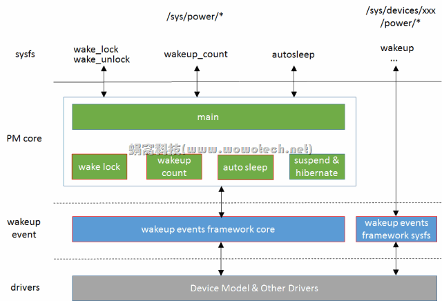

# 1. 概述

wakeup events framework 包括 wake lock、wakeup count、autosleep等机制.

# 2. wakeup events framework 要解决的问题

我们知道, 系统处于 suspend 状态, 可通过 wakeup events 唤醒. 具体的 wakeup events 可以是**按键按下**, 可以是**充电器插入**, 等等. 但是, 如果在 **suspend** 的**过程中**, 产生了 **wakeup events**, 怎么办? 答案很肯定, "wakeup" 系统. 由于此时系统没有真正 suspend, 所以这的 "wakeup" 是个假动作, 实际上只是终止suspend.

但由于系统在 suspend 的过程中, 会进行 process freeze、 device suspend 等操作, 而这些操作可能导致**内核**或**用户空间**程序**不能及时获取 wakeup events**, 从而使系统**不能正确 wakeup**, 这就是 wakeup events framework 要解决的问题: **system suspend** 和 **system wakeup events** 之间的**同步**问题.

# 3. wakeup events framework 的功能总结

仔细推敲一下, 上面所讲的同步问题包括两种情况:

情况1: **内核空间**的同步

wakeup events 产生后, 通常是以**中断的形式**通知 **device driver**. driver 会处理 events, 处理的过程中, 系统不能 suspend.

注1: 同步问题**只存在**于**中断开启**的情况, 因为若**中断关闭**, 就**不会**产生 **wakeup events**, 也就**不存在同步**的概念.

情况2: **用户空间**的同步

一般情况下, driver 对 wakeup events **处理后**, 会交给**用户空间程序**继续处理, 处理的过程, 也不允许 suspend. 这又可以分为两种情况:

* 进行后续处理的**用户进程**, 根本**没有机会被调度**, 即该 wakeup events **无法上报到用户空间**.

* 进行后续处理的**用户进程被调度**, 处理的过程中(以及处理结束后, 决定终止 suspend 操作), 系统不能 suspend.

因此, wakeup events framework 就包括 **3 大功能**:

* 解决**内核空间同步**问题(**framework 的核心功能**);

* 解决**用户空间同步**问题的**情景 1**(**wakeup count** 功能);

* 解决**用户空间同步**问题的**情景 2**(**wake lock** 功能).

注2:

用户空间同步的两种情况, 咋一看, 非常合乎情理, kernel 你得好好处理！但事实上, 该同步问题牵涉到了另外一个比较有争议的话题: **日常的电源管理机制**. 是否要**基于 suspend 实现**? 系统**何时进入**低功耗状态, 应该由谁决定? kernel 还是用户空间程序?

这最终会决定是否存在用空间同步问题. 但是, 在当前这个时间点, 对这个话题, Linux kernel developers 和 Android developers 持相反的观点. 这也造成了 wakeup events framework 在实现上的撕裂. Kernel 的**本意**是**不愿处理用户空间同步问题**的, 但为了兼容 Android 平台, 不得不增加相关的功能(**Wakeup count** 和 **Wake lock**).

在下一篇文章和大家探讨该话题, 本文就先 focus 在 wakeup events framework 上.

# 4. 架构

下面图片描述了 wakeup events framework 的 architecture:



图片中红色边框的 block 是 wakeup events 相关的 block:

1. wakeup events framework core, 在 `drivers/base/power/wakeup.c` 中实现, 提供了 wakeup events framework 的**核心功能**, 包括:

* 抽象 **wakeup source** 和 **wakeup event** 的**概念**;

* 向**各个 device driver** 提供 **wakeup source** 的**注册**、**使能**等接口;

* 向**各个 device driver** 提供 **wakeup event** 的**上报**、**停止**等接口;

* 向**上层**的 **PM core**(包括 wakeup count、auto sleep、suspend、hibernate 等模块)提供 **wakeup event** 的**查询接口**, 以判断**是否可以 suspend**、**是否需要终止正在进行的 suspend**.

2. wakeup events framework **sysfs**, 将**设备的 wakeup 信息**, 以 sysfs 的形式提供到用户空间, 供**用户空间**程序**查询**、**配置**. 在 `drivers/base/power/sysfs.c` 中实现.

3. **wake lock/unlock**, 为了兼容 Android 旧的 wakeup lock 机制而留下的一个后门, 扩展 `wakeup events framework` 的功能, 允许**用户空间**程序报告/停止 **wakeup events**. 换句话说, 该后门允许**用户空间**的任一程序决定系统**是否可以休眠**.

4. **wakeup count**, 基于 `wakeup events framework`, 解决**用户空间同步**的问题.

5. **auto sleep**, 允许系统在没有活动时(即一段时间内, **没有产生 wakeup event**), **自动休眠**.

注3: 在 Linux kernel 看来, **power** 是系统的**核心资源**, **不应开放给用户程序**随意访问(**wake lock** 机制违背了这个原则). 而在**运行时的电源管理**过程中, 系统**何时进入低功耗**状态, 也**不是用户空间程序**能决定的(**autosleep** 中枪了). 因此, kernel 对上述功能的支持, 非常的不乐意, 我们可以从 `kernel/power/main.c` 中 sysfs attribute 文件窥见一斑(只要定义了 `CONFIG_PM_SLEEP`, 就一定支持 **wakeup count 功能**, 但 **autosleep** 和 **wake lock** 功能, 由**另外的宏定义**控制):

```cpp
static struct attribute * g[] = {
    &state_attr.attr,
#ifdef CONFIG_PM_TRACE
    &pm_trace_attr.attr,
    &pm_trace_dev_match_attr.attr,
#endif
#ifdef CONFIG_PM_SLEEP
    &pm_async_attr.attr,
    &wakeup_count_attr.attr,
#ifdef CONFIG_SUSPEND
    &mem_sleep_attr.attr,
    &sync_on_suspend_attr.attr,
#endif
#ifdef CONFIG_PM_AUTOSLEEP
    &autosleep_attr.attr,
#endif
#ifdef CONFIG_PM_WAKELOCKS
    &wake_lock_attr.attr,
    &wake_unlock_attr.attr,
#endif
#ifdef CONFIG_PM_SLEEP_DEBUG
    &pm_test_attr.attr,
    &pm_print_times_attr.attr,
    &pm_wakeup_irq_attr.attr,
    &pm_debug_messages_attr.attr,
#endif
#endif
#ifdef CONFIG_FREEZER
    &pm_freeze_timeout_attr.attr,
#endif
    NULL,
};
```

# 5. 代码分析

## 5.1. wakeup source 和 wakeup event

在 kernel 中, **可以唤醒系统**的**只有设备**(`struct device`, 但不一定是 physical 的, 比如 autosleep 虚拟设备), 但并不是每个设备都具备唤醒功能, 那些具有唤醒功能的设备称作 wakeup source. 是时候回到这篇文章中了([Linux设备模型(5)_device和device driver](http://www.wowotech.net/linux_kenrel/device_and_driver.html)), 在那里, 介绍 struct device 结构时, 涉及到一个 `struct dev_pm_info` 类型的 power 变量, 待后面的专题讲解.

通过 `/sys/kernel/debug/wakeup_sources` 查看**所有**的 **wakeup sources**

我们再回忆一下 struct device 结构:

```cpp
// include/linux/device.h
struct device {
    ...
    struct dev_pm_info power;
    ...
}
```

该结构中有一个 **power** 变量, 保存了和 **wakeup event** 相关的信息, 让我们接着看一下 `struct dev_pm_info` 数据结构(只保留和本文有关的内容):

```cpp
// include/linux/pm.h
struct dev_pm_info {
    ...
    unsigned int		can_wakeup:1;
    ...
#ifdef CONFIG_PM_SLEEP
    ...
    struct wakeup_source	*wakeup;
    ...
#else
    unsigned int		should_wakeup:1;
#endif
};
```

* `can_wakeup`, 标识本设备**是否具有唤醒能力**.

* `wakeup` 指针, wakeup source 信息. 只有具备唤醒能力的设备, 才会在 **sysfs** 中有一个 **power 目录**, 用于提供所有的 wakeup 信息, 这些信息是以 `struct wakeup_source` 的形式组织起来的.

可唤醒设备具体有哪些信息呢? 让我们看看 `struct wakeup_source` 的定义.

```cpp
// include/linux/pm_wakeup.h
struct wakeup_source {
    const char 		*name;
    int			id;
    struct list_head	entry;
    spinlock_t		lock;
    struct wake_irq		*wakeirq;
    struct timer_list	timer;
    unsigned long		timer_expires;
    ktime_t total_time;
    ktime_t max_time;
    ktime_t last_time;
    ktime_t start_prevent_time;
    ktime_t prevent_sleep_time;
    unsigned long		event_count;
    unsigned long		active_count;
    unsigned long		relax_count;
    unsigned long		expire_count;
    unsigned long		wakeup_count;
    struct device		*dev;
    bool			active:1;
    bool			autosleep_enabled:1;
};
```

因此, 一个 wakeup source 代表了**一个具有唤醒能力的设备**, 也称该设备为一个 wakeup source. 该结构中各个字段的意义如下:

* name, 该 wakeup source 的名称, 一般为对应的 device name(有个例外, 就是 **wakelock**);

* id, 该 wakeup source 的 id;

* entery, 用于将所有的 wakeup source 挂在**一个链表**中;

* timer、`timer_expires`, 一个 wakeup source **产生**了 **wakeup event**, 称作 **wakeup source activate**, wakeup event **处理完毕**后(不再需要系统为此保持 active), 称作 **deactivate**. activate 和 deactivate 的**操作**可以**由 driver 亲自设置**, 也可以**在 activate 时**, 指定一个 **timeout** 时间, **时间到达**后, 由 **wakeup events framework** 自动将其设置为 **deactivate** 状态. 这里的 timer 以及 expires 时间, 就是用来**实现该功能**;

* `total_time`, 该 wakeup source 处于 **activate** 状态的**总时间**(可以指示该 wakeup source 对应的**设备**的**繁忙程度**、**耗电等级**);

* `max_time`, 该 wakeup source 持续处于 **activate** 状态的**最大时间**(越长越不合理);

* `last_time`, 该 wakeup source **上次 active** 的**开始时间点**, 按照代码逻辑, deactivate 时候也会更新, 所以如果没有在处理设备的 wakeup event, 这个值是**上一次 deactivate 的时间点**;

* `start_prevent_time`, 该 wakeup source **开始阻止系统自动睡眠**(`auto sleep`)的**时间点**;

* `prevent_sleep_time`, 该 wakeup source **阻止系统自动睡眠**的**总时间**; `CONFIG_PM_AUTOSLEEP` 才有. 

* `event_count`, wakeup source **上报的 event 个数**;

* `active_count`, wakeup source **activate 的次数**;

* `relax_count`,  wakeup source **deactivate 的次数**;

* `expire_count`, wakeup source **timeout 到达的次数**;

* `wakeup_count`, wakeup source **终止 suspend 过程**的次数;

* `active`, wakeup source 的 **activate 状态**;

* `autosleep_enabled`, 记录系统 **auto sleep** 的**使能状态**(每个 wakeup source 都重复记录这样一个状态, 这种设计真实不敢恭维！).

wakeup source 代表一个具有唤醒能力的设备, 该设备产生的**可以唤醒系统的事件**, 就称作 **wakeup event**. 当 wakeup source **产生** wakeup event 时, 需要将 wakeup source 切换为 **activate** 状态; 当 wakeup event **处理完毕**后, 要切换为 **deactivate** 状态. 因此, 我们再来理解一下几个 wakeup source 比较混淆的变量: `event_count`, `active_count` 和 `wakeup_count`:

* `event_count`, 是 wakeup source 产生的 wakeup event 的个数;

* `active_count`, 产生 wakeup event 时, wakeup source 需要切换到 activate 状态. 但并**不是每次都要切换**, 因此 `active_count` 可能**小于** `event_count`, 换句话说, 很有可能在**前一个 wakeup event 没被处理完**时, 又产生了一个. 这从一定程度上反映了 wakeup source 所代表的设备的**繁忙程度**;

* `wakeup_count`, wakeup source 在 **suspend** 过程中产生 wakeup event 的话, 就会**终止 suspend 过程**, 该变量记录了该 wakeup source **终止** suspend 过程的**次数**(如果发现系统**总是 suspend 失败**, 检查一下各个 wakeup source 的该变量, 就可以知道问题出在谁身上了).

## 5.2. 几个 counters

在 `drivers/base/power/wakeup.c` 中, 有几个比较重要的计数器, 是 wakeup events framework 的实现基础, 包括:

1. **registered wakeup events** 和 **saved_count**, 全局变量

> 释放这个 ws 的 wakeup event 时候, 只要这个 ws 是 active 都会加 1, 没有减的时候

记录了**系统运行以来**产生的**所有 wakeup event** 的个数, 在 wakeup source **上报 event** 时**加 1**.

这个 counter(`saved_count`) 对解决**用户空间同步问题**很有帮助, 因为一般情况下(无论是用户程序主动 suspend, 还是 auto sleep, 好像只有 autosleep?), 由专门的进程(或线程)触发 suspend. 当这个进程判断系统满足 suspend 条件, **决定 suspend 时**, 会记录一个 **counter 值**(`saved_count`, 全局变量). 在后面 suspend 的过程中, 如果系统发现 **counter 有变**, 则说明系统产生了**新的** wakeup event, 这样就可以**终止 suspend**.

该功能即是 **wakeup count** 功能, 会在后面更详细的说明.

2. **wakeup events in progress**, 全局变量

> 使用 `__pm_stay_awake` 或者 `pm_wakeup_ws_event` 上报 ws 的 wakup event 时候, 只要这个 ws 不是 active 都会加 1
>
> 释放这个 ws 的 wakeup event 时候, 只要这个 ws 是 active 都会减 1

记录系统**正在处理的 event 个数**.

当 **wakeup source** 产生 **wakeup event** 时, 会通过 wakeup events framework 提供的接口将 wakeup source 设置为 activate 状态. 当该 event 处理结束后, 设置为 deactivate 状态. activate 到 deactivate 的区间, 表示该 event 正在被处理.

当系统中有任何**正在被处理**的 **wakeup event** 时, 则**不允许 suspend**. 如果 suspend 正在进行, 则要终止.

思考一个问题: **registered wakeup events** 在什么时候**增加**? 答案是在 **wakeup events in progress 减小**时, 因为已经完整的处理完一个 event 了, **可以记录在案**了.

基于这种特性, kernel 将它俩**合并**成一个 32 位的整型数, 以原子操作的形式, 一起更新. 这种设计巧妙的让人叫绝, 值得我们学习. 具体如下:

定义和读取:

```cpp
// drivers/base/power/wakeup.c
// 32 位
static atomic_t combined_event_count = ATOMIC_INIT(0);

// 如果是 4*4, 16
#define IN_PROGRESS_BITS	(sizeof(int) * 4)
// 65535
// 0000 FFFF
#define MAX_IN_PROGRESS		((1 << IN_PROGRESS_BITS) - 1)

static void split_counters(unsigned int *cnt, unsigned int *inpr)
{
    unsigned int comb = atomic_read(&combined_event_count);
    // 高 16 位, 是 registered wakeup events
    *cnt = (comb >> IN_PROGRESS_BITS);
    // 低 16 位, 是 wakeup events in progress
    *inpr = comb & MAX_IN_PROGRESS;
}
```

**wakeup events in progress** 减 1, **registered wakeup events** 加 1:

```cpp
// combined_event_count = combined_event_count + MAX_IN_PROGRESS
// 并返回新值
// 低16位 减 1, 高16位 加 1
cec = atomic_add_return(MAX_IN_PROGRESS, &combined_event_count);
```

**wakeup events in progress** 加 1:

```cpp
// combined_event_count = combined_event_count + 1
// 并返回新值
// 低16位 加 1
cec = atomic_inc_return(&combined_event_count);
```

## 5.3. wakeup events framework 的核心功能

wakeup events framework 的核心功能体现在它向**底层的设备驱动**所提供的**用于上报 wakeup event 的接口**, 这些接口根据操作对象可分为两类, 具体如下.

类型一. **操作对象**为 **wakeup source**, 编写设备驱动时, 一般**不会直接使用**:

```cpp
//include/linux/pm_wakeup.h
extern void __pm_stay_awake(struct wakeup_source *ws);
extern void __pm_relax(struct wakeup_source *ws);
extern void pm_wakeup_ws_event(struct wakeup_source *ws, unsigned int msec, bool hard);
static inline void __pm_wakeup_event(struct wakeup_source *ws, unsigned int msec)
{
    return pm_wakeup_ws_event(ws, msec, false);
}
```

* `__pm_stay_awake`, 通知 PM core, **ws 产生了 wakeup event**, 且**正在处理**, 因此**不允许系统 suspend**(stay awake);

* `__pm_relax`, 通知 PM core, ws 没有正在处理的 wakeup event, **允许系统 suspend**(relax);

* `__pm_wakeup_event`, 为上边两个接口的**功能组合**, 通知PM core, ws 产生了 wakeup event, 会**在 msec 毫秒内处理结束**(wakeup events framework **自动 relax**).

注4: `__pm_stay_awake` 和 `__pm_relax` 应**成对调用**.

注5: 上面 3 个接口, 均可以在**中断上下文**调用.

类型二. 操作对象为 device, 为**设备驱动**的**常用接口**:

```cpp
//include/linux/pm_wakeup.h
extern int device_wakeup_enable(struct device *dev);
extern int device_wakeup_disable(struct device *dev);
extern void device_set_wakeup_capable(struct device *dev, bool capable);
extern int device_set_wakeup_enable(struct device *dev, bool enable);
extern void pm_stay_awake(struct device *dev);
extern void pm_relax(struct device *dev);
extern void pm_wakeup_dev_event(struct device *dev, unsigned int msec, bool hard);
static inline int device_init_wakeup(struct device *dev, bool enable)
{
    if (enable) {
        device_set_wakeup_capable(dev, true);
        return device_wakeup_enable(dev);
    } else {
        device_wakeup_disable(dev);
        device_set_wakeup_capable(dev, false);
        return 0;
    }
}
```

* `device_set_wakeup_capable`, 设置 dev 的 `can_wakeup` 标志(enable 或 disable), 并**增加**或**移除**该设备在 **sysfs** 相关的 **power** 文件;

* `device_wakeup_enable`/`device_wakeup_disable`/`device_set_wakeup_enable`, 对于 `can_wakeup` 的设备, **使能或者禁止 wakeup 功能**. 主要是对 `struct wakeup_source` 结构的相关操作;

* `device_init_wakeup`, **设置** dev 的 `can_wakeup` 标志, 若是 enable, **同时**调用 `device_wakeup_enable` **使能 wakeup 功能**;

* `pm_stay_awake`、`pm_relax`、`pm_wakeup_event`, 直接调用上面的 wakeup source 操作接口, **操作 device** 的 `struct wakeup_source` 变量, **处理 wakeup events**.

### 5.3.1. device_set_wakeup_capable

该接口位于在 `drivers/base/power/wakeup.c` 中, 代码如下:

```cpp
// drivers/base/power/wakeup.c
void device_set_wakeup_capable(struct device *dev, bool capable)
{
    if (!!dev->power.can_wakeup == !!capable)
        return;

    dev->power.can_wakeup = capable;
    if (device_is_registered(dev) && !list_empty(&dev->power.entry)) {
        if (capable) {
            int ret = wakeup_sysfs_add(dev);

            if (ret)
                dev_info(dev, "Wakeup sysfs attributes not added\n");
        } else {
            wakeup_sysfs_remove(dev);
        }
    }
}
EXPORT_SYMBOL_GPL(device_set_wakeup_capable);
```

该接口的实现很简单, 主要包括 sysfs 的 `add/remove` 和 `can_wakeup` 标志的设置两部分. 如果设置 `can_wakeup` 标志, 则调用 `wakeup_sysfs_add`, 向该设备的 sysfs 目录下添加 power 文件夹, 并注册相应的 attribute 文件. 如果清除 `can_wakeup` 标志, 执行 sysfs 的移除操作.

`wakeup_sysfs_add`/`wakeup_sysfs_remove` 位于`drivers/base/power/sysfs.c` 中, 对 wakeup events framework 来说, 主要包括如下的 attribute 文件:

```cpp
// drivers/base/power/sysfs.c
static struct attribute *wakeup_attrs[] = {
#ifdef CONFIG_PM_SLEEP
    &dev_attr_wakeup.attr,
    &dev_attr_wakeup_count.attr,
    &dev_attr_wakeup_active_count.attr,
    &dev_attr_wakeup_abort_count.attr,
    &dev_attr_wakeup_expire_count.attr,
    &dev_attr_wakeup_active.attr,
    &dev_attr_wakeup_total_time_ms.attr,
    &dev_attr_wakeup_max_time_ms.attr,
    &dev_attr_wakeup_last_time_ms.attr,
#ifdef CONFIG_PM_AUTOSLEEP
    &dev_attr_wakeup_prevent_sleep_time_ms.attr,
#endif
#endif
    NULL,
};
static const struct attribute_group pm_wakeup_attr_group = {
    .name	= power_group_name,
    .attrs	= wakeup_attrs,
};
```

1. wakeup

> rtc: /sys/devices/pnp0/00\:01/power/wakeup
> Ethernet: /sys/devices/pci0000\:00/0000\:00\:1f.6/power/wakeup

读, 获得设备 wakeup 功能的使能状态, 返回 "enabled" 或 "disabled" 字符串.

写, 更改设备 wakeup 功能的使能状态, 根据写入的字符串("enabled" 或 "disabled"), 调用 `device_set_wakeup_enable` 接口完成实际的状态切换.

设备 wakeup 功能是否使能, 取决于设备的 `can_wakeup` 标志, 以及设备是否注册有相应的 `struct wakeup_source` 指针. 即 `can_wakeup` 和 `may_wakeup`, 如下:

```cpp
// include/linux/pm_wakeup.h
static inline bool device_can_wakeup(struct device *dev)
{
    return dev->power.can_wakeup;
}

static inline bool device_may_wakeup(struct device *dev)
{
    return dev->power.can_wakeup && !!dev->power.wakeup;
}
```

2. `wakeup_count`, 只读, 获取 `dev->power.wakeup->wakeup_count` 值. 终止 suspend 过程的次数.

> /sys/devices/pci0000:00/0000:00:1f.6/power/wakeup_count

3. `wakeup_active_count`, 只读, 获取 `dev->power.wakeup->active_count` 值. activate 的次数.

> /sys/devices/pci0000:00/0000:00:1f.6/power/wakeup_active_count

4. `wakeup_abort_count`, 只读, 获取 `dev->power.wakeup->wakeup_count` 值. 终止 suspend 过程的次数. 和 `wakeup_count` 一样.

> /sys/devices/pci0000:00/0000:00:1f.6/power/wakeup_abort_count

5. `wakeup_expire_count`, 只读, 获 `dev->power.wakeup->expire_count` 取值. timeout 到达的次数.

> /sys/devices/pci0000:00/0000:00:1f.6/power/wakeup_expire_count

6. `wakeup_active`, 只读, 获取 `dev->power.wakeup->active` 值. activate 状态.

7. `wakeup_total_time_ms`, 只读, 获取 `dev->power.wakeup->total_time` 值, 单位为 ms. activate 状态的总时间

8. `wakeup_max_time_ms`, 只读, 获 `dev->power.wakeup->max_time` 取值, 单位为 ms.

9. `wakeup_last_time_ms`, 只读, 获 `dev->power.wakeup->last_time` 取值, 单位为 ms.

10. `wakeup_prevent_sleep_time_ms`, 只读, 获取 `dev->power.wakeup->prevent_sleep_time` 值, 单位为ms.

注6: 阅读上述代码时, 我们可以看到很多类似 "`!!dev->power.can_wakeup == !!capable`" 的、带有两个"！"操作符的语句, 是为了保证最后的操作对象非 0 即 1. 这从侧面反映了内核开发者的严谨程度, 值得我们学习.

### 5.3.2. device_wakeup_enable/device_wakeup_disable/device_set_wakeup_enable

以 `device_wakeup_enable` 为例(其它类似). **使能或者禁止 wakeup 功能**.

```cpp
// drivers/base/power/wakeup.c
int device_wakeup_enable(struct device *dev)
{
    struct wakeup_source *ws;
    int ret;
    // 第一
    if (!dev || !dev->power.can_wakeup)
        return -EINVAL;

    if (pm_suspend_target_state != PM_SUSPEND_ON)
        dev_dbg(dev, "Suspicious %s() during system transition!\n", __func__);
    // 第二
    // 创建新的wakeup source
    ws = wakeup_source_register(dev, dev_name(dev));
    if (!ws)
        return -ENOMEM;
    // 第三
    ret = device_wakeup_attach(dev, ws);
    if (ret)
        wakeup_source_unregister(ws);

    return ret;
}
EXPORT_SYMBOL_GPL(device_wakeup_enable);
```

第一. 若**设备指针为空**, 或者设备不具备 wakeup 能力, 报错退出.

第二. 调用 `wakeup_source_register` 接口, dev 是该 ws 关联的设备, 以**设备名**为参数, **创建并注册**一个 `wakeup source`.

`wakeup_source_register` 接口的实现也比较简单, 所做的工作包括:

* **分配** `struct wakeup_source` 变量所需的**内存空间**、**初始化内部变量**;

    * ws 的 name 是传进来的, 比如 **autosleep** 或者 **设备名字**

* 分配 ws 设备 `struct device` 并做初始化:

  * 设备类型是 `wakeup_class`;

  * 如果该 ws 关联真实设备, 设置 parent; 如果 ws 设备是虚拟的, 那么 parent 为 NULL;

  * 设备名是 `wakeup%d`;

  * 添加 sysfs 节点:

    * 如果该 ws 关联真实设备, 在设备 sysfs 节点下的 wakeup 目录下创建 `wakeup%d` 目录, 并且创建 `/sys/class/wakeup/wakeup%d` 的软链接指向这里

    * 如果该 ws 是个虚拟的, 那么创建 `/sys/devices/wakeup%d` 目录, 通过目录下的 name 可以看到该 ws 名字

* 调用 `timer_setup` 创建一个定时器用于该 ws 的超时机制, 该定时器还没注册, 所以还没开始执行

* 将新建的 ws 添加到名称为 `wakeup_sources` 的**全局链表**中.

    * 该链表通过 `/sys/kernel/debug/wakeup_sources` 可以看到

    * `wakeup_sources_debugfs_init` 该函数将上面的内容暴露到 sysfs

```cpp
// drivers/base/power/wakeup.c
struct wakeup_source *wakeup_source_register(struct device *dev,
					     const char *name)
{
	struct wakeup_source *ws;
	int ret;
    // 就是分配了struct wakeup_source内存和一个id, 并设置:
    // ws->name = ws_name
    // ws->id = id
	ws = wakeup_source_create(name);
	if (ws) {
        // 没有设备(虚拟的ws) 或者 关联的设备已经有了
		if (!dev || device_is_registered(dev)) {
            // 添加 ws 到 sysfs
            // 创建了一个struct device, 叫wakeup%d, 属于 wakeup class
            // /sys/class/wakeup/wakeup19
			ret = wakeup_source_sysfs_add(dev, ws);
			if (ret) {
				wakeup_source_free(ws);
				return NULL;
			}
		}
        // 添加 ws
		wakeup_source_add(ws);
	}
	return ws;
}

// drivers/base/power/wakeup_stats.c
// wakeup_source_sysfs_add -> wakeup_source_device_create
// 虚拟的 ws, parent 是 NULL
static struct device *wakeup_source_device_create(struct device *parent,
						  struct wakeup_source *ws)
{
	struct device *dev = NULL;
	int retval;
    // ws 也会对应一个设备
	dev = kzalloc(sizeof(*dev), GFP_KERNEL);
	if (!dev) {
		retval = -ENOMEM;
		goto error;
	}

	device_initialize(dev);
	dev->devt = MKDEV(0, 0);
    // 设备类型是 wakeup_class
	dev->class = wakeup_class;
    // 关联的真实设备, 虚拟ws是NULL
	dev->parent = parent;
	dev->groups = wakeup_source_groups;
	dev->release = device_create_release;
	dev_set_drvdata(dev, ws);
	device_set_pm_not_required(dev);
    // ws设备名是 wakeup%d
	retval = dev_set_name(dev, "wakeup%d", ws->id);
	if (retval)
		goto error;
    // 会在 sysfs 下生成相应节点
	retval = device_add(dev);
	if (retval)
		goto error;

	return dev;
    ...
}

// drivers/base/power/wakeup.c
// wakeup_sources 全局链表
static LIST_HEAD(wakeup_sources);

void wakeup_source_add(struct wakeup_source *ws)
{
    ...
	spin_lock_init(&ws->lock);
    // 准备一个定时器, 还需要
    // 1. 设置timer的expires, 定时时间
    // 2. 调用add_timer进行注册
	timer_setup(&ws->timer, pm_wakeup_timer_fn, 0);
	ws->active = false;
    ...
    // 添加到全局链表
	list_add_rcu(&ws->entry, &wakeup_sources);
    ...
}
```

第三. 调用 `device_wakeup_attach` 接口, 将新建的 wakeup source 保存在 `dev->power.wakeup` 指针中.

`device_wakeup_attach` 接口更为直观, 不过有一点我们要关注, 如果设备的 `dev->power.wakeup` **非空**, 也就是说之前**已经有一个 wakeup source** 了, 是不允许再 enable 了的, 会报错返回.

### 5.3.3. pm_stay_awake

当**设备**(wakeup source)产生了 `wakeup event`, 并且**正在处理**时, 需要调用该接口**通知 PM core**, **不允许系统 suspend**.

> todo: 一个设备触发 wakeup event 的调用过程

> 主要功能: 设置 ws 相关的变量; 增加 wakeup events in progress 值

该接口的实现如下:

```cpp
// drivers/base/power/wakeup.c
void pm_stay_awake(struct device *dev)
{
    unsigned long flags;

    if (!dev)
        return;

    spin_lock_irqsave(&dev->power.lock, flags);
    __pm_stay_awake(dev->power.wakeup);
    spin_unlock_irqrestore(&dev->power.lock, flags);
}
```

直接调用 `__pm_stay_awake`

```cpp
// drivers/base/power/wakeup.c
void __pm_stay_awake(struct wakeup_source *ws)
{
    unsigned long flags;

    if (!ws)
        return;

    spin_lock_irqsave(&ws->lock, flags);

    wakeup_source_report_event(ws, false);
    del_timer(&ws->timer);
    ws->timer_expires = 0;

    spin_unlock_irqrestore(&ws->lock, flags);
}
```

由于 `pm_stay_awake` 报告的 event 需要经过 `pm_relax` **主动停止**, 因此就**不再需要 timer**, 所以 `__pm_stay_awake` 实现是直接调用 `wakeup_source_report_event`, 然后停止 timer. 接着看代码:

```cpp
// drivers/base/power/wakeup.c
static void wakeup_source_report_event(struct wakeup_source *ws, bool hard)
{
    // 第一
    // 该wakeup source上报的event个数, 一直增加
    ws->event_count++;
    /* This is racy, but the counter is approximate anyway. */
    // 第二
    if (events_check_enabled)
        ws->wakeup_count++;
    // 第三
    if (!ws->active)
        wakeup_source_activate(ws);
    // 这里没调用
    if (hard)
        pm_system_wakeup();
}
```

第一. 增加 wakeup source 的 `event_count`, 表示该 source 又产生了一个 event. 哪怕已经是 active 的

第二. 根据 `events_check_enabled` 变量的状态, 决定是否增加 `wakeup_count`, 表明**该 ws 终止 suspend 过程的次数**. 这和 wakeup count 的功能有关, 到时再详细描述.

第三. 如果 wakeup source **没有 active**, 则调用 `wakeup_source_activate`, activate 它. 这也是上面所描述的, `event_count` 和 `active_count` 的区别所在. 

`wakeup_source_activate` 的代码如下.

```cpp
// drivers/base/power/wakeup.c
static void wakeup_source_activate(struct wakeup_source *ws)
{
    unsigned int cec;

    if (WARN_ONCE(wakeup_source_not_registered(ws),
            "unregistered wakeup source\n"))
        return;
    // 第一
    ws->active = true;
    // activate 的次数
    // 一直增加, 不会减少
    ws->active_count++;
    // active 开始时间
    // deactivate时候也会更新
    ws->last_time = ktime_get();
    // 第二
    if (ws->autosleep_enabled)
        // 开始阻止系统autosleep的时间点
        ws->start_prevent_time = ws->last_time;
    // 第三
    /* Increment the counter of events in progress. */
    cec = atomic_inc_return(&combined_event_count);

    trace_wakeup_source_activate(ws->name, cec);
}
```

第一. 设置 active 标志, 增加 active_count, 更新 `last_time`.

第二. 如果**使能了 autosleep**, 更新 `start_prevent_time`, 因为此刻该 wakeup source 会**开始阻止系统 auto sleep**. 具体可参考 auto sleep 的功能描述.

第三. 增加 "**wakeup events in progress**" 计数(上面有描述). 该操作是 wakeup events framework 的灵魂, **增加该计数**, 意味着系统正在处理的 wakeup event 数目不为零, 则**系统不能 suspend**.

> 注意: registered wakeup events 没有增加, 在 relax 时候增加

到此, `pm_stay_awake` 执行结束, 意味着**系统至少正在处理一个 wakeup event**, 因此**不能 suspend**. 那**处理完成**后呢? driver 要调用 `pm_relax` 通知 PM core.

### 5.3.4. pm_relax

`pm_relax` 和 `pm_stay_awake` 成对出现, 用于在 **wakeup event 处理结束**后通知 PM core.

> 主要功能: 设置 ws 相关属性; wakeup events in progress 减 1, registered wakeup events 加 1

其实现如下:

```cpp
// drivers/base/power/wakeup.c
void pm_relax(struct device *dev)
{
    unsigned long flags;

    if (!dev)
        return;

    spin_lock_irqsave(&dev->power.lock, flags);
    __pm_relax(dev->power.wakeup);
    spin_unlock_irqrestore(&dev->power.lock, flags);
}
```

直接调用 `__pm_relax`,

```cpp
// drivers/base/power/wakeup.c
void __pm_relax(struct wakeup_source *ws)
{
    unsigned long flags;

    if (!ws)
        return;

    spin_lock_irqsave(&ws->lock, flags);
    if (ws->active)
        wakeup_source_deactivate(ws);
    spin_unlock_irqrestore(&ws->lock, flags);
}
```

如果该 wakeup source 处于 active 状态, 调用 `wakeup_source_deactivate` 接口, deactivate 它. deactivate 接口和 activate 接口一样, 是 wakeup events framework 的核心逻辑, 如下:

```cpp
// drivers/base/power/wakeup.c
static void wakeup_source_deactivate(struct wakeup_source *ws)
{
    unsigned int cnt, inpr, cec;
    ktime_t duration;
    ktime_t now;

    // 第一
    // deactivate 的次数
    // 一直增加不会减少
    ws->relax_count++;
    if (ws->relax_count != ws->active_count) {
        ws->relax_count--;
        return;
    }
    // 第二
    ws->active = false;
    // 第三
    now = ktime_get();
    duration = ktime_sub(now, ws->last_time);
    // 处于activate状态的总时间
    ws->total_time = ktime_add(ws->total_time, duration);
    if (ktime_to_ns(duration) > ktime_to_ns(ws->max_time))
        // 持续 active 的最大时间
        ws->max_time = duration;
    // deactivate 时候的时间点
    ws->last_time = now;
    // 删除 timer
    del_timer(&ws->timer);
    ws->timer_expires = 0;
    // 第四
    if (ws->autosleep_enabled)
        update_prevent_sleep_time(ws, now);

    // 低16位 减 1, 高16位 加 1
    // 第五
    cec = atomic_add_return(MAX_IN_PROGRESS, &combined_event_count);
    trace_wakeup_source_deactivate(ws->name, cec);
    // 第六
    split_counters(&cnt, &inpr);
    if (!inpr && waitqueue_active(&wakeup_count_wait_queue))
        wake_up(&wakeup_count_wait_queue);
}
```

第一. `relax_count` 加 1(如果 `relax_count` 和 `active_count` 不等, 则说明有重复调用, 要退出).

第二. 清除 active 标记.

第三. 更新 total_time、max_time、last_time 等变量.

第四. 如果使能 auto sleep, 更新相关的变量(后面再详细描述).

第五. 再欣赏一下艺术, **wakeup events in progress** 减 1, **registered wakeup events** 加 1.

第六. wakeup count 相关的处理, 后面再详细说明.

### 5.3.5. pm_wakeup_event

`pm_wakeup_event` 是 `pm_stay_awake` 和 `pm_relax` 的组合版, 在上报 even t时, **指定**一个 **timeout** 时间, timeout 后, 自动 relax, 一般用于**不知道何时能处理完成的场景**. 该接口比较简单, 就不一一描述了.

### 5.3.6. pm_wakeup_pending

**drivers 产生的 wakeup events**, 最终要**上报到 PM core**, PM core 会根据这些 events, 决定**是否要终止 suspend 过程**.

这表现在 suspend 过程中频繁调用 `pm_wakeup_pending` 接口(可参考 suspend 内容).

`events_check_enabled` 的变化如下

* 默认为 false

* **用户修改** `/sys/power/wakeup_count` 或者用户修改 `/sys/power/autosleep`(非 off) 时

  * 默认设置成 false

  * 如果写的值(autosleep 是先读原有值, 再写入) 等于 `registered wakeup events`(表明这个过程中**没有处理过新的 event**) 或者 wakeup events in progress 为 0(表明**没有 event 在处理**), 那就设置为 **true**

* `pm_suspend` 结束后置为 false

* hibernate resume 以后置为 false

* 检查 wakeup event 时候, 如果 (registered wakeup events 等于 `saved_count`) 并且 (wakeup events in progress 等于 0), 才会置为 **true**. 问题是 `saved_count` 只仅在用户修改 `/sys/power/wakeup_count` 或者用户修改 `/sys/power/autosleep`(非 off) 时保存, 所以基本上都是 false.

整个检查逻辑如下:

* `events_check_enabled` 是 true 的时候

  * registered wakeup events 是不是等于 `saved_count`

    * registered wakeup events, 释放这个 ws 的 wakeup event 时候, 只要这个 ws 是 active 都会加 1, 没有减的时候

    * `saved_count` 仅仅在用户修改 `/sys/power/wakeup_count` 或者用户修改 `/sys/power/autosleep`(非 off) 时保存

  * wakeup events in progress 是不是大于 0

    * 使用 `__pm_stay_awake` 或者 `pm_wakeup_ws_event` 上报 ws 的 wakup event 时候, 只要这个 ws 不是 active 都会加 1

    * 释放这个 ws 的 wakeup event 时候, 只要这个 ws 是 active 都会减 1

* `pm_abort_suspend` 值是不是大于0

  * 默认为 0

  * 系统唤醒时加 1

  * `freeze_processes` 时候会设为 0

所以 wakeup count 的检查, 基本上是为了对付 autosleep 或者手动写 `wakeup_count` 的场景, 对于正常的 suspend/hibernate 不受影响

该接口的实现如下:

```cpp
// drivers/base/power/wakeup.c
bool pm_wakeup_pending(void)
{
    unsigned long flags;
    bool ret = false;

    raw_spin_lock_irqsave(&events_lock, flags);
    // 第一
    if (events_check_enabled) {
        unsigned int cnt, inpr;
        // 第二
        split_counters(&cnt, &inpr);
        // cnt是所有wakeup event的个数; saved_count是suspend时记录的cnt的值; cnt在上报event时加1;
        // 不等于说明suspend时产生了新的 event
        // inpr 大于 0 说明有正处理event
        // ret是true说明有event
        ret = (cnt != saved_count || inpr > 0);
        // 有event就设为false, 下次不用检查了, 为什么?
        // 没有event就设为true, 让下一次可以检查
        events_check_enabled = !ret;
    }
    raw_spin_unlock_irqrestore(&events_lock, flags);

    // 有 event
    if (ret) {
        pm_pr_dbg("Wakeup pending, aborting suspend\n");
        // 打印 active 的唤醒源
        pm_print_active_wakeup_sources();
    }
    // 同时检查 pm_abort_suspend 值
    return ret || atomic_read(&pm_abort_suspend) > 0;
}
```

该接口的逻辑比较直观, 先抛开 wakeup count 的逻辑不谈(后面会重点说明), 只要正在处理的 events 不为0, 就返回 true, 调用者就会终止suspend.

第一. 首先会判断 `events_check_enabled` 是否有效, 无效**直接返回 false**, 表明不做任何 wakeup events 检查, 即不进行任何的同步; 有效的话继续. 这里和 wakeup count 有关.

第二. 获得 **cnt** 和 **inpr**, 如果 cnt 不等于 `saved_count`(说明**这段时间内**有 events **产生**), 或者 inpr 不为 0(说明有 events 正在被处理), 返回 true(告诉调用者, 放弃吧, suspend 时机不到). 同时清除 `events_check_enabled` 的状态.

第三. 否则, 返回 false, 同时保持 `events_check_enabled` 的置位状态(以免 `pm_wakeup_pending` 再次调用).

## 5.4. wakeup count、wake lock 和 auto sleep

后面继续分析
