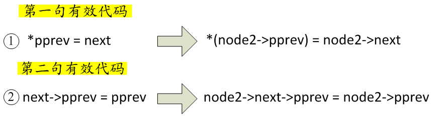

http://blog.chinaunix.net/uid-23069658-id-4975027.html

哈希链表也在很多重要的地方有所使用, 比如 linux 内核的 dentry, 进程查询, 文件系统等, 可以说, 弄明白 hlist 对于理解 linux 内核具有重要的意义.

关于哈希表, 在内核里设计两个很重要的数据结构:

哈希链表节点:

```cpp
/*Kernel Version : 3.4.x [include/linux/types.h]*/
//hash 桶的普通结点
struct hlist_node {
    struct hlist_node *next; //指向下一个结点的指针
    struct hlist_node **pprev;//指向上一个结点的 next 指针的地址
};
```

可以看到哈希节点和内核普通双向链表的节点唯一的区别就在于, 前向节点 pprev 是个两级指针, 至于为什么这样设计而不采用 struct list_head{}来作为哈希链表的节点, 我们后面会详细介绍. 另外一个重要的数据结构是, 哈希链表的表头.

哈希链表表头:

```cpp
/*Kernel Version : 3.4.x [include/linux/types.h]*/
//hash 桶的头结点
struct hlist_head {
    struct hlist_node *first;//指向每一个 hash 桶的第一个结点的指针
};
```

因为哈希链表并不需要双向循环的技能, 它一般适用于单向散列的场景. 所以, 为了减少开销, 并没有用 struct hlist\_node{}来代表哈希表头, 而是重新设计 struct hlist\_head{}这个数据结构. 此时, 一个哈希表头就只需要 4Byte 了, 相比于 struct hlist\_node{}来说, 存储空间已经减少了一半. 这样一来, 在需要大量用到哈希链表的场景, 其存储空间的节约是非常明显的, 特别是在嵌入式设备领域.

关于两级指针的目的与意义, 让我们采用反证法来看看, 如果 struct hlist\_node{}被设计成如下一级指针的样子, 会发生什么:

```cpp
struct hlist_node {
    struct hlist_node *next; *pprev;
};
```

假如我们现在已经有一个哈希链表了 myhlist(先别管这个链表是怎么来的), 链表里有 4 个节点 node1\~node4:


然后就有以下两个问题跟着冒出来:

1)、在往哈希链 myhlist 里插入 node1 时必须这么写:

```cpp
mylist.first = node1;
node1->pprev=( struct hlist_node*)&mylist;
```

往哈希链表里插入元素时, 如果在表头的第一个位置上插入元素, 和插入在哈希链表的其他位置上的代码处理逻辑是不一样的. 因为哈希表头是 list\_head 类型, 而其他节点都是 list\_node 类型.

2)、同样, 如果删除节点时, 对于非首节点, 以 node2 为例:

```cpp
node2->pprev->next = node2->next;
node2->next->pprev = node2->pprev;
```

如果要删除首节点 node1 呢, 则写法如下:

```cpp
((struct hlist_head*)(node1->pprev))->first = node1->next;
node1->next->pprev = ( struct hlist_node*)&mylist; 或者 node1->next->pprev = node1->pprev;
```

很明显, 内核开发者们怎么会容许这样的代码存在, 而且还要充分考虑效率的问题. 那么, 当 hlist_node.pprev 被设计成两级指针后有啥好处?

还是以删除节点为例, 如果要删除首节点, 因为 node1->pprev 里保存的是 myhlist 的地址, 而 myhlist.first 永远都指向哈希链表的第一个节点, 我们要间接改变表头里的 hlist\_node 类型的 first 指针的值, 能想到的最直接的办法当然是二级指针, 这是两级指针的宿命所决定的, 为了间接改变一级指针所指的内存地址的场景. 这样一来, **node 节点里的 pprev 其实指向的是其前一个节点里的第一个指针元素的地址**. 对于 hlist\_head 来说, 它里面只有一个指针元素, 就是 first 指针; 而对于 hlist\_node 来说, 第一个指针元素就是 next. 具体如下所示:


所以, 记住, 当我们在代码中看到类似与\*(hlist_node->pprev)这样的代码时, 我们心里应该清楚, 此时正在哈希表里操作**当前节点前一个节点里的第一个指针元素所指向的内存地址**, 只是以间接的方式实现罢了. 那么回到删除哈希链表节点的场景, 当删除首节点时, 此时情况就变成了:

```cpp
*(node1->pprev) = node1->next;
node1->next->pprev = node1->pprev;
```

删除非首节点的情况也一样:

```cpp
*(node2->pprev) = node2->next;
node2->next->pprev = node2->pprev;
```

这样一来, 我们对 hlist\_node 里的谅解指针 pprev 的存在价值与意义应该很明白了, 以后不至于再被眼花缭乱的取地址操作符给弄晕了. OK, 扯了这么多, 让我们看看内核是如何实现删除哈希链表里的节点的\_\_hlist\_del():


大家自行将上述函数里的入参 n 换成 node2, 最终和我们上面推断的结果是一致的:



在标准的哈希链表里, 因为最后一个节点的 next=NULL, 所以在执行第二句有效代码前首先要对当前节点的 next 值进行判断才行.

在标准的哈希链表里, 因为最后一个节点的 next=NULL, 所以在执行第二句有效代码前首先要对当前节点的 next 值进行判断才行.

```cpp
hlist_add_head(struct hlist_node *n, struct hlist_head *h)
```

其中 n 表示待插入的节点, h 表示哈希链表表头.

在刚初始化完哈希表 myhlist 的情况下, 依次调用四次 hlist\_add\_head(), 每次调用后 myhlist 哈希表的情况如下:


(备注: 双箭头表示两级指针, 单箭头表示一级指针)

理论上说, 内核应该再提供一个对称的方法 hlist\_add\_tail()才算完美, 用于将哈希链表操作成如下的样子:


还有 hlist\_add\_behind()和 hlist\_add\_before(), 在 3.17 版本之前 hlist\_add\_behind()的名字还是 hlist\_add\_after(), 不过作用都一样. 两个函数原型分别如下:

```cpp
hlist_add_before(struct hlist_node *n,struct hlist_node *next);
hlist_add_behind(struct hlist_node *n,struct hlist_node *prev);
```

其中 n 是待插入的节点, next 或者 prev 都是 n 的相对位置参考节点, 其作用分别是:

hlist\_add\_before(): 在 next 节点的前面插入 n 节点;

hlist\_add\_behind(): 在 prev 节点的后面插入 n 节点;

1)、在 node4 节点的前面插入 node3:


注意 hlist\_add\_before()有个约束条件, 那就是 next!=NULL.

2)、在 node1 的节点后面插入 node5:


同样的约束条件也适用于 hlist\_add\_behind(), 即 prev!=NULL.

对照内核通知链、链表, 本章我们将要介绍的哈希表的初始化和定义也是如出一辙的:

```cpp
定义并初始化一个名为 name 的哈希链表表头
#define HLIST_HEAD(name) struct hlist_head name = { .first = NULL }

初始化一个已经定义好的哈希链表, 其中 ptr 指向哈希表头的地址
#define INIT_HLIST_HEAD(ptr) ((ptr)->first = NULL)
```

其中, HLIST\_HEAD\_INIT 一般这么用:

```cpp
struct hlist_head myhlist;
HLIST_HEAD_INIT(&myhlist);
```

对于哈希表中的每一个 hlist\_node 节点, 通常情况下都要调用初始化函数 INIT\_HLIST\_NODE()来初始化:

```cpp
static inline void INIT_HLIST_NODE(struct hlist_node *h)
{
    h->next = NULL;
    h->pprev = NULL;
}
```

一个给定的哈希节点, 判断它是否已经被插入到某条哈希链表里 hlist\_unhashed():

```cpp
static inline int hlist_unhashed(const struct hlist_node *h)
{
    return !h->pprev;
}
```

这里我们可以看到, hlist\_node 里的 pprev 完成了这个功能, 即如果一个 hlist\_node 的 pprev 为 NULL, 则说明该节点目前并未加入任何哈希链表.

下面这个接口就没啥好说的, 用于判断是一个给定哈希表是否为空(即不包含任何哈希节点). 注意, 该接口入参为 hlist\_head 类型而非 hlist\_node 类型:

```cpp
static inline int hlist_empty(const struct hlist_head *h)
{
    return !h->first;
}
```

剩下的其他接口, 也都非常简单, 这里不再一一赘述. 下面我们看几个宏定义:

```cpp
#define hlist_entry(ptr, type, member) container_of(ptr,type,member)
该宏和前面介绍过的 list_entry()的实现、作用完全一样
#define list_entry(ptr, type, member)  container_of(ptr,type,member)
```

对照 list 的学习过程, 可想而知, 下面这几组结构, 其作用也就不言而喻了:


哈希表 | 链表
---|---
hlist_for_each(pos, head) | list_for_each(pos, head)
hlist_for_each_safe(pos, n, head) | list_for_each_safe(pos, n, head)
hlist_for_each_entry(tpos, pos, head, member) | list_for_each_entry(pos, head, member)
hlist_for_each_entry_safe(tpos, pos, n, head, member) | list_for_each_entry_safe(pos, n, head, member)

区别在于最后两个宏的入参上有些小区别. 由于哈希链表, 表头和表节点是不同的数据结构, 所以才会有这个差异. 还是对照着 list\_for\_each\_\*的学习过程:

```cpp
hlist_for_each_entry(tpos, pos, head, member)
```

其中 tpos, 是 hlist\_node 所属宿主结构体类型的指针, pos 是 hlist\_node 类型的指针, tpos 和 pos 都充当的游标的作用. 例如:

```cpp
typedef struct student
{
    char m_name[MAX_STRING_LEN];
    char m_sex;
    int m_age;
    struct list_head m_list; /*把我们的学生对象组织成双向链表, 就靠该节点了*/
    struct hlist_node m_hlist; /*把我们的学生对象组织成哈希链表, 就靠该节点了*/
}Student;

HLIST_HEAD(myhlist);
Student *st;
struct hlist_node *i;
hlist_for_each_entry(st, i, &myhlist, m_hlist)
{
    //To do something here...
    //通常情况, 开发者在这里仅需要关注、使用 st 变量就可以, 不需要关心 i
}
```

同样地, 在使用 hlist\_for\_each\_entry\_safe(tpos, pos, n, head, member)时, tpos 也是宿主结构体类型的一个指针变量, 当游标使用, n 是一个 hlist\_node 类型的另一个指针, 这个指针指向 pos 所在元素的下一个元素, 它由 hlist\_for\_each\_entry\_safe()本身进行维护, 开发者不用修改它:

```cpp
HLIST_HEAD(myhlist);
Student *st;
struct hlist_node *i,*j;
hlist_for_each_entry_safe(st, i, j, &myhlist, m_hlist)
{
    //To do something here...
    //i 和 j 都不需要开发者关注, 仅使用 st 就可以了
}
```

另外, 还有一组宏:

```cpp
hlist_for_each_entry_continue(tpos, pos, member)
hlist_for_each_entry_from(tpos, pos, member)
```

其参数 tpos 和 pos 意义和类型与前面介绍过的一致, 这两个宏的作用分别是:

- hlist\_for\_each\_entry\_continue(): 从 pos 节点开始(不包含 pos), 往后依次遍历所有节点;
- hlist\_for\_each\_entry\_from(): 从 pos 节点开始(包含 pos), 依次往后遍历所有节点;

这一组宏是"不安全"的, 意思是, 在它们里面你只能执行查找遍历的任务、不能插入或者删除节点, 因为它们脑门上没有那个"safe"的关键字.

最后, 还是老生常谈, 实际操练一把. 把链表章节我们介绍过的学历管理系统拿来, 添加一个需求: "按照男、女的分类原则, 将所有学生进行分类". 很明显, 这里我们就可以用到哈希链表了. 怎么实现呢?其实非常简单, 前面我们已经见过对 Student 结构体的改造了. 最终的完整代码如下所示:

头文件修改:

```cpp
/*student.h*/

#ifndef __STUDENT_H_
#define __STUDENT_H_

#include <linux/list.h>
#define MAX_STRING_LEN 32
#define MAX_HLIST_COUNT 2 //只有"男"、"女"两条哈希链表
typedef struct student
{
        char m_name[MAX_STRING_LEN];
        char m_sex;
        int m_age;
        struct list_head m_list; /*把我们的学生对象组织成双向链表, 就靠该节点了*/
        struct hlist_node m_hlist; /*把我们的学生对象组织成哈希链表, 就靠该节点了*/
}Student;
#endif
```

源文件修改:

```cpp
#include <linux/module.h>

#include <linux/kernel.h>
#include <linux/init.h>

#include "student.h"

MODULE_LICENSE("Dual BSD/GPL");
MODULE_AUTHOR("Koorey Wung");

static int dbg_flg = 0;

LIST_HEAD(g_student_list);
// 其中 g_stu_hlist[0]代表男生; g_stu_hlist[1]代表女生
struct hlist_head g_stu_hlist[MAX_HLIST_COUNT];

//初始化男、女学生的哈希链表
static void init_hlists(void)
{
    int i = 0;
    for(i=0;i< MAX_HLIST_COUNT;i++){
        INIT_HLIST_HEAD(&g_stu_hlist[i]);
    }
}

static int add_stu(char* name,char sex,int age)
{
    Student *stu,*cur_stu;

    list_for_each_entry(cur_stu,&g_student_list,m_list){ //仅遍历是否有同名学生, 所以用该接口
        if(0 == strcmp(cur_stu->m_name,name))
        {
            printk("Error:the name confict!\n");
            return -1;
        }
    }

    stu = kmalloc(sizeof(Student), GFP_KERNEL);
    if(!stu)
    {
        printk("kmalloc mem error!\n");
        return -1;
    }

    memset(stu,0,sizeof(Student));
    strncpy(stu->m_name,name,strlen(name));
    stu->m_sex = sex;
    stu->m_age = age;
    INIT_LIST_HEAD(&stu->m_list);    //初始化宿主结构里的双向链表节点 m_list
    INIT_HLIST_NODE(&stu->m_hlist);  //初始化宿主结构里的哈希节点 m_hlist

    if(dbg_flg)
        printk("(Add)name:[%s],\tsex:[%c],\tage:[%d]\n",stu->m_name,stu->m_sex,stu->m_age);


    list_add_tail(&stu->m_list,&g_student_list); //将新学生插入到链表尾部, 很简单吧

    return 0;
}
EXPORT_SYMBOL(add_stu); //导出该函数, 后面我们要在其他模块里调用, 为了便于测试, 下面其他几个接口类似

static int del_stu(char *name)
{
        Student *cur,*next;
        int ret = -1;
        list_for_each_entry_safe(cur,next,&g_student_list,m_list){ //因为要删除链表的节点, 所以必须有带有"safe"的宏接口
                if(0 == strcmp(name,cur->m_name))
                {
                        list_del(&cur->m_list);
                        printk("(Del)name:[%s],\tsex:[%c],\tage:[%d]\n",cur->m_name,\
                                        cur->m_sex,cur->m_age);
                        kfree(cur);
                        cur = NULL;
                        ret = 0;
                        break;
                }
        }
        return ret;
}
EXPORT_SYMBOL(del_stu);

static void dump_students(void)
{
        Student *stu;
        int i = 1;
        printk("===================Student List================\n");
        list_for_each_entry(stu,&g_student_list,m_list){ //同样, 也仅遍历链表而已
                printk("(%d)name:[%s],\tsex:[%c],\tage:[%d]\n",i++,stu->m_name,\
                        stu->m_sex,stu->m_age);
        }
        printk("===============================================\n");
}
EXPORT_SYMBOL(dump_students);

static void dump_hlist(int id)
{
        Student *stu;
        struct hlist_node *i;
        struct hlist_head *head;
        int count = 1;

        if(!(id>=0 && id< MAX_HLIST_COUNT)){
                printk("Invalid id[%d] !\n",id);
                return;
        }
        head = &g_stu_hlist[id];

        printk("===================%s List===================\n",((id == 0)?"Boy":"Girl"));
        //因为该接口只遍历哈希表, 并不会插入、删除节点, 所以用 hlist_for_each_entry(), 注意四个入参的类型、作用和意义
        hlist_for_each_entry(stu, i, head,m_hlist){
                printk("(%d)name:[%s],\tsex:[%c],\tage:[%d]\n",count++,stu->m_name,\
                        stu->m_sex,stu->m_age);
        }
        printk("==============================================\n");
}
EXPORT_SYMBOL(dump_hlist);

//分别打印男女学生, 各自哈希链表上的情况
static void dump_hlists(void)
{
        dump_hlist(0);
        dump_hlist(1);
}
EXPORT_SYMBOL(dump_hlists);


//按照性别对学生进行分类
static void classify_stu(void)
{
        Student *cur,*next;
        int id = 0;

        list_for_each_entry_safe(cur,next,&g_student_list,m_list){
                //将从 cur 从 g_student_list 链表上移下来, 但并不会释放 cur 学生的内存空间, 同时对其 m_list 成员重新初始化
                list_del_init(&cur->m_list);
                if('m' == cur->m_sex){
                        id = 0;
                }
                else if('f' == cur->m_sex){
                        id = 1;
                }
                else{
                        printk("Get error!\n");
                        return;
                }
                //根据 id, 以 m_hlist 将学生按性别组织成哈希表
                hlist_add_head(&(cur->m_hlist),&(g_stu_hlist[id]));
        }
        printk("Finished!\n");
}
EXPORT_SYMBOL(classify_stu);


static void init_system(void)
{
    //初始化男、女学生哈希链表头
    init_hlists();

    /*系统启动初始化时, 向链表 g_student_list 里添加 6 个学生*/
    add_stu("Tom",'m',18);
    add_stu("Jerry",'f',17);
    add_stu("Alex",'m',18);
    add_stu("Conory",'f',18);
    add_stu("Frank",'m',17);
    add_stu("Marry",'f',17);
}

/*释放所有哈希链表上的内存空间*/
static void clean_up_hlist(void)
{
    int i;
    Student *stu;
    struct hlist_node *cur,*next;

    for(i=0;i< MAX_HLIST_COUNT;i++){
        printk("===================%s List================\n",((i == 0)?"Boy":"Girl"));
        hlist_for_each_entry_safe(stu, cur, next, &(g_stu_hlist[i]), m_hlist){
            hlist_del(&(stu->m_hlist));
            printk("Destroy [%s]\n",stu->m_name);
            kfree(stu);
        }
        printk("===========================================\n");
    }
}

/*释放双向表上的内存空间*/
static void clean_up_list(void)
{
        Student *stu,*next;
        printk("===========Unclassified Student List===========\n");
        list_for_each_entry_safe(stu,next,&g_student_list,m_list){
                list_del(&stu->m_list);
                printk("Destroy [%s]\n",stu->m_name);
                kfree(stu);
        }
        printk("===============================================\n");
}

/*因为没有数据库, 所以当我们的模块退出时, 需要释放内存. */
static void clean_up(void)
{
        clean_up_list();
        clean_up_hlist();
}

/*模块初始化接口*/
static int student_mgt_init(void)
{
        printk("Student Managment System,Initializing...\n");

        init_system();
        dbg_flg = 1; //从此以后, 再调用 add_stu()时, 都会有有内核打印信息, 详见实例训练
        dump_students();

        return 0;
}

static void student_mgt_exit(void)
{
        clean_up();
        printk("System Terminated!\n");
}

module_init(student_mgt_init);
module_exit(student_mgt_exit);
```

验证结果如下:

我们每调用此 classify\_stu()就会将目前自由双向链表 g\_student\_list 里的学生按照性别进行分类, 男生存储到哈希链表 g\_stu\_hlist[0]里, 女生存储到哈希链表 g\_stu\_hlist[1]里. 而调用 add\_stu()则是向 g\_student\_list 链表里添加学生, 以便为后面调用 classify\_stu()做准备:


其实可以看到, 哈希链表的用法也是蛮简单的. 其实内核里诸如通知链、链表、哈希表等等这些基础数据结构, 掌握了原理后使用起来都不难.