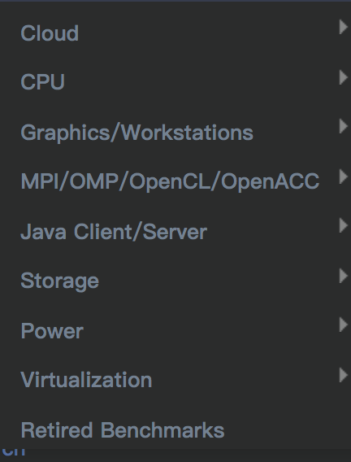

<!-- @import "[TOC]" {cmd="toc" depthFrom=1 depthTo=6 orderedList=false} -->

<!-- code_chunk_output -->

- [1. 概述](#1-概述)
- [2. 标准的性能基准测试工具](#2-标准的性能基准测试工具)
  - [CPU](#cpu)
  - [Memory](#memory)
  - [外设](#外设)
- [3. 文件 I/O 性能基准测试工具](#3-文件-io-性能基准测试工具)
- [网络性能测试](#网络性能测试)
- [5. 基准测试工具套件](#5-基准测试工具套件)
  - [5.1. phoronix.com](#51-phoronixcom)
  - [5.2. 内核中的 Perf](#52-内核中的-perf)
  - [5.3. rt-tests](#53-rt-tests)
- [6. 参考](#6-参考)

<!-- /code_chunk_output -->

# 1. 概述

基准测试是指运行计算机程序去评估硬件和软件性能的行为. 硬件基本测试包括评估处理器, 内存, 显卡, 硬盘, 网络等不同组件的性能.

基准测试有两类 : **复合**和**应用**

* **复合基准**对**一个硬件**执行压力测试, 如连续写入和读取数据.

* **应用基准**则是衡量真实世界应用程序如数据库和服务器的性能.

针对不同**评测目的**, 人们积累一些专门的评测工具, 用于测试目标系统的性能. 例如, 来自 **交易处理性能委员会** (TPC, http://www.tpc.org) 的 **TPC\-C** 就是专门针对 **联机事务处理的基准测试项目**, 而来自 **标准性能评测公司** (SPEC, http://www.spec.org) 的 **CPU2000/CPU2006**、 **Web2005**、 **JBB2005** 和 **HPC2002/MPI2006** 就分别是专门**处理器性能**、**web 服务器**、**Java 应用**和**高性能计算**的基准测试项目.

另外, 上节评测性能指标里, 所谓的"**一个任务**"也不是随意挑选的, 在**实际评测工具**中, 包括了**一系列的负载**(workload), 用于测试目标系统各方面的性能, 借以充分说明问题. 例如, `TPC-C` 就针对订单录入和销售环境事务吞吐量和延迟, 包含了若干个负载, 专门测试系统在同时执行订货、支付、发货、订单查询和库存查询的性能情况.

一般而言, SPEC 会针对不同场景或特点有相应的测试工具, 下面是当前的 benchmark, 不过多数都是收费的, 而且价格较高

# 2. 标准的性能基准测试工具

| benchmark | 描述 |
|:---------:|:---:|
| sysbench | `sysbench` 是一款开源的多线程性能测试工具, 可以执行 `CPU`/内存/线程/`IO`/数据库等方面的性能测试. 简介数据库目前支持 `MySQL/Oracle/PostgreSQL` |
| hackbench | 源码下载地址 [`hackbench.c`](http://people.redhat.com/mingo/cfs-scheduler/tools/hackbench.c), 改进的用于测试调度器性能的 benchmark 工具, 就一个源文件,编译后运行即可, [手册](http://man.cx/hackbench) |
| unixbench | 一个用于测试`unix`系统性能的工具, 也是一个比较通用的`benchmark`, 此测试的目的是对类`Unix` 系统提供一个基本的性能指示, 参见[Linux 性能测试工具-UnixBench--安装以及结果分析](http://blog.csdn.net/gatieme/article/details/50912910) |
| CineBench | 很有说服力的一套 CPU 和显卡测试系统
| GreekBench | Geekbench 测试你的计算机的 CPU 处理器和内存性能 |
| LLCbench | (底层表征基准测试 `ow-Level Characterization Benchmarks`) 是一个基准测试工具, 集成了 `MPBench, CacheBench, 和 BLASBench` 测试方法 |
| HardInfo | 一个 Linux 系统信息查看软件. 它可以显示有关的硬件, 软件, 并进行简单的性能基准测试 |
| GtkPerf | 是一种应用程序设计, 测试基于 GTK +的性能 |

参见

[六款优秀的 Linux 基准测试工具](http://www.oschina.net/news/28468/6-linux-benchmark-tools)

## CPU

## Memory

## 外设

# 3. 文件 I/O 性能基准测试工具

| benchmark | 描述 |
|:---------:|:---:|
| iozone | iozone 是一款 `Linux` 文件系统性能测试工具. 它可以测 `Reiser4, ext3, ext4` |
| iometer | `Iometer` 是一个工作在单系统和集群系统上用来衡量和描述 `I/O` 子系统的工具 |
| bonnie++ | `Bonnie++` 是一个用来测试 `UNIX` 文件系统性能的测试工具, 主要目的是为了找出系统的性能瓶颈, 其名字来源于作者喜爱的歌手 `Bonnie Raitt` |
| dbench | Dbench 和 Tbench 是用来模拟工业标准的 Netbench 负载测试工具来评估文件服务器的测试工具 |

参见[bonnie++、dbench、iozone 工具](http://blog.csdn.net/adaptiver/article/details/7013150)

# 网络性能测试

# 5. 基准测试工具套件

| 工具 | 描述 |
|:---:|:----:|
| Phoronix Test Suite | 知名评测机构 `Phoronix` 提供的 `linux` 平台测试套件 |
| perf | Linux 内核中的系统性能调优工具, Perf Event 是一款随 Linux 内核代码一同发布和维护的性能诊断工具, 由内核社区维护和发展. Perf 不仅可以用于应用程序的性能统计分析, 也可以应用于内核代码的性能统计和分析. 得益于其优秀的体系结构设计, 越来越多的新功能被加入 Perf, 使其已经成为一个多功能的性能统计工具集 . 在第一部分, 将介绍 Perf 在应用程序开发上的应用 |
| rt-tests | "Cyclictest is a high resolution test program, written by User:Tglx, maintained by User:Clark Williams", 也就是它是一个高精度的测试程序, `Cyclictest` 是 `rt-tests` 下的一个测试工具, 也是 `rt-tests` 下使用最广泛的测试工具, 一般主要用来测试使用内核的延迟, 从而判断内核的实时性. |

## 5.1. phoronix.com

`phoronix.com` 是业内一个知名的网站, 其经常发布硬件性能测评以及 `Linux` 系统相关的性能测评, `Phoronix Test Suite` 为该网站旗下的 `linux` 平台测试套件, `Phoronix` 测试套件遵循 `GNU GPLv3` 协议. `Phoronix Test Suite` 默认是通过命令行来的进行测试的, 但也可以调用`GUI`, `Phoronix　Test Suite` 还提供了上传测试结果的服务, 也就说你可以把你的测试结果上传在网上, 从而可以和别的 `Linux` 用户测出来的结果进行对比.

## 5.2. 内核中的 Perf

`Perf` 是用来进行软件性能分析的工具.

通过它, 应用程序可以利用 `PMU, tracepoint` 和内核中的特殊计数器来进行性能统计. 它不但可以分析指定应用程序的性能问题 (`per thread`), 也可以用来分析内核的性能问题, 当然也可以同时分析应用代码和内核, 从而全面理解应用程序中的性能瓶颈.

最初的时候, 它叫做 `Performance counter`, 在 `2.6.31` 中第一次亮相. 此后他成为内核开发最为活跃的一个领域. 在 `2.6.32` 中它正式改名为 `Performance Event`, 因为 `perf` 已不再仅仅作为 `PMU` 的抽象, 而是能够处理所有的性能相关的事件.

使用 `perf`, 您可以分析程序运行期间发生的硬件事件. 比如 `instructions retired`, `processor clock cycles` 等; 您也可以分析软件事件, 比如 `Page Fault` 和进程切换.

这使得 `Perf` 拥有了众多的性能分析能力. 举例来说, 使用 `Perf` 可以计算每个时钟周期内的指令数, 称为 `IPC`, `IPC` 偏低表明代码没有很好地利用 `CPU`. `Perf` 还可以对程序进行函数级别的采样, 从而了解程序的性能瓶颈究竟在哪里等等. `Perf` 还可以替代 `strace`, 可以添加动态内核 `probe` 点, 还可以做 `benchmark` 衡量调度器的好坏.

人们或许会称它为进行性能分析的"瑞士军刀" 和 "倚天剑".

## 5.3. rt-tests

cyclictest 测试内核的性能, 包括了 `hackbench`, `cyclictest` 等多个 `benchmark` 工具

[Cyclictest 的维基主页](https://rt.wiki.kernel.org/index.php/Cyclictest)这么介绍它"Cyclictest is a high resolution test program, written by User:Tglx, maintained by User:Clark Williams ", 也就是它是一个高精度的测试程序, `Cyclictest` 是 `rt-tests` 下的一个测试工具, 也是 rt-tests 下使用最广泛的测试工具, 一般主要用来测试使用内核的延迟, 从而判断内核的实时性.

[cyclictest 简介以及安装](http://blog.csdn.net/longerzone/article/details/16897655)

[cyclictest 的使用](http://blog.csdn.net/ganggexiongqi/article/details/5841347)

# 6. 参考

https://blog.csdn.net/gatieme/article/details/54296440

https://my.oschina.net/u/4290244/blog/3348778

