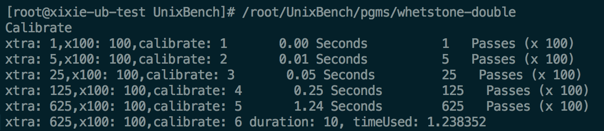
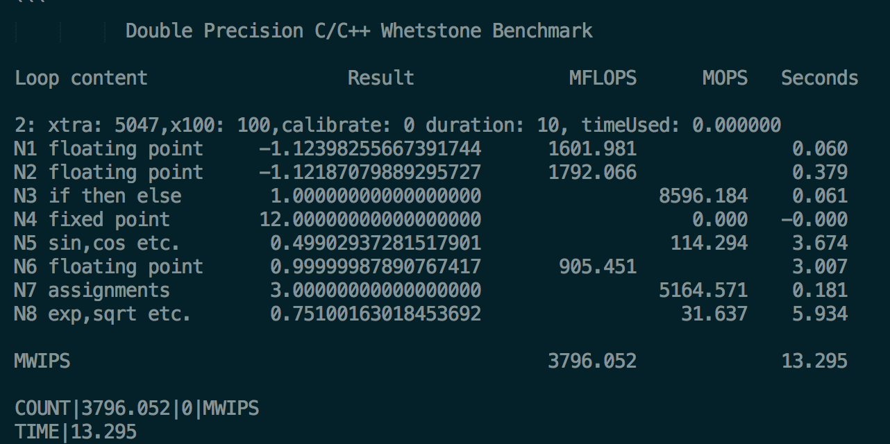

<!-- @import "[TOC]" {cmd="toc" depthFrom=1 depthTo=6 orderedList=false} -->

<!-- code_chunk_output -->

- [1. 介绍](#1-介绍)
- [2. 官网地址](#2-官网地址)
- [3. 安装](#3-安装)
- [4. 运行参数](#4-运行参数)
- [5. 测试得分项说明](#5-测试得分项说明)
  - [5.1. Dhrystone 2 using register variables: 字符串处理/整数性能](#51-dhrystone-2-using-register-variables-字符串处理整数性能)
  - [5.2. Double-Precision Whetstone: 整数和浮点数操作](#52-double-precision-whetstone-整数和浮点数操作)
  - [5.3. Execl Throughput: excel 系统调用](#53-execl-throughput-excel-系统调用)
  - [5.4. File copy: 文件 copy](#54-file-copy-文件-copy)
  - [5.5. Pipe Throughput: 一个进程管道写读回](#55-pipe-throughput-一个进程管道写读回)
  - [5.6. Pipe-based Context Switching: 两个进程双向管道传输](#56-pipe-based-context-switching-两个进程双向管道传输)
  - [5.7. Process Creation: 进程创建回收(内存带宽)](#57-process-creation-进程创建回收内存带宽)
  - [5.8. System Call Overhead: 系统调用代价](#58-system-call-overhead-系统调用代价)
  - [5.9. Shell Scripts: shell 脚本](#59-shell-scripts-shell-脚本)
- [6. 算分](#6-算分)
  - [6.1. 单进程算分](#61-单进程算分)
  - [6.2. 多进程算分](#62-多进程算分)
  - [6.3. 总分](#63-总分)
- [7. 参考](#7-参考)

<!-- /code_chunk_output -->

# 1. 介绍

UnixBench 是一个类 unix 系(Unix, BSD, Linux)统下的性能测试工具, 一个开源工具, 被广泛用与测试 linux 系统主机的性能.

Unixbench 的主要测试项目有: **系统调用**、**读写**、**进程**、**图形化测试**、**2D**、**3D**、**管道**、**运算**、**C 库**等系统基准性能提供测试数据.

最新版本 UnixBench5.1.3, 包含**system**和**graphic**测试, 如果你需要测试 graphic, 则需要修改 Makefile, 不要注释掉 "`GRAPHIC_TESTS = defined`", 同时需要系统提供 x11perf 命令 `gl_glibs` 库.

下面的脚本使用了最新版 UnixBench5.1.3 来测试, 注释了关于 graphic 的测试项(大多数 VPS 都是没有显卡或者是集显, 所以图像性能无需测试), 运行 10-30 分钟后(根据 CPU 内核数量, 运算时间不等)得出分数, **越高越好**.

# 2. 官网地址

https://github.com/kdlucas/byte-unixbench

# 3. 安装

下载

```
wget https://s3.amazonaws.com/cloudbench/software/UnixBench5.1.3.tgz
wget https://storage.googleapis.com/google-code-archive-downloads/v2/code.google.com/byte-unixbench/UnixBench5.1.3.tgz
```

解压, 编译

```
tar -xvf UnixBench5.1.3.tgz
cd UnixBench/
make all
```

如果你不需要测试图形性能的话, 可以在编译之前把 Makefile 中的 `GRAPHIC_TESTS = defined` 注释掉

# 4. 运行参数

直接执行 `./Run`

```
[root@02master01 UnixBench]# ./Run
```

注: 执行 `Run` 就会自动编译, 所以其实也不需要先 `make all`

执行命令 `./Run` 即可. 脚本会先进行编译, 然后再执行测试

如果就执行 `Run` 就是做一个**系统测试**, 如果执行 `Run graphics` 就是执行**图形测试**, 执行 `Run gindex` 就是**两个测试都执行**, 测试时间是相当漫长的.

执行结果:

```
[root@02master01 UnixBench]# ./Run
make all
make[1]: Entering directory `/root/unixbench/UnixBench'
Checking distribution of files
./pgms  exists
./src  exists
./testdir  exists
./tmp  exists
./results  exists
make[1]: Leaving directory `/root/unixbench/UnixBench'
sh: 3dinfo: command not found

   #    #  #    #  #  #    #          #####   ######  #    #   ####   #    #
   #    #  ##   #  #   #  #           #    #  #       ##   #  #    #  #    #
   #    #  # #  #  #    ##            #####   #####   # #  #  #       ######
   #    #  #  # #  #    ##            #    #  #       #  # #  #       #    #
   #    #  #   ##  #   #  #           #    #  #       #   ##  #    #  #    #
    ####   #    #  #  #    #          #####   ######  #    #   ####   #    #

   Version 5.1.3                      Based on the Byte Magazine Unix Benchmark

   Multi-CPU version                  Version 5 revisions by Ian Smith,
                                      Sunnyvale, CA, USA
   January 13, 2011                   johantheghost at yahoo period com


1 x Dhrystone 2 using register variables  1 2 3 4 5 6 7 8 9 10

1 x Double-Precision Whetstone  1 2 3 4 5 6 7 8 9 10

1 x Execl Throughput  1 2 3

1 x File Copy 1024 bufsize 2000 maxblocks  1 2 3

1 x File Copy 256 bufsize 500 maxblocks  1 2 3

1 x File Copy 4096 bufsize 8000 maxblocks  1 2 3

1 x Pipe Throughput  1 2 3 4 5 6 7 8 9 10

1 x Pipe-based Context Switching  1 2 3 4 5 6 7 8 9 10

1 x Process Creation  1 2 3

1 x System Call Overhead  1 2 3 4 5 6 7 8 9 10

1 x Shell Scripts (1 concurrent)  1 2 3

1 x Shell Scripts (8 concurrent)  1 2 3

4 x Dhrystone 2 using register variables  1 2 3 4 5 6 7 8 9 10

4 x Double-Precision Whetstone  1 2 3 4 5 6 7 8 9 10

4 x Execl Throughput  1 2 3

4 x File Copy 1024 bufsize 2000 maxblocks  1 2 3

4 x File Copy 256 bufsize 500 maxblocks  1 2 3

4 x File Copy 4096 bufsize 8000 maxblocks  1 2 3

4 x Pipe Throughput  1 2 3 4 5 6 7 8 9 10

4 x Pipe-based Context Switching  1 2 3 4 5 6 7 8 9 10

4 x Process Creation  1 2 3

4 x System Call Overhead  1 2 3 4 5 6 7 8 9 10

4 x Shell Scripts (1 concurrent)  1 2 3

4 x Shell Scripts (8 concurrent)  1 2 3

========================================================================
   BYTE UNIX Benchmarks (Version 5.1.3)

   System: gerry: GNU/Linux
   OS: GNU/Linux -- 3.10.0-957.27.2.el7.x86_64 -- #1 SMP Mon Jul 29 17:46:05 UTC 2019
   Machine: x86_64 (x86_64)
   Language: en_US.utf8 (charmap="UTF-8", collate="UTF-8")
   CPU 0: Intel(R) Core(TM) i7-9750H CPU @ 2.60GHz (5183.5 bogomips)
          x86-64, MMX, Physical Address Ext, SYSENTER/SYSEXIT, SYSCALL/SYSRET, Intel virtualization
   CPU 1: Intel(R) Core(TM) i7-9750H CPU @ 2.60GHz (5183.5 bogomips)
          x86-64, MMX, Physical Address Ext, SYSENTER/SYSEXIT, SYSCALL/SYSRET, Intel virtualization
   CPU 2: Intel(R) Core(TM) i7-9750H CPU @ 2.60GHz (5183.5 bogomips)
          x86-64, MMX, Physical Address Ext, SYSENTER/SYSEXIT, SYSCALL/SYSRET, Intel virtualization
   CPU 3: Intel(R) Core(TM) i7-9750H CPU @ 2.60GHz (5183.5 bogomips)
          x86-64, MMX, Physical Address Ext, SYSENTER/SYSEXIT, SYSCALL/SYSRET, Intel virtualization
   09:16:51 up  6:16,  5 users,  load average: 0.08, 0.08, 0.06; runlevel 5

------------------------------------------------------------------------
Benchmark Run: 一 8 月 19 2019 09:16:51 - 09:46:06
4 CPUs in system; running 1 parallel copy of tests

Dhrystone 2 using register variables       49801420.7 lps   (10.0 s, 7 samples)
Double-Precision Whetstone                     3414.8 MWIPS (17.0 s, 7 samples)
Execl Throughput                               2345.2 lps   (30.0 s, 2 samples)
File Copy 1024 bufsize 2000 maxblocks        495356.8 KBps  (30.0 s, 2 samples)
File Copy 256 bufsize 500 maxblocks          133957.0 KBps  (30.0 s, 2 samples)
File Copy 4096 bufsize 8000 maxblocks       1478179.8 KBps  (30.0 s, 2 samples)
Pipe Throughput                              657217.3 lps   (10.0 s, 7 samples)
Pipe-based Context Switching                 136675.8 lps   (10.0 s, 7 samples)
Process Creation                               6087.7 lps   (30.0 s, 2 samples)
Shell Scripts (1 concurrent)                   6593.1 lpm   (60.0 s, 2 samples)
Shell Scripts (8 concurrent)                   2119.5 lpm   (60.0 s, 2 samples)
System Call Overhead                         453087.5 lps   (10.0 s, 7 samples)

System Benchmarks Index Values               BASELINE       RESULT    INDEX
Dhrystone 2 using register variables         116700.0   49801420.7   4267.5
Double-Precision Whetstone                       55.0       3414.8    620.9
Execl Throughput                                 43.0       2345.2    545.4
File Copy 1024 bufsize 2000 maxblocks          3960.0     495356.8   1250.9
File Copy 256 bufsize 500 maxblocks            1655.0     133957.0    809.4
File Copy 4096 bufsize 8000 maxblocks          5800.0    1478179.8   2548.6
Pipe Throughput                               12440.0     657217.3    528.3
Pipe-based Context Switching                   4000.0     136675.8    341.7
Process Creation                                126.0       6087.7    483.2
Shell Scripts (1 concurrent)                     42.4       6593.1   1555.0
Shell Scripts (8 concurrent)                      6.0       2119.5   3532.6
System Call Overhead                          15000.0     453087.5    302.1
                                                                   ========
System Benchmarks Index Score                                         949.9

------------------------------------------------------------------------
Benchmark Run: 一 8 月 19 2019 09:46:06 - 10:15:26
4 CPUs in system; running 4 parallel copies of tests

Dhrystone 2 using register variables      155369612.3 lps   (10.0 s, 7 samples)
Double-Precision Whetstone                    13282.8 MWIPS (16.4 s, 7 samples)
Execl Throughput                               9472.2 lps   (29.6 s, 2 samples)
File Copy 1024 bufsize 2000 maxblocks       1400718.2 KBps  (30.0 s, 2 samples)
File Copy 256 bufsize 500 maxblocks          392377.8 KBps  (30.0 s, 2 samples)
File Copy 4096 bufsize 8000 maxblocks       3828487.7 KBps  (30.0 s, 2 samples)
Pipe Throughput                             2241533.0 lps   (10.0 s, 7 samples)
Pipe-based Context Switching                 485223.7 lps   (10.0 s, 7 samples)
Process Creation                              22870.1 lps   (30.0 s, 2 samples)
Shell Scripts (1 concurrent)                  18257.6 lpm   (60.0 s, 2 samples)
Shell Scripts (8 concurrent)                   2585.8 lpm   (60.0 s, 2 samples)
System Call Overhead                        1646189.3 lps   (10.0 s, 7 samples)

System Benchmarks Index Values               BASELINE       RESULT    INDEX
Dhrystone 2 using register variables         116700.0  155369612.3  13313.6
Double-Precision Whetstone                       55.0      13282.8   2415.1
Execl Throughput                                 43.0       9472.2   2202.8
File Copy 1024 bufsize 2000 maxblocks          3960.0    1400718.2   3537.2
File Copy 256 bufsize 500 maxblocks            1655.0     392377.8   2370.9
File Copy 4096 bufsize 8000 maxblocks          5800.0    3828487.7   6600.8
Pipe Throughput                               12440.0    2241533.0   1801.9
Pipe-based Context Switching                   4000.0     485223.7   1213.1
Process Creation                                126.0      22870.1   1815.1
Shell Scripts (1 concurrent)                     42.4      18257.6   4306.0
Shell Scripts (8 concurrent)                      6.0       2585.8   4309.7
System Call Overhead                          15000.0    1646189.3   1097.5
                                                                   ========
System Benchmarks Index Score                                        2873.4
```

很多人就拿了 2873.4 那个分数去比了, 但是上面那个单进程结果 949.9 也有意义, 但凡接触了这么多案例, 没人关心过. 多进程结果就是根据系统 CPU 核数, 同时起多个进程的结果; 单进程就是只起一个进程的结果, 对于系统性能来说, 两个结果都是有意义的.

`./Run` 到底执行了什么? 默认执行的是 Index 模块, 它包含下面几个小程序:

```sh
my $oldsystem = [
    "execl", "fstime", "fsbuffer", "fsdisk", "pipe", "context1", "spawn",
    "syscall"
];

my $index = [
   "dhry2reg", "whetstone-double", @$oldsystem, "shell1", "shell8"
];
```

对应的就是上面的结果的各个结果对应的 case 了.

翻看了下它的源代码, 它的执行参数如下: `./Run` 模块 `-i` 迭代次数 `-c` 进程并发数 `-q/-v`(输出方式.

- 模块: 有时候你只想测某一个小程序的结果, 那你可以修改自己去新增一个模块, 修改测试内容, 这对于调试是非常方便的, 也可以直接指定某个执行程序.

- 迭代次数: 关于迭代次数, 不能想当然的就理解成这就是要执行的次数了, **默认框架**分为**两种迭代模式**, 一种是**短迭代次数**, 默认 **3 次**, 一种是 **长迭代次数**, 默认**10 次**. 那**输入的迭代次数**就是**默认的长迭代次数**, 短迭代次数=(迭代次数 + 1)/3,如果结果小于就是 1. 程序配置好了, 该选择哪个迭代次数.

- 进程并发数: 如果你想进程并发数**不是系统 CPU 数**, 那就可以通过这个调整;

- 输出方式: 是**静默**还是**详细输出方式**;

# 5. 测试得分项说明

## 5.1. Dhrystone 2 using register variables: 字符串处理/整数性能

这里有比较详细的[dhrystone 介绍](https://en.wikipedia.org/wiki/Dhrystone), 这个主要是测整数性能, 对应的浮点数测试是: `Double-Precision Whetstone`.

此项用于测试 **string handling**, 因为没有浮点操作, 所以深受**软件和硬件设计**(`hardware and software design`)、**编译和链接**(`compiler and linker options`)、**代码优化**(`code optimazaton`)、**对内存的 cache**(`cache memory`)、**等待状态**(`wait states`)、**整数数据类型**(`integer data types`)的影响.

可以通过编译优化提高性能, 不能真实反映 CPU 性能. 这篇文章比较有典型意义: Benchmarking in context: Dhrystone.

说下输出: 默认就是在 10 秒内, 计算次数, 算出分数后, 参考 UnixBench 算分介绍, 算出 Index 分数.

## 5.2. Double-Precision Whetstone: 整数和浮点数操作

这一项测试**浮点数操作**的速度和效率. `whets.c`

这一测试包括几个模块, 每个模块都包括一组用于科学计算的操作.

覆盖面很广的一系列 c 函数: **sin**, **cos**, **sqrt**, **exp**, **log** 被用于**整数**和**浮点数**的**数学运算**、**数组访问**、**条件分**支(`conditional branch`)和**程序调用**.

此测试同时测试了**整数和浮点数算术运算**.

1) 它需要得到一个合适的参数. 怎么得出这个运算呢: 有坨运算, 随着传入参数(xtra)变大, 耗时会逐渐增减, 当耗时增加到超过 2 秒时, 参数停止变大.



2) 如果跑 10 秒大概的参数会是怎样呢: `625 * 10/1.238352 = 5047`

3) 根据输入参数, 去计算结果, 之前一直没有说, 那一坨计算是什么, 总共分为 8 步, 英文解释还是比较清楚的, 采纳了其中的浮点数分数, 不过它的时间怎么把其他计算的时间也算在里面了, 既然只关心浮点数运算, 为什么还要加入 N3, N4, N5, N7, N8 这几步, 后续计算参考前面算法规则 UnixBench 算分介绍.



## 5.3. Execl Throughput: excel 系统调用

此测试考察每秒钟可以执行的 **execl 系统调用**的次数.  execl 系统调用是 exec 函数族的一员. 它和其他一些与之相似的命令一样是 execve() 函数的前端.

除了前面介绍的那两个比较复杂, UnixBench 其他的运算都比较简单, Execl 它的实际就是递归调用, 它主要利用的是 execl 函数. 本身 execl.c 编译出来后的执行文件是 execl 的二进制文件, execl 函数执行的时候记录参数: 开始时间, 执行次数, 耗时(一般都是 10 秒). 当本次总执行时间耗时超过 10 秒时, 输出执行次数, 然后根据算分规则算分, 这个思想还是很巧妙的.

## 5.4. File copy: 文件 copy

测试从**一个文件**向**另外一个文件传输数据**的速率. 每次测试使用**不同大小的缓冲区**. 这一**针对文件** **read**、**write**、**copy** 操作的测试统计**规定时间(默认是 10s**)内的文件 read、write、copy **操作次数**.

这个主要是测试的 write 和 read 两个函数, 测试 30 秒. 实现很简单,先写入一个文件 2 秒(循环写入), 再读 2 秒, 然后从刚刚写入的文件读取数据, 写入到另一个文件, 循环写入, 在 30 秒的读写次数.  不同的参数测试测的是不同块大小, 不同块数的性能, 如果测试磁盘建议用 FIO 测试.

## 5.5. Pipe Throughput: 一个进程管道写读回

**管道(pipe**)是**进程间交流**的最简单方式, 这里的 Pipe throughtput 指的是**一秒钟**内**一个进程**可以**向一个管道写 512 字节数据**然后**再读回**的**次数**.

需要注意的是, pipe throughtput 在实际编程中**没有对应的真实存在**.

打开一个管道, 往管道写入 512 个 bytes, 再读出来, 测试 10 秒, 总共读写次数

## 5.6. Pipe-based Context Switching: 两个进程双向管道传输

这个测试**两个进程(每秒钟**)通过**一个管道交换一个不断增长的整数的次数**. 这一点很像现实编程中的一些应用, 这个测试程序首先**创建一个子进程**, 再和这个子进程进行**双向的管道传输**.

打开两个管道, 开启两个进程, 其中一个进程往管道 1 写, 往管道 2 读, 另一个进程往管道 2 写, 往管道 2 读, 一个进程完成一次读写, 计数 + 1.

其中一个很有意思的事情: 如果这两个进程在同一个 CPU 和不同的 CPU 有完全不同的性能, 在同一个 CPU 下性能会好很多. 这里有篇很细致的分析, 值得大家评阅: [Unixbench 测试套件缺陷深度分析](https://mp.weixin.qq.com/s/lDiAd-HnIh01O8htTqHlaA)

## 5.7. Process Creation: 进程创建回收(内存带宽)

测试每秒钟一个进程可以**创建子进程**然后**收回子进程**的次数(子进程一定立即退出).

process creation 的关注点是**新进程进程控制块(process control block)的创建**和**内存分配**, 即一针见血地**关注内存带宽**.

一般说来, 这个测试被用于对操作系统**进程创建这一系统调用**的**不同实现**的比较.

就是不停调用 fork 函数, 创建进程, 并立马退出, 成功一次计数+1.

## 5.8. System Call Overhead: 系统调用代价

测试进入和离开操作系统内核的代价, 即**一次系统调用的代价**.

它利用一个反复地调用 **getpid** 函数的小程序达到此目的.

本意是想计算进入离开操作系统的开销, 进入离开一次计数+1, 在 10 秒内的执行次数. 实际执行的效果是 fork 子进程, waitpid 函数后退出, 计数+1

## 5.9. Shell Scripts: shell 脚本

测试一秒钟内一个进程可以**并发**地开始一个 shell 脚本的 n 个拷贝的次数, n 一般取值 1, 2, 4, 8. (我在测试时取 1,  8). 这个脚本对一个数据文件进行一系列的变形操作(transformation).

shell 脚本测试用于衡量在一分钟内, 一个进程可以启动并停止 shell 脚本的次数, 通常会测试 1, 2,  3,  4,  8 个 shell 脚本的共同拷贝, shell 脚本是一套转化数据文件的脚本.

通过**fork 函数**, **创建进程**, 不停地**执行一个脚本**, 执行成功一次 + 1. 所谓 Shell Scripts (1 concurrent) 一个并发是指传递给脚本: pgms/multi.sh 参数是 1, 同样 Shell Scripts (8 concurrent) , 传递给脚本的参数是 8, 同时 8 个子任务并发执行.

# 6. 算分

每个小程序在执行的时候都需要指定迭代模式和执行时间以及并发情况, 所有的进程一次执行的结果都是统一模式.

通过 `-v` 参数可以得到详细输出

```
# ./Run -v
```

## 6.1. 单进程算分

下面是单进程的一个举例:

```
Process Creation -- 1 copy
==> "/opt/unixbench/UnixBench/pgms/spawn" 30 2>&1 >> "/opt/unixbench/UnixBench/results/VM_0_13_centos-2018-06-25-05.log"

#### Pass 1


# COUNT0: 247371 #分数
# COUNT1: 1 # timebase 程序写死
# COUNT2: lps # 测试项名称
# elapsed: 30.003119 # 耗时
# pid: 16803 # 进程 ID
# status: 0 # 是否成功退出

#### Pass 2


# COUNT0: 242919
# COUNT1: 1
# COUNT2: lps
# elapsed: 30.002898
# pid: 5035
# status: 0

#### Pass 3


# COUNT0: 243989
# COUNT1: 1
# COUNT2: lps
# elapsed: 30.002732
# pid: 21228
# status: 0

*Dump score:     242919.0
Count score:     243989.0
Count score:     247371.0

>>>> Results of 1 copy
>>>> score: 8188.34084738901
>>>> time: 30.0029255
>>>> iterations: 2
```

其中 COUNT0, COUNT1, COUNT2 是这么算出来的, 每个进程的结果如:

```
COUNT|x|y|x
```

经过解析, 变成如下:

```
    COUNT0 = x
    COUNT1 = y
    COUNT2 = z
```

算分过程如下:

1) 根据 COUNT0 从小到大, 去掉 1/3 的最差结果;

2) 如果 timebase, 耗时都是大于 0,  `$product += log($COUNT0) - log(耗时/$timebase)` 否则就不需要考虑耗时这块: `$product += log($COUNT0)`

3) 单项性能分: `$score = exp($product/2)`, 2 是统计的迭代次数, 经过计算恰好是这个分数, 与系统输出一致.

4) 它总的算法思想: 就是先通过 log 降维, 把不同次数不一样的结果尽可能拉平, 平均然后在阶乘, 后面多个结果也是这个思想, 先降维, 再平均, 再阶乘.

## 6.2. 多进程算分

那如果并发执行多个呢? 举例如下:

```
Shell Scripts (1 concurrent) -- 4 copies
==> "/opt/unixbench/UnixBench/pgms/looper" 60 "/opt/unixbench/UnixBench/pgms/multi.sh" 1 2>&1 >> "/opt/unixbench/UnixBench/results/VM_0_13_centos-2018-06-25-05.log"

#### Pass 1


# COUNT0: 4614
# COUNT1: 60
# COUNT2: lpm
# elapsed: 60.005639
# pid: 20858
# status: 0

# COUNT0: 4596
# COUNT1: 60
# COUNT2: lpm
# elapsed: 60.009496
# pid: 20859
# status: 0

# COUNT0: 4592
# COUNT1: 60
# COUNT2: lpm
# elapsed: 60.011761
# pid: 20862
# status: 0

# COUNT0: 4614
# COUNT1: 60
# COUNT2: lpm
# elapsed: 60.011930
# pid: 20864
# status: 0

#### Pass 2


# COUNT0: 4547
# COUNT1: 60
# COUNT2: lpm
# elapsed: 60.005597
# pid: 10791
# status: 0

# COUNT0: 4590
# COUNT1: 60
# COUNT2: lpm
# elapsed: 60.013270
# pid: 10793
# status: 0

# COUNT0: 4578
# COUNT1: 60
# COUNT2: lpm
# elapsed: 60.006054
# pid: 10794
# status: 0

# COUNT0: 4561
# COUNT1: 60
# COUNT2: lpm
# elapsed: 60.014214
# pid: 10797
# status: 0

#### Pass 3


# COUNT0: 4631
# COUNT1: 60
# COUNT2: lpm
# elapsed: 60.013816
# pid: 31734
# status: 0

# COUNT0: 4632
# COUNT1: 60
# COUNT2: lpm
# elapsed: 60.012614
# pid: 31735
# status: 0

# COUNT0: 4637
# COUNT1: 60
# COUNT2: lpm
# elapsed: 60.005633
# pid: 31737
# status: 0

# COUNT0: 4645
# COUNT1: 60
# COUNT2: lpm
# elapsed: 60.006082
# pid: 31740
# status: 0

*Dump score:      18276.0
Count score:      18416.0
Count score:      18545.0

>>>> Sum of 4 copies
>>>> score: 18477.4244713467
>>>> time: 60.009621375
>>>> iterations: 2
```

算分过程如下:

1) 分数: 如 18545, 就是 PASS3 个项的加总: `4631 + 4632 + 4637 + 4645`

2) 耗时: 平均值, 即: `(60.013816 + 60.012614 + 60.005633 + 60.006082)/4 = 60.00953625`

3) timebase: 还是那个 COUNT1

上述 3 步即是把一个并发结果合成一个结果, 然后的积分方式跟单进程的方式一样

## 6.3. 总分

那文章开头多进程的图例分数举例:

1) 算出来的每项 score 有个加权分数, 要除以 10(作为单项比拼, 我觉得除不除 10 无所谓, 估计是为了跟总分接近)

2) 总分计算: = `exp(average(每项 score 分*10))`, 结果恰恰好就是我们要的结果.

综上对 UnixBench 的分数计算算是全面介绍了一边, 当面目录下有 excel 证明计算过程.

# 7. 参考

https://www.jianshu.com/p/c8ba467093a6

https://yq.aliyun.com/articles/674729

https://yq.aliyun.com/articles/674728?spm=a2c4e.11153940.0.0.4a2b2aaeEFaLg3