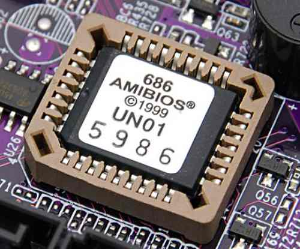

<!-- @import "[TOC]" {cmd="toc" depthFrom=1 depthTo=6 orderedList=false} -->

<!-- code_chunk_output -->

- [1. boot 的含义](#1-boot-的含义)
- [2. 第一阶段: BIOS](#2-第一阶段-bios)
  - [2.1. 硬件自检](#21-硬件自检)
  - [2.2. 启动顺序](#22-启动顺序)
- [3. 第二阶段: 主引导记录](#3-第二阶段-主引导记录)
  - [3.1. 主引导记录的结构](#31-主引导记录的结构)
  - [3.2. 分区表](#32-分区表)
- [4. 第三阶段: 硬盘启动](#4-第三阶段-硬盘启动)
  - [4.1. 情况 A: 卷引导记录](#41-情况-a-卷引导记录)
  - [4.2. 情况 B: 扩展分区和逻辑分区](#42-情况-b-扩展分区和逻辑分区)
  - [4.3. 情况 C: 启动管理器](#43-情况-c-启动管理器)
- [5. 第四阶段: 操作系统](#5-第四阶段-操作系统)
- [6. 参考](#6-参考)

<!-- /code_chunk_output -->

# 1. boot 的含义

从打开电源到开始操作, 计算机的启动是一个非常复杂的过程.

"启动"用英语是 boot. 可是, boot 原来的意思是靴子, "启动"与靴子有什么关系呢? 原来, 这里的 boot 是 bootstrap(鞋带)的缩写, 它来自一句谚语:

"pull oneself up by one's bootstraps"

字面意思是"拽着鞋带把自己拉起来", 这当然是不可能的事情. 最早的时候, 工程师们用它来比喻, 计算机启动是一个很矛盾的过程: 必须先运行程序, 然后计算机才能启动, 但是计算机不启动就无法运行程序！

早期真的是这样, 必须想尽各种办法, 把一小段程序装进内存, 然后计算机才能正常运行. 所以, 工程师们把这个过程叫做"拉鞋带", 久而久之就简称为 boot 了.

计算机的整个启动过程分成四个阶段.

# 2. 第一阶段: BIOS

上个世纪 70 年代初, "只读内存"(read-only memory, 缩写为 ROM)发明, 开机程序被刷入 ROM 芯片, 计算机通电后, 第一件事就是读取它.



这块芯片里的程序叫做"基本输入输出系统"(Basic Input/Output System), 简称为 BIOS.

## 2.1. 硬件自检

BIOS 程序首先检查, 计算机硬件能否满足运行的基本条件, 这叫做"硬件自检"(Power-On Self-Test), 缩写为 POST.

如果硬件出现问题, 主板会发出不同含义的蜂鸣, 启动中止. 如果没有问题, 屏幕就会显示出 CPU、内存、硬盘等信息.


## 2.2. 启动顺序

硬件自检完成后, BIOS 把控制权转交给下一阶段的启动程序.

这时, BIOS 需要知道, "下一阶段的启动程序"具体存放在哪一个设备. 也就是说, BIOS 需要有一个外部储存设备的排序, 排在前面的设备就是优先转交控制权的设备. 这种排序叫做"启动顺序"(Boot Sequence).

打开 BIOS 的操作界面, 里面有一项就是"设定启动顺序".


# 3. 第二阶段: 主引导记录

BIOS 按照"启动顺序", 把控制权转交给排在第一位的储存设备.

这时, 计算机读取该设备的第一个扇区, 也就是读取最前面的 512 个字节. 如果这 512 个字节的最后两个字节是 0x55 和 0xAA, 表明这个设备可以用于启动; 如果不是, 表明设备不能用于启动, 控制权于是被转交给"启动顺序"中的下一个设备.

这最前面的**512 个字节**, 就叫做"主引导记录"(Master boot record, 缩写为 MBR).

## 3.1. 主引导记录的结构

"主引导记录"只有 512 个字节, 放不了太多东西. 它的主要作用是, 告诉计算机到硬盘的**哪一个位置去找操作系统**.

主引导记录由三个部分组成:

```
(1) 第 1-446 字节: 调用操作系统的机器码.
(2) 第 447-510 字节: 分区表(Partition table).
(3) 第 511-512 字节: 主引导记录签名(0x55 和 0xAA).
```

其中, 第二部分"分区表"的作用, 是将硬盘分成若干个区.

## 3.2. 分区表

硬盘分区有很多好处. 考虑到每个区可以安装不同的操作系统, "主引导记录"因此必须知道将控制权转交给哪个区.

分区表的长度只有 64 个字节, 里面又分成四项, 每项 16 个字节. 所以, 一个硬盘最多只能分四个一级分区, 又叫做"主分区".

每个主分区的 16 个字节, 由 6 个部分组成:

```
(1) 第 1 个字节: 如果为 0x80, 就表示该主分区是激活分区, 控制权要转交给这个分区. 四个主分区里面只能有一个是激活的.
(2) 第 2-4 个字节: 主分区第一个扇区的物理位置(柱面、磁头、扇区号等等).
(3) 第 5 个字节: 主分区类型.
(4) 第 6-8 个字节: 主分区最后一个扇区的物理位置.
(5) 第 9-12 字节: 该主分区第一个扇区的逻辑地址.
(6) 第 13-16 字节: 主分区的扇区总数.
```

最后的四个字节("主分区的扇区总数"), 决定了这个主分区的长度. 也就是说, 一个主分区的扇区总数最多不超过 2 的 32 次方.

如果每个扇区为 512 个字节, 就意味着单个分区最大不超过 2TB. 再考虑到扇区的逻辑地址也是 32 位, 所以单个硬盘可利用的空间最大也不超过 2TB. 如果想使用更大的硬盘, 只有 2 个方法: 一是提高每个扇区的字节数, 二是[增加扇区总数](https://en.wikipedia.org/wiki/GUID_Partition_Table).

# 4. 第三阶段: 硬盘启动

这时, 计算机的控制权就要转交给**硬盘的某个分区**了, 这里又分成三种情况.

## 4.1. 情况 A: 卷引导记录

上一节提到, 四个主分区里面, 只有一个是激活的. 计算机会读取激活分区的第一个扇区, 叫做"卷引导记录"(Volume boot record, 缩写为 VBR).

"卷引导记录"的主要作用是, 告诉计算机, 操作系统在这个分区里的位置. 然后, 计算机就会加载操作系统了.

## 4.2. 情况 B: 扩展分区和逻辑分区

随着硬盘越来越大, 四个主分区已经不够了, 需要更多的分区. 但是, 分区表只有四项, 因此规定有且仅有一个区可以被定义成"扩展分区"(Extended partition).

所谓"扩展分区", 就是指这个区里面又分成多个区. 这种分区里面的分区, 就叫做"逻辑分区"(logical partition).

计算机先读取扩展分区的第一个扇区, 叫做"扩展引导记录"(Extended boot record, 缩写为 EBR). 它里面也包含一张 64 字节的分区表, 但是最多只有两项(也就是两个逻辑分区).

计算机接着读取第二个逻辑分区的第一个扇区, 再从里面的分区表中找到第三个逻辑分区的位置, 以此类推, 直到某个逻辑分区的分区表只包含它自身为止(即只有一个分区项). 因此, 扩展分区可以包含无数个逻辑分区.

但是, 似乎很少通过这种方式启动操作系统. 如果操作系统确实安装在扩展分区, 一般采用下一种方式启动.

## 4.3. 情况 C: 启动管理器

在这种情况下, 计算机读取"主引导记录"前面 446 字节的机器码之后, 不再把控制权转交给某一个分区, 而是运行事先安装的"启动管理器"(boot loader), 由用户选择启动哪一个操作系统.

Linux 环境中, 目前最流行的启动管理器是 Grub.


# 5. 第四阶段: 操作系统

控制权转交给操作系统后, 操作系统的内核首先被载入内存.

以 Linux 系统为例, 先载入/boot 目录下面的 kernel. 内核加载成功后, 第一个运行的程序**是/sbin/init**. 它根据配置文件(Debian 系统**是/etc/initab**)产生**init 进程**. 这是 Linux 启动后的第一个进程, **pid 进程编号为 1**, 其他进程都是它的后代.

然后, init 线程加载系统的各个模块, 比如窗口程序和网络程序, 直至**执行/bin/login 程序**, 跳出登录界面, 等待用户输入用户名和密码.

至此, 全部启动过程完成.

# 6. 参考

- 8086 启动过程参考 Assembly/x86/x86 汇编_从实模式到保护模式/计算机启动过程

- 转自: http://www.ruanyifeng.com/blog/2013/02/booting.html
