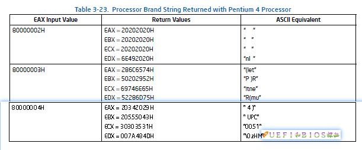

CPU 型号等信息是**BIOS 提供**的. BIOS 通过**SMBIOS 表**告诉 OS 这个信息, OS 才能在系统信息里面显示出来. 那么 BIOS 又是从哪里得到这个信息呢, 是根据**CPU 型号**自己组合出来的吗?

答案是否定的. 这个信息叫做**Processor Brand String**, **BIOS**是通过**CPUID 指令**得到的, 我们在 EAX 其中依次填入 0x8000002, 0x8000003 和 0x8000004, 分别**执行三次 CPUID 命令**, 即可以在返回值里面读出准确的 CPU brand name. 这个过程在 IA32 的"圣经"三卷里面有详细的记载:

