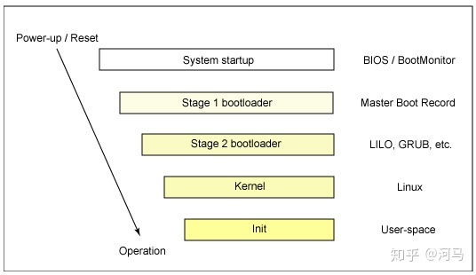
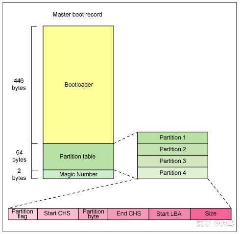
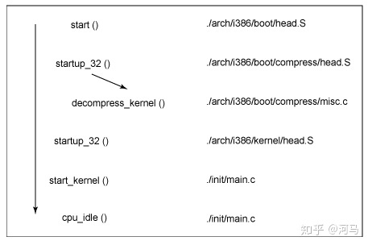

<!-- @import "[TOC]" {cmd="toc" depthFrom=1 depthTo=6 orderedList=false} -->

<!-- code_chunk_output -->

- [1. 概述](#1-概述)
- [2. 系统启动(System startup)](#2-系统启动 system-startup)
- [3. Stage 1 bootloader](#3-stage-1-bootloader)
- [4. Stage 2 bootloader](#4-stage-2-bootloader)
- [5. Kernel 阶段](#5-kernel-阶段)
- [6. Init](#6-init)
- [7. 总结](#7-总结)
- [8. reference](#8-reference)

<!-- /code_chunk_output -->

在最早期的时候, 引导一台计算机意味着需要给计算机提供一个带有启动程序的纸带或者需要手动调整前端仪表盘中的地址/数据/控制开关来加载启动程序. 而如今的计算机则自带有启动设备用于简化启动过程, 但是这并不意味着启动过程就变得简单.

我们先从总体上看 Linux 启动过程的各个阶段, 然后再深入各个阶段, 分别对其进行介绍. 在这个过程中, 对 Linux 内核源码的引用将帮助你查找和理解内核源码.

# 1. 概述

下图给出了 Linux 启动的总体过程.



当系统第一次启动或者重启的时候, **CPU** 将会从一个**规定好的位置**开始执行.
* 对于 **PC** 而言, 这个位置对应到**主板 flash 芯片**中的 **BIOS**(`Basic Input/Output System`).
* 对于**嵌入式系统**而言, CPU 的 reset vector 是一个已知的地址, 该地址指向 `flash/ROM` 的内部.

不管怎样, 结果都是一样的, 即**初始化系统硬件**, 并**启动操作系统**. 由于 **PC** 具有很高的灵活性, 所以 **BIOS** 需要寻找并决定**哪些设备是可以启动的**, 并且从哪个设备启动. 我们将会在后面进行详细的介绍.

当**一个启动设备**被发现时, **Stage 1 bootloader** 将会被加载到**内存**中并执行. 这个 bootloader 位于设备的**第一个 sector**, 其长度少于 **512B**, 它的作用就是**加载 Stage 2 bootloader**.

当 **Stage 2 bootloader** 被**加载到内存并执行**的时候, 屏幕将会显示 **boot splash** 界面, **Linux 内核**和可选的 **initial RAM disk** (**临时根文件系统**)将会被加载到**内存**. 当**内核镜像加载**完毕, Stage 2 bootloader 会把控制权交给 Linux 内核, Linux 内核这时候会将**内核解压并执行**, 对系统进行初始化. 这时候, 内核将会检测系统硬件, 枚举连接到系统的硬件设备, 挂载根设备, 并加载必要的内核模块. 当内核初始化完毕后, 第一个用户空间程序(init)被启动, 更上层的系统初始化将被执行.

这就是 Linux 启动的大致流程. 下面我们再详细看看 Linux 启动的各个阶段.

# 2. 系统启动(System startup)

系统启动阶段根据系统硬件平台的变化而变化.

在**嵌入式平台**中, 当系统上电或者复位的时候, 它使用的是引导环境(bootstrap environment), 如 U-Boot, RedBoot 和 Lucent 的 MicroMonitor. 嵌入式平台一般都会内置一个这种程序, 统一称作 boot monitor, boot monitor 位于目标硬件的 flash memory 的特殊区域, 为用户提供了加载 Linux 内核镜像并执行的功能. 除此之外, boot monitor 还提供了系统检测和硬件初始化的功能. 对于嵌入式系统而言, 这些 boot monitor 通常覆盖了 Stage 1 bootloader 和 Stage 2 bootloader.

在 **PC** 环境中, 系统启动开始于地址 `0xFFFF0`, 该地址位于 **BIOS** 中.
* BIOS 程序的第一阶段任务就是**上电自检 POST**(`Power On Self Test`), 对**系统硬件**进行**基本的检测**, 确保正常工作.
* 第二阶段的任务就是**本地设备枚举和初始化**.

从 BIOS 程序功能的角度来看, **BIOS** 由**两部分**组成: **POST 代码**和 **runtime services**.
* 当 POST 结束时, 内存中 POST 相关的代码将会被丢弃;
* 而 runtime services 代码将继续**保持在内存中**, 为操作系统提供一些**必要的信息和服务**直到**系统关闭**.

为了启动操作系统, BIOS **runtime！！！** 会根据**用户设定的偏好顺序**检测**可启动的设备**, 并尝试**启动**存放在设备中的**操作系统**. 典型的可启动设备可以是软盘、CD-ROM、硬盘的某个分区、网络设备或者是 USB 磁盘.

通常 Linux 会从**磁盘启动**, 而该磁盘的 **MBR**(`Master Boot Record`)会包含有 **primary bootloader**, 也就是 `Stage 1 bootloader`. MBR 是一个 512 字节的扇区, 该扇区为磁盘的**第一个扇区**(`sector 1, cylinder 0, head 0`). 当将 MBR 读取到内存后, BIOS 就会尝试执行该 primary bootloader, 并将控制权交给它.

为了查看 MBR 的内容, 在 Linux 中可以通过以下命令获取:

```
dd if=/dev/sda of=mbr.bin bs=512 count=1
od -xa mbr.bin
```

dd 命令读取了 `/dev/sda`(第一个 IDE 磁盘)的**前 512 字节**, 并将其写入 `mbr.bin` 文件中. od 命令将二进制文件以 16 进制和 ASCII 码的形式将 `mbr.bin` 文件打印出来.

# 3. Stage 1 bootloader

**MBR** 中的 **primary bootloader** 是一个 **512 字节的 image**, 该 image 包含了 primary bootloader 的**可执行代码**, 同时也包含了一个**小的分区表**(partition table). 如下图所示:



* **前 446 字节**是 **primary bootloader**, 包含了可执行代码和错误信息字符串.
* 接下去**64 字节**是磁盘的**分区表**, 该分区表中包含了**四条分区记录**, **每条分区记录**为 **16 字节**, 分区记录可以为空, 若为空则表示分区不存在.
* 最后是 **2 个字节**的 **magic number**, 这两个字节是固定的 **0xAA55**, 这两个字节的 magic number 可以用于**判断该 MBR 记录是否存在**.

primary bootloader 的作用就是**寻找并定位 secondary bootloader**, 也就是 **Stage 2 bootloader**. 它通过**遍历分区表寻找可用的分区**, 当它发现可用的分区的时候, 还是会继续扫描其他分区, 确保其他分区是不可用的. 然后**从可用的分区中读取 secondary bootloader 到内存中**, 并执行.

# 4. Stage 2 bootloader

Stage 2 bootloader 也称作 **secondary bootloader**, 也可以更恰当地称作 **kernel loader**, 它的任务就是**将 Linux 内核加载到内存中**, 并根据设置, 有**选择性**地将 **initial RAM disk** 也加载到内存中.

在 x86 PC 环境中, **Stage 1 bootloader** 和 **Stage 2 bootloader** 合并起来就是 **LILO**(`Linux Loader`)或者 **GRUB**(`GRand Unified Bootloader`). 因为 LILO 中存在一些缺点, 并且这些缺点在 GRUB 中得到了比较好的解决, 所以这里将会以 GRUB 为准进行讲解.

GRUB 的一大优点是, 它能够**正确识别到 Linux 文件系统**. 相对于像 **LILO** 那样**只能读取原始扇区数据**, **GRUB** 则可以从 **ext2** 和 **ext3** 的**文件系统**中读取到 **Linux 内核**. 为了实现这个功能, **GRUB** 将原本 2 个步骤的 bootloader 变成了 3 个步骤, 多了 Stage 1.5 bootloader, 即在 **Stage 1 bootloader** 和 **Stage 2 bootloader** 中间加载一个**可以识别 Linux 文件系统**的 **bootloader**(`Stage 1.5 bootloader`), 例如 `reiserfs_stage1_5` (用于识别 Reiser 日志文件系统)或者 `e2fs_stage1_5` (用于识别 **ext2** 和 **ext3** 文件系统). 当 `Stage 1.5 bootloader` 被加载和执行后, 就可以继续 Stage 2 bootloader 的加载和执行了.

当 Stage 2 bootloader 被加载到内存后, **GRUB** 就能够**显示一系列可启动的内核**(这些可启动的内核定义于 `/etc/grub.conf` 文件中, 该文件是指向 `/etc/grub/menu.lst` 和 `/etc/grub.conf` 的软链接). 你可以在这些文件中配置, 让系统自己默认选择某一个内核启动, 也可以在这时候选择一个 kernel, 甚至可以设置内核启动的相应参数. 同时, 你可以使用 shell 命令行来手动控制启动过程.

当 `Stage 2 bootloader` 已经**被加载到内存**中, **文件系统被识别到**, 并且**默认的内核镜像**和 **initrd** 镜像被加载到内存中, 这就意味着镜像都已经准备好了, stage 2 bootloader 会直接调用内核镜像开始内核的启动.

在 Ubuntu 中 bootloader 的相关信息可以在 `/boot/grub/` 目录下找到, 主要是 `/boot/grub/grub.cfg`, 但是该文件是自读的, 需要在其他地方(如 `/etc/default/grub` )更改, 然后执行 update-grub.

在 GRUB 中可以通过以下方法**手动启动内核**:

```
grub> kernel /bzImage-2.6.14.2
  [Linux-bzImage, setup=0x1400, size=0x29672e]
grub> initrd /initrd-2.6.14.2.img
  [Linux-initrd @ 0x5f13000, 0xcc199 bytes]
grub> boot

Uncompressing Linux... Ok, booting the kernel.
```

如果不知道要启动的内核名字, 只需要 `/`, 然后按 Tab 键让它自动补齐, 或者切换可用的内核.

**GRUB 2** 上加载内核的命令已经由 kernel 变成了 **linux**, 所以需要用到的是下面的命令

```
grub> linux /vmlinuz
grub> initrd /initrd.img
grub> boot
```

而 `/vmlinuz` 和 `/initrd.img` 其实是链接到了 `/boot/` 目录下**特定版本的内核**

```
lrwxrwxrwx   1 root root    33 8 月  10 06:48 initrd.img -> boot/initrd.img-4.15.0-30-generic
lrwxrwxrwx   1 root root    33 8 月  10 06:48 initrd.img.old -> boot/initrd.img-4.15.0-29-generic
lrwxrwxrwx   1 root root    30 8 月  10 06:48 vmlinuz -> boot/vmlinuz-4.15.0-30-generic
lrwxrwxrwx   1 root root    30 8 月  10 06:48 vmlinuz.old -> boot/vmlinuz-4.15.0-29-generic
```

# 5. Kernel 阶段

既然内核镜像已经准备好, 并且控制权已经从 `Stage 2 bootloader` 传递过来, 启动过程的 Kernel 阶段就可以开始了. 内核镜像并非直接可以运行, 而是一个**被压缩过的**. 通常情况下, 它是一个通过 zlib 压缩的 zImage(compressed image 小于 51KB)或者 **bzImage**(`big compressed image`, 大于 512KB)文件. 在**内核镜像的开头**是一个**小程序**, 该程序**对硬件进行简单的配置**并**将压缩过的内核解压到高内存地址空间**中. 如果 **initial RAM disk** 存在, 则它**将 initial RAM disk 加载到内存**中, 做好标记**等待后面使用**. 这个时候, 就可以真正调用内核, 开始真正的内核启动了.

**bzImage** (对于 i386 镜像而言)被调用的**入口点**位于 `./arch/i386/boot/head.S` 的**汇编函数 start**. 这个函数先进行一个**基本的硬件设置**然后调用 `./arch/i386/boot/compressed/head.S` 中的 `startup_32` 函数. `startup_32` 函数建立一个基本的**运行环境**(堆栈、寄存器等), 并且**清除 BSS**(`Block Started by Symbol`). 然后内核调用 `./arch/i386/boot/compressed/misc.c:decompress_kernel()` 函数**对内核进行解压缩**. 当内核解压缩完毕后, 就会调用另外一个 `startup_32` 函数开始内核的启动, 该函数为 `./arch/i386/kernel/head.S:startup_32`.

在**新**的 `startup_32` 函数(也叫做 swapper 或者 `process 0`), **页表将被初始化**并且**内存的分页机制将会被使能**. **物理 CPU 的类型将会被检测**, 并且 **FPU**(`floating-point unit`)也会被检测以便后面使用. 然后 `./init/main.c:start_kernel()` 函数将会被调用, 开始**通用的内核初始化**(不针对某一具体的处理器架构).

基本流程如下所示:



在 `./init/main.c:start_kernl()` 函数中, 一长串的初始化函数将会被调用到用于设置中断、执行更详细的内存配置、**加载 initial RAM disk**等. 接着, 将会调用 `./arch/i386/kernel/process.c:kernel_thread()` 函数来**启动第一个用户空间进程**, 该进程的执行函数是 init. 最后, idle 进程(`cpu_idle`)将会被启动, 并且调度器其将接管整个系统. 当中断使能时, 可抢占的调度器周期性地接管系统, 用于提供多任务同时运行的能力.

在内核启动的时候, 原本由 `Stage 2 bootloader` 加载到内核的 `initial RAM disk`(**initrd**)将会**被挂载**上. 这个位于 RAM 里面的 initrd 将会**临时充当根文件系统**, 并且允许内核直接启动, 而不需要挂载任何的物理磁盘. 因为那些用于跟外设交互的内核模块可以被放置到 initrd 中, 所以内核可以做得非常小, 并且还能支持很多的外设配置. 当内核启动起来后, 这个临时的根文件系统将会被丢弃(通过 `pivot_root()` 函数), 即 initrd 文件系统将会被卸载, 而真正的根文件系统将会被挂载.

initrd 功能让驱动不需要直接整合到内存中, 而是以可加载的模块存在, 从而让 Linux 内核能够做到很小. 这些可加载模块为内核提供访问磁盘和文件系统的方法, 同时也提供了访问其他硬件设备的方法. 因为根文件系统其实是位于磁盘的一个文件系统, initrd 提供了访问磁盘和挂载真正根文件系统的方法. 在没有磁盘的嵌入式文件系统中, initrd 可以作为最终的根文件系统, 或者最终的根文件系统可以通过 NFS(`Network File System`)挂载.

# 6. Init

当内核启动并初始化完毕后, 内核就会开始启动第一个用户空间程序, 这个被调用的程序是第一个使用标准 C 库编译的程序, 在这之前, 所有的程序都不是使用标准 C 库编译得到的.

在 Linux 桌面系统中, 虽然不是强制规定的, 但是第一个启动的应用程序通常是`/sbin/init`. 嵌入式系统中通常很少要求 init 程序通过 `/etc/inittab` 提供大量的初始化工作. 很多情况下, 用户可以通过调用一个简单的 shell 脚本来启动所需的应用程序.

# 7. 总结

就像 Linux 本身一样, Linux 启动过程也是一个特别灵活的过程, 该过程支持了各种各样的处理器和硬件平台. 最早的时候, loadlin bootloader 提供了最简单直接的方法来启动 Linux. 后来 LILO bootloader 扩展强化了启动的能力, 但是却还是没法获取文件系统的信息. 最新的 bootloader, 比如 GRUB, 则允许从一些列的文件系统(从 Minix 到 Reiser)中启动 Linux.

# 8. reference

https://zhuanlan.zhihu.com/p/49877275

https://developer.ibm.com/articles/l-linuxboot/