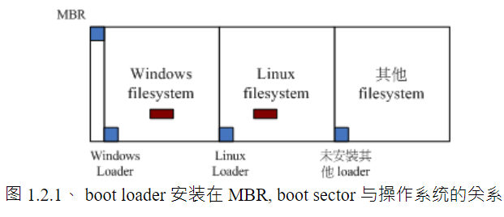
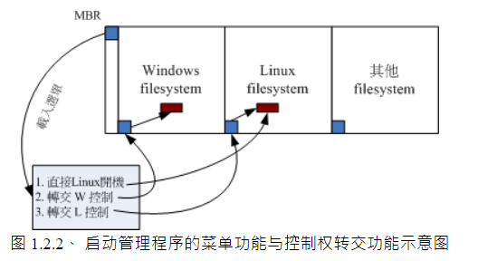
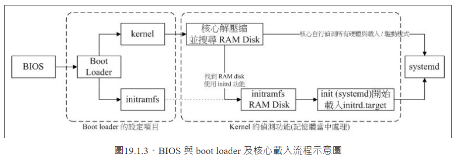

<!-- @import "[TOC]" {cmd="toc" depthFrom=1 depthTo=6 orderedList=false} -->

<!-- code_chunk_output -->

- [1 Linux 的启动流程分析](#1-linux-的启动流程分析)
  - [1.1 启动流程一览](#11-启动流程一览)
  - [1.2 BIOS, boot loader 与 kernel 加载](#12-bios-boot-loader-与-kernel-加载)
    - [1.2.1 BIOS、开机自检与 MBR/GPT](#121-bios-开机自检与-mbrgpt)
    - [1.2.2 Boot Loader 的功能](#122-boot-loader-的功能)
    - [1.2.3 加载核心检测硬件与 initrd 的功能](#123-加载核心检测硬件与-initrd-的功能)
  - [1.3 第一支程序 systemd 及配置档 default.target 进入开机程序分析](#13-第一支程序-systemd-及配置档-defaulttarget-进入开机程序分析)
    - [1.3.1 常见操作环境 target 兼容 runlevel 的等级](#131-常见操作环境-target-兼容-runlevel-的等级)
    - [1.3.2 systemd 的处理流程](#132-systemd-的处理流程)
  - [1.4 systemd 执行 sysinit.target 初始化系统、basic.target 准备系统](#14-systemd-执行-sysinittarget-初始化系统-basictarget-准备系统)
  - [1.5 systemd 启动 multi-user.target 服务: 相容的 rc.local、getty.target 启动](#15-systemd-启动-multi-usertarget-服务-相容的-rclocal-gettytarget-启动)
    - [1.5.1 相容 systemV 的 rc-local.service](#151-相容-systemv-的-rc-localservice)
    - [1.5.2 提供 tty 界面与登入的服务](#152-提供-tty-界面与登入的服务)
  - [1.6 systemd 启动 graphical.target 底下的服务](#16-systemd-启动-graphicaltarget-底下的服务)
  - [1.7 开机过程会用的主要设置](#17-开机过程会用的主要设置)
    - [1.7.1 关于模块:  /etc/modprobe.d/*.conf 及 /etc/modules-load.d/*.conf](#171-关于模块--etcmodprobedconf-及-etcmodules-loaddconf)
    - [1.7.2 /etc/sysconfig/*](#172-etcsysconfig)

<!-- /code_chunk_output -->

# 1 Linux 的启动流程分析

## 1.1 启动流程一览

在启动过程中, 那个启动管理程序(**Boot Loader**)使用的软件可能不一样, 目前各大 Linux distributions 主流是 grub2, 但早期 Linux 默认使用 LILO 或者 grub1.

首先硬件会主动读取 BIOS 或者 UEFI BIOS 来载入硬件信息并进行硬件系统的自我检测, 之后系统主动读取第一个可启动的装置(BIOS 配置), 此时就可以读取 Boot loader 了.

Boot Loader 可以指定**使用哪个核心文件来启动**, 并实际**加载 kernel 到内存中解压缩与运行**, kernel 会检测所有硬件信息、加载适当的驱动程序来使整部主机开始运行.

主机系统开始运行后, 此时 Linux 才会调用外部程序开始准备软件运行的环境, 并实际加载所有系统运行的所需的软件程序. 最后, OS 开始等待登录和操作.

简单来说, 系统启动流程如下:

1. 加载 BIOS 的硬件信息并进行自我检测, 并根据配置获取第一个可启动的装置(硬盘、光驱、PXE 等);

2. 读取并运行第一个启动装置中 MBR 的 Boot Loader(即 grub、grub2、LILO 等);

3. 根据 Boot Loader 的配置加载 kernel, kernel 会检测硬件和加载驱动程序;

4. 硬件驱动成功后, kernel 会主动调用 systemd 程序, 并以 default.target 流程开机;

    - systemd 执行 sysinit.target 初始化系统及 basic.target 准备 OS;

    - systemd 启动 multi-user.target 下的服务;

    - systemd 执行 multi-user.target 下的/etc/rc.d/rc.local 程序;

    - systemd 执行 multi-user.target 下的 getty.target 以及登录服务;

    - systemd 执行 graphical 需要的服务.

下面分别来讲.

## 1.2 BIOS, boot loader 与 kernel 加载

BIOS: 无论传统 BIOS 或 UEFI BIOS 都称为 BIOS;

MBR: 分割表有传统的 MBR 以及新式 GPT, 不过 GPT 也保留了一块相容 MBR 的块. 因此, 下面说的在安装 boot loader 的部分, 也称 MBR！MBR 就代表了该磁盘最前面的可安装 boot loader 的那块.

### 1.2.1 BIOS、开机自检与 MBR/GPT

首先让系统载入 BIOS, 并通过 BIOS 程序载入 CMOS 的信息, 并且由 CMOS 内的设置值取得主机的各项硬件设置. 例如 CPU 与周边设备的沟通时脉、启动装置的搜寻顺序、硬盘的大小与类型、系统时间、各周边设备的 I/O 地址、以及与 CPU 沟通的 IRQ 等信息.

获取这些信息后, BIOS 会进行自我测试(**Power-on Self Test, POST**). 然后开始运行硬件检测的初始化, 并配置 PnP 装置, 之后再定义出可启动的装置顺序, 然后读取启动装置的数据(MBR 相关任务开始).

由于**不同 OS 的文件系统格式不同**, 所以必须要一个**启动管理程序来处理核心文件加载(load)的问题**, 这个启动管理程序就是 Boot Loader. Boot Loader 会安装在在启动装置的第一个扇区(sector)内, 也就是 MBR(Mater Boot Record).

既然核心文件需要 loader 来读取, 每个 OS 的 loader 都不相同, BIOS 是如何读取 MBR 内的 loader 呢?其实 BIOS 是通过硬件的 INT 13 中断来读取 MBR 内容的, 也就是说只要 BIOS 能检测你的磁盘, 那就有办法通过 INT 13 通道读取磁盘的第一 sector 的 MBR.

注: 每个磁盘的第一个 sector 内含有 446 bytes 的 MBR 区域, 那如果有两个磁盘呢?这个就看 BIOS 的配置.

### 1.2.2 Boot Loader 的功能

主要用来**认识 OS 的文件格式并加载 kernel 到 memory**中, 不同 OS 的 boot loader 不同. 那多 OS 呢?

**每个文件系统(FileSystem)会保留一块启动扇区(boot sector)提供 OS 安装 boot loader**, 而通常 OS 会默认安装一份 loader 到根目录所在的文件系统的 boot loader 上.



每个 OS 会安装一套 boot loader 到自己的文件系统中(即每个 filesystem 左下角的方框). 而 Linux 在安装时候可以选择将 boot loader 安装到 MBR, **也可不安装**. 若安装到 MBR, 理论上在 MBR 和 boot sector 都会有一份 boot loader 程序. 而 Windows 会将 MBR 和 boot sector 都装一份 boot loader！

虽然各个 OS 都可以安装一份 boot loader 到 boot sector 中, 这样 OS 可以通过通过自己的 boot loader 来加载核心了. 问题是系统的 MBR 只有一个！怎么运行 boot sector 里面的 loader?

boot loader 功能如下:

- 提供菜单: 使用者可以选择不同启动项目, 即多重启动;

- 加载核心文件: 直接指向可启动的程序区段来开始操作系统;

- 转交到其他 loader: 将启动管理功能转交给其他 loader 负责.

具有菜单功能, 所以可以选择不同核心来启动. 而由于具有控制权转交功能, 因此可以加载其他 boot sector 的 loader！不过 windows 的 loader 默认没有控制权转交功能, 因此不能使用 Windows 的 loader 来加载 Linux 的 loader. 所以先装 Windows 再装 Linux .



如上图, MBR 使用 Linux 的 grub 这个启动管理程序, 并且里面假设已经有了三个菜单,  第一个菜单可以直接指向 Linux 的核心文件并且直接加载核心来启动; 第二个菜单可以将启动管理程序控制权交给 Windows 来管理, 此时 Windows 的 loader 会接管启动流程, 这个时候他就能够启动 windows 了. 第三个菜单则是使用 Linux 在 boot sector 内的启动管理程序, 此时就会跳出另一个 grub 的菜单啦！

### 1.2.3 加载核心检测硬件与 initrd 的功能

boot loader 开始读取核心文件后, 接下来,  Linux 就会将核心解压缩到主内存当中, 并且利用核心的功能, 开始测试与驱动各个周边装置, 包括储存装置、CPU、网络卡、声卡等等. kernel 不一定会使用 BIOS 侦测到的硬件信息！也就是说, 核心此时才开始接管 BIOS 后的工作了.  那么核心文件在哪里啊?一般来说, 是 /boot/vmlinuz ！

```
[root@study ~]# ls --format=single-column -F /boot
config-3.10.0-229.el7.x86_64                <==此版本核心被核心编译时选择的功能与模块配置项
grub/                                       <==旧版 grub1 , 不用管这个目录了！
grub2/                                      <==开机管理程序 grub2 相关目录
initramfs-0-rescue-309eb890d3d95ec7a.img    <==用来救援的虚拟文件系统
initramfs-3.10.0-229.el7.x86_64.img         <==正常开机的虚拟文件系统
initramfs-3.10.0-229.el7.x86_64kdump.img    <==kernel 有问题时用到的操作系统
System.map-3.10.0-229.el7.x86_64            <==核心功能放置到内存位址的对应表
vmlinuz-0-rescue-309eb890d09543d95ec7a*     <==救援用的核心文件
vmlinuz-3.10.0-229.el7.x86_64*              <==核心文件
```

此版本 Linux 核心为 3.10.0-229.el7 ！为了开发者的便利, Linux 核心是可以通过动态加载核心模块的 (类似于驱动程序), 这些核心模块就放在 /lib/modules/ 目录内.  模块要放置在磁盘根分区目录内(/lib 与 / 必须是同一个 partition), 因此在启动过程中**核心必须要挂载根目录**, 这样才能**读取核心模块提供加载驱动程序的功能**. 为防止影响文件系统, 因此启动过程中根目录是以只读方式挂载的.

U 盘、SATA、SCSI 等磁盘驱动程序通常被编译为模块存在. 假设 Linux 是安装在 SATA 磁盘上, 可以通过 BIOS 的 INT 13 取得 boot loader 与 kernel 文件来启动, 然后 kernel 会开始接管系统并检测硬件以及尝试挂载根目录来取得额外驱动程序.

但是, **核心根本不认识 SATA 磁盘, 所以需要加载 SATA 磁盘的驱动程序, 否则根本就无法挂载根目录**. 但是 SATA 的驱动程序在 /lib/modules 内, 你根本无法挂载根目录又怎么读取到 /lib/modules/ 内的驱动程序?通过虚拟文件系统来处理这个问题(如果不是模块, 而是编译进 kernel 就不用 initramfs).

虚拟文件系统 (Initial RAM Disk 或 Initial RAM Filesystem) 一般使用 /boot/initrd 或 /boot/initramfs, 这个文件的特色是, 也能够**通过 boot loader 来加载到内存中**,  然后这个文件会**被解压缩并且在内存当中模拟成一个根目录**, 且此**模拟在内存当中的文件系统能够提供一个可运行的程序, 通过该程序来加载启动过程中所最需要的核心模块,  通常这些模块就是 U 盘, RAID, LVM, SCSI 等文件系统与磁盘的驱动程序**啦！等加载完成后, 会帮助核心重新调用 systemd 来开始后续的正常启动流程.



上图中, boot loader 可以加载 kernel 与 initramfs, 然后在内存中解压缩成根目录, kernel 就能借此加载适当驱动程序, 最终释放虚拟文件系统, 并挂载实际的根目录文件系统, 就能开始后续正常开机流程.

下面解释下 CentOS 7.x 的 initramfs 内容.

```
# 1. 先來直接看一下 initramfs 內容?lsinitrd 是一个查看 initramfs image 内容的工具
[root@study ~]# lsinitrd /boot/initramfs-3.10.0-229.el7.x86_64.img
# 首先会呼叫出 initramfs 最前面文件头的资料介绍
Image: /boot/initramfs-3.10.0-229.el7.x86_64.img: 18M
========================================================================
Early CPIO image
========================================================================
drwxr-xr-x   3 root     root            0 May  4 17:56 .
-rw-r--r--   1 root     root            2 May  4 17:56 early_cpio
drwxr-xr-x   3 root     root            0 May  4 17:56 kernel
drwxr-xr-x   3 root     root            0 May  4 17:56 kernel/x86
drwxr-xr-x   2 root     root            0 May  4 17:56 kernel/x86/microcode
-rw-r--r--   1 root     root        10240 May  4 17:56 kernel/x86/microcode/GenuineIntel.bin
========================================================================
Version: dracut-033-240.el7

Arguments: -f

dracut modules:  # 开始一堆模块的载入
bash
nss-softokn
..........
========================================================================
drwxr-xr-x  12 root     root            0 May  4 17:56 .
crw-r--r--   1 root     root       5,   1 May  4 17:56 dev/console
crw-r--r--   1 root     root       1,  11 May  4 17:56 dev/kmsg
crw-r--r--   1 root     root       1,   3 May  4 17:56 dev/null
..........
lrwxrwxrwx   1 root     root           23 May  4 17:56 init -> usr/lib/systemd/systemd
..........
drwxr-xr-x   2 root     root            0 May  4 17:56 var/lib/lldpad
lrwxrwxrwx   1 root     root           11 May  4 17:56 var/lock -> ../run/lock
lrwxrwxrwx   1 root     root           10 May  4 17:56 var/log -> ../run/log
lrwxrwxrwx   1 root     root            6 May  4 17:56 var/run -> ../run
========================================================================
# 最后会列出这个 initramfs 里的所有文件
# 也就是说这个 initramfs 文件大概分为两部分！
```

也可以通过判断 initramfs 文件格式进一步操作

```
# 判断文件类型
[root@CentOS7 boot]# file initramfs-3.10.0-514.el7.x86_64.img
initramfs-3.10.0-514.el7.x86_64.img: ASCII cpio archive (SVR4 with no CRC)

# cpio 格式解压缩

[root@CentOS7 initramfs]# cpio -ivcdu < initramfs-3.10.0-514.el7.x86_64.img
.
kernel
kernel/x86
kernel/x86/microcode
kernel/x86/microcode/GenuineIntel.bin
early_cpio
52 blocks
[root@CentOS7 initramfs]# ll
total 21220
-rw-r--r--. 1 root root        2 Oct 19 21:40 early_cpio
-rw-------. 1 root root 21721314 Oct 19 21:40 initramfs-3.10.0-514.el7.x86_64.img
drwxr-xr-x. 3 root root       17 Oct 19 21:40 kernel
```

通过上面, 我们知道 initramfs 主要有两部分, 一个是事先准备的一些资料, 包括 kernel/x86/microcode/GenuineIntel.bin 这些东西. 这些资料后面, 才是真的核心会去读取的文件. 你会发现 init 已经被 systemd 所取代！如果想要进一步解开这个文件, 那得要先将 kernel/x86/microcode/GenuineIntel.bin 之前的文件先除掉.  因此:

```
# 1. 先取得 initramfs 前面应该要去除的容量有多少
[root@study ~]# mkdir /dev/shm/initramfs
[root@study ~]# cd /dev/shm/initramfs
[root@study initramfs]# cpio -i -d --no-absolute-filenames -I /boot/initramfs-3.10.0-229.el7.x86_64.img
22 blocks
# 这就是在前面的资料占用的 block 数量, 每个 block 是 512bytes,
# 因此, 前面的部份占用:  22 * 512 = 11264 个 bytes 的意思！
# 每一个 initramfs 文件的前面容量都不相同, 所以需要先找出來去除！

# 2. 将 /boot/initramfs-XX 文件去除前面不需要的文件头资料部分.
[root@study initramfs]# dd if=/boot/initramfs-3.10.0-229.el7.x86_64.img of=initramfs.gz bs=11264 skip=1
[root@study initramfs]# ll initramfs.gz; file initramfs.gz
-rw-r--r--. 1 root root 18558166 Aug 24 19:38 initramfs.gz
initramfs.gz: gzip compressed data, from Unix, last modified: Mon May  4 17:56:47 2015,
 max compression

# 3. 看到文件是 gzip 格式, 解压缩
[root@study initramfs]# gzip -d initramfs.gz
[root@study initramfs]# file initramfs
initramfs: ASCII cpio archive (SVR4 with no CRC)

# 4. 又是 cpio 文件, 解压缩, 加上不要绝对路径参数
[root@study initramfs]# cpio -i -d -H newc --no-absolute-filenames < initramfs
[root@study initramfs]# ll
lrwxrwxrwx.  1 root root        7 Aug 24 19:40 bin -> usr/bin
drwxr-xr-x.  2 root root       42 Aug 24 19:40 dev
drwxr-xr-x. 12 root root     4096 Aug 24 19:40 etc
lrwxrwxrwx.  1 root root       23 Aug 24 19:40 init -> usr/lib/systemd/systemd
-rw-r--r--.  1 root root 42263552 Aug 24 19:38 initramfs
lrwxrwxrwx.  1 root root        7 Aug 24 19:40 lib -> usr/lib
lrwxrwxrwx.  1 root root        9 Aug 24 19:40 lib64 -> usr/lib64
drwxr-xr-x.  2 root root        6 Aug 24 19:40 proc
drwxr-xr-x.  2 root root        6 Aug 24 19:40 root
drwxr-xr-x.  2 root root        6 Aug 24 19:40 run
lrwxrwxrwx.  1 root root        8 Aug 24 19:40 sbin -> usr/sbin
-rwxr-xr-x.  1 root root     3041 Aug 24 19:40 shutdown
drwxr-xr-x.  2 root root        6 Aug 24 19:40 sys
drwxr-xr-x.  2 root root        6 Aug 24 19:40 sysroot
drwxr-xr-x.  2 root root        6 Aug 24 19:40 tmp
drwxr-xr-x.  7 root root       61 Aug 24 19:40 usr
drwxr-xr-x.  3 root root       47 Aug 24 19:40 var
# 上面就像是一个系统根目录, 这样就能挂载了

# 4. 查看 systemd 以哪个 target 执行开机的
[root@study initramfs]# ll usr/lib/systemd/system/default.target
lrwxrwxrwx. 1 root root 13 Aug 24 19:40 usr/lib/systemd/system/default.target -> initrd.target

# 5. 最后查看系统内预设的(不是当前目录下的这个)initrd.target 依赖的所有服务
[root@study initramfs]# systemctl list-dependencies initrd.target
initrd.target
├─dracut-cmdline.service
.....(中間省略).....
├─basic.target
│ ├─alsa-restore.service
.....(中間省略).....
│ ├─slices.target
│ │ ├─-.slice
│ │ └─system.slice
│ ├─sockets.target
│ │ ├─dbus.socket
.....(中間省略).....
│ │ └─systemd-udevd-kernel.socket
│ ├─sysinit.target
│ │ ├─dev-hugepages.mount
.....(中間省略).....
│ │ ├─local-fs.target
│ │ │ ├─-.mount
│ │ │ ├─boot.mount
.....(中間省略).....
│ │ └─swap.target
│ │   ├─dev-centos-swap.swap
.....(中間省略).....
│ │   └─dev-mapper-centos\x2dswap.swap
│ └─timers.target
│   └─systemd-tmpfiles-clean.timer
├─initrd-fs.target
└─initrd-root-fs.target
# 通过 systemd 方式将服务载入
```

通过上面解开 initramfs 的结果, 其实 initramfs 就是一个小型根目录, 这个小型根目录也是通过 systemd 来管理, 同时查看 default.target 的连接, 这个小型系统是通过 initrd.target 来开机, **而 initrd.target 也是需要读入一堆例如 basic.target, sysinit.target 等等的硬件检测、系统初始化的流程**. **最终才又卸载 initramfs 的小型文件系統, 实际挂载系统的根目录**！

initramfs 仅仅加载开机过程中会用到的核心模块而已(如果已经编译进 kernel, 可以不需要). 所以如果你在 initramfs 里面去找 modules , 就可以发现主要的核心模块大概就是 SCSI、virtio、RAID 等等跟磁盘相关性比较高的模块！现在由于磁盘大多使用 SATA, 并没有 IDE 格式. 所以, 没有 initramfs 的话, 你的 Linux 几乎不能顺利开机！除非你将 SATA 的模块直接编译到核心！

在核心完整的载入后, 主机就开始正常工作, 接下來, 就是要开始执行系统的第一个程序:  systemd ！

## 1.3 第一支程序 systemd 及配置档 default.target 进入开机程序分析

第一个程序, 所以 systemd 的 PID 是 1 号. 所有动作都是通过 systemd 的默认 target 来启动服务集合, 即 /etc/systemd/system/default.target 来规划.  另外,  systemd 已经舍弃了 system V 的 runlevel ！

### 1.3.1 常见操作环境 target 兼容 runlevel 的等级

过去的 system V 使用的是 runlevel 的概念来启动系统的, systemd 为了兼容 systemV 操作行为,  所以也将 runlevel 与操作环境结合！可以通过以下方式查找对应关系:

```
[root@study ~]# ll -d /usr/lib/systemd/system/runlevel*.target | cut -c 28-
May  4 17:52 /usr/lib/systemd/system/runlevel0.target -> poweroff.target
May  4 17:52 /usr/lib/systemd/system/runlevel1.target -> rescue.target
May  4 17:52 /usr/lib/systemd/system/runlevel2.target -> multi-user.target
May  4 17:52 /usr/lib/systemd/system/runlevel3.target -> multi-user.target
May  4 17:52 /usr/lib/systemd/system/runlevel4.target -> multi-user.target
May  4 17:52 /usr/lib/systemd/system/runlevel5.target -> graphical.target
May  4 17:52 /usr/lib/systemd/system/runlevel6.target -> reboot.target
```

### 1.3.2 systemd 的处理流程

当取得 /etc/systemd/system/default.target 后.  首先, 它会链接到 /usr/lib/systemd/system/ 下去取得 multi-user.target 或 graphical.target 其中的一个, 假设是使用 graphical.target , 接下来 systemd 会去找两个地方的设置,  就是如下的目录:

- /etc/systemd/system/graphical.target.wants/: 使用者设置加载的 unit

- /usr/lib/systemd/system/graphical.target.wants/: 系统预设加载的 unit

查看 /usr/lib/systemd/system/graphical.target 文件:

```
[root@study ~]# cat /usr/lib/systemd/system/graphical.target
[Unit]
Description=Graphical Interface
Documentation=man:systemd.special(7)
Requires=multi-user.target
After=multi-user.target
Conflicts=rescue.target
Wants=display-manager.service
AllowIsolate=yes

[Install]
Alias=default.target
```

表示 graphical.target 必须要完成 multi-user.target 之后才能够进行, 而进行完 graphical.target 之后, 还得要启动 display-manager.service 才行.  好了！

相同方式找找 multi-user.target 要执行完需要执行的东西.

```
# 先看看 multi-user.target 文件
[root@study ~]# cat /usr/lib/systemd/system/multi-user.target
[Unit]
Description=Multi-User System
Documentation=man:systemd.special(7)
Requires=basic.target
Conflicts=rescue.service rescue.target
After=basic.target rescue.service rescue.target
AllowIsolate=yes

[Install]
Alias=default.target

# 然后看看系统预设要载入的 unit
[root@study ~]# ls /usr/lib/systemd/system/multi-user.target.wants
brandbot.path  plymouth-quit.service           systemd-logind.service
dbus.service   plymouth-quit-wait.service      systemd-user-sessions.service
getty.target   systemd-ask-password-wall.path

# 使用者自己定义要载入的 unit 又有哪些呢?
[root@study ~]# ls /etc/systemd/system/multi-user.target.wants
abrt-ccpp.service    crond.service           mdmonitor.service       sshd.service
abrtd.service        hypervkvpd.service      ModemManager.service    sysstat.service
abrt-oops.service    hypervvssd.service      NetworkManager.service  tuned.service
abrt-vmcore.service  irqbalance.service      postfix.service         vmtoolsd.service
abrt-xorg.service    kdump.service           remote-fs.target        vsftpd2.service
atd.service          ksm.service             rngd.service            vsftpd.service
auditd.service       ksmtuned.service        rsyslog.service
backup2.timer        libstoragemgmt.service  smartd.service
backup.timer         libvirtd.service        sshd2.service
```

知道 multi-usre.target 需要在 basic.target 运行完毕后才能加载上述的 unit ！然后再去 basic.target 找找信息等等. 可以通过『 systemctl list-dependencies graphical.target 』指令列出依赖的服务！这就是 systemd 的调用所需要的服务的流程.

要知道系统的服务的流程, 最简单的方法就是『 systemctl list-dependencies graphical.target 』！只是, 如果你想要知道背后的设置文件意义,  那就是分別去找出 /etc 与 /usr/lib 底下的 graphical.target.wants/ 目录下的资料就对了！当然, 文件里面的 Requires 所代表的服务, 也是需要是先加载的.

简要分析一下『 systemctl list-dependencies graphical.target 』, 基本上我们 CentOS 7.x 的 systemd 开机流程大约是这样:

- local-fs.target + swap.target: 这两个 target 主要加载本机 /etc/fstab 里所定义的文件系统和相关的内存置换空间;

- sysinit.target: 这个 target 主要在检测硬件, 加载所需要的核心模块等动作.

- basic.target: 加载主要的硬件驱动程序与防火墙相关任务

- multi-user.target 底下的其它一般系统或网络服务的载入

- 图形界面相关服务如 gdm.service 等其他服务的加载

除了第一步驟 local-fs.target, swap.target 是通过 /etc/fstab 来加载, 那其他的 target 又做什么?

## 1.4 systemd 执行 sysinit.target 初始化系统、basic.target 准备系统

『 systemctl list-dependencies sysinit.target 』, 这些服务应该一个一个看脚本. 基本上, 可以将这些服务归类成几个大类:

- 特殊文件系统设备的挂载: 包括 dev-hugepages.mount dev-mqueue.mount 等挂载服务, 主要挂载与 hugepage、消息队列相关功能. 挂载成功后, 会在 /dev 底下建立 /dev/hugepages/, /dev/mqueue/ 等目录;

- 特殊文件系统的启用: 包括磁盘阵列、网络磁盘(iscsi)、LVM 文件系统、文件系统对照服务 (multipath) 等等;

- 开机过程的信息传递与动画执行: 使用 plymouthd 服务搭配 plymouth 指令传递;

- 日志式登录档的使用: 即 systemd-journald 服务的启用

- 额外的核心模块: 通过 /etc/modules-load.d/*.conf 文件的设定, 让核心额外载入核心模块！

- 额外的核心参数设定: 包括 /etc/sysctl.conf 以及 /etc/sysctl.d/*.conf 内部设定！

- 系统的乱数产生器: 乱数产生器可以帮助系统进行一些密码加密演算的功能

- 设定终端 (console) 字形

- 启动动态装置管理员: 就是 udevd ！用在动态对应实际装置存取与装置档名对应的一个服务！

执行完 sysinit.target 之后, 再来则是 basic.target 这个项目了.  sysinit.target 在初始化系统. 这个 basic.target 的阶段主要启动的服务大概有这些:

- 载入 alsa 音效驱动程式: 这个 alsa 是个音效相关的驱动程序;

- 载入 firewalld 防火墙: CentOS 7.x 以后使用 firewalld 取代 iptables 的防火墙设定, 虽然最终都是使用 iptables 的架构,  不过在设定上面差很多喔！

- 载入 CPU 的微指令功能;

- 启动与设定 SELinux 的安全本文: 如果由 disable 的状态改成 enable 的状态, 或者是管理员设定强制重新设定一次 SELinux 的安全本文, 也在这个阶段处理！

- 将开机过程所产生的开机信息写入到 /var/log/dmesg 当中

- 由 /etc/sysconfig/modules/*.modules 及 /etc/rc.modules 载入管理员指定的模块！

- 载入 systemd 支援的 timer 功能;

在这个阶段完成之后, 你的系统已经可以顺利的运作！就差一堆你需要的登入服务、网路服务、本机认证服务等等的 service 类别.

## 1.5 systemd 启动 multi-user.target 服务: 相容的 rc.local、getty.target 启动

加载核心驱动硬件后, sysinit.target 进行初始化, basic.target 系统基础, 之后服务器要顺利运行, 需要进行各种主机服务和网络服务启动. 这些服务的启动则大多是附挂在 multi-user.target 下.

也就是说, 一般来说服务的启动脚本设定都是放在底下的目录内:

- /usr/lib/systemd/system (系统预设的服务启动脚本设定)

- /etc/systemd/system (管理员自己开发与设定的脚本设定)

将服务放到 /etc/systemd/system/multi-user.target.wants/ 这个目录底下再做个链接 这样就可以在开机的时候去启动他. 这时回想一下, 你在第十七章使用 systemctl enable/disable 时, 系统的回应是什么呢?再次回想一下:

```
# 将 vsftpd.service 先 disable 再 enable 看看输出的信息?
[root@study ~]# systemctl disable vsftpd.service
rm '/etc/systemd/system/multi-user.target.wants/vsftpd.service'

[root@study ~]# systemctl enable vsftpd.service
ln -s '/usr/lib/systemd/system/vsftpd.service' '/etc/systemd/system/multi-user.target.wants/vsftpd.service'
```

不需要手动建立链接, 而是使用 systemctl 来处理！

另外, 这些程序除非在脚本设置依赖性, 这样才会有顺序的启动之外, 大多数的服务都是同时启动的！这就是 systemd 的并行.

### 1.5.1 相容 systemV 的 rc-local.service

过去用 Linux 的朋友大概都知道, 当系统完成开机后, 还想要让系统额外执行某些程序的话, 可以将该指令或脚本的绝对路径名称写入到 /etc/rc.d/rc.local 文件！新的 systemd 机制中, 它建议直接写一个 systemd 的启动脚本设定档到 /etc/systemd/system 底下, 然后使用 systemctl enable 的方式来设定启用它, 而不要直接使用 rc.local 这个文件！

那新版的 systemd 有没有支持 rc.local 呢?那就是 rc-local.service 这个服务的功能了！这个服务不需要启动, 它会自己判断 /etc/rc.d/rc.local 是否具有可执行的权限来判断要不要启动这个服务！ 你可以这样检查看看:

```
# 1. 先看 /etc/rc.d/rc.local 的权限, 再检查 multi-user.target 有没有这个服务
[root@study ~]# ll /etc/rc.d/rc.local
-rw-r--r--. 1 root root 473 Mar  6 13:48 /etc/rc.d/rc.local

[root@study ~]# systemctl status rc-local.service
rc-local.service - /etc/rc.d/rc.local Compatibility
   Loaded: loaded (/usr/lib/systemd/system/rc-local.service; static)
   Active: inactive (dead)

[root@study ~]# systemctl list-dependencies multi-user.target | grep rc-local

# 有这个服务, 但是 rc.local 不具有可执行 (x) 的权限, 因此不会执行

# 2. 加入可执行权限后, 再看一下 rc-local 是否可被启用！
[root@study ~]# chmod a+x /etc/rc.d/rc.local; ll /etc/rc.d/rc.local
-rwxr-xr-x. 1 root root 473 Mar  6 13:48 /etc/rc.d/rc.local

[root@study ~]# systemctl daemon-reload
[root@study ~]# systemctl list-dependencies multi-user.target | grep rc-local
├─rc-local.service
```

通过这个 chmod a+x /etc/rc.d/rc.local 的步骤, 许多脚本就可以放在 /etc/rc.d/rc.local 文件内,  系统在每次开机都会去执行这个文件内的指令

### 1.5.2 提供 tty 界面与登入的服务

在 multi-user.target 底下还有个 getty.target 的操作界面 target！登入服务也是 multi-user.target 底下的内容！包括 systemd-logind.service, systemd-user-sessions.service 等服务.

由于服务都是同步运作, 不一定哪个服务先启动完毕. 如果 getty 服务先启动完毕时, 你会发现到有可用的终端机尝试让你登入系统了.  问题是, 如果 systemd-logind.service 或 systemd-user-sessions.service 服务尚未执行完毕的话, 那么你还是无法登入系统的.

## 1.6 systemd 启动 graphical.target 底下的服务

若 default.target 是 multi-user.target 的话, 那么这个步骤就不会进行. 反之, 如果是 graphical.target 的话, 那么 systemd 就会开始加载用户管理服务与图形界面管理员 (window display manager, DM) 等！

```
[root@study ~]# systemctl list-dependencies graphical.target
graphical.target
├─accounts-daemon.service
├─gdm.service
├─network.service
├─rtkit-daemon.service
├─systemd-update-utmp-runlevel.service
└─multi-user.target
  ├─abrt-ccpp.service
.....(底下省略).....
```

也就是多了上面列出来的这些服务. 实际让用户可以登入的服务, 是 gdm.service ！查看 gdm.service 的内容, 执行文件是 /usr/sbin/gdm ！那就是让使用者可以利用图形界面登入的最重要服务

到此为止, systemd 就已经完整的处理完毕, 也能够将你写入到 /etc/rc.d/rc.local 的脚本实际执行一次.

## 1.7 开机过程会用的主要设置

基本上, systemd 有自己的设置处理方式, 不过为了兼容 systemV , 很多的服务脚本设置还是会读取位于 /etc/sysconfig/ 底下的环境设置文件！ 底下我们就来谈谈几个常见的比较重要的设置文件！

### 1.7.1 关于模块:  /etc/modprobe.d/*.conf 及 /etc/modules-load.d/*.conf

还记得我们在 sysinit.target 系统初始化当中谈到的载入使用者自定义程序的地方吗?其实有两个地方可以处理模块载入的问题, 包括:

- /etc/modules-load.d/*.conf: 单纯要核心载入模块的位置;

- /etc/modprobe.d/*.conf: 可以加上模块参数的位置

基本上 systemd 已经帮我们将开机会用到的模块全部载入了, 如果你有某些特定的参数要处理时, 应该就得要在这里进行. 举例来说,  vsftpd 这个服务, 将这个服务的端口更改到 555 上！那我们可能需要修改防火墙设定, 其中一个针对 FTP 很重要的防火墙程序为 nf_conntrack_ftp,  因此, 你可以将这个程序写入到系统开机流程中, 例如:

```
[root@study ~]# vim /etc/modules-load.d/vbird.conf
nf_conntrack_ftp
```

一个程序写一行~然后, 上述的程序基本上是针对预设 FTP 端口, 即 port 21 所设定的, 如果需要调整到 port 555 的话, 得要外带参数才行！模块外加参数的设定方式得要写入到另一个地方喔！

```
[root@study ~]# vim /etc/modprobe.d/vbird.conf
options nf_conntrack_ftp ports=555
```

之后重新开机就能够顺利的载入并且处理好这个程序了. 不过, 如果你不想要开机测试, 想现在处理呢?有个方式可以来进行看看:

```
[root@study ~]# lsmod | grep nf_conntrack_ftp
# 没东西！因为还没有载入这个模块！所以不会出现任何信息！

[root@study ~]# systemctl restart systemd-modules-load.service
[root@study ~]# lsmod | grep nf_conntrack_ftp
nf_conntrack_ftp       18638  0
nf_conntrack          105702  1 nf_conntrack_ftp
```

通过上述的方式, 你就可以在开机的时候将你所需要的驱动程式载入或者是调整这些模块的外加参数

```
[root@study ~]# systemctl restart systemd-modules-load.service
[root@study ~]# lsmod | grep nf_conntrack_ftp
nf_conntrack_ftp       18638  0
nf_conntrack          105702  1 nf_conntrack_ftp
```

### 1.7.2 /etc/sysconfig/*

还有哪些常见的环境设置文件呢?我们找几个比较重要的来谈谈:

- **authconfig**:

    这个文件主要在规范使用者的身份认证的机制, 包括是否使用本机的 /etc/passwd, /etc/shadow 等,  以及 /etc/shadow 密码记录使用何种加密演算法, 还有是否使用外部密码伺服器提供的帐号验证 (NIS, LDAP) 等.  系统预设使用 SHA512 加密演算法, 并且不使用外部的身份验证机制; 另外, 不建议手动修改这个文件！你应该使用『 authconfig-tui 』指令来修改较佳！

- **cpupower**:

    如果你有启动 cpupower.service 服务时, 他就会读取这个设置文件. 主要是 Linux 如何操作 CPU 的原则.  一般来说, 启动 cpupower.service 之后, 系统会让 CPU 以最大效能的方式来运作, 否则预设就是用多少算多少的模式来处理的.

- **firewalld, iptables-config, ip6tables-config, ebtables-config**:

    与防火墙服务的启动的参数有关.

- **network-scripts/**:

    至于 network-scripts 里面的档案, 则是主要用在设置网络

