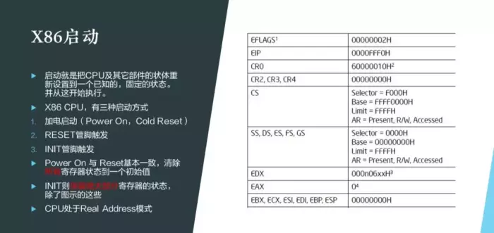
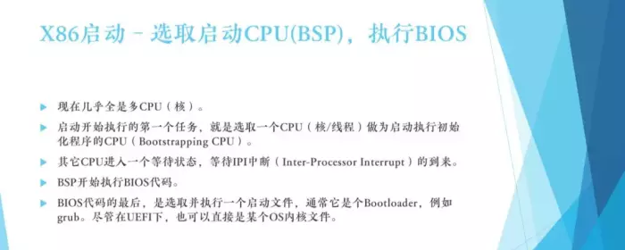
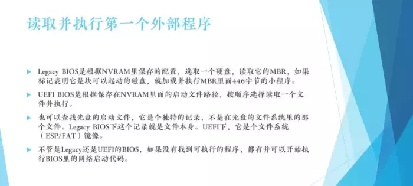
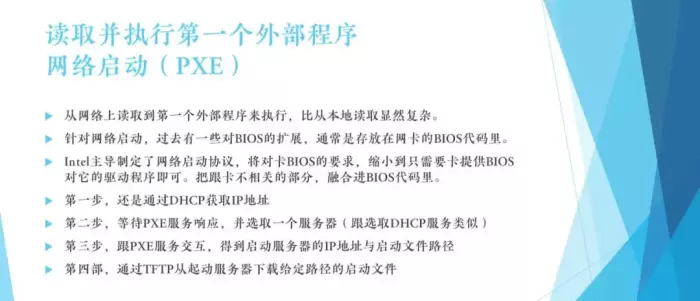
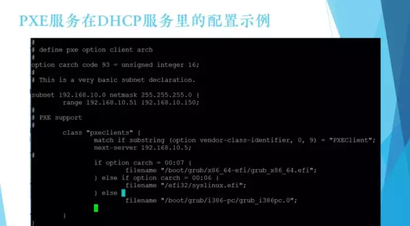
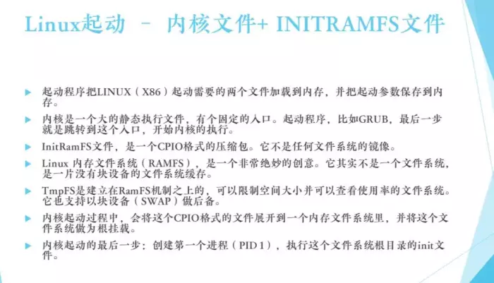
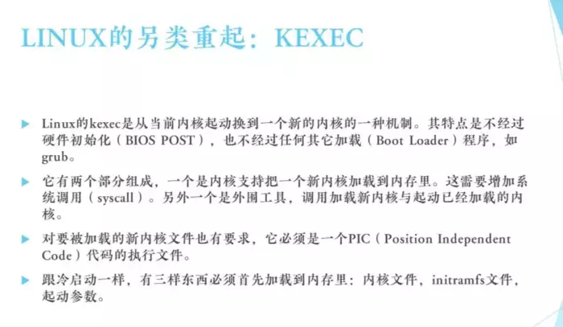
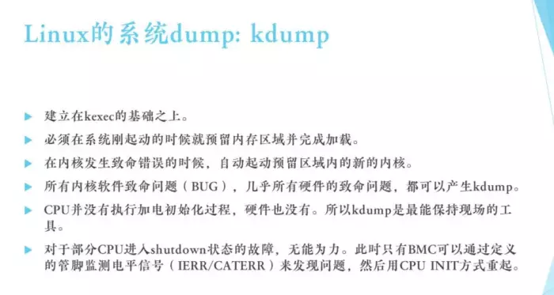

一个计算机的启动, 最主要就是 CPU 的启动. CPU 启动就是把这个 CPU 的里边的各个寄存器设置到一个已知的、固定的状态, 并且从这里开始执行.

01 指针启动

如下图的右边这有几个就是 X86 的话的一些比较清晰可见的寄存器, 其中最重要的是 EIP, 即指令指针.

指令指针就表示它要执行的下一个指令, 当我们 CPU 一发生 Reset 以后, 这个 EIP 作为一个固定的值, 就会从这里开始执行, 这里通常是 BIOS 的程序.

X86 的 CPU 有三种启动方式:

第一种是加电启动

第二种是 Reset

第三个是 INIT

加电启动和 Reset 非常类似, 不但把右边的这些值都设到一个固定的状态, 我们还把 CPU 其它的很多寄存器都设置到一个已知的固定的状态.

那么 INIT 不同呢?它仅仅是把右边的这些设置到一个固定的已知的状态, 其它的寄存器它基本上保持不动. 目的就是为了你启动完之后还能读原来寄存器里的东西. 这些寄存器主要是记录了一些上一次启动的 CPU 错误状态, 这样我们可以以此来做诊断.

现在说 Power On 通常叫做冷启动, Reset 我们通常叫做热启动, 它俩是基本一致, 但是 INIT 就很不同, 但是总体上来说, 它还是从 CPU 一个固定的状态开始执行程序, X86 Reset 之后, 它就处于一个 Real Address 模式.

这个讲起来话长, 因为 X86 的历史比较悠久, 从 80、86、80、88 , 它现在有 Real Address 模式有 protect 模式, 还有现在 X86 64 模式, Reset 之后它一定是处于 Real Address 模式, 每个 CPU 被 Reset 之后, 它从一个固定的地方开始执行.

第一个通常是它要执行一个协议, 选取一个 CPU 来执行, 其他 CPU 都等待, 我们要选取一个所谓主 CPU(其实它的标准术语叫 Bootstrapping CPU), 就是说选完了之后, 只有主 CPU 继续执行, 其它都进入一个等待状态, 就是等待所有的其它 CPU 都等待这个 BSP 给它发指令, 它再开始继续执行.

BSP 选出来之后, 它就开始执行 BIOS 代码, 这个 BIOS 代码通常我们又叫它 POST 过程, 它相当于机器一个自检, 当机器自检完了 , BIOS 走完了之后, 它要做的一件事情就是要找到一个文件, 并且把它读到内存里, 然后开始执行它.

这个时候我们认为 post 自检完了, 要开始读取并执行第一个外部程序, 一般叫它 Boot Load, 那么它这个如何找到并读取并执行它呢?

第一个问题主要是找到并读取它, 这里又分几种, 比如

从光盘启动

从网络启动

Legacy BIOS 模式启动

UEFI 模式启动

Legacy BIOS 启动

Legacy BIOS 一般都从某个硬盘上启动, 通常在过去这个叫 C 盘, 因为过去只有一个盘叫 C 盘, 现在当然磁盘很多了, 你还是要指定一个启动盘, 从哪个卡上的哪个盘来启动.

如果是指定了, 它就读你指定的盘, 这个硬盘的同一个扇区, 512 字节. 读进来之后, 首先检查扇区的标记, 标记这块盘是不是可以启动的, 如果标记它不是可以启动的, 那么它会报告一个错误, 大概就是找不到启动盘之类.

如果标记的它是可以启动的一个硬盘, 那么它就会开始执行, 当然了这时候这个扇区的内容已经在内存里了, 它就开始执行从 0 开始一个 446 字节长度的这个小程序, 当然了我们看这个程序很小, 所以它其实它还要想办法, 读到另外一个更大的程序, 才能够把我们说的 Boot Load, 比如说 Grub 完完全全加载起来, 光 446 字节肯定是不行的.

UEFI BIOS 启动

UEFI BIOS 会好一点, 它主板上记录的是一个启动文件路径, 这个启动文件路径就是某个盘某个分区里面的某个文件, 这个分区是什么文件系统呢?通常它是 FAT32 文件系统, 又叫 ESP 文件系统.

如果 UEFI 想启动, 一定存在这么一个分区, 它有这么一个 FAT 文件系统, 然后在里面有某一个程序, 都是写在 NVRAM 里头, 我们叫做启动项, 它把那个程序读进来, 执行它.

这样看 UEFI 肯定比 Legacy 要好多了. Legacy 第一步你必须是 446 字节的那个, UEFI 一下子可以把整个文件读进来, 不需要分几步来做.

光盘启动

从光盘启动是怎么启动呢?光盘在 Legacy 模式下, 它有一个读一个特殊的记录, 这个记录标注它是启动记录, 这个启动记录可以任意的, 没有过去光盘 446 字节的限制了.

所以说其实尽管在 Legacy 模式下, 从 CD 上启动它也要容易一些, 因为它就是读固定的记录, 记录一个任意大的文件, 读进来直接执行.

如果在 UEFI 下它也是一个启动记录, 但是这个记录本身, 并不是一个文件, 它是一个文件系统的镜像. 这个文件系统有啥东西呢?可能主要有启动文件.

为什么 UEFI 跟 Legacy 启动模式的不一样呢, 在理论上来说它需要区分, 你是 Legacy BIOS, 你就读那一个记录, 那个记录就是个文件, 直接读取来执行它. 那如果你是 UEFI, 那你就找到 FAT32 的镜像, 这里面有文件, 然后你把它读进来执行.

不管是 Legacy 还是 UEFI BIOS, 如果都不行, 还可以从网络启动, 从网络启动也是要首先要找到并且把一个启动文件读进来, 那么这里它就稍微费劲一点.

网络启动

网络启动最早功能全部写在网卡里, 也就是说每个网卡厂商都自己写了一段从网络的启动的程序, 然后把它烧在网卡里, 后来有 UEFI 之后, Intel 就主导制定了一个 PXE 协议, 这个 PXE 其实就是把这些网络启动要用的公共的东西, 纳入到了 BIOS 功能里.

比如说 TCP-IP、TFTP、DHCP, 这些东西跟网卡没有关系, 网卡要做的就是收发报而已.

PXE 协议分四步:

第一步, 必须有 DHCP, 先发 DHCP 包, 我要取得 IP 地址, 才能做后面的事情, 如果你是想启动的话, 在 DHCP 包里面还附加了很多东西, 附加了一些标记.

第二步, 在包发出去之后, 看到这个标记的人, 如果他能提供 PXE 服务, 也会响应关于 PXE 的东西.

PXE 响应它什么呢?有几个 IP 地址, 这几个地址是可以提供启动服务的, 而且每个 IP 地址它什么文件, 都可以告诉你.

最后一步, 有了启动服务器的地址和我要启动的文件, 那么我就通过 TFTP 从这个服务器下载这个文件就可以了.

下面这是一档例子, 在标准的 DHCP 服务里, 附带提供 PXE 支持, 它支持在哪呢: 首先它检视 DHCP 包里面是不是包含这个字段, 如果包含这个字段, 就告诉你启动服务器是谁, 你去跟他找启动文件.

光告诉你启动服务器是谁还不行, 还必须告诉你启动文件是啥, 启动文件根据机型不同它是有区别的, 比如你是启动 Power PC, 还要启动 mips, 还要启动 SUN 的 SPARC.

02 启动 Linux 需要什么

光是 X86 就有三种架构, 一种是 64 位的 UEFI, 一种是 32 位的 UEFI, 另外一种就是老的 i386 的 PC 模式, 叫做 Legacy BIOS 模式.

所以根据包里面告诉我的架构不同, 就反馈你文件名, 不同的文件名给你, 等于交互完之后就得到两个: 一个是不同 IP 地址, 一个是文件名. 通过 TFTP 给它下载下来开始执行就好了. 后面的就跟从硬盘上是一样的了.

如果是启动 Linux 呢?Linux 现在需要什么东西?

Linux 只需要两个东西(当然了其实它是需要三个东西), 但文件只需要两个: 一个是内核文件, 一个叫做 INITRAMFS 文件.

我们都知道内核文件肯定需要, 任何一个操作系统起来都必须先把内核设置好, 启动好.

INITRAMFS 是一个给 Linux 用作根的一个文件, 大家知道 Unix 启动一定需要有一个根文件系统, 这个 Unix 才能够运行. 如果在内核启动的时候, 到最后找不到这个根文件系统就会启动失败.

有了 INITRAMFS 文件之后, Linux 内核的启动过程中会展开 INITRAMFS 文件. 这个文件其实就是一个 CPIO 包, 它把这个包展开到它的内存里, 在展开的内存里会看到目录架构, 会有文件, 它就到这一块区域当作它的根.

也就是说无论如何, 内核文件+INITRAMFS 文件一定能够启动一个小 Linux.

什么叫小 Linux, 因为 INITRAMFS 不可能很大, 一般几十兆, 所以它启动起来之后, 它就是一个完完全全放在内存里的 Linux, 它小是因为这个文件大小受到了限制, 那么内核文件加上 INITRAMFS 展开后, 把它作为一个根文件系统, 这就是一个小的全部在内存里的 Linux.

麻雀虽小, 五脏俱全, 有内存和输入输出, 就可以做任何事情, 所以它适合做一些工具类的东西, 安装肯定是也通过它就可以继续安装, 比如往硬盘上装东西或者做外设的配置更改、FW 升级等, 它非常适合做一次性的工作.

我们通常用一个 Live Image 来启动这样一个 Linux, 当然它稍微比这个还复杂一点, 但是基本上还是一个完完全全在内存里的小 Linux, 启动完后把 U 盘拿走也没有任何问题.

当然我们大部分的情况下启动可能不仅仅是想启动一个内核里的小 Linux.

比如当前我有一个硬盘, 硬盘上放了一个很大的 Linux, 几十个 G, 想启动这个系统就根据启动 Grub 的参数, 叫 root=什么什么, 这时候这个小 Linux 就会找这个 root, root 找到了之后(通常它是一个硬盘上的一个分区的一个文件系统), 我们给 mount 到一个目录下面, 因为当前已有根, 只不过这个根完完全全是个内存文件系统, 我们可能会创建一个目录叫 newroot, 然后把你制定的这个根 mount 到这个 newroot 下面.

mount 好后把其它的进程都终止掉, 然后把当前这个根里面的基本上所有其它文件都删掉释放内存. 但 newroot 必须保留, 因为 Newroot 挂载的新的根文件系统, 到最后就执行一个操作叫 switch_root, 把这个 newroot 变为根再执行根里面的 INIT, 就完成拉起来了一个新的 Linux, 即硬盘上的 Linux.

在这里内核启动的时候已经固定了, 也就是说我们拉起来的这个硬盘上的 Linux, 一定要跟我当前的内核是兼容的, 那么安装完系统以后, 刚开始启动的内核到最后切换到根上, 拉起来的这个大的 Linux 一定是相同内核的, 否则就会有兼容性的问题.

这就是如何启动一个硬盘上的大 Linux 或在网络上的一个大 Linux, 或者是任何其它的比如 U 盘上的 Linux 环境你也可以给它拉起来.

当然如果在 U 盘上的 Linux 我建议你直接用全部在内存里的 Linux, 没必要再拉一次在网络上的或者是在硬盘上的. INITRAMFS 不可能放得下所有东西.

一般还有一个二次的, 就是拉起来 Linux 在中间的过程, 可以说基本上除了内核没变, 其它的环境都变掉了, 这就是启动一个完整的 Linux.

03 另类的启动: KEXEC

下面我们介绍一下另类的启动.

Linux 还有一种启动方式叫做 KEXEC, KEXEC 本来是一个 Linux 的内核的这个开发者, 因为他们经常修改内核, 修改完了之后要重启看看, 每一次重启都要经过一个 CPU 的 Reset 的冷启动也好, 热启动也好, 那是很痛苦的事情.

因为 Reset 这个 CPU 之后一定先走 BIOS, BIOS 走完了最后走 Grub, 最后有个 Boot Load, Grub 走完了才启动 Linux, 因为嫌这个很烦, 他们就开发了一个东西, 就是在当前的 Linux 下, 我突发奇想, 想换一个新内核, 他就用这个 KEXEC 先把一个内核加进来然后跳转到新内核里, 相当于执行了一次 Linux 重启, 但是注意跳过了前面的 POST 和 Grub.

这就是那位开发人员懒就开发了一个这个功能, 这个功能确实能省很多时间.

如果你要想让内核能够这么加载的话就有一个要求, 要求 Position Independent Code 这段代码可以再任意加载到任意地址, 如果不能加载到任意地址的话, 就要求固定地址.

那在当前内核如何加载另外一个内核?跟冷启动一样其实有三样东西, 一个是内核文件, 先把它加进来, 然后 INITRAMFS 文件也加进来, 然后启动参数主要是指根, 总的来说这个 KEXEC 是一个非常奇妙的启动 Linux 方式. 大家可以试一下在自己 Linux 上用它来试一下.

04 Linux kdump 模式

最后我们要讲一下 Linux kdump 模式, 紧密依赖 KEXEC 的模式的 dump 非常重要.

dump 是什么?

就是应用 CRASH 掉的时候, 应用当时占的内存的所有的内容, 然后分析应用在哪里 CRASH 掉了. 系统也一样, 当 Linux 系统出了某种错误, 哪怕是硬件出了某种错误进行不下去的时候怎么诊断它, 我们需要把它当前的内存的内容全拷贝下来.

如何拷贝呢?

在 CRASH 的时候, 如果没有 kdump 来支持, CRASH 就 hung 在那了, 如果启动了 kdump, 在启动内核, 生产系统内核的时候, 有一个参数叫 Crashkernel, Crashkernel 等于多少多少, 就是预留一块内存给这个 kdump 的 kernel dump 内核转储用. 预留完后, 当生产系统起来, 它的一个服务就是把 kdump 所用的内核加载到这块预留的区域里.

为什么要这样做呢?

因为系统 CRASH 的时候再加载内核好像有问题, 其实 CRASH 这些问题啥都做不了, 内核已经没法加载了, 动都动不了了, 就一定要在生产系统刚起的时候预留一块区域, 这块区域谁都不能使用, 然后把一个内核加在里面, INITRAMFS 加在里面, 那些参数也加在里面, 这样当这个生产内核跑着跑着要 CRASH 了, 如果这个区域都设置好了它就会直接跳转到这个区域里新的内核里, 开始新的内核新的一个 Linux 环境的启动.

这个 Linux 环境会限制在预留的区域里, 在预留的区域里启动完之后, 它要做的事情就是第一, 把前一个环境的比如说 100 个 G 也好 200 个 G 也好的内容拷贝出来, 拷贝到指定的某一个磁盘的目录下, 这就是 kdump.

Kdump 确实是非常好的想法, 它依赖于 KEXEC, KEXEC 是一个快速的 Linux 启动, 很多程序员不耐烦那个 POST 的过程太长, Kdump 很好的解决了这个问题.

参考

https://mparticle.uc.cn/article.html?uc_param_str=frdnsnpfvecpntnwprdssskt&btifl=100&app=uc-iflow&title_type=1&wm_id=3dfaa1bc8e644810bd6347e56039d01c&wm_cid=307737783892445184&pagetype=share&client=&uc_share_depth=1