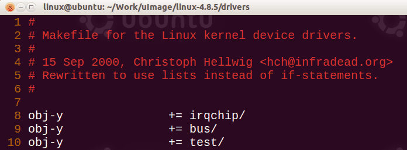

# Kconfig 的格式

下面截取/drivers/net 下的 Kconfig 文件中的部分内容:

```kconfig
# Network device configuration
menuconfig NETDEVICES
        default y if UML
        depends on NET
        bool "Network device support"
        ---help---
          You can say N here if you don't intend to connect your Linux box to any other computer at all.
......
config DM9000
        tristate "DM9000 support"
        depends on ARM || BLACKFIN || MIPS
        select CRC32
        select MII
        ---help---
          Support for DM9000 chipset.

          To compile this driver as a module, choose M here.  The module will be called dm9000.
......
source "drivers/net/arcnet/Kconfig"
source "drivers/net/phy/Kconfig"
```

Kconfig 按照一定的格式来书写, menuconfig 程序可以识别这种格式, 然后从中提取出有效信息组成 menuconfig 中的菜单项. 将来在做驱动移植等工作时, 有时需要自己添加 Kconfig 中的一个配置项来将某个设备驱动添加到内核的配置项目中, 这时候就需要对 Kconfig 的配置项格式有所了解, 否则就不会添加.

menuconfig: 表示菜单(本身属于一个菜单中的项目, 但是他又有子菜单项目)、config 表示菜单中的一个配置项(本身并没有子菜单下的项目). 一个 menuconfig 后面跟着的所有 config 项就是这个 menuconfig 的子菜单. 这就是 Kconfig 中表示的目录关系.

NETDEVICES: menuconfig 或者 config 后面空格隔开的大写字母表示的类似于 NETDEVICES 的就是这个配置项的配置项名字, 这个字符串前面添加 CONFIG_后就构成了".config"文件中的配置项名字.

source: 内核源码目录树中每一个 Kconfig 都会用 source 引入其所有子目录下的 Kconfig, 从而保证了所有的 Kconfig 项目都被包含进 menuconfig 中. 这个也说明了: 如果你自己在 linux 内核中添加了一个文件夹, 一定要在这个文件夹下创建一个 Kconfig 文件, 然后在这个文件夹的上一层目录的 Kconfig 中 source 引入这个文件夹下的 Kconfig 文件.

tristate: 意思是三态(3 种状态, 对应 Y、N、M 三种选择方式), 意思就是这个配置项可以被三种选择.

bool: 是要么真要么假(对应 Y 和 N). 意思是这个配置项只能被 2 种选择.

depends: 意思是本配置项依赖于另一个配置项. 如果那个依赖的配置项为 Y 或者 M, 则本配置项才有意义; 如果依赖的哪个配置项本身被设置为 N, 则本配置项根本没有意义. depends 项会导致 make menuconfig 的时候找不到一些配置项. 所以在 menuconfig 中如果找不到一个选项, 但是这个选项在 Kconfig 中却是有的, 则可能的原因就是这个配置项依赖的一个配置项是不成立的. depends 依赖的配置项可以是多个, 还可以有逻辑运算. 这种时候只要依赖项目运算式子的结果为真则依赖就成立.

select: 表示 depends on 的值有效时, 下面的 select 也会成立, 将相应的内容选上.

default: 表示 depends on 的值有效时, 下面的 default 也会成立, 将相应的选项选上, 有三种选项, 分别对应 y, n, m.

help: 帮助信息, 解释这个配置项的含义, 以及如何去配置他.

# Kconfig 和.config 文件和 Makefile 三者的关联

配置项被配置成 Y、N、M 会影响"`.config`"文件中的`CONFIG_XXX`变量的配置值. ".config"中的配置值(=y、=m、没有)会影响最终的编译链接过程. 如果=y 则会被编入(`built-in`), 如果=m 会被单独连接成一个".ko"模块, 如果没有则对应的代码不会被编译. 那么这是怎么实现的?都是通过 makefile 实现的.

如 makefile 中: `obj-$(CONFIG_DM9000) += dm9000.o`,  

如果`CONFIG_DM9000`变量值为 y, 则 obj += dm9000.o, 因此 dm9000.c 会被编译; 如果 CONFIG_DM9000 变量未定义, 则 dm9000.c 不会被编译. 如果 CONFIG_DM9000 变量的值为 m 则会被连接成".ko"模块.

## 何为 Kconfig? 它的作用是什么?

内核源码编译过程


1. 遍历每个源码目录(或配置指定的源码目录)Makefile
2. 每个目录的 Makefile 会根据 Kconfig 来定制要编译对象
3. 回到顶层目录的 Makeifle 执行编译

那么我们就得出各个文件的作用:

* Kconfig ---> (每个源码目录下)提供选项
* .config ---> (源码顶层目录下)保存选择结果
* Makefile---> (每个源码目录下)根据.config 中的内容来告知编译系统如何编译

说到底, Kconfig 就是配置哪些文件编译, 那些文件不用编译. 后期 linux 内核都做出了如下的图形界面, 但由于要进行 Linux 内核驱动开发, 需要向将驱动的代码添加到 Makefile 中一起编译, 所以 Kconfig 的一些语法也该了解, 于是有了这篇文章.


### 基本使用方法

我们以简单的单选项为案例来演示

假比, 我们做好了一个驱动, 需要将选项加入到内核的编译选项中, 可以按以下步骤操作:

#### 第一步 配置 Kconfig

在 driver 目录下新建一个目录

```
mkdir driver/test
```

进入 test 目录, 创建 Kconfig 文件

```
config TEST
    bool "Test driver"
    help
    this is for test!!
```

这里定义了一个 TEST 的句柄, Kconfig 可以通过这个句柄来控制 Makefile 中是否编译, "Test driver"是显示在终端的名称.

具体的语法在 Kconfig 语法简介中介绍.

#### 第二步 配置 Makefile

在同样的目录中, 新建一个 Makefile

```makefile
obj-$(CONFIG_TEST) += test.o
```

```
Obj-$(CONFIG_选项名) += xxx.o
/*当 CONFIG_选项名=y 时, 表示对应目录下的 xxx.c 将被编译进内核
当 CONFIG_选项名=m 时对应目录下的 xxx.c 将被编译成模块*/
```

#### 第三步 配置上层目录的 Makefile 与 Kconfig

##### 在上一层目录的 Kconfig 中

```
menu "Device Drivers"

source "drivers/test/Kconfig
```


表示将 test 文件夹中的 Kconfig 加入搜寻目录

##### 在上一层目录的 Makefile 中

```makefile
obj-y           += test/
```



结果, 运行根目录的`.config`查看结果


# Kconfig 语法简介

## 单一选项

总体原则: 每一个 config 就是一个选项, 最上面跟着控制句柄, 下面则是对这个选项的配置, 如选项名是什么, 依赖什么, 选中这个后同时会选择什么.

```config

config CPU_S5PC100
    bool "选项名"
    select S5P_EXT_INT
    select SAMSUNG_DMADEV
    help
      Enable S5PC100 CPU support
```

* config —> 选项 
* CPU_S5PC100 —>句柄, 可用于控制 Makefile 选择编译方式 
* bool —>选择可能: TRUE 选中、FALSE 不选 选中则编译, 不选中则不编译.  如果后面没有字符串名称, 则表示其不会出现在选择软件列表中 
* select —> 当前选项选中后则 select 后指定的选项自动被选择

depend on 依赖, 后面的四个选择其中至少一个被选择, 这个选项才能被选

```
config DM9000
    tristate "DM9000 support"
```

tristate —> 选中并编译进内核、不选编译成模块

>运行结果: <M>test

## 选项为数字

```
config ARM_DMA_IOMMU_ALIGNMENT
    int "Maximum PAGE_SIZE order of alignment for DMA IOMMU buffers" ---->该选项是一个整型值
    range 4 9 ---->该选项的范围值
    default 8 ---->该选项的默认值
    help
      DMA mapping framework by default aligns all buffers to the smallest
      ...
```

`4-8`为这个数字的范围, 运行结果


这里的 defult 其实也可以用在 bool 中

```
config STACKTRACE_SUPPORT
    bool    --->该选项可以选中或不选, 且不会出现在选择列表中
    default y ---->表示缺省情况是选中
```

## if..endif

```
if ARCH_S5PC100 --->如果 ARCH_S5PC100 选项选中了, 则在 endif 范围内的选项才会被选

config CPU_S5PC100
    bool "选项名"
    select S5P_EXT_INT
    select SAMSUNG_DMADEV
    help
      Enable S5PC100 CPU support

endif
```

举个例子, 如果 CPU 没有选择使用多核 CPU, 则不会出现 CPU 个数的选项.

## choice 多个选项

```
choice      --->表示选择列表
    prompt "Default I/O scheduler"         //主目录名字
    default DEFAULT_CFQ                    //默认 CFQ
    help
      Select the I/O scheduler which will be used by default for all
      block devices.

    config DEFAULT_DEADLINE
        bool "Deadline" if IOSCHED_DEADLINE=y

    config DEFAULT_CFQ
        bool "CFQ" if IOSCHED_CFQ=y

    config DEFAULT_NOOP
        bool "No-op"

endchoice
```

choice 是单项选择题

## menu 的用法

```
menu "Boot options"  ----> menu 表示该选项是不可选的菜单, 其后是在选择列表的菜单名

    config USE_OF
        bool "Flattened Device Tree support"
        select IRQ_DOMAIN
        select OF
        select OF_EARLY_FLATTREE
        help
        Include support for flattened device tree machine descriptions.
....

endmenu     ----> menu 菜单结束
```

menu 指的是不可编辑的 menu, 而 menuconfig 则是带选项的 menu

### menu 和 choice 的区别

menu 可以多选, choice 是单项选择题

# menuconfig 的用法

```
menuconfig MODULES ---> menuconfig 表示 MODULE 是一个可选菜单, 其选中后是 CONFIG_MODULES
    bool "菜单名"
    if MODULES
    ...
    endif # MODULES
```

说到底, menconfig 就是一个带选项的菜单, 在下面需要用 bool 判断一下, 选择成立后, 进入 `if ...endif` 中间得空间.

## 概述

在 linux 编写驱动的过程中, 有两个文件是我们必须要了解和知晓的. 这其中, 一个是 Kconfig 文件, 另外一个是 Makefile 文件. 如果大家比较熟悉的话, 那么肯定对内核编译需要的.config 文件不陌生, 在.config 文件中, 我们发现有的模块被编译进了内核, 有的只是生成了一个 module.


首先我们来学习什么 Makefile, 什么是 Kconfig , 什么是.config 

Ｍakefile: 一个文本形式的文件, 其中包含一些规则告诉 make 编译哪些文件以及怎样编译这些文件.

Kconfig: 一个文本形式的文件, 其中主要作用是在内核配置时候, 作为配置选项.

.config: 文件是在进行内核配置的时候, 经过配置后生成的内核编译参考文件.

Makefile 

2.6 内核的 Makefile 分为 5 个组成部分:  

1. 最顶层的 Makefile 
2. 内核的.config 配置文件 
3. 在 arch/$(ARCH) 目录下的体系结构相关的 Makefile 
4. 在 s 目录下的 Makefile.* 文件, 是一些 Makefile 的通用规则 
5. 各级目录下的大概约 500 个 kbuild Makefile 文件

顶层的 Makefile 文件读取 .config 文件的内容, 并总体上负责 build 内核和模块. Arch Makefile 则提供补充体系结构相关的信息.  s 目录下的 Makefile 文件包含了所有用来根据 kbuild Makefile 构建内核所需的定义和规则.

这中间, 我们如何让内核发现我们编写的模块呢, 这就需要在 Kconfig 中进行说明. 至于如何生成模块, 那么就需要利用 Makefile 告诉编译器, 怎么编译生成这个模块. 模仿其实就是最好的老师, 我们可以以内核中经常使用到的网卡 e1000 模块为例, 说明内核中是如何设置和编译的.

首先, 我们可以看一下, 在 2.6.32.60 中关于 e1000 在 Kconfig 中是怎么描述的,


上面的内容是从 drivers/net/Kconfig 中摘录出来的. 内容看上去不复杂, 最重要的就是说明了模块的名称、用途、依赖的模块名、说明等等. 只要有了这个说明, 我们在 shell 下输入 make menuconfig 的时候, 理论上我们就应该可以看到 Intel(R)PR0/1000 Gigabit Ethernet support 这个选项了, 输入 y 表示编译内核; 输入 n 表示不编译; 输入 m 表示模块编写, 这是大家都知道的.

那么, 有了这个模块之后, 需要编译哪些文件中, 我们在 drivers/net/Makefile 看到了这样的内容,


显然, 这段代码只是告诉我们, 要想编译 e1000, 必须要包含 e1000 这个目录, 所以 e1000 目录下必然还有一个 Makefile, 果不其然, 我们在 e1000 目录下果然找到了这个 Makefile, 内容如下,


看了这个文件, 其实大家心理就应该有底了. 原来这个 e1000 模块最终生成的文件就是 e1000.ko, 依赖的文件就是 e1000_main.c、e1000_hw.c、e1000_ethtool.c、e1000_param.c 这四个文件. 只要 CONFIG_E1000 被设置了, 那么这个模块就会被正常编译. 我们要做的就是打开这个开关就可以了, 剩下 kernel 会帮我们搞定一切. 当然, 如果大家想把这个模块拿出来, 自己用一个独立的 module 编译也是可以的. 但是我们在 menuconfig 中没有找到这个配置选项?这是怎么回事呢?


## Kconfig 语法

由于没有找到这个配置选项, 我们只能从 Kconfig 的语法开始分析了.

### 基本构成

基本构成包括五种, menu/endmenu, menuconfig, config, choice/endchoice, source. 下面就对每种详细介绍:

(1) menu/endmenu

    menu 的作用, 可以理解成一个目录, menu 可以把其中一部分配置项包含到一个 menu 中, 这样有利于配置的分类显示. menu 与 endmenu 是一组指令, 必须同时出现. menu 和 endmenu 中包含的部分就是子目录中的配置项.

比如, 在 init/Kconfig 中 24 行(可能不同)显示为:

menu "General setup"

这样, 就会生成一个目录, 特征就是右侧会出现一个箭头, 如图 1 中第一行. 当点击确认键时, 会进入这个菜单项. make menuconfig 进入的第一个界面 基本所有选项都称为 menu.

(2) menuconfig

menuconfig 有点类似 menu, 但区别就在于 menu 后面多了一个 config, 这个 menu 是可以配置的, 如图 2 中的第二行, 前面比 menu 类型多了一个方框, 通过空格可以修改这个配置项的选中状态. 而且从格式上来看, 也是有区别的. 如下图所示椭圆的都是 menu 长方形的就是 menuconfig 了.


```
menuconfig MODULES
bool "Enable loadable module support"config
if MODULES
xx
endif
```

也就是说, 配置项是位于 if 和 endif 中. 其中的部分就是 MODULES 子目录显示的内容. 如果选中了 MODULE, 那么 if 和 endif 中的内容可以显示. 如果没有定义, 就只能进入一个空目录.

(3) config

config 是构成 Kconfig 的最基本单元, 其中定义了配置项的详细信息. 定义的格式参考 arch/arm/Kconfig 中的第 8 行.

```
config ARM  
         bool  
         default y  
         select xxxxxxxxxx  
         help  
           ???????????  
```

详细可以参阅 http://blog.csdn.net/xy010902100449/article/details/45131973

可知, config 需要定义名称, 与 menuconfig 相同. 这个名称不但用于裁剪内核中, 还用于配置项之间的相互依赖关系中.

config 的类型有 5 种, 分别是 bool(y/n), tristate(y/m/n), string(字符串), hex(十六进 制), integer(整数). 其中, 需要特别介绍一下 bool 和 tristate, bool 只能表示选中和不选, 而 tristate 还可以配置成模块 (m), 特别对于驱动程序的开发非常有用.

其他语法如下:

>1) prompt: 提示, 显示在 make menuconfig 中的名称, 一般省略. 下面两种写法相同.
>
>a. bool "Networking Support"
>
>b. bool prompt "Networking Support"
>
>2) default: 默认值
>
>一个配置项可以有多个默认值, 但是只有第一个被定义的值是有效的.
> 
>3) depends on/requires: 依赖关系
>
>如果依赖的配置项没有选中, 那么就当前项也无法选中.
>
>4) select: 反向依赖
>
>如果当前项选中, 那么也选中 select 后的选项.
> 
>5) range: 范围, 用于 hex 和 integer
>
>range A B 表示当前值不小于 A, 不大于 B
>
>6) comment: 注释

(4) choice

choice 的作用, 多选一, 有点像 MFC 中的 Radio 控件.

可见, choice 有点类似于 menu, 是在子窗口里选择, 但是不同的是子窗口中只能选择一项. 在 prompt 后会显示当前选择项的名称.

5) source

source 只是将另外一个 Kconfig 文件直接复制到当前位置而已. 但它的作用也是明显的, 可以将这个系统贯穿在一起. 从开始位置 arch/arm/Kconfig, 来将整个系统都作为配置型.

由此我们可以知道, 之前那个选项没有出现, 是由于 depends on 依赖条件不符合.

# 参考

https://blog.csdn.net/prike/article/details/79334609

