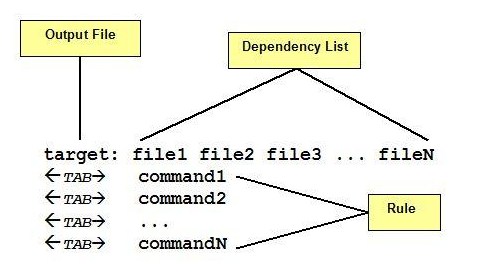
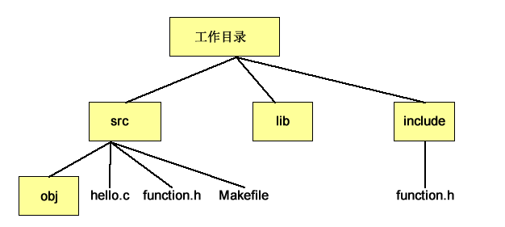

<!-- @import "[TOC]" {cmd="toc" depthFrom=1 depthTo=6 orderedList=false} -->

<!-- code_chunk_output -->

- [1. 简介](#1-简介)
  - [1.1. Makefile的构成](#11-makefile的构成)
- [2. 基本例子](#2-基本例子)
  - [2.1. 编译命令](#21-编译命令)
  - [2.2. 使用命令的两个缺陷](#22-使用命令的两个缺陷)
- [3. 简单makefile](#3-简单makefile)
  - [3.1. 问题B依旧存在](#31-问题b依旧存在)
- [4. 使用变量](#4-使用变量)
  - [4.1. 头文件改变但不会重新编译](#41-头文件改变但不会重新编译)
  - [4.2. 变量引用的格式](#42-变量引用的格式)
- [5. 自动变量](#5-自动变量)
- [6. OBJ和伪命令](#6-obj和伪命令)
- [7. 目录结构](#7-目录结构)
- [8. 参考](#8-参考)

<!-- /code_chunk_output -->

# 1. 简介

Makefile是Linux下程序开发的**自动化编译工具**, 用以识别**编译目标**、**源文件**及**其依赖关系**, 并且有着高效的编译效率. 

每次执行 `make` 时, 就能够**自动寻找 Makefile(makefile)文件**, 执行编译工作. 

Makefile拥有很多复杂的功能, 为了简化问题的复杂性, 本文仅和大家讨论针对单目录下的`C/C++`项目开发, 如何写一个通用的 Makefile. 

我们一般在 Linux 中经常看到项目用有 Makefile, 而在 Windows 中很少看到, 原因是因为 Windows 上的IDE工具已经自动生成了Makefile 文件, 编译工程的时候自动调用 Makefile 进行编译, 所以在 Windows 上我们经常是在不知情的情况下和Makefile打交道. 

## 1.1. Makefile的构成

一个Makefile中通常包含下面内容: 

1、需要由make工具创建的**目标体**(`target`), 通常是**目标文件**或**可执行文件**. 

2、要创建的**目标体**所**依赖的文件**(`dependency`). 

3、创建**每个目标体**时需要运行的**命令**(`command`). 

基本语法规则如下: 



注意: 如果"command"不和目标文件所在一行时, 在command前要加 Tab 键. 

# 2. 基本例子

下面以一个简单的程序为例, 包括`主程序(hello.c)`、`函数代码(function.c)`、`头文件(function.h)`, 内容如下. 

主函数`hello.c`: 

```cpp
#include <stdio.h>
#include "function.h"

int main()
{
    fun1();
    fun2();
    fun3();
    return 0;
}
```

函数`function.c`: 

```cpp
#include<stdio.h>

int fun1()
{
    printf("This is first function!\n");
    return 0;
}

int fun2()
{
    printf("This is second function!\n");
    return 0;
}

int fun3()
{
    printf("This is third function!\n");
    return 0;
}
```

头文件`function.h`: 

```cpp
#ifndef _FUN_H
#define _FUN_H

int fun1(void);
int fun2(void);
int fun3(void);

#endif
```

## 2.1. 编译命令

一般的, 我们会使用

```
gcc -o hello hello.c function.c -I.
```

来编译. "`-I.`"是指gcc在**当前目录**下(.)下去寻找**头文件**. 

如果不用makefile, 在"`测试-修改-调试`"过程中, 我们必须不停地在终端中按上下键来寻找最后的那条编译指令. 

## 2.2. 使用命令的两个缺陷

这种编译方法有两个缺陷: 

a. 当你把**编译指令丢失**或者换电脑的时候, 这样效率会很低; 

b. 当我们**只修改了一个.c文件**时, 每一次都将必须**重新编译所有的文件**, 非常**耗时**, 不划算. 

# 3. 简单makefile

所以我们需要用 Makefile 文件来统一管理这种编译规则, 这样只要我们在目录下敲入"make"命令, 就可以编译了. 本例最简单的 Makefile 写法: 

```makefile
hello: hello.c fucntion.c
	gcc -o hello hello.c function.c -I.
```

注意: 第一行中并**没有任何参数**, 只是在冒号(:)后列出**编译中所需的文件**, 当**第一行**中的**任何文件中更改**时, make 就知道 hello  需要**重新编译**了. 

还有一点非常重要: gcc 前面必须有一个Tab, 在**任何指令之前**都要有一个Tab, 不然make就会罢工的. 

## 3.1. 问题B依旧存在

现在我们已经解决了问题a, 不用上下按箭头了, 但是对于**问题b**依旧没有很好地解决. 

# 4. 使用变量

为了让事情变得更通用, 我们将 Makefile 改成: 

```makefile
TARGET = hello
CC = gcc
CFLAGS = -I.

$(TARGET): hello.c function.c
	$(CC) -o $(TARGET) hello.c function.c $(CFLAGS)
```

这里我们新定义了**三个变量** `TARGET`、`CC` 和 `CFLAGS` . `TARGET`是**目标文件名**, `CC`是**编译器**, `CFLAGS`是**编译用的参数**. 

make 会**先**分别编译 .c 文件, **然后**生成可执行文件 hello. 

## 4.1. 头文件改变但不会重新编译

这种形式的makefile在小项目中非常有效, 但是有一个遗憾: **include 头文件的变动**. 

如果我们**修改**了 `function.h` 文件, make是**不会重新编译！！！** `.c` 文件的, 事实上我们需要重新编译. 

为了解决这一问题, 我们必须告诉 `make` **所有**的 `.c` 文件**依赖**于 `.h` 文件. 

## 4.2. 变量引用的格式

一般在书写Makefile时, 各部分变量引用的格式如下: 

- make**变量**(**Makefile** 中**定义**的或者是 **make** 的**环境变量**)的**引用**使用"`$(VAR)`"格式, 无论"VAR"是单字符变量名还是多字符变量名. 

- 出现在**规则命令行**中**shell变量**(一般为执行命令过程中的临时变量, 它不属于Makefile变量, 而是一个shell变量)引用使用shell的"`$tmp`"格式. 

- 对出现在**命令行**中的 **make 变量**同样使用"`$(CMDVAR)`" 格式来引用. 

# 5. 自动变量

自动变量可以让 make 看到一个`.o`文件, **自动**把对应的 `.c` 文件加到**依赖文件**中, 这样 Makefile 就简化了. 

我们可以在 Makefile 中增加一条规则: 

```makefile
TARGET = hello
CC = gcc
CFLAGS = -I.
DEPS = function.h

%.o: %.c $(DEPS)
    $(CC) -c -o $@ $< $(CFLAGS)

$(TARGET): hello.o function.o
    $(CC) -o $@ $^ $(CFLAGS)
```

首先定义 **DEPS**, 声明 `.c` 文件**所依赖**的 `.h` 文件. 

然后我们**定义一条规则**, 为**所有！！！** 的 `.c` 文件**生成**一个 `.o` 文件. 

最后再定义生成**目标文件**. 

其中, 

- `-c`: 意味着**产生object文件**; 

- `$@`: **目标文件**(`%.o`), 即**冒号**(:)的**左边**; 

- `$^`: **所有的依赖文件**(`%.c`), 即**冒号**(:)的**右边**; 

- `$<`: **第一个依赖文件**. 

```
# make
gcc -c -o hello.o hello.c -I.
gcc -c -o function.o function.c -I.
gcc -o hello hello.o function.o -I.
```

如果是`$(TARGET): hello.c function.c`

```
# make
gcc -o hello hello.c function.c -I.
```

注意参数是不同的, 而且也不执行生成obj文件

# 6. OBJ和伪命令

在这个版本中, 我们把所有 object 文件作为 OBJ 的一部分: 

```makefile
TARGET = hello
CC = gcc
CFLAGS = -I.
DEPS = function.h
OBJ = hello.o function.o

%.o: %.c $(DEPS)
    $(CC) -c -o $@ $< $(CFLAGS)

$(TARGET): $(OBJ)
    $(CC) -o $@ $^ $(CFLAGS)
```

这一步中会**生成**两个 `.o` 文件和**目标文件**, 有时候我们需要**清除它们**, 就要加入一个伪目标: `clean`, 在最后加上这样的两行: 

```
clean:
    rm -f $(TARGET) *.o
```

有的目标可能**没有依赖**, 只有动作(指定的命令). 比如上面的"clean"伪目标, 没有依赖, 只有命令. 它所指定的命令用来删除 make 过程产生的中间文件, 我们使用"make clean"就可以实现清理工作. 

```
# make
gcc -c -o hello.o hello.c -I.
gcc -c -o function.o function.c -I.
gcc -o hello hello.o function.o -I.

# make clean
rm -f hello *.o
```

# 7. 目录结构

如果我们想把 `.h` 文件放在 `include` 目录下, `.c` 文件放在 `src` 目录下, 以及一些`本地的库`放在 lib 目录下, 同时我们想把 `.o` 文件整理一下, 避免整个目录的凌乱. 

在这个版本中, 我们同时还包含任何要包含的库(比如说**math库** `-lm`). 这份 Makefile 将放在 src 目录下. 目录结构如下: 



Makefile 文件内容相应改为: 

```makefile
TARGET = hello
IDIR = ../include
CC = gcc
CFLAGS = -I$(IDIR)
ODIR = obj
LDIR = ../lib
LIBS = -lm
DEPS = function.h
DEPS = $(patsubst %,$(IDIR)/%,$(_DEPS))
_OBJ = hello.o function.o
OBJ = $(patsubst %,$(ODIR)/%,$(_OBJ))

$(ODIR)/%.o: %.c $(DEPS)
    $(CC) -c -o $@ $< $(CFLAGS)

$(TARGET): $(OBJ)
    gcc -o $@ $^ $(CFLAGS) $(LIBS)

clean:
    rm -f $(TARGET) $(ODIR)/*.o *~ $(IDIR)/*~
```

其中 `patsubst` 是 Makefile 的一个**函数**, 实现**替换通配符**, 它包含 **3 个参数**: 需要**匹配的式样**, 用**什么来替换**它, 需要被处理的**由空格分隔的字符串**. 如: `patsubst %,$(ODIR)/%,$(_OBJ)` 实现把`$(_OBJ)` 中的所有变量前面都加上`$(ODIR)/`. 

```
# make
gcc -c -o obj/hello.o hello.c -I../include
gcc -c -o obj/function.o function.c -I../include
gcc -o hello obj/hello.o obj/function.o -I../include -lm

# make clean
rm -f hello obj/*.o *~ ../include/*~
```


# 8. 参考

* 本文来自 https://www.veryarm.com/1226.html
* 一个简单的通用Makefile实现: http://www.cnblogs.com/fanzhidongyzby/p/3141041.html
* makefile的简单使用: http://blog.csdn.net/bdss58/article/details/40667907
* 手动建立makefile简单实例解析: http://wenku.baidu.com/view/0911e4abd1f34693dbef3e05.html
* 跟我一起写 Makefile: http://www.chinaunix.net/old_jh/23/408225.html