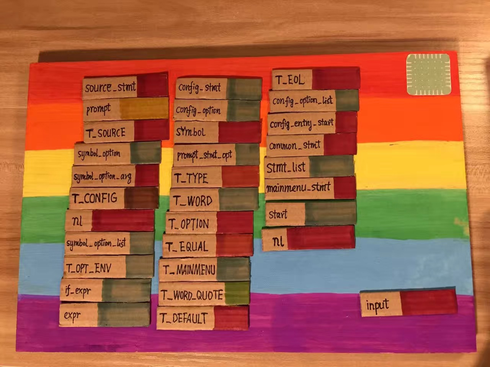

介绍 kconfig 的一些内容

kernel kconfig: [kconfig-language](https://www.kernel.org/doc/Documentation/kbuild/kconfig-language.txt)

这是从内核的 Kbuild 中剥离出来的 Kbuild, 想研究 Kbuild 的工作原理, 可以使用这个 GITHUB 项目 https://github.com/EmulateSpace/Kbuild

Kbuild 只要是一些 shell 逻辑和编译前端逻辑, 需要了解 shell , flex 和 bison 语言

相关文档: 三个 pdf 以及`<flex 与 bison 中文版第二版>`

词义堆栈:

Linux Kernel Code Static Check: http://llxwj.top/post/linux/linux-kernel-code-static-check/

linux kernel make 构建分析: https://www.cnblogs.com/rongpmcu/p/7662793.html

Linux 内核编译: https://gohalo.me/post/kernel-compile.html
