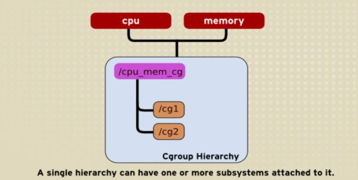
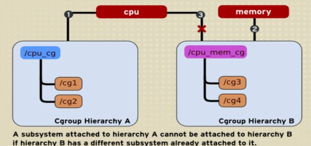
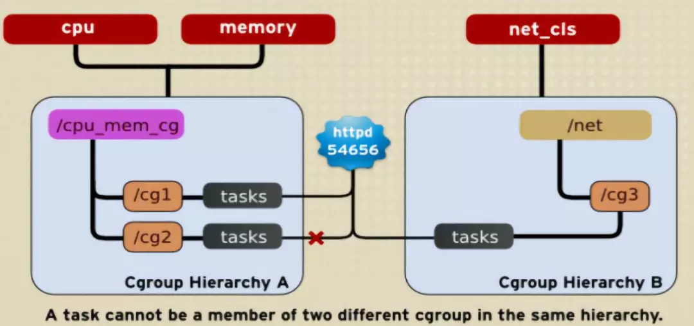
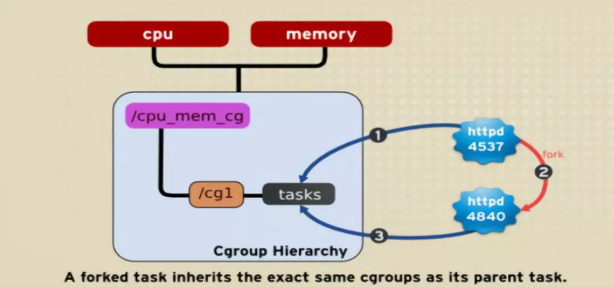
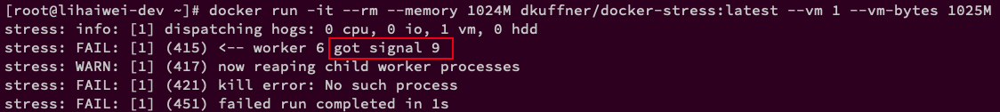

<!-- @import "[TOC]" {cmd="toc" depthFrom=1 depthTo=6 orderedList=false} -->

<!-- code_chunk_output -->

- [1. Cgroups 介绍](#1-cgroups-介绍)
- [2. Cgroups 作用](#2-cgroups-作用)
- [3. Cgroups 组成](#3-cgroups-组成)
  - [3.1. task](#31-task)
  - [3.2. cgroup: 任务组和 subsystem 的关联](#32-cgroup-任务组和-subsystem-的关联)
  - [3.3. subsystem/controller: 资源控制器](#33-subsystemcontroller-资源控制器)
  - [3.4. hierarchy: cgroup 的集合和 subsystem 的集合](#34-hierarchy-cgroup-的集合和-subsystem-的集合)
  - [3.5. 组件之间的关系](#35-组件之间的关系)
- [4. Cgroups 使用](#4-cgroups-使用)
  - [4.1. 创建 Hierarchy](#41-创建-hierarchy)
    - [4.1.1. centos 默认](#411-centos-默认)
  - [4.2. 挂载 Cgroup Controller](#42-挂载-cgroup-controller)
    - [4.2.1. centos 默认](#421-centos-默认)
  - [4.3. 卸载 cgroup controller](#43-卸载-cgroup-controller)
  - [4.4. 创建 Control Groups](#44-创建-control-groups)
  - [4.5. 进程或线程与 cgroup 的绑定](#45-进程或线程与-cgroup-的绑定)
  - [4.6. 限制进程派生的进程数量](#46-限制进程派生的进程数量)
  - [4.7. 设置 Control Cgroup 参数](#47-设置-control-cgroup-参数)
  - [4.8. 删除 Control Groups](#48-删除-control-groups)
  - [4.9. Cgroup 为空时, 进行回调通知](#49-cgroup-为空时-进行回调通知)
    - [4.9.1. centos 默认](#491-centos-默认)
- [5. Subsystem 介绍](#5-subsystem-介绍)
- [6. 容器使用 Cgroups 进行资源限制](#6-容器使用-cgroups-进行资源限制)
  - [6.1. 使用 docker run 方式创建容器](#61-使用-docker-run-方式创建容器)
    - [6.1.1. 限制 CPU share](#611-限制-cpu-share)
    - [6.1.2. 限制容器内存使用量](#612-限制容器内存使用量)
  - [6.2. 使用 Kubenetes 容器编排工具创建容器](#62-使用-kubenetes-容器编排工具创建容器)
- [7. 参考](#7-参考)

<!-- /code_chunk_output -->

# 1. Cgroups 介绍

Cgroups 是 control groups 的缩写, 是 Linux 内核提供的一种可以限制, 记录, 隔离进程组(process groups)所使用物理资源的机制. 最初由 google 工程师提出, 后来被整合进 Linux 的内核.

因此, Cgroups 为容器实现虚拟化提供了基本保证, 是构建 Docker,LXC 等一系列虚拟化管理工具的基石.

# 2. Cgroups 作用

* **资源限制**(Resource limiting): Cgroups 可以对进程组使用的资源总额进行限制. 如对**特定的进程**进行**内存**使用**上限**限制, 当超出上限时, 会触发 OOM.
* **优先级分配**(Prioritization): 通过分配的**CPU 时间片数量**及硬盘**IO 带宽**大小, 实际上就相当于控制了进程运行的优先级.
* **资源统计**(Accounting): Cgroups 可以统计系统的资源使用量, 如 CPU 使用时长、内存用量等等, 这个功能非常适用于计费.
* **进程控制**(ControlCgroups): 可以对进程组执行挂起、恢复等操作.

# 3. Cgroups 组成

Cgroups 主要由 task, cgroup, subsystem 及 hierarchy 构成. 下面分别介绍下各自的概念.

## 3.1. task

* `task`: 在 Cgroups 中, task 就是系统的**一个进程**.

## 3.2. cgroup: 任务组和 subsystem 的关联

Cgroups 中的**资源控制**都以**cgroup 为单位**实现的.

一个 cgroup 用来将**一组任务**和**一个或多个 subsystem 子系统**的一组参数关联起来.

所以一个 cgroup 表示按照某种**资源控制标准**划分而成的**任务组！！！**, 而资源控制标准即**一个或多个 subsystem 子系统**.

**一个任务**可以加入**某个 cgroup**, 也可以从某个 cgroup 迁移到另外一个 cgroup.

从**使用的角度**看, **cgroup**就是一个**目录树**, 目录中可以创建**子目录**, 这些目录称为"**cgroup 目录**", 在一些场景中为了体现层级关系, 还会称为"**cgroup 子目录**".

## 3.3. subsystem/controller: 资源控制器

**subsystem** 是一个模块, 该模块利用 cgroups 提供的**任务分组工具**以特定方式处理任务组.

cgroups 中的 subsystem 就是一个**资源调度控制器**(`Resource Controller`), 调度资源或对 cgroup 进行限制. `cpu controller`、`memory controller`等, 统一称为`cgroup controller`, **cgroup 控制器**.

subsystem = controller

比如**CPU 子系统**可以控制 cgroup 的**CPU 时间分配**, **内存子系统**可以限制**cgroup 内存使用量**.

## 3.4. hierarchy: cgroup 的集合和 subsystem 的集合

hierarchy 由**一系列 cgroup！！！** 以一个**树状结构**排列而成, 这样系统中**每个 task**都恰好位于 hierarchy 中的**一个 cgroup**中, hierarchy 也是**subsystem 的集合**. 对于 hierarchy 中的每个 cgroup 而言, **每个 subsystem**都有**特定于系统**(`system-specific`)的**状态**附加到其上.

每个 hierarchy 都有一个与之关联的**cgroup 虚拟文件系统**的实例. 创建一个 hierarchy(层级)是通过挂载完成的, 也就是说层级对应的文件系统 root 目录的结构

这是一个整体概念, 树状结构(一个目录, 本身可以是一个挂载点, 也可以不是).

hierarchy 中的**cgroup 节点**可以包含零或多个子节点, 子节点继承父节点的属性. **整个系统**可以有**多个 hierarchy**.

**每个 hierarchy**通过绑定对应的**subsystem**进行**资源调度**.

## 3.5. 组件之间的关系

`Subsystems`, `Hierarchies`, `Control Group` 和 `Tasks` 之间有许多的规则, 下面介绍下:

1. **同一个 hierarchy** 能够挂载**一个或多个 subsystem**

如下图, 将 cpu 和 memory subsystems(或者任意多个 subsystems)附加到同一个 hierarchy.



2. **一个 subsystem** 只能附加到**一个 hierarchy** 上

如下图, cpu subsystem 已经附加到了 hierarchy A, 并且 memory subsystem 已经附加到了 hierarchy B. 因此 cpu subsystem 不能在附加到 hierarchy B.



3. task、cgroup 和 hierarchy

系统**每次新建一个 hierarchy！！！** 时, 该系统上的**所有 task！！！** 默认构成了这个新建的 hierarchy 的**初始化 cgroup**, 这个 cgroup 也称为 **root cgroup**.

> 而在这之后新创建的进程不会自动归属到这个 cgroup

**一个 task 不能**存在于**同一个 hierarchy** 的**同一个 subsystem**的**不同 cgroup** 中, 但是**一个 task** 可以存在在**不同 hierarchy** 中的**多个 cgroup** 中.

如果操作时把一个 task 添加到同一个 hierarchy 中的**另一个 cgroup** 中, 则会从第一个 cgroup 中移除.

如下图, subsystem cpu 和 memory 被附加到 `cpu_mem_cg` 的 hierarchy. 而 `net_cls` 被附加到 `net_cls hierarchy`. 并且 httpd 进程被同时附加到了 `cpu_mem_cg hierarchy` 的 `cg1 cgroup` 中和 `net hierarchy` 的 `cg3 cgroup` 中. 并通过**两个 hierarchy** 的 **subsystem** 分别对 httpd 进程进行 **cpu**, **memory** 及**网络带宽**的限制.



4. 父子进程的 cgroup 关系

系统中的任何一个 task(Linux 中的进程)fork 自己创建一个**子 task**(子进程)时, 子 task 会自动的**继承**父 task cgroup 的关系, 在同一个 cgroup 中, 但是子 task 可以根据需要移到其它不同的 cgroup 中. **父子 task** 之间是**相互独立不依赖**的.

如下图, httpd 进程在 `cpu_and_mem hierarchy` 的`/cg1 cgroup` 中并把 PID 4537 写到该 cgroup 的 tasks 中. 之后 httpd(PID=4537)进程 fork 一个子进程 httpd(PID=4840)与其父进程在同一个 hierarchy 的同一个 cgroup 中, 但是由于父 task 和子 task 之间的关系独立不依赖的, 所以子 task 可以移到其它的 cgroup 中.



# 4. Cgroups 使用

我们直接使用 shell 命令直接操作 hierarchy 并设置 cgroup 参数. 在 centos 上也可以直接使用 libcgroup 提供的工具可简化对 cgroup 的使用.

```
yum install libcgroup
```

## 4.1. 创建 Hierarchy

hierarchy, 本身是一个**目录**, 也可以是一个**挂载点**

```bash
mkdir $hierarchy

mkdir /XXX

mkdir /XXX/XXX
```

当然一般情况下, 可以认为**这个目录叶节点名字**就是这个**hierarchy 的名字**

例如:

```bash
mkdir /data/cg_test
```

### 4.1.1. centos 默认

在 Centos 中默认情况下只用了一个 hierarchy, 是`/sys/fs/cgroup`, (也是因为只用了一个, 所以名字就直接是 cgroup 了, 没有专门的含义), 而且 centos 以**tmpfs 文件系统**的样式挂载了过去.

```bash
# df
tmpfs            8046096        0   8046096   0% /sys/fs/cgroup

# mount
tmpfs on /sys/fs/cgroup type tmpfs (ro,nosuid,nodev,noexec,mode=755)
```

## 4.2. 挂载 Cgroup Controller

**controller(即 subsystem)** 要使用`mount -t cgroup`样式的命令**挂载到一个目录**中, 这个操作称呼为"**挂载 cgroup controller**".

可以一个或多个.

```bash
mount -t cgroup -o subsystems XXX $hierarchy_path/name

// 示例
mkdir /data/cg_test/mem_test
mount -t cgroup -o memory mem_test /data/cg_test/mem_test
```

`-t cgroup`指定**挂载类型**, `-o`指定挂载的 controller(可以有多个, 用`","`间隔), xxx 可以是任意字符, name 可以认为就是想要挂载的 controller 的名字(其实就是目录名)

如果想要挂载所有的 subsystem, 使用下面命令

```bash
mount -t cgroup XXX $hierarchy_path

或

mount -t cgroup -o all cgroup $hierarchy_path

// 示例
mount -t cgroup cg_test /data/cg_test
```

不挂载任何 controller:

```
mount -t cgroup -o none,name=somename none /some/mount/point
```

**没有挂载 controller 的 cgroup**可以用来**跟踪进程**, 例如在进程消失导致 cgroup 为空时, cgroup 的通知回调会被触发.

>注: 这时就不需要自己手动创建的 controller 的目录

在 hierarchy 所在目录下面就是这个 hierarchy 所有可用的 subsystem.

注: 前面提到过一个 subsystem 不能挂载到不同 hierarchy, 所以挂载新的 controller 时建议先从旧的卸载掉

例如:

```shell
// 创建 hierarchy
# mkdir /data/cg_test

// 在 hierarchy 下创建 controller 目录
# mkdir -p /data/cg_test/mem_test

// 挂载 memory controller
# mount -t cgroup -o memory mem_test /data/cg_test/mem_test

// 查找 mount point
# mount
mem_test on /data/cg_test/mem_test type cgroup (rw,relatime,memory)

// 查看这个 hierarchy 的所有 controller/subsystem
# ll /data/cg_test
total 0
drwxr-xr-x 5 root root 0 Dec 16 16:30 mem_test

// 查看 mem_test 这个 controller 的文件接口
# ls /data/cg_test/mem_test/
cgroup.clone_children       memory.kmem.max_usage_in_bytes      memory.memsw.failcnt             memory.stat
cgroup.event_control        memory.kmem.slabinfo                memory.memsw.limit_in_bytes      memory.swappiness
cgroup.procs                memory.kmem.tcp.failcnt             memory.memsw.max_usage_in_bytes  memory.usage_in_bytes
cgroup.sane_behavior        memory.kmem.tcp.limit_in_bytes      memory.memsw.usage_in_bytes      memory.use_hierarchy
init.scope                  memory.kmem.tcp.max_usage_in_bytes  memory.move_charge_at_immigrate  notify_on_release
memory.failcnt              memory.kmem.tcp.usage_in_bytes      memory.numa_stat                 release_agent
memory.force_empty          memory.kmem.usage_in_bytes          memory.oom_control               system.slice
memory.kmem.failcnt         memory.limit_in_bytes               memory.pressure_level            tasks
memory.kmem.limit_in_bytes  memory.max_usage_in_bytes           memory.soft_limit_in_bytes       user.slice
```

从结果看:
* 有了 mount 点
* 在`/data/cg_test/mem_test`下面创建了很多文件

### 4.2.1. centos 默认

在 centos 中, `/sys/fs/cgroup/`目录下就是当前系统**所有可用的 subsystem**:

```bash
# ls /sys/fs/cgroup/
blkio  cpuacct      cpuset   freezer  memory   perf_event  systemd
cpu    cpu,cpuacct  devices  hugetlb  net_cls  pids
```

而这些 subsystem 都是通过 cgroup 挂载类型挂载的

```
# mount | grep cgroup
tmpfs on /sys/fs/cgroup type tmpfs (ro,nosuid,nodev,noexec,mode=755)
cgroup on /sys/fs/cgroup/systemd type cgroup (rw,nosuid,nodev,noexec,relatime,xattr,release_agent=/usr/lib/systemd/systemd-cgroups-agent,name=systemd)
cgroup on /sys/fs/cgroup/blkio type cgroup (rw,nosuid,nodev,noexec,relatime,blkio)
cgroup on /sys/fs/cgroup/cpu,cpuacct type cgroup (rw,nosuid,nodev,noexec,relatime,cpu,cpuacct)
cgroup on /sys/fs/cgroup/devices type cgroup (rw,nosuid,nodev,noexec,relatime,devices)
cgroup on /sys/fs/cgroup/hugetlb type cgroup (rw,nosuid,nodev,noexec,relatime,hugetlb)
cgroup on /sys/fs/cgroup/pids type cgroup (rw,nosuid,nodev,noexec,relatime,pids)
cgroup on /sys/fs/cgroup/memory type cgroup (rw,nosuid,nodev,noexec,relatime,memory)
cgroup on /sys/fs/cgroup/perf_event type cgroup (rw,nosuid,nodev,noexec,relatime,perf_event)
cgroup on /sys/fs/cgroup/cpuset type cgroup (rw,nosuid,nodev,noexec,relatime,cpuset)
cgroup on /sys/fs/cgroup/freezer type cgroup (rw,nosuid,nodev,noexec,relatime,freezer)
cgroup on /sys/fs/cgroup/net_cls type cgroup (rw,nosuid,nodev,noexec,relatime,net_cls)
```

不同的 subsystem 有不同的用法.

前面提到过一个 subsystem 不能挂载到不同 hierarchy, 所以如果不卸载旧的 controller, 那新挂载的内容和旧是相同

```
// 旧的 controller
# mount | grep memory
cgroup on /sys/fs/cgroup/memory type cgroup (rw,nosuid,nodev,noexec,relatime,memory)
// test 是我创建的
# ls /sys/fs/cgroup/memory
cgroup.clone_children           memory.kmem.tcp.max_usage_in_bytes  memory.soft_limit_in_bytes
cgroup.event_control            memory.kmem.tcp.usage_in_bytes      memory.stat
cgroup.procs                    memory.kmem.usage_in_bytes          memory.swappiness
cgroup.sane_behavior            memory.limit_in_bytes               memory.usage_in_bytes
init.scope                      memory.max_usage_in_bytes           memory.use_hierarchy
memory.failcnt                  memory.memsw.failcnt                notify_on_release
memory.force_empty              memory.memsw.limit_in_bytes         onion
memory.kmem.failcnt             memory.memsw.max_usage_in_bytes     release_agent
memory.kmem.limit_in_bytes      memory.memsw.usage_in_bytes         system.slice
memory.kmem.max_usage_in_bytes  memory.move_charge_at_immigrate     tasks
memory.kmem.slabinfo            memory.numa_stat                    test
memory.kmem.tcp.failcnt         memory.oom_control                  user.slice
memory.kmem.tcp.limit_in_bytes  memory.pressure_level

// 不卸载旧的新挂载
# mount -t cgroup -o memory mem_test /data/cg_test/mem_test
// 可以看到内容是相同的
# ls /data/cg_test/mem_test
cgroup.clone_children           memory.kmem.tcp.max_usage_in_bytes  memory.soft_limit_in_bytes
cgroup.event_control            memory.kmem.tcp.usage_in_bytes      memory.stat
cgroup.procs                    memory.kmem.usage_in_bytes          memory.swappiness
cgroup.sane_behavior            memory.limit_in_bytes               memory.usage_in_bytes
init.scope                      memory.max_usage_in_bytes           memory.use_hierarchy
memory.failcnt                  memory.memsw.failcnt                notify_on_release
memory.force_empty              memory.memsw.limit_in_bytes         onion
memory.kmem.failcnt             memory.memsw.max_usage_in_bytes     release_agent
memory.kmem.limit_in_bytes      memory.memsw.usage_in_bytes         system.slice
memory.kmem.max_usage_in_bytes  memory.move_charge_at_immigrate     tasks
memory.kmem.slabinfo            memory.numa_stat                    test
memory.kmem.tcp.failcnt         memory.oom_control                  user.slice
memory.kmem.tcp.limit_in_bytes  memory.pressure_level
```

## 4.3. 卸载 cgroup controller

如果想在已有的 hierarchy 上 **attch** 或 **detach subsystem**, 可以使用 **remount** 操作

例如我们想 detach 掉 memory subsystem.

```
mount -t cgroup -o remount,cpu,cpuset cpu_and_mem /cgroup/cpu_and_mem
```

可以直接用 umount 命令来卸载一个已有的 controller(`/data/cg_test/`是 hierarchy):

```bash
umount $hierarchy_path/XXX
```

卸载的时候要注意, 需要先将**所有子目录卸载**, 否则, umount 只会让挂载点不可见, 而不是真正将其卸载.

例如:

```
umount /data/cg_test/mem_test
```

注: `/data/cg_test/`是 hierarchy

## 4.4. 创建 Control Groups

cgroup 是以**目录的形式**呈现的, `/`是 cgroup 的**根目录**, 注意**cgroup 的根目录**和**挂载目录**(hierarchy 所在目录)不是一回事, cgroup 可能**挂载**在`/sys/fs/cgroup`或者`/tmp/cgroup`等任意目录, 无论挂载在哪里, cgroup 的**根目录**都是`"/"`.

假设 cgroup 的`cpu controller`的挂载点是`/sys/fs/cgroup/cpu`, 那么目录`/sys/fs/cgroup/cpu/cg1`对应的**cgroup 的目录**是`/cg1`.

为什么要强调这个, 因为在调查一个 kubelet 的问题的时候, 不确定`--runtime-cgroups`参数值中**要不要包含挂载点路径**, 直到用 cadvisor 查出所有 cgroup 后, 才确定不应该带有挂载路径. 现在从 Linux 手册中找到支持了:

```
A cgroup filesystem initially contains a single root cgroup, '/',
which all processes belong to.  A new cgroup is created by creating a
directory in the cgroup filesystem:

      mkdir /sys/fs/cgroup/cpu/cg1
```

可以在**每个 controller(即 subsystem)目录**下建立**多个目录**, **每个目录**就是**一个 cgroup**, 可以分别设置每个 cgroup. cgroup 中可以继续创建 cgroup.

直接使用 mkdir 创建一个子 cgroup:

```bash
mkdir $hierarchy_path/$controller/$cg_name
```

例如:

```
# mkdir /data/cg_test/mem_test/group1
# ls /data/cg_test/mem_test/group1
cgroup.clone_children           memory.kmem.tcp.failcnt             memory.memsw.limit_in_bytes      memory.swappiness
cgroup.event_control            memory.kmem.tcp.limit_in_bytes      memory.memsw.max_usage_in_bytes  memory.usage_in_bytes
cgroup.procs                    memory.kmem.tcp.max_usage_in_bytes  memory.memsw.usage_in_bytes      memory.use_hierarchy
memory.failcnt                  memory.kmem.tcp.usage_in_bytes      memory.move_charge_at_immigrate  memory.vmstat
memory.force_empty              memory.kmem.usage_in_bytes          memory.numa_stat                 notify_on_release
memory.kmem.failcnt             memory.limit_in_bytes               memory.oom_control               tasks
memory.kmem.limit_in_bytes      memory.max_usage_in_bytes           memory.pressure_level
memory.kmem.max_usage_in_bytes  memory.meminfo                      memory.soft_limit_in_bytes
memory.kmem.slabinfo            memory.memsw.failcnt                memory.stat
```

## 4.5. 进程或线程与 cgroup 的绑定

将**进程的进程号**直接写入到对应`cgroup.procs`文件中, 就完成了进程与 cgroup 的绑定

例如, 将当前 shell 进程关联到`cg1`:

```bash
echo $$ > /sys/fs/cgroup/cpu/cg1/cgroup.procs
```

将进程绑定到 cgroup 之后, **该进程创建的线程**也一同被绑定到**同一个 cgroup**.

每个进程只能绑定**每个 controller**的**一个 cgroup 目录**, 把进程的 ID 加到 controller 中的另一个 cgroup 目录的`cgroup.procs`文件中时, 会自动将其从**原先**的`cgroup.procs`文件中**移除**.

每次只能向`cgroup.procs`中添加一个进程号, **不能批量添加**.

从`cgroup.procs`中读取的进程号的**顺序是随意的**, 并且是**可以重复的**.

cgroup v1 支持将**线程**(task)绑定到 cgroup 目录, 只需将线程的**线程 ID**写入目标 cgroup 目录的`tasks`文件中.

注意, **tasks 文件**中是**线程 ID**, `cgroup.procs`文件中是**进程 ID**.

## 4.6. 限制进程派生的进程数量

pids 用来限制一个进程可以派生出的进程数量.

如果系统中没有挂载 pids, 先挂载:

```
mkdir -p /sys/fs/cgroup/pids
mount -t cgroup -o pids none /sys/fs/cgroup/pids
```

然后创建一个名为 parent 的目录, 也就是一个 cgroup:

```
mkdir -p /sys/fs/cgroup/pids/parent
```

设置最大进程数为 3:

```
echo 3 > /sys/fs/cgroup/pids/parent/pids.max
```

将当前的 shell 进程关联到 cgroup:

```
echo $$ > /sys/fs/cgroup/pids/parent/cgroup.procs
```

## 4.7. 设置 Control Cgroup 参数

在 **group1** 中使用 echo 命令插入 `0-1` 到 `cpuset.cpus`, 来限制该 cgroup 中的 tasks 只能跑在 0 和 1 的 cpu core 上. 如下:

```
echo 0-1 > /cgroup/cpu_and_mem/group1/cpuset.cpus
```

## 4.8. 删除 Control Groups

删除直接使用命令 rmdir

```
rmdir /data/cg_test/mem_test/group1
```

注: 在 cgroup 子目录已经全部删除, 并且没有绑定任何进程、线程的情况下, 直接删除 cgroup 目录即可.

## 4.9. Cgroup 为空时, 进行回调通知

**每个 cgroup**中目录中都有下面两个文件:

```
notify_on_release   release_agent
```

`notify_on_release`的内容是 0 或者 1, 指示 kernel 是否要在**cgroup 为空时**(**没有 cgroup 子目录**、**没有绑定任何进程**)发出通知, 0 为不通知, 1 为通知.

`release_agent`是**自行设置的**、kernel 通知时**调用的命令**,  它的命令行参数有且只有一个, 就是当前为空的 cgroup 目录. 仅存在于最上层的 cgroup.

`release_agent`也可以在挂载 cgroup 的时候设置:

```
mount -o release_agent=pathname ...
```

### 4.9.1. centos 默认

比如

```
# cat /sys/fs/cgroup/systemd/release_agent
/usr/lib/systemd/systemd-cgroups-agent
```

# 5. Subsystem 介绍

这个是重点, 使用 cgroup 主要就是和各种 controller 打交道

* `cpu`: 主要限制进程的**cpu 使用率**.

[CFS Scheduler](https://www.kernel.org/doc/Documentation/scheduler/sched-design-CFS.txt)、 [CFS Bandwidth Control](https://www.kernel.org/doc/Documentation/scheduler/sched-bwc.txt) :

>since 2.6.24, 限制 CPU 份额, 只会在 cpu 忙碌的时候限制 cpu 使用, 如果 cpu 空闲不做限制.
>since 3.2.0,  引入了`CONFIG_CFS_BANDWIDTH`编译选项, 限制进程在每个调度周期占用的时间, 无论 CPU 是否空闲.

* `cpuacct`: 可以统计 cgroup 中进程的**cpu 使用报告**.

`Documentation/cgroup-v1/cpuacct.txt`

>since 2.6.24, 统计一组 task 的 cpu 使用情况.

* `cpuset`: 可以为 cgroup 中的进程分配**独立的 cpu 和内存节点**.

`Documentation/cgroup-v1/cpusets.txt`

>since 2.6.24, 绑定到特定的 cpu

* `memory`: 自动生成 cgroup 中 task 使用的**内存资源报告**, 并对该 cgroup 的 task 进行**内存使用限制**.

`Documentation/cgroup-v1/memory.txt`

>since 2.6.25, 报告和限制内存使用情况

* `devices`: 可以控制进程**能否访问某些设备**.

`Documentation/cgroup-v1/devices.txt`

>since 2.6.26, 限制设备文件的创建, 和对设备文件的读写

* `freezer`: 可以**挂起或恢复**cgroup 中的进程.

`Documentation/cgroup-v1/freezer-subsystem.txt`

>since 2.6.28, 暂停、重载指定 cgroup 目录中的、以及它的子目录中的 task

* `net_cls`: 使用**等级标识符**(clssid)标记网络数据包, 可允许 Linux**流量控制程序**(tc)**识别**从具体 cgroup 中生成的数据包.

`Documentation/cgroup-v1/net_cls.txt`

>since 2.6.29, 为该 cgroup 内的 task 产生的报文打上 classid

* `blkio`: blkio 子系统控制并监控 cgroup 中的 task**对块设备的 I/O 的访问**. 如:限制访问及带宽等.

`Documentation/cgroup-v1/blkio-controller.txt`

>since 2.6.33, 限制和控制对块设备的读写

* `perf_event`

`tools/perf/Documentation/perf-record.txt`

>since 2.6.39, 允许 perf 观测 cgroup 中的 task

* `net_prio`

`Documentation/cgroup-v1/net_prio.txt`

>since 3.3, 设置 net 优先级

* `hugetlb`

`Documentation/cgroup-v1/hugetlb.txt`

>since 3.5, 限制 huge page 的使用

* `pids`

`Documentation/cgroup-v1/pids.txt`

>since 4.3, 限制 cgroup 中可创建的进程数

* `rdma`

`Documentation/cgroup-v1/rdma.txt`

>since 4.11, 限制 RDMA/IB 资源

# 6. 容器使用 Cgroups 进行资源限制

无论是使用 `docker run` 方式**直接创建容器**, 还是通过各类**容器编排工具**(如: `Kubernetes`)**创建容器**, 对于容器的限制本质都是通过 **Cgroups**.

我们分别使用这两种方式来创建容器并观察 cgroups.

## 6.1. 使用 docker run 方式创建容器

创建容器, 则会在运行该容器宿主的 `/sys/fs/cgroup/cpu/docker/` 下分别创建**两个子 cgroup**, 格式如下.

```
/sys/fs/cgroup/cpu/docker/<container_id>/
```

### 6.1.1. 限制 CPU share

当 **CPU 资源充足**时, 设置 **CPU 的权重**是没有意义的. 只有在容器**争用 CPU 资源**的情况下,  CPU 的权重才能让不同的容器分到不同的 CPU 用量. `--cpu-shares` 选项用来设置 CPU 权重.

**两个容器分享一个 CPU**, 所以**总量**应该是 `100%`. 具体每个容器分得的负载则取决于 `--cpu-shares` 选项的设置！假设设置分别是 512 和 1024, 则它们分得的比例为 1:2.

1. 创建一个 stress 容器, 并设置`–cpu-shares` 参数为`10240 = 1024*10`.

```
# docker run -it --rm --cpu-shares 10240 dkuffner/docker-stress:latest -c 10
stress: info: [1] dispatching hogs: 10 cpu, 0 io, 0 vm, 0 hdd
```

创建容器前后对比, mount 多了两个

```
# mount
overlay on /var/lib/docker/overlay2/8adadcff1506ec44d7b1a55da587f1e7c60e973730adc66740dd32712cc8f63f/merged type overlay (rw,relatime,lowerdir=/var/lib/docker/overlay2/l/D3DFRKDESO6X44VLQVM3ACGCZW:/var/lib/docker/overlay2/l/AP7ZQJC4J5PTLJ562E2HPRGGOK:/var/lib/docker/overlay2/l/WM5BGFTZ7WTTQDGUBTJE4GZD7Z:/var/lib/docker/overlay2/l/ZBWWWDYBG2LFNG5DPTRYXNPYQQ:/var/lib/docker/overlay2/l/Z2M4WVV5CL7UZYTRPYDHKWUGDH,upperdir=/var/lib/docker/overlay2/8adadcff1506ec44d7b1a55da587f1e7c60e973730adc66740dd32712cc8f63f/diff,workdir=/var/lib/docker/overlay2/8adadcff1506ec44d7b1a55da587f1e7c60e973730adc66740dd32712cc8f63f/work)
proc on /run/docker/netns/d68816f738a1 type proc (rw,relatime)
```

查看该容器 cgroup 的 `cpu.shares` 文件内容

```
# cat /sys/fs/cgroup/cpu/docker/9f4b3ad59267723230d2e117f671db1dd365aec00ed56d4948db545bd2528ba3/cpu.shares
10240
```

2. 再创建一个 stress 容器, 并设置 `–cpu-shares` 参数为: `20480 = 1024*20`

```
# # docker run -it --rm --cpu-shares 20480 dkuffner/docker-stress:latest -c 20
stress: info: [1] dispatching hogs: 20 cpu, 0 io, 0 vm, 0 hdd
```

查看该容器 cgroup 的 `cpu.shares` 文件内容

```
# cat /sys/fs/cgroup/cpu/docker/fab5759883772cad4c725cf61d64c882d8cbaf6487621f3affcba5afafbf8fa7/cpu.shares
20480
```

3. 查看两个容器使用 cpu 的 stats, 一个容器分到 14 核的相对 cpu 计算时间, 另一个容器分到 10 核的相对 cpu 计算时间:

```
# docker container ls
CONTAINER ID        IMAGE                           COMMAND             CREATED              STATUS              PORTS               NAMES
fab575988377        dkuffner/docker-stress:latest   "stress -c 20"      34 seconds ago       Up 32 seconds                           trusting_chatelet
9f4b3ad59267        dkuffner/docker-stress:latest   "stress -c 10"      About a minute ago   Up About a minute                       epic_khayyam

# docker stats --no-stream
CONTAINER ID        NAME                CPU %               MEM USAGE / LIMIT   MEM %               NET I/O             BLOCK I/O           PIDS
fab575988377        trusting_chatelet   528.07%             644KiB / 15.35GiB   0.00%               0B / 0B             0B / 0B             21
9f4b3ad59267        epic_khayyam        264.10%             404KiB / 15.35GiB   0.00%               0B / 0B             0B / 0B             11
```

CPU 占比基本`2:1`

### 6.1.2. 限制容器内存使用量

1. 创建一个容器, 通过参数`--memory`限制容器能使用的内存上限为 1024M

```
# docker run -it --rm --memory 1024M dkuffner/docker-stress:latest --vm 1 --vm-bytes 1023M
```
2. 查看容器的 memory stats, 内存使用率

```
# docker stats --no-stream
CONTAINER ID        NAME                CPU %               MEM USAGE / LIMIT   MEM %               NET I/O             BLOCK I/O           PIDS
3276d3819fdd        recursing_lalande   99.73%              1023MiB / 1GiB      99.91%              0B / 0B             0B / 0B             2
```

3. 当容器使用的内存量超过 1024M, 则容器会被 `kill -9` 掉

```
# docker run -it --rm --memory 1024M dkuffner/docker-stress:latest --vm 1 --vm-bytes 1025M
stress: info: [1] dispatching hogs: 0 cpu, 0 io, 1 vm, 0 hdd
stress: FAIL: [1] (415) <-- worker 6 got signal 9
stress: WARN: [1] (417) now reaping child worker processes
stress: FAIL: [1] (421) kill error: No such process
stress: FAIL: [1] (451) failed run completed in 1s
```



## 6.2. 使用 Kubenetes 容器编排工具创建容器

使用 kubernetes 编排工具创建的容器, 则与容器关联的 cgroup 均在运行该容器宿主机的`/sys/fs/cgroup/cpu/kubepods/`下,具体的格式如下所示:

```
/sys/fs/cgroup/cpu/kubepods/pod<pod_id>/<container_id>

/sys/fs/cgroup/memory/kubepods/pod<pod_id>/<container_id>
```

使用 Pod 创建一个容器, 对应的 yaml 文件内容如下:

```yaml
apiVersion: v1
kind: Pod
metadata:
  name: nginx
  labels:
    env: test
spec:
  terminationGracePeriodSeconds: 30
  containers:
  - name: nginx
    image: nginx
    imagePullPolicy: IfNotPresent
    resources:
      limits:
        cpu: 1000m
        memory: 2048Mi
      requests:
        cpu: 1000m
        memory: 2048Mi
```

在运行该容器的宿主机上查看该容器的 cgroup 信息, 会观察到`cpu.shares`为 1 核, `memory.limit_in_bytes`为 2G.

```
# cat /sys/fs/cgroup/cpu/kubepods/pod64db38a6-3f6e-11eb-9dfe-525400db21aa/932d58a22da5bf92a24a6a04c1a3ecb29b25970da829582fde4a40757108a1db/cpu.shares
1024

# cat /sys/fs/cgroup/memory/kubepods/pod64db38a6-3f6e-11eb-9dfe-525400db21aa/932d58a22da5bf92a24a6a04c1a3ecb29b25970da829582fde4a40757108a1db/memory.limit_in_bytes
2147483648
```

# 7. 参考

https://access.redhat.com/documentation/en-us/red_hat_enterprise_linux/6/html/resource_management_guide/ch01

https://www.kernel.org/doc/Documentation/cgroup-v1/cgroups.txt

http://www.infoq.com/cn/articles/docker-kernel-knowledge-cgroups-resource-isolation

原文: https://mp.weixin.qq.com/s/3a5k3YA6ALri3BrQWQbOpw