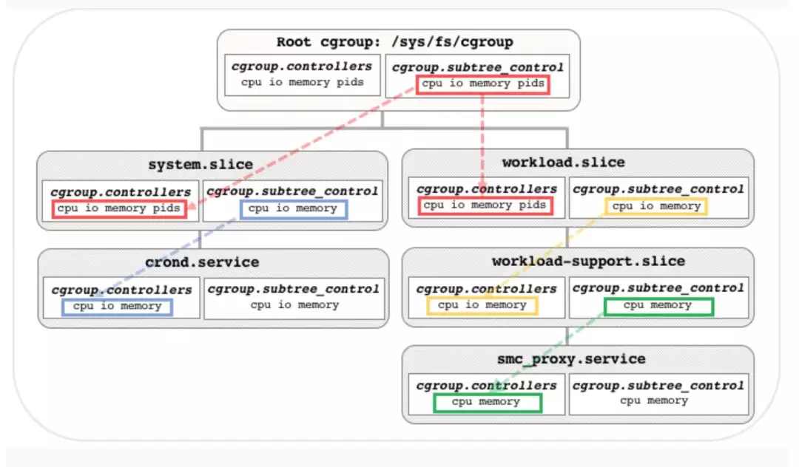
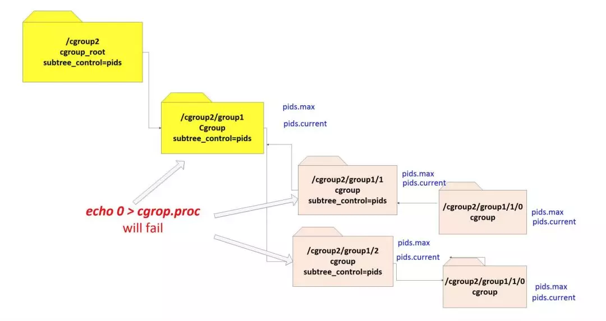

<!-- @import "[TOC]" {cmd="toc" depthFrom=1 depthTo=6 orderedList=false} -->

<!-- code_chunk_output -->

- [1. 背景](#1-背景)
- [2. cgroups v2 的变化](#2-cgroups-v2-的变化)
- [3. unified hierarchy](#3-unified-hierarchy)
- [4. 支持的 controllers](#4-支持的-controllers)
- [5. threaded controller](#5-threaded-controller)
- [6. cgroup 目录](#6-cgroup-目录)
  - [6.1. controller 的启用/禁止](#61-controller-的启用禁止)
- [7. "no internal processes" rule](#7-no-internal-processes-rule)
- [8. cgroup.events file](#8-cgroupevents-file)
- [9. cgroup.stat file](#9-cgroupstat-file)
- [10. 后代 cgroups 数量限制](#10-后代-cgroups-数量限制)
- [11. 参考](#11-参考)

<!-- /code_chunk_output -->

cgroups 为容器实现虚拟化提供了基础. 随着容器技术不断发展, `cgroups v1` 中管理 **controller** 变得复杂起来. cgroups v2 的出现**简化了 Hierarchy**, 并在 kernel 4.5.0 版本成为正式特性. 本文将从其产生的背景, 相比 v1 具体有哪些变化等方面, 对 cgroups v2 进行介绍.

# 1. 背景

cgroup v1 中, 由于当前 **k8s** 使用 **cephfs** 进行**数据存储**, 当**多租户**使用时, 需要**对 IO 进行限制**. 当前 `cgroup v1` 由于 **memcg**(memory resource controller) 与 **blkio** 没有协作, 导致 `buffer io` 的 throttle 一直没有实现.

并且 cgroup v1 在**内核的实现**一直比较**混乱**, 其中主要的原因在于, cgroup 为了提供灵活性, 允许**进程**可以**属于多个 hierarchy** 的**不同的 group**. 但实际上, **多个 hierarchy** 并**没有太大的用处**, 因为**控制器**(controller)**只能属于一个 hierarchy**. 所以在**实际使用**中, 通常是**每个 hierarchy 一个控制器** .

这种多 hierarchy 除了增加代码的复杂度和理解困难外, 并没有太大的用处. 一方面, 跟踪**进程所有 controller** 变得**复杂**; 另外, **各个 controller** 之间也**很难协同工作**(因为 **controller** 可能**属于不同的 hierarchy**, 所以从 3.16 开始, 内核开始转向**单一层次**(`unified hierarchy`). 并且实现了**对 buffer io 的限制**.

# 2. cgroups v2 的变化

由于 cgroups v1 存在的种种问题, cgroups v2 将`多 hierarchy` 的方式变成了 `unified hierarchy`, 并将**所有的 controller** 挂载到**一个 unified hierarchy**.

当前 kernel 没有移除 cgroups v1 版本, 允许 cgroups v1 和 v2 两个版本共存. 但是相同的 controller 不能同时 mount 到这两个不同的 cgroup 版本中.

以下是 cgroups v2 的五点改进:

* cgroups v2 中**所有的 controller**都会被默认自动挂载到**一个 unified hierarchy**下, 不再存在像`v1`中允许**不同的 controller**挂载到**不同的 hierarchy**的情况
* **进程**只能绑定到 cgroup 的**根("/")目录**和 cgroup 目录树中的**叶子节点**, 不能绑定到**中间目录**
* 通过`cgroup.controllers`和`cgroup.subtree_control`指定**哪些 controller 可以被使用**
* v1 版本中的**task 文件**和`cpuset controller`中的`cgroup.clone_children`文件**被移除**
* 当**cgroup 为空**时的**通知机制**得到改进, 通过`cgroup.events`文件通知

`Documentation/cgroup-v2.txt`有更详细的描述

# 3. unified hierarchy

在 `cgroups v1` 允许将**不同的 controller** 挂载到**不同的 hierarchies** 虽然很灵活, 但实际上这种方式对于使用者来说是没有必要的. 因此在 `cgroups v2` 版本中, 将**所有的 controller** 都挂载到**一个 hierarchy**.

可以使用下面命令将 cgroups v2 挂载到文件系统, 并且**所有可用的 controller** 会**自动被挂载**进去.

```bash
mount -t cgroup2 none $MOUNT_POINT
```

示例:

```
# mount -t cgroup2 none /data/cg_test/

# ls /data/cg_test/
cgroup.controllers      cgroup.procs            cgroup.threads         cpu.stat          memory.stat
cgroup.max.depth        cgroup.stat             cpuset.cpus.effective  io.stat
cgroup.max.descendants  cgroup.subtree_control  cpuset.mems.effective  memory.numa_stat

# cat cg_test/cgroup.controllers
cpuset cpu io memory hugetlb pids
```

当试图**再 mount 一个 cgroup2**时, 会发现, 其实**两个一模一样**, 只是挂载目录不同, 这也是 unified hierarchy 的体现

```
# mount -t cgroup2 none /data/cg_test2

# mount | grep cgroup2
none on /data/cg_test type cgroup2 (rw,relatime)
none on /data/cg_test2 type cgroup2 (rw,relatime)

# ll cg_test/
total 0
-r--r--r-- 1 root root 0 Jan 27 16:01 cgroup.controllers
-rw-r--r-- 1 root root 0 Jan 27 16:01 cgroup.max.depth
-rw-r--r-- 1 root root 0 Jan 27 16:01 cgroup.max.descendants
-rw-r--r-- 1 root root 0 Jan 27 16:01 cgroup.procs
-r--r--r-- 1 root root 0 Jan 27 16:01 cgroup.stat
-rw-r--r-- 1 root root 0 Jan 27 16:14 cgroup.subtree_control
-rw-r--r-- 1 root root 0 Jan 27 16:01 cgroup.threads
-r--r--r-- 1 root root 0 Jan 27 16:01 cpuset.cpus.effective
-r--r--r-- 1 root root 0 Jan 27 16:01 cpuset.mems.effective
-r--r--r-- 1 root root 0 Jan 27 16:01 cpu.stat
-r--r--r-- 1 root root 0 Jan 27 16:01 io.stat
drwxr-xr-x 2 root root 0 Jan 27 16:14 mem_cg
-r--r--r-- 1 root root 0 Jan 27 16:01 memory.numa_stat
-r--r--r-- 1 root root 0 Jan 27 16:01 memory.stat

# ll cg_test2/
total 0
-r--r--r-- 1 root root 0 Jan 27 16:01 cgroup.controllers
-rw-r--r-- 1 root root 0 Jan 27 16:01 cgroup.max.depth
-rw-r--r-- 1 root root 0 Jan 27 16:01 cgroup.max.descendants
-rw-r--r-- 1 root root 0 Jan 27 16:01 cgroup.procs
-r--r--r-- 1 root root 0 Jan 27 16:01 cgroup.stat
-rw-r--r-- 1 root root 0 Jan 27 16:14 cgroup.subtree_control
-rw-r--r-- 1 root root 0 Jan 27 16:01 cgroup.threads
-r--r--r-- 1 root root 0 Jan 27 16:01 cpuset.cpus.effective
-r--r--r-- 1 root root 0 Jan 27 16:01 cpuset.mems.effective
-r--r--r-- 1 root root 0 Jan 27 16:01 cpu.stat
-r--r--r-- 1 root root 0 Jan 27 16:01 io.stat
drwxr-xr-x 2 root root 0 Jan 27 16:14 mem_cg
-r--r--r-- 1 root root 0 Jan 27 16:01 memory.numa_stat
-r--r--r-- 1 root root 0 Jan 27 16:01 memory.stat
```

**一个 contoller 无法在 cgroups v1 和 v2 中同时使用**. 如果想在 cgroups v2 使用已经被 cgroups v1 使用的 controller, 则需要先将其从 cgroups v1 中 umount 掉.

要注意的是, 系统启动时, systemd **默认**使用 `cgroups v1`, 并将**可以使用的 controller** mount 到`/sys/fs/cgroup`. 如下:

```bash
# mount | grep cgroup
tmpfs on /sys/fs/cgroup type tmpfs (ro,nosuid,nodev,noexec,mode=755)
cgroup on /sys/fs/cgroup/systemd type cgroup (rw,nosuid,nodev,noexec,relatime,xattr,release_agent=/usr/lib/systemd/systemd-cgroups-agent,name=systemd)
efivarfs on /sys/firmware/efi/efivars type efivarfs (rw,nosuid,nodev,noexec,relatime)
cgroup on /sys/fs/cgroup/freezer type cgroup (rw,nosuid,nodev,noexec,relatime,freezer)
cgroup on /sys/fs/cgroup/pids type cgroup (rw,nosuid,nodev,noexec,relatime,pids)
cgroup on /sys/fs/cgroup/devices type cgroup (rw,nosuid,nodev,noexec,relatime,devices)
cgroup on /sys/fs/cgroup/cpu,cpuacct type cgroup (rw,nosuid,nodev,noexec,relatime,cpu,cpuacct)
cgroup on /sys/fs/cgroup/cpuset type cgroup (rw,nosuid,nodev,noexec,relatime,cpuset)
cgroup on /sys/fs/cgroup/net_cls type cgroup (rw,nosuid,nodev,noexec,relatime,net_cls)
cgroup on /sys/fs/cgroup/perf_event type cgroup (rw,nosuid,nodev,noexec,relatime,perf_event)
cgroup on /sys/fs/cgroup/hugetlb type cgroup (rw,nosuid,nodev,noexec,relatime,hugetlb)
cgroup on /sys/fs/cgroup/memory type cgroup (rw,nosuid,nodev,noexec,relatime,memory)
cgroup on /sys/fs/cgroup/blkio type cgroup (rw,nosuid,nodev,noexec,relatime,blkio)
```

如果想在系统启动时, 把 `cgroups v1` **关掉**, 可以在 `/etc/default/grub` 文件下修改 kernel 参数,增加 `GRUB_CMDLINE_LINUX_DEFAULT="cgroup_no_v1=all"`.

```
cgroup_no_v1=list     # list 是用逗号间隔的多个 controller
cgroup_no_v1=all      # all 将所有的 controller 设置为对 cgroup v1 不可用
```

这样就可以在 cgroups v2 中使用你想要的 controller 了.

# 4. 支持的 controllers

当前 cgroup v2 支持以下 controller:

* io

>since Linux 4.5, cgroup v1 的 blkio 的继任者

* memory

> since Linux 4.5, cgroup v1 的 memory 的继任者

* pids

>since Linux 4.5, 与 cgroup v1 中的 pids 是同一个

* perf_event

>since 4.5, 与 cgroup v1 中的 perf_event 是同一个

* rdma

>since Linux 4.11, 与 cgroup v1 中的 rdma 是同一个

* cpu

>since Linux 4.15, cgroup v1 的 cpu、cpuacct 的继任者

# 5. threaded controller


# 6. cgroup 目录

## 6.1. controller 的启用/禁止

在 **hierarchy** 下的**每一个 cgroup** 中都会包含如下两个文件:

* `cgroup.controllers`: 这是一个`read-only`文件. 包含了该 cgroup 下**所有可用的 controllers**.

* `cgroup.subtree_control`: 这个文件中包含了该 cgroup 下**已经被开启的 controllers**.

并且`cgroup.subtree_control`中包含的 controllers 是`cgroup.controllers`文件 controller 的**子集**.

`cgroup.subtree_control` 文件内容格式如下, controller 之间使用空格间隔, 前面用"+"表示启用,使用"-"表示停用. 比如下面的例子:

```
# echo '+pids -memory' > x/y/cgroup.subtree_control
# cat cgroup.subtree_control
pids

# mkdir cg1
# ll cg1/
total 0
-r--r--r-- 1 root root 0 May 27 13:00 cgroup.controllers
-r--r--r-- 1 root root 0 May 27 13:00 cgroup.events
-rw-r--r-- 1 root root 0 May 27 13:00 cgroup.freeze
-rw-r--r-- 1 root root 0 May 27 13:00 cgroup.max.depth
-rw-r--r-- 1 root root 0 May 27 13:00 cgroup.max.descendants
-rw-r--r-- 1 root root 0 May 27 13:00 cgroup.procs
-r--r--r-- 1 root root 0 May 27 13:00 cgroup.stat
-rw-r--r-- 1 root root 0 May 27 13:00 cgroup.subtree_control
-rw-r--r-- 1 root root 0 May 27 13:00 cgroup.threads
-rw-r--r-- 1 root root 0 May 27 13:00 cgroup.type
-r--r--r-- 1 root root 0 May 27 13:00 cpu.stat
-r--r--r-- 1 root root 0 May 27 13:00 pids.current
-r--r--r-- 1 root root 0 May 27 13:00 pids.events
-rw-r--r-- 1 root root 0 May 27 13:00 pids.max
# cat cg1/cgroup.subtree_control
#
```

> 注: 如果还有 `subtree_control`, v2 就认为不是 leaf node, 所以最后一级的 subcontrol 必须是空的, 如果设置了, 那么就无法 echo proc 到 `cgroup.procs`

cgroups v2 的具体组织结构如下图所示



注意看图中, `/sys/fs/cgroup`就是一个 cgroup, 且是 root cgroup

# 7. "no internal processes" rule

与 cgroups v1 不同, cgroups v2 **只能**将**进程**绑定到**叶子节点**. 因此不能绑定进程到任何一个**已开启 controller** 的任何 subgroup 中.



# 8. cgroup.events file

在 cgroups v2 的实现中, 也对 **group empty** 时获取**通知的机制**进行了优化.

cgroups v1 使用 `release_agent` 和 `notify_on_release` 在 v2 中被移除. 替代的是使用了 `cgroup.events` 文件. 这是一个**只读**的文件, 每行一个 key value 对, key 和 value 之间通过空格分割.

当前在这个文件中只含有一个 key 就是 populated, 对应的 value 是 0. 0 表示 cgroup 中没有 process, 1 表示 cgroup 中包含 process.

# 9. cgroup.stat file

在 cgroups v2 hierarchy 下的每个 group 都会包含一个只读文件 cgroup.stat. 它的内容也是 key-value 的形式. 当前这个文件中包含如下两个 key:

* `nr_descendants`, 表示 cgroup 中存活的 subgroup 的数量
* `nr_dying_descendants`, 表示 cgroup 中已经死亡的 cgroup 的数量

# 10. 后代 cgroups 数量限制

在 cgroups v2 hierarchy 中还包含了两个用于查看和设置该 cgroups 下的**后代 cgroups 数量**的限制文件:

* `cgroup.max.depth`(since Linux 4.14)

这个文件定义子 cgroup 的最大深度. 0 意味着不能创建 cgroup. 如果尝试创建 cgroup, 会报 EAGAIN 错误; max 表示没有限制, 默认值是 max.

* `cgroup.max.descendants`(since Linux 4.14)

当前可以创建的活跃 cgroup 目录的最大数量, 默认值"max"表示不限制. 超过限制, 返回 EAGAIN.

# 11. 参考

原文: https://mp.weixin.qq.com/s/8Rr-hxKQyHpT7L-Zx7PkcA

http://man7.org/linux/man-pages/man7/cgroups.7.html

https://facebookmicrosites.github.io/cgroup2/docs/create-cgroups.html

https://events.static.linuxfound.org/sites/events/files/slides/cgroup_and_namespaces.pdf

https://lwn.net/Articles/679786/

https://www.lijiaocn.com/%E6%8A%80%E5%B7%A7/2019/01/28/linux-tool-cgroup-detail.html

https://zorrozou.github.io/docs/%E8%AF%A6%E8%A7%A3Cgroup%20V2.html (none)