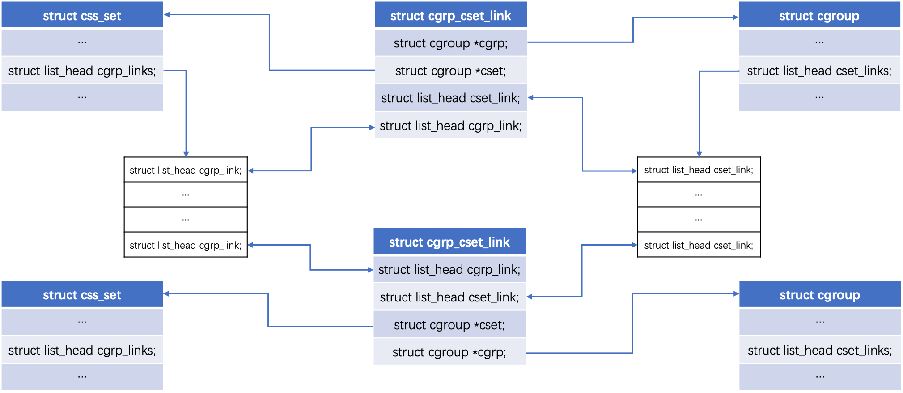
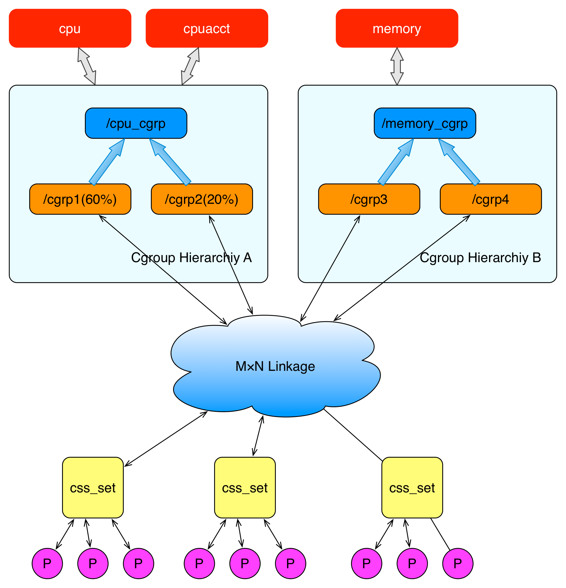
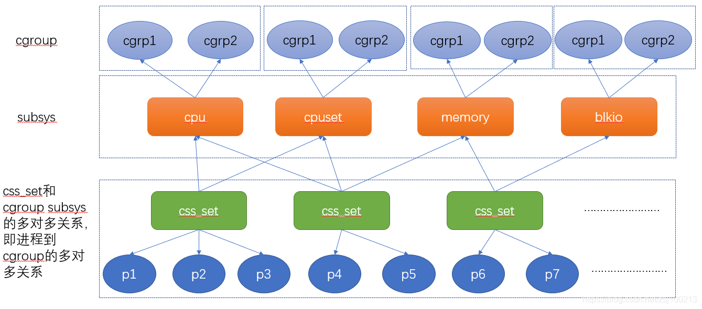
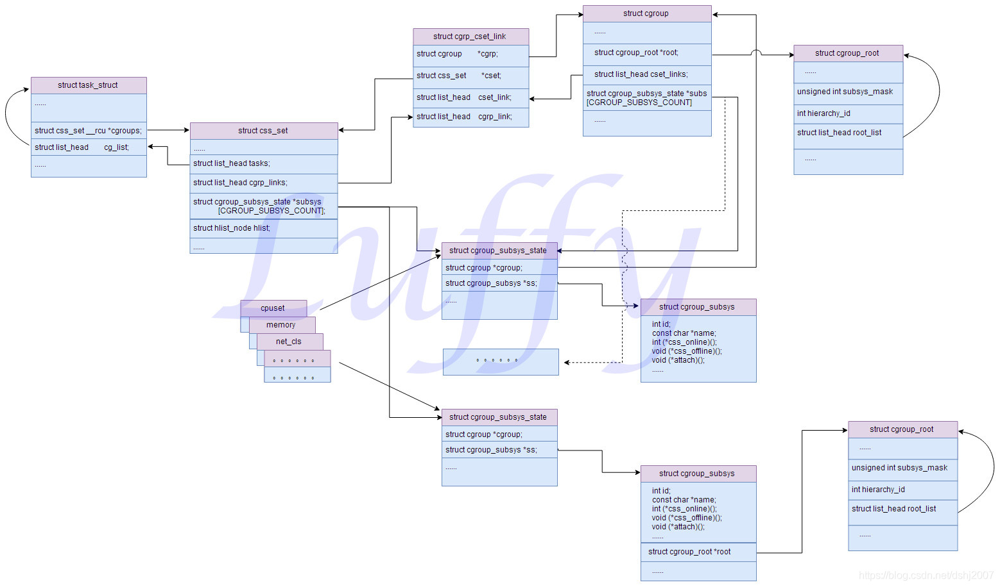

<!-- @import "[TOC]" {cmd="toc" depthFrom=1 depthTo=6 orderedList=false} -->

<!-- code_chunk_output -->

- [1. 相关数据结构](#1-相关数据结构)
  - [1.1. task_struct](#11-task_struct)
  - [1.2. css_set](#12-css_set)
    - [1.2.1. rcu 锁](#121-rcu-锁)
  - [1.3. cgroup_subsys_state](#13-cgroup_subsys_state)
  - [1.4. cgroup_subsys](#14-cgroup_subsys)
  - [1.5. cgroup](#15-cgroup)
- [2. css_set 和 cgroup](#2-css_set-和-cgroup)
  - [2.1. cgrp_cset_link](#21-cgrp_cset_link)
  - [2.2. 查找 task 的 cgroup 节点](#22-查找-task-的-cgroup-节点)
- [3. css 和 cgroup](#3-css-和-cgroup)
  - [3.1. cgroup_root](#31-cgroup_root)
- [4. 全局变量](#4-全局变量)
- [5. 整体架构](#5-整体架构)
  - [5.1. 约束](#51-约束)
- [6. 示例](#6-示例)
  - [6.1. cgroup v1](#61-cgroup-v1)
  - [6.2. cgroup v2](#62-cgroup-v2)
- [7. 参考](#7-参考)

<!-- /code_chunk_output -->

# 1. 相关数据结构

## 1.1. task_struct

首先先看进程的结构

```cpp
#ifdef CONFIG_CGROUPS
    /* Control Group info protected by css_set_lock: */
     // 设置这个进程属于哪个 css_set
    struct css_set __rcu *cgroups;
    /* cg_list protected by css_set_lock and tsk->alloc_lock: */
     //用于将所有同属于一个 css_set 的 task 连成一起
    struct list_head cg_list;
#endif
```

我们会在代码中经常见到 list_head. 它其实就是表示, 这个在链表中存在.

```cpp
struct list_head {
    struct list_head *next, *prev;
};
```

它的结构很简单, 就能把某种相同性质的结构连成一个链表, 根据这个链表就能前后找全整个链表或者头部节点等.

## 1.2. css_set

```cpp
struct css_set {
    // 包含一系列的 css, 这个就代表了 css_set 和子系统的多对多的其中一面
    // css_set 关联的所有 css(cgroup_subsys_state). css 就是子系统状态
    // 每一个 subsystem 对应数组中相应 id 的项, 每一项就表示了这个 css_set 对应的某类子系统的状态, 即资源限制等等
    struct cgroup_subsys_state *subsys[CGROUP_SUBSYS_COUNT];

    // 引用计数, gc 使用, 如果子系统有引用到这个 css_set, 则计数＋1
    refcount_t refcount;
    struct css_set *dom_cset;

    // 默认连接的 cgroup
    struct cgroup *dfl_cgrp;

    int nr_tasks;
    // 将所有的 task 连起来;
    struct list_head tasks;
    // mg_tasks 代表迁移的任务
    struct list_head mg_tasks;
    struct list_head dying_tasks;
    // 所有迭代任务的列表, 这个补丁参考: https://patchwork.kernel.org/patch/7368941/
    struct list_head task_iters;

    // 把->subsys[ssid]->cgroup->e_csets[ssid]结构展平放在这里, 提高迭代效率
    struct list_head e_cset_node[CGROUP_SUBSYS_COUNT];

    struct list_head threaded_csets;
    struct list_head threaded_csets_node;

    //列出有相同 hash 值的 cgroup
    struct hlist_node hlist;
    // 将这个 css_set 的所有 task 的所有 cgroup 链接起来
    // 由 cgrp_cset_links 组成的链表, 链表上每一项 cgrp_cset_link 都指向和 css_set 关联的 cgroup
    struct list_head cgrp_links;

    // 内存迁移的时候产生的系列数据
    struct list_head mg_preload_node;
    struct list_head mg_node;
    struct cgroup *mg_src_cgrp;
    struct cgroup *mg_dst_cgrp;
    struct css_set *mg_dst_cset;

    // 这个 css_set 是否已经无效了
    bool dead;

    /* For RCU-protected deletion */
    // rcu 锁所需要的 callback 等信息
    struct rcu_head rcu_head;
```

**task**和**cgroup**的桥梁.

`css_set` 是**各类子系统状态(资源限制等)实例！！！的一个集合**. 每个 css_set 都有一个 `cgroup_subsys_state subsys[]` 数组, 代表所有**关联到这个 css_set 的进程**对应在**每种类型资源的状态**(即在**每种子系统的资源限制**), `css_set->subsys[]->cgroup`就是**这类资源限额信息**的**节点**, 这个 cgroup 节点本质上**不是 task 所在的 cgroup！！！**, 只是多数情况下相等.

> 比如一种情况, 父进程的 `pids css >cgroup` 是 `/sys/fs/cgroup/pids/A`, 自然也是父进程的 cgroup 节点; 后面子进程 fork 的, 所以初始也是那样, echo 进子目录, 会不会出现`pids css >cgroup` 是 `/sys/fs/cgroup/pids/A`, 但是子进程 cgroup 节点是 `/sys/fs/cgroup/pids/A/B`

> 怎么通过 task 查找对应的 cgroup, 可以参见`proc_cgroup_show()`的实现.

不同 css_set 的这个数组是**不完全相同的**, 如果完全相同, 完全可以搞到一个 css_set 了; 但是可以**某个或某几个相同**.

`cgroup_subsys_state subsys[]` 应当包括**所有子系统的 css**, 而且**每种 subsystem**(cpu, devices)的**限制条件只能有一个！！！**. 如果此`css_set`**没有指定某个 subsystem 的 css**或者**subsystem 没有 mount**, 则默认初始化为根 css.

`css_set`是直接和 task 关联的结构, `css_set`用来将**进程**关联到一组`cgroup_subsys_state`对象, 也就是 `这组进程 <-> 各类子系统资源限额信息` 的关联关系.

> 注意, 上面说明的是 css_set 和 subsystem 的关联关系, 并不是 css_set 对应的进程组和 cgroup 节点的关联关系.

`css_set` 直接和**task**关联(`tasks`); 同时通过`cgrp_cset_links`(`cgrp_links`), css_set 和**所有相关的 cgroup**建立关联, 这样**多个 cgroup 节点**和**一组 task**就关联起来了; 从而达到了**限制资源**的目的(**一组进程共享指定数额的资源**). 至于 cgroup 和 css_set 关联的方式, 下面会讲到.

### 1.2.1. rcu 锁

这里说一下 rcu 锁, 这个锁是 linux2.6 引入的. 它是非常高效的, 适合读多写少的情况. 全称是(Read-Copy Update, 读－拷贝修改). 原理就是读操作的时候, 不需要任何锁, 直接进行读取, 写操作的时候, 先拷贝一个副本, 然后对副本进行修改, 最后使用回调(callback)在适当的时候将**指向原来数据的指针**指向**新的被修改的数据**. https://www.ibm.com/developerworks/cn/linux/l-rcu/

这里的`rcu_head`就存储了对这个结构上 rcu 锁所需要的回调信息.

```cpp
struct callback_head {
    struct callback_head *next;
    void (*func)(struct callback_head *head);
} __attribute__((aligned(sizeof(void *))));

#define rcu_head callback_head
```

## 1.3. cgroup_subsys_state

```cpp
// 子系统状态
struct cgroup_subsys_state {
        // 这个 css 对应的 cgroup
        // v2 下, 一个 cgroup 可以对应多个 css(因为很多种资源类型)
        // 这个 cgroup 就是这个状态所属于的 cgroup
        struct cgroup *cgroup;

        // 这个 css 对应的子系统
        struct cgroup_subsys *ss;

        // per-cpu 信息的引用计数
        struct percpu_ref refcnt;

        // 兄弟和孩子链表串
        struct list_head sibling;
        struct list_head children;

        struct list_head rstat_css_node;

        // css 的唯一 id
        int id;

        // 可设置的 flag 有: CSS_NO_REF/CSS_ONLINE/CSS_RELEASED/CSS_VISIBLE
        unsigned int flags;

        // 为了保证遍历的顺序性, 设置遍历按照这个字段的升序走
        u64 serial_nr;

        // 计数, 计算本身 css 和子 css 的活跃数, 当这个数大于 1, 说明还有有效子 css
        atomic_t online_cnt;

        // 带 cpu 信息的引用计数使用的 rcu 锁
        struct work_struct destroy_work;
        struct rcu_work destroy_rwork;

        // 父 css
        struct cgroup_subsys_state *parent;
}
```

`cgroup_subsys_state` 代表了**某一类！！！可隔离的资源(子系统)的一个状态！！！**(每一类子系统会有很多个 css 状态), 而不是整体资源.

所有的**资源限制状态**(即 css)也是通过**cgroup 节点**体现的, css 结构中的`cgroup` 就对应的是这个 cgroup 节点. 通过它, 可以将**进程组**和**特定子系统**关联起来:

* `task_struct->css_set->cgroup_subsys_state[]->ss`, 进程组所关联的子系统
* `task_struct->css_set->cgroup_subsys_state[]->cgroup`, 进程组所关联的特定子系统状态对应的 cgroup 节点, 本质上来讲, 这个不是这个 task 所在的 cgroup 节点.

## 1.4. cgroup_subsys

```cpp
// 对应特定的子系统
struct cgroup_subsys {
    // 下面的是函数指针, 定义了该子系统对 css_set 结构的系列操作
    struct cgroup_subsys_state *(*css_alloc)(struct cgroup_subsys_state *parent_css);
    int (*css_online)(struct cgroup_subsys_state *css);
    void (*css_offline)(struct cgroup_subsys_state *css);
    void (*css_released)(struct cgroup_subsys_state *css);
    void (*css_free)(struct cgroup_subsys_state *css);
    void (*css_reset)(struct cgroup_subsys_state *css);
    void (*css_rstat_flush)(struct cgroup_subsys_state *css, int cpu);
    int (*css_extra_stat_show)(struct seq_file *seq,
                struct cgroup_subsys_state *css);

    // 这些函数指针表示了该子系统对进程 task 的一系列操作
    int (*can_attach)(struct cgroup_taskset *tset);
    void (*cancel_attach)(struct cgroup_taskset *tset);
    void (*attach)(struct cgroup_taskset *tset);
    void (*post_attach)(void);
    int (*can_fork)(struct task_struct *task,
            struct css_set *cset);
    void (*cancel_fork)(struct task_struct *task, struct css_set *cset);
    void (*fork)(struct task_struct *task);
    void (*exit)(struct task_struct *task);
    void (*release)(struct task_struct *task);
    void (*bind)(struct cgroup_subsys_state *root_css);

    // 是否在前期初始化了
    bool early_init:1;

    // 如果设置了 true, 那么在 cgroup.controllers 和 cgroup.subtree_control 就不会显示
    bool implicit_on_dfl:1;

    bool threaded:1;

    // 启动阶段自动初始化
    int id;
    const char *name;

    // 如果子 cgroup 的结构继承子系统的时候没有设置 name, 就会沿用父系统的子系统名字, 所以这里存的就是父 cgroup 的子系统名字
    const char *legacy_name;

    // 这个就是子系统指向的层级中的 root 的 cgroup, 即 hierarchy
    struct cgroup_root *root;

    // 对应的 css 的 idr
    struct idr css_idr;

    // 对应的文件系统相关信息
    struct list_head cfts;
    /* 默认的文件系统 */
    struct cftype *dfl_cftypes; /* for the default hierarchy */
    /* 继承的文件系统 */
    struct cftype *legacy_cftypes;  /* for the legacy hierarchies */

    // 有的子系统是依赖其他子系统的, 这里是一个掩码来表示这个子系统依赖哪些子系统
    unsigned int depends_on;
}
```

这里特别说一下**cftype**. 它是`cgroup_filesystem_type`的缩写. 这个要从我们的**linux 虚拟文件系统**说起(`VFS`). VFS 封装了**标准文件**的**所有系统调用**. 那么我们使用 cgroup, 也抽象出了一个**文件系统**, 自然也需要实现这个 VFS. 实现这个 VFS 就是使用这个 cftype 结构.

这里说一下 idr. 这个是 linux 的**整数 id 管理机制**. 你可以把它看成**一个 map**, 这个 map 是把**id**和**指定指针**关联在一起的机制. 它的原理是使用**基数树**. **一个结构**存储了一个**idr**, 就能很方便**根据 id 找出这个 id 对应的结构的地址**了. http://blog.csdn.net/dlutbrucezhang/article/details/10103371

## 1.5. cgroup

```cpp
struct cgroup {
    // cgroup 所在的 css
    struct cgroup_subsys_state self;

    unsigned long flags;

    // 这个 cgroup 所在层级中, 当前 cgroup 的深度
    int level;

    int max_depth;

    int nr_descendants;
    int nr_dying_descendants;
    int max_descendants;

    // 每当有个非空的 css_set 和这个 cgroup 关联的时候, 就增加计数 1
    int nr_populated_csets;
    int nr_populated_domain_children;
    int nr_populated_threaded_children;

    int nr_threaded_children;

    struct kernfs_node *kn;     /* cgroup kernfs entry */
    struct cgroup_file procs_file;  /* handle for "cgroup.procs" */
    struct cgroup_file events_file; /* handle for "cgroup.events" */

    u16 subtree_control;
    u16 subtree_ss_mask;
    u16 old_subtree_control;
    u16 old_subtree_ss_mask;

    // 一个 cgroup 属于多个 css, 这里就是保存了 cgroup 和 css 直接多对多关系的另一半
    // 此 cgroup 关联 subsystem 的 css 结构, 每个 subsystem 的 css 在数组中对应 subsys[subsystem->subsys_id]
    // 为 v2 引入的, v1 情况下只会有一个项有意义
    struct cgroup_subsys_state __rcu *subsys[CGROUP_SUBSYS_COUNT];
    // cgroup 所处的 cgroupfs_root
    // 比如, v1 的/sys/fs/cgroup/pids/
    struct cgroup_root *root;
    // 这个 cgroup 关联的所有 css_set 链表
    // 由 cgrp_cset_links 组成的链表, 链表上每一项 cgrp_cset_link 都指向这个 cgroup 中 task 关联的 css_set
    struct list_head cset_links;
    // 这个 cgroup 使用的所有子系统的每个链表
    struct list_head e_csets[CGROUP_SUBSYS_COUNT];

    struct cgroup *dom_cgrp;
    struct cgroup *old_dom_cgrp;

    struct cgroup_rstat_cpu __percpu *rstat_cpu;
    struct list_head rstat_css_list;

    struct cgroup_base_stat last_bstat;
    struct cgroup_base_stat bstat;
    struct prev_cputime prev_cputime;

    struct list_head pidlists;
    struct mutex pidlist_mutex;

    /* used to wait for offlining of csses */
    // 用来保存下线 task
    wait_queue_head_t offline_waitq;

    /* used to schedule release agent */
    // 用来保存释放任务
    struct work_struct release_agent_work;

    /* used to track pressure stalls */
    struct psi_group psi;

    /* used to store eBPF programs */
    struct cgroup_bpf bpf;

    /* If there is block congestion on this cgroup. */
    atomic_t congestion_count;

    /* Used to store internal freezer state */
    struct cgroup_freezer_state freezer;

    /* ids of the ancestors at each level including self */
    // 保存每个 level 的祖先
    u64 ancestor_ids[];
};
```

cgroup 代表了**某一个子节点**, 既是**限制额设置节点**(`css->cgroup`对应, 表明**某种类型的子系统资源限制**), 又是**使用节点**(每个 cgroup 可以有**一种或多种类型资源**的**数额使用**, 即占比)

这里看到一个新的结构, `wait_queue_head_t`, 这个结构是用来将一个资源挂在等待队列中, 具体参考: http://www.cnblogs.com/lubiao/p/4858086.html

`cgroup_root`和**子节点 cgroup**是使用两个不同结构表示的.

# 2. css_set 和 cgroup

**cgroup 节点**需要和`css_set`关联起来. 这样**每个 task_struct** 就可以通过 `task_struct->cgroups`(是`css_set`)和 **css_set** 关联, 再继而和**cgroup**关联, 达到**控制和隔离资源**的目的, 那么`css_set`和`cgroup`具体是怎么关联的呢?

首先需要明确的是`cgroup`和`css_set`是**多对多**的关系, 即: **一个 css_set**可以对应**多个 cgroup**, 同时**一个 cgroup**也属于**多个 css_set**, 详细见上面.

这种多对多的映射关系, 是通过`cgrp_cset_link`这个中间结构来关联的.

## 2.1. cgrp_cset_link

```cpp
struct cgrp_cset_link {
    /* the cgroup and css_set this link associates */
    struct cgroup       *cgrp;
    struct css_set      *cset;

    /* list of cgrp_cset_links anchored at cgrp->cset_links */
    struct list_head    cset_link;

    /* list of cgrp_cset_links anchored at css_set->cgrp_links */
    struct list_head    cgrp_link;
};
```

**一个 cgrp_cset_link** 需要包含**两类信息**, 即**关联的 cgroup**和**关联的 css_set**信息, 一个 `cgrp_cset_link` 可以让**一个 cgroup**和**一个 css_set**相**关联**.

但是正如我们前面所说, `css_set`和`cgroup`是**多对多**的对应关系, 所以,
* **一个 css_set**需要保存**多个 cgrp_cset_link 信息**,
* **一个 cgroup**也需要保存**多个 cgrp_cset_link 信息**.

结构如下图所示:



如题, 具体来说,
* **一个 css_set 多个 cgroup 节点**: **css_set** 结构体中的 `cgrp_links` 维护了一个**链表**, 链表中的**每个元素**是 `struct cgrp_cset_link` 中的 `cgrp_link`, 而这个 `struct cgrp_cset_link` 中的 `cgrp` 就是该元素对应的 cgroup 节点.
* **一个 cgroup 节点多个 css_set**: **cgroup** 结构体中的 `cset_links` 也维护了一个**链表**, 链表中**每个元素**是 `struct cgrp_cset_links` 中的 `cset_link`, 而这个 `struct cgrp_cset_link` 中的 `cset_set` 就是该元素对应的 css_set.

从而不管从 cgroup 还是从 css_set 都可以进行遍历查询.

## 2.2. 查找 task 的 cgroup 节点

> 参照 `proc_cgroup_show()` 函数实现

* **一个 task** 在**同一个 hierarchy** 的**一个 subsystem 子系统**都有**且只有一个 cgroup 节点** 中.

* **一个 cgroup 节点**对应**零个**、**一个**或**多个 task**.

所以查找一个 task 的 cgroup, 要先获取 task 对应的 css_set(`task->cgroups`, 然后遍历 css_set 对应的 cgroup(`css_set->cgrp_links`), 然后如果 `cgroup->root == cgroup_root `, 那就找到了这个 task 在某个子系统下的 **cgroup 节点信息**.

cgroup_root 就是相应 subsystem 子系统的 root cgroup 节点.

# 3. css 和 cgroup

* **一个 cgroup_subsys_state 只可能对应一个 cgroup 节点**, 代表这个 css 限制信息对应的 cgroup 节点. 只能对应一个是因为不同 cgroup 节点的子系统状态(比如限制信息)可以不同且可修改.

* **一个 cgroup 节点**可以对应**多个** `cgroup_subsys_state`, 因为一个 cgroup 节点在每种子系统都可以有相应的状态:

  * 在 v1 下, 一个 **cgroup** 节点**只会**有**一个对应的 css**, 因为所有的**cgroup 节点**都是在**某一个子系统目录**下, 而不会存在属于多个子系统;

  * 而 v2 下, 一个 **cgroup** 节点会对应**多个 css**, 因为一个 cgroup 节点下会有很多种资源类型.

## 3.1. cgroup_root

还有一个结构是 cgroup_root

```cpp
struct cgroup_root {
    struct kernfs_root *kf_root;

    /* The bitmask of subsystems attached to this hierarchy */
    // 挂载到这个 hierarchy 的子系统掩码
    unsigned int subsys_mask;

    /* Unique id for this hierarchy. */
    // 层级的 id
    int hierarchy_id;

    /* The root cgroup.  Root is destroyed on its release. */
    // // 根部的 cgroup, 这里面就有下级 cgroup
    struct cgroup cgrp;

    /* for cgrp->ancestor_ids[0] */
    // 相等于 cgrp->ancestor_ids[0]
    u64 cgrp_ancestor_id_storage;

    /* Number of cgroups in the hierarchy, used only for /proc/cgroups */
    // 这个 root 层级下的 cgroup 数, 初始化的时候为 1
    atomic_t nr_cgrps;

    /* A list running through the active hierarchies */
    // 串起所有的 cgroup_root
    struct list_head root_list;

    /* Hierarchy-specific flags */
    unsigned int flags;

    /* The path to use for release notifications. */
    char release_agent_path[PATH_MAX];

    /* The name for this hierarchy - may be empty */
    // 这个层级的名称, 有可能为空
    char name[MAX_CGROUP_ROOT_NAMELEN];
};
```

# 4. 全局变量

此外, 还有几个 cgroup 相关的全局变量

```cpp
// 默认 hierarchy
struct cgroup_root cgrp_dfl_root = { .cgrp.rstat_cpu = &cgrp_dfl_root_rstat_cpu };
EXPORT_SYMBOL_GPL(cgrp_dfl_root);

/* The default css_set - used by init and its children prior to any
 * hierarchies being mounted. It contains a pointer to the root state
 * for each subsystem. Also used to anchor the list of css_sets. Not
 * reference-counted, to improve performance when child cgroups
 * haven't been created.
 *
 * 初始化默认的 css_set. 在没有 hierarchy 被 mount 之前, 系统初始化时 init 及其子进程关联此 css_set.
 * init_css_set->subsys 指向每个 subsys 的 root css.
 */
struct css_set init_css_set = {
        .refcount               = REFCOUNT_INIT(1),
        .dom_cset               = &init_css_set,
        .tasks                  = LIST_HEAD_INIT(init_css_set.tasks),
        .mg_tasks               = LIST_HEAD_INIT(init_css_set.mg_tasks),
        .dying_tasks            = LIST_HEAD_INIT(init_css_set.dying_tasks),
        .task_iters             = LIST_HEAD_INIT(init_css_set.task_iters),
        .threaded_csets         = LIST_HEAD_INIT(init_css_set.threaded_csets),
        .cgrp_links             = LIST_HEAD_INIT(init_css_set.cgrp_links),
        .mg_preload_node        = LIST_HEAD_INIT(init_css_set.mg_preload_node),
        .mg_node                = LIST_HEAD_INIT(init_css_set.mg_node),

        /*
         * The following field is re-initialized when this cset gets linked
         * in cgroup_init().  However, let's initialize the field
         * statically too so that the default cgroup can be accessed safely
         * early during boot.
         */
        .dfl_cgrp               = &cgrp_dfl_root.cgrp,
};

/*
 * hash table for cgroup groups. This improves the performance to find
 * an existing css_set. This hash doesn't (currently) take into
 * account cgroups in empty hierarchies.
 *
 * css_set 的 hash table.将 task 关联到指定 css, 就是将 task->cgroup 指针指向一个
 * css_set. css_set_table 以 css[]为 key, 相同的 css 集合, 即为同一个 css_set.
 * 当有 task 需要关联到到一组 css 时, 以 css[]为 key 在 hash table 中查找是否存在,
 * 存在直接引用此 key 的 css_set, 否则创建 css_set 并添加到 hash table.
 *
#define CSS_SET_HASH_BITS    7
static DEFINE_HASHTABLE(css_set_table, CSS_SET_HASH_BITS);
```

# 5. 整体架构







按照资源的划分, 系统被划分成了**不同的子系统**(subsystem), 正如我们上面列出的 cpu, cpuset, blkio...每种资源独立构成一个 subsystem.

可以将 cgroup 的架构抽象的理解为**多根**的树结构, 一个 hierarchy 代表**一棵树**, 树**绑定一个或多个 subsystem**. 而**树的叶子或中间节点**则是**cgroup**, **一个 cgroup**具体的限制了**某种或某几种资源**. 一个或多个 cgroup 组成一个 css_set.

整体来讲,

最终目的: **一组进程**使用**一组资源**, **进程**和**资源**是多对多

1. **一个 task**对应了**唯一的 ccs_set**, 但是**一个 ccs_set**可以对应**多个 task**. **多个** `task_struct` 指向一个 `css_set`, 表示**这些 task 都属于一个组**, 即**属于这一个 css_set**;

* `task->cgroups` 就是进程所属的 css_set
* `css_set->tasks`是一个链表的头指针, 该链表包含了所有**同一 css_set**下的所有 task 进程.

2. 一个**资源限制集合**(`css_set`)是**task**和**cgroup**的桥梁.

* `css_set->subsys[]` 就是这个**资源限制集合**(`css_set`)在**各种类型资源的限制**, `css_set->subsys[]->cgroup` 是**某种类型资源限制**所对应的**cgroup 节点**; **每个**都代表所有**关联到这个 css_set 的进程** 在**相应子系统的状态**.

> `task_struct->css_set->cgroup_subsys_state[CGROUP_SUBSYS_COUNT]->cgroup`

3. **多个** `cgroup` 节点同**多个** `css_set` 关联起来, 通过 `cgrp_cset_link` 连接起来;

4. 从而达到**限制资源**的目的.

## 5.1. 约束

1. 一个 hierarchy 上可以绑定一个或者多个 subsystem.

2. **一个 subsystem** 只能附加到**一个 hierarchy** 上

3. 创建一个 hierarchy 的时候, 系统所有 css_set 都会和此 hierarchy 的 root cgroup 关联. 也就相当于所有的 task 都和 root cgroup 关联. 但是在同一个 hierarchy 中, 一个 css_set 只能和一个 cgroup 关联.

4. fork 子进程的时候父子进程在同一个 cgroup. 但是后续可以修改.

5. **一个 task 不能**存在于**同一个 hierarchy** 的**同一个 subsystem**的**不同 cgroup** 中, 但是**一个 task** 可以存在在**不同 hierarchy** 中的**多个 cgroup** 中.

# 6. 示例

在挂载的目录下, mkdir 可创建新的 cgroup, rmdir 可删除 cgroup(不能直接 rm).

在 v1 中, 一个 cgroup 对应的就是某一个 controller 的实例, 而 v2 下就不是了.

> 感觉 css 是某一类 controller 的实例.

* v1 cgroup: `/sys/fs/cgroup/${controller}/${cgroup}`, 比如`/sys/fs/cgroup/pids/${cgroup}`, `/sys/fs/cgroup/memory/${cgroup}`
* v2 cgroup: `根/${cgroup}/${cgroup}`, 而 `cgroup.controllers` 表明可用的 controller, 也就是说一个目录下面的 cgroup 节点会对应多个 controller 实例的.

可以看到,

* v1 中, 一个 cgroup **只会**对应一个 controller 实例(css), 而一个 controller 实例(css)会对应多个 cgroup(一层目录对应一个 controller 实例, 在这个目录下创建的节点都是这个 css 对应的 cgroup);

* v2 中, 一个 cgroup 可以对应多个 controller 实例(css), 而一个 controller(css)实例也会对应多个 cgroup

## 6.1. cgroup v1

```
某个进程的所有 cgroup 信息
# cat /proc/2904586/cgroup
12:memory:/kubepods/burstable/pod6f66b36b-6505-11eb-8aad-5254001e103d/834eda17136a44ae92ea3e26df7f4c6a56a09c130bf773a3e4dd9f0484c52b18
11:devices:/kubepods/burstable/pod6f66b36b-6505-11eb-8aad-5254001e103d/834eda17136a44ae92ea3e26df7f4c6a56a09c130bf773a3e4dd9f0484c52b18
10:net_cls:/kubepods/burstable/pod6f66b36b-6505-11eb-8aad-5254001e103d/834eda17136a44ae92ea3e26df7f4c6a56a09c130bf773a3e4dd9f0484c52b18
9:hugetlb:/kubepods/burstable/pod6f66b36b-6505-11eb-8aad-5254001e103d/834eda17136a44ae92ea3e26df7f4c6a56a09c130bf773a3e4dd9f0484c52b18
8:cpuset:/kubepods/burstable/pod6f66b36b-6505-11eb-8aad-5254001e103d/834eda17136a44ae92ea3e26df7f4c6a56a09c130bf773a3e4dd9f0484c52b18
7:blkio:/kubepods/burstable/pod6f66b36b-6505-11eb-8aad-5254001e103d/834eda17136a44ae92ea3e26df7f4c6a56a09c130bf773a3e4dd9f0484c52b18
6:perf_event:/kubepods/burstable/pod6f66b36b-6505-11eb-8aad-5254001e103d/834eda17136a44ae92ea3e26df7f4c6a56a09c130bf773a3e4dd9f0484c52b18
5:oom:/
4:freezer:/kubepods/burstable/pod6f66b36b-6505-11eb-8aad-5254001e103d/834eda17136a44ae92ea3e26df7f4c6a56a09c130bf773a3e4dd9f0484c52b18
3:pids:/kubepods/burstable/pod6f66b36b-6505-11eb-8aad-5254001e103d/834eda17136a44ae92ea3e26df7f4c6a56a09c130bf773a3e4dd9f0484c52b18
2:cpuacct,cpu:/kubepods/burstable/pod6f66b36b-6505-11eb-8aad-5254001e103d/834eda17136a44ae92ea3e26df7f4c6a56a09c130bf773a3e4dd9f0484c52b18
1:name=systemd:/kubepods/burstable/pod6f66b36b-6505-11eb-8aad-5254001e103d/834eda17136a44ae92ea3e26df7f4c6a56a09c130bf773a3e4dd9f0484c52b18
```

**task** 针对**每个子系统**都有**一个 cgroup 节点**对应.

```
// 查看这个进程在 pids 子系统下对应的 cgroup 节点
# cd /sys/fs/cgroup/pids
# ls kubepods/burstable/pod6f66b36b-6505-11eb-8aad-5254001e103d/834eda17136a44ae92ea3e26df7f4c6a56a09c130bf773a3e4dd9f0484c52b18
cgroup.clone_children  cgroup.event_control  cgroup.procs  notify_on_release  pids.current  pids.max  tasks
# cat kubepods/burstable/pod6f66b36b-6505-11eb-8aad-5254001e103d/834eda17136a44ae92ea3e26df7f4c6a56a09c130bf773a3e4dd9f0484c52b18/tasks | grep 2904586
2904586

// 相同 cgroup 节点也属于其他 task
# cat /sys/fs/cgroup/pids/kubepods/burstable/pod6f66b36b-6505-11eb-8aad-5254001e103d/834eda17136a44ae92ea3e26df7f4c6a56a09c130bf773a3e4dd9f0484c52b18/tasks | grep 2907291
2907291
# cat /proc/2907291/cgroup | grep pids
3:pids:/kubepods/burstable/pod6f66b36b-6505-11eb-8aad-5254001e103d/834eda17136a44ae92ea3e26df7f4c6a56a09c130bf773a3e4dd9f0484c52b18
```

* **一个 task** 在**同一个 hierarchy** 的**一个 subsystem 子系统**都有**且只有一个 cgroup 节点** 中.

* **一个 cgroup 节点**对应**零个**、**一个**或**多个 task**.

接下来查看这个进程具体信息

```
// 查看 2904586 进程信息
crash> ps 2904586
  ......
   PID    PPID  CPU       TASK        ST  %MEM     VSZ    RSS  COMM
  2904586  2904548   0  ffff8807ae1f19d0  IN   0.0    9708    300  tail

// 查看这个进程的 css_set 信息
crash> task_struct.cgroups ffff8807ae1f19d0
  cgroups = 0xffff8800885e35c0
crash> css_set 0xffff8800885e35c0
struct css_set {
  ......
  // 这个 css_set 所有的 cgroup
  cg_links = {
    next = 0xffff881d0c9c7d58,
    prev = 0xffff880944b86218
  },
  // 这是这个进程组对应的资源限制 css, 每种类型一个
  subsys = {0xffff88011a8b7800, 0xffff880fe27b8400, 0xffff880159f3a400, 0xffff8800b1e99000, 0xffff880159f3a900, 0xffff881cfec45900, 0xffff881cfec45360, 0xffff880505225800, 0xffff881cfec45a80, 0xffff880d7c619080, 0xffff8825ef869720, 0xffff882f061f32a0, 0x0},
  ......
}

// 查看 2907291 进程信息
crash> ps 2907291
   PID    PPID  CPU       TASK        ST  %MEM     VSZ    RSS  COMM
  2907291  2904586  60  ffff88009c8b8000  IN   0.0 1616548  98692  atta_agent

// 查看这个进程的 css_set 信息, 一样的 css_set
crash> task_struct.cgroups ffff88009c8b8000
  cgroups = 0xffff8800885e35c0
```

以 pid cgroup 为例查看

```
// 查看进程对应的 pids css
crash> cgroup_subsys_state 0xffff8825ef869720
struct cgroup_subsys_state {
  // 得到对应的 cgroup 信息
  cgroup = 0xffff880a48112a00,
  refcnt = {
    counter = 1
  },
  flags = 2,
  id = 0x0,
  dput_work = {
    data = {
      counter = 68719476704
    },
    entry = {
      next = 0xffff8825ef869748,
      prev = 0xffff8825ef869748
    },
    func = 0xffffffff810c2c30 <css_dput_fn>
  }
}

// 查看 cgroup 信息
crash> cgroup 0xffff880a48112a00
struct cgroup {
  ......
  parent = 0xffff880453448c00,
  dentry = 0xffff88028f306960,
  name = 0xffff8825ef869ae0,
  // 可以看到 v1 中一个 cgroup 只会对应一个有效 css
  subsys = {0x0, 0x0, 0x0, 0x0, 0x0, 0x0, 0x0, 0x0, 0x0, 0x0, 0xffff8825ef869720, 0x0, 0x0},
  root = 0xffff882ef954c000,
```

可以看到,

1. 一个 css 有一个对应的 cgroup
2. 在 v1 中, 一个 **cgroup** 节点**只会**有**一个对应的 css**

```
// 查看 dentry 信息
crash> dentry 0xffff88028f306960
struct dentry {
  ......
  d_inode = 0xffff880fd70415e0,
  ......
}

//查看 inode 信息
crash> inode 0xffff880fd70415e0
struct inode {
  ......
  i_ino = 1605411280,
  ......
}

// 对比查看刚才 proc 中记录的 cgroup 节点的 inode 信息
# stat /sys/fs/cgroup/pids/kubepods/burstable/pod6f66b36b-6505-11eb-8aad-5254001e103d/834eda17136a44ae92ea3e26df7f4c6a56a09c130bf773a3e4dd9f0484c52b18
  File: '/sys/fs/cgroup/pids/kubepods/burstable/pod6f66b36b-6505-11eb-8aad-5254001e103d/834eda17136a44ae92ea3e26df7f4c6a56a09c130bf773a3e4dd9f0484c52b18'
  Size: 0         	Blocks: 0          IO Block: 4096   directory
Device: 15h/21d	Inode: 1605411280  Links: 2
Access: (0755/drwxr-xr-x)  Uid: (    0/    root)   Gid: (    0/    root)
Access: 2021-05-29 17:31:26.000000000 +0800
Modify: 2021-02-02 11:21:51.572672933 +0800
Change: 2021-02-02 11:21:51.572672933 +0800
 Birth: -
```


## 6.2. cgroup v2

```
某个进程的所有 cgroup 信息
# cat /proc/1005522/cgroup

```

# 7. 参考

https://www.cnblogs.com/muahao/p/10280998.html (ing)

https://tech.meituan.com/2015/03/31/cgroups.html (none)

http://files.cnblogs.com/files/lisperl/cgroups 介绍.pdf

http://tech.meituan.com/cgroups.html

http://coolshell.cn/articles/17049.html
