http://blog.chinaunix.net/uid-23069658-id-3959636.html

今天我也来谈一下 Linux 环境下开发时经常遇到的"Segmetation fault"的一点点个人看法, 也算是抛砖引玉了.

(备注: 我的 glibc 版本是 2.12, GCC 版本 4.4.6, 内核版本 2.6.32-279)

Linux 上开发时最恼火的就是遇到"Segmetation Fault"错误. 为什么这么说, 很多人看到这个错误后心里第一反应是程序访问的**非法的内存, 导致其被操作系统强行终止**. 这固然没错, 可这里有个比较模糊的概念了: 什么叫"非法"的内存?

程序运行时, 每个进程都有自己的虚拟地址, 理论上说进程应该可以随便使用才对, 为什么还会出现这个错误呢?这里就涉及到程序的装载过程及原理.

先澄清几个概念:

**程序**: 一般是一组 CPU 指令的集合构成的文件, 静态存储在诸如**硬盘之类的存储设备**上.

**进程**: 当一个程序要被计算机运行时, 就是在内存中产生该程序的一个**运行时实例**, 我们就把这个实例叫做进程.

**装载**: 上述从**硬盘**上的静态"程序"到**内存**中动态的"进程"之间的转变过程就叫做装载. 往通俗里讲, 就是启动一个进程.

本文的主要目的是在简单了解进程的内存布局的情况下, 从装载的过程入手, 深入了解一下 Segmetation Fault 在操作系统层面是如何产生的, 以及程序开发过程中应该如何避免这样的错误.

众所周知**Linux 中可执行文件的格式是 ELF, 其实编译过程中的中间文件\*.o 文件、动态共享库\*.so 文件也是 ELF 格式的**. 在链接器看来, 当它通过\*.o 或者配合\*.so 文件来生成可执行文件时, 它对 ELF 格式的文件以**链接视图(Linking View)**进行看待. 也就是说**链接器以 Section 的形式来对待和处理 ELF 文件**, 诸如我们常见说的代码段(.text)、数据段(.data 和.bss)等待概念. 当程序最终需要被装载成进程时, 装载器就出场了, 装载器将可执行文件以**装载视图(Executive View)**进行看待. **装载器将以 Segment 的形式来处理 ELF 文件**. 网上很多教程也是这样说的, 大家可能还是理解的不是很明白, 后面我们通过实例的方式将进一步向大家来澄清这两者的区别.

既然\*.o、\*.so 和可执行文件都是 ELF 格式, 那么链接器和装载器是如何区分它们的呢?

看一个简单的例子:

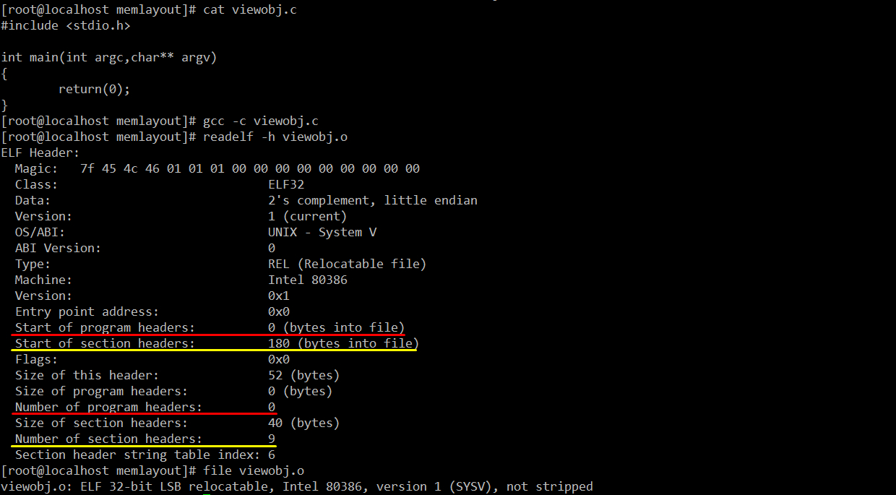

readelf –h 命令能够可以查看一个 EFL 文件的头部信息. 因为 viewobj.o 是**编译时的中间临时文件**, 所以它的"Start of pgrogram headers"和"Number of program headers"都为 0, 说明他不是一个可执行文件. 取而代之的是它有 9 个 section, 所以它有"Start of section headers"和"Number of section headers"都有数据.

再看一下动态共享库:

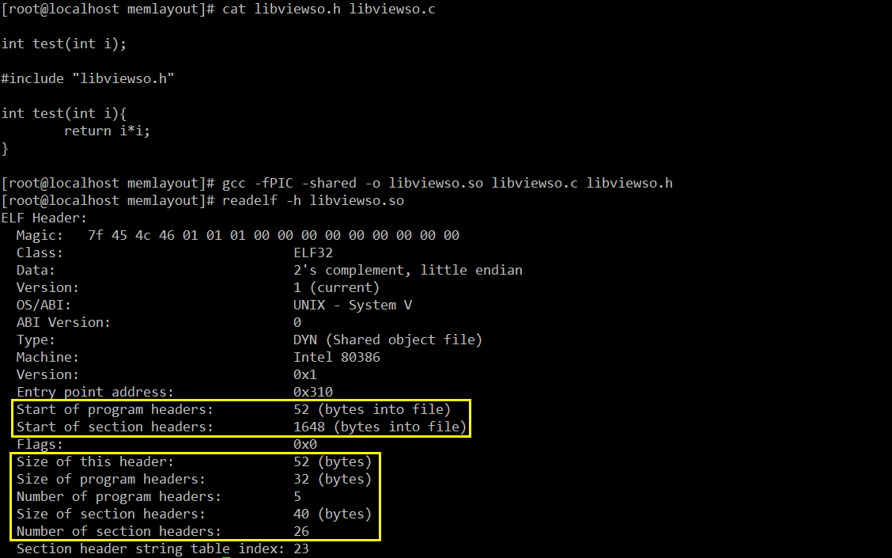

在 Linux 下动态共享库被当作可执行文件来处理, 虽然它不能单独执行, 但某些应用程序的运行离不了它.

最后是可执行文件, 这个就不用多说了, 看图:

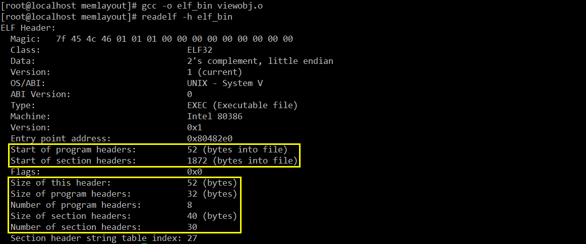

所以, 我们可以得到这样一个结论: 一个具体的 ELF 文件, 其文件头部中的某些属性值, 指明了它到底是可执行文件还是可重定位文件(\*o 和\*.so 的统称). 这样, 链接器和装载器通过分析 ELF 文件头部就可以知道它该怎么处理该文件了. 用比较直观的、方便理解的图来表示它们的区别就是:

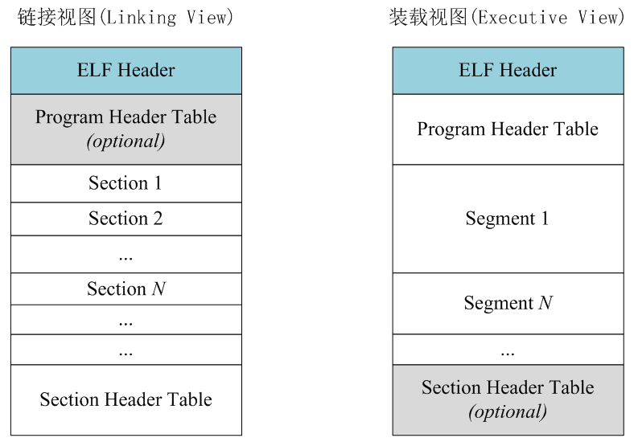

也就是说链接的时候 Program Header Table 是可选的, 但 Section Header Table 是必须有的. 例如\*.o 就没有 Program Header Table, 而\*.so 就有. 装载的时候 Program Header Table 必须有, 但 Section Header Table 是可选的, 但即使有 Section Header Table, 装载器也不会鸟它.

那么, 装载器为什么要采取和链接器不同的处理策略呢?最主要的原因是为了提高内存的利用率. 现代操作系统在装载程序时都充分利用程序的局部性原理, 那就是, 当进程运行时, 并不需要一下子将程序的所有代码和数据都装载到内存里, 而是先装载程序的一部分到内存里运行. 当进程将要执行的指令不在内存里的话, CPU 便会触发一个缺页异常, 操作系统捕获到这样的异常后便接管进程, 然后将需要的指令"弄"到内存里, 再将执行权限还给进程.

进程运行的时候, 它虚拟地址空间的布局和它所占用的物理内存到底是什么样子呢?虚拟地址空间我们还比较好理解, 可实际物理地址并不是我们能直接访问到的. 一般是通过一个集成在 CPU 内部的叫做 MMU 的内存管理单元完成了从进程虚拟地址到物理地址之间的映射. 对这个映射过程感兴趣的童鞋可以去拜读 Bean_lee 兄的"[Linux 从虚拟地址到物理地址](http://blog.chinaunix.net/uid-24774106-id-3427836.html)"文章, 那是相当之精彩. OK, 回到我们的话题上来. 既然进程虚拟地址空间的任何地址, 在使用前都必须通过 MMU 将其映射到物理内存上一个实实在在的存储单元上. 那么**对于任何没有经过 MMU 映射过的虚拟空间的地址**, 不管进程是执行写操作还是读操作, 操作系统都会捕捉到这个错误的非法访问, 然后输出一个"Segmetation Fault"的错误提示信息并强行终止进程.

换句话说, 一个进程虚拟空间里的任何地址, 在进程访问它之前必须要经过 MMU 转换, 将它映射到物理内存的某个具体的存储位置上才是合法有效的, 不然操作系统就会用"Segmetation Fault"对你的进程进行宣判, 然后将其 kill 掉. 那么, 问题又来了, 到底哪些地址才是合法有效的呢?看一个简单的进程**虚拟地址空间**的布局:

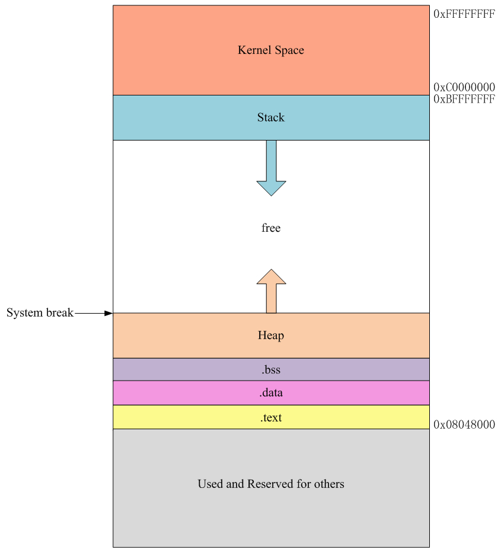

上图是很多资料上说的 Linux 进程虚拟地址空间的布局结构图, 其中 0x0804800 为进程运行时的地址入口. 注意, 这里的入口地址是指你的程序的第一条指令的入口地址, 但是当进程运行时, 进程环境空间的初始化工作, 包括建立程序虚拟地址空间和物理内存的映射、加载动态库等等操作都已经完成了. 当所有准备工作就绪之后才会跳到这个地址执行我们程序里的第一条指令. **这个 0x0804800 一般由链接器在生成可执行文件时就已经固定了, 通常无需我们来更改**. 如果你对链接的过程和原理了如指掌, 那么你肯定也知道如何修改它了. 上图中, **当用户的程序直接访问 0x084800 以前的地址、0xC0000000 以后的地址或者 free 空间里的地址(虚拟地址)都会触发"Segmetation Fault"**. 原因如下:

1、0x084800 以前的地址、0xC0000000 以后的地址: 由于权限的问题, 不允许进程直接访问, 操作系统对其进行保护. 所以用户进程如何访问它们的话就会触发"Segmetation Fault"的错误. 前面几篇博文有如何访问 0xC0000000 以后地址的博文, 也就是用户空间和内核空间的通信问题.

2、free 地址段的空间就是前面说的, 由于没有经过 MMU 将其映射到物理内存的实际存储单元上, 当程序访问 System break(也就是常说的 brk)之后的地址就出引发段错误. **brk 一般是进程堆空间结束的地方**. 那么, 我们如何知道当前进程的 brk 在什么地方呢?答案就是通过一个 C 库函数 sbrk()来获取. 另外还有一个系统调用 brk()用来设置 System break 的位置, 其实 sbrk()也可以设置, 它只不是对 brk()系统调用的一个封装而已. 关于这两个函数的更多用法可以参考 man 手册.

为了不影响我们的测试效果, 我们需要将内核的随机地址保护模式关掉. 为了方式溢出攻击, 现代很多操作系统都做了这样的随机地址保护. 就是, 当程序运行时, 代码段、堆栈段的装载起始地址并不是固定不变的, 而是每次运行进程时都会加上一个随机的偏移量, 这会影响我们的测试效果. 关闭它的方法很简单:

```
[root@localhost ~]#echo "0" > /proc/sys/kernel/randomize_va_space
```

如果/proc/sys/kernel/randomize\_va\_space 为 0 则表示, 进程每次启动运行时, 其虚拟地址空间里的值就是它在 ELF 文件里所指定的值; 如果为 1, 则每次启动时只有栈的装载地址做随机保护; 如果为 2, 表示进程每次启动时, 进程的装载地址、brk 和堆栈地址都会随机变化. 看个例子, 这是网上流传比较多的一段代码, 很具有代表性, 这里我又站在前人的肩膀上了:

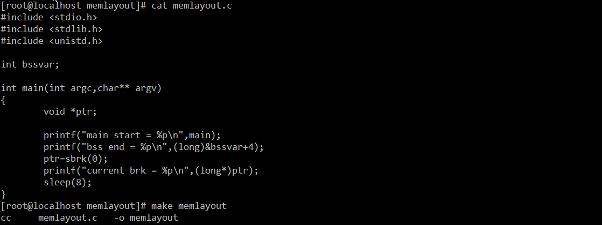

由于全局变量 bssvar 未初始化, 所以当程序运行时它会被放置在.bss 段, 占 4 字节. sbrk(0)会返回当前 brk 的值. 为了便于观察, 我们用了 sleep(8). 下面用 readelf 看一下可执行文件被装载时, Segement 的情况将会是什么样子:

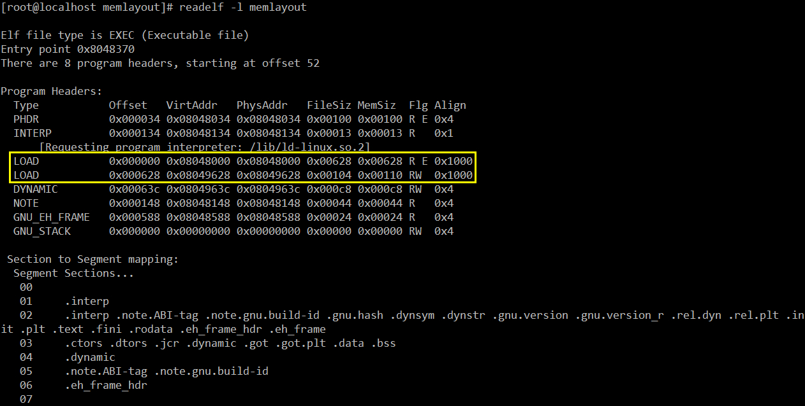

另一方面, 内存分配时是以页为单位, 一般页大小为 4096 字节, 所以从 0x08048000 开始是代码段, 共占内存 0x00628, 即 1576 个字节, 不足一个页, 但必须以页为单位, 所以下一个页, 也就是数据页必须从 0x0804900 开始. 但上面显示却说数据页从 0x08049628 开始, 但注意最后一列 Allign, 指明了对其方式, 正好是 4096 字节. 验证一下:

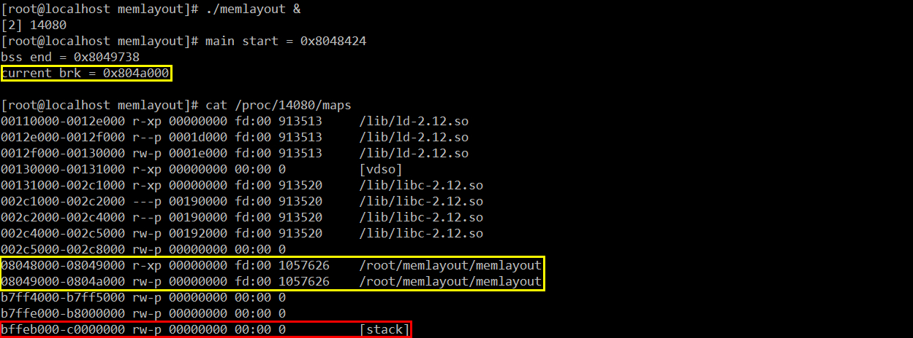

这里我们看到操作系统确实是以页(4096 字节)为单位进行内存分配. 有些人可能觉得奇怪, 既然 stack 都已经有了, 为什么没有 heap 呢?原因是, 默认情况, .bss 段结束地址就是 heap 的开始地址. 当源代码中没有诸如 malloc()之类的动态内存分配函数时, 在查看进程的内存映射时是看不到 heap 的. 此时的进程空间的布局应该如下:

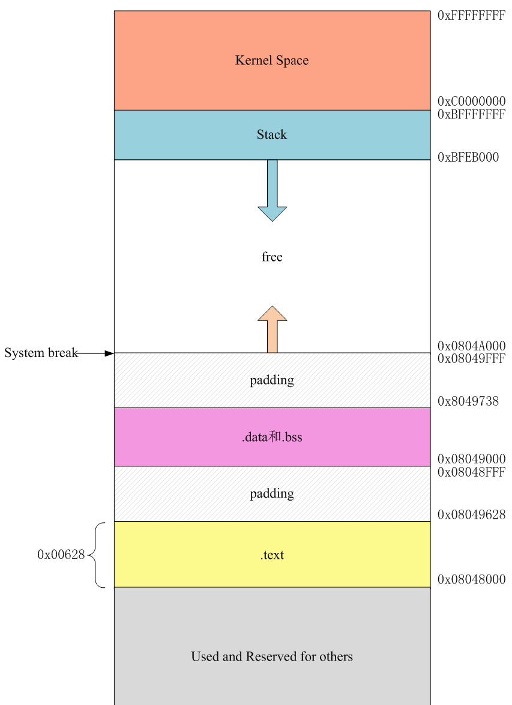

我们可以知道, 当程序访问 0x0848000~0x0849FFF 之间的所有数据都是 OK 的, 当访问到 0x084A000 及其之后的地址就会报"Segmetation Fault", 因为我们的 brk 刚好到这里. 不信??好吧, 把上面程序简单调整一下:

```
#include <stdio.h>
#include <stdlib.h>
#include <unistd.h>

int bssvar;

int main(int argc,char** argv)
{
        void *ptr;

        printf("main start = %p\n",main);
        printf("bss end = %p\n",(long)&bssvar+4);
        ptr=sbrk(0);
        printf("current brk = %p\n",(long*)ptr);
        sleep(8);

        int i=0x08049628;
        for(;;i++)
                printf("At:0x%x-0x%x\n",i,*((char*)i));
}
```

重新编译运行 memlayout, 最后出现"Segmetation Fault"时应该是下面这个样子:

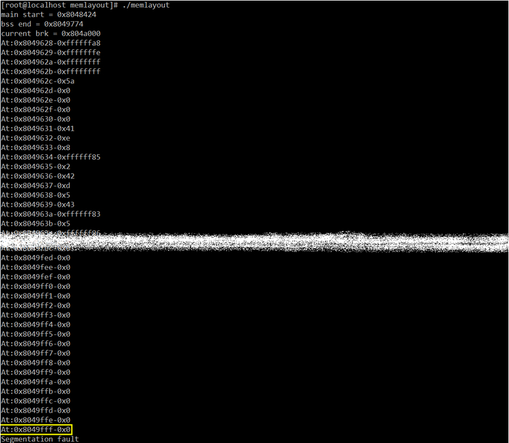

当你的源代码中有用到诸如 malloc()之类的动态内存申请函数时, brk 的值会被相应的往高端内存的位置进行调整, 这样调整出来的一段内存就被所谓的内存管理器, 也就是著名的 buddy system 纳入管理范围了. 这样当我们再访问这些地址时, 就不会报"Segmetation Fault"了. 其实如果你看过 Glibc 源码你就会惊奇的发现, malloc()最终也是通过调用 brk()系统掉用来实现堆的管理. 所以, 如果我们把上述代码再做一下简单修改:

```
#include <stdio.h>
#include <stdlib.h>
#include <unistd.h>

int bssvar;

int main(int argc,char** argv)
{
        void *ptr;

        printf("main start = %p\n",main);
        printf("bss end = %p\n",(long)&bssvar+4);
        ptr=sbrk(0);
        printf("current brk = %p\n",(long*)ptr);
        sleep(8);
        int i=0x08049628;
        brk((char*)0x804A123); //注意这行代码
        for(;;i++)
                printf("At:0x%x-0x%x\n",i,*((char*)i));
}
```

我们用 brk()系统调用, 手动把 brk 调整到 0x804A123 处, 再编译运行, 你就会得到下面这样的结果:

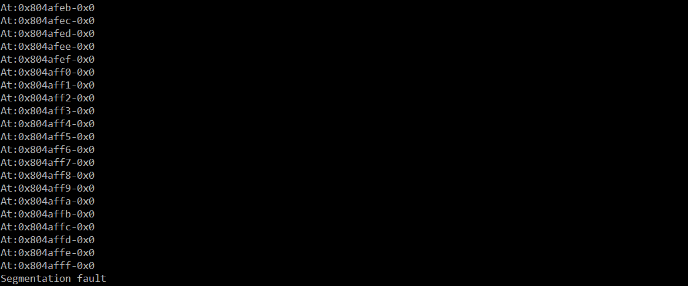

至于是为什么不在 0x804A123 处报"Segmetation Fault"而是要跑到 0x804B000 处才报, 原因已经不止一次的强调了, 脑袋犯迷糊的童鞋还是从头再认真看一遍吧.

又到了该总结的时候了, 可能有些童鞋都忘了这篇博文是要讨论什么话题了:

程序之所以会时不时的出现"Segmetation Fault"的根本原因是进程访问到了没有访问权限的地方, 诸如内核区域或者其 0x08048000 之前的地方, 或者由于要访问的内存没有经 MMU 进行映射所导致. 而这种问题比较多的是出在 malloc()之类的动态内存申请函数申请完内存, 释放后, 没有将指针设置为 NULL, 而其他地方在继续用先前申请的那块内存时, 由于内存管理系统已经将其收回, 所以才会出现这样的问题. 良好的关于指针的使用习惯是, 使用之前先判断其是否为 NULL, 所有已经归还给操作系统的内存, 其访问指针都要及时置为 NULL, 防止所谓的"野指针"到处飞的情况, 不然在大型项目里, 光是围剿"Segmetation Fault"就要耗费不少兵力.