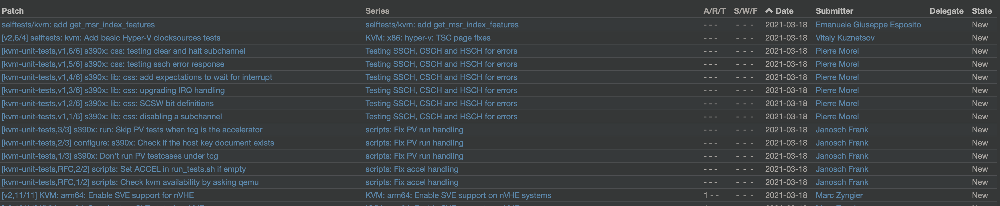
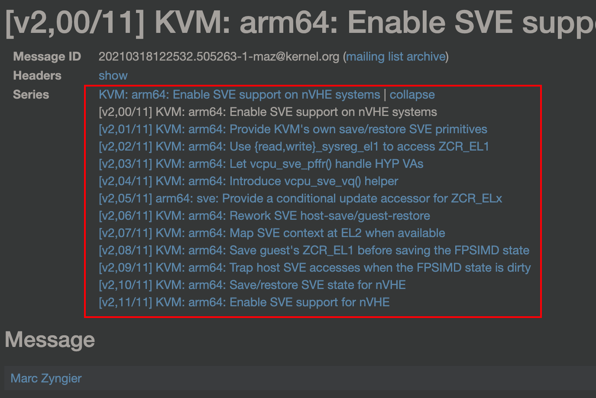
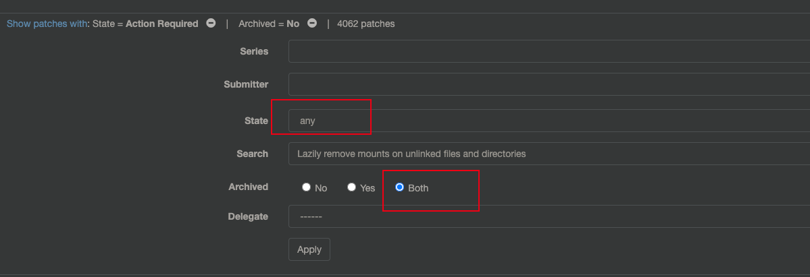
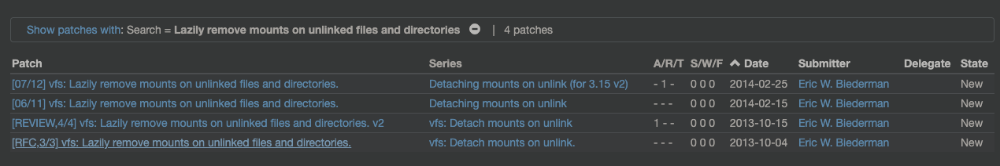
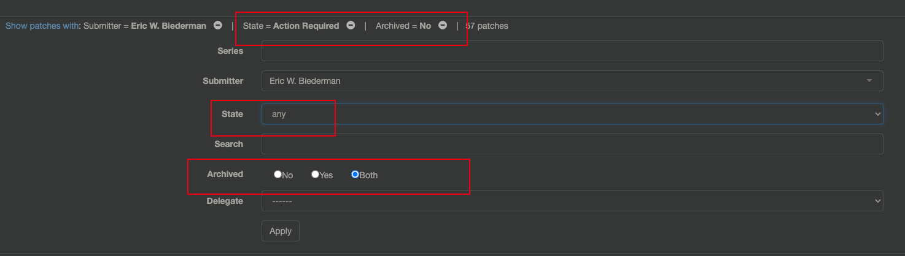
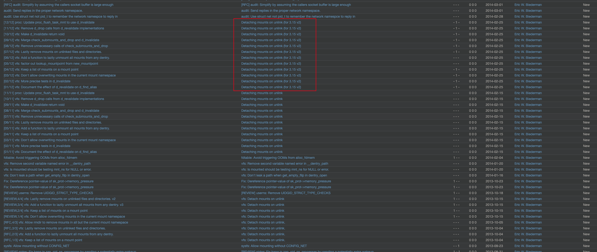

<!-- @import "[TOC]" {cmd="toc" depthFrom=1 depthTo=6 orderedList=false} -->

<!-- code_chunk_output -->

- [1. LKML](#1-lkml)
- [2. 怎么订阅](#2-怎么订阅)
- [3. 归档的邮件列表](#3-归档的邮件列表)
  - [3.1. patchwork.kernel](#31-patchworkkernel)
  - [3.2. spinics](#32-spinics)
  - [3.3. lore.kernel](#33-lorekernel)
  - [3.4. ozlabs](#34-ozlabs)
  - [3.5. mail-archive](#35-mail-archive)
  - [3.6. lkml](#36-lkml)
- [4. 使用方法](#4-使用方法)
  - [4.1. 使用](#41-使用)
    - [4.1.1. mailist 更新](#411-mailist-更新)
    - [4.1.2. patchset 阅读](#412-patchset-阅读)
    - [4.1.3. 搜索功能](#413-搜索功能)
  - [4.2. 示例](#42-示例)

<!-- /code_chunk_output -->

# 1. LKML

内核社区的中心是内核邮件列表(Linux Kernel Mailing List, LKML), 我们可以在

* http://vger.kernel.org/vger-lists.html
* https://lore.kernel.org/lists.html
* https://patchwork.kernel.org

看到订阅这个邮件列表的细节.

# 2. 怎么订阅

下面网址为 LKML 的主要列表:

http://vger.kernel.org/vger-lists.html

它有很多分类, 如 alsa、PM、PWM、USB、GIT 等等, 大家可以选择感兴趣的订阅. 点击指定分类的超链接(这里以 linux-pm 为例), 会看到如下的表格:

```
List: linux-pm;     ( subscribe / unsubscribe )

Info:

This is the mailing list for Linux Power Management development.

Archives:
http://marc.info/?l=linux-pm
http://dir.gmane.org/gmane.linux.power-management.general

Footer:

---
To unsubscribe from this list: send the line "unsubscribe linux-pm" in
the body of a message to majordomo@vger.kernel.org
More majordomo info at  http://vger.kernel.org/majordomo-info.html
```

该表格有 4 个字段:

* List 为邮件列表分类的名字, 这里为"linux-pm";

* Info 描述了该邮件列表的内容, 这里主要是 Linux 电源管理相关的;

* Archives 为该分类所有邮件列表的归档, 记录了该主题有关的所有的交流过程;

注 1: 有了这个归档链接, 其实可以不用订阅的, 实时的去看一下就行了. 另外, 这些邮件列表的归档, 对我们理解某个模块的设计理念是非常有帮助的, 因为代码只是最终结论的展示, 而为什么要这样设计, 可以在邮件列表中的讨论中看到.

* Footer 是一个提示, 告诉大家怎么退订

订阅的方法很简单:

1) 发送订阅邮件, 格式如下

```
收件人: majordomo@vger.kernel.org

标题: 可以为空.

邮件正文: subscribe linux-pm xxx@xxx.com

注 2: subscribe 为订阅关键字, linux-pm 为分类名称, 后面为需要订阅的邮箱地址.
```

2) 发送后, 订阅邮箱会收到一封邮件, 要求你回复一个鉴权字符串. 回复即可, 格式如下(红色为鉴权字符串, 要替换为自己收到的, 另外注意自己的邮箱地址要正确):

```
auth 25415058 subscribe linux-pm xxx@xxx.com
```

3) 回复后, 会收到欢迎邮件, 订阅成功

注 2: 订阅邮箱尽量使用正常邮箱, 比如工作邮箱. 有些邮箱, 如 qq 邮箱, 可能会订阅失败. 另外, 一旦订阅成功, 一定要及时查看、清理, 否则会把邮箱撑爆.


# 3. 归档的邮件列表

其实归档的很多, 按照推荐排序如下:

## 3.1. patchwork.kernel

1. linux 官方的, 有模块的 ml: https://patchwork.kernel.org/

优点:

a. 可从 `Series` 点进这个 patch set, 也可从 `Submitter` 查看某个人的, 也就是有一定的过滤能力



然后删掉上面的其他选项, 仅仅留下 `Submitter` 就能看到这个人所有的

b. 进了 patch set 后, 整个列表很清晰:



c. 进了具体某个 patch, 关于这个 patch 的所有讨论都会在一页显示出来, 而 patch 原本内容会在最下面

缺点:

a. 以前的数据没有, 比如 linux-fsdevel 没有 2015 年以前的数据

b. 以前数据没有 series, 即没有 patchset coverletter

c. 首页上同一 patch set 的所有 patch 都会显示, 有点冗余

## 3.2. spinics

2. 有模块的: https://www.spinics.net/lists/

优点:

a. 简洁

缺点:

a. 不能搜索
b. 功能单一, 仅仅显示 patch set 而已

## 3.3. lore.kernel

有两种模式, 首页 `https://lore.kernel.org/`, all 是整体, 其他是模块

* 模块划分的: https://lore.kernel.org/lists.html

> 这个比较丑陋, 但是优点是: 1. 搜索功能很好 2. 能 overview 整个 patchset 的所有回复并点进去

* 整体: https://lore.kernel.org/all/

> 这个类似于 patchwork.kernel 的, 但是不是模块划分的
> 建议使用链接: https://lore.kernel.org/patchwork/project/lkml/list/?series=&submitter=&state=*&q=&archive=both&delegate= , 这个会取消所有 filter 条件

## 3.4. ozlabs

http://patchwork.ozlabs.org

## 3.5. mail-archive

整体的 kernel, 不细分: https://www.mail-archive.com/linux-kernel@vger.kernel.org/

## 3.6. lkml

整体的 kernel, 不细分: https://lkml.org/lkml

# 4. 使用方法

结合 `patchwork.kernel`、`lore.kernel.org/patchwork`、`spinics` 和 `lore.kernel.org/lists.html` 配合使用使用

优先使用 `patchwork.kernel`, 但是可能存在**以前的数据没有**

再使用 `lore.kernel.org/patchwork`, 使用这个**搜索功能**就能得到以前的很多数据, 并且想看到并直接跳转 discussion 信息很方便.

既想有模块, 又能看以前的数据, 则用 `spinics`

如果想要更多的讨论(非 patchset 式), 可以在 `lore.kernel.org/lists.html` 相应模块中进行搜索

## 4.1. 使用

一般使用场景:

1. 看某个模块的 mail list 的更新
2. 阅读某个 patchset
3. 搜索相关历史

### 4.1.1. mailist 更新

查看**某个模块的 mail list 的更新**: `patchwork.kernel`

查看整个 linux kernel 的更新: [lore.kernel/patchwork](https://lore.kernel.org/patchwork/project/lkml/list/?series=&submitter=&state=*&q=&archive=both&delegate=)

### 4.1.2. patchset 阅读

focus on patch implement 的话可以关注: `patchwork.kernel`

想看 discussion 的话建议看: `lore.kernel.org` 或 `spinics`

### 4.1.3. 搜索功能

历史数据(搜索功能):

* 确认模块, 优先使用 `patchwork.kernel`(2015 年以前的没有数据);
* 整体搜索则用 `lore.kernel.org/patchwork`

1. 首先清除过滤条件, 进行搜索

2. 根据合入时间确认最终版本(往往不靠谱). 根据时间可能是不准的, 有种很普遍情况: 整个 patchset 中某个 patch 可能没改过(改动了其他的), 所以会存在某几个 patch 时间比较旧, 其他的比较新.

3. 如果是同一个 author, 则点击 `submitter` 名字, 然后同时清除上面的过滤条件, 就能得到所有中间过程, 这样往往能得到真正最终版本.

## 4.2. 示例

以 `Detach mounts on unlink` 为例

1. 确定 subject

首先, 确定最初的 patchset. 通过`tig blame fs/namei.c` 查看 `vfs_rmdir()` 函数中的 `detach_mounts(dentry);`确定了一个 commit:

```
8ed936b5671bfb33d89bc60bdcc7cf0470ba52fe, "vfs: Lazily remove mounts on unlinked files and directories.", Tue Oct 1 18:33:48 2013
```

2. 搜索 patchset

可以确定是 `linux-fsdevel` 模块, 所以通过 `patchwork.kernel` 搜索, 清除过滤条件



没有搜索到相关 patch 数据: [搜索结果](https://patchwork.kernel.org/project/linux-fsdevel/list/?series=&submitter=&state=*&q=Lazily+remove+mounts+on+unlinked+files+and+directories&archive=both&delegate=)

其实是因为这是 2013 年的, 所以没有这个 patchset 相关数据.

从 `lore.kernel.org/patchwork` 搜索, 同样清除过滤条件, 得到了[搜索结果](https://lore.kernel.org/patchwork/project/lkml/list/?series=&submitter=&state=*&q=Lazily+remove+mounts+on+unlinked+files+and+directories&archive=both&delegate=), 如图:



这里得到了 4 个版本的

* RFC: https://lore.kernel.org/patchwork/cover/411005/, Oct. 4, 2013, 10:41 p.m. UTC
* v1: https://lore.kernel.org/patchwork/cover/413940/, Oct. 15, 2013, 8:15 p.m. UTC
* v2: https://lore.kernel.org/patchwork/cover/442167/, Feb. 15, 2014, 9:34 p.m. UTC
* v3: https://lore.kernel.org/patchwork/cover/444858/, Feb. 25, 2014, 9:33 a.m. UTC

但是从时间上看, 很明显这个 patchset 就出现了只有某个更新, 所以整个 patchset 一直迭代. 所以换一种方式: author 过滤.

3. 根据 author 过滤

点击 `Submitter` 名字, 同时清除过滤条件, 得到了[搜索结果](https://lore.kernel.org/patchwork/project/lkml/list/?series=&submitter=353&state=*&q=&archive=both&delegate=), 过滤条件如图:



找 2014 年的 cover letter 叫 `Detaching mounts on unlink` 的, 如下



基本上得到了最终版本


----


这里就得到了最初始的 RFC 版本.

最后再通过 `lore.kernel.org/lists.html` 的模块进行搜索:

https://lore.kernel.org/linux-fsdevel/?q=Detaching+mounts+on+unlink

根据时间相近性得到了 `DoS with unprivileged mounts`:

https://lore.kernel.org/linux-fsdevel/CAJfpegsxgnSRUW-E5HM3uT5QfGyUtn_v=i4Ppkkkutp34287AA@mail.gmail.com/