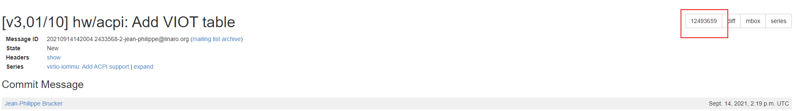
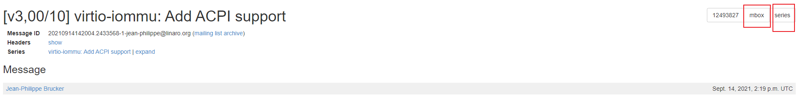
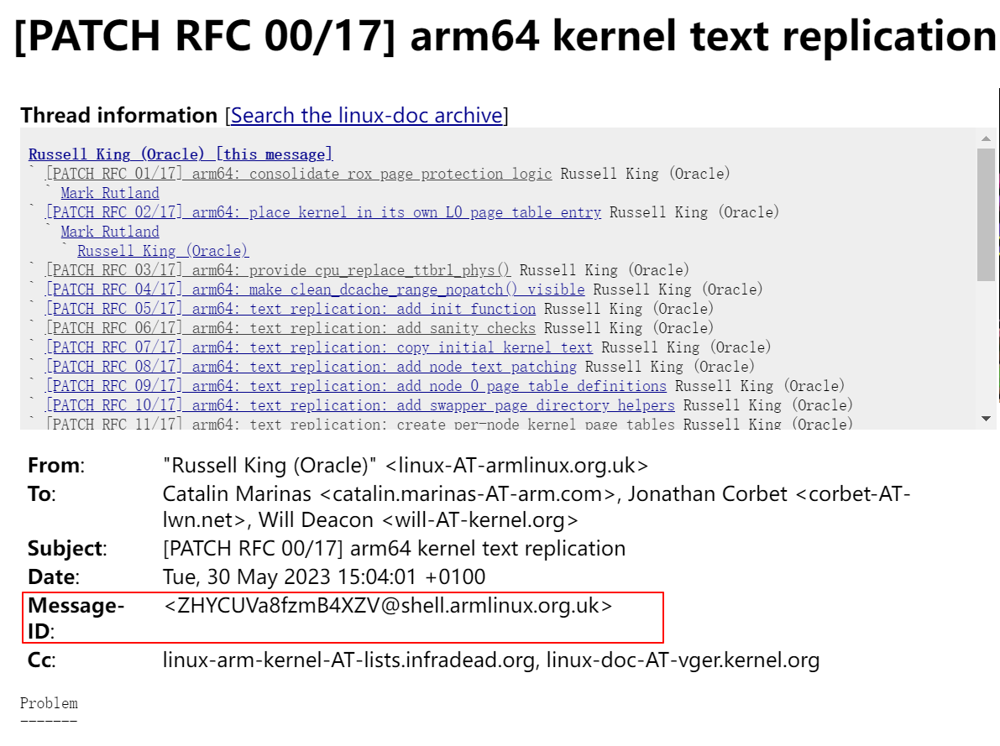

<!-- @import "[TOC]" {cmd="toc" depthFrom=1 depthTo=6 orderedList=false} -->

<!-- code_chunk_output -->

- [1. 背景](#1-背景)
- [2. 下载 pwclient](#2-下载-pwclient)
- [3. 安装 pwclient](#3-安装-pwclient)
- [4. 配置](#4-配置)
- [5. 使用 pwclient](#5-使用-pwclient)
- [B4](#b4)

<!-- /code_chunk_output -->

# 1. 背景

我们看邮件列表时, 经常会对**没有进入社区的 patch**感兴趣. 但是邮件列表里的补丁并不是完整的 git 仓库可用的补丁. 对于少量的补丁, 可以用复制和粘贴来获取 patch.

但是如果 patch 是几十个的话, 粘贴复制比较麻烦. 有一个工具可以完成从邮件列表获取 patch, 并应用这个 patch 到代码里.

这个工具叫 pwclient, 下面是具体的步骤

# 2. 下载 pwclient

```
git clone https://github.com/getpatchwork/pwclient
```

# 3. 安装 pwclient

详细参看 repo 中的`README`

```
apt install python3-pip
pip3 install pwclient

python3 setup.py install
```

# 4. 配置

配置`~/.pwclientrc`文件, 主要是从哪个邮件列表下载补丁的配置

```
[options]
default=all

[all]
backend = reset
url = http://patchwork.ozlabs.org/xmlrpc/
```

格式都是: `$PATCHWORK_URL/xmlrpc`

`http://patchwork.ozlabs.org/xmlrpc/` 是众多项目汇总, 具体包含的项目见 `http://patchwork.ozlabs.org/`

类似汇总还有

linux 汇总: `https://patchwork.kernel.org/xmlrpc`

```
[options]
default=all

[all]
url = https://patchwork.kernel.org/xmlrpc/

[qemu]
url = https://patchwork.kernel.org/project/qemu-devel/xmlrpc/
```

* qemu 单独的: https://patchwork.kernel.org/project/qemu-devel/xmlrpc/
* gcc: https://patchwork.kernel.org/project/gcc/xmlrpc/
* glibc: https://patchwork.kernel.org/project/glibc/xmlrpc/

`Note: No Project found matching lkml, ignoring filter`

# 5. 使用 pwclient

参考: https://patchwork.readthedocs.io/projects/pwclient/en/latest/usage/

pwclient -h

1. 获取 lkml 补丁的 patch id

比如, 我们看到邮件有一个`[RFC V2 1/9] Introduce new fields in kvm_arch/vcpu_arch struct for direct build EPT support`这个标题的补丁. 我们用 pwclient search 来获取这个补丁的 id

```bash
# pwclient search "Introduce new fields in kvm_arch/vcpu_arch struct for direct build EPT support"
ID      State        Name
--      -----        ----
1284460 New          [RFC,1/9] Introduce new fields in kvm_arch/vcpu_arch struct for direct build EPT support
1298144 New          [RFC,V2,1/9] Introduce new fields in kvm_arch/vcpu_arch struct for direct build EPT support
```

可以看到 ID 为 1298144, 这个就是 patch id

也可以从网页获取

比如, https://patchwork.kernel.org/project/qemu-devel/patch/20210914142004.2433568-2-jean-philippe@linaro.org/



2. 获取邮件列表的完整的补丁

```
# pwclient get 1298144
Saved patch to RFC-V2-1-9-Introduce-new-fields-in-kvm_arch-vcpu_arch-struct-for-direct-build-EPT-support.patch
```

也可以从网页下载



* mbox: 只下载当前的
* series: 下载整个 patchset, 但是不下载 coverletter

3. 将补丁打入 git 代码仓库

```
# pwclient git-am 1298144
```

执行完这个命令 patch id 为 983638 的补丁, 就打入到了本地源码里


# B4

https://b4.docs.kernel.org/en/latest/

https://github.com/mricon/b4

apt install b4

找到 message-ID



然后获取 patch

```
# b4 am ZHYCUVa8fzmB4XZV@shell.armlinux.org.uk
Grabbing thread from lore.kernel.org/all/ZHYCUVa8fzmB4XZV@shell.armlinux.org.uk/t.mbox.gz
Analyzing 29 messages in the thread
Checking attestation on all messages, may take a moment...
---
  ✗ [PATCH RFC 1/17] arm64: consolidate rox page protection logic
    + Acked-by: Mark Rutland <mark.rutland@arm.com>
  ✗ [PATCH RFC 2/17] arm64: place kernel in its own L0 page table entry
  ✗ [PATCH RFC 3/17] arm64: provide cpu_replace_ttbr1_phys()
  ✗ [PATCH RFC 4/17] arm64: make clean_dcache_range_nopatch() visible
  ✗ [PATCH RFC 5/17] arm64: text replication: add init function
  ✗ [PATCH RFC 6/17] arm64: text replication: add sanity checks
  ✗ [PATCH RFC 7/17] arm64: text replication: copy initial kernel text
  ✗ [PATCH RFC 8/17] arm64: text replication: add node text patching
  ✗ [PATCH RFC 9/17] arm64: text replication: add node 0 page table definitions
  ✗ [PATCH RFC 10/17] arm64: text replication: add swapper page directory helpers
  ✗ [PATCH RFC 11/17] arm64: text replication: create per-node kernel page tables
  ✗ [PATCH RFC 12/17] arm64: text replication: boot secondary CPUs with appropriate TTBR1
  ✗ [PATCH RFC 13/17] arm64: text replication: update cnp support
  ✗ [PATCH RFC 14/17] arm64: text replication: setup page tables for copied kernel
  ✗ [PATCH RFC 15/17] arm64: text replication: include most of read-only data as well
  ✗ [PATCH RFC 16/17] arm64: text replication: early kernel option to enable replication
  ✗ [PATCH RFC 17/17] arm64: text replication: add Kconfig
  ---
  ✗ BADSIG: DKIM/armlinux.org.uk
---
Total patches: 17
---
Cover: ./20230530_linux_arm64_kernel_text_replication.cover
 Link: https://lore.kernel.org/r/ZHYCUVa8fzmB4XZV@shell.armlinux.org.uk
 Base: not specified
       git am ./20230530_linux_arm64_kernel_text_replication.mbx
```

就可以打上了