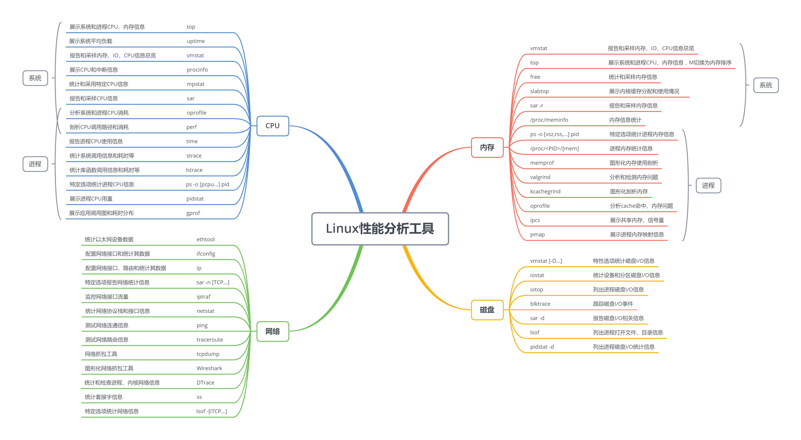
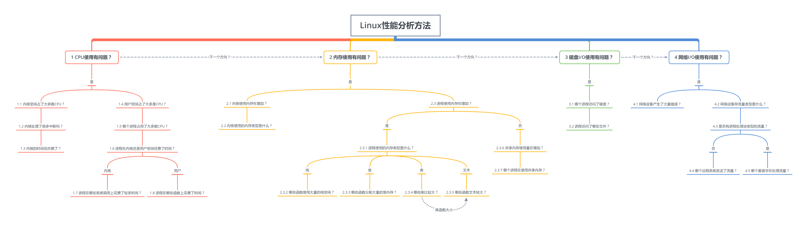

<!-- @import "[TOC]" {cmd="toc" depthFrom=1 depthTo=6 orderedList=false} -->

<!-- code_chunk_output -->

- [1. 分析工具](#1-分析工具)
- [2. 分析方法](#2-分析方法)
- [3. CPU 使用有问题?](#3-cpu-使用有问题)
  - [3.1. 内核空间占用了大多数 CPU](#31-内核空间占用了大多数-cpu)
  - [3.2. 内核处理了很多中断吗?](#32-内核处理了很多中断吗)
  - [3.3. 内核的时间花在哪了?](#33-内核的时间花在哪了)
  - [3.4. 用户空间占了大多是 CPU?](#34-用户空间占了大多是-cpu)
  - [3.5. 哪个进程占用了大多数 CPU?](#35-哪个进程占用了大多数-cpu)
  - [3.6. 进程在内核还是用户空间花费了时间?](#36-进程在内核还是用户空间花费了时间)
  - [3.7. 进程在哪些系统调用上花费了较多时间?](#37-进程在哪些系统调用上花费了较多时间)
  - [3.8. 进程在哪些函数上花费了时间?](#38-进程在哪些函数上花费了时间)
- [4. 内存使用有问题?](#4-内存使用有问题)
  - [4.1. 内核使用内存在增加?](#41-内核使用内存在增加)
  - [4.2. 内核使用的内存类型是什么?](#42-内核使用的内存类型是什么)
  - [4.3. 进程使用内存在增加?](#43-进程使用内存在增加)
    - [4.3.1. 进程使用的内存类型是什么?](#431-进程使用的内存类型是什么)
    - [4.3.2. 哪些函数使用大量的栈空间?](#432-哪些函数使用大量的栈空间)
    - [4.3.3. 哪些函数分配大量的堆内存?](#433-哪些函数分配大量的堆内存)
    - [4.3.4. 哪些库比较大?](#434-哪些库比较大)
    - [4.3.5. 哪些函数文本较大?](#435-哪些函数文本较大)
    - [4.3.6. 共享内存使用量在增加?](#436-共享内存使用量在增加)
    - [4.3.7. 哪个进程在使用共享内存?](#437-哪个进程在使用共享内存)
- [5. 磁盘 I/O 使用有问题?](#5-磁盘-io-使用有问题)
  - [5.1. 哪个进程访问了磁盘?](#51-哪个进程访问了磁盘)
  - [5.2. 进程访问了哪些文件?](#52-进程访问了哪些文件)
- [6. 网络 I/O 使用有问题?](#6-网络-io-使用有问题)
  - [6.1. 网络设备产生了大量错误?](#61-网络设备产生了大量错误)
  - [6.2. 网络设备存流量类型是什么?](#62-网络设备存流量类型是什么)
  - [6.3. 是否有进程处理该类型的流量?](#63-是否有进程处理该类型的流量)
  - [6.4. 哪个远程系统发送了流量?](#64-哪个远程系统发送了流量)
  - [6.5. 哪个套接字在处理流量?](#65-哪个套接字在处理流量)

<!-- /code_chunk_output -->

整理和总结一些 Linux 后台开发常用分析工具和问题排查思路, 主要包括 CPU、内存、磁盘、网络四个方面, 并归纳成思维导图方便记忆和查询.

# 1. 分析工具

Linux 有很多性能分析工具, 下面的思维导图总结了一些常用工具.

# 2. 分析方法

Linux 上的问题排查是后台开发的家常便饭, 有时候查个问题不知从何下手, 甚至要花费一两天时间, 所以能尽快的缩小问题范围和定位问题根源, 不给产品大大拖后腿, 是所有开发的愿景.

我根据以前的笔记整理了排查问题的思路图, 希望能提供一些解决问题的思路. 按下图走到叶子节点的时候可能没有想要的解, 但也可能帮助缩小了问题范围和获得了相关信息, 方便网上查询和咨询他人. 图中的意思不是指从 CPU --> 内存 --> 磁盘 --> 网络依次排查, 如果能明确的确定哪方面有问题, 直接从该问题类型开始往下排查.

下面的内容是对上图进行展开.

# 3. CPU 使用有问题?

使用`top`等命令查看 CPU 使用率和负载是否过高.

## 3.1. 内核空间占用了大多数 CPU

通过`top`命令查看内核占用 CPU 比例是否过大.

## 3.2. 内核处理了很多中断吗?

使用`procinfo`或`cat /proc/interrupts`查看中断次数和频率, 以及造成中断数量较高的设备.

## 3.3. 内核的时间花在哪了?

使用`oprofile`分析哪些内核函数消耗大量时间, 并查询这些函数的功能, 确定它们处于哪个子系统(内存、网络、磁盘等)并了解可能被调用的原因. 如果这些函数是设备特定的, 尝试着找出为什么需要使用这种特定的设备(尤其是在 1.2 中造成高中断的设备), 或许就可以判断出哪里出了问题.

## 3.4. 用户空间占了大多是 CPU?

通过`top`命令查看用户态是否占了大量 CPU.

## 3.5. 哪个进程占用了大多数 CPU?

通过`top`命令进程排序列表确定占用大量 CPU 的进程.

## 3.6. 进程在内核还是用户空间花费了时间?

使用`time`命令查看进程在内核和用户空间花费的时间, 这里不一定非得任意一方非得占大多数时间. 如进程在内核占用超过 25%以上的时间, 说明内核也排查是重点.

## 3.7. 进程在哪些系统调用上花费了较多时间?

使用`strace`/`oprofile`查看进程调用了**哪些系统调用**和找出主要耗时时长的系统调用, 通过减少系统调用次数或者更改性能更好的系统调用来提升性能.

## 3.8. 进程在哪些函数上花费了时间?

使用 ltrace/oprofile 确定哪些函数消耗了大多数时间. 如果函数调用次数过多, 则检查是否存在不必要的调用次数, 如 for 循环判断条件里不断调用某个函数或者 debug 日志里调某个函数得到一个字符串序列. 如果单次调用就已经很耗时, 使用 oprofile/cachegrind 分析函数是否存在热点代码大量 cache 缺失, 通过调整数据结构或调整代码提高热点代码 cache 命中.

# 4. 内存使用有问题?

通过 top/vmstat/procinfo 等确定内存使用是否过高, 内存交换空间不断增加.

## 4.1. 内核使用内存在增加?

使用 slabtop 查看内核使用内存是否增加或者使用量过大.

## 4.2. 内核使用的内存类型是什么?

使用 slabtop 排序内核使用内存情况, 找出使用内存较大的对象名字. 通过搜索或查询相关分配对象名字(如 inode_cache), 确定它用于哪些文件或属于哪个子系统, 就有可能弄清楚内存分配的原因.

## 4.3. 进程使用内存在增加?

使用 top/ps 按内存使用量排序并观察 rss 等字段看进程使用物理内存是否增加.

### 4.3.1. 进程使用的内存类型是什么?

通过/proc/<pid>/status 查看内存使用情况. 如 VmExe 值很大, 则说明可执行文件本身很大, 需要确定哪些函数文本比较大. VmLib 很大, 则说明应用程序使用了大量或者体积比较大的共享库, 需要确定哪些库导致了 VmLib 很大. VmData 较大并在增加, 说明进程的数据区或堆在增加.

### 4.3.2. 哪些函数使用大量的栈空间?

使用 gdb attach 进程, 根据调用栈信息计算当前栈指针和前一个栈指针的差值, 这个差值即为函数的栈容量, 找到栈容量比较大的函数.

### 4.3.3. 哪些函数分配大量的堆内存?

使用 memprof 找到哪些函数分配了堆内存并观察哪些进程的堆内存在增加, 确定是否存在不合理的分配或者内存泄漏问题.

### 4.3.4. 哪些库比较大?

通过/proc/<pid>/maps 查看进程使用了哪些共享库和以及这些库的大小, 对于太大的共享库是否可能替换成大小更小的版本. 或者某个库已经被其他进程加载到内存使用, 只是版本不同, 则可以改成共用一个版本.

### 4.3.5. 哪些函数文本较大?

如果进程的可执行文件本身比较大, 加载到内存后会占用更多的空间. 可以通过 nm 命令排序符号大小, 找出文本段较大的函数看是否可以删除或者减小其大小.

### 4.3.6. 共享内存使用量在增加?

使用 ipcs 查看共享内存信息, 是否存在过大或者共享内存数量不断增加.

### 4.3.7. 哪个进程在使用共享内存?

使用 ipcs -p 查看哪些进程创建和使用了共享内存. 对于共享内存过大问题, 可以查看其程序代码看分配是否合理. 对于共享内存数不断增加, 是否存在创建后未删除等问题.

# 5. 磁盘 I/O 使用有问题?

运行 iostat, 查看 await 平均等待时间, await 越高则说明磁盘负荷越大.

## 5.1. 哪个进程访问了磁盘?

通过 iotop 找到产生大量 IO 的进程.

## 5.2. 进程访问了哪些文件?

通过 strace 跟踪高 IO 进程与文件操作相关的系统调用, 查看其调用详情和耗时时长, 找到耗时长的读写操作. 并通过其操作的文件描述符 fd 映射回磁盘上的文件, 了解为什么需要读写这些文件, 进而查看是否可以优化.

# 6. 网络 I/O 使用有问题?

使用 ethool 查看网卡的最大流量限制 , 并通过 iptraf 查看流经端口的流量是否饱和.

## 6.1. 网络设备产生了大量错误?

使用 ifconfig/ip 命令查看网络接口是否产生大量错误, 如果是可能是硬件配置的有问题, 联系网管帮忙排查解决.

## 6.2. 网络设备存流量类型是什么?

使用 iptraf 查看流量类型(协议/端口号).

## 6.3. 是否有进程处理该类型的流量?

使用 netstat 查看是否有进程在流经该网络端口的流量.

## 6.4. 哪个远程系统发送了流量?

如果没有指定进程在处理这个流量, 可能来自网络上其他系统的流量攻击. 可使用 etherape/wireshark 尝试跟踪或者找网管咨询.

## 6.5. 哪个套接字在处理流量?

在确定了处理流量的进程后, 使用`strace`/`lsof`找到是**哪个套接字**产生了这些通信流量.