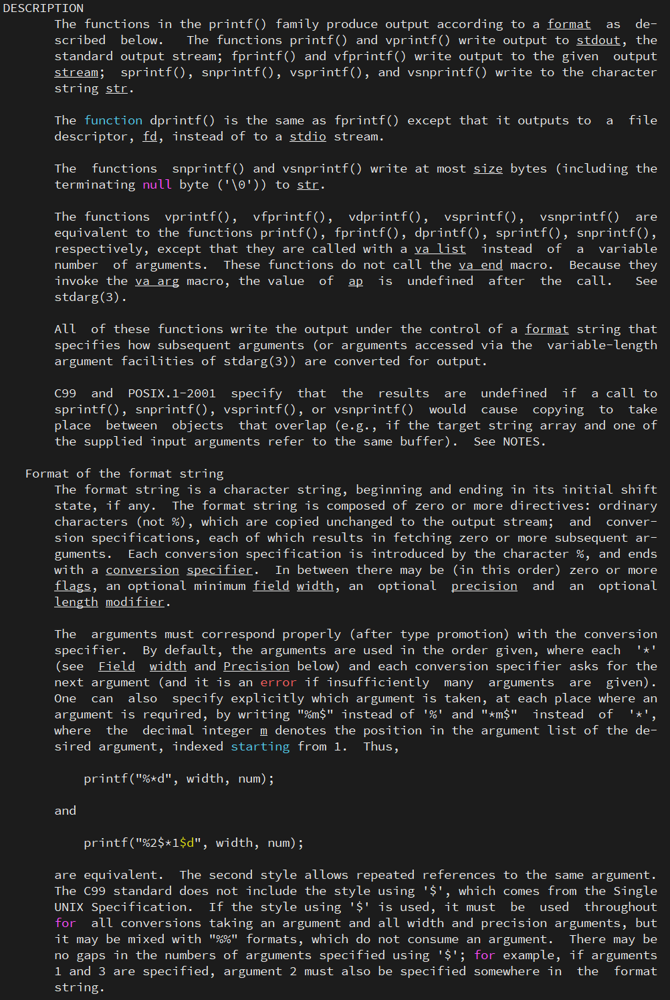
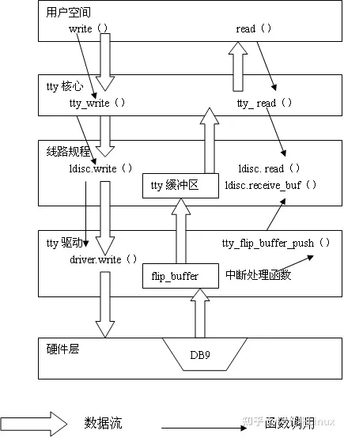

<!-- @import "[TOC]" {cmd="toc" depthFrom=1 depthTo=6 orderedList=false} -->

<!-- code_chunk_output -->

- [1. app](#1-app)
- [2. libc](#2-libc)
- [3. syscall](#3-syscall)
- [4. console](#4-console)
- [5. 总结](#5-总结)

<!-- /code_chunk_output -->


在 Linux 下, printf 输出到控制台经历了 `app` -> `libc` -> `syscall` -> `console` 驱动四个阶段.

# 1. app

首先是用户态代码调用 printf 函数. printf 函数首先会检查其格式字符串中的特殊字符, 如 %d、%s 等, 并根据这些特殊字符和传递给 printf 函数的参数来生成要输出的字符串.

```cpp
printf("hello, world!\n");
```

# 2. libc

要能使用 printf 需要先包含:

```cpp
#include <stdio.h>
```

因为 printf 它是一个 libc 实现的标准库函数, 定义如下:

```cpp
int printf(const char *format, ...);
```

想了解它怎么实现的, 最快速的办法不是看源码, 而是看 `man 3 printf`



总结下来就是 2 个关键词, 分别是 "格式字符串的格式化"、"打印到标准输出".

标准输出? 通过 strace 查看

```
# strace printf "hello,world\n"
execve("/usr/bin/printf", ["printf", "hello,world\\n"], 0x7fff41e16358 /* 38 vars */) = 0
......
newfstatat(1, "", {st_mode=S_IFCHR|0620, st_rdev=makedev(0x88, 0x2), ...}, AT_EMPTY_PATH) = 0
write(1, "hello,world\n", 12hello,world
)           = 12
close(1)                                = 0
close(2)                                = 0
exit_group(0)                           = ?
+++ exited with 0 +++
```

**标准输出**就是 **fd 1**.

更详细的就是去看 glibc 源码.

```
$ git clone https://sourceware.org/git/glibc.git
$ vim glibc/stdio-common/printf.c
```

glibc 中源码 printf 的入口:

```cpp
// stdio-common/printf.c
#undef printf

/* Write formatted output to stdout from the format string FORMAT.  */
/* VARARGS1 */
int
__printf (const char *format, ...)
{
  va_list arg;
  int done;

  va_start (arg, format);
  done = __vfprintf_internal (stdout, format, arg, 0);
  va_end (arg);

  return done;
}

#undef _IO_printf
ldbl_strong_alias (__printf, printf);
ldbl_strong_alias (__printf, _IO_printf);
```

根据前面可知, 在 Linux 中, 为了将格式化的输出发送到控制台上, printf 函数会调用 write 系统调用. write 系统调用会将生成的要输出的字符串写入到**标准输出流**中. 而标准输出流(stdout)是一个**文件描述符**, 它**与控制台相关联**.

首先要理解**控制台**的概念, 控制台设备的实现方式可能因不同的 Linux 发行版而有所不同. 例如, 在我的 Ubuntu 虚拟机上, 控制台是一个 "`/dev/pts/2`":

```
$ sleep 10000 &
[1] 7134
ubuntu@haiwei-pc:~/codes/glibc$ lsof -c sleep
COMMAND  PID   USER   FD   TYPE DEVICE SIZE/OFF     NODE NAME
sleep   7134 ubuntu  cwd    DIR  259,1     4096 42357042 /home/ubuntu/codes/glibc
sleep   7134 ubuntu  rtd    DIR  259,1     4096        2 /
sleep   7134 ubuntu  txt    REG  259,1    35328 47711307 /usr/bin/sleep
sleep   7134 ubuntu  mem    REG  259,1 14575936 47715643 /usr/lib/locale/locale-archive
sleep   7134 ubuntu  mem    REG  259,1  2216304 47716616 /usr/lib/x86_64-linux-gnu/libc.so.6
sleep   7134 ubuntu  mem    REG  259,1   240936 47716279 /usr/lib/x86_64-linux-gnu/ld-linux-x86-64.so.2
sleep   7134 ubuntu    0u   CHR  136,2      0t0        5 /dev/pts/2
sleep   7134 ubuntu    1u   CHR  136,2      0t0        5 /dev/pts/2
sleep   7134 ubuntu    2u   CHR  136,2      0t0        5 /dev/pts/2
```

在嵌入式 Linux 设备上, 控制台是一个 "/dev/console":

```
$ ll /dev/console
crw--w---- 1 root tty 5, 1  7 月  4 06:09 /dev/console
```

另外, 特别要注意的是标准输出它仅仅是一个描述符, 它**不等同**于**一个具体的设备**, 也不会永远与之绑定, 在某些应用场景下比如日志单独存储时可以**被重定向**, 如下例子:

```
$ sleep 10000 > test &
[1] 7379
$ lsof -c sleep
sleep   7379 ubuntu  cwd    DIR  259,1     4096 41681148 /home/ubuntu/codes
sleep   7379 ubuntu  rtd    DIR  259,1     4096        2 /
sleep   7379 ubuntu  txt    REG  259,1    35328 47711307 /usr/bin/sleep
sleep   7379 ubuntu  mem    REG  259,1 14575936 47715643 /usr/lib/locale/locale-archive
sleep   7379 ubuntu  mem    REG  259,1  2216304 47716616 /usr/lib/x86_64-linux-gnu/libc.so.6
sleep   7379 ubuntu  mem    REG  259,1   240936 47716279 /usr/lib/x86_64-linux-gnu/ld-linux-x86-64.so.2
sleep   7379 ubuntu    0u   CHR  136,3      0t0        6 /dev/pts/3
sleep   7379 ubuntu    1w   REG  259,1        0 41714694 /home/ubuntu/codes/test
sleep   7379 ubuntu    2u   CHR  136,3      0t0        6 /dev/pts/3
```

那么**标准输出 fd 描述符**究竟是如何**与控制台相关联**的呢? 当 **write 系统调用**被调用时, 数据又是怎样**从用户空间下发到控制台**的呢?

那无疑是先要看**标准数据 fd** 即控制台式什么时候被打开的. 这时又遇到问题了, 你会发现我前面通过 strace 跟踪 "sleep ..." 运行的过程其实根本**没有去显式打开标准输出 fd** 的, 那么怎么回事呢?

我们知道, **子进程 fork** 时默认**继承父进程打开的文件描述符**. 又知, 在 Linux 的天下, 用户进程兼为 **init 进程**的子民. 所以, 具体要看 **rootfs** 启动后 **init 进程**是如何初始化控制台的, 参见 `busybox/init/init.c`:

```cpp
// init/init.c
int init_main(int argc UNUSED_PARAM, char **argv)
{
    ......
    console_init();
}

static void console_init(void)
{
#ifdef VT_OPENQRY
    int vtno;
#endif
    char *s;
    // 获取环境变量
    s = getenv("CONSOLE");
    if (!s)
        s = getenv("console");
#if defined(__FreeBSD__) || defined(__FreeBSD_kernel__)
    /* BSD people say their kernels do not open fd 0,1,2; they need this: */
    if (!s)
        // 默认为空, 则赋值
        s = (char*)"/dev/console";
#endif
    if (s) {
        // open
        int fd = open(s, O_RDWR | O_NONBLOCK | O_NOCTTY);
        if (fd >= 0) {
            // 标准输入和标准输出的重定向
            dup2(fd, STDIN_FILENO);
            dup2(fd, STDOUT_FILENO);
            xmove_fd(fd, STDERR_FILENO);
        }
        dbg_message(L_LOG, "console='%s'", s);
    } else {
        /* Make sure fd 0,1,2 are not closed
         * (so that they won't be used by future opens) */
        bb_sanitize_stdio();
// Users report problems
//      /* Make sure init can't be blocked by writing to stderr */
//              fcntl(STDERR_FILENO, F_SETFL, fcntl(STDERR_FILENO, F_GETFL) | O_NONBLOCK);
    }

    s = getenv("TERM");
#ifdef VT_OPENQRY
    if (ioctl(STDIN_FILENO, VT_OPENQRY, &vtno) != 0) {
        /* Not a linux terminal, probably serial console.
            * Force the TERM setting to vt102
            * if TERM is set to linux (the default) */
        if (!s || strcmp(s, "linux") == 0)
                putenv((char*)"TERM=vt102");
# if !ENABLE_FEATURE_INIT_SYSLOG
        G.log_console = NULL;
# endif
    } else
#endif
    if (!s)
        putenv((char*)"TERM=" CONFIG_INIT_TERMINAL_TYPE);
}
```

`console_init()` 获取 console 文件相关环境变量, **默认为空**的情况下**赋值**为 "`dev/console`", 然后打开并将 `STDIN_FILENO` 和 `STDOUT_FILENO` **重定向到 console**.

讲到这里, 我们总结下, printf 打印的内容本质上就是**先打开一个控制台设备**(嵌入式 Linux 下默认为 `/dev/console`), 这个描述符**固定**是**标准输出**(`fd=1`), 然后往这个 fd 写内容.

# 3. syscall

当使用 **open 系统调用**打开 "`/dev/console`" 时, 发生了什么呢?

当 **write 系统调用**被调用时, 它会将**数据**从**用户空间**复制到**内核空间**. 那么进一步又写到哪里去呢?

这就要考 Linux 下设备驱动框架了.

前面已知道, 这个是由**标准输出关联的控制台**在打开时就已经决定了. Linux 下的文件分为**设备文件**、**常规文件**、**管道**、**套接字**等, 不同的文件有它固有的写入方法. 其中**设备文件**又分**块设备文件**和**字符设备文件**, 而 `/dev/console` 就是后者:

```
$ ll /dev/console
crw--w---- 1 root tty 5, 1  7 月  4 06:09 /dev/console
```

其**主设备号**为 5, **次设备号**为 1. 所以打开的时候, 最终会找到**当时注册**的 `&console_cdev`(字符设备驱动框架相关内容):

```cpp
// drivers/tty/tty_io.c
/*
 * Ok, now we can initialize the rest of the tty devices and can count
 * on memory allocations, interrupts etc..
 */
int __init tty_init(void)
{
    register_sysctl_table(tty_root_table);
    cdev_init(&tty_cdev, &tty_fops);
    if (cdev_add(&tty_cdev, MKDEV(TTYAUX_MAJOR, 0), 1) ||
        register_chrdev_region(MKDEV(TTYAUX_MAJOR, 0), 1, "/dev/tty") < 0)
            panic("Couldn't register /dev/tty driver\n");
    device_create(tty_class, NULL, MKDEV(TTYAUX_MAJOR, 0), NULL, "tty");
    // 重点
    cdev_init(&console_cdev, &console_fops);
    if (cdev_add(&console_cdev, MKDEV(TTYAUX_MAJOR, 1), 1) ||
        register_chrdev_region(MKDEV(TTYAUX_MAJOR, 1), 1, "/dev/console") < 0)
            panic("Couldn't register /dev/console driver\n");
    consdev = device_create_with_groups(tty_class, NULL,
                                        MKDEV(TTYAUX_MAJOR, 1), NULL,
                                        cons_dev_groups, "console");
    if (IS_ERR(consdev))
            consdev = NULL;

#ifdef CONFIG_VT
    vty_init(&console_fops);
#endif
    return 0;
}
```

也就是会打开 `console_fops` 的 open 方法即 `tty_open`:

```cpp
static const struct file_operations console_fops = {
        .llseek         = no_llseek,
        .read_iter      = tty_read,
        .write_iter     = redirected_tty_write,
        .splice_read    = generic_file_splice_read,
        .splice_write   = iter_file_splice_write,
        .poll           = tty_poll,
        .unlocked_ioctl = tty_ioctl,
        .compat_ioctl   = tty_compat_ioctl,
        .open           = tty_open,
        .release        = tty_release,
        .fasync         = tty_fasync,
};
```

然后会调用 `struct tty_driver *tty_lookup_driver()` 接口从**注册的 console 驱动**中查找一个**最合适的**, 具体怎么注册和查找的这里就忽略了, 如果你想进一步理解可以自行跟踪上下文.

所以, write 的时候也自然会调用 `console_fops` 的 write 方法即 `ssize_t redirected_tty_write()`, 正常就会继续调用 `tty_write()`.

# 4. console

上一讲可知, 本质上 console 就是一个 tty 设备. 当年从单片机过来刚入门嵌入式 Linux 时我非常的纳闷, console 对应的控制台底层最终不就是一个 uart 吗, Linux 下干嘛做的这么复杂, 让用户态直接和 console 交互, console 再去找 tty, tty 再去找 uart. 嘿嘿, 这就是 Linux 下伟大之处了, tty 它是一个框架, 为了实现分层与隔离, 向下兼容不同的硬件, 对上提供统一的终端操作接口. 还是直接上张架构图吧:



前面讲到了 `tty_write()`, 所处的层次是 tty 核心层, 会将数据从用户态拷贝到 tty 缓冲区(详见 `do_tty_write()` 接口). 向下还有行规程, 其作用是用来控制终端的解释行为, 比如要不要换行转换、回显等, 这里不展开. 行程层的操作方法是 `n_tty_ops`:

会继续调用 `n_tty_write()` 将数据发到 tty 驱动层, 其操作方法转换成了 `struct tty_struct *tty` 对象的 `ops->write()` 方法, 对于 uart 就是 uart_ops 的 write 方法即 `uart_write()`(详见 `drivers/tty/serial/serial_core.c` 的 `uart_register_driver()` 接口), 最终才到了 UART 硬件层.

因此, 控制台驱动程序会将数据最终发送到串口设备. 串口设备驱动程序会将数据转换为串口信号, 并将其发送到串口端口, 从而在控制台上显示输出的字符串.

# 5. 总结

> 格式化后调用了写文件, 描述符是 1, 标准输出

综上所述, 在 Linux 下, printf 函数输出到控制台的过程涉及到用户态、libc、Linux 内核和串口驱动程序等多个组件的协作. 通过这一系列的过程, printf 函数的输出最终能够在控制台上显示出来.

还有一些细节, 比如 uart 怎么选择绑定到 console 的, uart 注册的过程, `uart_write()` 又是进一步怎么实现字符的发送的.