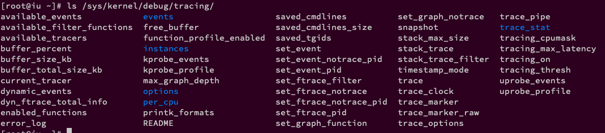

<!-- @import "[TOC]" {cmd="toc" depthFrom=1 depthTo=6 orderedList=false} -->

<!-- code_chunk_output -->

- [1. 简介](#1-简介)
  - [1.1. ftrace](#11-ftrace)
  - [1.2. ftrace 与其他 trace 工具的关系和比较](#12-ftrace-与其他-trace-工具的关系和比较)
- [2. ftrace 内核编译选项](#2-ftrace-内核编译选项)
  - [2.1. 内核源码编译选项](#21-内核源码编译选项)
  - [2.2. make menuconfig 配置项](#22-make-menuconfig-配置项)
- [3. debugfs 支持](#3-debugfs-支持)
  - [3.1. 内核编译选项](#31-内核编译选项)
  - [3.2. 内核编译](#32-内核编译)
- [4. 通过 debugfs 访问 ftrace](#4-通过-debugfs-访问-ftrace)
- [5. ftrace 的相关文件](#5-ftrace-的相关文件)
  - [5.1. README](#51-readme)
  - [5.2. current_tracer](#52-current_tracer)
  - [5.3. available_tracers](#53-available_tracers)
  - [5.4. tracing_on](#54-tracing_on)
  - [5.5. trace](#55-trace)
  - [5.6. trace_pipe](#56-trace_pipe)
  - [5.7. trace_options](#57-trace_options)
  - [5.8. options](#58-options)
  - [5.9. tracing_max_latency](#59-tracing_max_latency)
  - [5.10. tracing_thresh](#510-tracing_thresh)
  - [5.11. buffer_size_kb](#511-buffer_size_kb)
  - [5.12. buffer_total_size_kb](#512-buffer_total_size_kb)
  - [5.13. free_buffer](#513-free_buffer)
  - [5.14. tracing_cpumask](#514-tracing_cpumask)
  - [5.15. set_ftrace_filter 和 set_ftrace_notrace](#515-set_ftrace_filter-和-set_ftrace_notrace)
  - [5.16. set_ftrace_pid](#516-set_ftrace_pid)
  - [5.17. set_ftrace_notrace_pid](#517-set_ftrace_notrace_pid)
  - [5.18. set_event_pid](#518-set_event_pid)
  - [5.19. set_event_notrace_pid](#519-set_event_notrace_pid)
    - [5.19.1. sched_switch](#5191-sched_switch)
    - [5.19.2. sched_wakeup](#5192-sched_wakeup)
    - [5.19.3. sched_wakeup_new](#5193-sched_wakeup_new)
    - [5.19.4. sched_waking](#5194-sched_waking)
  - [5.20. set_graph_function](#520-set_graph_function)
  - [5.21. set_graph_notrace](#521-set_graph_notrace)
  - [5.22. available_filter_functions](#522-available_filter_functions)
  - [5.23. syn_ftrace_total_info](#523-syn_ftrace_total_info)
- [6. task 是否被 trace 跳过](#6-task-是否被-trace-跳过)
- [7. ftrace 跟踪器](#7-ftrace-跟踪器)
- [8. ftrace 操作流程](#8-ftrace-操作流程)
- [9. function 跟踪器](#9-function-跟踪器)
  - [9.1. 特定进程](#91-特定进程)
- [10. function_graph 跟踪器](#10-function_graph-跟踪器)
  - [10.1. 采样某个模块](#101-采样某个模块)
  - [10.2. 指定进程](#102-指定进程)
- [11. sched_switch 跟踪器](#11-sched_switch-跟踪器)
- [12. irqsoff 跟踪器](#12-irqsoff-跟踪器)
- [13. preemptoff 跟踪器](#13-preemptoff-跟踪器)
- [14. preemptirqsoff 跟踪器](#14-preemptirqsoff-跟踪器)
- [15. wakeup 跟踪器](#15-wakeup-跟踪器)
- [16. wakeup_rt 跟踪器](#16-wakeup_rt-跟踪器)
- [17. Latency tracing and events](#17-latency-tracing-and-events)
- [18. hwlat 跟踪器](#18-hwlat-跟踪器)
- [19. max stack tracer 的使用](#19-max-stack-tracer-的使用)
- [20. 动态 ftrace](#20-动态-ftrace)
  - [20.1. 指定模块](#201-指定模块)
  - [20.2. 跟踪模块初始化](#202-跟踪模块初始化)
- [21. trace 选项](#21-trace-选项)
  - [21.1. 追踪器特定的 option](#211-追踪器特定的-option)
    - [21.1.1. function tracer](#2111-function-tracer)
    - [21.1.2. function_graph tracer](#2112-function_graph-tracer)
    - [21.1.3. blk tracer](#2113-blk-tracer)
- [22. trace event](#22-trace-event)
- [23. trace marker](#23-trace-marker)
- [24. 工具函数使用](#24-工具函数使用)
  - [24.1. trace_printk](#241-trace_printk)
  - [24.2. 使用 tracing_on/tracing_off 控制跟踪信息的记录](#242-使用-tracing_ontracing_off-控制跟踪信息的记录)
- [25. 资料](#25-资料)
- [26. 参考](#26-参考)

<!-- /code_chunk_output -->

# 1. 简介

## 1.1. ftrace

ftrace 是内核中的一个内部追踪器, 用来帮助操作系统开发者和设计者了解到内核中发生了什么. 它用来调试或分析内核中的延迟以及性能问题.

ftrace 是由 Steven Rostedy 和 Ingo Molnar 在内核 2.6.27 版本中引入的. 它有自己**存储跟踪数据**的**环形缓冲区**, 并使用**GCC 配置机制**.

ftrace 官方文档在`Documentation/trace/*`文件中; ftrace 代码主要在`kernel/trace`, ftrace 相关头文件在`include/trace`中.

ftrace 的作者在 LinuxCon 2010 有一篇关于 Ftrace Linux Kernel Tracing 的 slides 值得一读, 见附件`linuxcon_jp2010_rostedt.pdf`

最早 `ftrace` 是一个 `function tracer`, **仅**能够记录内核的**函数调用流程**. 如今 `ftrace` 已经成为一个集成了很多 tracing 工具的 `framework`框架, 采用 `plugin` 的方式支持开发人员添加更多种类的 `trace` 功能.

其最基本的功能是提供了**动态**和**静态探测点**, 用于探测内核中**指定位置**上的相关信息.

* **静态探测点**, 是在内核代码中调用 `ftrace` 提供的相应接口实现, 称之为静态是因为, 是在**内核代码中写死**的, **静态编译**到内核代码中的, 在内核编译后, 就不能再动态修改. 在开启 `ftrace` 相关的内核配置选项后, 内核中已经在一些关键的地方设置了静态探测点, 需要使用时, 即可查看到相应的信息.
* **动态探测点**, 基本原理为: 利用 `mcount` 机制, 在**内核编译**时, 在**每个函数入口保留数个字节**, 然后在使用 `ftrace`时, 将保留的字节替换为需要的指令, 比如跳转到需要的执行探测操作的代码.

所以 ftrace 里的**跟踪机制**总结起来主要有**两种**, 分别是**函数**和**tracepoint**.

* `函数`属于"傻瓜式"操作, GCC 编译会自动在内核函数加入一段代码;

* `tracepoint`可以理解为一个 Linux 内核中的**占位符函数**, 包括 `trace_printk` 和`trace event`, 开发者可以自己定义并多加一些变量等信息.

## 1.2. ftrace 与其他 trace 工具的关系和比较

Ftrace 最初是在 **2.6.27** 中出现的, 那个时候, systemTap 已经开始崭露头角, 其他的 trace 工具包括 LTTng 等也已经发展多年. 那为什么人们还要再开发一个 trace 工具呢?

**SystemTap** 项目是 Linux 社区对 SUN Dtrace 的反应, 目标是达到甚至超越 **Dtrace** . 因此 SystemTap 设计比较复杂, Dtrace 作为 SUN 公司的一个项目开发了多年才最终稳定发布, 况且得到了 Solaris 内核中每个子系统开发人员的大力支持.  SystemTap 想要赶超 Dtrace, 困难不仅是一样, 而且更大, 因此她始终处在不断完善自身的状态下, 在真正的产品环境, 人们依然无法放心的使用她. 不当的使用和 SystemTap 自身的不完善都有可能导致系统崩溃.

Ftrace 的设计目标简单, 本质上是一种**静态代码插装技术**, **不需要**支持某种编程接口让用户自定义 trace 行为. 静态代码插装技术更加可靠, 不会因为用户的**不当使用**而导致**内核崩溃**.  ftrace 代码量很小, 稳定可靠. 实际上, 即使是 **Dtrace**, 大多数用户也只使用其**静态 trace** 功能. 因此 ftrace 的设计非常务实.

从 2.6.30 开始, ftrace 支持 **event tracer**, 其实现和功能与 LTTng 非常类似, 或许将来 ftrace 会同 LTTng 进一步融合, 各自取长补短.  ftrace 有定义良好的 ASCII 接口, 可以直接阅读, 这对于内核开发人员非常具有吸引力, 因为只需内核代码加上 cat 命令就可以工作了, 相当方便;  LTTng 则采用 binary 接口, 更利于专门工具分析使用. 此外他们内部 ring buffer 的实现不相同, **ftrace** 对**所有 tracer** 都采用**同一个 ring buffer**, 而 LTTng 则使用各自不同的 ring buffer .

目前, 或许将来 **LTTng** 都只能是内核主分支之外的工具. 它主要受到**嵌入式工程师**的欢迎, 而内核开发人员则更喜欢 **ftrace** .

Ftrace 的实现依赖于其他很多内核特性, 比如 `tracepoint[3]`, `debugfs[2]`, `kprobe[4]`, `IRQ-Flags[5]` 等. 限于篇幅, 关于这些技术的介绍请读者自行查阅相关的参考资料.

# 2. ftrace 内核编译选项

使用 ftrace , 首先要将其**编译进内核**.

## 2.1. 内核源码编译选项

内核源码目录下的 `kernel/trace/Makefile` 文件给出了 ftrace 相关的**编译选项**.

清单 1. ftrace 相关的配置选项列表:

```
CONFIG_FTRACE=y
CONFIG_HAVE_FUNCTION_TRACER=y
CONFIG_HAVE_FUNCTION_GRAPH_TRACER=y
CONFIG_HAVE_DYNAMIC_FTRACE=y
CONFIG_FUNCTION_TRACER=y
CONFIG_IRQSOFF_TRACER=y
CONFIG_SCHED_TRACER=y
CONFIG_ENABLE_DEFAULT_TRACERS=y
CONFIG_FTRACE_SYSCALLS=y
CONFIG_PREEMPT_TRACER=y
```

ftrace 相关的配置选项比较多, 针对不同的跟踪器有各自对应的配置选项.

不同的选项有不同的依赖关系, 内核源码目录下的 `kernel/trace/Kconfig` 文件描述了这些**依赖关系**.

读者可以参考 `Makefile` 文件和 `Konfig` 文件, 然后选中自己所需要的跟踪器.

## 2.2. make menuconfig 配置项

如果你看不到 tracing 子目录的话, 你应该在内核配置上启用相关选项, 然后重编译内核.

通常在配置内核时, 使用 `make menuconfig` 会更直观一些.

请在你的内核配置中找到如图所示的选项, 启用它们:

Kernel Hacking -> Tracers:

1. Kernel Function Tracer (FUNCTION_TRACER)
2. Kernel Function Graph Tracer (FUNCTION_GRAPH_TRACER)
3. enable/disable function tracing dynamically (DYNAMIC_FTRACE)
4. Trace max stack (STACK_TRACER)


根据你的架构, 在选择上面的选项时, 一些其他的选项根据依赖关系可能也会自动被启用. 上面所列的选项主要是用于跟踪所用. 内核编译完成之后, 你只需要重启机器, tracing 功能就可以用了.

以 2.6.33.1 版本的内核为例, 要将 ftrace 编译进内核, 可以选中 Kernel hacking (图 1 )下的 Tracers 菜单项(图 2 ).

图 1. Kernel hacking:


图 2. Tracers:


进入 Tracers 菜单下, 可以看到内核支持的跟踪器列表. 如图 3 所示, 这里选中了所有的跟踪器, 读者可以根据自己的需要选中特定的跟踪器.

图 3. 内核支持的跟踪器列表:


这里要注意, 如果是在 32 位 x86 机器上, 编译时不要选中 General setup 菜单项(图 4 )下的 Optimize for size 选项(图 5 ), 否则就无法看到图 3 中的 `Kernel Function Graph Tracer` 选项. 这是因为在 Konfig 文件中, 针对 32 位 x86 机器, 表项 `FUNCTION_GRAPH_TRACER` 有一个特殊的依赖条件:

```
depends on !X86_32 || !CC_OPTIMIZE_FOR_SIZE
```

图 4. General setup


图 5. Optimize for size


# 3. debugfs 支持

## 3.1. 内核编译选项

ftrace 通过 **debugfs** 向**用户态**提供了**访问接口**, 所以还需要将 debugfs 编译进内核.

激活对 debugfs 的支持, 可以直接编辑内核配置文件 `.config` , 设置 `CONFIG_DEBUG_FS=y` ; 或者在 `make menuconfig` 时到 `Kernel hacking` 菜单下选中对 debugfs 文件系统的支持, 如图 6 所示.

图 6. debugfs 编译选项


配置完成后, **编译安装新内核**, 然后**启动到新内核**.

## 3.2. 内核编译

注意, 激活 ftrace 支持后, 编译内核时会使用编译器的 `-pg` 选项, 这是在 `kernel/trace/Makefile` 文件中定义的, 如清单 2 所示.

清单 2. 激活编译选项 `-pg`

```
ifdef CONFIG_FUNCTION_TRACER
ORIG_CFLAGS := $(KBUILD_CFLAGS)
KBUILD_CFLAGS = $(subst -pg,,$(ORIG_CFLAGS))
...
endif
...
```

使用 `-pg` 选项会在编译得到的内核映像中加入大量的调试信息. 一般情况下, 只是在开发测试阶段激活 ftrace 支持, 以调试内核, 修复 bug . 最终用于发行版的内核则会关闭 `-pg` 选项, 也就无法使用 ftrace.

# 4. 通过 debugfs 访问 ftrace

ftrace 通过 **debugfs** 向用户态提供**访问接口**. 配置内核时激活 debugfs 后会创建目录 `/sys/kernel/debug` , debugfs 文件系统就是挂载到该目录. 要挂载该目录, 需要将如下内容添加到 `/etc/fstab` 文件:

```
debugfs  /sys/kernel/debug  debugfs  defaults  0  0
```

或者可以在运行时挂载:
```
mount  -t  debugfs  debugfs  /sys/kernel/debug
```

激活内核对 ftrace 的支持后会在 debugfs 下创建一个 **tracing 目录** /sys/kernel/debug/tracing . 该目录下包含了 ftrace 的控制和输出文件, 如图 7 所示. 根据编译内核时针对 ftrace 的设定不同, 该目录下实际显示的文件和目录与这里也会不同.

图 7. tracing 目录下的文件



> 最新的 kernel 已经开始使用 tracefs 文件系统, 详细见 `Documentation/trace/ftrace.rst`

```
# mount | grep tracing
none on /sys/kernel/tracing type tracefs (rw,relatime)
tracefs on /sys/kernel/debug/tracing type tracefs (rw,relatime)
```

# 5. ftrace 的相关文件

tracing 目录(`/sys/kernel/debug/tracing`)中的文件控制着跟踪的能力. 根据你在内核配置时的选项的不同, 这里列的文件可能稍有差异. 有些是**各种跟踪器共享使用**的, 有些是**特定于某个跟踪器使用**的.

在**操作这些数据文件**时, 通常使用 echo 命令来修改其值, 也可以在程序中通过文件读写相关的函数来操作这些文件的值.

下面只对部分文件进行描述, 你可以参考内核源码包中 `Documentation/trace` 目录下的**文档**以及 `kernel/trace` 下的**源文件**以了解其余文件的用途.

## 5.1. README

- `README`: 提供了一个**简短的使用说明**, 展示了 ftrace 的操作命令序列.

可以通过 cat 命令查看该文件以了解概要的操作流程.

## 5.2. current_tracer

- `current_tracer`: 用于设置或显示**当前使用的跟踪器**;

使用 echo 将跟踪器名字写入该文件可以**切换到不同的跟踪器**. 修改 `current tracer` 会清理 `ring buffer` 内容以及 `snapshot buffer` 内容.

系统启动后, 其**缺省值**为 **nop** , 即**不做任何跟踪操作**.

在执行完一段跟踪任务后, 可以通过向该文件写入 nop 来重置跟踪器.

## 5.3. available_tracers

- `available_tracers`: 记录了当前**编译进内核**的**跟踪器的列表**

可以通过 cat 查看其内容; 写 `current_tracer` 文件时用到的跟踪器名字**必须**在**该文件列出的跟踪器名字列表**中.

## 5.4. tracing_on

- `tracing_on`: 表示**trace ring buffer 是否启用**.

有时候在观察到某些事件时想**暂时关闭跟踪**, 写入 **0** 可以**停止跟踪**, 这样跟踪缓冲区中比较新的部分是与所关注的事件相关的; 写入 **1** 可以**继续跟踪**.

这个仅仅会**禁止写入 ring buffer**, tracing 本身的开销(overhead)还是持续发生.

**内核函数** `tracing_off()` 会**禁止写入 ring buffer**, 其实操作就是对这个文件写 `0`, 所以**用户态**可以通过写 `1` 来重新启用.

同样, 如果**函数**和**事件**触发`traceoff`也会将该**文件设置为零并停止跟踪**. 当然也可以由**用户态**通过写此文件重新启用.

## 5.5. trace

- `trace`: 以可读格式保存 trace 的输出.

通过带有 `O_TRUNC` 标志, 以写方式打开这个文件会清除 ring buffer 的内容

注: 这个文件**不是**一个 **consumer**(消费者).

* 如果**tracing 被关闭**(**没有 tracer 运行**或者 **tracing_on 为 0**), 那么每次读取它都会产生相同的输出.
* 如果 tracing 被打开, 读该文件可能会产生不一致的结果, 因为它试图读取整个缓冲区而不使用它.

## 5.6. trace_pipe

- `trace_pipe`: 与 trace 相同, 但是运行时像**管道**一样, 可以在每次事件发生时读出追踪信息, 但是**读出的内容不能再次读出**.

从这个文件读会阻塞, 直到有新数据

该文件是一个 consumer, 这意味着读这个文件会顺序读取并显示更多当前数据. 一旦数据被读出, 数据就被消耗了, 不再会被这个文件顺序读到. 而 `trace` 文件是静态的, 一旦没有新的数据, 每次读都会是相同的.

## 5.7. trace_options

- `trace_options`: 用户可以通过这个文件控制`trace/trace_pipe`的**输出**; 也能**控制跟踪器 tracer 或 events 的工作方式**.

## 5.8. options

- `options`: 一个目录. **所有可用的 trace 选项**都会在该目录下有一个文件. 写 0 或写 1.

## 5.9. tracing_max_latency

- `tracing_max_latency`: 有些 tracers 会**记录最大延迟**.

比如, **中断禁用的最大时间**. 这个最大的延迟时间会记录到这个文件(单位微妙, microseconds). 最大延迟的 trace 数据会被保存到 `trace` 文件. 只有新的延迟比这个这个文件中更大, 新的 trace 才会被记录.

echo 一个数值到这个文件, 只要延迟小于这个都不会被记录.

## 5.10. tracing_thresh

- `tracing_thresh`: 有些 **latency tracer** 将在**延迟大于**此文件中的数字时记录一个跟踪数据.

只有当文件包含大于 0 的数字时才活动(单位: 微秒).

## 5.11. buffer_size_kb

- `buffer_size_kb`: 用于以**KB 为单位**指定**per-CPU 追踪缓冲区的大小**.

跟踪器会将跟踪到的信息写入缓存, **每个 CPU** 的**跟踪缓存是一样大**的, 系统追踪缓冲区的**总大小**就是这个值**乘以 CPU 的数量**.

跟踪缓存实现为**ring buffer 的形式**, 如果跟踪到的信息太多, 则旧的信息会被新的跟踪信息覆盖掉.

注意, 要**更改该文件的值**需要先将 `current_tracer` 设置为 `nop` 才可以.

**每个单独的 CPU** 的 buffer size **可能不同**(`per_cpu/cpu0/buffer_size_kb`), 那么这个文件将显示为"X".

## 5.12. buffer_total_size_kb

- `buffer_total_size_kb`: 显示所有 trace buffers 的**一共大小**

## 5.13. free_buffer

- `free_buffer`: 如果某个进程正在执行跟踪, 并且该进程完成后应该缩小"释放"ring buffer, 即使该进程将被信号杀死, 该文件也可以用于该目的(杀死进程??).  关闭该文件后, ring buffer 将被调整为最小大小.

**正在跟踪的进程也会打开该文件**, 当该**进程退出**时, 该文件的文件描述符将被关闭, 这时, ring buffer 将被"释放".

如果设置了`disable_on_free`选项, 它也可能会**停止跟踪**.

## 5.14. tracing_cpumask

- `tracing_cpumask`: 以**十六进制**的**位掩码**指定要作为**追踪对象的处理器**, 例如, 指定**0xb**时仅在处理器**0、1、3**上进行追踪.

## 5.15. set_ftrace_filter 和 set_ftrace_notrace

当配置了 dynamic ftrace(选中 `CONFIG_DYNAMIC_FTRACE` 选项, 详细见"动态 ftrace"), 代码会动态被修改(代码段 rewrite)来禁用掉 function profiler(mcount)的调用.

用于显示指定**要跟踪的函数**, 后者则作用相反, 用于指定**不跟踪的函数**.

如果一个函数名**同时出现**在这两个文件中, 则这个函数的执行状况**不会被跟踪**. 这些文件还支持**简单形式的含有通配符**的表达式, 这样可以用一个表达式一次指定多个目标函数; 具体使用在后续文章中会有描述. 注意, 要**写入这两个文件**的**函数名**必须可以在文件 `available_filter_functions` 中看到. 缺省为可以跟踪所有内核函数, 文件 `set_ftrace_notrace` 的值则为空.

这两个选项会影响到 `function tracer` 和 `function_graph tracer`, 以及影响 `function profiling`(见`function_profile_enabled`)

这个接口也允许命令使用, 见`Filter commands`.

为了加速, 因为处理字符串的开销可能相当大, 并且需要检查所有注册到跟踪的函数, 因此可以将 index 写入该文件. 写入"`available_filter_functions`"文件行位置对应的数字(**以"1"开头**).

## 5.16. set_ftrace_pid

- `set_ftrace_pid`: 设置 **function tracer** 所作用的**进程的 PID**.

如果 "`function-fork`" 选项打开, 这个文件中 pid 的进程如果调用 fork, 那么子进程 pid 会被自动添加到这个文件. 当进程 exit, 那么会自动从该文件中被移除.

## 5.17. set_ftrace_notrace_pid

- `set_ftrace_notrace_pid`: 设置 **function tracer** 忽略的进程的 PID.

如果 "`function-fork`" 选项打开, 这个文件中 pid 的进程如果调用 fork, 那么子进程 pid 会被自动添加到这个文件. 当进程 exit, 那么会自动从该文件中被移除.

同上. 一个 pid 同时存在这个文件和上一个文件, 进程也会被忽略.

## 5.18. set_event_pid

- `set_event_pid`: 仅仅 trace 这个文件中的进程所对应的事件 events.

当 `event-fork` 选项被打开, 这个文件中 pid 的进程如果调用 fork, 那么子进程 pid 会被自动添加到这个文件. 当进程 exit, 那么会自动从该文件中被移除.

## 5.19. set_event_notrace_pid

- `set_event_notrace_pid`: 不 trace 这个文件中的进程对应的事件 events.

当 `event-fork` 选项被打开, 这个文件中 pid 的进程如果调用 fork, 那么子进程 pid 会被自动添加到这个文件. 当进程 exit, 那么会自动从该文件中被移除.

* 只要 pid 在 `set_event_notrace_pid` 文件中, 就会跳过; 哪怕在 `set_event_pid` 中也存在, 还是会被跳过
* `set_event_pid` 文件中有内容, 那就仅仅 trace 这个文件中的 pids, 不在**就被跳过**; `set_event_pid` 文件为空, 则所有 pids 都会被 trace, **不会被跳过**.

有几个比较特殊的 tracepoint, 涉及到了两个 task(可以见代码 `event_pid_write` 和 `register_pid_events()`, `kernel/trace/trace_events.c`)

* `sched:sched_switch`
* `sched:sched_wakeup`
* `sched:sched_wakeup_new`
* `sched:sched_waking`

trace_events 给这四个 sched 相关的 `tracepoint` 都添加了两个 probe, 分别在 tracepoint 前后调用

### 5.19.1. sched_switch

`sched_switch` 的 pre probe:

只有 pre 和 next task 都被 event filter 的设置跳过(详细见下面的 `一个 task 是否被 trace 跳过` 节), `ignore_pid flag` 会被设置, 从而所有的 event 会被跳过, `sched_switch event` 也会被跳过.

> (`event_filter_pid_sched_switch_probe_pre()`, `kernel/trace/trace_events.c`)

`sched_switch` 的 post probe:

仅仅 next task (也是 current??)被 event filter 的设置跳过(详细见下面的 `一个 task 是否被 trace 跳过` 节), `ignore_pid flag` 会被设置, 从而后续所有的 event 会被跳过.

### 5.19.2. sched_wakeup

`sched_wakeup` 的 pre probe:

只有**当前进程**和**被唤醒的进程**都被 event filter 的设置跳过(详细见下面的 `一个 task 是否被 trace 跳过` 节), `ignore_pid flag` 会被设置, 从而所有的 event 会被跳过, `sched_wakeup event` 也会被跳过.

`sched_wakeup` 的 post probe:

仅仅当**当前进程**被 event filter 的设置跳过(详细见下面的 `一个 task 是否被 trace 跳过` 节), `ignore_pid flag` 会被设置, 从而后续所有的 event 会被跳过.

### 5.19.3. sched_wakeup_new

同 `sched_wakeup`

### 5.19.4. sched_waking

同 `sched_wakeup`

## 5.20. set_graph_function

- `set_graph_function`: 对于 function graph tracer, 仅仅会追踪这个文件里面的**函数**以及**它们调用的函数**.

详细见 `dynamic ftrace`

注意: `set_ftrace_filter` 和 `set_ftrace_notrace` 还是**会起作用**, 会决定哪些函数被追踪, 哪些不被追踪.

## 5.21. set_graph_notrace

- `set_graph_notrace`: 在进入函数时会 disable function graph 的追踪, 在函数退出时恢复.

这样子, 可以实现指定一个函数的一些调用函数不会被 trace.

## 5.22. available_filter_functions

- `available_filter_functions`: 记录了当前**可以跟踪的内核函数**. 对于不在该文件中列出的函数, 无法跟踪其活动.

这里面是函数名字, 可以用来写入 `set_ftrace_filter`, `set_ftrace_notrace`, `set_graph_function` 或 `set_graph_notrace` 文件. 详细见`dynamic ftrace`.

## 5.23. syn_ftrace_total_info

- `dyn_ftrace_total_info`:

用来 debug 的.

- `enabled_functions`:

多用于 debug ftrace; 也可以用来查看

...

- `function_profile_enabled`:

- `trace_stat`:

- `kprobe_events`:

- `kprobe_profile`:

- `max_graph_depth`:

- `printk_formats`:

- `saved_cmdlines`:

- `saved_cmdlines_size`:

- `saved_tgids`:

- `snapshot`:

- `stack_max_size`:

- `stack_trace`:

- `stack_trace_filter`:

- `trace_clock`:

- `trace_marker`:

- `trace_marker_raw`:

- `uprobe_events`:

- `uprobe_profile`:

- `instances`:

- `events`:

- `set_event`:

- `available_events`:

- `timestamp_mode`:

- `hwlat_detector`:

- `per_cpu`:

- `per_cpu/cpu0/buffer_size_kb`:

- `per_cpu/cpu0/trace`:

- `per_cpu/cpu0/trace_pipe`:

- `per_cpu/cpu0/trace_pipe_raw`:

- `per_cpu/cpu0/snapshot`:

- `per_cpu/cpu0/snapshot_raw`:

- `per_cpu/cpu0/stats`

>

-

# 6. task 是否被 trace 跳过

一个 task 是否被 trace 跳过(**适用所有**):

* 只要 pid 在 `no` 文件中, 就会跳过; 哪怕在 `yes` 中也存在, 还是会被跳过
* `yes` 文件中有内容, 那就仅仅 trace 这个文件中的 pids, 不在**就被跳过**; `yes` 文件为空, 则所有 pids 都会被 trace, **不会被跳过**.

> trace_ignore_this_task()

# 7. ftrace 跟踪器

ftrace 提供了**不同的跟踪器**, 以用于**不同的场合**, 比如跟踪**内核函数调用**、对**上下文切换**进行跟踪、查看**中断被关闭的时长**、跟踪**内核态中的延迟**以及**性能问题**等.

要找到**哪些跟踪器可用**, 你可以对`available_tracers`文件执行 cat 操作.
在编译内核时, 也可以看到内核支持的跟踪器对应的选项, 如之前图 3 所示.

与输出空间分离的跟踪器有: nop(它**不是一个跟踪器**, 是**默认设置的一个值**)、函数(函数跟踪器)、函数图(函数图跟踪器), 等等, 如下所示:

```
# cat /sys/kernel/debug/tracing/available_tracers
hwlat blk function_graph wakeup_dl wakeup_rt wakeup function nop
```

| Tracer | 描述 |
|:------:|:---|
| `function` | **函数调用追踪器**. 可以看出**哪个内核函数何时调用**. <p><p>可以通过文件 `set_ftrace_filter` **指定要跟踪的函数** |
| `function graph` | **函数调用图表追踪器**. 可以看出**哪个函数被哪个函数调用**, **何时返回**. <p><p>可以通过文件 `set_grapch_function` 显示指定**要生成调用流程图的函数**.  |
| `blk` | **block I/O 追踪器**. 被 blktrace 用户态程序使用 |
| `hwlat` | **硬件延迟追踪器**(Hardware Latency tracer). 用来探测硬件是否产生了延迟. |
| `irqsoff` | 当**中断被禁止**时, 系统**无法响应外部事件**, 比如**键盘**和**鼠标**, **时钟**也无法产生 `tick` 中断, 这意味着系统响应延迟. <p><p>`irqsoff` 这个 `tracer` 能够跟踪内核中**哪些函数禁止了中断**, 对于其中中断**禁止时间最长**的会保存到`trace`文件中, 见上面的 `tracing_max_latency`. <p><p>最好使能 latency-format 选项(使用这个 tracer 会自动打开), 去看 trace 数据 |
| `preemptoff` | 和前一个 tracer 类似, 追踪并记录**禁止内核抢占的函数**, 并清晰显示出**禁止内核抢占时间最长的函数**. |
| `preemptirqsoff` | 同上, 跟踪和记录**禁止中断**或者**禁止抢占**的内核函数, 以及禁止时间最长的函数. 即综合了 irqoff 和 preemptoff 两个功能. |
| `wakeup` | 跟踪**进程唤醒信息**, 进程**调度延迟**追踪器. 跟踪进程的调度延迟, 即高优先级进程从进入 `ready` 状态到获得 `CPU` 的延迟时间. |
| `wakeup_rt` | 与 wakeup 相同, 但该 `tracer` **只针对实时进程** |
| `wakeup_dl` | 与 wakeup 相同, 但该 `tracer` **只针对 SCHED_DEADLINE 进程** |
| `mmiotrace` | 记录 `memory map IO` 的相关信息, 用于 Nouveau 驱动程序等逆向工程. |
| `branch` | 跟踪内核程序中的 `likely/unlikely` 分支预测命中率情况. `Branch tracer` 能够记录这些分支语句有多少次预测成功. 从而为优化程序提供线索. |
| `schedule_switch` | 跟踪进程调度情况, 进行**上下文切换**的追踪(调度情况), 可以得知从哪个进程切换到了哪个进程 |
| `hardware branch` | 利用处理器的分支跟踪能力, 实现硬件级别的指令跳转记录. 在 `x86` 上, 主要利用了 `BTS` 这个特性. |
| `initcall` | 记录系统在 `boot` 阶段所调用的 `init call`. |
| `power` | 记录系统电源管理相关的信息 |
| `sysprof` | 缺省情况下, `sysprof tracer` 每隔 `1 msec` 对内核进行一次采样, 记录函数调用和堆栈信息. |
| `kernel memory` | 内存 `tracer` 主要用来跟踪 `slab allocator` 的分配情况. 包括 `kfree`, `kmem_cache_alloc` 等 `API` 的调用情况, 用户程序可以根据 `tracer` 收集到的信息分析内部碎片情况, 找出内存分配最频繁的代码片断, 等等. |
| `workqueue statistical` |这是一个 ` statistic tracer`, 统计系统中所有的 `workqueue` 的工作情况, 比如有多少个 `work` 被插入 `workqueue`, 多少个已经被执行等. 开发人员可以以此来决定具体的 `workqueue` 实现, 比如是使用 `single threaded workqueue` 还是 `per cpu workqueue`. |
| `event` | 跟踪**系统事件**, 比如 `timer`, 系统调用, 中断等. |
| `nop` | 不会跟踪任何内核活动, 将 nop 写入 `current_tracer` 文件可以**删除之前所使用的跟踪器**, 并**清空之前收集到的跟踪信息**, 即**刷新 trace 文件**. |

这里还没有列出所有的 `tracer`, `ftrace` 是目前非常活跃的开发领域, 新的 `tracer` 将不断被加入内核.

ftrace 框架支持**扩展添加新的跟踪器**. 读者可以参考内核源码包中 `Documentation/trace` 目录下的文档以及 `kernel/trace` 下的源文件, 以了解其它跟踪器的用途和如何添加新的跟踪器.

# 8. ftrace 操作流程

使用 ftrace 提供的跟踪器来调试或者分析内核时需要如下操作:

1. **切换到目录** `/sys/kernel/debug/tracing/` 下

```
cd /sys/kernel/debug/tracing

cd /sys/kernel/tracing
```

2. 查看 `available_tracers` 文件, 获取**当前内核支持的跟踪器**列表

```
# cat available_tracers
```

3. **关闭 ftrace 跟踪**, 即将 0 写入文件 `tracing_on`

```
echo 0 > tracing_on
```

建议使用 `echo nop > current_tracer`, 这才真正关闭, 上面的只是不让打印而已

4. **激活 ftrace\_enabled**, 否则 function 跟踪器的行为类似于 nop; 另外, 激活该选项还可以让一些跟踪器比如 irqsoff 获取更丰富的信息.

建议使用 ftrace 时将其激活. 要激活 `ftrace_enabled` , 可以通过 `proc` 文件系统接口来设置:

```
echo 1 > /proc/sys/kernel/ftrace_enabled
```

或者

```
sysctl kernel.ftrace_enabled=1
```

5. **启用追踪器**. 将所选择的**跟踪器的名字写入**文件 `current_tracer`

ftrace 每次只能打开一个追踪器

```
# echo function > current_tracer ##选择一个特定的跟踪器.

# cat current_tracer ##检查是否是你所设置的跟踪器.
```

6. 将**要跟踪的函数**写入文件 `set_ftrace_filter` , 将**不希望跟踪**的函数写入文件 `set_ftrace_notrace`.

一旦将函数追踪器启动, ftrace 会记录所有函数的运行情况, 如果想要禁用或只查看某一些, 需要通过`trace_options`或`set_ftrace_pid`或`set_ftrace_filter`, 然后再设置`current_tracer`并开启追踪

通常直接操作文件 `set_ftrace_filter` 就可以了

```
# echo schedule > set_ftrace_filter     ## 仅记录 schedule
# cat set_ftrace_filter
schedule
```

7. **激活 ftrace 跟踪**, 即将 1 写入文件 `tracing_on`.

确保文件 `tracing_on` 的值也为 1, 该文件可以控制跟踪的暂停

```
# echo 1 > tracing_on ##初始化跟踪
```

8. **停顿一会儿**.

如果是对**应用程序**进行分析的话, 启动应用程序的执行, ftrace 会跟踪应用程序运行期间内核的运作情况

9. 通过将 0 写入文件 `tracing_on` 来**暂停跟踪信息**的记录, 此时**跟踪器还在跟踪内核的运行**, 只是**不再向文件 trace 中写入**跟踪信息

```
# echo 0 > tracing_on ##禁用跟踪功能
```

10. 查看文件 trace 获取跟踪信息, 对内核的运行进行分析调试

```
# cat trace > /tmp/trace.txt ##将跟踪文件保存到一个临时文件.
# cat /tmp/trace.txt ##查看 trace 文件的输出.
```

11. 禁用 trace 功能, 清空 trace 文件

```
# echo 0 > tracing_on   ## 禁用跟踪功能
# echo > current_tracer
```

# 9. function 跟踪器

function 跟踪器可以跟踪内核函数的调用情况, 可用于调试或者分析 bug , 还可用于了解和观察 Linux 内核的执行过程. 清单 1 给出了使用 function 跟踪器的示例.

清单 1. function 跟踪器使用示例

```
[root@linux tracing]# pwd
/sys/kernel/debug/tracing
[root@linux tracing]# echo 0 > tracing_on
[root@linux tracing]# echo 1 > /proc/sys/kernel/ftrace_enabled
[root@linux tracing]# echo function > current_tracer
[root@linux tracing]# echo 1 > tracing_on

# 让内核运行一段时间, 这样 ftrace 可以收集一些跟踪信息, 之后再停止跟踪

[root@linux tracing]# echo 0 > tracing_on
[root@linux tracing]# cat trace | head -10
# tracer: function
#
#         TASK-PID    CPU#    TIMESTAMP  FUNCTION
#            | |       |          |         |
        <idle>-0     [000] 20654.426521: _raw_spin_lock <-scheduler_tick
        <idle>-0     [000] 20654.426522: task_tick_idle <-scheduler_tick
        <idle>-0     [000] 20654.426522: cpumask_weight <-scheduler_tick
        <idle>-0     [000] 20654.426523: cpumask_weight <-scheduler_tick
        <idle>-0     [000] 20654.426523: run_posix_cpu_timers <-update_process_times
        <idle>-0     [000] 20654.426524: hrtimer_forward <-tick_sched_timer
```

trace 文件给出的信息格式很清晰.

首先, 字段`"tracer:"`给出了**当前所使用的跟踪器的名字**, 这里为 function 跟踪器.

然后是**跟踪信息记录的格式**,
* `TASK` 字段对应**任务的名字**,
* `PID` 字段则给出了任务的**进程 ID**,
* 字段 `CPU#` 表示运行被跟踪函数的 **CPU 号**, 这里可以看到 idle 进程运行在 0 号 CPU 上, 其进程 ID 是 0 ;
* 字段 `TIMESTAMP` 是时间戳, 其格式为`"<secs>.<usecs>"`, 表示执行该函数时对应的**时间戳**;
* `FUNCTION` 一列则给出了**被跟踪的函数**, **函数的调用者**通过符号 `"<-"` 标明, 这样可以观察到函数的调用关系.

## 9.1. 特定进程

ftrace 允许你对一个特定的进程进行跟踪.

在`/sys/kernel/debug/tracing`目录下, 文件`set_ftrace_pid`的值要更新为你想跟踪的进程的 PID.

手动操作:

```
# cd /sys/kernel/debug/tracing/
# cat set_ftrace_pid
no pid
# echo 3111 > set_ftrace_pid  //跟踪 PID 为 3111 的进程
# cat set_ftrace_pid
3111
# echo function > current_tracer
# cat trace
```

以下 traceprocess.sh 示例脚本向你展示了如何抓取**当前运行的进程的 PID**, 并进行相应跟踪.

```bash
#!/bin/bash

DPATH="/sys/kernel/debug/tracing"

## shell pid
PID=$$
## Quick basic checks
[ `id -u` -ne 0 ] && { echo "needs to be root" ; exit 1; } # check for root permissions
[ -z $1 ] && { echo "needs process name as argument" ; exit 1; } # check for args to this function
mount | grep -i debugfs &> /dev/null
[ $? -ne 0 ] && { echo "debugfs not mounted, mount it first"; exit 1; } #checks for debugfs mount

# flush existing trace data
echo nop > $DPATH/current_tracer

# stop the tracing
echo 0 > $DPATH/tracing_on

# write current process id to set_ftrace_pid file
echo $PID > $DPATH/set_ftrace_pid

# set function tracer
echo function > $DPATH/current_tracer
#echo function_graph > $DPATH/current_tracer

# start the tracing
echo 1 > $DPATH/tracing_on

# execute the process
# $* all parameter list
exec $*
```

```
./traceprocess.sh ls
```

如图中跟踪 ls 命令所示.


当跟踪完成后, 你需要清除`set_ftrace_pid`文件, 请用如下命令:

```
> set_ftrace_pid
```

# 10. function_graph 跟踪器

在 function 跟踪器给出的信息中, 可以通过 FUNCTION 列中的符号 `"<-"` 来**查看函数调用关系**, 但是由于中间会混合不同函数的调用, 导致看起来非常混乱, 十分不方便.

`function_graph` 跟踪器则可以提供类似 C 代码的函数**调用关系信息**. 通过写文件 `set_graph_function` 可以显示**指定**要生成**调用关系的函数**, 缺省会对所有可跟踪的内核函数生成函数调用关系图.

**函数图跟踪器**对**函数的进入**与**退出**进行跟踪, 这对于跟踪它的执行时间很有用. 函数执行时间**超过 10 微秒**的标记一个`"+"`号, **超过 1000 微秒**的标记为一个`"！"`号.

通过`echo function_graph > current_tracer`可以启用函数图跟踪器. 示例输入如图 3 所示.


有很多跟踪器, 所有的列表在`linux/Documentation/trace/ftrace.txt`文件中找得到. 通过将跟踪器的名字 echo 到`current_tracer`文件中可以启用或禁用相应跟踪器.

清单 2 给出了使用 `function_grapch` 跟踪器的示例, 示例中将**内核函数** `__do_fault` 作为观察对象, 该函数在内核运作过程中会被频繁调用.

注: 关于模块的参照下面`echo　':mod:kvm'　>　set_ftrace_filter`

清单 2. `function_graph` 跟踪器使用示例

```
[root@linux tracing]# pwd
/sys/kernel/debug/tracing
[root@linux tracing]# echo 0 > tracing_on
[root@linux tracing]# echo 1 > /proc/sys/kernel/ftrace_enabled
[root@linux tracing]# echo function_graph > current_tracer
[root@linux tracing]# echo __do_fault > set_graph_function
[root@linux tracing]# echo 1 > tracing_on

# 让内核运行一段时间, 这样 ftrace 可以收集一些跟踪信息, 之后再停止跟踪

[root@linux tracing]# echo 0 > tracing_on
[root@linux tracing]# cat trace | head -20
# tracer: function_graph
#
# CPU  DURATION                  FUNCTION CALLS
# |     |   |                     |   |   |   |
1)   9.936 us    |    }
1)   0.714 us    |    put_prev_task_fair();
1)               |    pick_next_task_fair() {
1)               |      set_next_entity() {
1)   0.647 us    |        update_stats_wait_end();
1)   0.699 us    |        __dequeue_entity();
1)   3.322 us    |      }
1)   0.865 us    |      hrtick_start_fair();
1)   6.313 us    |    }
1)               |    __switch_to_xtra() {
1)   1.601 us    |      memcpy();
1)   3.938 us    |    }
[root@linux tracing]# echo > set_graph_function
```

在文件 trace 的输出信息中, 首先给出的也是当前跟踪器的名字, 这里是 `function_graph` .

接下来是详细的跟踪信息, 可以看到, 函数的调用关系以类似 C 代码的形式组织.

* `CPU` 字段给出了**执行函数的 CPU 号**, 本例中都为 1 号 CPU.
* `DURATION` 字段给出了**函数执行的时间长度**, 以 `us` 为单位.
* `FUNCTION CALLS` 则给出了**调用的函数**, 并显示了**调用流程**. 注意,
  * 对于**不调用其它函数的函数**, 其对应行以`";"`结尾, 而且对应的 `DURATION` 字段给出其运行时长;
  * 对于**调用其它函数的函数**, 则在其`"}"`对应行给出了**运行时长**, 该时间是一个**累加值**, 包括了其内部调用的函数的执行时长. `DURATION` 字段给出的时长并**不是精确的**, 它还包含了执行 `ftrace` **自身的代码所耗费的时间**, 所以示例中将内部函数时长累加得到的结果会与对应的外围调用函数的执行时长并不一致; 不过通过该字段还是可以大致了解函数在时间上的运行开销的.

清单 2 中最后通过 echo 命令重置了文件 `set_graph_function` .

1. 因为 function_graph tracer 的 graph_ops 继续共用 global_ops 的 hash 表, 使用"`set_ftrace_filter`/`set_ftrace_notrace`"接口可以配置 global_ops 的 filter_hash/notrace_hash 表. 所以可以继续使用"`set_ftrace_filter`/`set_ftrace_notrace`"来配置 function_graph tracer 的 filter.

2. function_graph tracer 还可以使用"`set_graph_function`/`set_graph_notrace`"接口来配置过滤

所以需要上面两种过滤条件都满足的函数才能被 trace.

## 10.1. 采样某个模块

```
cd /sys/kernel/debug/tracing/
echo nop > current_tracer
echo 0 > tracing_on
echo ':mod:kvm' > set_ftrace_filter
echo ':mod:kvm_amd' >> set_ftrace_filter
echo ':mod:kvm_intel' >> set_ftrace_filter
echo > set_graph_function
echo pvclock_gtod_notify > set_ftrace_notrace
echo function_graph > current_tracer
echo 1 > tracing_on; sleep 30; echo 0 > tracing_on
```

注: 如果 filter 设置过宽泛, 写 trace 是有延迟的, 所以很容易造成你想 trace 的函数信息没有写入, 这种情况下, 解决办法:

1. trace 时间拉长
2. filter/graph_function 设置少一点
3. 设置 tracing_cpumask
4. 设置 set_ftrace_pid

## 10.2. 指定进程

注: 如果想要追踪某个模块的所有函数的 function_graph, 使用`set_ftrace_filter`, 即参照下面的指定模块部分内容

```sh
#!/bin/bash

DPATH="/sys/kernel/debug/tracing"

## shell pid
PID=$$
## Quick basic checks
[ `id -u` -ne 0 ] && { echo "needs to be root" ; exit 1; } # check for root permissions
[ -z $1 ] && { echo "needs process name as argument" ; exit 1; } # check for args to this function
mount | grep -i debugfs &> /dev/null
[ $? -ne 0 ] && { echo "debugfs not mounted, mount it first"; exit 1; } #checks for debugfs mount

# flush existing trace data
echo nop > $DPATH/current_tracer

# stop the tracing
echo 0 > $DPATH/tracing_on

# write current process id to set_ftrace_pid file
echo $PID > $DPATH/set_ftrace_pid

# set function tracer
echo function_graph > $DPATH/current_tracer

echo function-fork > trace_options

#replace test_proc_show by your function name
#echo test_proc_show > $debugfs/tracing/set_graph_function

# start the tracing
echo 1 > $DPATH/tracing_on

# execute the process
# $* all parameter list
exec $*

# stop the tracing
echo 0 > $DPATH/tracing_on
```

```
./traceprocess.sh ls
```


# 11. sched_switch 跟踪器

`sched_switch` 跟踪器可以对**进程的调度切换**以及**之间的唤醒操作**进行跟踪, 如清单 3 所示.

清单 3. sched_switch 跟踪器使用示例

```
[root@linux tracing]# pwd
/sys/kernel/debug/tracing
[root@linux tracing]# echo 0 > tracing_enabled
[root@linux tracing]# echo 1 > /proc/sys/kernel/ftrace_enabled
[root@linux tracing]# echo sched_switch > current_tracer
[root@linux tracing]# echo 1 > tracing_on
[root@linux tracing]# echo 1 > tracing_enabled

# 让内核运行一段时间, 这样 ftrace 可以收集一些跟踪信息, 之后再停止跟踪

[root@linux tracing]# echo 0 > tracing_enabled
[root@linux tracing]# cat trace | head -10
# tracer: sched_switch
#
#  TASK-PID    CPU#    TIMESTAMP  FUNCTION
#     | |       |          |         |
    bash-1408  [000] 26208.816058:   1408:120:S   + [000]  1408:120:S bash
    bash-1408  [000] 26208.816070:   1408:120:S   + [000]  1408:120:S bash
    bash-1408  [000] 26208.816921:   1408:120:R   + [000]     9:120:R events/0
    bash-1408  [000] 26208.816939:   1408:120:R ==> [000]     9:120:R events/0
events/0-9     [000] 26208.817081:      9:120:R   + [000]  1377:120:R gnome-terminal
events/0-9     [000] 26208.817088:      9:120:S ==> [000]  1377:120:R gnome-terminal
```

在 `sched_swich` 跟踪器获取的跟踪信息中记录了**进程间的唤醒操作**和**调度切换**信息, 可以通过符号' `+` '和' `==>` '区分;

- **唤醒操作记录**给出了**当前进程唤醒运行的进程**,
- **进程调度切换记录**中显示了**接替当前进程运行**的**后续进程**.

描述进程状态的格式为"`Task-PID:Priority:Task-State`".

以示例跟踪信息中的**第一条跟踪记录**为例, 可以看到`进程 bash` 的 `PID` 为 `1408` , 其对应的**内核态优先级**为 `120` , 当前状态为 **S(可中断睡眠状态**), 当前 bash 并没有唤醒其它进程; 从**第 3 条记录**可以看到, **进程 bash** 将进程 **events/0 唤醒**, 而在**第 4 条记录**中发生了**进程调度**, 进程 bash **切换**到**进程 events/0** 执行.

在 Linux 内核中, **进程的状态**在内核头文件 `include/linux/sched.h` 中定义, 包括**可运行状态** `TASK_RUNNING`(对应跟踪信息中的符号`' R '`)、**可中断阻塞状态** `TASK_INTERRUPTIBLE`(对应跟踪信息中的符号`' S '`)等. 同时该头文件也定义了**用户态进程**所使用的**优先级的范围**, **最小值**为 `MAX_USER_RT_PRIO`(值为 100 ), **最大值**为 `MAX_PRIO - 1`(对应值为 139 ), 缺省为 `DEFAULT_PRIO`(值为 120 ); 在本例中, 进程优先级都是缺省值 120 .

# 12. irqsoff 跟踪器

当 `latency-format` 选项被打开或者某个 latency tracer 被启用(会默认打开`latency-format`), trace 文件会记录下 latency 发生的一些信息.

当**关闭中断**时, CPU 就不能响应其他的事件, 如果这时有一个鼠标中断, 要在下一次开中断时才能响应这个鼠标中断, 这段延迟称为**中断延迟**, 有时候这样做会对系统性能造成比较大的影响.

irqsoff 跟踪器可以对中断被关闭的状况进行跟踪, 有助于发现导致较大延迟的代码; 当出现最大延迟时, **跟踪器**会记录**导致延迟**的**跟踪信息**, 文件 `tracing_max_latency` 则记录中断被关闭的**最大延时**.

清单 4. irqsoff 跟踪器使用示例

```
# pwd
/sys/kernel/debug/tracing
# echo 0 > tracing_on
# echo 0 > options/function-trace //关闭 function-trace 可以减少一些延迟

# echo 1 > /proc/sys/kernel/ftrace_enabled

# echo irqsoff > current_tracer

# echo 1 > tracing_on
# echo 1 > tracing_enabled

# 让内核运行一段时间, 这样 ftrace 可以收集一些跟踪信息, 之后再停止跟踪

[root@linux tracing]# echo 0 > tracing_on
[root@linux tracing]# cat trace | head -35
# tracer: irqsoff
#
# irqsoff latency trace v1.1.5 on 2.6.33.1
# --------------------------------------------------------------------
# latency: 34380 us, #6/6, CPU#1 | (M:desktop VP:0, KP:0, SP:0 HP:0 #P:2)
#    -----------------
#    | task: -0 (uid:0 nice:0 policy:0 rt_prio:0)
#    -----------------
#  => started at: reschedule_interrupt
#  => ended at:   restore_all_notrace
#
#
#                  _------=> CPU#
#                 / _-----=> irqs-off
#                | / _----=> need-resched
#                || / _---=> hardirq/softirq
#                ||| / _--=> preempt-depth
#                |||| /_--=> lock-depth
#                |||||/     delay
#  cmd    pid    |||||| time  |   caller
#    \   /       ||||||   \   |   /
<idle>-0       1dN... 4285us!: trace_hardirqs_off_thunk <-reschedule_interrupt
<idle>-0       1dN... 34373us+: smp_reschedule_interrupt <-reschedule_interrupt
<idle>-0       1dN... 34375us+: native_apic_mem_write <-smp_reschedule_interrupt
<idle>-0       1dN... 34380us+: trace_hardirqs_on_thunk <-restore_all_notrace
<idle>-0       1dN... 34384us : trace_hardirqs_on_caller <-restore_all_notrace
<idle>-0       1dN... 34384us : <stack trace>
=> trace_hardirqs_on_thunk
[root@linux tracing]# cat tracing_max_latency
34380
```

从清单 4 中的输出信息中, 可以看到当前 irqsoff 延迟跟踪器的**版本信息**. 显示**当前跟踪器的版本信息**为`vl.1.5`, 运行的**内核版本**为`2.6.33.1`.

接下来是**最大延迟时间**, 以 us 为单位, 本例中为 34380 us , 查看文件 `tracing_max_latency` 也可以获取该值; 跟踪条目和总跟踪条目为 6 条(`#6/6`), , 另外 VP、KP、SP、HP 值暂时没用, `#P:2`表示**当前系统可用的 CPU—共有 2 个**. task:ps\-6143 表示**当前发生中断延迟的进程**是 PID 为**6143**的进程, 名称为 ps.

从"task:"字段可以知道延迟发生时正在运行的进程为 idle(其 pid 为 0 ). 中断的关闭操作是在函数 reschedule_interrupt 中进行的, 由"=> started at:"标识, 函数 restore_all_ontrace 重新激活了中断, 由"=> ended at:"标识; 中断关闭的最大延迟发生在函数 trace_hardirqs_on_thunk 中, 这个可以从最大延迟时间所在的记录项看到, 也可以从延迟记录信息中最后的"=>"标识所对应的记录行知道这一点.

在输出信息中, irqs-off、need_resched 等字段对应于进程结构 struct task_struct 的字段或者状态标志, 可以从头文件 `arch/<platform>/include/asm/thread_info.h` 中查看进程支持的状态标志, include/linux/sched.h 则给出了结构 struct task_struct 的定义. 其中, irqs-off 字段显示是否中断被禁止, 为' d '表示中断被禁止; need_resched 字段显示为' N '表示设置了进程状态标志 TIF_NEED_RESCHED. hardirq/softirq 字段表示当前是否发生硬件中断 / 软中断; preempt-depth 表示是否禁止进程抢占, 例如在持有自旋锁的情况下进程是不能被抢占的, 本例中进程 idle 是可以被其它进程抢占的. 结构 struct task_struct 中的 lock_depth 字段是与大内核锁相关的, 而最近的内核开发工作中有一部分是与移除大内核锁相关的, 这里对该字段不再加以描述.


在文件的头部, irqsoff tracer 记录了中断禁止时间最长的函数. 在本例中, 函数 trace_hardirqs_on 将中断禁止了 12us .

文件中的每一行代表一次函数调用.  Cmd 代表进程名, pid 是进程 ID . 中间有 5 个字符, 分别代表了 CPU#, irqs-off 等信息, 具体含义如下:

CPU# 表示 CPU ID ;

irqs-off 这个字符的含义如下: ' d '表示中断被 disabled . ' . '表示中断没有关闭;

need-resched 字符的含义: ' N '表示 need_resched 被设置, ' . '表示 need-reched 没有被设置, 中断返回不会进行进程切换;

hardirq/softirq 字符的含义 : 'H' 在 softirq 中发生了硬件中断,  'h' – 硬件中断, ' s '表示 softirq, ' . '不在中断上下文中, 普通状态.

preempt-depth: 当抢占中断使能后, 该域代表 preempt_disabled 的级别.

在每一行的中间, 还有两个域: time 和 delay .  time: 表示从 trace 开始到当前的相对时间.  Delay 突出显示那些有高延迟的地方以便引起用户注意. 当其显示为 ! 时, 表示需要引起注意.


另外, 还有用于跟踪禁止进程抢占的跟踪器 preemptoff 和跟踪中断 / 抢占禁止的跟踪器 preemptirqsoff, 它们的使用方式与输出信息格式与 irqsoff 跟踪器类似, 这里不再赘述.

```
# tracer: irqsoff
#
# irqsoff latency trace v1.1.5 on 4.0.0
# --------------------------------------------------------------------
# latency: 259 us, #4/4, CPU#2 | (M:preempt VP:0, KP:0, SP:0 HP:0 #P:4)
#    -----------------
#    | task: ps-6143 (uid:0 nice:0 policy:0 rt_prio:0)
#    -----------------
#  => started at: __lock_task_sighand
#  => ended at:   _raw_spin_unlock_irqrestore
#
#
#                  _------=> CPU#
#                 / _-----=> irqs-off
#                | / _----=> need-resched
#                || / _---=> hardirq/softirq
#                ||| / _--=> preempt-depth
#                |||| /     delay
#  cmd     pid    ||||| time  |   caller
#    \   /      |||||  \    |   /
     ps-6143    2d...    0us!: trace_hardirqs_off < -__lock_task_sighand
     ps-6143    2d..1  259us+: trace_hardirqs_on < -_raw_spin_unlock_irqrestore
     ps-6143    2d..1  263us+: time_hardirqs_on < -_raw_spin_unlock_irqrestore
     ps-6143    2d..1  306us : < stack trace>
 => trace_hardirqs_on_caller
 => trace_hardirqs_on
 => _raw_spin_unlock_irqrestore
 => do_task_stat
 => proc_tgid_stat
 => proc_single_show
 => seq_read
 => vfs_read
 => sys_read
 => system_call_fastpath
```

文件的开头显示了当前跟踪器为 irqsoff, 并且显示当前跟踪器的版本信息为 v1.1.5, 运行的内核版本为 4.0. 显示当前最大的中断延迟是 259 微秒, 跟踪条目和总共跟踪条目为 4 条(`#4/4`), 另外 VP、KP、SP、HP 值暂时没用, `#P:4`表示当前系统可用的 CPU 一共有 4 个. task: ps-6143 表示当前发生中断延迟的进程是 PID 为 6143 的进程, 名称为 ps.

started at 和 ended at 显示发生中断的开始函数和结束函数分别为__lock_task_sighand 和_raw_spin_unlock_irqrestore. 接下来 ftrace 信息表示的内容分别如下.

* cmd: 进程名字为"ps".
* pid: 进程的 PID 号.
* CPU#: 该进程运行在哪个 CPU 上.
* irqs-off: "d"表示中断已经关闭.
* need_resched: "N"表示进程设置了`TIF_NEED_RESCHED`和`PREEMPT_NEED_RESCHED`标志位; "n"表示进程仅设置了`TIF_NEED_RESCHED`标志位; "p"表示进程仅设置了`PREEMPT_NEED_RESCHED`标志位.
* hardirq/softirq: "H"表示在一次软中断中发生了一个硬件中断; "h"表示硬件中断发生; "s"表示软中断; "."表示没有中断发生.
* preempt-depth: 表示抢占关闭的嵌套层级.
* time: 表示时间戳. 如果打开了 latency-format 选项, 表示时间从开始跟踪算起, 这是一个相对时间, 方便开发者观察, 否则使用系统绝对时间.
* delay: 用一些特殊符号来延迟的时间, 方便开发者观察. "$"表示大于 1 秒, "#"表示大于 1000 微秒, "!"表示大于 100 微秒, "+"表示大于 10 微秒.

最后要说明的是, 文件最开始显示中断延迟是 259 微秒, 但是在`<stack trace>`里显示 306 微秒, 这是因为在记录最大延迟信息时需要花费一些时间.

# 13. preemptoff 跟踪器

当抢占关闭时, 虽然可以响应中断, 但是高优先级进程在中断处理完成之后不能抢占低优先级进程直至打开抢占, 这样也会导致抢占延迟. 和 irqsoff 跟踪器一样, preemptoff 跟踪器用于跟踪和记录关闭抢占的最大延迟.

```
# cd /sys/kernel/debug/tracing/
# echo 0 > options/function-trace
# echo preemptoff > current_tracer
# echo 1 > tracing_on
 [...]
# echo 0 > tracing_on
# cat trace
```

下面是一个 preemptoff 的例子.

```
# tracer: preemptoff
#
# preemptoff latency trace v1.1.5 on 3.8.0-test+
# --------------------------------------------------------------------
# latency: 46 us, #4/4, CPU#1 | (M:preempt VP:0, KP:0, SP:0 HP:0 #P:4)
#    -----------------
#    | task: sshd-1991 (uid:0 nice:0 policy:0 rt_prio:0)
#    -----------------
#  => started at: do_IRQ
#  => ended at:   do_IRQ
#
#
#                  _------=> CPU#
#                 / _-----=> irqs-off
#                | / _----=> need-resched
#                || / _---=> hardirq/softirq
#                ||| / _--=> preempt-depth
#                |||| /     delay
#  cmd     pid    ||||| time  |   caller
#    \   /      |||||  \    |   /
    sshd-1991    1d.h.      0us+: irq_enter < -do_IRQ
    sshd-1991    1d..1      46us : irq_exit < -do_IRQ
    sshd-1991    1d..1      47us+: trace_preempt_on < -do_IRQ
    sshd-1991    1d..1      52us : < stack trace>
 => sub_preempt_count
 => irq_exit
 => do_IRQ
 => ret_from_intr
```

# 14. preemptirqsoff 跟踪器

在优化系统延迟时, 如果能快速定位何处关中断或者关抢占, 对开发者来说会很有帮助, 思考如下代码片段.

```
local_irq_disable();
    call_function_with_irqs_off();  //函数 A
    preempt_disable();
    call_function_with_irqs_and_preemption_off();  //函数 B
    local_irq_enable();
    call_function_with_preemption_off();  //函数 C
    preempt_enable();
```

如果使用 irqsoff 跟踪器, 那么只能记录函数 A 和函数 B 的时间. 如果使用 preemptoff 跟踪器, 那么只能记录函数 B 和函数 C 的时间. 可是函数 A+B+C 中都不能被调度, 因此 preemptirqsoff 用于记录这段时间的最大延迟.

```
 # cd /sys/kernel/debug/tracing/
# echo 0 > options/function-trace
# echo preemptirqsoff > current_tracer
# echo 1 > tracing_on
 [...]
# echo 0 > tracing_on
# cat trace
```

preemptirqsoff 跟踪器抓取的信息如下.

```
# tracer: preemptoff
#
# preemptoff latency trace v1.1.5 on 3.8.0-test+
# --------------------------------------------------------------------
# latency: 46 us, #4/4, CPU#1 | (M:preempt VP:0, KP:0, SP:0 HP:0 #P:4)
#    -----------------
#    | task: sshd-1991 (uid:0 nice:0 policy:0 rt_prio:0)
#    -----------------
#  => started at: do_IRQ
#  => ended at:   do_IRQ
#
#
#                  _------=> CPU#
#                 / _-----=> irqs-off
#                | / _----=> need-resched
#                || / _---=> hardirq/softirq
#                ||| / _--=> preempt-depth
#                |||| /    delay
#  cmd     pid    ||||| time  |   caller
#    \   /       |||||  \    |   /
    sshd-1991     1d.h.     0us+: irq_enter < -do_IRQ
    sshd-1991     1d..1    46us : irq_exit < -do_IRQ
    sshd-1991     1d..1    47us+: trace_preempt_on < -do_IRQ
    sshd-1991     1d..1    52us : < stack trace>
 => sub_preempt_count
 => irq_exit
 => do_IRQ
 => ret_from_intr
```

# 15. wakeup 跟踪器

# 16. wakeup_rt 跟踪器

# 17. Latency tracing and events

# 18. hwlat 跟踪器


# 19. max stack tracer 的使用

这个 tracer 记录内核函数的堆栈使用情况, 用户可以使用如下命令打开该 tracer:

```
echo 1 > /proc/sys/kernel/stack_tracer_enabled
```

从此, ftrace 便留心记录内核函数的堆栈使用.  Max Stack Tracer 的输出在 stack_trace 文件中:

```
# cat /debug/tracing/stack_trace

 Depth Size Location (44 entries)

 ----- ---- --------

 0) 3088 64 update_curr+0x64/0x136

 1) 3024 64 enqueue_task_fair+0x59/0x2a1

 2) 2960 32 enqueue_task+0x60/0x6b

 3) 2928 32 activate_task+0x27/0x30

 4) 2896 80 try_to_wake_up+0x186/0x27f

...

 42)  80 80 sysenter_do_call+0x12/0x32
```

从上例中可以看到内核堆栈最满的情况如下, 有 43 层函数调用, 堆栈使用大小为 3088 字节. 此外还可以在 Location 这列中看到整个的 calling stack 情况. 这在某些情况下, 可以提供额外的 debug 信息, 帮助开发人员定位问题.

# 20. 动态 ftrace

在配置内核时打开了`CONFIG_DYNAMIC_FTRACE`选项, 就可以**支持动态 ftrace 功能**. `set_ftrace_filter`和`set_ftrace_notrace`这两个文件可以配对使用, 其中, 前者设置**要跟踪的函数**, 后者指定**不要跟踪的函数**. 如果一个函数名**同时出现**在这两个文件中, 则这个函数的执行状况**不会被跟踪**.

在实际调试过程中, 我们通常会被 ftrace 提供的**大量信息**淹没, 因此**动态过滤**的方法非常有用.

`available_filter_functions`文件可以列出**当前系统支持的所有函数**, 例如现在我只想关注 `sys_nanosleep()` 和`hrtimer_interrupt()`这两个函数.

```
# cd /sys/kernel/debug/tracing/
# echo sys_nanosleep hrtimer_interrupt > set_ftrace_filter
# echo function > current_tracer
# echo 1 > tracing_on
# usleep 1
# echo 0 > tracing_on
# cat trace
```

抓取的数据如下.

```
# tracer: function
#
# entries-in-buffer/entries-written: 5/5   #P:4
#
#                              _-----=> irqs-off
#                             / _----=> need-resched
#                            | / _---=> hardirq/softirq
#                            || / _--=> preempt-depth
#                            ||| /     delay
#            TASK-PID   CPU#     ||||    TIMESTAMP  FUNCTION
#              | |      |  ||||       |         |
          usleep-2665  [001] ....  4186.475355: sys_nanosleep < -system_call_fastpath
          < idle>-0     [001] d.h1  4186.475409: hrtimer_interrupt < -smp_apic_timer_interrupt
          usleep-2665  [001] d.h1  4186.475426: hrtimer_interrupt < -smp_apic_timer_interrupt
          < idle>-0     [003] d.h1  4186.475426: hrtimer_interrupt < -smp_apic_timer_interrupt
          < idle>-0     [002] d.h1  4186.475427: hrtimer_interrupt < -smp_apic_timer_interrupt
```

此外, 过滤器还支持如下通配符.

- `<match>*`: 匹配所有**match 开头**的函数.
- `*<match>`: 匹配所有**match 结尾**的函数.
- `*<match>*`: 匹配所有**包含 match**的函数.

需要注意的是, 这三种形式不能组合使用, 比如`"begin*middle*end"`实际的效果与"begin"相同. 另外, 使用通配符表达式时, 需要用**单引号**将其括起来, 如果使用双引号, shell 可能会对字符' `*` '进行扩展, 这样最终跟踪的对象可能与目标函数不一样.

如果要跟踪所有"`hrtimer`"**开头**的函数, 可以`"echo 'hrtimer_*' > set_ftrace_filter"`.

还有**两个非常有用的操作符**,
* `">"`表示会**覆盖**过滤器里的内容;
* `>>`表示新加的函数会**增加**到过滤器中, 但不会覆盖.

```
# echo sys_nanosleep > set_ftrace_filter //往过滤器里写入 sys_nanosleep
# cat set_ftrace_filter   //查看过滤器里的内容
sys_nanosleep

# echo 'hrtimer_*' >> set_ftrace_filter  //再向过滤器中增加"hrtimer_"开头的函数
# cat set_ftrace_filter
hrtimer_run_queues
hrtimer_run_pending
hrtimer_init
hrtimer_cancel
hrtimer_try_to_cancel
hrtimer_forward
hrtimer_start
hrtimer_reprogram
hrtimer_force_reprogram
hrtimer_get_next_event
hrtimer_interrupt
sys_nanosleep
hrtimer_nanosleep
hrtimer_wakeup
hrtimer_get_remaining
hrtimer_get_res
hrtimer_init_sleeper

# echo '*preempt*' '*lock*' > set_ftrace_notrace //表示不跟踪包含"preempt"和"lock"的函数

# echo > set_ftrace_filter  //向过滤器中输入空字符表示清空过滤器
# cat set_ftrace_filter
```

图 4 就是一个动态跟踪的例子.


## 20.1. 指定模块

另外, 在参数前面加上`:mod:`, 可以仅追踪指定模块中包含的函数(注意, **模块必须已经加载**).

可以参照下面 `20.1 trace_printk` 中操作流程

例如:

```
root@thinker:/sys/kernel/debug/tracing# echo 'write*:mod:ext3' > set_ftrace_filter
```

仅追踪**ext3 模块**中包含的以**write 开头**的函数.

通过该文件还可以指定属于特定模块的函数, 这要用到 mod 指令. 指定模块的格式为:

```
echo ':mod:[module_name]' > set_ftrace_filter
```

下面给出了一个指定跟踪模块 ipv6 中的函数的例子. 可以看到, 指定跟踪模块 ipv6 中的函数会将文件 `set_ftrace_filter` 的内容设置为只包含该模块中的函数.

清单 5. 指定跟踪 ipv6 模块中的函数

```
[root@linux tracing]# pwd
/sys/kernel/debug/tracing
[root@linux tracing]# echo ':mod:ipv6' > set_ftrace_filter
[root@linux tracing]# cat set_ftrace_filter | head -5
ipv6_opt_accepted
inet6_net_exit
ipv6_gro_complete
inet6_create
ipv6_addr_copy
```

## 20.2. 跟踪模块初始化

```
# echo ':mod:snd_seq' > set_ftrace_filter
# echo function > current_tracer
# modprobe snd_seq
# cat trace
```

# 21. trace 选项

`trace_options`文件(或者 **options 目录**)用于控制在 trace 输出中打印的内容, 或操作跟踪程序.

通过`cat trace_options`或者`ls options/`可以看到**所有可用的选项**.

```
# cat trace_options
print-parent
nosym-offset
nosym-addr
noverbose
noraw
nohex
nobin
noblock
trace_printk
annotate
nouserstacktrace
nosym-userobj
noprintk-msg-only
context-info
nolatency-format
record-cmd
norecord-tgid
overwrite
nodisable_on_free
irq-info
markers
noevent-fork
nopause-on-trace
function-trace
nofunction-fork
nodisplay-graph
nostacktrace
nofuncgraph-overrun
funcgraph-cpu
funcgraph-overhead
nofuncgraph-proc
funcgraph-duration
nofuncgraph-abstime
funcgraph-irqs
nofuncgraph-tail
sleep-time
graph-time

# ls options/
annotate      disable_on_free     funcgraph-overhead  graph-time      pause-on-trace   stacktrace       userstacktrace
bin           display-graph       funcgraph-overrun   hash-ptr        printk-msg-only  sym-addr         verbose
blk_cgname    event-fork          funcgraph-proc      hex             print-parent     sym-offset
blk_cgroup    funcgraph-abstime   funcgraph-tail      irq-info        raw              sym-userobj
blk_classic   funcgraph-cpu       func_stack_trace    latency-format  record-cmd       test_nop_accept
block         funcgraph-duration  function-fork       markers         record-tgid      test_nop_refuse
context-info  funcgraph-irqs      function-trace      overwrite       sleep-time       trace_printk
```

要**禁用一个跟踪选项**, 只需要在相应行首加一个"no"即可. 比如,

`echo notrace_printk > trace_options`

要再次启用一个跟踪选项, 去掉"no"即可:

`echo trace_printk > trace_options`

The Linux Kernel documentation## 16.1. print-parent

* `print-parent`:

* sym-offset

* sym-addr

* verbose

* raw

* hex
* bin
* block
* trace_printk
*  annotate
*  userstacktrace
*  sym-userobj
*  printk-msg-only
*  context-info
*  latency-format
*  pause-on-trace
*  hash-ptr
*  record-cmd
*  record-tgid
*  overwrite
*  disable_on_free
*  irq-info
*  markers
*  event-fork
*  function-trace
*  function-fork
*  display-graph
*  stacktrace

*  branch


## 21.1. 追踪器特定的 option

有些追踪器(tracer)有自己的 options. 它们只在**特定 tracer 激活**时出现在`trace_options`中. 不过它们总是出现在 options 目录中.

### 21.1.1. function tracer

* func_stack_trace

### 21.1.2. function_graph tracer

* funcgraph-overrun


* funcgraph-cpu


* funcgraph-overhead


* funcgraph-proc


* funcgraph-duration


* funcgraph-abstime

* funcgraph-irqs

* funcgraph-tail

* sleep-time

* graph-time

### 21.1.3. blk tracer

* blk_classic

# 22. trace event

ftrace 里的**跟踪机制**主要有**两种**, 分别是**函数**和**tracepoint**. 前者属于"傻瓜式"操作, 后者 tracepoint 可以理解为一个 Linux 内核中的**占位符函数**, 内核子系统的开发者通常喜欢利用它来调试.

tracepoint 可以输出开发者想要的**参数、局部变量**等信息. **tracepoint**的位置比较**固定**, 一般都是**内核开发者添加！！！** 上去的, 可以把它理解为传统 C 语言程序中`#if DEBUG`部分. 如果在运行时没有开启 DEBUG, 那么是不占用任何系统开销的.

也可以在系统**特定事件触发**的时候打开跟踪. 可以在`available_events`文件中找到所有可用的系统事件:

```
# cat available_events | head -10
devlink:devlink_hwmsg
sunrpc:rpc_call_status
sunrpc:rpc_bind_status
sunrpc:rpc_connect_status
sunrpc:rpc_task_begin
sunrpc:rpc_task_run_action
sunrpc:rpc_task_complete
sunrpc:rpc_task_sleep
sunrpc:rpc_task_wakeup
sunrpc:rpc_socket_state_change
```

比如, 为了启用某个事件, 你需要: `echo sys_enter_nice >> set_event`(注意你是将事件的名字追加到文件中去, 使用`>>`追加定向器, 不是`>`). 要禁用某个事件, 需要在名字前加上一个"!"号: `echo '!sys_enter_nice' >> set_event`.

图 5 是一个事件跟踪场景示例. 同样, 可用的事件是列在事件目录里面的.


有关事件跟踪的更多细节, 请阅读内核目录下`Documents/Trace/events.txt`文件.

```
cd /sys/kernel/debug/tracing
echo kvm_cpuid >> set_event
echo 1 > tracing_on
...
echo 0 > tracing_on
cp /sys/kernel/debug/tracing/trace /data/perf_test/kvm_cpuid

cd /sys/kernel/debug/tracing
echo nop > current_tracer
echo > trace
echo kvm_hypercall > set_event
echo 1 > tracing_on; sleep 30; echo 0 > tracing_on
```

```
echo 1 > events/kvm/kvm_cpuid/enable
```

注: 只要设置 set_event 或者开启相应 enable, 然后打开 tracing_on 即可, 不用额外配置

# 23. trace marker

有时需要跟踪用户程序和内核空间的运行情况, trace marker 可以很方便地跟踪用户程序. `trace_marker`是一个文件节点, 允许用户程序写入字符串, ftrace 会记录该写入动作时的时间戳.

# 24. 工具函数使用

内核头文件 `include/linux/kernel.h` 中描述了 `ftrace` 提供的工具函数的原型, 这些函数包括 `trace_printk`、`tracing_on/tracing_off` 等. 本文通过示例模块程序向读者展示如何在代码中使用这些工具函数.

## 24.1. trace_printk

ftrace 提供了一个用于向 ftrace 跟踪缓冲区输出跟踪信息的工具函数, 叫做 `trace_printk()`, 它的使用方式与 printk() 类似.

可以通过 `trace` 文件**读取该函数的输出**.

1. 编写 `trace_printk` 打印调试信息后;
2. 将`current_tracer`设置为**nop**;
3. 将`tracing_on`设置为 1;
4. 调用相应模块执行;
5. 即可通过 trace 文件看到`trace_printk`打印的信息.

从头文件 `include/linux/kernel.h` 中可以看到, 在激活配置 `CONFIG_TRACING` 后, `trace_printk()` 定义为宏:

```cpp
#define trace_printk(fmt, args...)   		 \
    ...
```

注: `trace_printk`不需要做任何 ftrace 配置, 也就是直接代码添加后, 跑代码, 直接读取 trace 文件即可.

下面通过一个示例模块 `ftrace_demo` 来演示如何使用 `trace_printk()` 向跟踪**缓冲区输出信息**, 以及**如何查看这些信息**. 这里的示例模块程序中仅提供了`初始化`和`退出函数`, 这样读者不会因为需要为模块创建必要的访问接口比如设备文件而分散注意力.

注意, **编译模块**时要加入 `-pg` 选项.

清单 1. 示例模块 ftrace_demo

```cpp
/*
 * ftrace_demo.c
 */
#include <linux/init.h>
#include <linux/module.h>
#include <linux/kernel.h>

MODULE_LICENSE("GPL");

static int ftrace_demo_init(void)
{
    trace_printk("Can not see this in trace unless loaded for the second time\n");
    return 0;
}

static void ftrace_demo_exit(void)
{
    trace_printk("Module unloading\n");
}

module_init(ftrace_demo_init);
module_exit(ftrace_demo_exit);
```

```makefile
obj-m :=ftrace_demo.o
all:
	make -C /lib/modules/`uname -r`/build M=$(PWD) modules
clean:
	make -C /lib/modules/`uname -r`/build M=$(PWD) clean
```

示例模块非常简单, 仅仅是在模块初始化函数和退出函数中输出信息. 接下来要对模块的运行进行跟踪, 如清单 2 所示.

清单 2. 对模块 ftrace_demo 进行跟踪

```
[root@linux tracing]# pwd
/sys/kernel/debug/tracing
[root@linux tracing]# echo 0 > tracing_on
[root@linux tracing]# echo 1 > /proc/sys/kernel/ftrace_enabled
[root@linux tracing]# echo function_graph > current_tracer

# 事先加载模块 ftrace_demo

[root@linux tracing]# echo ':mod:ftrace_demo' > set_ftrace_filter
[root@linux tracing]# cat set_ftrace_filter
ftrace_demo_init
ftrace_demo_exit

# 将模块 ftrace_demo 卸载

[root@linux tracing]# echo 1 > tracing_on

# 重新进行模块 ftrace_demo 的加载与卸载操作

[root@linux tracing]# cat trace
# tracer: function_graph
#
# CPU  DURATION                  FUNCTION CALLS
# |     |   |                     |   |   |   |
 144)               |  /* Can not see this in trace unless loaded for the second time */
 ------------------------------------------
 144)  <...>-32706   =>  <...>-32719
 ------------------------------------------

 144)               |  /* Module unloading */
```

在这个例子中, 使用 mod 指令显式指定跟踪模块 `ftrace_demo` 中的函数, 这需要**提前加载该模块！！！**, 否则在写文件 `set_ftrace_filter` 时会因为找不到该模块报错. 这样在第一次加载模块时, 其初始化函数 `ftrace_demo_init` 中调用 `trace_printk` 打印的语句就跟踪不到了. 因此这里会将其卸载, 然后激活跟踪, 再重新进行模块 `ftrace_demo` 的加载与卸载操作. 最终可以从文件 trace 中看到模块在初始化和退出时调用 `trace_printk()` 输出的信息.

这里仅仅是为了以简单的模块进行演示, 故只定义了模块的 init/exit 函数, 重复加载模块也只是为了获取初始化函数输出的跟踪信息. 实践中, 可以在模块的功能函数中加入对 trace_printk 的调用, 这样可以记录模块的运作情况, 然后对其特定功能进行调试优化. 还可以将对 `trace_printk()` 的调用通过宏来控制编译, 这样可以在调试时将其开启, 在最终发布时将其关闭.

注: 要追踪耗时的话, 可以自己加上`ktime_get` 或 `rdtsc`

```cpp
#include<linux/ktime.h>
#include<linux/delay.h>

ktime_t time_start;
struct timeval tstart,tend;
s64 elapsed_ns=0;
time_start=ktime_get();
msleep(1);
elapsed_ns = ktime_to_ns(ktime_sub(ktime_get(), time_start));
printk("elapsed %lld ns\n", elapsed_ns);
trace_printk("elapsed %lld ns\n", elapsed_ns);
```

```cpp
 void kvm_wait_lapic_expire(struct kvm_vcpu *vcpu)
 {
       if (lapic_timer_int_injected(vcpu))
       u64 start, end;
       trace_printk("---------- kvm wait lapic expire enter");
       pr_info("---------- kvm wait lapic expire enter");
       if (lapic_timer_int_injected(vcpu)) {
               start = rdtsc();
               __kvm_wait_lapic_expire(vcpu);
               end = rdtsc();
               trace_printk("-------- kvm wait lapic expired cost %lld", end-start);
               pr_info("-------- kvm wait lapic expired cost %lld", end-start);
       }
 }
```

## 24.2. 使用 tracing_on/tracing_off 控制跟踪信息的记录

在跟踪过程中, 有时候在检测到某些事件发生时, 想要停止跟踪信息的记录, 这样, 跟踪缓冲区中较新的数据是与该事件有关的. 在用户态, 可以通过向文件 `tracing_on` 写入 0 来停止记录跟踪信息, 写入 1 会继续记录跟踪信息. 而在内核代码中, 可以通过函数 `tracing_on()` 和 `tracing_off()` 来做到这一点, 它们的行为类似于对 `/sys/kernel/debug/tracing` 下的文件 tracing_on 分别执行写 1 和 写 0 的操作. 使用这两个函数, 会对跟踪信息的记录控制地更准确一些, 这是因为在用户态写文件 tracing_on 到实际暂停跟踪, 中间由于上下文切换、系统调度控制等可能已经经过较长的时间, 这样会积累大量的跟踪信息, 而感兴趣的那部分可能会被覆盖掉了.

现在对清单 1 中的代码进行修改, 使用 tracing_off() 来控制跟踪信息记录的暂停.

清单 3. 使用 tracing_off 的模块 ftrace_demo

```cpp
/*
* ftrace_demo.c
*     modified to demostrate the usage of tracing_off
*/
#include <linux/init.h>
#include <linux/module.h>
#include <linux/kernel.h>

MODULE_LICENSE("GPL");

static int ftrace_demo_init(void)
{
    trace_printk("ftrace_demo_init called\n");
    tracing_off();
    return 0;
}

static void ftrace_demo_exit(void)
{
    trace_printk("ftrace_demo_exit called\n");
    tracing_off();
}

module_init(ftrace_demo_init);
module_exit(ftrace_demo_exit);
```

下面对其进行跟踪, 如清单 4 所示.

清单 4. 跟踪

```
[root@linux tracing]# pwd
/sys/kernel/debug/tracing
[root@linux tracing]# echo 0 > tracing_on
[root@linux tracing]# echo 1 > /proc/sys/kernel/ftrace_enabled
[root@linux tracing]# echo 1 > tracing_on
[root@linux tracing]# echo function > current_tracer
[root@linux tracing]# echo 1 > tracing_on

# 加载模块 ftrace_demo, 模块初始化函数 ftrace_demo_init 被调用

[root@linux tracing]# cat tracing_on
0
[root@linux tracing]# cat trace | wc -l
120210
[root@linux tracing]# cat trace | grep -n ftrace_demo_init
120187:      insmod-2897  [000]  2610.504611: ftrace_demo_init <-do_one_initcall
120193:      insmod-2897  [000]  2610.504667: ftrace_demo_init: ftrace_demo_init called

[root@linux tracing]# echo 1 > tracing_on   # 继续跟踪信息的记录

# 卸载模块 ftrace_demo, 模块函数 ftrace_demo_exit 被调用

[root@linux tracing]# cat tracing_on
0
[root@linux tracing]# wc -l trace
120106 trace
[root@linux tracing]# grep -n ftrace_demo_exit trace
120106:           rmmod-2992  [001]  3016.884449: : ftrace_demo_exit called
```

在这个例子中, 跟踪开始之前需要确保 `tracing_on` 的值为 1. 跟踪开始后, 加载模块 `ftrace_demo`, 其初始化方法 `ftrace_demo_init` 被调用, 该方法会调用 `tracing_off()` 函数来暂停跟踪信息的记录, 这时文件 `tracing_on` 的值被代码设置为 0. 查看文件 trace, 可以看到 `ftrace_demo_init` 相关的记录位于跟踪信息的末端, 这是因为从调用 `trace_off()` 到其生效需要一段时间, 这段时间中的内核活动会被记录下来; 相比从用户态读写 `tracing_on` 文件, 这段时间开销要小了许多. 卸载模块时的情况与此类似. 从这里可以看到, 在代码中使用 `tracing_off()` 可以控制将感兴趣的信息保存在跟踪缓冲区的末端位置, 不会很快被新的信息所覆盖, 便于及时查看.

实际代码中, 可以通过特定条件(比如检测到某种异常状况, 等等)来控制跟踪信息的记录, 函数的使用方式类似如下的形式:

```cpp
if (condition)
	tracing_on() or tracing_off()
```

跟踪模块运行状况时, 使用 ftrace 命令操作序列在用户态进行必要的设置, 而在代码中则可以通过 `traceing_on()` 控制在进入特定代码区域时开启跟踪信息, 并在遇到某些条件时通过 `tracing_off()` 暂停; 读者可以在查看完感兴趣的信息后, 将 1 写入 `tracing_on` 文件以继续记录跟踪信息. 实践中, 可以通过宏来控制是否将对这些函数的调用编译进内核模块, 这样可以在调试时将其开启, 在最终发布时将其关闭.

用户态的应用程序可以通过直接读写文件 tracing_on 来控制记录跟踪信息的暂停状态, 以便了解应用程序运行期间内核中发生的活动.

# 25. 资料

* `Documentation/trace/*`

# 26. 参考

本文来自

- https://www.cnblogs.com/jefree/p/4438982.html
- https://www.cnblogs.com/jefree/p/4439007.html
- https://www.cnblogs.com/jefree/p/4439013.html
- 奔跑吧 Linux 内核

* 查看内核文档 Documentation/trace/ftrace.rst 了解 ftrace.
* [LWN](http://lwn.net/Kernel/Index/)上 ftrace 相关的文章.
* 查看内核文档目录 Documentation/kbuild/下的文档了解 Kconfig 和 kbuild
* 查看内核目录 kernel/trace 下的 Makefile 文件和 Kconfig 文件了解 ftrace 相关编译选项.


http://www.jeepxie.net/article/443180.html (none)

https://www.cnblogs.com/arnoldlu/p/7211249.html (none)