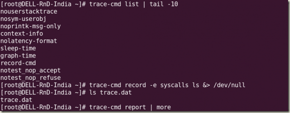
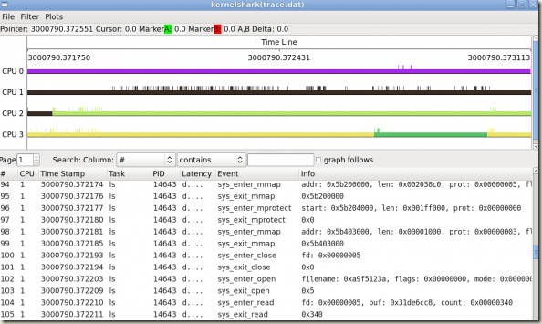

<!-- @import "[TOC]" {cmd="toc" depthFrom=1 depthTo=6 orderedList=false} -->

<!-- code_chunk_output -->

- [1. 介绍](#1-介绍)
- [2. 安装](#2-安装)
- [3. trace-cmd -h](#3-trace-cmd--h)
- [4. trace-cmd record](#4-trace-cmd-record)
- [5. 正确发送 ctrl+c](#5-正确发送-ctrlc)
- [6. 参考](#6-参考)

<!-- /code_chunk_output -->

# 1. 介绍

`trace-cmd` 和 开源的 `kernelshark`(GUI 工具) 均是内核`Ftrace` 的前段工具, 用于分分析核性能.

他们相当于是一个 `/sys/kernel/debug/tracing` 中文件系统接口的封装, 为用户提供了更加直接和方便的操作.

trace-cmd 是由 Steven Rostedt 在 2009 年发在 LKML 上的, 它可以让操作跟踪器更简单. 以下几步是获取最新的版本并装在你的系统上, 包括它的 GUI 工具 KernelShark.

```
wget http://ftp.be.debian.org/pub/linux/analysis/trace-cmd/trace-cmd-1.0.5.tar.gz

tar -zxvf trace-cmd-1.0.5.tar.gz

cd trace-cmd*

make

make gui # compiles GUI tools (KernelShark)[3]

make install

make install_gui # installs GUI tools
```

有了 trace-cmd, 跟踪将变得小菜一碟(见图 6 的示例用法):

```
trace-cmd list ##to see available events

// 收集
trace-cmd record -e syscalls ls ##Initiate tracing on the syscall 'ls'

##(A file called trace.dat gets created in the current directory.)

// 解析结果
trace-cmd report ## displays the report from trace.dat
```



通过上面的 make install_gui 命令安装的 KernelShark 可以用于分析 trace.dat 文件中的跟踪数据, 如图 7 所示.



# 2. 安装

```
git clone git://git.kernel.org/pub/scm/linux/kernel/git/rostedt/trace-cmd.git trace-cmd

cd trace-cmd

make && sudo make install
```

注: trace-cmd 也是受 tracing 目录下配置影响的, 所以使用之前确保清除本身所有配置项

# 3. trace-cmd -h

```
# trace-cmd -h

trace-cmd version 2.9.dev (a000c8831054acf53ec7348e0a7edf8d828187d7)

usage:
  trace-cmd [COMMAND] ...

  commands:
     将系统当前的 trace 保存到 trace.dat 中
     record - record a trace into a trace.dat file
     start 和 stop 配置使用, 用于开始停止录制
     start - start tracing without recording into a file
     extract - extract a trace from the kernel
     stop - stop the kernel from recording trace data
     restart - restart the kernel trace data recording
     读取 /sys/kernel/debug/tracing/trace
     show - show the contents of the kernel tracing buffer
     重置所有 ftrace 的设置和 ring buffer 复位
     reset - disable all kernel tracing and clear the trace buffers
     clear - clear the trace buffers
     report - read out the trace stored in a trace.dat file
     实时在 shell 中显式 ftrace 结果
     stream - Start tracing and read the output directly
     profile - Start profiling and read the output directly
     对 trace.dat 显式统计信息
     hist - show a histogram of the trace.dat information
     显示当前 ftrace 的 events、ring buffer 等情况
     stat - show the status of the running tracing (ftrace) system
     split - parse a trace.dat file into smaller file(s)
     options - list the plugin options available for trace-cmd report
     listen - listen on a network socket for trace clients
     显示当前 ftrace 支持的 events、tracers、options
     list - list the available events, plugins or options
     restore - restore a crashed record
     snapshot - take snapshot of running trace
     echo 1 > /proc/sys/kernel/stack_tracer_enabled 打开 stack_tracer, 然后 trace-cmd stack 查看
     stack - output, enable or disable kernel stack tracing
     check-events - parse trace event formats
     dump - read out the meta data from a trace file
```

trace-cmd record 开始记录, ctrl+c 停止记录并保存到 trace.dat 中.

还可以通过`trace-cmd reset`对各种设置进行复位, 然后`trace-cmd start`进行录制, `trace-cmd stop`停止录制, `trace-cmd extract`将数据保存到 trace.dat 中.

# 4. trace-cmd record

trace-cmd record 用于录制 ftrace 信息, 通过如下选项可以指定只跟踪**特定 traceevents**, 或者跟踪**特定 pid**、或者跟踪**特定 funtion/function_graph 函数**.

还可以设置 cpumask、ringbuffer 大小等等.

```
# trace-cmd record -h

trace-cmd version 2.9.dev (a000c8831054acf53ec7348e0a7edf8d828187d7)

usage:
 trace-cmd record [-v][-e event [-f filter]][-p plugin][-F][-d][-D][-o file] \
           [-q][-s usecs][-O option ][-l func][-g func][-n func] \
           [-P pid][-N host:port][-t][-r prio][-b size][-B buf][command ...]
           [-m max][-C clock]
          指定只抓取某一事件或者某一类型事件
          -e run command with event enabled
          -f filter for previous -e event
          -R trigger for previous -e event
          -p run command with plugin enabled
          -F filter only on the given process
          只跟踪某一个 pid
          -P trace the given pid like -F for the command
          -c also trace the children of -F (or -P if kernel supports it)
          -C set the trace clock
          -T do a stacktrace on all events
          下面这 5 个选项对应 ftrace 的设置 set_ftrace_filter、set_graph_function、set_ftrace_notrace、buffer_size_kb、tracing_cpumask
          -l filter function name
          -g set graph function
          -n do not trace function
          -m max size per CPU in kilobytes
          -M set CPU mask to trace
          -v will negate all -e after it (disable those events)
          -d disable function tracer when running
          -D Full disable of function tracing (for all users)
          指定输出文件名
          -o data output file [default trace.dat]
          -O option to enable (or disable)
          -r real time priority to run the capture threads
          默认 1ms 保存一次数据, 加大有利于将此操作频率. 1000000 变成 1s 写一次数据.
          -s sleep interval between recording (in usecs) [default: 1000]
          -S used with --profile, to enable only events in command line
          -N host:port to connect to (see listen)
          -t used with -N, forces use of tcp in live trace
          改变 ring buffer 大小
          -b change kernel buffersize (in kilobytes per CPU)
          -B create sub buffer and following events will be enabled here
          -k do not reset the buffers after tracing.
          -i do not fail if an event is not found
          -q print no output to the screen
          --quiet print no output to the screen
          --module filter module name
          --by-comm used with --profile, merge events for related comms
          --profile enable tracing options needed for report --profile
          --func-stack perform a stack trace for function tracer
             (use with caution)
          --max-graph-depth limit function_graph depth
          --cmdlines-size change kernel saved_cmdlines_size
          --no-filter include trace-cmd threads in the trace
          --proc-map save the traced processes address map into the trace.dat file
          --user execute the specified [command ...] as given user
```

如下表示只记录`sched_switch`和`sched_wakeup`两个事件, 每 1s 写入一次数据.

```
trace-cmd record -e sched_switch -e sched_wakeup -s 1000000
```

# 5. 正确发送 ctrl+c

在使用 trace-cmd record 记录事件的时候, 通过 ctrl+c 可以停止记录.

但是如果在 adb shell 中, ctrl+c 可能优先退出了 shell, 而没有正常停止 trace-cmd record.

最终在目录下只有 trace.dat.cpuX 的文件, 这些文件是中间文件, kernelshark 是无法解析的

解决方法有两种, 一是在串口 console 中 ctrl+c, 另一种是通过 kill 发送 SIGINT 信号 kill -2 pid.

# 6. 参考

[trace-cmd: A front-end for Ftrace](https://lwn.net/Articles/410200/)

trace-cmd - command line reader for ftrace: https://lwn.net/Articles/341902/

https://blog.csdn.net/weixin_44410537/article/details/103587609