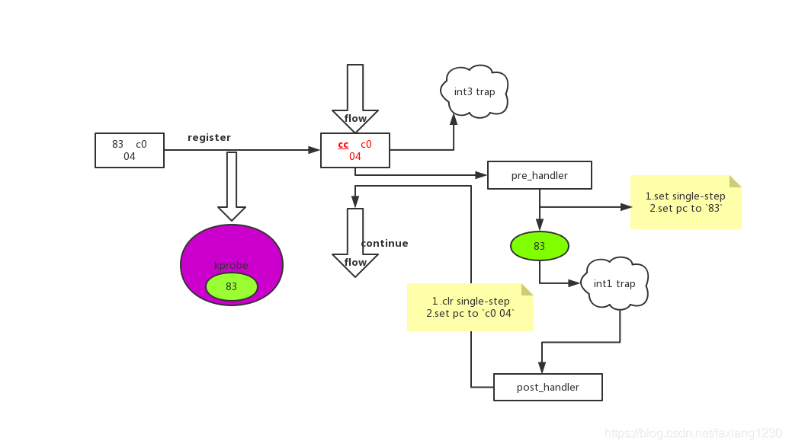
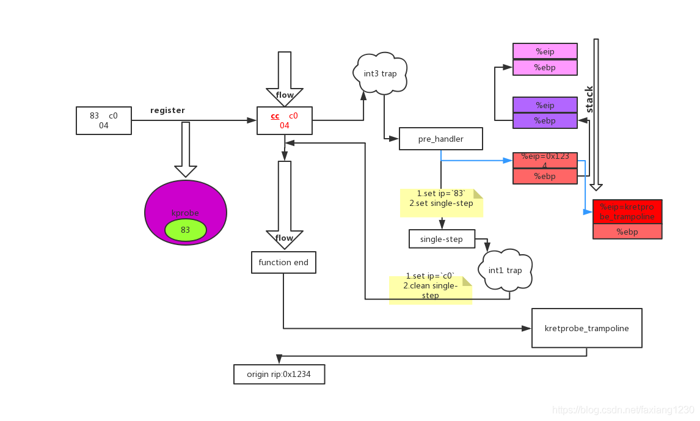
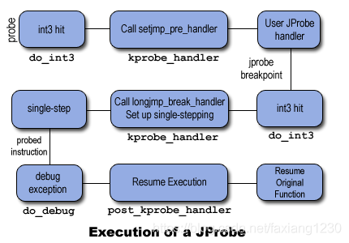
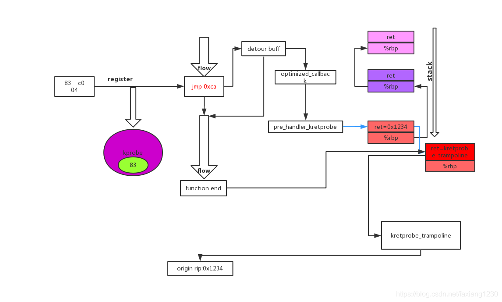

<!-- @import "[TOC]" {cmd="toc" depthFrom=1 depthTo=6 orderedList=false} -->

<!-- code_chunk_output -->

- [1. kprobe 实现原理](#1-kprobe-实现原理)
  - [1.1. kprobes](#11-kprobes)
  - [1.2. kretprobes](#12-kretprobes)
  - [1.3. jprobes](#13-jprobes)
  - [1.4. 优化 kprobe](#14-优化-kprobe)
    - [1.4.1. 优化准备](#141-优化准备)
    - [1.4.2. 优化之后的 kretprobe](#142-优化之后的-kretprobe)
  - [1.5. kprobes 的注意事项](#15-kprobes-的注意事项)

<!-- /code_chunk_output -->

# 1. kprobe 实现原理

下面将会尝试从一个概括的角度看一个 probe 怎么工作的, 介绍一个 probe 代表一个断点和断点触发后所要调用的函数.

## 1.1. kprobes

一个 kprobe 点可以有`pre_handler`和`post_handler`, 分别在**指令执行前**和**执行后**被调用, 我们可以通过**保存的寄存器**还原出在原始函数中代表的参数, 在函数入口处还比较容易, 如果在函数中间插入一个 kprobe, 要还原出有意义的参数内容需要对汇编部分有较深的了解.

先从一个图整体看它是如何工作的:



1. **系统初始化**的时候会**注册中断处理**, 在 x86 上会有**两个 trap**: `int1`和`int3`, 处理方法分别是`do_debug`和`do_int3`, 这是 kprobe 在 x86 上实现的基石.
2. 注册一个 kprobe 到指定指令位置, 它会生成一个 kprobe 对象, 做一些保存工作
    * 保存 1 byte 指令信息到 kprobe
    * 替换指令为`0xcc`
3. 当该位置的指令执行的时候, 触发了`int3`, 之后就会找到该位置信息**对应的 kprobe**, 执行`pre_handler`, 之后设置成`single_step`(gdb 中的单步执行), **执行原始的指令**, 执行一条指令后触发了`int1`,之后找到对应的 kprobe,执行`post_handler`
4. 清除`single-step`, 将 rip 指向 probe 点的下一条指令

## 1.2. kretprobes

先看一个比较低效的图, 这种方式只是早期实现的, 应该从 OPTPROBES 之后在 x86 上已经被优化实现了:



kretprobe 的实现核心仍然是利用 kprobe 机制, 用户可以定义一个 entry_handler 和一个 handler,其中 entry_handler 会在函数入口处被调用, 而 handler 会在函数退出的时候被调用.
kretprobe 会注册成一个只有 pre-handler 的 kprobe, pre-handler 是由 kretprobe 自定实现的 pre_handler_kretprobe,它会负责大部分的工作.

1.注册成一个 kprobe,当执行流触发 int3 trap 时, 会执行他的 pre-handler:pre_handler_kretprobe,执行 entry_handler,保存真实的函数返回地址, 替换函数返回地址为 kretprobe_trampoline, 这样函数返回的时候先返回我们的 trampoline, 之后才由 trampoline 返回到原始的 caller.

2.之后经过 single-step 过程, 执行一条指令, 尝试 post_handler,这里为空, 所以什么也不做, 直接清除 single-step,继续回到原始的 callee 处执行

3.当 callee 返回时, 从栈上取出返回地址, 这个已经被掉包了:kretprobe_trampoline(蹦床),首先处理用户定义的 handler,之后它会找到真实的返回地址并设置回来, 这样在 trampoline 函数退出的时候, 就能通过校正后的返回地址回归到正常的执行流了.

但是实际上这种方式已经被优化掉了, 现在的实现看下面经过`优化过的 kretprobe`.

## 1.3. jprobes



JProbe 仍然是使用的 kprobe 的机制, 但是这个过程相对来说就比较绕了,原图.

首先 jprobe 要求用户定义和需要 probe 相同的原型函数, 这样就不需要分析寄存器就能简单地获取到可读参数的内容.

jprobe 中对参数的操作不会对原始函数传入的参数造成影响, 它所做的操作都是基于原始参数的一份拷贝上, 但是只是一个拷贝,而且还是浅拷贝,所以仍然可以操作参数指针所指向的内存区域.

jprobe 没有要求用户定义 pre-handler 而是自己定义了一个 pre-handler:setjmp_pre_handler 和另外一个 break_heandler:longjmp_break_handler.

jprobe 的实现过程可以简单划分成这三个阶段:

1.在函数起始地址处进行 kprobe 的指令替换, 执行到这的时候会触发 int3,之后就是 do_int3->kprobe_int3_handler->setjmp_pre_handler,它保存栈的内容和寄存器内容, 之后设置"返回地址=用户定义的 handler",最终 pre-handler 返回 1,这就不会设置 single-step 模式. 在返回之后根据栈上的返回地址就会跳转到用户定义的 handler,因为栈的排布和寄存器内容都是完全相同的(除了 rip),这样就完全可以访问原始函数的参数. 当用户定义的函数结束后需要通过 jprobe_return 的方式返回而不是通常的 ret.

2.在上面 jprobe_return 中, 它将栈恢复到原始函数的那一帧(更改 rsp), 将拷贝的栈帧扔掉, 之后主动 int3 再次陷入异常, kprobe_int3_handler 发现断点地址是用户定义的函数地址, 并没有对应的注册的 probe,而且当前 cpu 的 kprobe 正在激活状态, 它把这种状态认为是 Jprobe 产生的, 随后调用当前 cpu kprobe 的 break_handler:longjmp_break_handler,恢复栈和寄存器的内容

3.典型的设置 single-step 模式执行被替换的指令, 之后陷入 int1,清除该模式,恢复到原始的执行流

## 1.4. 优化 kprobe

通过上面的看到, 每次都要经过 trap 过程, 这个过程比较耗时, 所以有了优化的 kprobe,会优化成 jmp 指令跳转到 kprobe 处理处, 但是不是所有的 probe 都可以优化成这种形式.

在优化前需要进行安全检查,不符合条件不可以进行优化

1. jmp + 偏移的方式, 目前偏移为 32bit,所以共占据 5 个字节, 可能会占据原来多条指令的位置, 所以可能会截断原来的指令, 这段被优化区域不能跨越函数.
2. 不能有跳转到这块要被优化区域的指令,这块区域将会被 jmp 覆盖,指令都已经换了, 再 jmp 过来按照原来的语义来解释这段指令, 能不异常吗, 结果可能是重复跳转到 kprobe 处理, 也有可能遭遇指令异常
    1. 这个函数不能包含非直接跳转
    2. 函数不能包含有触发异常的指令, 例如 0xcc, 另外也不能有访问异常表范围内的操作
    3. 没有近跳转到被优化区域的指令
3. 被优化区域的每条指令都可以单独执行

### 1.4.1. 优化准备
kprobe 准备一个 detour 的 buffer,里面要包含如下功能的指令:

* 能够将 cpu 寄存器压栈(模拟 int3 的 trap 过程)
* 调用 trampoline 的函数, 完成原始的 kprobe 逻辑过程, 调用用户定义的 handler
* 恢复寄存器
* 被优化区域的指令拷贝到 buffer 中
* 跳转回原始执行流的代码

如果 kprobe 注册时有下面的情况, 也是不能优化的

* 包含 break_handler 或者 post_handler,例如 jprobe 中用户没有设置这两个 handler,但是 jprobe 在以 kprobe 形式管理的时候它设置了 break_handler,所以它是不能被优化的.
* 处于被优化区域内有其他的指令已经被 probe 了
* 这个 probe 处于 disable 的状态, 就是没有激活

如果 kprobe 可以被优化, Kprobes 会将 kprobe 加入到待优化链表, 然后启动 kprobe-optimizer 工作队列来优化它. 如果在优化前已经触发了 trap,会通过设置到 detour buffer 中指令, 这样可以避免未优化时的 single-step,也就是放弃这次的触发捕捉.
Kprobe-optimizer 并不会立即插入 jmp 指令, 而是先调用 synchronize_sched()等待进入一个安全的上下文, 因为很可能在执行待优化区域代码的过程中被中断. CONFIG_PREEMPT=n 配置下 synchronize_sched()可以保证在它返回的时候所有的中断都是打开的,所以优化的前提就是只在 CONFIG_PREEMPT=n 配置的内核上.

之后会调用 stop_machine()来用 jmp 指令来替代优化区域, 指向 detour buffer 中的指令.

恢复优化区域的代码:
当优化过的 kprobe 被注销,disable 或者被其他的 kprobe 阻塞时, 都会解除优化. 如果优化还没有完成, 只需要从待优化队列中删除就可以了. 如果优化已经完成, 需要使用 text_poke_smp()来将原来的指令拷贝回来, 并且第一个字节恢复成 int3,就是恢复成未优化的状态.

这种安全优化的检查可能会被 ksplice 在支持 CONFIG_PREEMPT=y 的内核上使用的 stop-machine 方式取代掉.

对于 geeker 来说,经过优化之后会对 hacker 的方法有些影响

使用 jmp 来优化的方式会和原来没有优化的 pre_handler 行为表现有差异, 在没有优化的情况下, pre_handler 通过改变 regs->ip 并且返回 1 的方式可以改变内核的执行路径,即完成劫持. 但是当被优化后, 这种方式就失效了. 所以如果你想改变内核执行流, 需要抑制这种优化:

1. 指定不做任何事的函数给 post_handler 或者 break_handler
2. 通过`sysctl -w debug.kprobes_optimization=n`来显式阻止优化

### 1.4.2. 优化之后的 kretprobe



经过优化的 kretprobe 过程如上图所示:

在插入 probe 点之后对其进行了优化:

为 kprobe 关联一个 optimized_kprobe 对象, 它有一个 detour buffer,保存有一段指令, 之后是通过 jmp 跳转回原始函数.

这段指令是经过组装而来的, 最初是保存在代码段中, 是一段指令范式, 但是预留了一些空间(就和小学中的填空题一样, 有主题上下文, 有些空白的地方预留给学生写)可以动态填写地址.

优化的主要过程:

1. 获取一段可执行的内存
2. 直接复制这段指令到内存
3. 这里面有些占位指令用来放置动态的地址的, 将地址动态的填充到固定的偏移上, 这样就组装成了一段指令集
4. 之后只需要为它设置可执行属性
5. 刷新 icache

优化之后的执行流

1. 在执行流到 probe 点时, 不再是 int3 trap 而是直接 jmp 到 detour buff 中, 里面存的是指令, 这段指令分为三个阶段:
    1. 准备工作
    在栈上填充一份 pt_regs,填充寄存器:rdi,rsi 分别指向 optimized_kprobe 对象和 pt_regs
    2. 实际工作
    调用 optimized_callback 这样就能通过 optimized_callback 调用到 kretprobe 的 pre_handler_kretprobe, 设置上一帧的返回地址为:kretprobe_trampoline
    3. 恢复现场
    把栈上保存的寄存器数据恢复到寄存器中,之后 jmp 到被优化区域的下一条指令地址
2. 函数执行完毕后

这部分就和优化前的处理是相同的,通过 kretprobe_trampoline 先将正确的返回地址设置到栈帧中, 然后调用用户注册的 handler,之后 ret 到正确的 caller

## 1.5. kprobes 的注意事项

1. kprobe 允许在同一地址注册多个 kprobes, 但是不能同时在该地址上有多个 jprobes

2. 如果注册了 jprobe 或者带有 post_handler 的 kprobe,这个 probe 点是不会被转化成优化的 probepoint

3. 理论上用户可以在内核的任何位置注册探测点, 设置可以在中断处理函数中注册探测点, 但是也有一些例外的放.

如果用户尝试在实现 kprobe 的代码(包括`kernel/kprobes.c`和`arch/*/kernel/kprobes.c`以及`do_page_fault`和`notifier_call_chain`中注册探测点, `register_*probe`将返回-EINVAL.

4. gcc 可能将一个函数隐式地优化成一个内联函数, 此时向其上注册探测点, kprobe 不会尝试注册, 此时会注册失败, 此时你可能需要检查/proc/kallsyms 或者 System.map.

5. 一个探测点处理函数能够修改被探测函数的上下文, 如修改内核数据结构, 寄存器等. 因此, kprobe 可以用来热升级或进行一些错误注入.

6. 如果一个探测处理函数调用了另一个探测点, 该探测点的处理函数不将运行, 但是它的 nmissed 数将加 1.
多个探测点处理函数或同一处理函数的多个实例能够在不同的 CPU 上同时运行.

7. 除了注册和卸载, kprobe 不会使用 mutexe 或分配内存.

8. 探测点处理函数在运行时是禁止抢占的, 而且在不同的架构上, 探测点处理函数运行时也可能是禁止中断的. 因此, 对于任何探测点处理函数, 不要使用导致睡眠或进程调度的任何内核函数(如尝试获得 semaphore).

9. kretprobe 是通过取代返回地址为预定义的 trampoline 的地址来实现的, 因此栈回溯和 gcc 内嵌函数__builtin_return_address()调用将返回 trampoline 的地址而不是真正的被探测函数的返回地址.

10. 如果一个函数的调用次数与它的返回次数不相同, 那么在该函数上注册的 kretprobe 探测点可能产生无法预料的结果,如果你看到下面的错误提示, 那就是 kprobe 出现了问题, 检查所有 kretprobe 在每个 cpu 上的状态(在处理前和退出后会将 kprobe 保存到`current_kprobe`).

```
kretprobe BUG!: Processing kretprobe d000000000041aa8 @ c00000000004f48c
```

11. 当进入或退出一个函数时, 如果 CPU 正运行在一个非当前任务所有的栈上, 那么该函数的 kretprobe 探测可能产生无法预料的结果, 因此 kprobe 并不支持在 x86_64 上对`__switch_to()`的返回探测, 如果用户对它注册探测点, 注册函数将返回-EINVAL.

总之: 对调用的任何方法检查它的返回值是非常有必要的, 稳健的程序需要对各种异常都能够有处理方法.

[An introduction to KProbes](https://lwn.net/Articles/132196/)

`Documentation/kprobes.txt`

[Kernel- and User- Probes in Linux: Magic?](https://dev.framing.life/tracing/kernel-and-user-probes-magic/)

[Linux 内核 kprobe 机制](http://abcdxyzk.github.io/blog/2013/05/24/debug-kprobe-base/)

[kprobe 工作原理](https://blog.csdn.net/liwg06/article/details/55733132)

[随想录(强大的 kprobe)](http://blog.csdn.net/feixiaoxing/article/details/40351811)

[kprobe 原理解析(一)](http://www.cnblogs.com/honpey/p/4575928.html)

[linux kprobe 实现原理](https://blog.csdn.net/faxiang1230/article/details/99328003)

https://www.ibm.com/developerworks/cn/linux/l-cn-systemtap1/

