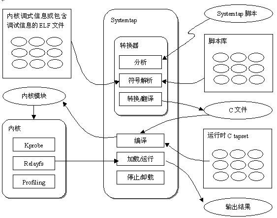

# systemtap 简介

易用性: systemtap 利用 Kprobe 提供的 API 来实现**动态**地**监控和跟踪运行中！！！的 Linux 内核**的工具. 开发者或调试人员**不再**需要**重编译**、**安装新内核**、**重启动**等烦人的步骤.

灵活性: 相比 kprobe, 开发者或调试人员**只需要写一些脚本**, 然后通过 SystemTap 提供的**命令行接口**就可以对**正在运行的内核**进行诊断调试.

因此, SystemTap 与其说是工具, 还不如说是一个允许你开发自己的特定于内核的收集和监视工具的系统.

## Solaris 中的 DTrace

`SystemTap` 与一种名为 `DTrace` 的老技术相似, `DTrace`技术源于 `Sun Solaris` 操作系统. 在 `DTrace` 中, 开发人员可以用 **D 编程语言**(`C` 语言的子集, 但修改为**支持跟踪行为**)编写脚本. `DTrace` 脚本包含**许多探针**和**相关联的操作**, 这些操作在探针 "触发" 时发生. 例如, 探针可以表示简单的系统调用, 也可以表示更加复杂的交互, 比如执行特定的代码行

`DTrace` 是 `Solaris` 最引人注目的部分, 所以在其他操作系统中开发它并不奇怪. `DTrace` 是在 `Common Development and Distribution License (CDDL)` 之下发行的, 并且被移植到 `FreeBSD` 操作系统中.

## IBM AIX 中的 ProbeVue

另一个非常有用的内核跟踪工具是 `ProbeVue`, 它是 `IBM` 为 `IBM® AIX®` 操作系统 `6.1` 开发的. 您可以使用 `ProbeVue` 探查**系统**的**行为**和**性能**, 以及提供**特定进程的详细信息**. 这个工具使用一个标准的内核**以动态的方式进行跟踪**.

## Linux 中的 SystemTap

考虑到 `DTrace` 和 `ProbeVue` 在各自的操作系统中的巨大作用, 为 `Linux` 操作系统策划一个实现该功能的开源项目是势不可挡的. `SystemTap` 从 `2005` 年开始开发, 它提供与 `DTrace` 和 `ProbeVue` 类似的功能. 许多社区还进一步完善了它, 包括 `Red Hat`、`Intel`、`Hitachi` 和 `IBM` 等.

这些解决方案在功能上都是类似的, 在**触发探针**时**使用探针**和**相关联的操作脚本**.

# 安装

`./01-intall/README`

* Linux 下的一个全新的性能测量和调式诊断工具 Systemtap, 第 1 部分, kprobe, kprobe 的原理、编程接口、局限性和使用注意事项: https://www.ibm.com/developerworks/cn/linux/l-cn-systemtap1/
* Linux 下的一个全新的性能测量和调式诊断工具 Systemtap, 第 2 部分, DTrace, DTrace 的原理: https://www.ibm.com/developerworks/cn/linux/l-cn-systemtap2/
* Linux 下的一个全新的性能测量和调式诊断工具 Systemtap, 第 3 部分, Systemtap, Systemtap 的原理, Systemtap 与 DTrace 比较, 以及安装要求和安装步骤: http://www.ibm.com/developerworks/cn/linux/l-cn-systemtap3/

https://www.ibm.com/developerworks/cn/linux/l-systemtap/

官方首页: https://sourceware.org/systemtap/

[Systemtap 官方-Wiki](https://sourceware.org/systemtap/wiki)

[Systemtap 官方-Documentation](https://sourceware.org/systemtap/documentation.html)

[Systemtap 官方使用手册](https://sourceware.org/systemtap/SystemTap_Beginners_Guide/)

[官方 Language Reference](https://sourceware.org/systemtap/langref/)

[SystemTap 知识(一)](http://www.cnblogs.com/yjf512/p/3286429.html)

[内核探测工具 systemtap 简介](http://www.cnblogs.com/hazir/p/systemtap_introduction.html)

[华的专栏--Systemtap](http://blog.csdn.net/wh8_2011/article/category/6233902)

[Systemtap 语言详解](http://blog.csdn.net/linyt/article/category/645022)

[IBM RedBook Systemtap](http://www.redbooks.ibm.com/abstracts/redp4469.html)

[Debian Systemtap Package](https://packages.qa.debian.org/s/systemtap.html)

[使用 systemtap 调试 Linux 内核](http://www.tuicool.com/articles/a6fYnyY)
http://www.aikaiyuan.com/8862.html

[centos7 systemtap 介绍](http://www.fx114.net/qa-131-159851.aspx)

http://blog.csdn.net/trochiluses/article/details/9698449

[如何在 ubuntu 上基于自定义内核安装 systemtap](http://blog.csdn.net/trochiluses/article/details/9698449)

[Optional: Installing on a custom kernel](https://www.ibm.com/support/knowledgecenter/linuxonibm/liaai.systemTap/liaaisystapcustom.htm)

[SystemTap----常用变量、宏、函数和技巧](http://blog.csdn.net/justlinux2010/article/details/10050265)

[systemtap 常用内置函数](http://zhengheng.me/2015/02/11/systemtap-useful-functions/)

[systemtap 初试用](http://www.lenky.info/archives/2013/02/2200)

[centos7 systemtap 介绍](http://www.fx114.net/qa-131-159851.aspx)

[甲骨文发布 DTrace for Linux beta 版](http://linux.solidot.org/article.pl?sid=12/02/23/0328206)

[甲骨文发布其 Linux 内核更新 动态跟踪框架 Dtrace 备受瞩目](http://tm.eefocus.com/article/12-03/2075521332161792.html)

https://lists.linux-foundation.org/pipermail/ksummit-2008-discuss/2008-June/000192.html

http://dtrace.org/blogs/ahl/2011/10/05/dtrace-for-linux-2/

http://redmonk.com/sogrady/2008/07/01/dtrace-vs-systemtap-redux/

[使用 systemtap 调试 Linux 内核](http://www.lenky.info/archives/2013/02/2209)

http://www.cnblogs.com/hazir/p/systemtap_introduction.html

https://www.ibm.com/developerworks/cn/linux/l-cn-systemtap3/

[SystemTap 学习笔记 - 安装篇](https://segmentfault.com/a/1190000000671438)

[Linux 自检和 SystemTap 用于动态内核分析的接口和语言](https://www.ibm.com/developerworks/cn/linux/l-systemtap/)

[Brendan's blog Using SystemTap](http://dtrace.org/blogs/brendan/2011/10/15/using-systemtap/)

[内核调试神器 SystemTap — 简介与使用(一)](http://blog.csdn.net/zhangskd/article/details/25708441)

[内核探测工具 systemtap 简介](http://www.cnblogs.com/hazir/p/systemtap_introduction.html)

[SystemTap Beginner](http://blog.csdn.net/kafeiflynn/article/details/6429976)

[使用 systemtap 调试 linux 内核](http://blog.csdn.net/heli007/article/details/7187748)

[Ubuntu Kernel Debuginfo](http://ddebs.ubuntu.com/pool/main/l/linux)

[Linux 下的一个全新的性能测量和调式诊断工具 Systemtap, 第 3 部分: Systemtap](https://www.ibm.com/developerworks/cn/linux/l-cn-systemtap3/)
