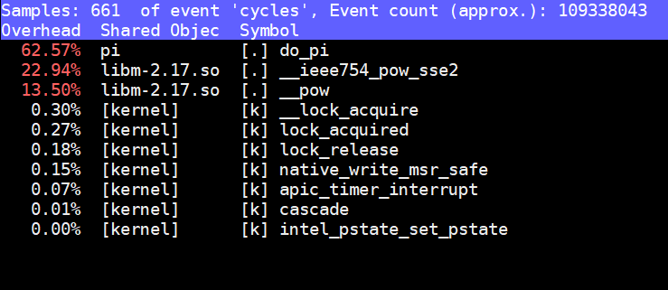
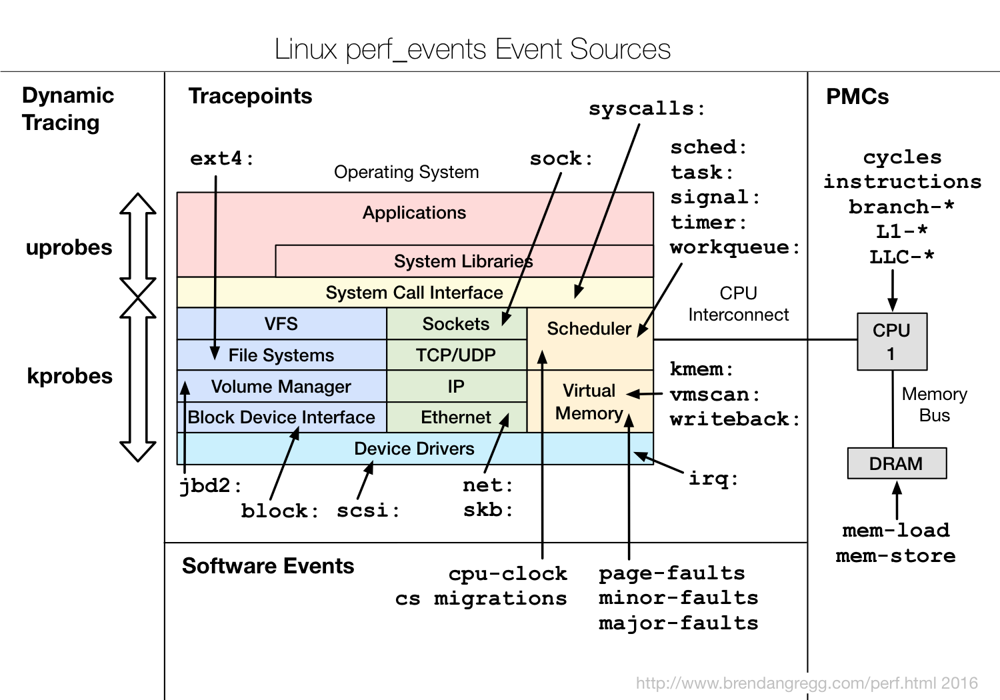
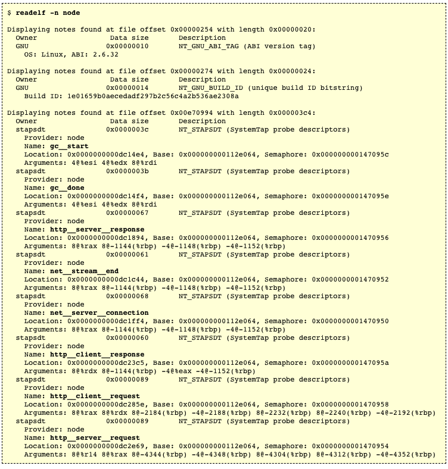
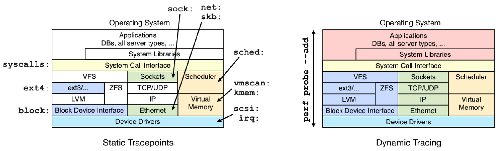
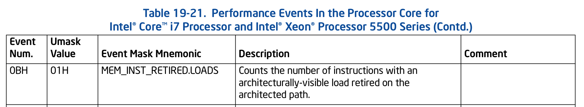
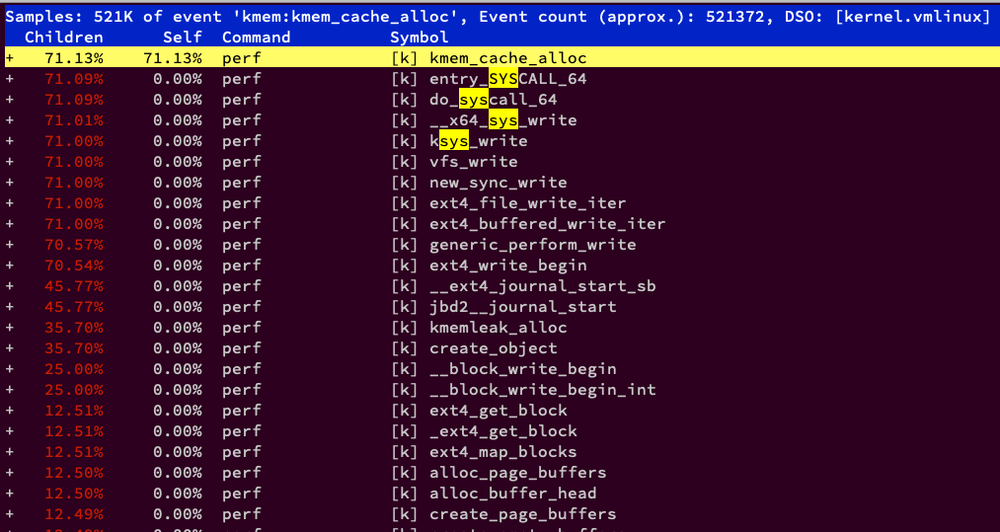
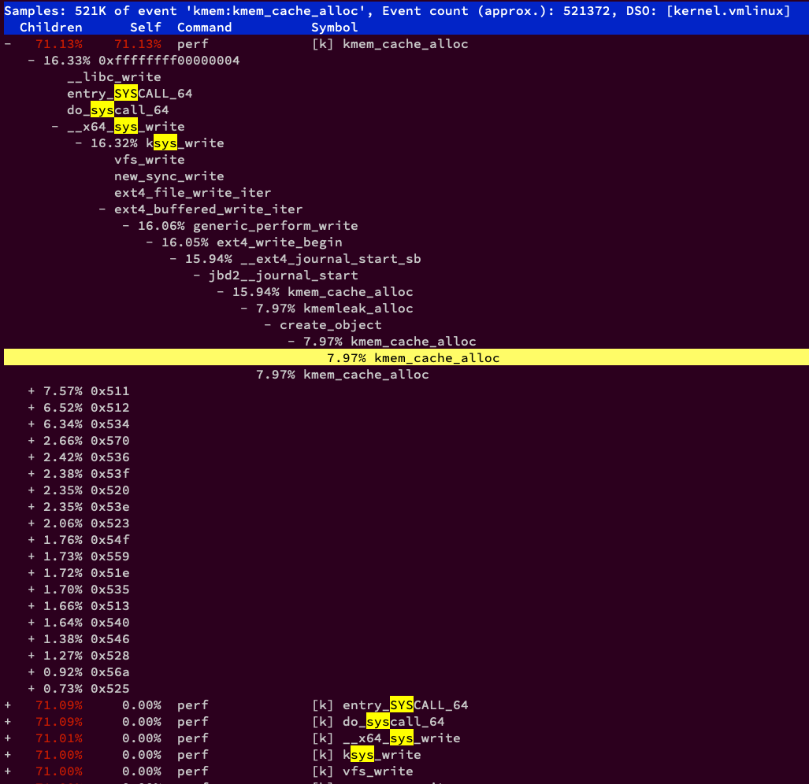
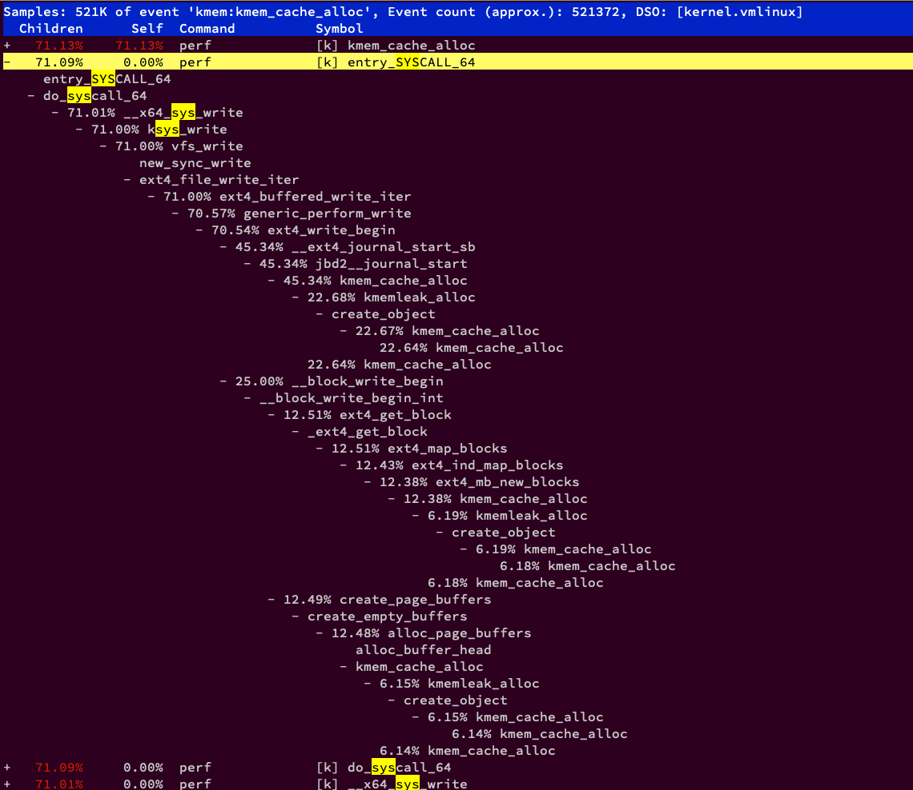
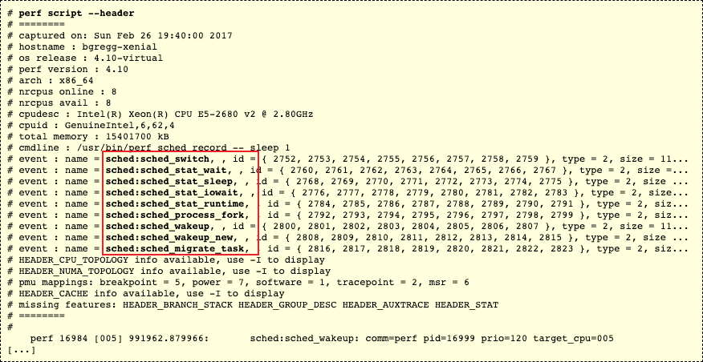
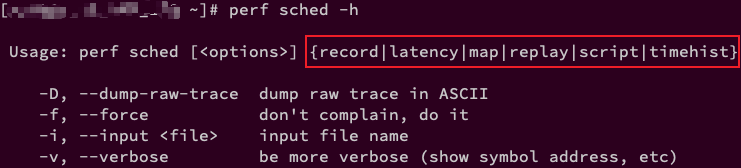

<!-- @import "[TOC]" {cmd="toc" depthFrom=1 depthTo=6 orderedList=false} -->

<!-- code_chunk_output -->

- [1. 系统级性能优化](#1-系统级性能优化)
- [2. Perf 简介](#2-perf-简介)
  - [2.1. 基本原理](#21-基本原理)
  - [2.2. 简单示例 1](#22-简单示例-1)
    - [2.2.1. cycles 原理](#221-cycles-原理)
  - [2.3. 简单示例 2](#23-简单示例-2)
- [3. 功能和使用](#3-功能和使用)
  - [3.1. 功能概述](#31-功能概述)
  - [3.2. 功能列表](#32-功能列表)
  - [3.3. 特殊功能](#33-特殊功能)
  - [3.4. 监控范围](#34-监控范围)
  - [3.5. 使用方法](#35-使用方法)
    - [3.5.1. 3 种工作模式](#351-3-种工作模式)
      - [3.5.1.1. counting (计数)](#3511-counting-计数)
      - [3.5.1.2. sampling (采样)](#3512-sampling-采样)
      - [3.5.1.3. bpf (动态插入)](#3513-bpf-动态插入)
    - [3.5.2. 性能分析的 3 个过程](#352-性能分析的-3-个过程)
    - [3.5.3. 减少 overhead](#353-减少-overhead)
  - [3.6. 使用示例](#36-使用示例)
- [4. 一行命令](#4-一行命令)
  - [4.1. 三种类型命令](#41-三种类型命令)
  - [4.2. Listing Events: 列出事件](#42-listing-events-列出事件)
  - [4.3. Counting Events: 事件计数](#43-counting-events-事件计数)
  - [4.4. Profiling: 采样数据](#44-profiling-采样数据)
  - [4.5. Static Tracing: 静态跟踪](#45-static-tracing-静态跟踪)
  - [4.6. Dynamic Tracing: 动态追踪](#46-dynamic-tracing-动态追踪)
  - [4.7. Mixed: 混合使用](#47-mixed-混合使用)
  - [4.8. Special: 特殊命令](#48-special-特殊命令)
  - [4.9. Reporting: 数据报告](#49-reporting-数据报告)
- [5. Brendan 的演示示例](#5-brendan-的演示示例)
- [6. 调试信息](#6-调试信息)
  - [6.1. Symbols: 符号表](#61-symbols-符号表)
  - [6.2. JIT 符号表 (Java, Node.js)](#62-jit-符号表-java-nodejs)
  - [6.3. Stack Traces: 堆栈追踪](#63-stack-traces-堆栈追踪)
    - [6.3.1. Frame Pointer: 编译不让忽略 frame pointer](#631-frame-pointer-编译不让忽略-frame-pointer)
    - [6.3.2. Dwarf: 用户级释放堆栈](#632-dwarf-用户级释放堆栈)
    - [6.3.3. LBR: 硬件能力](#633-lbr-硬件能力)
    - [6.3.4. 小结](#634-小结)
- [7. Perf 性能事件](#7-perf-性能事件)
  - [7.1. 六种类型事件](#71-六种类型事件)
  - [7.2. perf list 查看所有性能事件](#72-perf-list-查看所有性能事件)
    - [7.2.1. 事件限定符](#721-事件限定符)
  - [7.3. Hardware Events(PMCs): 硬件性能事件](#73-hardware-eventspmcs-硬件性能事件)
  - [7.4. Software Events: 软件性能事件](#74-software-events-软件性能事件)
    - [7.4.1. 采样周期](#741-采样周期)
  - [7.5. Kernel Tracepoints: 内核态静态 tracepoints](#75-kernel-tracepoints-内核态静态-tracepoints)
    - [7.5.1. tracepoints 分组](#751-tracepoints-分组)
  - [7.6. User-Level Statically Defined Tracing (USDT): 用户态静态 tracepoint](#76-user-level-statically-defined-tracing-usdt-用户态静态-tracepoint)
  - [7.7. Dynamic Tracing: 动态追踪](#77-dynamic-tracing-动态追踪)
- [8. 几种类型的性能分析](#8-几种类型的性能分析)
  - [8.1. CPU Statistics(CPU 静态统计): perf stat](#81-cpu-statisticscpu-静态统计-perf-stat)
    - [8.1.1. CPU 微架构](#811-cpu-微架构)
    - [8.1.2. Detailed Mode: 详细模式](#812-detailed-mode-详细模式)
    - [8.1.3. Specific Counters: 具体计数器](#813-specific-counters-具体计数器)
    - [8.1.4. Raw Counters: 处理器支持的原始计数器](#814-raw-counters-处理器支持的原始计数器)
    - [8.1.5. Other Options: 其他选项](#815-other-options-其他选项)
  - [8.2. Timed Profiling: 定时间隔剖析](#82-timed-profiling-定时间隔剖析)
    - [8.2.1. CPU Profiling](#821-cpu-profiling)
    - [8.2.2. sampling: 采样](#822-sampling-采样)
    - [8.2.3. process: 处理](#823-process-处理)
  - [8.3. Event Profiling: 一定事件数量间隔剖析](#83-event-profiling-一定事件数量间隔剖析)
    - [8.3.1. 性能事件指定错误](#831-性能事件指定错误)
    - [8.3.2. Skew 和 PEBS: 指令偏移和 PEBS 基于采样的精确事件](#832-skew-和-pebs-指令偏移和-pebs-基于采样的精确事件)
    - [8.3.3. 性能事件的精度级别](#833-性能事件的精度级别)
  - [8.4. Static Kernel Tracing: 内核态静态追踪](#84-static-kernel-tracing-内核态静态追踪)
    - [8.4.1. Counting Syscalls: 系统调用计数](#841-counting-syscalls-系统调用计数)
      - [8.4.1.1. perf 和 strace 对比](#8411-perf-和-strace-对比)
    - [8.4.2. New Processes: 追踪新建一个进程](#842-new-processes-追踪新建一个进程)
    - [8.4.3. Outbound Connections: 出站网络连接](#843-outbound-connections-出站网络连接)
    - [8.4.4. Socket Buffers:](#844-socket-buffers)
  - [8.5. Static User Tracing: 用户态静态追踪](#85-static-user-tracing-用户态静态追踪)
  - [8.6. Dynamic Tracing: 动态追踪](#86-dynamic-tracing-动态追踪)
    - [8.6.1. Kernel: tcp_sending(): 某个内核函数](#861-kernel-tcp_sending-某个内核函数)
    - [8.6.2. Kernel: tcp_sendmsg() with size: 获取内核变量](#862-kernel-tcp_sendmsg-with-size-获取内核变量)
    - [8.6.3. Kernel: tcp_sendmsg() line number and local variable: 内核函数某一行跟踪点和局部变量](#863-kernel-tcp_sendmsg-line-number-and-local-variable-内核函数某一行跟踪点和局部变量)
    - [8.6.4. User: malloc(): 用户态函数](#864-user-malloc-用户态函数)
    - [8.6.5. User: malloc() with size:](#865-user-malloc-with-size)
  - [8.7. Scheduler Analysis: 调度器分析](#87-scheduler-analysis-调度器分析)
    - [8.7.1. perf sched record: 数据采样](#871-perf-sched-record-数据采样)
    - [8.7.2. perf script --header: 查看数据文件中的事件](#872-perf-script--header-查看数据文件中的事件)
    - [8.7.3. 对数据文件进行分析](#873-对数据文件进行分析)
      - [8.7.3.1. perf sched latency: 调度延迟分析](#8731-perf-sched-latency-调度延迟分析)
      - [8.7.3.2. perf sched map:](#8732-perf-sched-map)
      - [8.7.3.3. perf sched timehist](#8733-perf-sched-timehist)
      - [8.7.3.4. perf sched script](#8734-perf-sched-script)
      - [8.7.3.5. perf sched replay](#8735-perf-sched-replay)
  - [8.8. eBPF](#88-ebpf)
    - [8.8.1. Prerequisites: 前提条件](#881-prerequisites-前提条件)
    - [8.8.2. kmem_cache_alloc from Example: 函数示例](#882-kmem_cache_alloc-from-example-函数示例)
    - [8.8.3. 更多例子](#883-更多例子)
- [9. Visualizations: 可视化](#9-visualizations-可视化)
  - [9.1. Flame Graphs: 火焰图](#91-flame-graphs-火焰图)
    - [9.1.1. 示例](#911-示例)
    - [9.1.2. 生成](#912-生成)
    - [9.1.3. 管道命令 (Piping)](#913-管道命令-piping)
    - [9.1.4. 过滤](#914-过滤)
  - [9.2. Heat Maps: 热点图](#92-heat-maps-热点图)
- [10. 更多功能](#10-更多功能)
- [11. perf 构建](#11-perf-构建)
  - [11.1. 依赖的包](#111-依赖的包)
  - [11.2. 内核相关 config](#112-内核相关-config)
  - [11.3. 测试](#113-测试)
  - [11.4. 编译](#114-编译)
    - [11.4.1. 静态编译](#1141-静态编译)
  - [11.5. 安装](#115-安装)
- [12. 其他工具](#12-其他工具)
- [13. 资料](#13-资料)
  - [13.1. 帮助文档](#131-帮助文档)
  - [13.2. 相关博客](#132-相关博客)
  - [13.3. 链接](#133-链接)
- [14. 来源](#14-来源)

<!-- /code_chunk_output -->

# 1. 系统级性能优化

系统级性能优化是指为了提高应用程序对操作系统资源与硬件资源的使用 效率, 或者为了提高操作系统对硬件资源的使用效率而进行的代码优化. 通过提高对操作系统资源与硬件资源的利用率, 使得应用程序与基础软硬件平台具有更 好的交互性, 往往可以显著提升应用程序的执行速度和稳定性.

**系统级性能优化**包含**2 个阶段**:

1. **性能剖析**(**performance profiling**): **寻找性能瓶颈**, 查找引发性能问题的原因及热点代码.
2. **代码优化**: 针对具体的性能问题而**优化代码与编译选项**, 以改善软件性能.

在**代码优化阶段**往往需要凭借开发者的经验, 编写简洁高效的代码, 甚至在汇编语言级别合理使用各种指令, 合理安排各种指令的执行顺序.

而在**性能剖析阶段**, 则需要借助于现有的**profiling 工具**, 如 perf, VTune, Oprofile 等.

# 2. Perf 简介

网上很多叫法如`perf_events` , `perf profiler` , `Performance Counters for Linux(Linux 性能计数器, PCL)`. 叫法不同, 都指 perf.

最初的时候, 它叫做 `Performance counter`(**性能计数器**), 在 `2.6.31` 中第一次亮相. 此后他成为内核开发最为活跃的一个领域.

在 `2.6.32` 中它正式改名为 `Performance Event`, 因为 `perf` 已不再仅仅作为 `PMU` 的抽象, 而是能够处理**所有的性能相关**的事件.

## 2.1. 基本原理

性能调优工具如 perf, Oprofile 等的**基本原理**都是对**被监测对象**进行**采样**, 最简单的情形是根据 **tick 中断**进行采样, 即在**tick 中断内触发采样点**, 在采样点里判断程序当时的上下文. 假如一个程序**90% 的时间**都花费在函数`foo()` 上, 那么**90% 的采样点**都应该落在函数 foo() 的上下文中. 运气不可捉摸, 但我想只要采样**频率足够高**, 采样**时间足够长**, 那么以上推论就比较可靠. 因此, 通过 tick 触发采样, 我们便可以了解程序中哪些地方最耗时间, 从而重点分析.

稍微扩展一下思路, 就可以发现**改变采样的触发条件**使得我们可以获得**不同的统计数据**: 以**时间点**(如 tick)作为事件触发采样便可以获知**程序运行时间的分布**. 以**cache miss**事件触发采样便可以知道**cache miss 的分布**, 即 cache 失效经常发生在哪些程序代码中.

Perf 是一个基于内核的子系统, 它提供一个**性能剖析(profiling)框架**.

它以**性能事件**为基础, 基于**对这些性能事件！！！采样！！！** 进行**性能统计**原理, 支持针对**处理器相关性能指标**与**操作系统相关性能指标**的性能剖析, 可用于性能瓶颈的查找与热点代码的定位.

**采样的周期**以**事件的数量来表示**, 而**非基于时间**. 当**目标事件计数溢出指定的数值！！！**, 则**产生一个采样**(针对 **IP** 或者 **stack trace**).

>* IP: 即函数名
>* stack trace: 堆栈信息

> **永远记住这一点**, 所以**采样的数据**就是**事件触发时**的数据(IP 或 stack), 所以如果是基于具体 event(比如 tracepoint), 采样得到的数据信息可能会很相似, 也就是那个 tracepoint 出现位置的调用情况.

## 2.2. 简单示例 1

我们先通过一个例子来看看 perf 究竟能干什么.

程序`[pi.c]`是一个简单的计算 Pi 的 CPU 密集型程序. 很显然, `[pi.c]`的热点在函数`do_pi()`中.

```cpp
#include <stdio.h>
#include <math.h>
#include <sys/types.h>
#include <linux/unistd.h>

int do_pi(double *pi)
{
    double h, sum, x;
    long long n, i;

    n = 5000000;
    h = 1.0/n;
    sum = 0.0;

    for (i = 1; i <= n; i++) {
        x = h * (i - 0.5);
        sum += 4.0 / (1.0 + pow(x,2));
    }

    *pi = h *sum;
    return 0;
}

int main(void)
{
    double pi;

    printf("pid: %d\n", getpid());
    sleep(5);

    if (!do_pi(&pi)) {
        printf("PI is %f\n", pi);
    }
    return 0;
}
```

编译 pi 程序

```
gcc pi.c -lm -o pi
```

运行 pi 程序

```
./pi
```

根据程序显示的 pid 在命令行中执行

```
perf top -p $pid
```

该命令利用**默认的性能事件** "**cycles**" 对`[pi]`进行热点分析.

"cycles"是**处理器周期事件**. 这条命令能够分析出**消耗处理器周期最多的代码**, 在**处理器频率稳定**的前提下, 我们可以认为 perf 给出的**热点代码**就是**消耗时间最多的代码**.

>CPU 周期(cpu-cycles)是默认的性能事件, 所谓的**CPU 周期**是指 CPU 所能识别的**最小时间单元！！！**, 通常为亿分之几秒, 是 CPU 执行最简单的指令时所需要的时间, 例如读取寄存器中的内容, 也叫做`clock tick`.

执行上述命令后, Perf 会给出如下结果:



从上图可以看到, 在`[pi]`程序执行期间, 函数`do_pi()`消耗了 62.57%的 CPU 周期, 是消耗处理器周期最多的热点代码. 这跟我们预想的一样.

### 2.2.1. cycles 原理

那么 Perf 是怎么做到的呢?以`cycles`性能事件为例

首先, perf 会通过系统调用`sys_perf_event_open`在内核中注册一个检测"**cycles**"**事件**的性能计数器. 内核根据 perf 提供的信息在**PMU**上初始化一个**硬件性能计数器**(PMC: Performance Monitoring Counter). **PMC**随着**CPU 周期的增加**而**自动累加**.

> perf top. 默认情况下, **每秒采样 4000 次**. 默认情况下, 2s 刷新一次界面.

在**PMU 溢出**时, PMU 触发一个**PMI**(Performance Monitoring Interrupt)**中断**. 内核在 PMI 中断处理函数中保存**PMC 的计数值**, 触发中断时的**指令地址**(Register IP: Instruction Pointer), **当前时间戳**以及**当前进程**的**PID**, **TID**, **comm**等信息. 我们把这些信息统称为一个**采样**(sample).

内核会将收集到的 sample 放入用于跟**用户空间**通信的`Ring Buffer`. **用于空间**的 perf 分析程序采用**mmap 机制**从 ring buffer 中读入采样, 并对其解析. perf 根据**pid**, comm 等信息可以找到对应的进程. 根据**IP**与**ELF 文件**中的**符号表**可以查找到触发 PMI 中断的指令**所在的函数**. 为了能够使 perf 读到函数名, 我们的目标程序**必须具备符号表**.

如果 perf 在分析结果中**只看到一串地址**, 而**没有对应的函数名**时, 通常是由于在**编译时**利用**strip**删除了 ELF 文件中的**符号信息**. 建议在性能剖析阶段, 保留程序中的**sysbol table**与**debug info**等信息.

根据上述的 perf 采样原理可以得知, perf 假设两次采样之间, 即两次相邻的 PMI 中断之间系统执行的是同一个进程的同一个函数. 这种假设会带来**一定的误差**, 当感觉 perf 给出的**结果不准**时, 不妨提高**采样频率**, perf 会给出更加精确的结果.

## 2.3. 简单示例 2

追踪磁盘 I/O:

```
# perf record -e block:block_rq_issue -ag
^C

# ls -l perf.data
-rw------- 1 root root 3458162 Jan 26 03:03 perf.data
# perf report
[...]
# Samples: 2K of event 'block:block_rq_issue'
# Event count (approx.): 2216
#
# Overhead       Command      Shared Object                Symbol
# ........  ............  .................  ....................
#
    32.13%            dd  [kernel.kallsyms]  [k] blk_peek_request
                      |
                      --- blk_peek_request
                          virtblk_request
                          __blk_run_queue
                         |
                         |--98.31%-- queue_unplugged
                         |          blk_flush_plug_list
                         |          |
                         |          |--91.00%-- blk_queue_bio
                         |          |          generic_make_request
                         |          |          submit_bio
                         |          |          ext4_io_submit
                         |          |          |
                         |          |          |--58.71%-- ext4_bio_write_page
                         |          |          |          mpage_da_submit_io
                         |          |          |          mpage_da_map_and_submit
                         |          |          |          write_cache_pages_da
                         |          |          |          ext4_da_writepages
                         |          |          |          do_writepages
                         |          |          |          __filemap_fdatawrite_range
                         |          |          |          filemap_flush
                         |          |          |          ext4_alloc_da_blocks
                         |          |          |          ext4_release_file
                         |          |          |          __fput
                         |          |          |          ____fput
                         |          |          |          task_work_run
                         |          |          |          do_notify_resume
                         |          |          |          int_signal
                         |          |          |          close
                         |          |          |          0x0
                         |          |          |
                         |          |           --41.29%-- mpage_da_submit_io
[...]
```

这里的`perf record`命令用来追踪`block:block_rq_issue`探针, 当发起**块设备 I/O(磁盘 io)请求**时候会**触发该探针**.

`-a`选项用于追踪所有 CPUs, `-g`用于记录调用栈, 追踪数据保存到了`perf.data`文件.

`perf report`输出显示 2216 次`disk I/O`事件被追踪, 32.13% 负载来自 dd 命令. 这些命令是由内核函数`blk_peek_request()`发出, 遍历下堆栈信息, 32%负载中的 58.71%来自 close()系统调用.

>record 默认是基于**cycle 事件**进行采样.

# 3. 功能和使用

## 3.1. 功能概述

>* 性能剖析
>* 其他子功能(基本围绕着性能)

perf 是一款 Linux 性能分析工具. **Linux 性能计数器**是一个新的基于内核的子系统, 它提供一个**性能分析框架**, 比如**硬件**(CPU、PMU(**Performance Monitoring Unit**))功能和**软件**(**软件计数器**、**tracepoint**)功能.

通过它, 应用程序可以利用 `PMU`(Performance Monitoring Unit), `tracepoint` 和内核中的**特殊计数器**来进行**性能统计计数**.

perf 不但可以分析指定**应用程序**的性能问题(`per thread`), 也可以用来分析**内核**的性能问题, 当然也可以**同时**分析**应用代码**和**内核**, 从而全面理解应用程序中的性能瓶颈.

- 要想从剖析中获得更多**内核相关**信息, 你需要`符号(Symbol)`和`栈追踪`, 这可能需要安装额外的包, 甚至使用**特定选项重新编译**你的内核.
- 剖析**用户空间代码**时, 也要求目标应用程序的**调试信息(符号表**)被保留.

使用 `perf`, 您可以分析程序运行期间发生的**硬件事件**, 比如 `instructions retired` , `processor clock cycles` 等; 您也可以分析**软件事件**, 比如 `Page Fault` 和**进程切换**.

>举例来说, 使用 `Perf` 可以计算**每个时钟周期内的指令数**, 称为 `IPC`, `IPC` 偏低表明代码没有很好地利用 `CPU`.

`Perf` 还可以替代 `strace`, 可以添加动态内核 `probe` 点.

perf 利用 Linux 的**trace 特性**, 可以用于实时跟踪, 统计**event 计数**(`perf stat`); 或者使用**采样**(`perf record`), **报告**(`perf report|script|annotate`)的使用方式进行诊断.

perf 命令行接口并不能利用所有的 Linux trace 特性, 有些 trace 需要通过 ftrace 接口使用.

对于 perf 和 ftrace 的使用见 https://github.com/brendangregg/perf-tools

当然除了**性能剖析**, perf 还有一些**特殊功能**.

还可以做 `benchmark` 衡量调度器的好坏.

总之 perf 是一款很牛逼的综合性分析工具, 大到系统全局性性能, 再小到进程线程级别, 甚至到函数及汇编级别.

## 3.2. 功能列表

perf 是一个包含很多种子工具的工具集, 功能很全面.

通过**单 perf 命令**会列出所有的子工具

```
# ./perf

 usage: perf [--version] [--help] [OPTIONS] COMMAND [ARGS]

 The most commonly used perf commands are:
   annotate        Read perf.data (created by perf record) and display annotated code
   archive         Create archive with object files with build-ids found in perf.data file
   bench           General framework for benchmark suites
   buildid-cache   Manage build-id cache.
   buildid-list    List the buildids in a perf.data file
   c2c             Shared Data C2C/HITM Analyzer.
   config          Get and set variables in a configuration file.
   data            Data file related processing
   diff            Read perf.data files and display the differential profile
   evlist          List the event names in a perf.data file
   ftrace          simple wrapper for kernel's ftrace functionality
   inject          Filter to augment the events stream with additional information
   kallsyms        Searches running kernel for symbols
   kmem            Tool to trace/measure kernel memory properties
   kvm             Tool to trace/measure kvm guest os
   list            List all symbolic event types
   lock            Analyze lock events
   mem             Profile memory accesses
   record          Run a command and record its profile into perf.data
   report          Read perf.data (created by perf record) and display the profile
   sched           Tool to trace/measure scheduler properties (latencies)
   script          Read perf.data (created by perf record) and display trace output
   stat            Run a command and gather performance counter statistics
   test            Runs sanity tests.
   timechart       Tool to visualize total system behavior during a workload
   top             System profiling tool.
   version         display the version of perf binary
   probe           Define new dynamic tracepoints
   trace           strace inspired tool

 See 'perf help COMMAND' for more information on a specific command.
```

sub-commands|comment
------:|:------
annotate      |根据数据文件(perf.data), 注解被采样到的函数, 显示指令级别的热点.
archive       |根据数据文件中记录的 build-id, 将所有被采样到的 ELF 文件打成压缩包. 利用此压缩包, 可以在任何机器上分析数据文件中的采样数据.
bench         |Perf 中内置的 benchmark, 目前包括两套针对调度器和内存管理子系统的 benchmark.
buildid-cache |管理 perf 的 buildid 缓存. 每个 ELF 文件都有一个独一无二的 buildid. Buildid 被 perf 用来关联性能数据与 ELF 文件.
buildid-list  |列出数据文件中记录的所有 buildid.
c2c           |`cache-2-cache`和`cacheline`错误共享分析
config        |从一个配置文件中设置和读取变量.
daemon        |后台执行 record session
data          |数据文件的相关处理.
diff          |对比两个数据文件的差异. 能够给出每个符号(函数)在热点分析上的具体差异.
evlist        |列出数据文件中的所有性能事件.
ftrace        |简单包装调用 ftrace 功能.
inject        |该工具读取 perf record 工具记录的事件流, 并将其定向到标准输出. 在被分析代码中的任何一点, 都可以向事件流中注入其他事件.
kallsyms      |查询运行内核的符号信息.
kmem          |针对内存子系统的分析工具.
kvm           |此工具可以用来追踪、测试运行与 KVM 虚拟机上的 Guest OS.
list          |列出当前系统支持的所有性能事件. 包括硬件性能事件、软件性能事件以及检查点.
lock          |分析内核中的加锁信息. 包括锁的争用情况, 等待延迟等.
mem           |剖析内存访问信息.
record        |收集采样信息, 并将其记录在数据文件中. 随后可通过其他工具对数据文件进行分析.
report        |读取 perf record 创建的数据文件, 并给出热点分析结果.
sched         |针对调度器子系统的分析工具.
script        |执行 perl 或 python 写的功能扩展脚本、生成脚本框架、读取数据文件中的数据信息等.
stat          |剖析某个特定进程的性能概况, 包括 CPU、Cache Miss 率等.
test          |Perf 针对当前软硬平台的测试工具. 可以用此工具测试当前软硬件平台是否能够支持 perf 的所有功能.
timechart     |生成一幅描述处理器与各进程状态变化的矢量图.
top           |类似于 Linux 的 top 命令, 对系统性能进行实时分析.
version       |显示 perf 的版本
probe         |用于定义动态检查点.
trace         |类似 strace 功能.

除了**每个子命令的单独帮助**(`./perf --help sub_command`)外, 内核源代码中的`tools/perf/Documentation`下也有文档.

## 3.3. 特殊功能

有许多子命令提供**特殊用途的功能**. 这些包括:

* perf bench: 对系统性能进行摸底;
* perf c2c: `cache-2-cache`和`cacheline`错误共享分析
* perf kmem: 针对 slab 子系统性能分析;
* perf kvm: 针对 kvm 虚拟化分析;
* perf lock: 分析锁性能;
* perf mem: 分析内存 slab 性能;
* perf sched: 分析内核调度器性能, 见下面`示例中的 Scheduler Analysis(调度器分析)`;
* perf test: 对系统进行健全性测试;
* perf top: 实时查看当前**系统进程函数占用率**情况;
* perf trace: 记录**系统调用轨迹**;

等等

当然, 我们重点关注 perf 的性能剖析功能

## 3.4. 监控范围

perf 可以在不同的范围收集**性能数据**:

* 单线程(per-thread): 仅仅监控选择的线程. 如果线程被调度失去 CPU, 对它的性能计数暂停, 如果线程被调度到其它 CPU, 计数会存储并恢复, 继续在新 CPU 上进行计数

* 单进程(per-process): 进程的所有线程都被监控, 计数被汇总

* 单 CPU(per-cpu): 仅仅监控单颗、或者选定的几颗 CPU 上的事件

* 全局(system-wide): 监控所有 CPU 上的事件

## 3.5. 使用方法

### 3.5.1. 3 种工作模式

perf 的所有功能都是基于**性能事件**的.

perf 工具可以分为**三种方式**:

#### 3.5.1.1. counting (计数)

* `counting`(**计数**): 在**内核上下文**中对**事件**进行**计数**, 其中 perf 打印计数摘要.  此模式**不会生成 perf.data 文件**.

`counting tracer`**计数追踪器**.

>对事件进行计数统计.

#### 3.5.1.2. sampling (采样)

* `sampling`(**采样**): 采样事件, 将**事件数据**写入**内核缓冲区**, `perf record`命令以柔和的异步速率读取事件数据, 以写入`perf.data`文件.  然后, `perf report`或`perf script`命令将**读取此文件**.

> 注: perf 的采样是**基于事件**进行的. **采样的周期**以**事件的数量来表示**, 而**非基于时间**. 当**目标事件计数溢出指定的数值！！！**, 则**产生一个采样**.
>
> `sampling-with-post-processing tracer`(**先采样后处理的追踪器**). record 子命令默认使用**cycle 事件**, **类似于定期采样**.
>
> 采样周期分为两种: period(发生次数)和 frequency(每秒的个数), 具体见 record 节.

#### 3.5.1.3. bpf (动态插入)

* `bpf`(**动态插入自定义程序**): **事件**的**bpf 程序**, 这是 Linux 4.4+内核中的一项新功能, 可以在**内核空间**中执行**自定义的用户定义程序**, 从而可以执行高效的**数据过滤**和**汇总**.  例如, 有效测量的时间延迟直方图. `programmable tracer`可编程追踪器.

### 3.5.2. 性能分析的 3 个过程

而这也对应了性能分析的三个过程:

1. 先尝试从**事件计数**开始, 使用`perf stat`命令, 看是否足够. 该子命令**开销最少**.

2. 再是**采样模式**, 使用`perf record`命令, 需要对开销稍加注意, 因为捕获文件会迅速变为数百兆字节.  这取决于**跟踪的事件的速率**: 频率越高, 开销越高, `perf.data`数据大小也越大.

3. 要真正**减少开销**并生成更多**高级摘要**, 需要编写由 perf 执行的**BPF 程序**.  请参阅下面`eBPF`部分.

### 3.5.3. 减少 overhead

> counting 引入的额外负荷最小; sampling 在某些情况下会引入非常大的负荷; bpf 可以有效缩减负荷.

针对 sampling, 可以通过挂在建立在**RAM**上的**文件系统**来有效降低读写 I/O 引入的负荷.

```
mkdir /tmpfs

mount -t tmpfs tmpfs /tmpfs
```

## 3.6. 使用示例

选择这些例子是为了说明 perf 的**不同使用方式**, 从收集到报告, 详细的看下面的示例.

1. **gzip 命令**的**性能计数**摘要, 包括**IPC**(instructions per cycle, 每个周期的指令数)等:

```
# perf stat gzip XXX
```

```
# perf stat gzip centos.qcow2

 Performance counter stats for 'gzip centos.qcow2':

         80,777.53 msec task-clock                #    1.000 CPUs utilized
               157      context-switches          #    0.002 K/sec
                20      cpu-migrations            #    0.000 K/sec
               141      page-faults               #    0.002 K/sec
   249,822,322,306      cycles                    #    3.093 GHz
   360,334,876,460      instructions              #    1.44  insn per cycle
    71,652,946,820      branches                  #  887.041 M/sec
     2,931,602,779      branch-misses             #    4.09% of all branches

      80.781238213 seconds time elapsed

      79.914249000 seconds user
       0.863981000 seconds sys
```

2. 统计(count)5 秒的**所有调度程序进程事件**, 按**tracepoint 计数**:

```
# perf stat -e 'sched:sched_process_*' -a sleep 5
```

```
# perf stat -e 'sched:sched_process_*' -a sleep 5

 Performance counter stats for 'system wide':

                10      sched:sched_process_free
                11      sched:sched_process_exit
                15      sched:sched_process_wait
                10      sched:sched_process_fork
                 5      sched:sched_process_exec
                 0      sched:sched_process_hang

       5.001998189 seconds time elapsed
```

3. **跟踪**(`trace`)5 秒的**所有调度程序进程事件**, 按**tracepoint**和**进程名称**:

```
# perf record -e 'sched:sched_process_*' -a sleep 5
# perf report
```

```
# perf record -e 'sched:sched_process_*' -a sleep 5
Couldn't synthesize bpf events.
Couldn't synthesize cgroup events.
[ perf record: Woken up 1 times to write data ]
[ perf record: Captured and wrote 0.341 MB perf.data (51 samples) ]

# perf report
```

注: 软件事件都是有采样周期的, 下面有说到.

4. **跟踪**(`trace`)5 秒的**所有调度程序进程事件**, 并且**dump 详细信息**:

```
# perf record -e 'sched:sched_process_*' -a sleep 5
# perf script
```

```
# perf record -e 'sched:sched_process_*' -a sleep 5
Couldn't synthesize bpf events.
Couldn't synthesize cgroup events.
[ perf record: Woken up 1 times to write data ]
[ perf record: Captured and wrote 0.341 MB perf.data (51 samples) ]

# perf script
           sleep 12110 [049]  1440.744947: sched:sched_process_exec: filename=/usr/bin/sleep pid=12110 old_pid=12110
           httpd  3404 [048]  1440.775205: sched:sched_process_wait: comm=httpd pid=0 prio=120
         systemd     1 [049]  1441.176507: sched:sched_process_fork: comm=systemd pid=1 child_comm=systemd child_pid=12112
         systemd 12112 [000]  1441.176528: sched:sched_process_exit: comm=systemd pid=12112 prio=120
         swapper     0 [000]  1441.191201: sched:sched_process_free: comm=systemd pid=12112 prio=120
           httpd  3404 [048]  1441.776216: sched:sched_process_wait: comm=httpd pid=0 prio=120
           sleep 12105 [048]  1442.096322: sched:sched_process_exit: comm=sleep pid=12105 prio=120
 safe_TsysAgent.  4052 [001]  1442.096353: sched:sched_process_wait: comm=safe_TsysAgent. pid=0 prio=120
 safe_TsysAgent.  4052 [001]  1442.096483: sched:sched_process_fork: comm=safe_TsysAgent. pid=4052 child_comm=safe_TsysAgent. child_pid=12113
 ......
```

5. **跟踪**(trace)`read()`系统调用, 并且请求的 bytes 小于 10:

```
# perf record -e 'syscalls:sys_enter_read' --filter 'count < 10' -a
```

```
# perf record -e 'syscalls:sys_enter_read' --filter 'count < 10' -a
Couldn't synthesize bpf events.
Couldn't synthesize cgroup events.
^C[ perf record: Woken up 1 times to write data ]
[ perf record: Captured and wrote 0.534 MB perf.data (133 samples) ]
```

6. **采样**(sample)CPU**堆栈**, 以 99 Hertz, 持续 5 秒:

```
# perf record -F 99 -ag -- sleep 5
# perf report
```

```
# perf record -F 99 -ag -- sleep 5

# perf report
```

7. **动态**检测内核`tcp_sendmsg()`函数, 并**跟踪堆栈**, 持续 5 秒钟:

```
# perf probe --add tcp_sendmsg
# perf record -e probe:tcp_sendmsg -ag -- sleep 5
# perf probe --del tcp_sendmsg
# perf report
```

```
# ./perf probe --add tcp_sendmsg
Added new event:
  probe:tcp_sendmsg    (on tcp_sendmsg)

You can now use it in all perf tools, such as:

	perf record -e probe:tcp_sendmsg -aR sleep 1

# ./perf record -e probe:tcp_sendmsg -ag -- sleep 5
Couldn't synthesize bpf events.
Couldn't synthesize cgroup events.
[ perf record: Woken up 1 times to write data ]
[ perf record: Captured and wrote 0.333 MB perf.data (4 samples) ]

# ./perf probe --del tcp_sendmsg
Removed event: probe:tcp_sendmsg

# ./perf report
```

下面还是重点介绍性能剖析功能

# 4. 一行命令

## 4.1. 三种类型命令

Brendan D. Gregg 收集和写了很多一行命令, 按从小到大开销进行划分, 分为三种

* `statistics/count`: **统计/计数**, 只是事件**计数的增加**
* `sample`: 采样. 对**某几个事件**进行**采样**, 收集**性能数据**(比如**指令指针**`IP`和**堆栈**`stack`), 这就意味着每隔一段时间就会收集一次数据, 所以开销变大
* `trace`: 追踪. 收集**所有事件**的性能数据

## 4.2. Listing Events: 列出事件

```
# Listing all currently known events:
perf list

# Listing sched tracepoints:
perf list 'sched:*'
```

## 4.3. Counting Events: 事件计数

全是`stat`子命令

```
# CPU counter statistics for the specified command:
# 指定命令的 CPU 计数器统计信息
perf stat command

# Detailed CPU counter statistics (includes extras) for the specified command:
# 指定命令的详细 CPU 计数器统计信息(包括额外信息)
perf stat -d command

# CPU counter statistics for the specified PID, until Ctrl-C:
# 指定进程的 CPU 计数器统计信息, 直到 ctrl+c
perf stat -p PID

# CPU counter statistics for the entire system, for 5 seconds:
# 整个系统的 CPU 计数器统计信息, 持续 5 秒
perf stat -a sleep 5

# Various basic CPU statistics, system wide, for 10 seconds:
# 各种基本 CPU 统计, 系统范围内, 10 秒
perf stat -e cycles,instructions,cache-references,cache-misses,bus-cycles -a sleep 10

# Various CPU level 1 data cache statistics for the specified command:
# 指定命令的各种 CPU 1 级数据缓存统计信息:
perf stat -e L1-dcache-loads,L1-dcache-load-misses,L1-dcache-stores command

# Various CPU data TLB statistics for the specified command:
# 指定命令的各种 CPU 数据 TLB 统计信息
perf stat -e dTLB-loads,dTLB-load-misses,dTLB-prefetch-misses command

# Various CPU last level cache statistics for the specified command:
# 指定命令的各种 CPU 最后级别缓存统计信息
perf stat -e LLC-loads,LLC-load-misses,LLC-stores,LLC-prefetches command

# Using raw PMC counters, eg, counting unhalted core cycles:
# 使用原生 PMC 计数器, 比如 unhalted core cycles
perf stat -e r003c -a sleep 5

# PMCs: counting cycles and frontend stalls via raw specification:
# PMCs: 通过原始格式统计计数 cycles 和 frontend stalls
perf stat -e cycles -e cpu/event=0x0e,umask=0x01,inv,cmask=0x01/ -a sleep 5

# Count syscalls per-second system-wide:
# 统计计数系统范围内每秒的系统调用
perf stat -e raw_syscalls:sys_enter -I 1000 -a

# Count system calls by type for the specified PID, until Ctrl-C:
# 指定进程的某种系统调用的统计计数
perf stat -e 'syscalls:sys_enter_*' -p PID

# Count system calls by type for the entire system, for 5 seconds:
# 整个系统中某种系统调用的统计计数
perf stat -e 'syscalls:sys_enter_*' -a sleep 5

# Count scheduler events for the specified PID, until Ctrl-C:
# 指定进程的所有 scheduler 事件的统计计数
perf stat -e 'sched:*' -p PID

# Count scheduler events for the specified PID, for 10 seconds:
# 指定进程的所有 scheduler 事件的统计计数, 持续 10 秒
perf stat -e 'sched:*' -p PID sleep 10

# Count ext4 events for the entire system, for 10 seconds:
# 整个系统中 ext4 事件的统计计数, 持续 10 秒
perf stat -e 'ext4:*' -a sleep 10

# Count block device I/O events for the entire system, for 10 seconds:
# 整个系统中 block 设备 I/O 事件的统计计数
perf stat -e 'block:*' -a sleep 10

# Count all vmscan events, printing a report every second:
# 统计计数系统范围内 vmscan 事件
perf stat -e 'vmscan:*' -a -I 1000
```

## 4.4. Profiling: 采样数据

子命令`record`, 默认基于 cycle 事件

子命令 top, **动态显示**

```
# Sample on-CPU functions for the specified command, at 99 Hertz:
# 采样指定命令的 CPU 上的功能, 以 99hz 的频率(动态调整从而每秒采样 99 次, 基于 cycles 事件, 见 perf record 部分)
perf record -F 99 command

# Sample on-CPU functions for the specified PID, at 99 Hertz, until Ctrl-C:
# 采样指定进程的 CPU 上的功能, 以 99hz 的频率
perf record -F 99 -p PID

# Sample on-CPU functions for the specified PID, at 99 Hertz, for 10 seconds:
# 采样指定进程的 CPU 上的功能, 以 99hz 的频率, 持续 10 秒
perf record -F 99 -p PID sleep 10

# Sample CPU stack traces (via frame pointers) for the specified PID, at 99 Hertz, for 10 seconds:
# 采样指定进程的 CPU 堆栈追踪(通过帧指针, 内核编译选项), 以 99hz 的频率, 持续 10 秒
perf record -F 99 -p PID -g -- sleep 10

# Sample CPU stack traces for the PID, using dwarf (dbg info) to unwind stacks, at 99 Hertz, for 10 seconds:
# 采样指定进程的 CPU 堆栈追踪(通过 dwarf 释放堆栈), 以 99hz 的频率, 持续 10 秒
perf record -F 99 -p PID --call-graph dwarf sleep 10

# Sample CPU stack traces for the entire system, at 99 Hertz, for 10 seconds (< Linux 4.11):
# 采样整个系统的 CPU 堆栈追踪, 以 99hz 的频率, 持续 10 秒, 4.11 内核以下
perf record -F 99 -ag -- sleep 10

# Sample CPU stack traces for the entire system, at 99 Hertz, for 10 seconds (>= Linux 4.11):
# 采样整个系统的 CPU 堆栈追踪, 以 99hz 的频率, 持续 10 秒, 4.11 内核以上
perf record -F 99 -g -- sleep 10

# If the previous command didn't work, try forcing perf to use the cpu-clock event:
#
perf record -F 99 -e cpu-clock -ag -- sleep 10

# Sample CPU stack traces for a container identified by its /sys/fs/cgroup/perf_event cgroup:
#
perf record -F 99 -e cpu-clock --cgroup=docker/1d567f4393190204...etc... -a -- sleep 10

# Sample CPU stack traces for the entire system, with dwarf stacks, at 99 Hertz, for 10 seconds:
# 采样整个系统的 CPU 堆栈追踪(dwarf 方式), 以 99hz 的频率, 持续 10 秒
perf record -F 99 -a --call-graph dwarf sleep 10

# Sample CPU stack traces for the entire system, using last branch record for stacks, ... (>= Linux 4.?):
# 采样整个系统的 CPU 堆栈追踪(lbr 方式), 以 99hz 的频率, 持续 10 秒, 4.X 内核以上
perf record -F 99 -a --call-graph lbr sleep 10

# Sample CPU stack traces, once every 10,000 Level 1 data cache misses, for 5 seconds:
# 采样 CPU 堆栈追踪, 每发生 10000 次 L1 数据缓存 miss 事件便进行一次采样, 持续 5 秒
perf record -e L1-dcache-load-misses -c 10000 -ag -- sleep 5

# Sample CPU stack traces, once every 100 last level cache misses, for 5 seconds:
# 采样 CPU 堆栈追踪, 每发生 100 次 LLC-load-misses 事件便进行一次采样, 持续 5 秒
perf record -e LLC-load-misses -c 100 -ag -- sleep 5

# Sample on-CPU kernel instructions, for 5 seconds:
# 采样 CPU 上的内核态指令事件, 持续 5 秒
perf record -e cycles:k -a -- sleep 5

# Sample on-CPU user instructions, for 5 seconds:
# 采样 CPU 上的用户态指令, 持续 5 秒
perf record -e cycles:u -a -- sleep 5

# Sample on-CPU user instructions precisely (using PEBS), for 5 seconds:
perf record -e cycles:up -a -- sleep 5

# Perform branch tracing (needs HW support), for 1 second:
perf record -b -a sleep 1

# Sample CPUs at 49 Hertz, and show top addresses and symbols, live (no perf.data file):
perf top -F 49

# Sample CPUs at 49 Hertz, and show top process names and segments, live:
perf top -F 49 -ns comm,dso
```

## 4.5. Static Tracing: 静态跟踪

子命令`record`, 针对具体事件进行**收集**

```
# Trace new processes, until Ctrl-C:
perf record -e sched:sched_process_exec -a

# Sample (take a subset of) context-switches, until Ctrl-C:
perf record -e context-switches -a

# Trace all context-switches, until Ctrl-C:
perf record -e context-switches -c 1 -a

# Include raw settings used (see: man perf_event_open):
perf record -vv -e context-switches -a

# Trace all context-switches via sched tracepoint, until Ctrl-C:
perf record -e sched:sched_switch -a

# Sample context-switches with stack traces, until Ctrl-C:
perf record -e context-switches -ag

# Sample context-switches with stack traces, for 10 seconds:
perf record -e context-switches -ag -- sleep 10

# Sample CS, stack traces, and with timestamps (< Linux 3.17, -T now default):
perf record -e context-switches -ag -T

# Sample CPU migrations, for 10 seconds:
perf record -e migrations -a -- sleep 10

# Trace all connect()s with stack traces (outbound connections), until Ctrl-C:
perf record -e syscalls:sys_enter_connect -ag

# Trace all accepts()s with stack traces (inbound connections), until Ctrl-C:
perf record -e syscalls:sys_enter_accept* -ag

# Trace all block device (disk I/O) requests with stack traces, until Ctrl-C:
perf record -e block:block_rq_insert -ag

# Sample at most 100 block device requests per second, until Ctrl-C:
perf record -F 100 -e block:block_rq_insert -a

# Trace all block device issues and completions (has timestamps), until Ctrl-C:
perf record -e block:block_rq_issue -e block:block_rq_complete -a

# Trace all block completions, of size at least 100 Kbytes, until Ctrl-C:
perf record -e block:block_rq_complete --filter 'nr_sector > 200'

# Trace all block completions, synchronous writes only, until Ctrl-C:
perf record -e block:block_rq_complete --filter 'rwbs == "WS"'

# Trace all block completions, all types of writes, until Ctrl-C:
perf record -e block:block_rq_complete --filter 'rwbs ~ "*W*"'

# Sample minor faults (RSS growth) with stack traces, until Ctrl-C:
perf record -e minor-faults -ag

# Trace all minor faults with stack traces, until Ctrl-C:
perf record -e minor-faults -c 1 -ag

# Sample page faults with stack traces, until Ctrl-C:
perf record -e page-faults -ag

# Trace all ext4 calls, and write to a non-ext4 location, until Ctrl-C:
perf record -e 'ext4:*' -o /tmp/perf.data -a

# Trace kswapd wakeup events, until Ctrl-C:
perf record -e vmscan:mm_vmscan_wakeup_kswapd -ag

# Add Node.js USDT probes (Linux 4.10+):
perf buildid-cache --add `which node`

# Trace the node http__server__request USDT event (Linux 4.10+):
perf record -e sdt_node:http__server__request -a
```

## 4.6. Dynamic Tracing: 动态追踪

子命令**probe**, 动态

子命令 record, 记录**probe 事件**

```
# Add a tracepoint for the kernel tcp_sendmsg() function entry ("--add" is optional):
perf probe --add tcp_sendmsg

# Remove the tcp_sendmsg() tracepoint (or use "--del"):
perf probe -d tcp_sendmsg

# Add a tracepoint for the kernel tcp_sendmsg() function return:
perf probe 'tcp_sendmsg%return'

# Show available variables for the kernel tcp_sendmsg() function (needs debuginfo):
perf probe -V tcp_sendmsg

# Show available variables for the kernel tcp_sendmsg() function, plus external vars (needs debuginfo):
perf probe -V tcp_sendmsg --externs

# Show available line probes for tcp_sendmsg() (needs debuginfo):
perf probe -L tcp_sendmsg

# Show available variables for tcp_sendmsg() at line number 81 (needs debuginfo):
perf probe -V tcp_sendmsg:81

# Add a tracepoint for tcp_sendmsg(), with three entry argument registers (platform specific):
perf probe 'tcp_sendmsg %ax %dx %cx'

# Add a tracepoint for tcp_sendmsg(), with an alias ("bytes") for the %cx register (platform specific):
perf probe 'tcp_sendmsg bytes=%cx'

# Trace previously created probe when the bytes (alias) variable is greater than 100:
perf record -e probe:tcp_sendmsg --filter 'bytes > 100'

# Add a tracepoint for tcp_sendmsg() return, and capture the return value:
perf probe 'tcp_sendmsg%return $retval'

# Add a tracepoint for tcp_sendmsg(), and "size" entry argument (reliable, but needs debuginfo):
perf probe 'tcp_sendmsg size'

# Add a tracepoint for tcp_sendmsg(), with size and socket state (needs debuginfo):
perf probe 'tcp_sendmsg size sk->__sk_common.skc_state'

# Tell me how on Earth you would do this, but don't actually do it (needs debuginfo):
perf probe -nv 'tcp_sendmsg size sk->__sk_common.skc_state'

# Trace previous probe when size is non-zero, and state is not TCP_ESTABLISHED(1) (needs debuginfo):
perf record -e probe:tcp_sendmsg --filter 'size > 0 && skc_state != 1' -a

# Add a tracepoint for tcp_sendmsg() line 81 with local variable seglen (needs debuginfo):
perf probe 'tcp_sendmsg:81 seglen'

# Add a tracepoint for do_sys_open() with the filename as a string (needs debuginfo):
perf probe 'do_sys_open filename:string'

# Add a tracepoint for myfunc() return, and include the retval as a string:
perf probe 'myfunc%return +0($retval):string'

# Add a tracepoint for the user-level malloc() function from libc:
perf probe -x /lib64/libc.so.6 malloc

# Add a tracepoint for this user-level static probe (USDT, aka SDT event):
perf probe -x /usr/lib64/libpthread-2.24.so %sdt_libpthread:mutex_entry

# List currently available dynamic probes:
perf probe -l
```

## 4.7. Mixed: 混合使用

```
# Trace system calls by process, showing a summary refreshing every 2 seconds:
perf top -e raw_syscalls:sys_enter -ns comm

# Trace sent network packets by on-CPU process, rolling output (no clear):
stdbuf -oL perf top -e net:net_dev_xmit -ns comm | strings

# Sample stacks at 99 Hertz, and, context switches:
perf record -F 99 -e cpu-clock -e cs -a -g

# Sample stacks to 2 levels deep, and, context switch stacks to 5 levels (needs 4.8):
perf record -F 99 -e cpu-clock/max-stack=2/ -e cs/max-stack=5/ -a -g
```

## 4.8. Special: 特殊命令

```
# Record cacheline events (Linux 4.10+):
perf c2c record -a -- sleep 10

# Report cacheline events from previous recording (Linux 4.10+):
perf c2c report
```

## 4.9. Reporting: 数据报告

```
# Show perf.data in an ncurses browser (TUI) if possible:
perf report

# Show perf.data with a column for sample count:
perf report -n

# Show perf.data as a text report, with data coalesced and percentages:
perf report --stdio

# Report, with stacks in folded format: one line per stack (needs 4.4):
perf report --stdio -n -g folded

# List all events from perf.data:
perf script

# List all perf.data events, with data header (newer kernels; was previously default):
perf script --header

# List all perf.data events, with customized fields (< Linux 4.1):
perf script -f time,event,trace

# List all perf.data events, with customized fields (>= Linux 4.1):
perf script -F time,event,trace

# List all perf.data events, with my recommended fields (needs record -a; newer kernels):
perf script --header -F comm,pid,tid,cpu,time,event,ip,sym,dso

# List all perf.data events, with my recommended fields (needs record -a; older kernels):
perf script -f comm,pid,tid,cpu,time,event,ip,sym,dso

# Dump raw contents from perf.data as hex (for debugging):
perf script -D

# Disassemble and annotate instructions with percentages (needs some debuginfo):
perf annotate --stdio
```

# 5. Brendan 的演示示例

在 Kernel Recipes 2017 上, Brendan D. Gregg 分享了关于 Linux perf 的演讲, 重点在 CPU 分析和火焰图工作.

视频在 YouTube: https://www.youtube.com/watch?v=UVM3WX8Lq2k

PPT 在: https://www.slideshare.net/brendangregg/kernel-recipes-2017-using-linux-perf-at-netflix

2015 年也有个: http://www.brendangregg.com/blog/2015-02-27/linux-profiling-at-netflix.html

# 6. 调试信息

可以通过安装`perf`包使用 perf

也可以在 linux tree 下自己编译, 具体参照下面`构建`部分

为了充分利用 perf, 需要**符号表**(symbols)和**堆栈跟踪**(stack traces).  这些可能在 Linux 发行版中默认工作, 或者它们可能需要添加软件包, 或使用其他配置选项重新编译内核.

## 6.1. Symbols: 符号表

没有符号表, **无法**将**内存地址**翻译成**函数**和**变量名**.

例如, 无符号表的`perf report`显示如下, 只有 16 进制地址:

```
    57.14%     sshd  libc-2.15.so        [.] connect
               |
               --- connect
                  |
                  |--25.00%-- 0x7ff3c1cddf29
                  |
                  |--25.00%-- 0x7ff3bfe82761
                  |          0x7ff3bfe82b7c
                  |
                  |--25.00%-- 0x7ff3bfe82dfc
                   --25.00%-- [...]
```

而安装了`openssh-server-dbgsym`和`libc6-dbgsym`后(这是在 ubuntu 平台), 有符号表的跟踪显示如下

```
    57.14%     sshd  libc-2.15.so        [.] __GI___connect_internal
               |
               --- __GI___connect_internal
                  |
                  |--25.00%-- add_one_listen_addr.isra.0
                  |
                  |--25.00%-- __nscd_get_mapping
                  |          __nscd_get_map_ref
                  |
                  |--25.00%-- __nscd_open_socket
                   --25.00%-- [...]
```

如何安装符号表?

对于**内核代码**的符号表,
* 可以安装对应的**debuginfo**包.
* 在编译内核时, 使用`CONFIG_KALLSYMS=y`.

检查如下

```
# cat /boot/config-`uname -r` |grep CONFIG_KALLSYMS
CONFIG_KALLSYMS=y
CONFIG_KALLSYMS_ALL=y
CONFIG_KALLSYMS_EXTRA_PASS=y
```

对于**用户安装软件**的符号表,
* 如果是**yum 安装**的, 查找 debug 包(一般是`-dbgsym`结尾(ubuntu), ).
* 如果是用户自己编译的, 例如使用**GCC 编译**时加上`-g`选项.

## 6.2. JIT 符号表 (Java, Node.js)

Java、Node.js 等基于虚拟机的语言, 在自己的虚拟 CPU 上执行代码, 因而具有自己管理栈和执行函数的方法.

为了通过 perf 来剖析这类语言的程序, 你需要:

* 对于 Java, 使用`perf-map-agent`
* 对于 Node.js, 使用命令行选项 `--perf_basic_prof`

你可能看不到完整的 Java 栈, 这是因为 X86 上的 Hotspot 忽略了帧指针(Frame pointer). 在 8u60+版本以后, 可以使用-XX:+PreserveFramePointer 修复这一问题.

## 6.3. Stack Traces: 堆栈追踪

应该始终编译带有`frame pointers`. 忽略`frame pointers`是一个不利于 debug 的编译优化, 但通常是默认的.

没有`frame pointers`情况下, 可能会看到不完整的堆栈. 有 3 个方式修复:
* 使用**dwarf 数据**unwind(放开)堆栈;
* 使用**上一个分支记录**(last branch record, LBR)(如果可用)(**处理器功能**);
* 返回帧指针(frame pointer)

还有其他堆栈遍历(stack walking)技术, 例如 BTS(Branch Trace Store, 分支跟踪存储)和新的 ORC 展开器(ORC unwinder).

### 6.3.1. Frame Pointer: 编译不让忽略 frame pointer

> 保留帧指针

前面的 sshd 例子是通过默认方式构建的 OpenSSH, 默认情况下会使用**编译优化**(`-O2`), 这个选项会**忽略帧指针**.

当通过`-fno-omit-frame-pointer`选项**重新编译**后:

```
    100.00%     sshd  libc-2.15.so   [.] __GI___connect_internal
               |
               --- __GI___connect_internal
                  |
                  |--30.00%-- add_one_listen_addr.isra.0
                  |          add_listen_addr
                  |          fill_default_server_options
                  |          main
                  |          __libc_start_main
                  |
                  |--20.00%-- __nscd_get_mapping
                  |          __nscd_get_map_ref
                  |
                  |--20.00%-- __nscd_open_socket
                   --30.00%-- [...]
```

对比可以看到, `add_one_listen_addr`的被调函数等.

kernel 可能也会遇到这个问题, 下面是一个 cpu profile 的 stack trace(`-g`)例子,

```
    99.97%  swapper  [kernel.kallsyms]  [k] default_idle
            |
            --- default_idle

     0.03%     sshd  [kernel.kallsyms]  [k] iowrite16
               |
               --- iowrite16
                   __write_nocancel
                   (nil)
```

kernel 的 stack trace 是不完整的, 而**打开内核编译选项**`CONFIG_FRAME_POINTER=y`的例子如下:

```
    99.97%  swapper  [kernel.kallsyms]  [k] default_idle
            |
            --- default_idle
                cpu_idle
               |
               |--87.50%-- start_secondary
               |
                --12.50%-- rest_init
                          start_kernel
                          x86_64_start_reservations
                          x86_64_start_kernel

     0.03%     sshd  [kernel.kallsyms]  [k] iowrite16
               |
               --- iowrite16
                   vp_notify
                   virtqueue_kick
                   start_xmit
                   dev_hard_start_xmit
                   sch_direct_xmit
                   dev_queue_xmit
                   ip_finish_output
                   ip_output
                   ip_local_out
                   ip_queue_xmit
                   tcp_transmit_skb
                   tcp_write_xmit
                   __tcp_push_pending_frames
                   tcp_sendmsg
                   inet_sendmsg
                   sock_aio_write
                   do_sync_write
                   vfs_write
                   sys_write
                   system_call_fastpath
                   __write_nocancel
```

从`write()`syscall(`__write_nocancel`)到`iowrite16`都可以看到.

### 6.3.2. Dwarf: 用户级释放堆栈

从 3.9 内核开始, `perf_events`就支持在**用户级堆栈**中**缺少帧指针**的解决方法: `libunwind`, 它使用`dwarf`.

需要在**perf 编译**时包含`libunwind`, 然后在使用 perf 时通过"`--call-graph dwarf`"(或" `-g dwarf`")启用.

参阅"`构建`"部分, 以获取有关构建 perf_events 的其他说明, 因为如果没有正确的库, 它可能会在没有 dwarf 支持的情况下自行构建.

```
perf record -F 99 -p PID --call-graph dwarf sleep 10
```

### 6.3.3. LBR: 硬件能力

`--call-graph lbr`

lbr 如果硬件不支持, 可能会有如下报错

```
# perf record -F 99 -a --call-graph lbr
Error:
PMU Hardware doesn't support sampling/overflow-interrupts.
```

正常可以运行的话, 类似于下面:

```
# perf record -F 99 -a --call-graph lbr
^C[ perf record: Woken up 1 times to write data ]
[ perf record: Captured and wrote 0.903 MB perf.data (163 samples) ]
# perf script
[...]
stackcollapse-p 23867 [007] 4762187.971824:   29003297 cycles:ppp:
                  1430c0 Perl_re_intuit_start (/usr/bin/perl)
                  144118 Perl_regexec_flags (/usr/bin/perl)
                   cfcc9 Perl_pp_match (/usr/bin/perl)
                   cbee3 Perl_runops_standard (/usr/bin/perl)
                   51fb3 perl_run (/usr/bin/perl)
                   2b168 main (/usr/bin/perl)

stackcollapse-p 23867 [007] 4762187.980184:   31532281 cycles:ppp:
                   e3660 Perl_sv_force_normal_flags (/usr/bin/perl)
                  109b86 Perl_leave_scope (/usr/bin/perl)
                  1139db Perl_pp_leave (/usr/bin/perl)
                   cbee3 Perl_runops_standard (/usr/bin/perl)
                   51fb3 perl_run (/usr/bin/perl)
                   2b168 main (/usr/bin/perl)

stackcollapse-p 23867 [007] 4762187.989283:   32341031 cycles:ppp:
                   cfae0 Perl_pp_match (/usr/bin/perl)
                   cbee3 Perl_runops_standard (/usr/bin/perl)
                   51fb3 perl_run (/usr/bin/perl)
                   2b168 main (/usr/bin/perl)
```

注意: LBR 通常有**堆栈深度限制**(8 帧, 16 帧或 32 帧), 因此它可能**不适合**用于**深堆栈**或**火焰图**生成, 因为火焰图需要遍历到共同的根进行合并.

下面是默认的 frame pointer 遍历

```
# perf record -F 99 -a -g
^C[ perf record: Woken up 1 times to write data ]
[ perf record: Captured and wrote 0.882 MB perf.data (81 samples) ]
# perf script
[...]
stackcollapse-p 23883 [005] 4762405.747834:   35044916 cycles:ppp:
                  135b83 [unknown] (/usr/bin/perl)

stackcollapse-p 23883 [005] 4762405.757935:   35036297 cycles:ppp:
                   ee67d Perl_sv_gets (/usr/bin/perl)

stackcollapse-p 23883 [005] 4762405.768038:   35045174 cycles:ppp:
                  137334 [unknown] (/usr/bin/perl)
```

你可以
* 以 frame pointer 方式重新编译 perl, 编译选项是`-fno-omit-frame-pointer`;
* 或者 lbr 选项, 只要不需要深堆栈

### 6.3.4. 小结

(使用`perf record -g`**收集 stack traces**)

要跟踪完整的 stack, 3 种办法(其一即可).

1. perf 支持 dwarf.
  * 编译 perf 时候需要包含`libunwind`
  * 使用 perf 时使用`--call-graph dwarf`或`-g dwarf`
2. 编译时取消 frame pointer 优化, 保留帧指针
  * 编译**应用软件**时必须指定 `-fno-omit-frame-pointer` , 才能跟踪完整的 stack trace.
  * **编译内核**时包含 `CONFIG_FRAME_POINTER=y`
3. 硬件支持 lbr 选项
  * perf 使用时带`--call-graph lbr`

总结一下, 要愉快的跟踪更完备的信息, 就要在**编译软件**时打开符号表的支持(`gcc -g`), 开启**annotate**的支持(`gcc -ggdb`), 以及**Stack trace**的支持(`gcc -fno-omit-frame-pointer`).

# 7. Perf 性能事件

前面也说到了, perf 的功能是**基于事件**进行的. 所以利用 perf 剖析程序性能时, **需要指定当前测试的性能事件！！！**.

性能事件是指在**处理器**或**操作系统**中**发生**的, 可能影响到程序性能的硬件事件或软件事件. 比如 Cache 丢失, 流水线停顿, 页面交换等.

性能事件在不同系统中是不同的. 如果一些事件会对程序的执行时间造成较大的负面影响, 在优化代码时, 应尽可能减少此类事件发生.

因此, 必须先利用 perf 等性能剖析工具查找**引发这些性能事件**的**热点代码**以及**热点指令**.



>这个图来自: http://www.brendangregg.com/perf.html#SCALE13x

这张图大致列出了 perf 支持的跟踪事件源.

## 7.1. 六种类型事件

perf 定义的性能事件分为 3 类, 分别是**硬件性能事件**(PMCs)、**软件性能事件**与 **Tracepoint Events**

perf_events 可以捕获的事件类型包括:

> 为什么要这么分类?

* **硬件事件**(`Hardware Events`): CPU 性能监控计数(CPU performance monitoring counters, PMC)**硬件计数器**. **硬件计数**.

* **软件事件**(`Software Events`): 这些是基于**内核计数器**的低级事件. 比如, CPU 迁移、次要故障和主要故障等等. **软件计数**.

怎么来的?

* **内核态 tracepoint 事件**(`Kernel Tracepoint Events`): 这些是内核中的**静态检测点**, 是在内核合适位置**硬编码**进去的. **硬编码**.

* **用户态静态定义追踪**(`User Statically-Defined Tracing`, USDT): 这些是用户态程序中的静态 tracepoint. **硬编码**.

> 也是属于 tracepoint

* **动态追踪**(`Dynamic Tracing`): 可以在软件的**任何位置**创建**事件**, 从而可以被动态检测. **动态编码**.

  * 对于**内核态**来说, 利用了`kprobes`框架;

  * 对于**用户态**程序, 使用了`uprobes`.

> 也是属于 tracepoint

* **定时间隔性能剖析**(`Timed Profiling`): 使用`perf record -F Hz`, 能够以**任意频率**收集快照(**指令指针 IP**或**堆栈跟踪 Stack Trace**).

>* 指令指针 IP, 也就是函数
>* stack trace, 快照信息

> 这通常用于**CPU 使用情况**剖析, 所以又称**CPU Profiling**. 其工作原理是周期性的产生时钟中断事件. 具体见下面.
>
> 叫做 CPU Profiling, 往往仅限于 CPU 硬件计数器(CPU hardware counters)的 event.
>
> 为什么经常是**对 CPU 执行情况**的剖析, 原因见下面的`Timed Profiling`

## 7.2. perf list 查看所有性能事件

**不同型号的 CPU**支持的**硬件性能事件**不尽相同. **不同版本的内核**提供的**软件性能事件**与 **Tracepoint events** 等也不尽相同.

因此, perf 提供了 list 子命令以查看当前软硬件平台支持的性能事件列表.

>perf list 不能完全显示所有支持的事件类型, 需要 sudo perf list.

使用方法如下:

```
# perf help list
       perf list [--no-desc] [--long-desc]
                   [hw|sw|cache|tracepoint|pmu|sdt|metric|metricgroup|event_glob]

DESCRIPTION
       This command displays the symbolic event types which can be selected in the various perf commands with the -e option.

OPTIONS
       -d, --desc
           Print extra event descriptions. (default)

       --no-desc
           Don't print descriptions.

       -v, --long-desc
           Print longer event descriptions.

       --debug
           Enable debugging output.

       --details
           Print how named events are resolved internally into perf events, and also any extra expressions computed by perf stat.
```

执行`perf list`后, perf 将给出当前软硬件平台的**所有性能事件**. 输出结果如下图所示. 每行后面括弧里的信息表示该事件是**硬件事件**、**软件事件**还是**Tracepoint events**.

```
# perf list
List of pre-defined events (to be used in -e):
  cpu-cycles OR cycles                               [Hardware event]
  instructions                                       [Hardware event]
  cache-references                                   [Hardware event]
  cache-misses                                       [Hardware event]
  branch-instructions OR branches                    [Hardware event]
  branch-misses                                      [Hardware event]
  bus-cycles                                         [Hardware event]
  stalled-cycles-frontend OR idle-cycles-frontend    [Hardware event]
  stalled-cycles-backend OR idle-cycles-backend      [Hardware event]
  ref-cycles                                         [Hardware event]
  cpu-clock                                          [Software event]
  task-clock                                         [Software event]
  page-faults OR faults                              [Software event]
  context-switches OR cs                             [Software event]
[...]

# perf list | wc -l
     657
```

上述每一个事件都可以用于采样, 并生成一项统计数据

当使用**动态跟踪**, 将会**扩展此列表**.  此列表中的`probe:tcp_sendmsg`跟踪点是一个示例, 我通过检测`tcp_sendmsg()`添加了该示例.

同时还可以显示特定模块支持的 perf 事件:

* hw/cache/pmu 都是硬件相关的(hw 显示支持的硬件事件, cache 显示硬件 cache 相关事件列表, pmu 显示 PMU 事件列表);
* tracepoint 基于内核的 ftrace 静态检测点;
* sw 实际上是**内核计数器**, 与硬件无关;
* sdt 是用户态的 ftrace 静态检测点.

```
# sudo perf list sw

List of pre-defined events (to be used in -e):

  alignment-faults                                   [Software event]
  bpf-output                                         [Software event]
  context-switches OR cs                             [Software event]
  cpu-clock                                          [Software event]
  cpu-migrations OR migrations                       [Software event]
  dummy                                              [Software event]
  emulation-faults                                   [Software event]
  major-faults                                       [Software event]
  minor-faults                                       [Software event]
  page-faults OR faults                              [Software event]
  task-clock                                         [Software event]

  duration_time                                      [Tool event]
```

显示跟踪点 sched 下的事件:

```
# perf list "sched:*"

List of pre-defined events (to be used in -e):

  sched:sched_kthread_stop                           [Tracepoint event]
  sched:sched_kthread_stop_ret                       [Tracepoint event]
  sched:sched_kthread_work_execute_end               [Tracepoint event]
  sched:sched_kthread_work_execute_start             [Tracepoint event]
  sched:sched_kthread_work_queue_work                [Tracepoint event]
  sched:sched_migrate_task                           [Tracepoint event]
  sched:sched_move_numa                              [Tracepoint event]
  sched:sched_pi_setprio                             [Tracepoint event]
  sched:sched_process_exec                           [Tracepoint event]
  sched:sched_process_exit                           [Tracepoint event]
  sched:sched_process_fork                           [Tracepoint event]
  sched:sched_process_free                           [Tracepoint event]
  sched:sched_process_hang                           [Tracepoint event]
  sched:sched_process_wait                           [Tracepoint event]
  sched:sched_stat_blocked                           [Tracepoint event]
  sched:sched_stat_iowait                            [Tracepoint event]
  sched:sched_stat_runtime                           [Tracepoint event]
  sched:sched_stat_sleep                             [Tracepoint event]
  sched:sched_stat_wait                              [Tracepoint event]
  sched:sched_stick_numa                             [Tracepoint event]
  sched:sched_swap_numa                              [Tracepoint event]
  sched:sched_switch                                 [Tracepoint event]
  sched:sched_wait_task                              [Tracepoint event]
  sched:sched_wake_idle_without_ipi                  [Tracepoint event]
  sched:sched_wakeup                                 [Tracepoint event]
  sched:sched_wakeup_new                             [Tracepoint event]
  sched:sched_waking                                 [Tracepoint event]
```

### 7.2.1. 事件限定符

事件有多种表示方式, 最简单的是它的字符串表示. 引用事件时, 可以指定限定符:

```
# 剖析用户级、内核级的 cycle 事件
-e cycles
-e cycles:uk
# 仅用户级
-e cycles:u
```

限定符包括下面的, 可以通过"event:X"的方式予以指定

attribute | Comment | example
---|---|---
u | 仅统计用户空间程序触发的性能事件.  | event:u
k | 仅统计内核触发的性能事件.  | 	event:k
h | 仅统计 Hypervisor 触发的性能事件.  | event:h
G | 在 KVM 虚拟机中, 仅攻击 Guest 系统触发的性能事件.  | event:G
H | 仅统计 Host 系统触发的性能事件.  | event:H
p | 精度级别.  | event:p

## 7.3. Hardware Events(PMCs): 硬件性能事件

Perf 最初就是作为一种检测**处理器性能监控单元**(performance monitoring unit, PMU)的工具, 也称为 performance monitoring counters (PMCs) 或 performance instrumentation counters (PICs). 这些会检测低级别的处理器活动, 例如, CPU 周期, 退出的指令, 内存停顿周期, 2 级缓存未命中等. 其中一些将列为"硬件缓存事件"(Hardware Cache Events).

来自 CPU 的 PMU(`Performance Monitoring Unit`, 性能监控单元)硬件计数器, 包含一系列**微架构事件**例如时钟周期、L1 缓存丢失等. 具体支持的**事件类型取决于 CPU 型号**.

完整的性能事件列表见 Intel 手册`Performance Monitoring Events`

一个典型 CPU 将以下面方式实现 PMCs: 在**同一时间**只能从成千上万的**可用 PMCs**中记录几个. 因为 CPU 上的**硬件资源是固定的**(寄存器数量有限), 通过编程这些寄存器对已选的事件进行计数.

使用 PMCs 的例子, 可以见下面示例中的 `CPU Statistics(CPU 静态统计)`

## 7.4. Software Events: 软件性能事件

- Software Event 是**内核！！！产生的事件/计数器**, 分布在**各个功能模块**中, 统计和**操作系统相关性能事件**. 比如**进程切换**, 等.

基于**内核计数器！！！** 的低级事件, 例如**CPU 迁移**、**tick 数**、**上下文切换**、**Minor Faults**、**Major Faults**(页面错误)

perf 提供了一些**固定的软件事件**:

```
# ./perf list
List of pre-defined events (to be used in -e):
...
  alignment-faults                                   [Software event]
  bpf-output                                         [Software event]
  context-switches OR cs                             [Software event]
  cpu-clock                                          [Software event]
  cpu-migrations OR migrations                       [Software event]
  dummy                                              [Software event]
  emulation-faults                                   [Software event]
  major-faults                                       [Software event]
  minor-faults                                       [Software event]
  page-faults OR faults                              [Software event]
  task-clock                                         [Software event]
...
```

通过`man perf_event_open(2)`也能看到, type 是`PERF_TYPE_SOFTWARE`

```
              If type is PERF_TYPE_SOFTWARE, we are measuring software events provided by the kernel.  Set config to one of the following:

                   PERF_COUNT_SW_CPU_CLOCK
                          This reports the CPU clock, a high-resolution per-CPU timer.

                   PERF_COUNT_SW_TASK_CLOCK
                          This reports a clock count specific to the task that is running.

                   PERF_COUNT_SW_PAGE_FAULTS
                          This reports the number of page faults.

                   PERF_COUNT_SW_CONTEXT_SWITCHES
                          This counts context switches.  Until Linux 2.6.34, these were all reported as user-space events, after that they are reported as
                          happening in the kernel.

                   PERF_COUNT_SW_CPU_MIGRATIONS
                          This reports the number of times the process has migrated to a new CPU.

                   PERF_COUNT_SW_PAGE_FAULTS_MIN
                          This counts the number of minor page faults.  These did not require disk I/O to handle.

                   PERF_COUNT_SW_PAGE_FAULTS_MAJ
                          This counts the number of major page faults.  These required disk I/O to handle.

                   PERF_COUNT_SW_ALIGNMENT_FAULTS (Since Linux 2.6.33)
                          This counts the number of alignment faults.  These happen when unaligned memory accesses happen; the kernel can handle these but
                          it reduces performance.  This happens only on some architectures (never on x86).

                   PERF_COUNT_SW_EMULATION_FAULTS (Since Linux 2.6.33)
                          This counts the number of emulation faults.  The kernel sometimes traps on unimplemented instructions and emulates them for user
                          space.  This can negatively impact performance.
...
```

内核也支持`tracepoints`, 和软件事件类似, 但是内核 tracepoints 有不同的扩展性更强的 API.

### 7.4.1. 采样周期

**软件事件！！！** 有**默认的周期！！**. (硬件也有吧！！！)

这意味着当对软件事件采样时, 采样的是事件的**一部分子集**, 而**不是中间经历的每一次事件**. 通过`perf record -vv`可以查看

```
./perf record -vv -e context-switches /bin/true
Using CPUID GenuineIntel-6-55-7
intel_pt default config: tsc,mtc,mtc_period=3,psb_period=3,pt,branch
nr_cblocks: 0
affinity: SYS
mmap flush: 1
comp level: 0
------------------------------------------------------------
perf_event_attr:
  type                             1
  size                             120
  config                           0x3
  { sample_period, sample_freq }   4000
  sample_type                      IP|TID|TIME|PERIOD
  read_format                      ID
  disabled                         1
  inherit                          1
  mmap                             1
  comm                             1
  freq                             1
  enable_on_exec                   1
...
```

注意: `{ sample_period, sample_freq }`

通过`man perf_event_open(2)`查看这几个属性的描述. **默认情况**下, 这些**属性**表明内核**调整采样频率！！！**, 从而**每秒**捕获 **4000** 个`context-switch`事件.

如果打算 record 中间经历的所有事件, 使用`-c 1`, 表明**每发生一次**`context-switches`便**收集一次**stack trace 信息:

```
# ./perf record -vv -e context-switches -c 1 /bin/true
Using CPUID GenuineIntel-6-55-7
intel_pt default config: tsc,mtc,mtc_period=3,psb_period=3,pt,branch
nr_cblocks: 0
affinity: SYS
mmap flush: 1
comp level: 0
------------------------------------------------------------
perf_event_attr:
  type                             1
  size                             120
  config                           0x3
  { sample_period, sample_freq }   1
  sample_type                      IP|TID|TIME
  read_format                      ID
  disabled                         1
  inherit                          1
  mmap                             1
  comm                             1
  enable_on_exec                   1
------------------------------------------------------------
...
```

注意: `{ sample_period, sample_freq }`

首先使用`perf stat`检查事件**发生率**, 以便可以估计要捕获的**数据量**.  默认情况下对**子集**进行采样可能是一件好事, 尤其是对于诸如上下文切换之类的高频事件.

无论如何, 许多其他事件(例如跟踪点)的默认值为 1.  您会在许多软件和硬件事件中遇到非 1 的默认值.

## 7.5. Kernel Tracepoints: 内核态静态 tracepoints

- Tracepoint Event 是内核中**静态 tracepoint 所触发的事件**, 是**硬编码**进内核中的, 可以用来判断程序运行期间内核的行为细节(这些 tracepint 的对应的 sysfs 节点在`/sys/kernel/debug/tracing/events`目录下). 比如 systemcalls、TCP events、file system I/O、disk I/O、slab 分配器的分配次数等.

tracepoints 有个关键的点是要有稳定的 API(事件名字和参数), 当写代码能使用它们, 并且在后续的版本中持续支持.

kernel tracepoints 在内核代码中实现通常是宏定义在`include/trace/events/*.XXX`.

### 7.5.1. tracepoints 分组

内核态 tracepoints**被分组**, 比如, "`sock:`"表明是**socket 事件**, "`sched:`"表明是**CPU 调度事件**.

查看内核中分组的名字和数量:

```
perf list | awk -F: '/Tracepoint event/ { lib[$1]++ } END { for (l in lib) { printf "  %-16.16s %d\n", l, lib[l] } }' | sort | column
```

```
# ./perf list | awk -F: '/Tracepoint event/ { lib[$1]++ } END { for (l in lib) { printf "  %-16.16s %d\n", l, lib[l] } }' | sort | column
    alarmtimer     4	    kmem           13	    raw_syscalls   2
    block          18	    kvm            76	    rcu            1
    bridge         4	    kvmmmu         16	    rpcgss         21
    cgroup         13	    kyber          3	    rpm            5
    clk            16	    libata         6	    rseq           2
    compaction     14	    mce            1	    rtc            12
    context_tracki 2	    mdio           1	    sched          24
    cpuhp          3	    migrate        1	    scsi           5
    devfreq        1	    mlx5           9	    signal         2
    devlink        5	    mmap           1	    skb            3
    dma_fence      7	    module         5	    sock           3
    exceptions     2	    msr            3	    sunrpc         109
    ext4           105	    napi           1	    swiotlb        1
    fib            1	    nbd            5	    syscalls       662
    fib6           1	    neigh          7	    task           2
    filelock       12	    net            18	    tcp            7
    filemap        4	    nfsd           64	    thermal        3
    ftrace         2	    nmi            1	    timer          13
    huge_memory    4	    nvme           4	    tlb            1
    hwmon          3	    oom            8	    udp            1
    initcall       3	    page_isolation 1	    ufs            13
    intel_iommu    7	    page_pool      4	    vmscan         18
    io_uring       14	    pagemap        2	    vsyscall       1
    iomap          8	    percpu         5	    workqueue      4
    iommu          7	    power          22	    writeback      34
    irq            5	    printk         1	    x86_fpu        11
    irq_matrix     12	    qdisc          4	    xdp            12
    irq_vectors    34	    qla            1	    xhci-hcd       53
    iscsi          7	    random         15
    jbd2           17	    ras            5
```

这些包括:

* block: 块设备 I/O
* ext4: ext4 文件系统操作
* kmem: 内核内存分配
* random: 随机数生成
* sched: CPU 调度
* syscalls: 系统调用进入和退出
* task: 任务

每当 kernel 更新后, 检查一下 tracepoint 列表都是很有必要的.

关于使用这些 tracepoints 的例子, 见下面示例的`Static Kernel Tracing(内核静态追踪)`

## 7.6. User-Level Statically Defined Tracing (USDT): 用户态静态 tracepoint

和 kernel tracepoints 类似, USDT 是在**用户态**应用中**硬编码**的, 对外表现就是稳定的 API(事件名字和参数).

目前, 很多应用程序已经开始包含了 tracepoints, 用来支持[DTrace](http://www.brendangregg.com/dtrace.html). 但是, 多数应用默认情况下并不会默认编译. 通常编译时候需要使用参数`--with-dtrace`.

例如, `Node.js`编译支持

```
$ sudo apt-get install systemtap-sdt-dev       # adds "dtrace", used by node build
$ wget https://nodejs.org/dist/v4.4.1/node-v4.4.1.tar.gz
$ tar xvf node-v4.4.1.tar.gz
$ cd node-v4.4.1
$ ./configure --with-dtrace
$ make -j 8
```

检查编译结果是否含有 probes.



关于 USDT 使用的例子, 见下面`Static User Tracing(用户态静态追踪)`.

## 7.7. Dynamic Tracing: 动态追踪

静态 tracepoints 和动态 tracing 动态追踪的不同在于下图, 说明了一个通用 tracepoint 的覆盖范围:



The overhead while dynamic tracing is in use, and extra instructions are being executed, is relative to the frequency of instrumented events multiplied by the work done on each instrumentation.


虽然动态跟踪可以看到**所有东西**, 但它也是一个**不稳定的接口**, 因为它**检测原始代码**. 这意味着在**内核补丁**或**更新**之后, 您开发的任何**动态跟踪工具**都**可能崩溃**. 所以**首先**尝试使用**静态跟踪点**, 因为它们的接口应该更加稳定. 它们也更容易使用和理解, 因为在设计时考虑了跟踪最终用户.

动态跟踪的一个好处是可以在**正在运行的系统**上启用它, 而**不需要重新启动任何东西**. 您可以使用一个已经运行的内核或应用程序, 然后开始**动态插装**, 这将(安全地)**对内存中的指令**进行打补丁, 以添加插装. 这意味着在开始**使用该特性之前**, 它没有任何开销或税收. 前一刻二进制文件还在全速运行, 而下一刻, 它又在运行一些动态添加的额外插装指令. 一旦您完成了动态跟踪会话的使用, 这些指令最终应该被删除.

使用动态跟踪和执行额外指令时的开销相对于检测事件的频率乘以在每个检测上完成的工作.

使用动态追踪的例子, 见`Dynamic Tracing(动态追踪)`


要启用内核动态追踪, 需要使用内核编译参数`CONFIG_KPROBES=y`、`CONFIG_KPROBE_EVENTS=y`.

要启用**用户动态追踪**, 需要使用内核编译参数`CONFIG_UPROBES=y`、`CONFIG_UPROBE_EVENTS=y`

# 8. 几种类型的性能分析

## 8.1. CPU Statistics(CPU 静态统计): perf stat

`perf stat`命令汇总了关键的 CPU 事件(**PMCs**).

```
# perf stat gzip file1

 Performance counter stats for 'gzip file1':

       1920.159821 task-clock                #    0.991 CPUs utilized
                13 context-switches          #    0.007 K/sec
                 0 CPU-migrations            #    0.000 K/sec
               258 page-faults               #    0.134 K/sec
     5,649,595,479 cycles                    #    2.942 GHz                     [83.43%]
     1,808,339,931 stalled-cycles-frontend   #   32.01% frontend cycles idle    [83.54%]
     1,171,884,577 stalled-cycles-backend    #   20.74% backend  cycles idle    [66.77%]
     8,625,207,199 instructions              #    1.53  insns per cycle
                                             #    0.21  stalled cycles per insn [83.51%]
     1,488,797,176 branches                  #  775.351 M/sec                   [82.58%]
        53,395,139 branch-misses             #    3.59% of all branches         [83.78%]

       1.936842598 seconds time elapsed
```

其中:
* `task-clock`(用于执行程序的 CPU 时间)
* `context-switches`(程序在运行过程中发生的上下文切换次数)
* `cpu-migrations`(程序在运行过程中发生的 CPU 迁移次数, 即被调度器从一个 CPU 转移到另外一个 CPU 上运行)
* `page-faults`(缺页)
* `cycles`(CPU 时钟周期)
* `instructions`(该进程在这段时间内完成的 CPU 指令)
* `branches`(这段时间内发生分支预测的次数)
* `branch-misses`(这段时间内分支预测失败的次数)

这包括**每个时钟周期**执行的**指令数**(instructions per cycle, **IPC**), 标记为"insns per cycle"或早期版本的"IPC". **IPC**或其反转**CPI**常用的**度量标准**.  **较高的 IPC**值表示**较高的指令吞吐量**, 而较低的值表示**更多的停顿周期**.

通常认为高 IPC 值(例如, 超过 1.0)是好的, 这表明可以对工作进行最佳处理.  但是, 需要仔细检查一下**指令是什么**, 以防这是由于**旋转循环造成**的: **指令率高**, 但**实际工作率低**.

`perf stat`现在包括一些**高级指标**: `frontend cycles idle`(**前端周期空闲**), `backend cycles idle`(**后端周期空闲**)和`stalled cycles per insn`(**每个 insn 的停顿周期**). 要真正理解这些内容, 您需要一些 CPU 微体系结构的知识.

### 8.1.1. CPU 微架构

### 8.1.2. Detailed Mode: 详细模式

`perf stat` 有一个 **Detailed Mode**, 通过 `-d` 选项:

```
# perf stat -d gzip file1

 Performance counter stats for 'gzip file1':

       1610.719530 task-clock                #    0.998 CPUs utilized
                20 context-switches          #    0.012 K/sec
                 0 CPU-migrations            #    0.000 K/sec
               258 page-faults               #    0.160 K/sec
     5,491,605,997 cycles                    #    3.409 GHz                     [40.18%]
     1,654,551,151 stalled-cycles-frontend   #   30.13% frontend cycles idle    [40.80%]
     1,025,280,350 stalled-cycles-backend    #   18.67% backend  cycles idle    [40.34%]
     8,644,643,951 instructions              #    1.57  insns per cycle
                                             #    0.19  stalled cycles per insn [50.89%]
     1,492,911,665 branches                  #  926.860 M/sec                   [50.69%]
        53,471,580 branch-misses             #    3.58% of all branches         [51.21%]
     1,938,889,736 L1-dcache-loads           # 1203.741 M/sec                   [49.68%]
       154,380,395 L1-dcache-load-misses     #    7.96% of all L1-dcache hits   [49.66%]
                 0 LLC-loads                 #    0.000 K/sec                   [39.27%]
                 0 LLC-load-misses           #    0.00% of all LL-cache hits    [39.61%]

       1.614165346 seconds time elapsed
```

这个额外包含了`L1 data cache`(**L1 数据缓存**)和`LLC`(last level cache, **最后一级缓存**)事件.

### 8.1.3. Specific Counters: 具体计数器

**硬件 cache 事件计数器**, 可以通过`perf list`查看:

```
# perf list | grep L1-dcache
  L1-dcache-loads                                    [Hardware cache event]
  L1-dcache-load-misses                              [Hardware cache event]
  L1-dcache-stores                                   [Hardware cache event]
  L1-dcache-store-misses                             [Hardware cache event]
  L1-dcache-prefetches                               [Hardware cache event]
  L1-dcache-prefetch-misses                          [Hardware cache event]

# perf stat -e L1-dcache-loads,L1-dcache-load-misses,L1-dcache-stores gzip file1

 Performance counter stats for 'gzip file1':

     1,947,551,657 L1-dcache-loads

       153,829,652 L1-dcache-misses     #    7.90% of all L1-dcache hits
     1,171,475,286 L1-dcache-stores


       1.538038091 seconds time elapsed
```

基于指定的计数器, 打印的百分比是 perf 的便捷计算. 如果包括"**cycle 周期**"和"**instructions 指令**"计数器, 则在输出中将包括 IPC 计算.

可以测量的这些硬件事件通常特定于**处理器模型**.  在**虚拟化环境**中, 许多可能不可用.

### 8.1.4. Raw Counters: 处理器支持的原始计数器

`Intel 64 and IA-32 Architectures Software Developer's Manual Volume 3B: System Programming Guide` 和 `BIOS and Kernel Developer's Guide (BKDG) For AMD Family 10h Processors`中描述了所有的计数器(PMCs), 但是大多数没有在`perf list`中.

如果找到要检测的事件, 则可以将其指定为**原始事件**, 其格式为: `rUUEE`, 其中`UU==umask`, 而`EE==事件号`.

在以下示例中, 我添加了几个原始计数器:

```
# perf stat -e cycles,instructions,r80a2,r2b1 gzip file1

 Performance counter stats for 'gzip file1':

     5,586,963,328 cycles                    #    0.000 GHz
     8,608,237,932 instructions              #    1.54  insns per cycle
         9,448,159 raw 0x80a2
    11,855,777,803 raw 0x2b1

       1.588618969 seconds time elapsed
```

`r80a2`已检测到`RESOURCE_STALLS.OTHER`, 而`r2b1`已检测到`UOPS_DISPATCHED.CORE`: 每个周期分配的**uops**数量.

再举个例子, 我们现在想统计所有**从内存中读过数据的指令的个数**, perf list 中并未预定义此事件的字符描述. 通过查找 intel 的处理器手册, 我们找了此事件编码:



便可以通过以下方式使用此事件:

```
perf stat -e r010b ls
```

所以完整的性能事件列表见 Intel 手册`Performance Monitoring Events`

如果您确实找到了一个很好的原始计数器, 请建议将其作为别名添加到 perf 中, 这样我们大家都可以在 perf 列表中找到它.

### 8.1.5. Other Options: 其他选项

perf 的子命令, 尤其`stat`, 有很多可扩展的选项, 通过`perf stat -h`可以看到.

其中`--repeat`, `--sync`, `--pre`和`--post`等在自动化测试或 benchmark 中很有效.

## 8.2. Timed Profiling: 定时间隔剖析

定时间隔剖析: perf 可以基于以**固定时间间隔**对**instruction pointer(IP, 指令指针！！！**) 或**stack trace(堆栈跟踪！！！**) 进行**sampling(采样**)来分析**CPU 使用情况！！！**.

很多也称为**CPU Profiling**, 因为多数使用是**对 CPU 的执行情况的分析**

### 8.2.1. CPU Profiling

> 往往仅限于 CPU 硬件计数器(CPU hardware counters)的 event

CPU Profiling, 顾名思义, 就是对 CPU 的执行情况的分析, 所以说只要剖析不是局限于某写特定代码逻辑都可以这么称呼, 个人认为属于非强定义.

Timed Profiling 理论上三种 event 都可以使用, 而默认事件是 cycle 事件, 这意味着只要 CPU 执行指令就会有这个事件, 所以可能会得到系统中任何位置的采样数据. 这也就是所说的**CPU Profiling**.

> 因为是对 CPU 执行情况的剖析, 所以一般只有 CPU 硬件 event 才能称为 CPU Profiling, 而不仅仅限于 cycle 事件, 比如下面 Event Profiling 就说到了

>CPU 周期(cpu-cycles)是默认的性能事件, 所谓的**CPU 周期**是指 CPU 所能识别的**最小时间单元！！！**, 通常为亿分之几秒, 是 CPU 执行最简单的指令时所需要的时间, 例如读取寄存器中的内容, 也叫做`clock tick`.

而 perf 的采样是**基于事件！！！** 进行的. **采样的周期**以**事件的数量！！！来表示**, 而**非基于时间**. 当**目标事件计数溢出指定的数值！！！**, 则**产生一个采样！！！**.

所以如果这种采样模式下**使用了其他具体事件**, 因为具体事件往往是业务相关的, 也就是说得到的采样往往是某一行或某几行代码的快照, 也就是说容易出现固定几个位置的采样数据信息(取决于 event 出现的位置).

> 当然你要对比看这个 event 主要会出现的位置或者出现频率, 可以使用这个

比如某个 tracepoint

```
# perf record -e kmem:kmem_cache_alloc -F 99 -ag -- sleep 5
# perf report
```

这个得到的肯定是围绕这个 tracepoint 时候的 stack trace, 显示的是这个 stack trace 的调用链中每个函数的热点率

> 如果这个 tracepoint 出现在多个地方, 那么可能有多种 stack trace.







### 8.2.2. sampling: 采样

以**99Hz**(`-F 99`, 每秒采样 99 次)对整个系统(`-a`, 表明所有 CPU), 带着堆栈信息(`-g`, 表明调用图), 进行 CPU 堆栈**采样**(sampling), 持续 10s:

> 默认基于 cycle 事件, 内核会**动态的调整采样周期**, 以**尽量满足需求**.

```
# perf record -F 99 -a -g -- sleep 30
[ perf record: Woken up 9 times to write data ]
[ perf record: Captured and wrote 3.135 MB perf.data (~136971 samples) ]

# ls -lh perf.data
-rw------- 1 root root 3.2M Jan 26 07:26 perf.data
```

选择**99Hz**而**不是 100Hz**, 是为了避免由于**某些周期性活动**而意外地发生采样, 这就会产生**偏斜的结果**(skew).

这也很粗糙: 您可能希望将其提高到**更高的速率**(例如, 达到 997 Hz)以获得更高的分辨率, 尤其是在您对**短时间的活动**突发采样并且仍然希望有足够的分辨率有用时.  请记住, 更高的频率意味着更高的开销.

### 8.2.3. process: 处理

`perf.data`文件可以通过**多种方式处理**.

* 在**最新版本**中, `perf report`命令将启动**ncurses 浏览器**以进行**调用图检查**.
* 在 perf 的旧版本(或者在新版本中使用`--stdio`选项)将**调用图**打印**为树**, 并用**百分比**进行注释:

```
# perf report --stdio
# ========
# captured on: Mon Jan 26 07:26:40 2014
# hostname : dev2
# os release : 3.8.6-ubuntu-12-opt
# perf version : 3.8.6
# arch : x86_64
# nrcpus online : 8
# nrcpus avail : 8
# cpudesc : Intel(R) Xeon(R) CPU X5675 @ 3.07GHz
# cpuid : GenuineIntel,6,44,2
# total memory : 8182008 kB
# cmdline : /usr/bin/perf record -F 99 -a -g -- sleep 30
# event : name = cpu-clock, type = 1, config = 0x0, config1 = 0x0, config2 = ...
# HEADER_CPU_TOPOLOGY info available, use -I to display
# HEADER_NUMA_TOPOLOGY info available, use -I to display
# pmu mappings: software = 1, breakpoint = 5
# ========
#
# Samples: 22K of event 'cpu-clock'
# Event count (approx.): 22751
#
# Overhead  Command      Shared Object                           Symbol
# ........  .......  .................  ...............................
#
    94.12%       dd  [kernel.kallsyms]  [k] _raw_spin_unlock_irqrestore
                 |
                 --- _raw_spin_unlock_irqrestore
                    |
                    |--96.67%-- extract_buf
                    |          extract_entropy_user
                    |          urandom_read
                    |          vfs_read
                    |          sys_read
                    |          system_call_fastpath
                    |          read
                    |
                    |--1.69%-- account
                    |          |
                    |          |--99.72%-- extract_entropy_user
                    |          |          urandom_read
                    |          |          vfs_read
                    |          |          sys_read
                    |          |          system_call_fastpath
                    |          |          read
                    |           --0.28%-- [...]
                    |
                    |--1.60%-- mix_pool_bytes.constprop.17
[...]
```

该树状信息以 CPU 上的函数开始, 并一直追溯到祖先. 这种方法称为"`callee based call graph`"(**基于被调用者的调用图**).

可以使用`-G`表示"`inverted call graph`"(**反向调用图**), 也可以使用`-g/-call-graph`的"`caller`"(**调用者**)选项(而不是默认的"**callee 被调用者**")来翻转.

此性能调用图中**最热**(最频繁)的**堆栈跟踪**发生在采样的`90.99％`中, 这是开销百分比和**顶部堆栈叶**(top stack leaf)的乘积(`94.12％ x 96.67％`, 这是**相对比率**).

性能报告也可以用"`-g graph`"运行以显示**绝对开销率**, 在这种情况下, " 90.99％"直接显示在堆栈叶上, 类似于:

```
    94.12%       dd  [kernel.kallsyms]  [k] _raw_spin_unlock_irqrestore
                 |
                 --- _raw_spin_unlock_irqrestore
                    |
                    |--90.99%-- extract_buf
[...]
```

如果用户态堆栈不完整, `perf record`可以使用`--call-graph dwarf`参数作为一个手段来 unwind 堆栈. 详细见前面.

`perf report`的输出可能很长, 从而难以阅读, 可以试着生成火焰图. 详细见后面.

## 8.3. Event Profiling: 一定事件数量间隔剖析

除了以一定的**时间间隔**进行采样外, **CPU 硬件计数器！！！** 触发的**采样**是**CPU Profiling！！！** 的另一种形式, 可用于更加了解`cache misses`**高速缓存未命中**, `memory stall cycles`**内存停顿周期**和**其他低级处理器事件**.

注: 也就是当**目标事件计数溢出指定的数值！！！**, 产生中断, 进行**采样**.

**可用的事件**可以使用`perf list`找到:

```
# perf list | grep Hardware
  cpu-cycles OR cycles                               [Hardware event]
  instructions                                       [Hardware event]
  cache-references                                   [Hardware event]
  cache-misses                                       [Hardware event]
  branch-instructions OR branches                    [Hardware event]
  branch-misses                                      [Hardware event]
  bus-cycles                                         [Hardware event]
  stalled-cycles-frontend OR idle-cycles-frontend    [Hardware event]
  stalled-cycles-backend OR idle-cycles-backend      [Hardware event]
  ref-cycles                                         [Hardware event]
  L1-dcache-loads                                    [Hardware cache event]
  L1-dcache-load-misses                              [Hardware cache event]
  L1-dcache-stores                                   [Hardware cache event]
  L1-dcache-store-misses                             [Hardware cache event]
[...]
```

对于许多这样的硬件事件, 每次发生时**收集堆栈**都会导致**过多的开销**, 并且会降低系统速度并**更改目标的性能特征**.

所以通常**只需检测一小部分事件**, 而**不是全部事件**, 这样就已经够用. 可以通过使用"`-c`"和**一个计数指定触发事件**收集的**阈值**来达到这个目的.

比如, 下面的命令用来检测`level 1 data load misses`事件, **每发生 10000 次收集一次 stack trace**

```
# perf record -e L1-dcache-load-misses -c 10000 -ag -- sleep 5
```

"`-c count`"机制是由**处理器实现的**, 当处理器**达到这个阈值**才**中断内核**.

指定自定义计数器例子可以看前面的`Raw Counters`和下面的`skew`部分

### 8.3.1. 性能事件指定错误

所以如果指定性能事件失败, 可能会有类似打印

```
./perf record -e syscalls:sys_enter ls
event syntax error: 'syscalls:sys_enter'
                     \___ unknown tracepoint

Error:	File /sys/kernel/debug/tracing/events/syscalls/sys_enter not found.
Hint:	Perhaps this kernel misses some CONFIG_ setting to enable this feature?.

Run 'perf list' for a list of valid events

 Usage: perf record [<options>] [<command>]
    or: perf record [<options>] -- <command> [<options>]

    -e, --event <event>   event selector. use 'perf list' to list available events
```

### 8.3.2. Skew 和 PEBS: 指令偏移和 PEBS 基于采样的精确事件

样本中**包含的信息**取决于用户和工具指定的**度量类型**, 但是最重要的信息是**指令指针**(IP, instruction pointer), 也就是程序**被中断时所处的位置**.

如前文所述, perf 会对**PMI 中断**发生时的**PC 寄存器**进行**采样**. 由于现代处理器的主频非常高, 在加上**深度流水线机制**, 从**性能事件被触发**, 到处理器**响应 PMI 中断**, 流水线上**可能已处理过百条指令**. 那么**PMI 中断**采到的**指令地址**就不再是**触发性能事件的那条指令**的地址了, 而可能具有**非常严重的偏差**.

>这种基于中断的采样, 在现代处理器上存在**刹车效应**. 也就是说, **样本中记录的指针**, 和程序被中断以处理 PMU 事件时的**真实指令指针**, 可能**相隔数十个指令**.

`Event Profiling`(**事件剖析**)存在这个问题, 而`CPU Profiling`(通过 timed sampling)不会遇到.

* 对于**定时采样**(timed sampling)方式的**CPU Profiling**, 在**中断**与**读取指令指针**(IP)之间是否存在**较小**的**亚微秒**(`sub-microsecond`)延迟并**不重要**. 而且一些 CPU 分析器故意引入此抖动, 这是避免发生锁步采样的另一种方法.

* 但对于**事件剖析**(Event Profiling)而言, 这确实很重要: 如果试图在**某个 PMC 事件**上**捕获 IP**, 并且**PMC 溢出**和**捕获 IP**之间存在**延迟**, 则 IP 将指向**错误的地址**. 这就会产生偏移(skew).

另一个引起问题的问题是, 微操作是`parallel`**并行**且`out-of-order`**无序**地处理的, 而指令指针 IP 指向**恢复指令**, 而**不是导致事件的指令**.  在[这里](https://www.slideshare.net/brendangregg/scale2015-linux-perfprofiling/63)已经讨论过了.

解决方案是"**精确采样**", 在 intel 上是**PEBS**(`Precise Event-Based Sampling`, 基于事件的精确采样), 在 AMD 上是**IBS**(`Instruction-Based Sampling`, 基于指令的采样). 它们使用**CPU 硬件支持**来捕获**事件发生**时**CPU 的真实状态**.

PEBS 通过硬件在**计数器溢出**时将处理器**现场直接保存**到内存(而**不是在相应中断时**才保存寄存器现场), 从而使得 perf 能够真正触发性能事件的那条指令的地址, 提高了采样精度.

> 硬件性能事件由处理器中的 PMU 提供支持. 只有某些 PMCs 事件支持 PEBS.

在默认条件下, perf**不使用 PEBS 机制**. 用户如果想要使用**高精度采样**, 需要在指定性能事件时, 在事件后调价后缀"`:p`"或"`:pp`".

例如:

```
perf top -e cycles:pp
```

### 8.3.3. 性能事件的精度级别

通过`:p`修饰符标明 PMC 事件名, perf 可以使用精确采样, 例如"`-e instructions:p`". p 越多, 则越精确(accurate). 可以查看`tools/perf/Documentation/perf-list.txt`的文档.

Perf 在采样精度上定义了 4 个级别.

Level | Comment
---|---
0 | 无精度保证
1 | 采样指令与触发性能事件的指令之间的偏差为常数(`:p`)
2 | 需要尽量保证采样指令与触发性能事件的指令的偏差为 0(`:pp`)
3 | 保证采样指令与触发性能事件的指令之间的偏差**必须为 0**(`:ppp`)

目前 X86 处理器, 包括 Intel 处理器与 AMD 处理器 Jun 仅能实现前 3 个精度级别.

在**某些情况**下, perf 将**默认**使用**精确采样**, 而**无需指定它**.  运行"`perf record -vv ...`"以查看" `precise_ip`"的值.

```
# perf record -vv L1-dcache-load-misses
Using CPUID GenuineIntel-6-55-7
intel_pt default config: tsc,mtc,mtc_period=3,psb_period=3,pt,branch
nr_cblocks: 0
affinity: SYS
mmap flush: 1
comp level: 0
------------------------------------------------------------
perf_event_attr:
  size                             112
  { sample_period, sample_freq }   4000
  sample_type                      IP|TID|TIME|ID|PERIOD
  read_format                      ID
  disabled                         1
  inherit                          1
  mmap                             1
  comm                             1
  freq                             1
  enable_on_exec                   1
  task                             1
  precise_ip                       3
  sample_id_all                    1
  exclude_guest                    1
  mmap2                            1
  comm_exec                        1
  ksymbol                          1
  bpf_event                        1
------------------------------------------------------------
......
```

> 硬件性能事件由处理器中的 PMU 提供支持. 只有某些 PMCs 事件支持 PEBS.

如果 PEBS 完全没有工作, 可以检查 dmesg:

```
# dmesg | grep -i pebs
[    0.387014] Performance Events: PEBS fmt1+, SandyBridge events, 16-deep LBR, full-width counters, Intel PMU driver.
[    0.387034] core: PEBS disabled due to CPU errata, please upgrade microcode
```

通过更新微码包修复, 如下(intel 平台):

```
# yum install microcode_ctl linux-firmware -y

# reboot

# dmesg | grep -i pebs
[    0.386596] Performance Events: PEBS fmt1+, SandyBridge events, 16-deep LBR, full-width counters, Intel PMU driver.
#
```

## 8.4. Static Kernel Tracing: 内核态静态追踪

一些静态追踪例子: **tracepoints**和其他**静态事件**的检测.

### 8.4.1. Counting Syscalls: 系统调用计数

下面命令统计了一个命令的系统调用计数, 同时打印了出来(只打印了非 0 值):

```
# perf stat -e 'syscalls:sys_enter_*' gzip file1 2>&1 | awk '$1 != 0'

 Performance counter stats for 'gzip file1':

                 1 syscalls:sys_enter_utimensat
                 1 syscalls:sys_enter_unlink
                 5 syscalls:sys_enter_newfstat
             1,603 syscalls:sys_enter_read
             3,201 syscalls:sys_enter_write
                 5 syscalls:sys_enter_access
                 1 syscalls:sys_enter_fchmod
                 1 syscalls:sys_enter_fchown
                 6 syscalls:sys_enter_open
                 9 syscalls:sys_enter_close
                 8 syscalls:sys_enter_mprotect
                 1 syscalls:sys_enter_brk
                 1 syscalls:sys_enter_munmap
                 1 syscalls:sys_enter_set_robust_list
                 1 syscalls:sys_enter_futex
                 1 syscalls:sys_enter_getrlimit
                 5 syscalls:sys_enter_rt_sigprocmask
                14 syscalls:sys_enter_rt_sigaction
                 1 syscalls:sys_enter_exit_group
                 1 syscalls:sys_enter_set_tid_address
                14 syscalls:sys_enter_mmap

       1.543990940 seconds time elapsed
```

这个例子中, 分析了 gzip 指令. 有 3201 个`write()`系统调用, 1603 个`read()`系统调用. 其他的系统调用多由于进程和相应库的初始化.

有一个相似的工具`strace -c`, 对系统调用进行 trace, 这个工具会比 perf 的开销更大, 因为 perf 将数据缓存在内核中.

#### 8.4.1.1. perf 和 strace 对比

为了进一步说明差异: strace 的当前实现使用`ptrace(2)`attach(附加)到**目标进程**, 并在**系统调用期间**将其**停止**, 像个**调试器**.  这很猛烈, 并可能导致**严重的开销**.

为了证明这一点, 执行下面**使用系统调用频繁**的程序, 分别本身执行、通过 perf 和通过运行. 这里只截取了显示其性能的输出行:

```
# dd if=/dev/zero of=/dev/null bs=512 count=10000k
5242880000 bytes (5.2 GB) copied, 3.53031 s, 1.5 GB/s

# perf stat -e 'syscalls:sys_enter_*' dd if=/dev/zero of=/dev/null bs=512 count=10000k
5242880000 bytes (5.2 GB) copied, 9.14225 s, 573 MB/s

# strace -c dd if=/dev/zero of=/dev/null bs=512 count=10000k
5242880000 bytes (5.2 GB) copied, 218.915 s, 23.9 MB/s
```

可以看到,
* 使用`perf`, 程序慢了 2.5 倍;
* 使用`strace`, 程序慢了 62 倍.

当然, 在使用系统调用不频繁的程序中, 性能差距没那么大.

### 8.4.2. New Processes: 追踪新建一个进程

追踪由`man ls`触发的新建进程:

```
# perf record -e sched:sched_process_exec -a
^C[ perf record: Woken up 1 times to write data ]
[ perf record: Captured and wrote 0.064 MB perf.data (~2788 samples) ]

# perf report -n --sort comm --stdio
[...]
# Overhead       Samples  Command
# ........  ............  .......
#
    11.11%             1    troff
    11.11%             1      tbl
    11.11%             1  preconv
    11.11%             1    pager
    11.11%             1    nroff
    11.11%             1      man
    11.11%             1   locale
    11.11%             1   grotty
    11.11%             1    groff
```

执行了**九个不同的命令**, 每个命令一次. 使用`-n`打印"Samples"列, 并使用"`--sort comm`"来自**定义其余列**.

当进程运行`exec()`执行不同的二进制文件时, 这通过跟踪`sched:sched_process_exec`起作用. 这通常是**创建新进程**的方式, 但并非总是如此. 应用程序可以`fork()`创建工作进程池(`a pool of worker processes`), 但**不执行 exec()**执行不同的二进制文件. 应用程序也可以**重新执行**: 通常再次对其本身调用`exec()`来**清理其地址空间**.  在这种情况下, **此 exec 跟踪点**将看到它, 但这**不是一个新进程**.

可以跟踪`sched:sched_process_fork`**跟踪点**以**仅捕获**通过`fork()`创建的新进程. 缺点是所标识的进程是**父进程**, 而**不是新目标**, 因为新进程尚未执行`exec()`最终程序.

### 8.4.3. Outbound Connections: 出站网络连接

出站网络连接: 本地服务器发起连接外部网络

入站网站连接: 外部向本地服务器发起连接

有时可能需要仔细检查服务器**启动了哪些网络连接**, **从哪个进程启动**以及**为什么启动**.  您可能会感到惊讶.  这些连接可能很重要, 因为它们可能会导致延迟.

对于此示例, 我有一个完全空闲的服务器, 在跟踪时, 我将使用 ssh 登录到该服务器.  我将通过`connect()`**系统调用**跟踪出站网络连接.  假设我正在通过 SSH 执行**入站连接**, 那么将根本没有出站连接吗?

```

```

### 8.4.4. Socket Buffers:


## 8.5. Static User Tracing: 用户态静态追踪


## 8.6. Dynamic Tracing: 动态追踪

对于**Linux 内核 **, 配置 `CONFIG_KPROBES=y` 和 `CONFIG_KPROBE_EVENTS=y`, 从而开启 linux 内核**动态追踪功能**; 配置 `CONFIG_FRAME_POINTER=y`, 打开基于 frame pointer 的 stack.

对于**用户态**, 配置`CONFIG_UPROBES=y`和`CONFIG_UPROBE_EVENTS=y`, 从而开启用户态动态追踪功能.

### 8.6.1. Kernel: tcp_sending(): 某个内核函数

```
# ./perf probe --add tcp_sendmsg
Added new event:
  probe:tcp_sendmsg    (on tcp_sendmsg)

You can now use it in all perf tools, such as:

	perf record -e probe:tcp_sendmsg -aR sleep 1
```

这就添加了一个 tracepoint 事件. 它推荐使用`-R`参数, 以此收集原始采样数据, 也已经是默认选项.

追踪这个事件 5 秒, 并记录 stack traces(堆栈追踪):

```
# ./perf record -e probe:tcp_sendmsg -a -g -- sleep 5
[ perf record: Woken up 1 times to write data ]
[ perf record: Captured and wrote 0.413 MB perf.data (1 samples) ]
```

然后分析`report`:

```
# perf report --stdio
# ========
# captured on: Fri Jan 31 20:10:14 2014
# hostname : pgbackup
# os release : 3.9.3-ubuntu-12-opt
# perf version : 3.9.3
# arch : x86_64
# nrcpus online : 8
# nrcpus avail : 8
# cpudesc : Intel(R) Xeon(R) CPU E5-2670 0 @ 2.60GHz
# cpuid : GenuineIntel,6,45,7
# total memory : 8179104 kB
# cmdline : /lib/modules/3.9.3/build/tools/perf/perf record -e probe:tcp_sendmsg -a -g -- sleep 5
# event : name = probe:tcp_sendmsg, type = 2, config = 0x3b2, config1 = 0x0, config2 = 0x0, ...
# HEADER_CPU_TOPOLOGY info available, use -I to display
# HEADER_NUMA_TOPOLOGY info available, use -I to display
# pmu mappings: software = 1, tracepoint = 2, breakpoint = 5
# ========
#
# Samples: 12  of event 'probe:tcp_sendmsg'
# Event count (approx.): 12
#
# Overhead  Command      Shared Object           Symbol
# ........  .......  .................  ...............
#
   100.00%     sshd  [kernel.kallsyms]  [k] tcp_sendmsg
               |
               --- tcp_sendmsg
                   sock_aio_write
                   do_sync_write
                   vfs_write
                   sys_write
                   system_call_fastpath
                   __write_nocancel
                  |
                  |--8.33%-- 0x50f00000001b810
                   --91.67%-- [...]
```

这显示了从`write()`系统调用到`tcp_sendmsg()`的堆栈.(从下往上看)

使用了以后, 可以通过`perf probe --del`删掉它.

### 8.6.2. Kernel: tcp_sendmsg() with size: 获取内核变量

如果 kernel 有 debuginfo(`CONFIG_DEBUG_INFO=y`), 就可以**从函数中获取内核变量**. 下面是一个例子, 检查`size_t`(整型).

列出`tcp_sendmsg()`中的可用变量:

```
# perf probe -V tcp_sendmsg
Available variables at tcp_sendmsg
        @<tcp_sendmsg+0>
                size_t  size
                struct kiocb*   iocb
                struct msghdr*  msg
                struct sock*    sk
```

为`tcp_sendmsg()`创建一个带有 `size` 变量的 probe:

```
# perf probe --add 'tcp_sendmsg size'
Added new event:
  probe:tcp_sendmsg    (on tcp_sendmsg with size)

You can now use it in all perf tools, such as:

	perf record -e probe:tcp_sendmsg -aR sleep 1
```

追踪这个 probe:

```
# perf record -e probe:tcp_sendmsg -a
^C[ perf record: Woken up 1 times to write data ]
[ perf record: Captured and wrote 0.052 MB perf.data (~2252 samples) ]

# perf script
# ========
# captured on: Fri Jan 31 23:49:55 2014
# hostname : dev1
# os release : 3.13.1-ubuntu-12-opt
# perf version : 3.13.1
# arch : x86_64
# nrcpus online : 2
# nrcpus avail : 2
# cpudesc : Intel(R) Xeon(R) CPU E5645 @ 2.40GHz
# cpuid : GenuineIntel,6,44,2
# total memory : 1796024 kB
# cmdline : /usr/bin/perf record -e probe:tcp_sendmsg -a
# event : name = probe:tcp_sendmsg, type = 2, config = 0x1dd, config1 = 0x0, config2 = ...
# HEADER_CPU_TOPOLOGY info available, use -I to display
# HEADER_NUMA_TOPOLOGY info available, use -I to display
# pmu mappings: software = 1, tracepoint = 2, breakpoint = 5
# ========
#
            sshd  1301 [001]   502.424719: probe:tcp_sendmsg: (ffffffff81505d80) size=b0
            sshd  1301 [001]   502.424814: probe:tcp_sendmsg: (ffffffff81505d80) size=40
            sshd  2371 [000]   502.952590: probe:tcp_sendmsg: (ffffffff81505d80) size=27
            sshd  2372 [000]   503.025023: probe:tcp_sendmsg: (ffffffff81505d80) size=3c0
            sshd  2372 [001]   503.203776: probe:tcp_sendmsg: (ffffffff81505d80) size=98
            sshd  2372 [001]   503.281312: probe:tcp_sendmsg: (ffffffff81505d80) size=2d0
[...]
```

`size`按照十六进制显示.

### 8.6.3. Kernel: tcp_sendmsg() line number and local variable: 内核函数某一行跟踪点和局部变量

使用 debuginfo, perf 可以为**某内核函数中某一行**创建跟踪点.

先列出可用于`tcp_sendmsg`的**行探针**(line probe):

```
# perf probe -L tcp_sendmsg
<tcp_sendmsg@/mnt/src/linux-3.14.5/net/ipv4/tcp.c:0>
      0  int tcp_sendmsg(struct kiocb *iocb, struct sock *sk, struct msghdr *msg,
                        size_t size)
      2  {
                struct iovec *iov;
                struct tcp_sock *tp = tcp_sk(sk);
                struct sk_buff *skb;
      6         int iovlen, flags, err, copied = 0;
      7         int mss_now = 0, size_goal, copied_syn = 0, offset = 0;
                bool sg;
                long timeo;
[...]
     79                 while (seglen > 0) {
                                int copy = 0;
     81                         int max = size_goal;

                                skb = tcp_write_queue_tail(sk);
     84                         if (tcp_send_head(sk)) {
     85                                 if (skb->ip_summed == CHECKSUM_NONE)
                                                max = mss_now;
     87                                 copy = max - skb->len;
                                }

     90                         if (copy <= 0) {
         new_segment:
[...]
```

这是在`Linux 3.14.5`, 检查在 81 行时可用的局部变量

```
# perf probe -V tcp_sendmsg:81
Available variables at tcp_sendmsg:81
        @<tcp_sendmsg+537>
                bool    sg
                int     copied
                int     copied_syn
                int     flags
                int     mss_now
                int     offset
                int     size_goal
                long int        timeo
                size_t  seglen
                struct iovec*   iov
                struct sock*    sk
                unsigned char*  from
```

跟踪第 81 行, 并在循环中检查 seglen 变量:

```
# perf probe --add 'tcp_sendmsg:81 seglen'
Added new event:
  probe:tcp_sendmsg    (on tcp_sendmsg:81 with seglen)

You can now use it in all perf tools, such as:

	perf record -e probe:tcp_sendmsg -aR sleep 1

# perf record -e probe:tcp_sendmsg -a
^C[ perf record: Woken up 1 times to write data ]
[ perf record: Captured and wrote 0.188 MB perf.data (~8200 samples) ]

# perf script
            sshd  4652 [001] 2082360.931086: probe:tcp_sendmsg: (ffffffff81642ca9) seglen=0x80
   app_plugin.pl  2400 [001] 2082360.970489: probe:tcp_sendmsg: (ffffffff81642ca9) seglen=0x20
        postgres  2422 [000] 2082360.970703: probe:tcp_sendmsg: (ffffffff81642ca9) seglen=0x52
   app_plugin.pl  2400 [000] 2082360.970890: probe:tcp_sendmsg: (ffffffff81642ca9) seglen=0x7b
[...]
```

这真是太神奇了.  请记住, 还可以使用`--filter`包括内核内过滤, 以**仅匹配**所需的数据.

### 8.6.4. User: malloc(): 用户态函数

尽管这是一个有趣的示例, 但我想马上说出`malloc()`调用非常频繁, 因此您将需要考虑像这样跟踪调用的开销.

添加一个 libc 的`malloc()`探针(probe):

```
# perf probe -x /lib/x86_64-linux-gnu/libc-2.15.so --add malloc
Added new event:
  probe_libc:malloc    (on 0x82f20)

You can now use it in all perf tools, such as:

	perf record -e probe_libc:malloc -aR sleep 1
```

在整个系统范围进行追踪:

```
# perf record -e probe_libc:malloc -a
^C[ perf record: Woken up 12 times to write data ]
[ perf record: Captured and wrote 3.522 MB perf.data (~153866 samples) ]
```

report 分析:

```
# perf report -n
[...]
# Samples: 45K of event 'probe_libc:malloc'
# Event count (approx.): 45158
#
# Overhead       Samples          Command  Shared Object      Symbol
# ........  ............  ...............  .............  ..........
#
    42.72%         19292       apt-config  libc-2.15.so   [.] malloc
    19.71%          8902             grep  libc-2.15.so   [.] malloc
     7.88%          3557             sshd  libc-2.15.so   [.] malloc
     6.25%          2824              sed  libc-2.15.so   [.] malloc
     6.06%          2738            which  libc-2.15.so   [.] malloc
     4.12%          1862  update-motd-upd  libc-2.15.so   [.] malloc
     3.72%          1680             stat  libc-2.15.so   [.] malloc
     1.68%           758            login  libc-2.15.so   [.] malloc
     1.21%           546        run-parts  libc-2.15.so   [.] malloc
     1.21%           545               ls  libc-2.15.so   [.] malloc
     0.80%           360        dircolors  libc-2.15.so   [.] malloc
     0.56%           252               tr  libc-2.15.so   [.] malloc
     0.54%           242              top  libc-2.15.so   [.] malloc
     0.49%           222       irqbalance  libc-2.15.so   [.] malloc
     0.44%           200             dpkg  libc-2.15.so   [.] malloc
     0.38%           173         lesspipe  libc-2.15.so   [.] malloc
     0.29%           130  update-motd-fsc  libc-2.15.so   [.] malloc
     0.25%           112            uname  libc-2.15.so   [.] malloc
```

显示调用`malloc()`最多的是`apt-config`.

### 8.6.5. User: malloc() with size:


## 8.7. Scheduler Analysis: 调度器分析

`perf sched`子命令用来分析内核的 CPU 调度行为. 可以通过它来**识别**和**量化**调度延迟的问题.

### 8.7.1. perf sched record: 数据采样

它会检测**调度事件**并将其转储到`perf.data`文件中, 以供以后分析.  例如:

```
# perf sched record -- sleep 1
[ perf record: Woken up 1 times to write data ]
[ perf record: Captured and wrote 1.886 MB perf.data (13502 samples) ]
```

一秒钟有 1.9 MB, 包括 13502 个样本. **大小**和**速率**与**工作负载**和**CPU 数量**有关.  已将其写入文件系统的方式进行了优化: **仅唤醒一次**即可读取事件缓冲区并将其写入磁盘, 这大大降低了开销. 也就是说, 检测所有调度程序事件并将事件数据写入文件系统仍存在大量开销.

### 8.7.2. perf script --header: 查看数据文件中的事件

查看`perf.data`中的事件:

```
perf script --header
```



如果开销是一个问题, 则可以使用[eBPF/bcc](http://www.brendangregg.com/ebpf.html#bcc)工具, 包括 runqlat 和 runqlen, 它们使用调度程序事件的内核摘要, 从而进一步减少开销.  `perf sched`转储**所有事件**的一个优点是**不仅限于 summary 摘要**, 可以**自定义方式分析**那些记录的事件, 直到您了解问题为止, 而**无需第二次捕获**它.

### 8.7.3. 对数据文件进行分析

trace 文件能够用很多方式进行分析, 可以通过 help 信息看到摘要:

```
perf sched -h
```



#### 8.7.3.1. perf sched latency: 调度延迟分析

`perf sched latency`将**按 task**概述**调度延迟**, 包括**平均**和**最大延迟**

```
# perf sched latency

 -----------------------------------------------------------------------------------------------------------------
  Task                  |   Runtime ms  | Switches | Average delay ms | Maximum delay ms | Maximum delay at       |
 -----------------------------------------------------------------------------------------------------------------
  cat:(6)               |     12.002 ms |        6 | avg:   17.541 ms | max:   29.702 ms | max at: 991962.948070 s
  ar:17043              |      3.191 ms |        1 | avg:   13.638 ms | max:   13.638 ms | max at: 991963.048070 s
  rm:(10)               |     20.955 ms |       10 | avg:   11.212 ms | max:   19.598 ms | max at: 991963.404069 s
  objdump:(6)           |     35.870 ms |        8 | avg:   10.969 ms | max:   16.509 ms | max at: 991963.424443 s
  :17008:17008          |    462.213 ms |       50 | avg:   10.464 ms | max:   35.999 ms | max at: 991963.120069 s
  grep:(7)              |     21.655 ms |       11 | avg:    9.465 ms | max:   24.502 ms | max at: 991963.464082 s
  fixdep:(6)            |     81.066 ms |        8 | avg:    9.023 ms | max:   19.521 ms | max at: 991963.120068 s
  mv:(10)               |     30.249 ms |       14 | avg:    8.380 ms | max:   21.688 ms | max at: 991963.200073 s
[...]
```

为了阐明如何进行测量和计算, 我将说明导致最上面的"最大延迟时间为" 29.702 ms 的**事件**.

以下是来自`perf sched script`的**原始事件**:

```
      sh 17028 [001] 991962.918368:   sched:sched_wakeup_new: comm=sh pid=17030 prio=120 target_cpu=002
[...]
     cc1 16819 [002] 991962.948070:       sched:sched_switch: prev_comm=cc1 prev_pid=16819 prev_prio=120
                                                            prev_state=R ==> next_comm=sh next_pid=17030 next_prio=120
[...]
```

从**wakeup**(991962.918368, **以秒为单位**)到**上下文切换**(991962.948070)的时间为`29.702`毫秒.  **此过程**在原始事件中被列为`"sh"`(shell), 但不久之后执行程序`"cat"`, 因此在`perf sched latency`输出中显示为"cat".

#### 8.7.3.2. perf sched map:

`perf sched map`显示了所有 CPU 和上下文切换事件, 各列表示每个 CPU 在做什么以及何时进行.  这是您在调度程序分析 GUI 中看到的可视化数据(包括 perf 时间图, 布局旋转了 90 度).  输出示例:

.........

#### 8.7.3.3. perf sched timehist

#### 8.7.3.4. perf sched script

#### 8.7.3.5. perf sched replay


## 8.8. eBPF

从 Linux 4.4 开始, perf 具有一些**增强的 BPF 支持**(又名`eBPF`或**简称**为"BPF"), 在更高版本的内核中有更多支持.  BPF 使 perf 跟踪成为程序化, 并将 perf 从`counting tracer`(**计数**)和`sampling-with-post-processing tracer`(**先采样后处理**)的跟踪器转变为完全在内核中的`programmable tracer`(**可编程跟踪器**).

eBPF 当前受到 perf 的限制, 很难使用.  一直在变好.  通过 bcc Python 界面是访问 eBPF 的一种不同且当前更简单的方法, 该界面在我的 eBPF 工具页面上进行了描述. 在这里上, 仅仅讨论性能.

### 8.8.1. Prerequisites: 前提条件

至少 Linux 4.4 内核.

还有 clang(例如, yum install clang).

### 8.8.2. kmem_cache_alloc from Example: 函数示例

该程序用于跟踪内核`kmem_cache_alloc()`函数, 不过仅仅在**其调用函数**与**内核上下文中过滤信息指定的范围**匹配时.  您可以想象这样做是为了提高效率: **不必跟踪所有分配**(这会非常频繁并且会增加大量开销), 而是仅对一系列感兴趣的内核调用函数(例如内核模块)进行过滤.  我将松散地匹配 tcp 函数作为示例, 这些函数在内存中的以下地址处:

```
# grep tcp /proc/kallsyms | more
[...]
ffffffff817c1bb0 t tcp_get_info_chrono_stats
ffffffff817c1c60 T tcp_init_sock
ffffffff817c1e30 t tcp_splice_data_recv
ffffffff817c1e70 t tcp_push
ffffffff817c20a0 t tcp_send_mss
ffffffff817c2170 t tcp_recv_skb
ffffffff817c2250 t tcp_cleanup_rbuf
[...]
ffffffff818524f0 T tcp6_proc_exit
ffffffff81852510 T tcpv6_exit
ffffffff818648a0 t tcp6_gro_complete
ffffffff81864910 t tcp6_gro_receive
ffffffff81864ae0 t tcp6_gso_segment
ffffffff8187bd89 t tcp_v4_inbound_md5_hash
```

我假设这些**函数是连续的**, 因此通过**跟踪范围**`0xffffffff817c1bb0`到`0xffffffff8187bd89`, 可以匹配很多 tcp.

这是我的 BPF 程序`kca_from.c`:

```cpp
#include <uapi/linux/bpf.h>
#include <uapi/linux/ptrace.h>

#define SEC(NAME) __attribute__((section(NAME), used))

/*
 * Edit the following to match the instruction address range you want to
 * sample. Eg, look in /proc/kallsyms. The addresses will change for each
 * kernel version and build.
 */
#define RANGE_START  0xffffffff817c1bb0
#define RANGE_END    0xffffffff8187bd89

struct bpf_map_def {
	unsigned int type;
	unsigned int key_size;
	unsigned int value_size;
	unsigned int max_entries;
};

static int (*probe_read)(void *dst, int size, void *src) =
    (void *)BPF_FUNC_probe_read;
static int (*get_smp_processor_id)(void) =
    (void *)BPF_FUNC_get_smp_processor_id;
static int (*perf_event_output)(void *, struct bpf_map_def *, int, void *,
    unsigned long) = (void *)BPF_FUNC_perf_event_output;

struct bpf_map_def SEC("maps") channel = {
	.type = BPF_MAP_TYPE_PERF_EVENT_ARRAY,
	.key_size = sizeof(int),
	.value_size = sizeof(u32),
	.max_entries = __NR_CPUS__,
};

SEC("func=kmem_cache_alloc")
int func(struct pt_regs *ctx)
{
	u64 ret = 0;
	// x86_64 specific:
	probe_read(&ret, sizeof(ret), (void *)(ctx->bp+8));
	if (ret >= RANGE_START && ret < RANGE_END) {
		perf_event_output(ctx, &channel, get_smp_processor_id(),
		    &ret, sizeof(ret));
	}
	return 0;
}

char _license[] SEC("license") = "GPL";
int _version SEC("version") = LINUX_VERSION_CODE;
```

现在, 我将执行它, 然后 dump(转储)事件:

```
# perf record -e bpf-output/no-inherit,name=evt/ -e ./kca_from.c/map:channel.event=evt/ -a -- sleep 1
bpf: builtin compilation failed: -95, try external compiler
[ perf record: Woken up 1 times to write data ]
[ perf record: Captured and wrote 0.214 MB perf.data (3 samples) ]

# perf script
 testserver00001 14337 [003] 481432.395181:          0     evt:  ffffffff81210f51 kmem_cache_alloc (/lib/modules/...)
      BPF output: 0000: 0f b4 7c 81 ff ff ff ff  ..|.....
                  0008: 00 00 00 00              ....

    redis-server  1871 [005] 481432.395258:          0     evt:  ffffffff81210f51 kmem_cache_alloc (/lib/modules/...)
      BPF output: 0000: 14 55 7c 81 ff ff ff ff  .U|.....
                  0008: 00 00 00 00              ....

    redis-server  1871 [005] 481432.395456:          0     evt:  ffffffff81210f51 kmem_cache_alloc (/lib/modules/...)
      BPF output: 0000: fe dc 7d 81 ff ff ff ff  ..}.....
                  0008: 00 00 00 00              ....
```

生效了: `BPF output`记录包含了我们指定范围内的地址: `0xffffffff817cb40f`以及其他. `kmem_cache_alloc()` 是一个会被频繁调用的函数, 所以仅仅让它在一秒内匹配几个条目, 表明它在工作(当然可以扩大这个范围).

通过`-g`方式添加 堆栈跟踪(stack trace):

```
# perf record -e bpf-output/no-inherit,name=evt/ -e ./kca_from.c/map:channel.event=evt/ -a -g -- sleep 1
bpf: builtin compilation failed: -95, try external compiler
[ perf record: Woken up 1 times to write data ]
[ perf record: Captured and wrote 0.215 MB perf.data (3 samples) ]

# perf script
testserver00001 16744 [002] 481518.262579:          0                 evt:
                  410f51 kmem_cache_alloc (/lib/modules/4.10.0-rc8-virtual/build/vmlinux)
                  9cb40f tcp_conn_request (/lib/modules/4.10.0-rc8-virtual/build/vmlinux)
                  9da243 tcp_v4_conn_request (/lib/modules/4.10.0-rc8-virtual/build/vmlinux)
                  9d0936 tcp_rcv_state_process (/lib/modules/4.10.0-rc8-virtual/build/vmlinux)
                  9db102 tcp_v4_do_rcv (/lib/modules/4.10.0-rc8-virtual/build/vmlinux)
                  9dcabf tcp_v4_rcv (/lib/modules/4.10.0-rc8-virtual/build/vmlinux)
                  9b4af4 ip_local_deliver_finish (/lib/modules/4.10.0-rc8-virtual/build/vmlinux)
                  9b4dff ip_local_deliver (/lib/modules/4.10.0-rc8-virtual/build/vmlinux)
                  9b477b ip_rcv_finish (/lib/modules/4.10.0-rc8-virtual/build/vmlinux)
                  9b50fb ip_rcv (/lib/modules/4.10.0-rc8-virtual/build/vmlinux)
                  97119e __netif_receive_skb_core (/lib/modules/4.10.0-rc8-virtual/build/vmlinux)
                  971708 __netif_receive_skb (/lib/modules/4.10.0-rc8-virtual/build/vmlinux)
                  9725df process_backlog (/lib/modules/4.10.0-rc8-virtual/build/vmlinux)
                  971c8e net_rx_action (/lib/modules/4.10.0-rc8-virtual/build/vmlinux)
                  a8e58d __do_softirq (/lib/modules/4.10.0-rc8-virtual/build/vmlinux)
                  a8c9ac do_softirq_own_stack (/lib/modules/4.10.0-rc8-virtual/build/vmlinux)
                  28a061 do_softirq.part.18 (/lib/modules/4.10.0-rc8-virtual/build/vmlinux)
                  28a0ed __local_bh_enable_ip (/lib/modules/4.10.0-rc8-virtual/build/vmlinux)
                  9b8ff3 ip_finish_output2 (/lib/modules/4.10.0-rc8-virtual/build/vmlinux)
                  9b9f43 ip_finish_output (/lib/modules/4.10.0-rc8-virtual/build/vmlinux)
                  9ba9f6 ip_output (/lib/modules/4.10.0-rc8-virtual/build/vmlinux)
                  9ba155 ip_local_out (/lib/modules/4.10.0-rc8-virtual/build/vmlinux)
                  9ba48a ip_queue_xmit (/lib/modules/4.10.0-rc8-virtual/build/vmlinux)
                  9d3823 tcp_transmit_skb (/lib/modules/4.10.0-rc8-virtual/build/vmlinux)
                  9d5345 tcp_connect (/lib/modules/4.10.0-rc8-virtual/build/vmlinux)
                  9da764 tcp_v4_connect (/lib/modules/4.10.0-rc8-virtual/build/vmlinux)
                  9f1abc __inet_stream_connect (/lib/modules/4.10.0-rc8-virtual/build/vmlinux)
                  9f1d38 inet_stream_connect (/lib/modules/4.10.0-rc8-virtual/build/vmlinux)
                  952fd9 SYSC_connect (/lib/modules/4.10.0-rc8-virtual/build/vmlinux)
                  953c1e sys_connect (/lib/modules/4.10.0-rc8-virtual/build/vmlinux)
                  a8b9fb entry_SYSCALL_64_fastpath (/lib/modules/4.10.0-rc8-virtual/build/vmlinux)
                   10800 __GI___libc_connect (/lib/x86_64-linux-gnu/libpthread-2.23.so)

      BPF output: 0000: 0f b4 7c 81 ff ff ff ff  ..|.....
                  0008: 00 00 00 00              ....

redis-server  1871 [003] 481518.262670:          0                 evt:
                  410f51 kmem_cache_alloc (/lib/modules/4.10.0-rc8-virtual/build/vmlinux)
                  9c5514 tcp_poll (/lib/modules/4.10.0-rc8-virtual/build/vmlinux)
                  9515ba sock_poll (/lib/modules/4.10.0-rc8-virtual/build/vmlinux)
                  485699 sys_epoll_ctl (/lib/modules/4.10.0-rc8-virtual/build/vmlinux)
                  a8b9fb entry_SYSCALL_64_fastpath (/lib/modules/4.10.0-rc8-virtual/build/vmlinux)
                  106dca epoll_ctl (/lib/x86_64-linux-gnu/libc-2.23.so)

      BPF output: 0000: 14 55 7c 81 ff ff ff ff  .U|.....
                  0008: 00 00 00 00              ....

redis-server  1871 [003] 481518.262870:          0                 evt:
                  410f51 kmem_cache_alloc (/lib/modules/4.10.0-rc8-virtual/build/vmlinux)
                  9ddcfe tcp_time_wait (/lib/modules/4.10.0-rc8-virtual/build/vmlinux)
                  9cefff tcp_fin (/lib/modules/4.10.0-rc8-virtual/build/vmlinux)
                  9cf630 tcp_data_queue (/lib/modules/4.10.0-rc8-virtual/build/vmlinux)
                  9d0abd tcp_rcv_state_process (/lib/modules/4.10.0-rc8-virtual/build/vmlinux)
                  9db102 tcp_v4_do_rcv (/lib/modules/4.10.0-rc8-virtual/build/vmlinux)
                  9dca8b tcp_v4_rcv (/lib/modules/4.10.0-rc8-virtual/build/vmlinux)
                  9b4af4 ip_local_deliver_finish (/lib/modules/4.10.0-rc8-virtual/build/vmlinux)
                  9b4dff ip_local_deliver (/lib/modules/4.10.0-rc8-virtual/build/vmlinux)
                  9b477b ip_rcv_finish (/lib/modules/4.10.0-rc8-virtual/build/vmlinux)
                  9b50fb ip_rcv (/lib/modules/4.10.0-rc8-virtual/build/vmlinux)
                  97119e __netif_receive_skb_core (/lib/modules/4.10.0-rc8-virtual/build/vmlinux)
                  971708 __netif_receive_skb (/lib/modules/4.10.0-rc8-virtual/build/vmlinux)
                  9725df process_backlog (/lib/modules/4.10.0-rc8-virtual/build/vmlinux)
                  971c8e net_rx_action (/lib/modules/4.10.0-rc8-virtual/build/vmlinux)
                  a8e58d __do_softirq (/lib/modules/4.10.0-rc8-virtual/build/vmlinux)
                  a8c9ac do_softirq_own_stack (/lib/modules/4.10.0-rc8-virtual/build/vmlinux)
                  28a061 do_softirq.part.18 (/lib/modules/4.10.0-rc8-virtual/build/vmlinux)
                  28a0ed __local_bh_enable_ip (/lib/modules/4.10.0-rc8-virtual/build/vmlinux)
                  9b8ff3 ip_finish_output2 (/lib/modules/4.10.0-rc8-virtual/build/vmlinux)
                  9b9f43 ip_finish_output (/lib/modules/4.10.0-rc8-virtual/build/vmlinux)
                  9ba9f6 ip_output (/lib/modules/4.10.0-rc8-virtual/build/vmlinux)
                  9ba155 ip_local_out (/lib/modules/4.10.0-rc8-virtual/build/vmlinux)
                  9ba48a ip_queue_xmit (/lib/modules/4.10.0-rc8-virtual/build/vmlinux)
                  9d3823 tcp_transmit_skb (/lib/modules/4.10.0-rc8-virtual/build/vmlinux)
                  9d3e24 tcp_write_xmit (/lib/modules/4.10.0-rc8-virtual/build/vmlinux)
                  9d4c31 __tcp_push_pending_frames (/lib/modules/4.10.0-rc8-virtual/build/vmlinux)
                  9d6881 tcp_send_fin (/lib/modules/4.10.0-rc8-virtual/build/vmlinux)
                  9c70b7 tcp_close (/lib/modules/4.10.0-rc8-virtual/build/vmlinux)
                  9f161c inet_release (/lib/modules/4.10.0-rc8-virtual/build/vmlinux)
                  95181f sock_release (/lib/modules/4.10.0-rc8-virtual/build/vmlinux)
                  951892 sock_close (/lib/modules/4.10.0-rc8-virtual/build/vmlinux)
                  43b2f7 __fput (/lib/modules/4.10.0-rc8-virtual/build/vmlinux)
                  43b46e ____fput (/lib/modules/4.10.0-rc8-virtual/build/vmlinux)
                  2a3cfe task_work_run (/lib/modules/4.10.0-rc8-virtual/build/vmlinux)
                  2032ba exit_to_usermode_loop (/lib/modules/4.10.0-rc8-virtual/build/vmlinux)
                  203b29 syscall_return_slowpath (/lib/modules/4.10.0-rc8-virtual/build/vmlinux)
                  a8ba88 entry_SYSCALL_64_fastpath (/lib/modules/4.10.0-rc8-virtual/build/vmlinux)
                   105cd __GI___libc_close (/lib/x86_64-linux-gnu/libpthread-2.23.so)

      BPF output: 0000: fe dc 7d 81 ff ff ff ff  ..}.....
                  0008: 00 00 00 00              ....
```

### 8.8.3. 更多例子


# 9. Visualizations: 可视化

perf 内置了一个可视化: timecharts, 以及通过文本用户界面(TUI)和树状报告的 text-style(文本风格)的可视化.

* perf timechart record 记录事件;
* perf timechart 生成 output.svg 文档;

下面再介绍两个可视化: flame graphs(火焰图)和 heat maps(热点图).

## 9.1. Flame Graphs: 火焰图

火焰图: http://www.brendangregg.com/flamegraphs.html

使用[火焰图工具](https://github.com/brendangregg/FlameGraph)分析 perf 的剖析数据生成. 火焰图和`perf report`使用的数据一样, 都是通过`stack traces(-g)`获取的 perf.data 文件.

### 9.1.1. 示例

下面火焰图显示`3.2.9-1`内核的 network workload, 运行了一个 KVM 实例:


火焰图在 x 轴显示采样数量总体, y 轴显示堆栈深度. 每个函数(stack frame)被绘制成一个矩形, 矩形的宽度与它的采样数量相关. 完整描述见 [CPU 火焰图 ](http://www.brendangregg.com/FlameGraphs/cpuflamegraphs) .

可以使用鼠标探索内核 CPU 时间花在哪里, 快速量化代码路径, 并确定性能调优工作最好花在哪里. 这个示例显示, 大部分时间都花在`vp_notify()`代码路径上, 所有 cpu 上的示例中有`70.52%`的时间执行`iowrite16()`, 它是由**KVM 管理程序处理**的. 这些信息对于指导 KVM 性能工作非常有用.

裸机 Linux(bare metal Linux)的 network workload 看起来是不同的, 因为首先网络的处理不是通过`virtio-net`驱动处理.

### 9.1.2. 生成

火焰图生成

```
# git clone https://github.com/brendangregg/FlameGraph  # or download it from github
# cd FlameGraph
# perf record -F 99 -ag -- sleep 60
# perf script | ./stackcollapse-perf.pl > out.perf-folded
# cat out.perf-folded | ./flamegraph.pl > perf-kernel.svg
```

`perf record`会生成 perf.data 文件, 可以使用`perf report`查看

```
# perf report --stdio
[...]
# Overhead          Command          Shared Object                               Symbol
# ........  ...............  .....................  ...................................
#
    72.18%            iperf  [kernel.kallsyms]      [k] iowrite16
                      |
                      --- iowrite16
                         |
                         |--99.53%-- vp_notify
                         |          virtqueue_kick
                         |          start_xmit
                         |          dev_hard_start_xmit
                         |          sch_direct_xmit
                         |          dev_queue_xmit
                         |          ip_finish_output
                         |          ip_output
                         |          ip_local_out
                         |          ip_queue_xmit
                         |          tcp_transmit_skb
                         |          tcp_write_xmit
                         |          |
                         |          |--98.16%-- tcp_push_one
                         |          |          tcp_sendmsg
                         |          |          inet_sendmsg
                         |          |          sock_aio_write
                         |          |          do_sync_write
                         |          |          vfs_write
                         |          |          sys_write
                         |          |          system_call
                         |          |          0x369e40e5cd
                         |          |
                         |           --1.84%-- __tcp_push_pending_frames
[...]
```

当从上往下看, 这个树就像火焰图一样.

......

### 9.1.3. 管道命令 (Piping)

生成火焰图的所有步骤可以通过管道方式合并:

```
perf script | ./stackcollapse-perf.pl | ./flamegraph.pl > perf-kernel.svg
```

实践中不建议这么做. 因为可能会比较频繁调用 `flamegraph.pl`. `perf script`的输出往往比较大, 会消耗较多时间.

通过`stackcollapse-perf.pl`写入文件, 您已缓存了最慢的步骤, 并且还可以编辑文件(vi)删除不重要的堆栈, 例如 CPU 空闲线程.

### 9.1.4. 过滤

stackcollapse-perf.pl 的 one-line-per-stack 输出同样很方便 grep.

```
# perf script | ./stackcollapse-perf.pl > out.perf-folded

# grep -v cpu_idle out.perf-folded | ./flamegraph.pl > nonidle.svg

# grep ext4 out.perf-folded | ./flamegraph.pl > ext4internals.svg

# egrep 'system_call.*sys_(read|write)' out.perf-folded | ./flamegraph.pl > rw.svg
```

我会经常通过这种方式忽略掉 cpu_idle thread, 从而聚焦于那些消耗 CPU 资源的 threads. 如果少了这一步, cpu_idle thread 往往会占据较多的火焰图, 压缩有用的代码路径.

请注意, 相对于处理`perf script`, 处理`perf report`的输出会更加有效. 更好的是, `perf report`可以具有直接输出**折叠堆栈的报表样式**(例如, "`-g folded`"), 从而无需使用`stackcollapse-perf.pl`.  甚至可能有一个 perf 模式直接输出 SVG(这不是第一个; 请参阅`perf-timechart`), 尽管那样会错过能够 grep 折叠堆栈(我经常使用)的价值.

[CPU 火焰图](http://www.brendangregg.com/FlameGraphs/cpuflamegraphs.html#Examples)页面上有更多 perf_events CPU 火焰图的示例, 包括[这些指令的摘要](http://www.brendangregg.com/FlameGraphs/cpuflamegraphs.html#perf).  我还分享了一个将 perf 用于[块设备 I / O 火焰图](http://www.brendangregg.com/FlameGraphs/offcpuflamegraphs.html#BlockIO)的示例.

## 9.2. Heat Maps: 热点图

# 10. 更多功能

perf 是具有更多功能的,

比如 `perf trace`

```
# perf trace nproc
         ? (         ): nproc/635461  ... [continued]: execve())                                           = 0
     0.036 ( 0.002 ms): nproc/635461 brk()                                                                 = 0x55766f2be000
     0.050 ( 0.001 ms): nproc/635461 arch_prctl(option: 0x3001, arg2: 0x7fff90b67200)                      = -1 EINVAL (Invalid argument)
     0.070 ( 0.003 ms): nproc/8
635461 access(filename: 0xdbe84df0, mode: R)                                 = -1 ENOENT (No such file or directory)
     0.076 ( 0.003 ms): nproc/635461 openat(dfd: CWD, filename: 0xdbe8211b, flags: RDONLY|CLOEXEC)         = 3
     0.081 ( 0.002 ms): nproc/635461 fstat(fd: 3, statbuf: 0x7fff90b663f0)                                 = 0
     0.084 ( 0.003 ms): nproc/635461 mmap(len: 45440, prot: READ, flags: PRIVATE, fd: 3)                   = 0x7f85dc07c000
     0.088 ( 0.001 ms): nproc/635461 close(fd: 3)                                                          = 0
     0.096 ( 0.004 ms): nproc/635461 openat(dfd: CWD, filename: 0xdc08ad20, flags: RDONLY|CLOEXEC)         = 3
     0.101 ( 0.002 ms): nproc/635461 read(fd: 3, buf: 0x7fff90b665a8, count: 832)                          = 832
     0.105 ( 0.001 ms): nproc/635461 fstat(fd: 3, statbuf: 0x7fff90b66440)                                 = 0
     0.108 ( 0.002 ms): nproc/635461 mmap(len: 8192, prot: READ|WRITE, flags: PRIVATE|ANONYMOUS)           = 0x7f85dc07a000
     0.115 ( 0.004 ms): nproc/635461 mmap(len: 3942144, prot: READ|EXEC, flags: PRIVATE|DENYWRITE, fd: 3)  = 0x7f85dba9d000
     0.120 ( 0.006 ms): nproc/635461 mprotect(start: 0x7f85dbc56000, len: 2097152)                         = 0
     0.127 ( 0.005 ms): nproc/635461 mmap(addr: 0x7f85dbe56000, len: 24576, prot: READ|WRITE, flags: PRIVATE|FIXED|DENYWRITE, fd: 3, off: 0x1b9000) = 0x7f85dbe56000
     0.137 ( 0.003 ms): nproc/635461 mmap(addr: 0x7f85dbe5c000, len: 14080, prot: READ|WRITE, flags: PRIVATE|FIXED|ANONYMOUS) = 0x7f85dbe5c000
     0.147 ( 0.001 ms): nproc/635461 close(fd: 3)                                                          = 0
     0.164 ( 0.001 ms): nproc/635461 arch_prctl(option: SET_FS, arg2: 0x7f85dc07b580)                      = 0
     0.218 ( 0.004 ms): nproc/635461 mprotect(start: 0x7f85dbe56000, len: 16384, prot: READ)               = 0
     0.237 ( 0.003 ms): nproc/635461 mprotect(start: 0x55766e923000, len: 4096, prot: READ)                = 0
     0.243 ( 0.003 ms): nproc/635461 mprotect(start: 0x7f85dc088000, len: 4096, prot: READ)                = 0
     0.248 ( 0.007 ms): nproc/635461 munmap(addr: 0x7f85dc07c000, len: 45440)                              = 0
     0.321 ( 0.001 ms): nproc/635461 brk()                                                                 = 0x55766f2be000
     0.324 ( 0.002 ms): nproc/635461 brk(brk: 0x55766f2df000)                                              = 0x55766f2df000
     0.327 ( 0.001 ms): nproc/635461 brk()                                                                 = 0x55766f2df000
......
```

优点是, 这是缓冲跟踪, 前面提到过, 其开销比 strace 小得多.  但是, 由于多种原因, 从此 3.13.1 内核看到的 perf 跟踪输出确实看起来可疑.  我认为这仍然是开发中的功能.  这让我想起了我的[dtruss](http://www.brendangregg.com/dtrace.html#dtruss)工具, 它具有相似的作用, 在添加代码以自定义且适当的方式打印每个系统调用之前.

# 11. perf 构建

centos 你可以使用 yum 安装, 也可以使用源码安装.

perf 在内核源码包中的位置 tools/perf.

Acme 是 Linux perf 的 maintainer, 他的`perf/core`分支包含了 perf 工具的最新功能. 所以如果想体验最新版本的 perf, 可以下载和编译 Acme 的 perf:

## 11.1. 依赖的包

安装依赖库, 有一个小窍门可以找到依赖的库

```
# cd tools/perf/
# cat Makefile.config | grep -i found
# aren't found, then python3 is used.
      msg := $(warning No libelf found. Disables 'probe' tool, jvmti and BPF support in 'perf record'. Please install libelf-dev, libelf-devel or elfutils-libelf-devel);
          msg := $(error No libasan found, please install libasan);
          msg := $(error No libubsan found, please install libubsan);
        msg := $(error No static glibc found, please install glibc-static);
        msg := $(error No gnu/libc-version.h found, please install glibc-dev[el]);
        msg := $(warning No libdw DWARF unwind found, Please install elfutils-devel/libdw-dev >= 0.158 and/or set LIBDW_DIR);
        msg := $(warning No libdw.h found or old libdw.h found or elfutils is older than 0.138, disables dwarf support. Please install new elfutils-devel/libdw-dev);
    msg := $(warning gelf_getnote() not found on libelf, SDT support disabled);
          dummy := $(error Error: No libbpf devel library found, please install libbpf-devel);
    msg := $(warning No sys/sdt.h found, no SDT events are defined, please install systemtap-sdt-devel or systemtap-sdt-dev);
      msg := $(warning No debug_frame support found in libunwind-aarch64);
    msg := $(warning No libunwind found. Please install libunwind-dev[el] >= 1.1 and/or set LIBUNWIND_DIR);
    msg := $(warning Disabling post unwind, no support found.);
      msg := $(warning No debug_frame support found in libunwind);
      msg := $(warning No libaudit.h found, disables 'trace' tool, please install audit-libs-devel or libaudit-dev);
    msg := $(warning No libcrypto.h found, disables jitted code injection, please install openssl-devel or libssl-dev);
      msg := $(warning slang not found, disables TUI support. Please install slang-devel, libslang-dev or libslang2-dev);
    msg := $(warning GTK2 not found, disables GTK2 support. Please install gtk2-devel or libgtk2.0-dev);
    $(call disable-python,No python interpreter was found: disables Python support - please install python-devel/python-dev)
      $(call disable-python,No 'python-config' tool was found: disables Python support - please install python-devel/python-dev)
        $(call disable-python,No 'Python.h' (for Python 2.x support) was found: disables Python support - please install python-devel/python-dev)
        msg := $(warning No bfd.h/libbfd found, please install binutils-dev[el]/zlib-static/libiberty-dev to gain symbol demangling)
    msg := $(warning No liblzma found, disables xz kernel module decompression, please install xz-devel/liblzma-dev);
    msg := $(warning No libzstd found, disables trace compression, please install libzstd-dev[el] and/or set LIBZSTD_DIR);
    msg := $(warning No libcap found, disables capability support, please install libcap-devel/libcap-dev);
    msg := $(warning No numa.h found, disables 'perf bench numa mem' benchmark, please install numactl-devel/libnuma-devel/libnuma-dev);
      msg := $(warning Old numa library found, disables 'perf bench numa mem' benchmark, please install numactl-devel/libnuma-devel/libnuma-dev >= 2.0.8);
    msg := $(warning No libbabeltrace found, disables 'perf data' CTF format support, please install libbabeltrace-dev[el]/libbabeltrace-ctf-dev);
    $(warning No alternatives command found, you need to set JDIR= to point to the root of your Java directory)
    $(warning No openjdk development package found, please install JDK package, e.g. openjdk-8-jdk, java-1.8.0-openjdk-devel)
    msg := $(warning No g++ found, disable clang and llvm support. Please install g++)
      msg := $(warning No suitable libLLVM found, disabling builtin clang and LLVM support. Please install llvm-dev(el) (>= 3.9.0))
        msg := $(warning No suitable libclang found, disabling builtin clang and LLVM support. Please install libclang-dev(el) (>= 3.9.0))
    msg := $(warning libpfm4 not found, disables libpfm4 support. Please install libpfm4-dev);
```

## 11.2. 内核相关 config

```makefile
# for perf_events:
CONFIG_PERF_EVENTS=y
# for stack traces:
CONFIG_FRAME_POINTER=y
# kernel symbols:
CONFIG_KALLSYMS=y
# tracepoints:
CONFIG_TRACEPOINTS=y
# kernel function trace:
CONFIG_FTRACE=y
# kernel-level dynamic tracing:
CONFIG_KPROBES=y
CONFIG_KPROBE_EVENTS=y
# user-level dynamic tracing:
CONFIG_UPROBES=y
CONFIG_UPROBE_EVENTS=y
# full kernel debug info:
CONFIG_DEBUG_INFO=y
# kernel lock tracing:
CONFIG_LOCKDEP=y
# kernel lock tracing:
CONFIG_LOCK_STAT=y
# kernel dynamic tracepoint variables:
CONFIG_DEBUG_INFO=y
```

## 11.3. 测试

```
[root@centos7 linux]# make -C tools/perf -f tests/make
```

## 11.4. 编译

```
[root@centos7 linux]# make -C tools/perf
```

也可以

```
cd tools/perf
make
```

这里其实就可以直接用了, 不用下一步

### 11.4.1. 静态编译

通过静态编译可以得到一个单独的 perf 二进制文件, 然后可以将其拷贝到任何地方使用

```
# cd tools/perf
# vi Makefile.perf
  LDFLAGS=-static
# make clean; make
```

也可以

```
make LDFLAGS=-static ARCH=x86
```

## 11.5. 安装

```
[root@centos7 linux]# make -C tools/perf install
```

# 12. 其他工具

perf_events 具有许多其他工具的功能:

1. strace, 用于跟踪系统调用
2. tcpdump, 用于跟踪网络数据包
2. blktrace, 用于跟踪块设备 I/O(磁盘 I/O)以及其他目标(包括文件系统和调度程序事件).

# 13. 资料

## 13.1. 帮助文档

```
man 1 perf
man 1 perf-stat
man 1 perf-top
man 1 perf-record
man 1 perf-report
man 1 perf-list
```

## 13.2. 相关博客

Brendan 写有很多关于**perf 特定功能**的 blog, 建议从上往下看(后续也会翻译过来).

* 22 Jun 2014: [perf CPU Sampling](http://www.brendangregg.com/blog/2014-06-22/perf-cpu-sample.html)
* 29 Jun 2014: [perf Static Tracepoints](http://www.brendangregg.com/blog/2014-06-29/perf-static-tracepoints.html)
* 01 Jul 2014: [perf Heat Maps](http://www.brendangregg.com/blog/2014-07-01/perf-heat-maps.html)
* 03 Jul 2014: [perf Counting](http://www.brendangregg.com/blog/2014-07-03/perf-counting.html)
* 10 Jul 2014: [perf Hacktogram](http://www.brendangregg.com/blog/2014-07-10/perf-hacktogram.html)
* 11 Sep 2014: [Linux perf Rides the Rocket: perf Kernel Line Tracing](http://www.brendangregg.com/blog/2014-09-11/perf-kernel-line-tracing.html)
* 17 Sep 2014: [node.js Flame Graphs on Linux](http://www.brendangregg.com/blog/2014-09-17/node-flame-graphs-on-linux.html)
* 26 Feb 2015: [Linux perf_events Off-CPU Time Flame Graph](http://www.brendangregg.com/blog/2015-02-26/linux-perf-off-cpu-flame-graph.html)
* 27 Feb 2015: [Linux Profiling at Netflix](http://www.brendangregg.com/blog/2015-02-27/linux-profiling-at-netflix.html)
* 24 Jul 2015: [Java Mixed-Mode Flame Graphs](http://techblog.netflix.com/2015/07/java-in-flames.html) ([PDF](http://www.brendangregg.com/Articles/Netflix_Java_in_Flames.pdf))
* 30 Apr 2016: [Linux 4.5 perf folded format](http://www.brendangregg.com/blog/2016-04-30/linux-perf-folded.html)

关于**ftrace**的 blog

* 13 Jul 2014: [Linux ftrace Function Counting](http://www.brendangregg.com/blog/2014-07-13/linux-ftrace-function-counting.html)
* 16 Jul 2014: [iosnoop for Linux](http://www.brendangregg.com/blog/2014-07-16/iosnoop-for-linux.html)
* 23 Jul 2014: [Linux iosnoop Latency Heat Maps](http://www.brendangregg.com/blog/2014-07-23/linux-iosnoop-latency-heat-maps.html)
* 25 Jul 2014: [opensnoop for Linux](http://www.brendangregg.com/blog/2014-07-25/opensnoop-for-linux.html)
* 28 Jul 2014: [execsnoop for Linux: See Short-Lived Processes](http://www.brendangregg.com/blog/2014-07-28/execsnoop-for-linux.html)
* 30 Aug 2014: [ftrace: The Hidden Light Switch](http://www.brendangregg.com/blog/2014-08-30/ftrace-the-hidden-light-switch.html)
* 06 Sep 2014: [tcpretrans: Tracing TCP retransmits](http://www.brendangregg.com/blog/2014-09-06/linux-ftrace-tcp-retransmit-tracing.html)
* 31 Dec 2014: [Linux Page Cache Hit Ratio](http://www.brendangregg.com/blog/2014-12-31/linux-page-cache-hit-ratio.html)
* 28 Jun 2015: [uprobe: User-Level Dynamic Tracing](http://www.brendangregg.com/blog/2015-06-28/linux-ftrace-uprobe.html)
* 03 Jul 2015: [Hacking Linux USDT](http://www.brendangregg.com/blog/2015-07-03/hacking-linux-usdt-ftrace.html)

## 13.3. 链接

perf 的:

* [perf-tools](https://github.com/brendangregg/perf-tools) (github), 基于 perf 和 ftrace, brendan 自己写了很多的性能分析工具.
* [perf Main Page](https://perf.wiki.kernel.org/index.php/Main_Page), wiki 页, 很全.
* The excellent [perf Tutorial](https://perf.wiki.kernel.org/index.php/Tutorial), which focuses more on CPU hardware counters.
* The [Unofficial Linux Perf Events Web-Page](http://web.eece.maine.edu/~vweaver/projects/perf_events/) by Vince Weaver.
* The [perf user](http://dir.gmane.org/gmane.linux.kernel.perf.user) mailing list.
* Mischa Jonker's presentation Fighting latency: [How to optimize your system using perf](http://events.linuxfoundation.org/sites/events/files/slides/ELCE%20-%20fighting%20latency.pdf) (PDF) (2013).
* The [OMG SO PERF T-shirt ](http://skreened.com/rexlambo/omg-so-perf)(site has coarse language).
* Shannon Cepeda's great posts on pipeline speak: [frontend](http://software.intel.com/en-us/blogs/2011/11/22/pipeline-speak-learning-more-about-intel-microarchitecture-codename-sandy-bridge) and [backend](http://software.intel.com/en-us/blogs/2011/12/01/pipeline-speak-part-2-the-second-part-of-the-sandy-bridge-pipeline).
* Jiri Olsa's [dwarf mode callchain](https://lkml.org/lkml/2012/4/17/165) patch.
* Linux kernel source: [tools/perf/Documentation/examples.txt](http://git.kernel.org/cgit/linux/kernel/git/torvalds/linux.git/tree/tools/perf/Documentation/examples.txt).
* Linux kernel source: [tools/perf/Documentation/perf-record.txt](http://git.kernel.org/cgit/linux/kernel/git/torvalds/linux.git/tree/tools/perf/Documentation/perf-record.txt).
* ... and other documentation under tools/perf/Documentation.
* A good case study for [Transparent Hugepages: measuring the performance impact](https://alexandrnikitin.github.io/blog/transparent-hugepages-measuring-the-performance-impact/) using perf and PMCs.
* Julia Evans created a [perf cheatsheet](https://twitter.com/b0rk/status/945900285460926464) based on my one-liners (2017).
* Denis Bakhvalov has a great post on [PEBS and LBR internals](https://easyperf.net/blog/2018/06/08/Advanced-profiling-topics-PEBS-and-LBR).

ftrace 的:

* [perf-tools](https://github.com/brendangregg/perf-tools) (github), a collection of my performance analysis tools based on Linux perf_events and ftrace.
* [Ftrace: The hidden light switch](https://lwn.net/Articles/608497/), by myself for lwn.net, Aug 2014.
* Linux kernel source: [Documentation/trace/ftrace.txt](http://git.kernel.org/cgit/linux/kernel/git/torvalds/linux.git/tree/Documentation/trace/ftrace.txt).
* lwn.net [Secrets of the Ftrace function tracer](http://lwn.net/Articles/370423/), by Steven Rostedt, Jan 2010.
* lwn.net [Debugging the kernel using Ftrace - part 1](http://lwn.net/Articles/365835/), by Steven Rostedt, Dec 2009.
* lwn.net [Debugging the kernel using Ftrace - part 2](http://lwn.net/Articles/366796/), by Steven Rostedt, Dec 2009.

# 14. 来源

http://www.brendangregg.com/perf.html (done)

https://www.cnblogs.com/arnoldlu/p/6241297.html (done, 剩下的都是子命令)

https://blog.gmem.cc/perf (done, 剩下的都是子命令)

https://hotttao.github.io/2020/01/04/linux_perf/04_perf/ (未完))