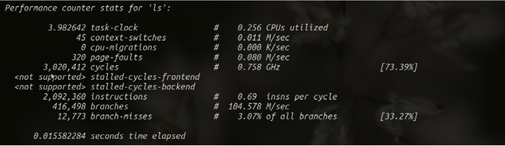
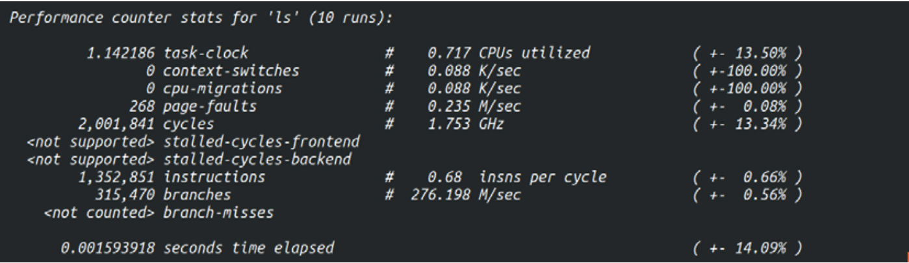
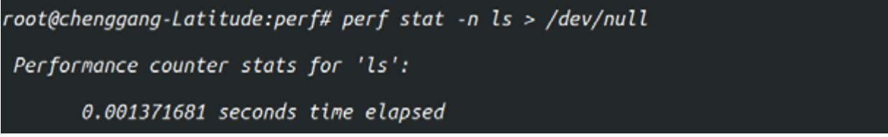
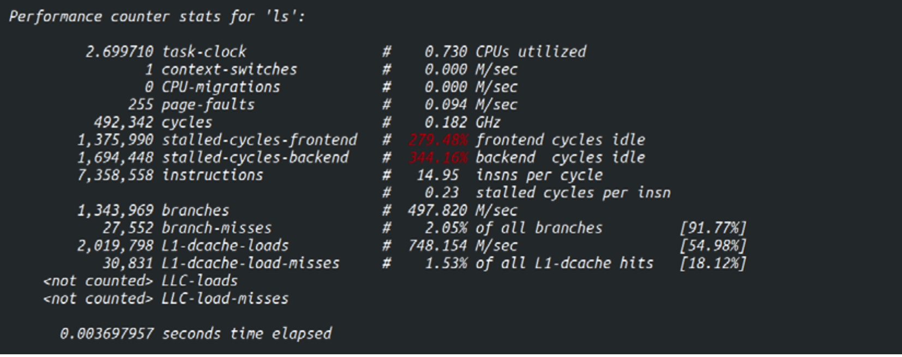
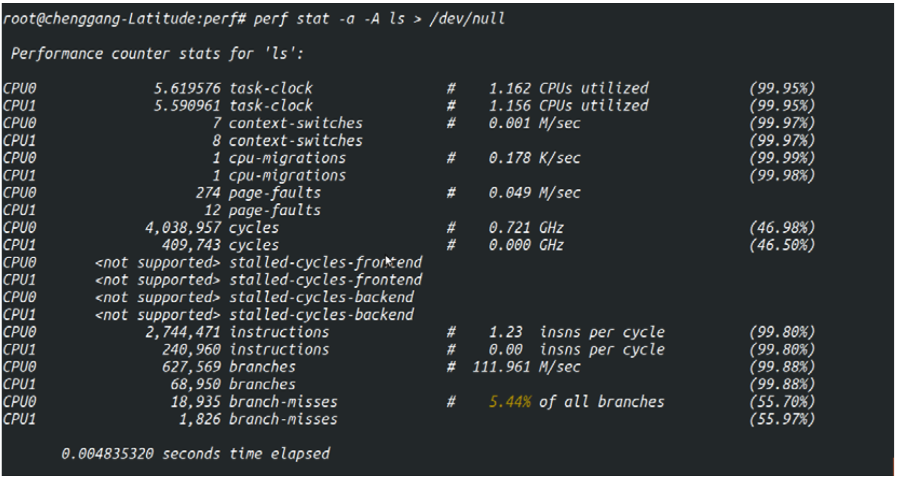

<!-- @import "[TOC]" {cmd="toc" depthFrom=1 depthTo=6 orderedList=false} -->

<!-- code_chunk_output -->

- [1. 用途](#1-用途)
- [2. 使用方法](#2-使用方法)
- [3. ls 例子](#3-ls-例子)
  - [3.1. task-clock: 真正占用的处理器时间](#31-task-clock-真正占用的处理器时间)
  - [3.2. context-switches: 上下文切换次数](#32-context-switches-上下文切换次数)
  - [3.3. cpu-migration: CPU 迁移](#33-cpu-migration-cpu-迁移)
  - [3.4. page-faults: 缺页异常次数](#34-page-faults-缺页异常次数)
  - [3.5. cycles: 处理器周期数](#35-cycles-处理器周期数)
  - [3.6. instructions: 处理器指令数](#36-instructions-处理器指令数)
  - [3.7. branches: 分支指令数](#37-branches-分支指令数)
- [4. 参数介绍](#4-参数介绍)
  - [4.1. 常用参数](#41-常用参数)
  - [4.2. 指定性能事件](#42-指定性能事件)
  - [4.3. tracepoint 过滤](#43-tracepoint-过滤)
  - [4.4. 不记录 perf 自己发起的事件](#44-不记录-perf-自己发起的事件)
  - [4.5. 禁止子任务继承](#45-禁止子任务继承)
  - [4.6. 时间](#46-时间)
  - [4.7. 重复执行次数](#47-重复执行次数)
  - [4.8. 更多信息](#48-更多信息)
  - [4.9. 仅输出目标程序执行时间](#49-仅输出目标程序执行时间)
  - [4.10. 更多性能指标](#410-更多性能指标)
  - [4.11. 清理内存缓冲区](#411-清理内存缓冲区)
  - [4.12. 打印每个处理器上相应信息](#412-打印每个处理器上相应信息)
  - [4.13. 格式化输出](#413-格式化输出)
  - [4.14. 指定输出文件](#414-指定输出文件)
  - [4.15. 追加模式输出](#415-追加模式输出)
  - [4.16. 之前执行](#416-之前执行)
  - [4.17. 之后执行](#417-之后执行)
- [5. 示例](#5-示例)
- [6. 参考](#6-参考)

<!-- /code_chunk_output -->

# 1. 用途

用来剖析一个**指定应用程序**的性能概况.

> perf stat 能完整统计应用整个生命周期的信息

对于**任何支持计数的事件**, perf 都能够在进程执行期间对发生的事件进行计数, 计数结果会直接打印在控制台上.

stat 子命令可以在线程、进程、CPU、全局级别进行计数.

**默认情况**下进程的**所有线程**、**子进程**的计数都被统计在内, 可以通过`-i`选项修改此行为.

# 2. 使用方法

查看帮助

```
// 这个更好
perf help stat

perf stat -h
```

```
# 如果不指定-e, 则默认收集所有事件的计数器
perf stat [-e <EVENT> | --event=EVENT] [-a] <command>
perf stat [-e <EVENT> | --event=EVENT] [-a] -- <command> [<options>]
perf stat [-e <EVENT> | --event=EVENT] [-a] record [-o file] — <command> [<options>]
perf stat report [-i file]
```

# 3. ls 例子

比如查看 ls 程序的典型性能数据

```
perf stat ls
```



从图上可以看到, perf stat 工具利用 **10 个典型性能事件**剖析了应用程序.

## 3.1. task-clock: 真正占用的处理器时间

`task‐clock` 事件表示目标任务'ls'**真正占用处理器的时间**, 单位是**毫秒**. 我们将其称为任务执行时间.

如图所示, 'ls'在处理器上执行了 `3.98` 毫秒. `"0.256 CPUs utilized"`表示目标任务的**处理器占用率**. 处理器占用率表示**目标任务的执行时间**与**持续时间的比值**. 持续时间是指从任务提交到执行结束之间的**总时间**.

`CPUs utilized = task-clock / time elapsed`, CPU 的占用率.

## 3.2. context-switches: 上下文切换次数

Linux 为了维持多个处理器的负载均衡, 在特定条件下会将某个任务从一个 CPU 迁移到另一个 CPU.

对操作系统有过了解的读者应该知道, Linux 这种多任务分时操作系统中, 一个任务不太可能在执行期间始终占据处理器. 操作系统会根据调度策略(linux 目前使用 CFS 调度算法)合理安排各个任务轮流使用处理器, **每次调度**会产生**一次上下文切换**. 在此期间操作系统还需处理大量中断. 因此, 一个任务的执行时间可能会很短, 但是它的持续时间会远高于此(除非此任务是优先级最高的实时任务).

以图中的例子来说, 'ls'的执行时间为 `3.98` 毫秒, 而持续为 `15.58` 毫秒, 处理器占用率为 `0.256`. 在此期间, 系统共发生了 45 次上下文切换. 平均每秒发生 `0.011*10^6` 次. 上下文切换次数的**均值**是**上下文切换次数**与**任务执行时间**的**比值**.

## 3.3. cpu-migration: CPU 迁移

在多(核)处理器系统中, Linux 为了维持**各个处理器的负载均衡**, 会在特定条件下将**某个任务**从一个处理器**迁往另外一个处理器**. 此时, 我们便说发生了一次处理器迁移. 从图上看到, ls 在执行期间**没有被操作系统迁移过**. (`cpu-migration`)

> CPU 迁移和上下文切换: 发生上下文切换不一定会发生 CPU 迁移, 而发生 CPU 迁移时肯定会发生上下文切换. 发生上下文切换有可能只是把上下文从当前 CPU 中换出, 下一次调度器还是将进程安排在这个 CPU 上执行.

## 3.4. page-faults: 缺页异常次数

Linux 的内存管理子系统采用了**分页机制**. 当应用程序请求的**页面尚未建立**、请求的**页面不在内存**中、或者**请求的页面虽然在内存**中, 但**尚未建立**物理地址与虚拟地址的**映射关系**时, 都会**触发一次缺页异常**(`page‐fault`). 内核在**捕获缺页异常**时, 根据异常种类进行相应的处理. 另外, **TLB 不命中**, **页面访问权限不匹配**等情况也会触发**缺页异常**.

内核中对 page faults (`PERF_COUNT_SW_PAGE_FAULTS`)事件的精确定义是**缺页异常的处理函数** `do_page_fault()`被执行. 程序'ls'在执行期间共触发了 `320` 次缺页 异常. 平均发生率为每秒 `0.08*10^6` 次.

## 3.5. cycles: 处理器周期数

'cycles'为'ls'程序消耗的处理器周期数. 如果将被'ls'占据的**那部分时间**看作**一个抽象处理器**, 它的**主频**只需为 `0.75GHz` 便可以在 `3.98` 毫秒内完成'ls'命令的处理.

可以用`cycles / task-clock`算出.

## 3.6. instructions: 处理器指令数

'instructions'是指命令'ls'执行期间产生的处理器指令数. **IPC**(**instructions per cycle**)为 `0.69`, 表示平均每个 cpu cycle 执行了多少条指令.

**IPC** 是评价**处理器**与**应用程序性能**的重要指标. 在 X86 这种 CSIC 处理器上, **很多指令**需要**多个处理器周期**才能执行完毕. 另外, **有些指令**在**流水线**上未必能成功引退(retired), 从而形成**无效指令**.

**长指令**与**无效执行越多**, **IPC 就越低**, 处理器的利用率与程序的执行效率也就越低. 因此, IPC 在一定程度下,  让我们对程序的执行效率有一个**宏观认识**.

## 3.7. branches: 分支指令数

'branches'是指程序在执行期间遇到的**分支指令数**. `'branch‐misses'`则是**预测错误的分支指令数**.

绝大多数现代处理器都具有**分支预测**与 `OOO(Out‐of‐Order) 乱序执行`机制, 以充分利用 CPU 内部的资源, **减少流水线停顿周期**. 当处理器遇到分支指令时, 正常来说, 需要等待分支条件计算完毕才能知道后续指令流该往何处跳转. 这就导致在**等待分支条件计算期间**, 流水线上出现**若干周期的停顿**(流水线 Hazard).

体系结构的经典著作《计算机体系结构:量化研究方法》上说, **分支指令**产生的**性能影响**为 `10%~30%[2]`, 流水线越长, 性能影响就越大. 为了减少分支指令造成的流水线停顿, 从 P5 处理器开始引入了分支预测机制. 当处理 器无法判断指令的跳转方向时, 便通过分支预测单元选择一个最有可能的跳转方 向. 但是, 既然是预测, 就存在预测失败的可能. 当分支预测失败时, 会对处理 器周期造成较大的浪费. 在 5 发射 10 级流水线的处理器中, 当分支预测的准确 率为 90%时, 处理器带宽会浪费 47%;而如果准确率提高到 96%, 带宽浪费可降 低至 `26%[3]`. Core i7 以及 Xeon 5500 等较新的处理器在**分支预测失效**时, 已经**无需刷新全部流水线**, 但错误指令加载与计算导致的无效开销依然不可小觑. 这就 要求我们在编写代码时, 应**尽量减少分支预测错误的次数**. 但在此之前, 通过 perf stat, perf top, perf record 等工具**查查分支预测失效率**, 以及**导致分支预测失效过高**的**热点代码**是非常有必要的.

'branch misses'一行中的`'***% of all branches'`即为目标程序执行期间的**分支预测失效率**.

预测错误的分支指令数

# 4. 参数介绍

## 4.1. 常用参数

* `-e`: 指定性能事件, 默认收集所有事件的计数器
* `-a`: 从所有 CPU 上收集性能数据
* `-C`: 从指定 CPU 上收集性能数据
* `-p`: 指定待分析进程的 PID
* `-t`: 指定待分析线程的 TID
* `-r N`: 连续执行 N 次
* `-d`: 全面性能分析, 采用更多的性能事件
* `-x SEP`: 指定输出列的分隔符.
* `-o file`: 指定输出文件, --append 指定追加模式.
* `--pre <cmd>`: 执行目标程序前先执行的程序.
* `--post <cmd>`: 执行目标程序后再执行的程序.

```
/data/build/linux/tools/perf stat -p 11998 -e kvm:* sleep 5
```

```
perf stat -p 178264 -e kvm:* -v
```

<table>
    <tr>
        <th>选项</th>
        <th>说明</th>
    </tr>
    <tr>
        <td>-e</td>
        <td>
剖析的事件类型, 也就是性能监控单元(Performance Monitoring Unit, PMU)类型. 可以指定: <br>
<ol>
<li>事件名称, 执行 perf list 可以显示支持的事件列表</li>
<li>一组事件, 以花括号包围 {event1,event2,...}</li>
<li>其它形式</li>
</ol>
        </td>
    </tr>
    <tr>
        <td>--filter</td>
        <td>事件过滤器, 必须和指定了追踪点(tracepoint)事件的-e 配合使用</td>
    </tr>
    <tr>
        <td>--exclude-perf</td>
        <td>不记录 perf 自己发起的事件</td>
    </tr>
    <tr>
        <td>-a</td>
        <td>
使用 Per-CPU 模式, 如果不指定-C, 则相当于全局模式<br>
如果指定-C, 则可以选定若干 CPU
        </td>
    </tr>
    <tr>
        <td>-p</td>
        <td>收集指定进程的事件, 逗号分割的 PID 列表</td>
    </tr>
    <tr>
        <td>-t</td>
        <td>收集指定线程的事件, 逗号分割的线程 ID 列表</td>
    </tr>
    <tr>
        <td>-u</td>
        <td>收集指定用户的进程的事件</td>
    </tr>
    <tr>
        <td>-r</td>
        <td>使用 RT SCHED_FIFO 优先级收集数据</td>
    </tr>
    <tr>
        <td>-c</td>
        <td>采样周期</td>
    </tr>
    <tr>
        <td>-o</td>
        <td>输出文件的名称</td>
    </tr>
    <tr>
        <td>-i</td>
        <td>不包括子任务的事件, 不监控子进程、线程、子进程的线程</td>
    </tr>
    <tr>
        <td>-F</td>
        <td>以指定的频率剖析</td>
    </tr>
    <tr>
        <td>-g</td>
        <td>记录调用栈</td>
    </tr>
    <tr>
        <td>--call-graph</td>
        <td>
收集调用栈使用的方法: <br>
<ol>
<li>fp, 栈指针</li>
<li>dwarf, DWARF 的调用帧信息(CFI)</li>
<li>lbr, Hardware Last Branch Record facility</li>
</ol>
某些系统上, 如果应用通过 GCC 的--fomit-frame-pointer 参数构建, fp 模式下可能只能看到匿名调用帧, 可以用 dwarf 代替
        </td>
    </tr>
    <tr>
        <td>-s</td>
        <td>记录每个线程的事件计数器, 配合 perf report -T 使用</td>
    </tr>
    <tr>
        <td>-d</td>
        <td>记录样本地址</td>
    </tr>
    <tr>
        <td>-T</td>
        <td>记录样本时间戳</td>
    </tr>
    <tr>
        <td>-P</td>
        <td>记录样本周期</td>
    </tr>
    <tr>
        <td>-C</td>
        <td>仅仅从指定的 CPU 上收集样本, 示例:  -C 0,2-3</td>
    </tr>
    <tr>
        <td>-G</td>
        <td>仅仅记录指定控制组的事件</td>
    </tr>
</table>

## 4.2. 指定性能事件

`'‐e' or '‐‐event' <event>`

剖析的事件类型, 也就是性能监控单元(Performance Monitoring Unit, PMU)类型. 可以指定:

* 事件名称, 执行 perf list 可以显示支持的事件列表
* 一组事件, 以花括号包围 {event1,event2,...}
* 其它形式

## 4.3. tracepoint 过滤

`'‐‐filter' <filter>`

配合 Tracepoints 使用, 等同于 ftrace 中 filter 的概念, 根据正则表达式追踪指定的函数.

事件过滤器, 必须和指定了追踪点(tracepoint)事件的-e 配合使用

## 4.4. 不记录 perf 自己发起的事件

`--exclude-perf`

不记录 perf 自己发起的事件

## 4.5. 禁止子任务继承

`'‐i' or '‐‐no‐inherit'`

禁止子任务继承父任务的性能计数器. 类似于'perf top'中的'‐i'参数, 只是此处是禁止继承机制.

## 4.6. 时间

`'‐c' or '‐‐scale'`

要求底层驱动记录计数器的 run 与 enabled 时间. 此选项默认打开, 且不能关闭.

## 4.7. 重复执行次数

`'‐r' or '‐‐repeat' <n>`

重复执行 n 次目标程序, 并给出性能指标在 n 次执行中的变化范围.

```
./perf stat ‐r 10 ls > /dev/null
```

将重复执行 10 次"ls > /dev/null", 并给出如下结果:



相比上面多了一列统计信息. 括号里的百分比为 n 个性能数据的**标准差**与数学期望的比值. 这个值**越大**, 表示各样本与平均值之间的**偏差就越大**, 也就是说样本的**波动幅度就越大**.

## 4.8. 更多信息

`'‐v' or '‐‐verbose'`

开启此选项后, perf stat 将显示更丰富的信息, 比如打开计数器时系统报出的错误信息, 各个计数器的计数值、运行时间与使能时间等信息.

## 4.9. 仅输出目标程序执行时间

`'‐n' or '‐‐null'`

开启这个选项后, perf stat 仅仅输出目标程序的执行时间, 而不开启任何性
能计数器.

执行命令:

```
./perf stat -n ls > /dev/null
```



perf stat 通过系统调用 `clock_gettime(CLOCK_MONOTONIC, &ts)` 记录目标程序的执行时间, 而没有利用任何性能计数器.

## 4.10. 更多性能指标

`'‐d' or '‐‐detailed'`

开启该选项后, perf stat 将给出更丰富的性能指标.

执行命令:

```
./perf stat -d ls > /dev/null
```



与前图相比, 开启`'‐d'`选项后, perf stat 给出了`'L1‐dcache‐loads'`等 **Cache** 相关的性能指标.

## 4.11. 清理内存缓冲区

`'‐S' or '‐‐sync'`

在执行目标程序前, 先执行系统调用 `sync()`, 将**内存缓冲区**中的数据**写回磁盘**. 从而使得目标程序在执行时能够获得更干净的环境.

## 4.12. 打印每个处理器上相应信息

`'‐A' or '‐‐no‐aggr'`

此选项必须与`'‐a'`选项一起使用. 开启此选项后, perf stat 将给出每个处理器上相应的信息.

执行命令:

```
./perf stat -a -A ls > /dev/null
```



## 4.13. 格式化输出

`'‐x' or '‐‐field‐separator'`

如果希望将 perf stat 的信息**导进数据库**, 或者希望利用**某些文本分析工具**对输出信息进行分析, 就需要获得**格式化的输出结果**.

`'‐x'`参数能够满足这项需求.  如果我们希望各项输出信息之间通过';'分隔, 可以采用如下命令:

```
./perf stat -x ';' ls > /dev/null
```

## 4.14. 指定输出文件

`'‐o' or '‐‐output' <file>`

可以通过此选项将 perf stat 的结果输出到指定文件.

## 4.15. 追加模式输出

`'‐‐append'`

以追加模式, 将输出信息写入输出文件.

## 4.16. 之前执行

`'‐‐pre' <command>`

通过此参数, 可以指定在目标程序之前执行的程序.

## 4.17. 之后执行

`'‐‐post' <command>`

通过此参数, 可以指定在目标程序之后执行的程序.

```
./perf stat --repeat 10 --null --sync --pre make -s O=defconfig-build/clean -- make -s -j64 O=defconfig-build/ bzImage
```

# 5. 示例

执行 10 次程序, 给出标准偏差与期望的比值:

```
# perf stat -r 10 ls > /dev/null
```

显示更详细的信息:

```
# perf stat -v ls > /dev/null
```

只显示任务执行时间, 不显示性能计数器:

```
# perf stat -n ls > /dev/null
```

单独给出每个 CPU 上的信息:

```
# perf stat -a -A ls > /dev/null
```

ls 命令执行了多少次系统调用:

```
# perf stat -e syscalls:sys_enter ls
```

CPU 性能计数器:

```
perf stat command
```

详细的 CPU 性能计数器

```
perf stat -d command
```

收集指定进程的性能计数, 直到 Ctrl-C

```
perf stat -p PID
```

收集整个系统的性能计数, 持续 5 秒

```
perf stat -a sleep 5
# Performance counter stats for 'system wide':
#      20010.623960      cpu-clock (msec)          #    4.000 CPUs utilized
#            61,947      context-switches          #    0.003 M/sec
#             4,153      cpu-migrations            #    0.208 K/sec
#                99      page-faults               #    0.005 K/sec
#     5,003,068,069      cycles                    #    0.250 GHz                      (49.96%)
#     2,000,087,622      instructions              #    0.40  insn per cycle           (75.00%)
#       393,183,513      branches                  #   19.649 M/sec                    (75.05%)
#        24,391,051      branch-misses             #    6.20% of all branches          (74.99%)

#       5.003219775 seconds time elapsed
```

指定需要收集的几种计数器, 持续 10 秒

```
perf stat -e cycles,instructions,cache-references,cache-misses,bus-cycles -a sleep 10
```

CPU 一级缓存计数器

```
perf stat -e L1-dcache-loads,L1-dcache-load-misses,L1-dcache-stores command
```

TLB 计数器

```
perf stat -e dTLB-loads,dTLB-load-misses,dTLB-prefetch-misses command
```

CPU 最后一级缓存计数器

```
perf stat -e LLC-loads,LLC-load-misses,LLC-stores,LLC-prefetches command
```

统计指定进程的系统调用

```
perf stat -e 'syscalls:sys_enter_*' -p PID
```

统计全局系统调用

```
perf stat -e 'syscalls:sys_enter_*' -a sleep 5
```

统计调度器相关事件

```
perf stat -e 'sched:*' -p PID
perf stat -e 'sched:*' -p PID sleep 10
```

统计 Ext4 相关事件

```
perf stat -e 'ext4:*' -a sleep 10
```

统计块 IO 事件

```
perf stat -e 'block:*' -a sleep 10
```

收集多种事件

```
perf stat -e cycles,instructions,cache-misses
```

统计 CPU 0 的信息, 按下 Ctrl+C 终止.

```
perf stat -C 0
```

# 6. 参考

