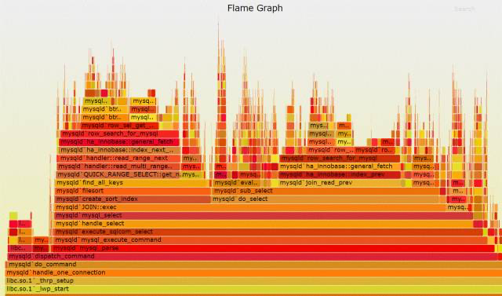
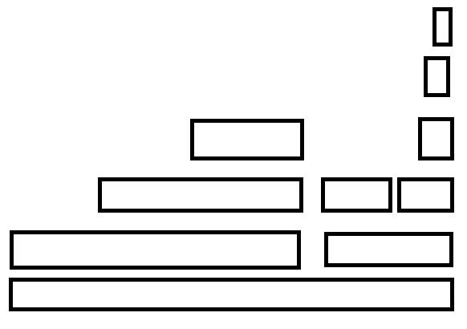
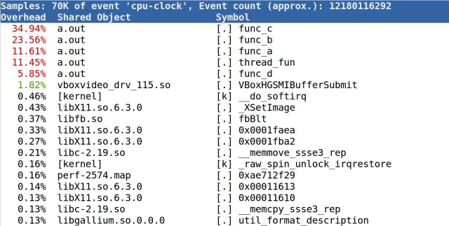
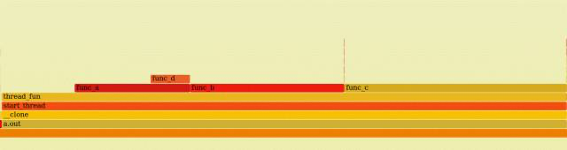
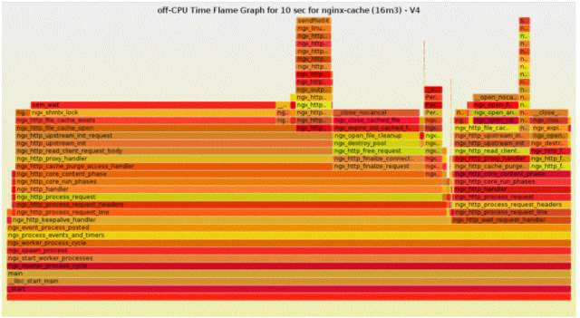

# 简介

火焰图(Flame Graph)是由 Linux 性能优化大师 Brendan Gregg 发明的, 和所有其他的 trace 和 profiling 方法不同的是, Flame Graph 以一个全局的视野来看待时间分布, 它从底部往顶部, 列出所有可能的调用栈.

其他的呈现方法, 一般只能列出单一的调用栈或者非层次化的时间分布.

根据系统性能的指标可以将火焰图分为多种, 常见的有 on-cpu 和 off-cpu 两种火焰图

## 火焰图示例

以典型的分析 CPU 时间花费到哪个函数的`on-cpu`火焰图为例来展开.

CPU 火焰图中的**每一个方框**是**一个函数**, **方框的长度**, 代表了它的**执行时间**, 所以越宽的函数, 执行越久. 火焰图的**楼层每高一层**, 就是**更深一级的函数被调用**, **最顶层的函数**, 是**叶子函数**.



## 生成过程

火焰图的生成过程是:

1. 先 trace 系统, 获取系统的 profiling 数据
2. 用脚本来绘制

系统的 profiling 数据获取, 可以选择最流行的 perf record, 而后把采集的数据进行加工处理, 绘制为火焰图.

其中第二步的绘制火焰图的脚本程序, 通过如下方式获取:

```
git clone https://github.com/brendangregg/FlameGraph
```

# 火焰图案例

直接从最简单的例子开始说起, 代码如下:

```cpp
c(){
    for(int i=0;i<1000;i++);
}

b(){
    for(int i=0;i<1000;i++);
    c();
}

a(){
    for(int i=0;i<1000;i++);
    b();
}
```

则这三个函数, 在火焰图中呈现的样子为:


`a()`的`2/3`的时间花在`b()`上面, 而`b()`的`1/3`的时间花在`c()`上面. 很多个这样的`a->b->c`的火苗堆在一起, 就构成了火焰图.



进一步理解火焰图的最好方法仍然是通过一个实际的案例, 下面的程序**创建 2 个线程**, 两个线程的 handler 都是`thread_fun()`, 之后`thread_fun()`调用`fun_a()`、`fun_b()`、`fun_c()`, 而`fun_a()`又会调用`fun_d()`:

```cpp
#include <pthread.h>

func_d(){
    int i;
    for(i=0;i<50000;i++);
}

func_a(){
    int i;
    for(i=0;i<100000;i++);
    func_d();
}

func_b(){
    int i;
    for(i=0;i<200000;i++);
}

func_c(){
    int i;
    for(i=0;i<300000;i++);
}

void* thread_fun(void* param){
    while(1) {
        int i;
        for(i=0;i<100000;i++);

        func_a();
        func_b();
        func_c();
    }
}

int main(void){
    pthread_t tid1,tid2;
    int ret;

    ret=pthread_create(&tid1,NULL,thread_fun,NULL);
    if(ret==-1){
        ...
    }

    ret=pthread_create(&tid2,NULL,thread_fun,NULL);
    ...

    if(pthread_join(tid1,NULL)!=0){
        ...
    }

    if(pthread_join(tid2,NULL)!=0){
        ...
    }

    return 0;
}
```

先看看不用火焰图的缺点在哪里.

如果不用火焰图, 我们也可以用类似 perf top 这样的工具分析出来 CPU 时间主要花费在哪里了:

```
$gcc exam.c -pthread
$./a.out&
$sudo perf top
```

perf top 的显示结果如下:



perf top 提示出来了 fun_a()、fun_b()、fun_c(), fun_d(), thread_func()这些函数内部的代码是 CPU 消耗大户, 但是它缺乏一个全局的视野, 我们无法看出全局的调用栈, 也弄不清楚这些函数之间的关系. 火焰图则不然, 我们用下面的命令可以生成火焰图(以 root 权限运行):

```
# 采集信息
# perf record -F 99 -a -g -- sleep 60

# 查看采集到的信息
# perf script | ./stackcollapse-perf.pl > out.perf-folded

# 生成火焰图
./flamegraph.pl out.perf-folded > perf-kernel.svg
```

`-F 99`表示每秒 99 次, `-p 13204`是进程号, 即对哪个进程进行分析, `-g`表示**记录调用栈**, `-a`表示所有进程, `sleep 60`则是持续 60 秒.

上述程序捕获系统的行为 60 秒钟, 最后调用 flamegraph.pl 生成一个火焰图`perf-kernel.svg`, 用看图片的工具就可以打开这个 svg.



上述火焰图显示出了 a.out 中, thread_func()、func_a()、func_b()、fun_c()和 func_d()的时间分布.

从上述火焰图可以看出, 虽然 thread_func()被两个线程调用, 但是由于 thread_func()之前的调用栈是一样的, 所以 2 个线程的 thread_func()调用是合并为同一个方框的.

# 更深阅读

除了 on-cpu 的火焰图以外, off-cpu 的火焰图, 对于分析系统堵在 IO、SWAP、取得锁方面的帮助很大, 有利于分析系统在运行的时候究竟在等待什么, 系统资源之间的彼此伊伴.

比如, 下面的火焰图显示, nginx 的吞吐能力上不来的很多程度原因在于 sem_wait()等待信号量.



上图摘自 Yichun Zhang (agentzh)的《Introduction to offCPU Time Flame Graphs》.

关于火焰图的更多细节和更多种火焰图各自的功能, 可以访问:

官网: http://www.brendangregg.com/flamegraphs.html

on-cpu 资料: http://www.brendangregg.com/FlameGraphs/cpuflamegraphs.html

off-cpu 资源: http://www.brendangregg.com/FlameGraphs/offcpuflamegraphs.html

# 参考

https://mp.weixin.qq.com/s/Kz4tii8O4Nk-S4SV4kFYPA