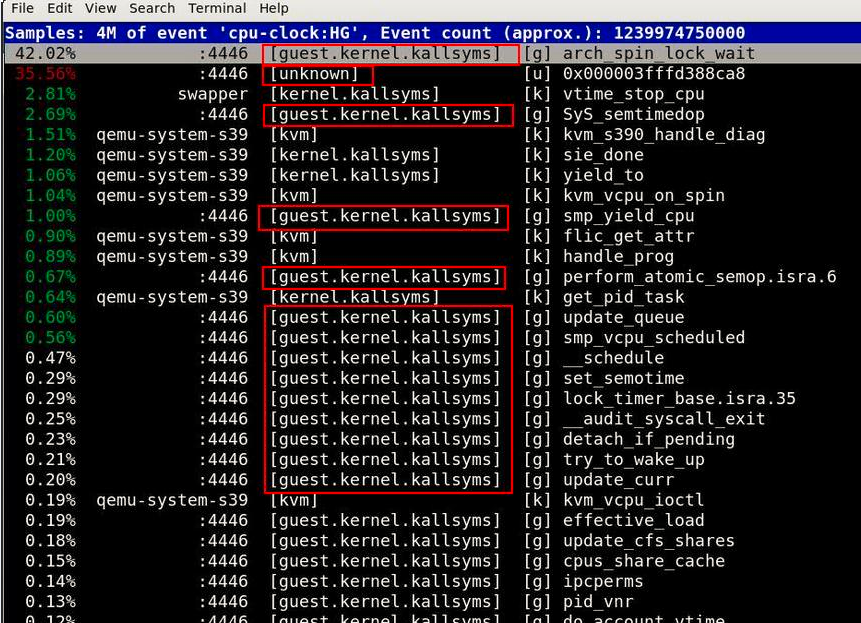

<!-- @import "[TOC]" {cmd="toc" depthFrom=1 depthTo=6 orderedList=false} -->

<!-- code_chunk_output -->

- [1. 用途](#1-用途)
- [2. 使用方法](#2-使用方法)
- [3. 获取 guest 的 kallsyms 和 modules 文件](#3-获取-guest-的-kallsyms-和-modules-文件)
- [4. 利用 sshfs 自动读取 guest 的 kallsyms 和 modules 文件](#4-利用-sshfs-自动读取-guest-的-kallsyms-和-modules-文件)
- [5. 记录 guest 的性能事件](#5-记录-guest-的性能事件)
- [6. 分析 guest 上的性能事件](#6-分析-guest-上的性能事件)
- [7. perf kvm stat record/report 使用](#7-perf-kvm-stat-recordreport-使用)
- [8. 相关资料](#8-相关资料)
- [9. 例子](#9-例子)
  - [9.1. 背景](#91-背景)
- [10. 问题](#10-问题)

<!-- /code_chunk_output -->

# 1. 用途

利用 kvm 子工具, 我们可以在 host 上监测 guest 的性能事件.

# 2. 使用方法

```
./perf --help kvm
```

```
perf kvm <perf kvm args> <perf command> <perf command args>
perf kvm [--host] [--guest] [--guestmount=<path>
         [--guestkallsyms=<path> --guestmodules=<path> | --guestvmlinux=<path>]]
         {top|record|report|diff|buildid-list}
perf kvm [--host] [--guest] [--guestkallsyms=<path> --guestmodules=<path>
         | --guestvmlinux=<path>] {top|record|report|diff|buildid-list|stat}
```

perf kvm 有几个变体:

* `perf kvm [options] top <command>`: 用于实时生成并显示虚拟机操作系统的性能数据
* `perf kvm record <command>`: 记录性能数据并保存到文件.
    * 默认情况下, 使用`--guest`, `perf.data.guest`
    * `--host`, `perf.data.kvm`
    * `--guest`, `perf.data.guest`
    * `--host --guest`, `perf.data.kvm`
    * `--host --no-guest`,  `perf.data.host`
* `perf kvm report`: 读取`perf kvm record`输出, 显示性能分析数据
* `perf kvm diff`: 显示两个`perf kvm record`记录的数据的不同
* `perf kvm buildid-list`:
* `perf kvm stat <command>`: 执行一个命令并收集性能统计数据.
    - `perf kvm stat record/report`可以生成 KVM events 的统计分析. 目前, vmexit、mmio 和 ioport event 是支持的.
    - `perf kvm stat record <command>`记录 kvm events 和 command 的起始和结束之间的所有 events.
* `perf kvm stat report`: 报告统计数据, 包括 events 处理时间, 采样等等.


```
# ./perf kvm stat report -h

 Usage: perf kvm stat report [<options>]

    -f, --force           don't complain, do it
    -k, --key <sort-key>  key for sorting: sample(sort by samples number) time (sort by avg time)
    -p, --pid <pid>       analyze events only for given process id(s)
        --event <report event>
                          event for reporting: vmexit, mmio (x86 only), ioport (x86 only)
        --vcpu <n>        vcpu id to report
```

# 3. 获取 guest 的 kallsyms 和 modules 文件

为了能够让 kvm 子工具正确解析 guest 的符号, 我们首先需要把 guest 系统的/proc/kallsyms 和 /proc/modules 文件拷贝到 host 中.

在 host 中运行下面命令:

```
# ssh guest "cat /proc/kallsyms" > /tmp/guest.kallsyms

# ssh guest "cat /proc/modules" > /tmp/guest.modules
```

其中 guest 为 host 中 guest os 的名字, 我们也可以用 IP 地址来代替 guest 的名字.

注意: 我们这里不用 scp 命令拷贝文件的原因是因为有时 scp 在拷贝 guest 的 modules 文件时会返回空文件.

# 4. 利用 sshfs 自动读取 guest 的 kallsyms 和 modules 文件

perf kvm 可以利用 sshfs 来挂载 guest 的根文件系统, 这样它就可以直接读取 guest 的 kallsyms 和 modules 文件了.

sshfs 需要 fuse(the Filesystem in Userspace)如果你的系统中没有安装 fuse, 需要首先安装 fuse.

在 host 中运行下列命令:

```
# mkdir -p /tmp/guestmount
# ps -eo pid,cmd | grep qemu | grep -v grep
24764 /usr/libexec/qemu-kvm -M pc -m 4096 -smp 4 -name guest01 -boot c -drive file=/var/lib/libvirt/images/guest01.img ...
# mkdir /tmp/guestmount/24764
# sshfs -o allow_other,direct_io guest:/ /tmp/guestmount/24764
```

这样我们就可以利用 perf kvm 的—guestmount 参数来指定 guest 的文件系统了.

当我们用完 perf kvm 后需要卸载 guest 的文件系统:

```
# fusermount -u /tmp/guestmount/24764
```

# 5. 记录 guest 的性能事件

经过了上面的准备工作我们就可以记录 guest 的性能事件了, 利用 perf kvm record 命令来记录 guest 的性能事件:

```
# perf kvm --host --guest --guestkallsyms=/tmp/guest.kallsyms --guestmodules=/tmp/guest.modules record -a
```

```
# perf kvm --host --guest --guestkallsyms=guest-kallsyms --guestmodules=guest-modules record -a -o perf.data
```

```
./perf kvm stat record -a sleep 1
```

注: 如果 `--host` 和 `--guest` 均在命令中使用, 输出将被储存在 `perf.data.kvm` 中. 如果只有 `--host` 被使用, 文件将被命名为 `perf.data.host`. 同样地, 如果仅有 `--guest` 被使用, 文件将被命名为 `perf.data.guest`.

上面这个命令的意思是**同时记录 host**和**guest**上**所有进程的性能事件**, 这里默认的**采样事件**为**cycles**, 我们可以用`-e`参数来指定我们感兴趣的采样事件.

我们可以发送 SIGINT 命令结束采样, 注意如果 perf 被非 SIGINT 指令结束, 比如 SIGTERM 或者 SIGQUIT, 那么 perf kvm report 命令将不能正确的解析采样文件.

默认情况下, 如果我们只记录 host 的性能事件那么生成的采样文件的名字为: perf.data.host, 如果我们只记录 guest 的性能事件, 那么生成的采样文件的名字为: perf.data.guest. 如果我们同时记录 host 和 guest 的性能事件, 那么生成的采样文件的名字为: perf.data.kvm.

按 Ctrl-C 停止纪录.

# 6. 分析 guest 上的性能事件

有了上面的采样文件, 我们就可以利用 perf kvm report 来查看性能事件了, 执行以下命令:

```
# perf kvm --host --guest --guestkallsyms=/tmp/guest.kallsyms --guestmodules=/tmp/guest.modules report -i /tmp/perf.data.kvm
```

```
perf kvm --host --guest --guestmodules=guest-modules report -i perf.data.kvm --force > analyze
```

我们会得到如图 1-01 的分析结果:



其中**模块名前有 guest 前缀**的都是**guest 中发生的采样事件**, 模块名为 unknown 的为 guest 中运行的 workload, 因为没有该 workload 的符号表, 所以此处不能解析出 workload 的名字. 其余都是 host 中的采样事件.

如果我们仔细观察我们用来记录 guest 采样事件的命令就会发现, 我们**只能**提供**一个 guest**的**kallsyms**和**modules**文件. 所以, 也就只能解析一个 guest 的符号, 当 host 有多个 guest 时, 可能符号解析会出错. 当然, 我们也可以同时监测多个 guest 的性能事件, 然后根据各个 guest 的 kallsyms 和 modules 文件**手动解析**这些符号.

将来 perf kvm 可能通过增加 guest 的 PID 的方式来分别指定每个 guest 的 kallsyms 和 modules 文件, 那么, 就可以正确解析每个 guest 的符号.

通过上面的介绍, 我们可以看到, 利用 perf kvm 子工具, 我们可以方便的在 host 中监测 guest 中的性能事件, 这对于我们分析 guest 的性能是非常方便的. Perf kvm 子工具还支持其它的 perf 的命令, 比如: stat 等.


# 7. perf kvm stat record/report 使用

1.


perf 文档:
tools/perf/Documentation/


1. host 和 vm 跑 benchamark, 确定具体 benchmark 的差异
2. 可以参照 https://lwn.net/Articles/513317/

第一步, record

./perf kvm stat record --pid 9620 -a sleep 30

或

./perf stat record -e kvm:* --pid 39941

第二步, report

./perf kvm stat report

或

./perf kvm stat report --pid 39941

perf kvm stat report --vcpu 4

或单独 event

./perf kvm stat report --event=vmexit

./perf kvm stat report --event=mmio

./perf kvm stat report --event=ioport

./perf kvm stat report --event=vmexit --vcpu=0 --key=time


# 8. 相关资料

https://lwn.net/Articles/513317/

https://www.linux-kvm.org/page/Perf_events

https://blog.csdn.net/x_i_y_u_e/article/details/48466031


头文件在`tools/arch/x86/include/uapi/asm/svm.h`和`arch/x86/include/uapi/asm/svm.h`, 两个是一样的.


# 9. 例子

1. https://lwn.net/Articles/513317/

2. XXX

## 9.1. 背景

benchmark 或业务性能较差

```
./perf kvm stat record -a -p XXX sleep 10
./perf kvm stat report
```

可以看到有大量 IO 指令, 进一步分析 IO 具体是什么

```
./perf kvm stat report --event=ioport
```


1. 抓取正常情况下 kvm 性能数据


```
./perf kvm stat record -a -p 178264 sleep 10
./perf kvm stat report


Analyze events for all VMs, all VCPUs:

             VM-EXIT    Samples  Samples%     Time%    Min Time    Max Time         Avg time

           interrupt     619522    99.28%    99.01%      0.30us     88.06us      0.57us ( +-   0.14% )
                 msr       4517     0.72%     0.99%      0.34us      4.22us      0.78us ( +-   0.58% )
               vintr          2     0.00%     0.00%      0.67us      0.96us      0.82us ( +-  17.77% )

Total Samples:624041, Total events handled time:356509.21us.
```

再跑 benchmark 抓取数据

```
./perf kvm stat record -a -p 178264  sleep 10
./perf kvm stat report


Analyze events for all VMs, all VCPUs:

             VM-EXIT    Samples  Samples%     Time%    Min Time    Max Time         Avg time

           interrupt     642835    94.55%    94.51%      0.29us    334.77us      0.71us ( +-   0.15% )
                 msr      36484     5.37%     5.28%      0.31us      8.36us      0.70us ( +-   0.20% )
               vintr        397     0.06%     0.07%      0.54us      1.94us      0.86us ( +-   1.07% )
               cpuid        180     0.03%     0.04%      0.41us      3.75us      1.10us ( +-   3.44% )
                 npf         21     0.00%     0.10%      4.15us    188.21us     22.74us ( +-  39.36% )
                 nmi          1     0.00%     0.00%      0.82us      0.82us      0.82us ( +-   0.00% )

Total Samples:679918, Total events handled time:481784.64us.

# ./perf kvm stat report --event=vmexit


Analyze events for all VMs, all VCPUs:

             VM-EXIT    Samples  Samples%     Time%    Min Time    Max Time         Avg time

           interrupt     642835    94.55%    94.51%      0.29us    334.77us      0.71us ( +-   0.15% )
                 msr      36484     5.37%     5.28%      0.31us      8.36us      0.70us ( +-   0.20% )
               vintr        397     0.06%     0.07%      0.54us      1.94us      0.86us ( +-   1.07% )
               cpuid        180     0.03%     0.04%      0.41us      3.75us      1.10us ( +-   3.44% )
                 npf         21     0.00%     0.10%      4.15us    188.21us     22.74us ( +-  39.36% )
                 nmi          1     0.00%     0.00%      0.82us      0.82us      0.82us ( +-   0.00% )

Total Samples:679918, Total events handled time:481784.64us.
```

msr 和 vintr 变多, 尤其 msr, 进一步分析 msr 是什么

在 guest 中


```
./perf stat -e 'msr:*' redis-benchmark -t ping,set,get -d 2048 -c 180 -r 1000000 -n 10000000 -q -P 20
./perf report

Available samples
0 msr:read_msr
409K msr:write_msr
0 msr:rdpmc
```

在 host 上, 抓取 kvm_msr 的 benchmark 前后的 msr 信息, 间隔 10s

```
cd /sys/kernel/debug/tracing/events/kvm/kvm_msr
echo 1 > enable; sleep 10; echo 0 > enable
cat /sys/kernel/debug/tracing/trace
```

通过脚本分析 msr_write, 发现

```
origin:    {'838': 3200, '80b': 1, '830': 1}
benchmark: {'838': 19686, '80b': 9, '830': 11176}
```

可以看到 830 和 838 的操作多太多

830: Interrupt Command Register (ICR)

838: Initial Count register (for Timer), TMICT


# 10. 问题

1. ./perf kvm stat record -a -p XXX sleep 10

为何要 sleep? 怎么控制时间? timeout?

2. msr 变多? 如何监控