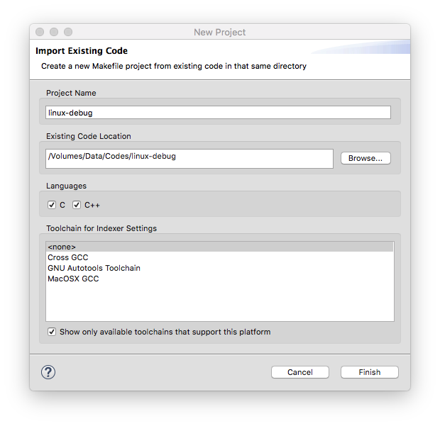
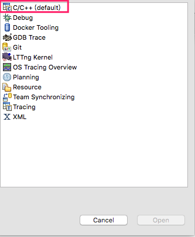
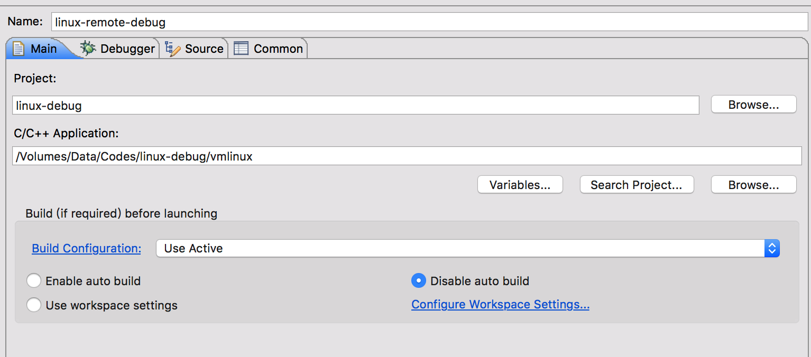
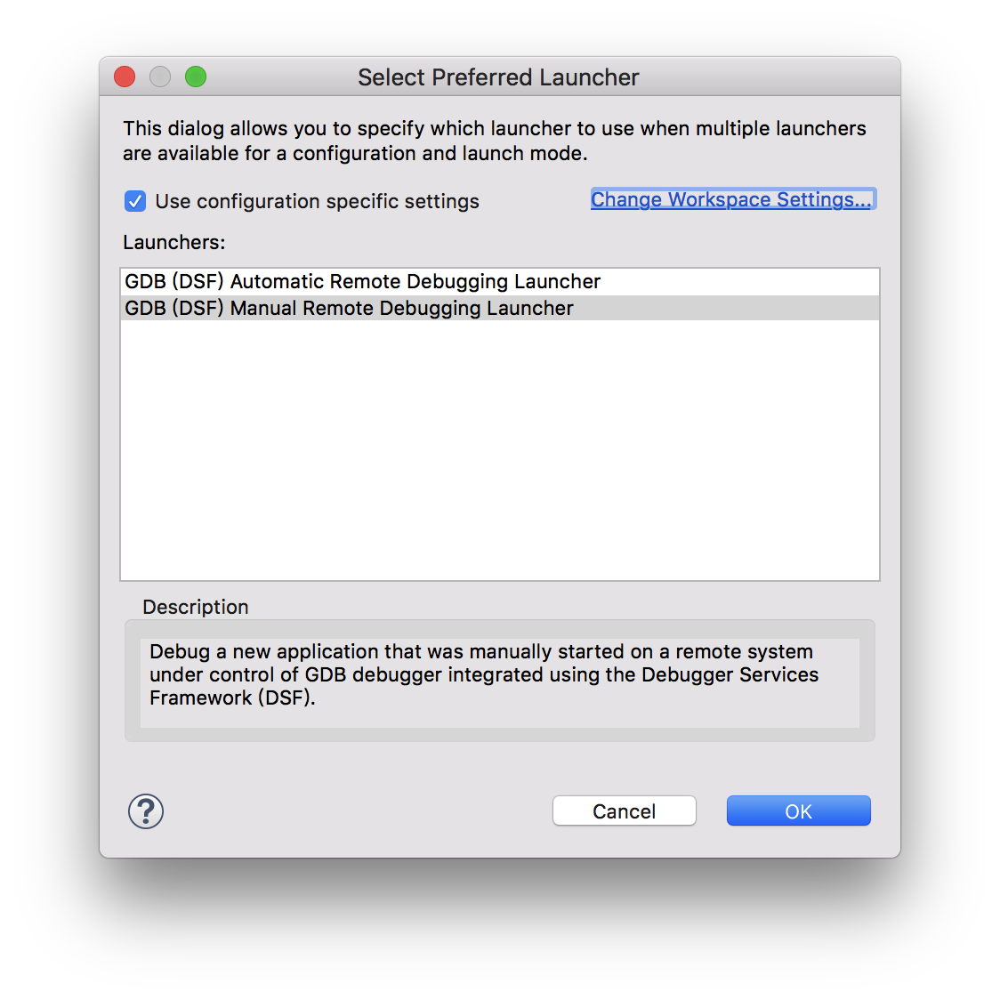
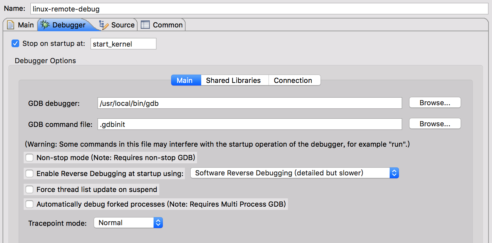
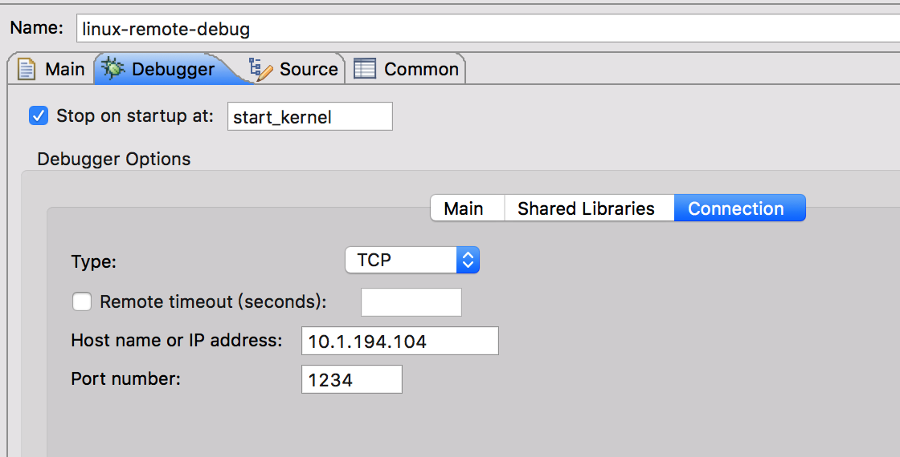
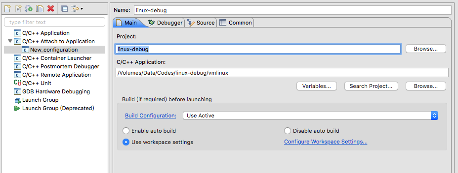
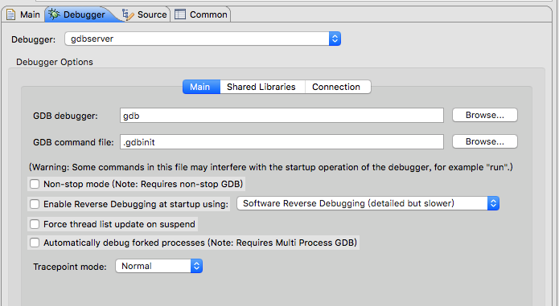
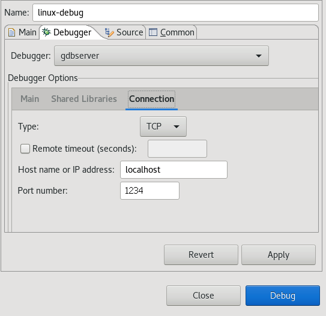

<!-- @import "[TOC]" {cmd="toc" depthFrom=1 depthTo=6 orderedList=false} -->

<!-- code_chunk_output -->

- [1 两个环境(远程调试)](#1-两个环境远程调试)
  - [1.1 初始化环境配置](#11-初始化环境配置)
  - [1.2 连接调试测试](#12-连接调试测试)
  - [1.3 配置 eclipse](#13-配置-eclipse)
    - [1.3.1 创建项目](#131-创建项目)
    - [1.3.2 配置 debug 选项](#132-配置-debug-选项)
      - [1.3.2.1 远程手动运行方式](#1321-远程手动运行方式)
      - [1.3.2.2 远程自动运行调试](#1322-远程自动运行调试)
- [2 同一个环境](#2-同一个环境)
  - [2.1 配置 eclipse](#21-配置-eclipse)
    - [2.1.1 配置 debug 选项](#211-配置-debug-选项)
- [3 参考](#3-参考)

<!-- /code_chunk_output -->

使用 `QEMU` + `GDB` + `Eclipse`调试 Linux 内核

有两种情况, 一种是内核虚拟机和 eclipse 在同一个环境, 另一种分属两个环境

# 1 两个环境(远程调试)

## 1.1 初始化环境配置

本地安装 Eclipse for Cpp, 这个版本自带了 CDT, 不用另行安装 CDT 插件.

本地 checkout 一份代码出来, 该代码和编译的调试用的 kernel commit 信息一致

本地安装 gdb

远端的 bzImage 作为虚拟机启动镜像

本地 vmlinux 是带有调试信息的镜像, 与上面的对应

## 1.2 连接调试测试

启动远端 gdbserver

```
qemu-system-x86_64 -smp 2 -m 1024 -kernel arch/x86/boot/bzImage -nographic -append "rdinit=/linuxrc loglevel=8 console=ttyS0" -S -s
```

或

```
qemu-system-x86_64 -smp 2 -m 1024 -kernel arch/x86/boot/bzImage -append "rdinit=/linuxrc loglevel=8" -S -s -daemonize
```

在当前节点

```
# telnet 10.1.194.104 1234

# gdb
(gdb) target remote 10.1.194.104:1234
(gdb) b start_kernel
(gdb) c
```

## 1.3 配置 eclipse

preferences-->C/C++-->indexer 去掉勾选 Enable indexer.

preferences-->General-->Workspace 去掉勾选 Build Automatically.

### 1.3.1 创建项目

New  ->  "Makefile Project with Existing Code", 这里代码目录选择上面说的与调试内核代码一致的目录, Toolchain 选为 None.



右上角"Debug", 选择"C/C\+\+"



### 1.3.2 配置 debug 选项

配置 debug 选项, "Run"  ->  "Debug Configurations", 选择"C\/C\+\+ Remote Application(属于 CDT 插件)"

Eclipse 的 C/C++插件 CDT 已经很好的支持 gdb 在远程调试了. 调试一个应用程序时, CDT 有三种运行方式:

1. Automatic Remote Launcher : **远程自动运行**, 这是最方便好用的一种方式

2. Manual Remote Launcher : **远程手动运行**. **用户**自己在**目标板**上运行**gdbserver**, 然后在**开发主机**上指定**远程连接的方式**(如 IP 地址和端口), 连接到 gdbserver

3. Remote Attach Launcher : **远程依附运行**. 类似于上一种, 但它不是重新运行程序开启一个 debug 会话, 而是**直接 Attach 到一个已经运行的程序**, 然后调试

在 Debug Configurations 对话框中, 创建一个远程调试配置, 这个配置在创建时会根据项目情况提供一个默认的配置, **默认**将使用第一种 Automatic Remote Launcher 方式, 这在 Main 标签中下方"GDB (DSF) Automatic Remote Debugging Launcher"可以看出, 点击右边的"**Select other**..."可以切换其它方式.

#### 1.3.2.1 远程手动运行方式

我们希望 Eclipse**每次生成一个项目**之后, **自动**把生成出来的**二进制程序拷贝到目标板上**, 这可以通过**NFS 挂载共享目录来实现**, 我们只需要配置项目属性(依次展开: C/C\+\+Build > Settings > Build Steps > Post\-build steps, 在 Command 中输入"cp ProgramBin /mnt/share")即可.

接下来配置 CDT 的 Debug 选项, 步骤如下:

1. 选中项目 -> 菜单栏 "Run" -> Debug Configurations...

2. 双击 C/C++ Remote Application 新建一个配置, Eclipse 会根据当前选择的项目初始化大部分配置, Project 选择我们的 linux\-debug 项目, application 填上面的带有调试信息的 vmlinux, 选中 Disable auto build



3. 在右下方点击"**Select other**", 选择"**GDB(DSF) Manual Remote Debugging Launcher**", 确认



4. 选择进入 Debugger 配置页, 在**Main 标签**中, GDB debugger 填写**gdb**, 如果**未加入 PATH**环境变量则应该**填入绝对路径**, Stop on startup at 填"start\_kernel"



5. 在 Debugger 配置页的 Shared Libraries 标签中, 可以添加库路径, 比如调试过程中要步入**外部函数**, 就必须在这里给出**带调试信息的库文件路径**, 否则会找不到该函数的定义

6. 在 Debugger 配置页的 Connection 标签中, Type 选"TCP", 并填写目标板上 gdbserver 监听的 IP 和端口号



所有配置完成后, 点"**Apply**"保存配置, 并关掉配置窗口, 不要直接"debug"

接下来在目标板上运行 gdbserver, 即上面的执行虚拟机命令

点击 CDT 工具栏中的绿色小虫子右边的箭头, 选择 Linux\-remote\-debug, 如果有什么错误提示不用理会, 继续 proceed.

连接成功后, 控制台会有输出, 也可以在控制台输入 gdb 调试指令, 也可以在 CDT 上直接加断点.

这时你会发现在 start\_kernel 处停了下来. F5 F6 这些快捷键都可以用.

#### 1.3.2.2 远程自动运行调试

在开发主机上查看目标板(远端主机)的系统状况, 如查看远程的文件, 查看进程列表等, 甚至打开终端运行远程机器上的程序. 我们还希望这样一个工具软件能集成在 Eclipse 上, 并且提供了 API 接口让 Eclipse 的插件能调用远程机器上的程序.

**TM/RSE** 就是这样一个工具, 全称是 Target Management / Remote Systems Explorer, 是 Eclipse 上的一个插件. Eclipse 的远程管理插件有很多, 但这个最常用, 所以我们安装了 Eclipse 的 C++版, 就自带了这个插件. ARM 的软件开发环境 DS-5  也使用了这个插件, 其实整个 DS-5 的基础都是 Eclipse 社区的开源软件搭建起来的. 关于 TM/RSE 的更多介绍, 可参考其官方资料: TM and RSE FAQ

我们可以在安装了 TM/RSE 的 Eclipse 上, 点击右上角的"Open Perspective"按钮, 打开"Remote System Explorer", 在 Remote System Explorer 上, 你可以很方便的管理多个远程连接, 查看远程文件和进程, 运行远程程序等.

RSE 支持很多网络连接类型, 常用的有:

- FTP/sFTP
- SSH
- Telnet

支持连接到 Unix/Linux/Windows 主机和 Local(本地). 要在开发主机上连接远程机器, 必须先在远程机器上安装并启动某一远程控制服务, 如 Telnet 服务、FTP 服务、SSH 服务. 如果远程主机安装了文件服务(如 FTP、SFTP)和 Shell 服务(如 SSH、Telnet), 那么可以在本地开发主机上, CDT 可以调用 RSE 的 API 接口拷贝生成的目标程序到远端, 并在远端目标板上运行 gdbserver, 从而做到自动下载和调试程序的功能.

CDT 调用 RSE 的 API 接口实现远程调试的过程可分解为:

通过文件服务接口下载编译的程序到目标板(可用的文件服务有: FTP、SFTP)
通过 Shell 运行目标板上的 gdbserver 加载下载的程序(可用的 Shell 服务有: SSH、Telnet)

上面的第一步不是必需的, 我们可以通过其它手段来实现, 如在目标板上 mount 一个 NFS 文件系统, 让开发主机(也挂载了同一个 NFT 文件系统)在编译后执行一条拷贝命令即可, 这可以在项目的编译选项中配置. 需要注意的是, 如果想忽略这一步骤, 还要在项目的 Debug Configuration 中, 勾选"Skip download to target path", 这样 CDT 才不会每次启动调试时都尝试打开文件服务接口.

为了方便, 我们还是希望让目标板同时提供文件服务和 Shell 服务. 我们有两种选择:

在目标板上部署 OpenSSH. OpenSSH 本身带了 SSH 服务和 SFTP 服务, 所以一个软件包可以搞定. 缺点是编译出来的文件很大

在目标板上部署 Dropbear 和 vsFTP(或者其它 FTP 服务器)

下面将分别介绍这两种方案.


file-->new-->c project-->project name 填写你自己合意的, 比如 linux-kernel-study / 去掉 use default location, location 输入框中选择你的 linux-4.4.19 路径.  / project type 选择 Makefile project-Empty project / Toolschains 选择 Linux GCC-->next-->Advanced Setting-->C/C++ Build-->去掉勾选 use default build command,  build command 输入框内写上 make CONFIG_DEBUG_SECTION_MISMATCH=y -j2, build directory 选择你的 linux-4.4.19 路径.  / Behavior 页签 Build(Increament build) 输入框中输入一个空格即可. 然后完成工程创建即可.


# 2 同一个环境

后面启动虚拟机

## 2.1 配置 eclipse

### 2.1.1 配置 debug 选项

选择"C/C\+\+ Attach to Application"双击, 新建一个配置, 起个名字

Main 中

Project 选择刚才创建的 project, C/C\+\+ Application 选择上面所说的 vmlinux.



Debugger 中

Debugger 选择"gdbserver"

Main 中, 如下



connection 中, 如下, 对端 IP 填写, 端口为 1234



点击右下的"apply"或者"debug"


# 3 参考

https://blog.csdn.net/linuxarmsummary/article/details/44975495