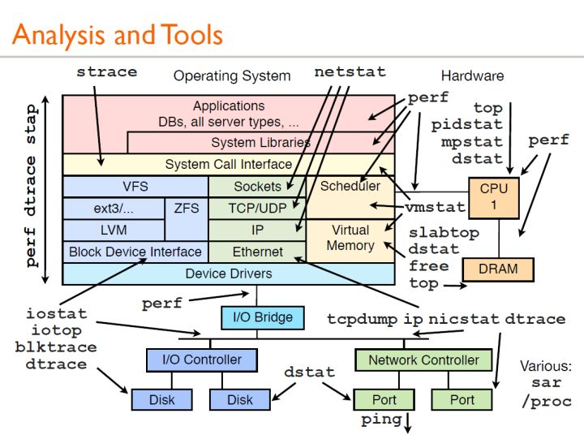
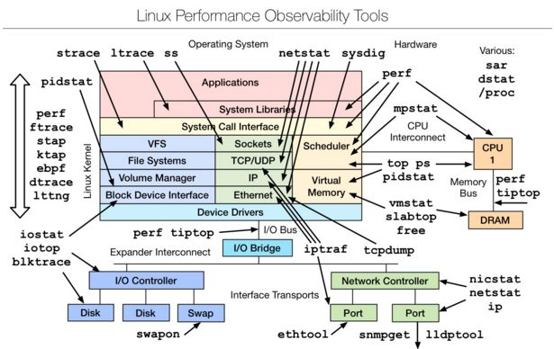
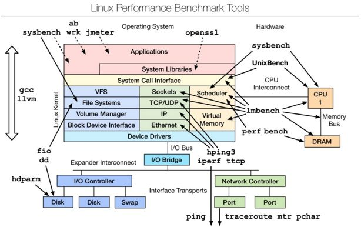
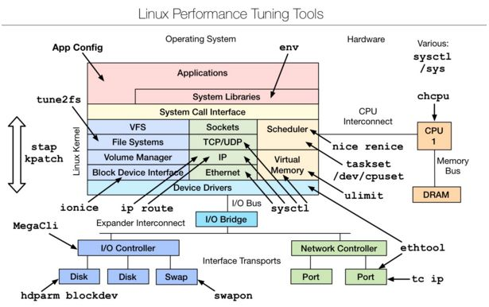
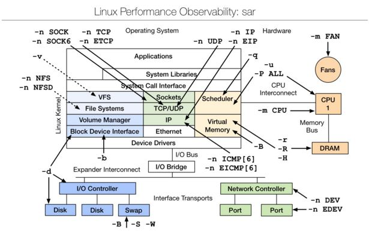

<!-- @import "[TOC]" {cmd="toc" depthFrom=1 depthTo=6 orderedList=false} -->

<!-- code_chunk_output -->

- [1. 性能分析概念](#1-性能分析概念)
  - [1.1. CPU](#11-cpu)
  - [1.2. 内存](#12-内存)
  - [1.3. 硬盘 I/O](#13-硬盘-io)
  - [1.4. 网络 I/O](#14-网络-io)
- [2. 性能分析工具](#2-性能分析工具)
  - [2.1. vmstat -- 虚拟内存统计](#21-vmstat---虚拟内存统计)
  - [2.2. iostat -- 用于设备的 IO 统计信息](#22-iostat---用于设备的-io-统计信息)
  - [2.3. dstat -- 系统监控工具](#23-dstat---系统监控工具)
  - [2.4. iotop -- Linux 进程对 IO 的实时监控工具](#24-iotop---linux-进程对-io-的实时监控工具)
  - [2.5. pidstat -- 监控进程对系统资源情况](#25-pidstat---监控进程对系统资源情况)
  - [2.6. top](#26-top)
  - [2.7. htop -- 进程查看器](#27-htop---进程查看器)
  - [2.8. mpstat -- 多处理器实时系统监控工具](#28-mpstat---多处理器实时系统监控工具)
  - [2.9. netstat -- 网络连接信息](#29-netstat---网络连接信息)
  - [2.10. ps -- 显示当前进程的状态](#210-ps---显示当前进程的状态)
  - [2.11. strace -- 跟踪程序执行过程中系统调用及收到的信号](#211-strace---跟踪程序执行过程中系统调用及收到的信号)
  - [2.12. uptime -- 系统运行时间与平均负荷](#212-uptime---系统运行时间与平均负荷)
  - [2.13. lsof -- 列出当前系统打开文件](#213-lsof---列出当前系统打开文件)
  - [2.14. perf -- 性能调优工具](#214-perf---性能调优工具)
  - [2.15. sar -- 多方面对系统的活动进行报告](#215-sar---多方面对系统的活动进行报告)
- [3. 常用的性能测试工具](#3-常用的性能测试工具)
  - [3.1. Linux observability tools | Linux 性能测试工具](#31-linux-observability-tools--linux-性能测试工具)
  - [3.2. Linux benchmarking tools | Linux 性能测评工具](#32-linux-benchmarking-tools--linux-性能测评工具)
  - [3.3. Linux tuning tools | Linux 性能调优工具](#33-linux-tuning-tools--linux-性能调优工具)
  - [3.4. Linux observability sar | linux 性能观测工具](#34-linux-observability-sar--linux-性能观测工具)
- [4. 参考](#4-参考)

<!-- /code_chunk_output -->

# 1. 性能分析概念

性能分析由系统资源分配和共享的效率决定, 在 OS 级别资源主要包括以下**四个方面因素**:

(1)CPU

(2)内存

(3)硬盘 I/O

(4)网络 I/O

## 1.1. CPU

CPU 方面主要的**性能指标**有

- **CPU 使用率**
- **上下文切换**
- **运行队列长度**

一般情况下建议的 CPU 性能指标情况如下:

1)对于**每一个 CPU**来说**运行队列不要超过 3**, 例如, 如果是双核 CPU 就不要超过 6;

2)如果**CPU**在**满负荷**运行, 应该**符合下列分布**

a) **User Time**: **65%~70%**

b) **System Time**: **30%~35%**

c) **Idle**: **0%~5%**

3)对于**上下文切换**要**结合 CPU 使用率**来看, 如果 CPU 使用满足上述分布, 大量的上下文切换也是可以接受的.

CPU 分析主要可以利用的工具有: top, sar, vmstat, mpstat, ps, uptime, tload 等

## 1.2. 内存

内存方面主要**性能指标**有:

- **活动虚拟内存总量**, 等于**实际内存大小**和**交换空间大小**之和
- **调页率**, 反映了采用**调页技术**对内存进行操作的程度
- **交换率**, 反映了采用交换技术对内存进行操作的程度

内存分析主要可以利用: free, vmstat, swapon 等

## 1.3. 硬盘 I/O

硬盘 I/O 方面主要性能指标有:

1) **IOPS**(Input/Output Per Second)即**每秒的输入输出量**(或**读写次数**), 是衡量磁盘性能的主要指标之一.

IOPS 是指**单位时间**内系统能处理的**I/O 请求数量**, 一般以每秒处理的 I/O 请求数量为单位, **I/O 请求**通常为**读或写数据操作请求**. 随机读写频繁的应用, 如**OLTP(Online Transaction Processing**), IOPS 是关键衡量指标.

2)数据吞吐量(Throughput), 指**单位时间**内可以**成功传输的数据数量**.

对于大量**顺序读写**的应用, 如 VOD(Video On Demand), 则更关注吞吐量指标, 其单位一般为 **Kbps, MB/s**等

3)**平均 I/O 数据尺寸**

平均 I/O 数据尺寸等于**吞吐量除以 I/O 数目**, 该指标对揭示磁盘使用模式有重要意义. 一般来说, 如果**平均 I/O 数据尺寸小于 32K**, 可认为磁盘使用模式以**随机存取**为主; 如果平均每次 I/O 数据尺寸大于 32K, 可认为磁盘使用模式以**顺序存取**为主.

4)**磁盘活动时间百分比**(Utilization)%util

磁盘处于活动时间的百分比, 即**磁盘利用率**, 磁盘在数据传输和处理命令(如寻道)处于活动状态. 磁盘利用率与资源争用程度成正比, 与性能成反比.

5)**服务时间**(ServiceTime)svctm

指磁盘读或写操作执行的时间, 包括寻道, 旋转时延, 和数据传输等时间. 其大小一般和磁盘性能有关, CPU/内存的负荷也会对其有影响, 请求过多也会间接导致服务时间的增加. 如果该值持续超过 20ms, 一般可考虑会对上层应用产生影响.

6)**I/O 等待队列长度**(Queue Length)

指**待处理的 I/O 请求的数目**, 如果 I/O 请求压力持续超出磁盘处理能力, 该值将增加

7)**等待时间**(Wait Time)

指磁盘读或写操作等待执行的时间, 即在队列中排队的时间. 如果 I/O 请求持续超出磁盘处理能力, 意味着来不及处理的 I/O 请求不得不在队列中等待较长时间.

常用命令: vmstat, iostat, sar 等

## 1.4. 网络 I/O

网络 I/O 方面的主要性能指标有:

1)**网络延时**: 网络延时是向目的地发送请求到目的地实际接收到数据包之间的时间间隔. 作为网络性能指标, 延时增加说明网络繁忙, 这意味着要传输的数据包数量超过了传输能力, 数据的发送者在传输或重新传输之前必须等待. 网络时延一般和网络结构的复杂性以及距离, 材料等因素有关.

2)**网络带宽**: 带宽表示在特定的一段时间内可以通过网络传输的数据包数量. 带宽影响可以传输的数据量, 它把向一个主机传输数据的速度限制为网络连接支持的最大速度, 在使用多个并发连接时限制总传输速度. 从理论上说, 网络带宽应该不会变, 除非改变网络接口和硬件. 影响网络带宽的主要因素是在给定时刻使用网络的主机数量.

常用命令有: ping, sar, spray, netstat

# 2. 性能分析工具

首先来看一张图:



上图是 Brendan Gregg 的一次性能分析的分享, 这里面的所有工具都可以通过 man 来获得它的帮助文档, 下面简单介绍介绍一下常规的用法:

## 2.1. vmstat -- 虚拟内存统计

vmstat(Virtual Meomory Statistics, 虚拟内存统计) 是 Linux 中监控内存的常用工具,可对操作系统的虚拟内存、进程、CPU 等的整体情况进行监视.

vmstat 的常规用法:

```
vmstat interval times
```

即**每隔 interval 秒**采样一次, 共采样**times 次**, 如果省略 times, 则一直采集数据, 直到用户手动停止为止.

简单举个例子:

```
[root@localhost ~]# vmstat 5
procs -----------memory---------- ---swap-- -----io---- -system-- ------cpu-----
 r  b   swpd   free   buff  cache   si   so    bi    bo   in   cs us sy id wa st
 1  0      0 12410676   3436 3086804    0    0     0     1    1    3  0  1 99  0  0
 0  0      0 12410668   3436 3086840    0    0     0     2   54   47  0  0 100  0  0
 0  0      0 12410668   3436 3086840    0    0     0     0   45   40  0  0 100  0  0
 0  0      0 12410676   3436 3086840    0    0     0     0   50   46  0  0 100  0  0
^C
```

可以使用 ctrl+c 停止 vmstat 采集数据.

**第一行！！！** 显示了**系统自启动以来的平均值**, 第二行开始显示现在正在发生的情况, 接下来的行会显示每 5 秒间隔发生了什么, 每一列的含义在头部, 如下所示:

procs: 进程活动

- **r**这一列显示了**internal 时间段内多少进程在等待 cpu**, 运行队列(就是说**多少个进程真的分配到 CPU**)
- b 列显示 internal 时间段内**多少进程正在不可中断的休眠**(IO wait 或 Paging 引起).

memory: 内存活动

- swapd 列显示了**多少块被换出了磁盘(页面交换**), 即已使用的交换内存(KB)
- free 显示空闲内存数(KB),
- buff 显示多少(KB)正在被用作缓冲区,
- cache 多少正在被用作操作系统的缓存(高速缓存). 打开的文件,给文件做缓冲, Linux/Unix 的聪明之处, 把空闲的物理内存的一部分拿来做文件和目录的缓存, 是为了提高 程序执行的性能, 当程序使用内存时, buffer/cached 会很快地被使用.

swap: 显示**交换活动**:

- si 每秒有多少块正在**从磁盘交换到内存**.
- so**从内存交换到磁盘**的交换页数量

io: IO 活动

- bi 每秒从块设备接收到的块数, 即读块设备, block number/s, 默认块大小是 1024byte
- bo 每秒发送到块设备的块数, 即写块设备.

bi 和 bo 一般都要接近 0, 不然就是 IO 过于频繁, 需要调整.

system: 系统活动

- in internal 时间段内 CPU 中断次数, 包括时间中断
- cs internal 时间段上下文切换的次数

cpu: 显示所有的**cpu 时间花费在各类操作的百分比**

- us 用户 CPU 时间, internal 时间段, 包含 nice 为负进程
- sy 系统 CPU 时间(内核), internal 时间段
- id 空闲 CPU 时间, internal 时间段
- wt 等待 IO CPU 时间, internal 时间段

**内存不足**的表现: free memory 急剧减少, 回收 buffer 和 cacher 也无济于事, 大量使用交换分区(swpd), 页面交换(swap)频繁, 读写磁盘数量(io)增多, 缺页中断(in)增多, 上下文切换(cs)次数增多, 等待 IO 的进程数(b)增多, 大量 CPU 时间用于等待 IO(wa)

## 2.2. iostat -- 用于设备的 IO 统计信息

## 2.3. dstat -- 系统监控工具

dstat 显示了**cpu 使用情况**, **磁盘 io 情况**, **网络发包情况**和**换页情况**, 输出是彩色的, 可读性较强, 相对于 vmstat 和 iostat 的输入更加详细且较为直观.

在使用时, 直接输入命令即可, 当然也可以使用特定参数.

```
[root@localhost ~]# dstat -cdlmnpsy --tcp
Terminal width too small, trimming output.
----total-cpu-usage---- -dsk/total- ---load-avg--- ------memory-usage----- -net/total- ---procs--- ----swap--- ---system-->
usr sys idl wai hiq siq| read  writ| 1m   5m  15m | used  buff  cach  free| recv  send|run blk new| used  free| int   csw >
  0   1  99   0   0   0|5644B 6954B|   0 0.01 0.05| 842M 3436k 2780M 11.8G|   0     0 |  0   0 6.5|   0  8000M| 613   289 >
  0   0 100   0   0   0|   0     0 |   0 0.01 0.05| 842M 3436k 2780M 11.8G| 745B 1386B|  0   0   0|   0  8000M|  48    47 >
  0   0 100   0   0   0|   0     0 |   0 0.01 0.05| 841M 3436k 2780M 11.8G|2283B  538B|  0   0   0|   0  8000M|  67    60 >
  0   0 100   0   0   0|   0     0 |   0 0.01 0.05| 841M 3436k 2780M 11.8G|1206B  538B|  0   0   0|   0  8000M|  95   104 >
  0   0 100   0   0   0|   0     0 |   0 0.01 0.05| 841M 3436k 2780M 11.8G| 999B  538B|  0   0   0|   0  8000M|  47    38 >
  0   0 100   0   0   0|   0     0 |   0 0.01 0.05| 841M 3436k 2780M 11.8G| 693B  628B|  0   0   0|   0  8000M|  50    40 >
  0   0 100   0   0   0|   0     0 |   0 0.01 0.05| 841M 3436k 2780M 11.8G|1137B  538B|  0   0   0|   0  8000M|  45    32 >
  0   0 100   0   0   0|   0     0 |   0 0.01 0.05| 842M 3436k 2780M 11.8G|1756B  538B|  0   0   0|   0  8000M|  73    88 >
  0   0 100   0   0   0|   0     0 |   0 0.01 0.05| 842M 3436k 2780M 11.8G|2772B  538B|  0   0   0|   0  8000M|  84    82 >
  0   0 100   0   0   0|   0     0 |   0 0.01 0.05| 842M 3436k 2780M 11.8G|1266B  538B|  0   0   0|   0  8000M|  47    48 >
  0   0 100   0   0   0|   0    28k|   0 0.01 0.05| 842M 3436k 2780M 11.8G| 701B  620B|  0   0   0|   0  8000M|  84    78 >
  0   0 100   0   0   0|   0     0 |   0 0.01 0.05| 842M 3436k 2780M 11.8G|2689B  546B|  0   0   0|   0  8000M| 107    97 >
  0   0 100   0   0   0|   0     0 |   0 0.01 0.05| 842M 3436k 2780M 11.8G| 413B  538B|  0   0   0|   0  8000M|  49    44 >
  0   0 100   0   0   0|   0     0 |   0 0.01 0.05| 842M 3436k 2780M 11.8G|2240B  538B|  0   0   0|   0  8000M|  69    68 >
  0   0 100   0   0   0|   0     0 |   0 0.01 0.05| 842M 3436k 2780M 11.8G|3096B  538B|  0   0   0|   0  8000M| 132   122 >
  0   0 100   0   0   0|   0     0 |   0 0.01 0.05| 842M 3436k 2780M 11.8G|4192B  538B|  0   0   0|   0  8000M| 110   124 >
  0   0 100   0   0   0|   0     0 |   0 0.01 0.05| 842M 3436k 2780M 11.8G|1508B  538B|  0   0   0|   0  8000M|  56    52 >
  0   0 100   0   0   0|   0     0 |   0 0.01 0.05| 841M 3436k 2780M 11.8G|2420B  538B|  0   0   0|   0  8000M|  56    52 >
  0   0 100   0   0   0|   0     0 |   0 0.01 0.05| 841M 3436k 2780M 11.8G|1357B  538B|  0   0   0|   0  8000M|  81    74 >
  0   0 100   0   0   0|   0     0 |   0 0.01 0.05| 841M 3436k 2780M 11.8G| 986B  538B|  0   0   0|   0  8000M|  78    88 >
  0   0 100   0   0   0|   0     0 |   0 0.01 0.05| 841M 3436k 2780M 11.8G|4525B  538B|  0   0   0|   0  8000M| 104    92 >
  0   0 100   0   0   0|   0     0 |   0 0.01 0.05| 841M 3436k 2780M 11.8G|1195B  538B|  0   0   0|   0  8000M|  54    51 >^C
```

## 2.4. iotop -- Linux 进程对 IO 的实时监控工具

iotop 命令是专门显示硬盘 IO 的命令, 界面风格类似 top 命令, 可以显示 IO 负载具体是由哪个进程产生的. 是一个用来监视磁盘 I/O 使用状况的 top 类工具, 具有与 top 相似的 UI, 其中包括 PID、用户、I/O、进程等相关信息.

可以以非交互的方式使用: iotop –bod interval

查看每个进程的 I/O, 可以使用 pidstat, pidstat –d instat.

## 2.5. pidstat -- 监控进程对系统资源情况

pidstat 主要用于监控全部或指定进程占用系统资源的情况,如 CPU,内存、设备 IO、任务切换、线程等.

使用方法: pidstat –d interval;

pidstat 还可以用以统计 CPU 使用信息: pidstat –u interval;

统计内存信息: pidstat –r interval.

## 2.6. top

分为了统计信息区和进程信息区两类

**统计信息区域**显示了五个方面的系统性能信息:

1.负载: 时间, 登陆用户数, 系统平均负载(同 uptime 命令的执行结果);

2.进程: 运行, 睡眠, 停止, 僵尸;

3.cpu:用户态, 核心态, NICE,空闲, 等待 IO,中断等;

4.内存: 总量, 已用, 空闲(系统角度), 缓冲, 缓存;

5.交换分区: 总量, 已用, 空闲

**进程信息区域**默认显示: 进程 ID,有效用户, **进程优先级**, **NICE 值**, 进程使用的**虚拟内存**, **物理内存**和**共享内存**, 进程状态, CPU 占用率, 内存占用率, **累计 CPU 时间**, 进程命令行信息.

```
top - 12:54:00 up 5 days, 19:59,  3 users,  load average: 0.00, 0.01, 0.05
Tasks: 271 total,   1 running, 270 sleeping,   0 stopped,   0 zombie
%Cpu(s):  0.0 us,  0.0 sy,  0.0 ni, 99.9 id,  0.0 wa,  0.0 hi,  0.0 si,  0.0 st
KiB Mem : 16114600 total, 12401332 free,   618816 used,  3094452 buff/cache
KiB Swap:  8191996 total,  8191996 free,        0 used. 15013356 avail Mem

  PID USER      PR  NI    VIRT    RES    SHR S  %CPU %MEM     TIME+ COMMAND
 8729 gdm       20   0 3917124 135348  45460 S   0.7  0.8   1:31.04 gnome-shell
25540 root      20   0  162172   2480   1600 R   0.3  0.0   0:00.18 top
    1 root      20   0  191916   4900   2640 S   0.0  0.0   0:20.76 systemd
    2 root      20   0       0      0      0 S   0.0  0.0   0:00.07 kthreadd
    3 root      20   0       0      0      0 S   0.0  0.0   0:01.67 ksoftirqd/0
    5 root       0 -20       0      0      0 S   0.0  0.0   0:00.00 kworker/0:0H
    7 root      rt   0       0      0      0 S   0.0  0.0   0:00.08 migration/0
    8 root      20   0       0      0      0 S   0.0  0.0   0:00.00 rcu_bh
    9 root      20   0       0      0      0 S   0.0  0.0  10:13.84 rcu_sched
   10 root       0 -20       0      0      0 S   0.0  0.0   0:00.00 lru-add-drain
   11 root      rt   0       0      0      0 S   0.0  0.0   0:01.96 watchdog/0
   12 root      rt   0       0      0      0 S   0.0  0.0   0:01.88 watchdog/1
   13 root      rt   0       0      0      0 S   0.0  0.0   0:00.11 migration/1
   14 root      20   0       0      0      0 S   0.0  0.0   0:00.04 ksoftirqd/1
   16 root       0 -20       0      0      0 S   0.0  0.0   0:00.00 kworker/1:0H
   17 root      rt   0       0      0      0 S   0.0  0.0   0:01.72 watchdog/2
```

- PID: 进程 ID
- PPID: 父进程 ID
- RUSER: Real user name
- UID: 进程所有者的用户 id
- USER: 进程所有者的用户名
- GROUP: 进程所有者的组名
- TTY: 启动进程的终端名. 不是从终端启动的进程则显示为?
- PR: 优先级
- NI: nice 值, 负值表示高优先级, 正值表示低优先级
- P: 最后使用的 CPU, 仅在多 CPU 才有意义
- %CPU: 上次更新到现在的 CPU 时间占用百分比
- TIME: 进程使用的 CPU 时间总计, 单位秒
- TIME\+: 进程使用的 CPU 时间总计, 单位 1/100 秒
- %MEM: 进程使用的物理内存百分比
- VIRT: 进程使用的虚拟内存总量, 单位 KB. VIRT=SWAP\+RES
- SWAP: 进程使用的虚拟内存中, 被换出的大小, 单位 KB
- RES: 进程使用的、未被换出的物理内存大小, 单位 KB, RES=CODE\+DATA
- CODE: 可执行代码占用的物理内存大小, 单位 KB
- DATA: 可执行代码以外的部分(数据段\+栈)占用的物理内存大小, 单位 KB
- SHR: 共享内存大小, 单位 KB
- NFLTIME: 页面错误次数
- NDRT: 最后一次写入到现在, 被修改过的页面数
- S: 进程状态
  - D: 不可中断的睡眠状态
  - R: 运行
  - S: 睡眠
  - T: 跟踪/停止
  - Z: 僵尸进程

默认情况下仅显示比较重要的 PID、USER、PR、NI、VIRT、RES、SHR、S、%CPU、%MEM、TIME\+、COMMAND 列. 可通过下面快捷键改变显示内容

按 f 可选择显示的内容, 会显示列的列表, 按 a\-z 即可显示或隐藏对应的列.

按 o 键可改变列的显示顺序. 按小写的 a\-z 可将相应列右移, 大写 A\-Z 将相应列左移

按大写 F 或 O 键, 然后按 a\-z 可将进程按照相应列进行排序. 而大写的 R 可将当前排序倒序.

## 2.7. htop -- 进程查看器

htop 是 Linux 系统中的一个互动的进程查看器,一个文本模式的应用程序(在控制台或者 X 终端中),需要 ncurses.

安装:

```
# 在 CentOS 7 上启用 epel 版本
yum -y install epel-release

# 安装
yum -y install htop
```

Htop 可让用户交互式操作, 支持颜色主题, 可横向或纵向滚动浏览进程列表, 并支持鼠标操作.

与 top 相比, htop 有以下优点:

可以横向或者纵向滚动浏览进程列表, 以便看到所有的进程和完整的命令行.

在启动上, 比 top 更快.

杀进程时不需要输入进程号.

htop 支持鼠标操作.

## 2.8. mpstat -- 多处理器实时系统监控工具

mpstat 是 Multiprocessor Statistics 的缩写, 是实时系统监控工具. 其报告与 CPU 的一些统计信息, 这些信息存放在/**proc/stat 文件**中.

在**多 CPUs 系统**里, 其不但能查看所有 CPU 的平均状况信息, 而且能够查看特定 CPU 的信息.

常见用法:

```
mpstat [–P {cpu|ALL}] [interval [times]]
```

\-P 后跟参数表示将要统计的 cpu 信息

interval 和 times 必须同时使用, interval 为统计的时间段(s), times 统计次数

```
[root@localhost ~]# mpstat -P ALL 5
Linux 3.10.0-957.5.1.el7.x86_64 (localhost.localdomain) 	2019 年 04 月 04 日 	_x86_64_	(12 CPU)

13 时 03 分 15 秒  CPU    %usr   %nice    %sys %iowait    %irq   %soft  %steal  %guest  %gnice   %idle
13 时 03 分 20 秒  all    0.02    0.00    0.00    0.00    0.00    0.00    0.00    0.00    0.00   99.98
13 时 03 分 20 秒    0    0.00    0.00    0.00    0.00    0.00    0.00    0.00    0.00    0.00  100.00
13 时 03 分 20 秒    1    0.00    0.00    0.00    0.00    0.00    0.00    0.00    0.00    0.00  100.00
13 时 03 分 20 秒    2    0.00    0.00    0.00    0.00    0.00    0.00    0.00    0.00    0.00  100.00
13 时 03 分 20 秒    3    0.00    0.00    0.00    0.00    0.00    0.00    0.00    0.00    0.00  100.00
13 时 03 分 20 秒    4    0.00    0.00    0.00    0.00    0.00    0.00    0.00    0.00    0.00  100.00
13 时 03 分 20 秒    5    0.00    0.00    0.00    0.00    0.00    0.00    0.00    0.00    0.00  100.00
13 时 03 分 20 秒    6    0.00    0.00    0.00    0.00    0.00    0.00    0.00    0.00    0.00  100.00
13 时 03 分 20 秒    7    0.00    0.00    0.00    0.00    0.00    0.00    0.00    0.00    0.00  100.00
13 时 03 分 20 秒    8    0.00    0.00    0.00    0.00    0.00    0.00    0.00    0.00    0.00  100.00
13 时 03 分 20 秒    9    0.00    0.00    0.00    0.00    0.00    0.00    0.00    0.00    0.00  100.00
13 时 03 分 20 秒   10    0.00    0.00    0.00    0.00    0.00    0.00    0.00    0.00    0.00  100.00
13 时 03 分 20 秒   11    0.00    0.00    0.00    0.00    0.00    0.00    0.00    0.00    0.00  100.00

13 时 03 分 20 秒  CPU    %usr   %nice    %sys %iowait    %irq   %soft  %steal  %guest  %gnice   %idle
13 时 03 分 25 秒  all    0.02    0.00    0.03    0.00    0.00    0.00    0.00    0.00    0.00   99.95
13 时 03 分 25 秒    0    0.00    0.00    0.00    0.00    0.00    0.00    0.00    0.00    0.00  100.00
13 时 03 分 25 秒    1    0.00    0.00    0.00    0.00    0.00    0.00    0.00    0.00    0.00  100.00
13 时 03 分 25 秒    2    0.00    0.00    0.00    0.00    0.00    0.00    0.00    0.00    0.00  100.00
13 时 03 分 25 秒    3    0.20    0.00    0.00    0.00    0.00    0.00    0.00    0.00    0.00   99.80
13 时 03 分 25 秒    4    0.00    0.00    0.00    0.00    0.00    0.00    0.00    0.00    0.00  100.00
13 时 03 分 25 秒    5    0.00    0.00    0.00    0.00    0.00    0.00    0.00    0.00    0.00  100.00
13 时 03 分 25 秒    6    0.00    0.00    0.20    0.00    0.00    0.00    0.00    0.00    0.00   99.80
13 时 03 分 25 秒    7    0.00    0.00    0.00    0.00    0.00    0.00    0.00    0.00    0.00  100.00
13 时 03 分 25 秒    8    0.00    0.00    0.00    0.00    0.00    0.00    0.00    0.00    0.00  100.00
13 时 03 分 25 秒    9    0.00    0.00    0.20    0.00    0.00    0.00    0.00    0.00    0.00   99.80
13 时 03 分 25 秒   10    0.20    0.00    0.00    0.00    0.00    0.00    0.00    0.00    0.00   99.80
13 时 03 分 25 秒   11    0.00    0.00    0.20    0.00    0.00    0.00    0.00    0.00    0.00   99.80
^C
```

CPU: 处理器 ID

usr: 在 interval 时间段内, 用户态的 CPU 时间(%), 不包含 nice 为负进程, usr/total\*100

nice: 在 interval 时间段内, nice 为负进程的 CPU 时间(%), nice/total\*100

system: 在 interval 时间段里, 核心时间(%), system/total\*100

iowait: 在 interval 时间段里, 硬盘 I/O 等待时间(%), iowait/total\*100

irq: 在 interval 时间段里, 硬中断时间(%), irq/total\*100

soft: 在 interval 时间段里, 软中断时间(%), softirq/total\*100

idle: 在 interval 时间段里, CPU 除去等待磁盘 IO 操作外的因为任何原因而空闲的时间闲置时间(%), idle/total\*100

intr/s: 在 interval 时间段里, 每秒 CPU 接收的中断的次数, intr/total\*100

## 2.9. netstat -- 网络连接信息

Netstat 用于显示与 IP、TCP、UDP 和 ICMP 协议相关的统计数据, 一般用于检验本机各端口的网络连接情况.

常见用法:

netstat –npl 可以查看你要打开的端口是否已经打开.

netstat –rn 打印路由表信息.

netstat –in 提供系统上的接口信息, 打印每个接口的 MTU,输入分组数, 输入错误, 输出分组数, 输出错误, 冲突以及当前的输出队列的长度.

## 2.10. ps -- 显示当前进程的状态

ps 参数太多, 具体使用方法可以参考 man ps, 常用的方法: ps aux #hsserver; ps –ef |grep #hundsun

杀掉某一程序的方法:

```
ps aux | grep mysqld | grep –v grep | awk '{print $2 }' xargs kill -9
```

杀掉僵尸进程:

```
ps –eal | awk '{if ($2 == "Z"){print $4}}' | xargs kill -9
```

## 2.11. strace -- 跟踪程序执行过程中系统调用及收到的信号

跟踪程序执行过程中产生的系统调用及接收到的信号, 帮助分析程序或命令执行中遇到的异常情况.

举例: 查看 mysqld 在 linux 上加载哪种配置文件, 可以通过运行下面的命令:

```
strace –e stat64 mysqld –print –defaults > /dev/null
```

## 2.12. uptime -- 系统运行时间与平均负荷

能够打印系统总共运行了多长时间和系统的平均负载, uptime 命令最后输出的三个数字的含义分别是 1 分钟, 5 分钟, 15 分钟内系统的平均负荷.

```
[root@gerry ~]# uptime
 15:29:43 up 11:42,  4 users,  load average: 0.00, 0.03, 0.05
```

## 2.13. lsof -- 列出当前系统打开文件

lsof(list open files)是一个列出当前系统打开文件的工具. 通过 lsof 工具能够查看这个列表对系统检测及排错, 常见的用法:

查看文件系统阻塞 lsof /boot

查看端口号被哪个进程占用 lsof -i :3306

查看用户打开哪些文件 lsof –u username

查看进程打开哪些文件 lsof –p 4838

查看远程已打开的网络链接 lsof –i @192.168.34.128

## 2.14. perf -- 性能调优工具

perf 是 Linux kernel 自带的系统性能优化工具. 优势在于与 Linux Kernel 的紧密结合, 它可以最先应用到加入 Kernel 的 new feature, 用于查看热点函数, 查看 cashe miss 的比率, 从而帮助开发者来优化程序性能.

性能调优工具如 perf, Oprofile 等的基本原理都是对被监测对象进行采样, 最简单的情形是根据 tick 中断进行采样, 即在 tick 中断内触发采样点, 在采样点里判断程序当时的上下文. 假如一个程序 90% 的时间都花费在函数 foo() 上, 那么 90% 的采样点都应该落在函数 foo() 的上下文中. 运气不可捉摸, 但我想只要采样频率足够高, 采样时间足够长, 那么以上推论就比较可靠. 因此, 通过 tick 触发采样, 我们便可以了解程序中哪些地方最耗时间, 从而重点分析.

想要更深的了解本工具可以参考:  http://blog.csdn.net/trochiluses/article/details/10261339

汇总: 结合以上常用的性能测试命令并联系文初的性能分析工具的图, 就可以初步了解到性能分析过程中哪个方面的性能使用哪方面的工具(命令).

## 2.15. sar -- 多方面对系统的活动进行报告

sar(System Activity Reporter 系统活动情况报告)是目前 Linux 上最为全面的系统性能分析工具之一, 可以从多方面对系统的活动进行报告, 包括: 文件的读写情况、系统调用的使用情况、磁盘 I/O、CPU 效率、内存使用状况、进程活动及 IPC 有关的活动等.


# 3. 常用的性能测试工具

熟练并精通了第二部分的性能分析命令工具, 引入几个性能测试的工具, 介绍之前先简单了解几个性能测试工具:

perf\_events: 一款随 Linux 内核代码一同发布和维护的性能诊断工具, 由内核社区维护和发展. Perf 不仅可以用于应用程序的性能统计分析, 也可以应用于内核代码的性能统计和分析.

更多参考: http://blog.sina.com.cn/s/blog_98822316010122ex.html.

eBPF tools: 一款使用 bcc 进行的性能追踪的工具,eBPF map 可以使用定制的 eBPF 程序被广泛应用于内核调优方面, 也可以读取用户级的异步代码. 重要的是这个外部的数据可以在用户空间管理. 这个 k-v 格式的 map 数据体是通过在用户空间调用 bpf 系统调用创建、添加、删除等操作管理的. more: http://blog.csdn.net/ljy1988123/article/details/50444693.

perf-tools: 一款基于 perf_events (perf) 和 ftrace 的 Linux 性能分析调优工具集. Perf-Tools 依赖库少, 使用简单. 支持 Linux 3.2 及以上内核版本. more: https://github.com/brendangregg/perf-tools.

bcc(BPF Compiler Collection): 一款使用 eBPF 的 perf 性能分析工具. 一个用于创建高效的内核跟踪和操作程序的工具包, 包括几个有用的工具和示例. 利用扩展的 BPF(伯克利数据包过滤器), 正式称为 eBPF, 一个新的功能, 首先被添加到 Linux 3.15. 多用途需要 Linux 4.1 以上 BCC.

更多参考: https://github.com/iovisor/bcc#tools.

ktap: 一种新型的 linux 脚本动态性能跟踪工具. 允许用户跟踪 Linux 内核动态. ktap 是设计给具有互操作性, 允许用户调整操作的见解, 排除故障和延长内核和应用程序. 它类似于 Linux 和 Solaris DTrace SystemTap. 更多参考:  https://github.com/ktap/ktap.

Flame Graphs:是一款使用 perf,system tap,ktap 可视化的图形软件, 允许最频繁的代码路径快速准确地识别, 可以是使用 http://github.com/brendangregg/flamegraph 中的开发源代码的程序生成.

更多参考: http://www.brendangregg.com/flamegraphs.html.

## 3.1. Linux observability tools | Linux 性能测试工具



首先学习的 Basic Tool 有如下:  uptime、top(htop)、mpstat、isstat、vmstat、free、ping、nicstat、dstat.

高级的命令如下:  sar、netstat、pidstat、strace、tcpdump、blktrace、iotop、slabtop、sysctl、/proc.

更多参考: http://www.open-open.com/lib/view/open1434589043973.html, 详细的命令使用方法可以参考 man

## 3.2. Linux benchmarking tools | Linux 性能测评工具



性能测评工具, 对于不同模块的性能测试可以使用相应的工具, 想要深入了解, 可以参考最下文的附件文档.

## 3.3. Linux tuning tools | Linux 性能调优工具



性能调优工具, 主要是从 linux 内核源码层进行的调优, 想要深入了解, 可以参考下文附件文档.

## 3.4. Linux observability sar | linux 性能观测工具



sar(System Activity Reporter 系统活动情况报告)是目前 LINUX 上最为全面的系统性能分析工具之一, 可以从多方面对系统的活动进行报告, 包括: 文件的读写情况、系统调用的使用情况、磁盘 I/O、CPU 效率、内存使用状况、进程活动及 IPC 有关的活动等方面.

sar 的常归使用方式:

```
sar [options] [-A] [-o file] t [n]
```

其中:  t 为采样间隔, n 为采样次数, 默认值是 1;  -o file 表示将命令结果以二进制格式存放在文件中, file 是文件名.  options 为命令行选项

更多参考: http://blog.csdn.net/mig_davidli/article/details/52149993

# 4. 参考

文章来自: http://mingxinglai.com/cn/2013/06/linux-performance-analysis-and-tools/#top

参考详单:

LCA2017_BPF_tracing_and_more

LISA2014_LinuxPerfAnalysisNewTools

Percona2016_LinuxSystemsPerf

SCaLE_Linux_vs_Solaris_Performance2014

SCALE2015_Linux_perf_profiling

SCALE2016_Broken_Linux_Performance_Tools

SREcon_2016_perf_checklists

Velocity2015_LinuxPerfTools