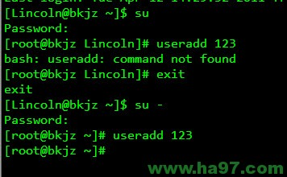
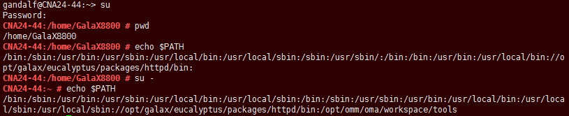

# su 与 su -命令的本质区别
大部分 Linux 发行版的默认账户是普通用户, 而更改系统文件或者执行某些命令, 需要 root 身份才能进行, 这就需要从当前用户切换到 root 用户. Linux 中切换用户的命令是 su 或 su -. 前天我在使用 useradd 这个命令时, 才体会到这两者的本质区别.

如图:

su 命令和 su -命令最大的本质区别就是: 前者只是切换了 root 身份, 但 Shell 环境仍然是普通用户的 Shell; 而后者连用户和 Shell 环境一起切换成 root 身份了. 只有切换了 Shell 环境才不会出现 PATH 环境变量错误. su 切换成 root 用户以后, pwd 一下, 发现工作目录仍然是普通用户的工作目录; 而用 su -命令切换以后, 工作目录变成 root 的工作目录了. 用 echo $PATH 命令看一下 su 和 su -以后的环境变量有何不同. 以此类推, 要从当前用户切换到其它用户也一样, 应该使用 su -命令. **

如图:

**Linux 就是这样, 有时候配置文件多了或者少了一个空格, 服务就运行不了. 细节问题一定要注意, 这样才能少走弯路！**

# 参考

https://www.howtoing.com/su-vs-sudo-and-how-to-configure-sudo-in-linux/