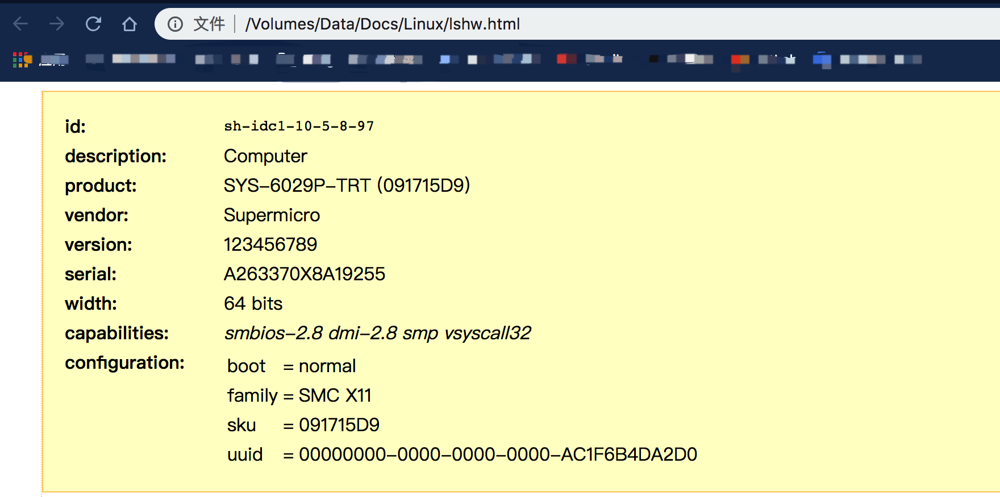

<!-- @import "[TOC]" {cmd="toc" depthFrom=1 depthTo=6 orderedList=false} -->

<!-- code_chunk_output -->

- [1. 查看系统信息 --- uname](#1-查看系统信息---uname)
- [2. 查看 Linux 系统硬件信息 --- lshw](#2-查看-linux-系统硬件信息---lshw)
- [3. 查看 Linux CPU 信息 --- lscpu](#3-查看-linux-cpu-信息---lscpu)
- [4. 收集 Linux 块设备信息 --- lsblk](#4-收集-linux-块设备信息---lsblk)
- [5. 打印 USB 控制器信息 --- lsusb](#5-打印-usb-控制器信息---lsusb)
- [6. 打印 PCI 设备信息 --- lspci](#6-打印-pci-设备信息---lspci)
- [7. 打印 SCSI 设备信息 --- lsscsi](#7-打印-scsi-设备信息---lsscsi)
- [8. 打印有关 SATA 设备的信息 --- hdparm](#8-打印有关-sata-设备的信息---hdparm)
- [9. 打印 Linux 文件系统信息 --- fdisk](#9-打印-linux-文件系统信息---fdisk)
- [10. 提取有关硬件组件的信息 --- dmidecode](#10-提取有关硬件组件的信息---dmidecode)
- [11. 概要](#11-概要)
- [12. 参考](#12-参考)

<!-- /code_chunk_output -->

# 1. 查看系统信息 --- uname

使用 uname 命令没有任何选项将打印**系统信息**或**UNAME \-s** 命令将打印**系统的内核名称**.

```
[root@SH-IDC1-10-5-8-97 ~]# uname
Linux
[root@SH-IDC1-10-5-8-97 ~]# uname -s
Linux
```

要查看**网络的主机名**, 请使用 uname 命令"\-n"开关, 如图所示.

```
[root@SH-IDC1-10-5-8-97 ~]# uname -n
SH-IDC1-10-5-8-97
```

要获取有关**内核版本**, 使用'\-v'开关信息. 可看到这是 2017 年 8 月版本的.

```
[root@SH-IDC1-10-5-8-97 ~]# uname -v
#1 SMP Tue Aug 22 21:09:27 UTC 2017
```

**内核版本的信息(即发行编号**), 请使用"-r"开关.

```
[root@SH-IDC1-10-5-8-97 ~]# uname -r
3.10.0-693.el7.x86_64
```

**机器硬件的名称**, 使用"-m"开关:

```
[root@SH-IDC1-10-5-8-97 ~]# uname -m
x86_64
```

**所有这些信息**可以通过一次如下所示运行"的 uname -a"命令进行打印.

```
[root@SH-IDC1-10-5-8-97 ~]# uname -a
Linux SH-IDC1-10-5-8-97 3.10.0-693.el7.x86_64 #1 SMP Tue Aug 22 21:09:27 UTC 2017 x86_64 x86_64 x86_64 GNU/Linux
```

# 2. 查看 Linux 系统硬件信息 --- lshw

在这里, 您可以使用**lshw 工具**来收集有关您的**硬件部件**, 如 CPU,  磁盘 ,  内存 , USB 控制器等大量信息 lshw 是一个相对较小的工具, 也有一些可以在提取信息, 它使用几个选项.

通过**lshw 提供的信息**聚集**不同的/proc 文件**.

注 : 请注意, 以超级用户(root)或 sudo 用户执行的 lshw 命令.

```
[root@SH-IDC1-10-5-8-97 ~]# lshw | more
sh-idc1-10-5-8-97
    description: Computer
    product: SYS-6029P-TRT (091715D9)
    vendor: Supermicro
    version: 123456789
    serial: A263370X8A19255
    width: 64 bits
    capabilities: smbios-2.8 dmi-2.8 smp vsyscall32
    configuration: boot=normal family=SMC X11 sku=091715D9 uuid=00000000-0000-0000-0000-AC1F6B4DA2D0
  *-core
       description: Motherboard
       product: X11DPi-NT
       vendor: Supermicro
       physical id: 0
       version: 1.21
       serial: NM188S036398
       slot: Default string
     *-firmware
          description: BIOS
          vendor: American Megatrends Inc.
          physical id: 0
          version: 2.1
          date: 06/29/2018
          size: 64KiB
          capacity: 32MiB
          capabilities: pci upgrade shadowing cdboot bootselect socketedrom edd int13floppy1200 int13floppy720 int13floppy2880 int5printscreen int14serial int17printer acpi usb b
iosbootspecification uefi
     *-memory
          description: System Memory
......
```

可以通过使用\-short 选择打印您的**硬件信息的汇总**.

```
[root@SH-IDC1-10-5-8-97 ~]# lshw -short
H/W path          Device          Class          Description
============================================================
                                  system         SYS-6029P-TRT (091715D9)
/0                                bus            X11DPi-NT
/0/0                              memory         64KiB BIOS
/0/13                             memory         128GiB System Memory
/0/13/0                           memory         32GiB DIMM DDR4 Synchronous 2666 MHz (0.4 ns)
/0/13/1                           memory         [empty]
/0/13/2                           memory         [empty]
/0/13/3                           memory         [empty]
/0/13/4                           memory         32GiB DIMM DDR4 Synchronous 2666 MHz (0.4 ns)
/0/13/5                           memory         [empty]
/0/13/6                           memory         [empty]
/0/13/7                           memory         [empty]
/0/13/8                           memory         32GiB DIMM DDR4 Synchronous 2666 MHz (0.4 ns)
......
```

如果想生成**一个 HTML 文件输出**, 可以使用该选项-html.

```
[root@SH-IDC1-10-5-8-97 ~]# lshw -html > /root/lshw.html
```



# 3. 查看 Linux CPU 信息 --- lscpu

要查看你的 CPU 信息, 请使用 lscpu 命令, 因为它显示你的 CPU 体系结构的信息, 如从**sysfs**中和的/**proc/cpuinfo** CPU 的数量, 内核, CPU 系列型号, CPU 高速缓存, 线程等.

```
[root@SH-IDC1-10-5-8-97 ~]# lscpu
Architecture:          x86_64
CPU op-mode(s):        32-bit, 64-bit
Byte Order:            Little Endian
CPU(s):                64
On-line CPU(s) list:   0-63
Thread(s) per core:    2
Core(s) per socket:    16
座:                  2
NUMA 节点:          2
厂商 ID:            GenuineIntel
CPU 系列:           6
型号:               85
型号名称:         Intel(R) Xeon(R) Gold 6130 CPU @ 2.10GHz
步进:               4
CPU MHz:              1100.000
CPU max MHz:           2101.0000
CPU min MHz:           1000.0000
BogoMIPS:             4200.00
虚拟化:            VT-x
L1d 缓存:           32K
L1i 缓存:           32K
L2 缓存:            1024K
L3 缓存:            22528K
NUMA 节点 0 CPU:     0-15,32-47
NUMA 节点 1 CPU:     16-31,48-63
Flags:                 fpu vme de pse tsc msr pae mce cx8 apic sep mtrr pge mca cmov pat pse36 clflush dts acpi mmx fxsr sse sse2 ss ht tm pbe syscall nx pdpe1gb rdtscp lm constant_tsc art arch_perfmon pebs bts rep_good nopl xtopology nonstop_tsc aperfmperf eagerfpu pni pclmulqdq dtes64 monitor ds_cpl vmx smx est tm2 ssse3 fma cx16 xtpr pdcm pcid dca sse4_1 sse4_2 x2apic movbe popcnt tsc_deadline_timer aes xsave avx f16c rdrand lahf_lm abm 3dnowprefetch epb cat_l3 cdp_l3 intel_pt tpr_shadow vnmi flexpriority ept vpid fsgsbase tsc_adjust bmi1 hle avx2 smep bmi2 erms invpcid rtm cqm mpx rdt_a avx512f avx512dq rdseed adx smap clflushopt clwb avx512cd avx512bw avx512vl xsaveopt xsavec xgetbv1 cqm_llc cqm_occup_llc cqm_mbm_total cqm_mbm_local dtherm ida arat pln pts
```

# 4. 收集 Linux 块设备信息 --- lsblk

**块设备是存储设备**, 诸如**硬盘, 闪存驱动器**等 lsblk 命令用于报告关于**块设备的信息**如下.

```
[root@SH-IDC1-10-5-8-97 ~]# lsblk
NAME   MAJ:MIN RM   SIZE RO TYPE MOUNTPOINT
sda      8:0    0   500G  0 disk
├─sda1   8:1    0     1G  0 part /boot
├─sda2   8:2    0   459G  0 part /
└─sda3   8:3    0    40G  0 part [SWAP]
sdb      8:16   0   1.3T  0 disk
sdc      8:32   0 893.8G  0 disk
```

如果你想查看系统上**所有的块设备**则包括\-a 选项.

```
[root@SH-IDC1-10-5-8-97 ~]# lsblk -a
NAME   MAJ:MIN RM   SIZE RO TYPE MOUNTPOINT
sda      8:0    0   500G  0 disk
├─sda1   8:1    0     1G  0 part /boot
├─sda2   8:2    0   459G  0 part /
└─sda3   8:3    0    40G  0 part [SWAP]
sdb      8:16   0   1.3T  0 disk
sdc      8:32   0 893.8G  0 disk
```

# 5. 打印 USB 控制器信息 --- lsusb

所述的**lsusb**命令用于报告关于**USB 控制器**和所有**连接到他们的设备**的信息.

```
[root@SH-IDC1-10-5-8-97 ~]# lsusb
Bus 002 Device 001: ID 1d6b:0003 Linux Foundation 3.0 root hub
Bus 001 Device 003: ID 0557:2419 ATEN International Co., Ltd
Bus 001 Device 002: ID 0557:7000 ATEN International Co., Ltd Hub
Bus 001 Device 001: ID 1d6b:0002 Linux Foundation 2.0 root hub
```

可以使用\-v 选项生成**每个 USB 设备**的**详细信息**.

```
[root@SH-IDC1-10-5-8-97 ~]# lsusb -v
```

# 6. 打印 PCI 设备信息 --- lspci

**PCI 设备**可以包括**USB 接口**, **显卡**, **网卡**等 lspci 的工具, 用于生成有关系统上的**所有 PCI 控制器**以及**连接到这些设备的信息**.  要打印有关 PCI 设备的信息, 请运行以下命令.

```
[root@SH-IDC1-10-5-8-97 ~]# lspci
00:00.0 Host bridge: Intel Corporation Device 2020 (rev 04)
00:04.0 System peripheral: Intel Corporation Sky Lake-E CBDMA Registers (rev 04)
00:04.1 System peripheral: Intel Corporation Sky Lake-E CBDMA Registers (rev 04)
00:04.2 System peripheral: Intel Corporation Sky Lake-E CBDMA Registers (rev 04)
00:04.3 System peripheral: Intel Corporation Sky Lake-E CBDMA Registers (rev 04)
......
```

使用\-t 选项以**树的形式**产生输出.

```
[root@SH-IDC1-10-5-8-97 ~]# lspci -t
-+-[0000:d7]-+-05.0
 |           +-05.2
 |           +-05.4
 |           +-0e.0
 |           +-0e.1
 |           +-0f.0
 |           +-0f.1
 |           +-10.0
 |           +-10.1
 |           +-12.0
 |           +-12.1
 |           +-12.2
 |           +-12.4
 |           +-12.5
 |           +-15.0
 |           +-16.0
 |           +-16.4
 |           \-17.0
 +-[0000:ae]-+-00.0-[af]----00.0
 |           +-05.0
 |           +-05.2
 |           +-05.4
 |           +-08.0
 |           +-09.0
 |           +-0a.0
......
```

使用\-v 选项, 产生**每个连接的设备的详细信息**.

```
[root@SH-IDC1-10-5-8-97 ~]# lspci -v | more
00:00.0 Host bridge: Intel Corporation Device 2020 (rev 04)
	Subsystem: Super Micro Computer Inc Device 0917
	Flags: fast devsel, NUMA node 0
	Capabilities: [90] Express Root Port (Slot-), MSI 00
	Capabilities: [e0] Power Management version 3
	Capabilities: [100] Vendor Specific Information: ID=0002 Rev=0 Len=00c <?>
	Capabilities: [144] Vendor Specific Information: ID=0004 Rev=1 Len=03c <?>
	Capabilities: [1d0] Vendor Specific Information: ID=0003 Rev=1 Len=00a <?>
	Capabilities: [250] #19
	Capabilities: [280] Vendor Specific Information: ID=0005 Rev=3 Len=018 <?>
	Capabilities: [298] Vendor Specific Information: ID=0007 Rev=0 Len=024 <?>
	Capabilities: [300] Vendor Specific Information: ID=0008 Rev=0 Len=038 <?>
......
```

# 7. 打印 SCSI 设备信息 --- lsscsi

要查看所有的 SCSI / SATA 设备, 使用如下命令使用 lsscsi.  如果您没有安装使用 lsscsi 工具, 运行以下命令来安装它.

```
$ sudo apt-get install lsscsi        [on Debian derivatives]
# yum install lsscsi                 [On RedHat based systems]
# dnf install lsscsi                 [On Fedora 21+ Onwards]
```

安装后, 运行使用 lsscsi 命令, 如下所示:

```
[root@SH-IDC1-10-5-8-97 ~]# lsscsi
[0:2:0:0]    disk    AVAGO    MR9361-8i        4.68  /dev/sda
[0:2:1:0]    disk    AVAGO    MR9361-8i        4.68  /dev/sdb
[0:2:2:0]    disk    AVAGO    MR9361-8i        4.68  /dev/sdc
```

使用\-s 选项, 以**显示设备尺寸**.

```
[root@SH-IDC1-10-5-8-97 ~]# lsscsi -s
[0:2:0:0]    disk    AVAGO    MR9361-8i        4.68  /dev/sda    536GB
[0:2:1:0]    disk    AVAGO    MR9361-8i        4.68  /dev/sdb   1.46TB
[0:2:2:0]    disk    AVAGO    MR9361-8i        4.68  /dev/sdc    959GB
```

# 8. 打印有关 SATA 设备的信息 --- hdparm

```
[root@SH-IDC1-10-5-8-97 ~]# hdparm /dev/sda1

/dev/sda1:
SG_IO: bad/missing sense data, sb[]:  70 00 05 00 00 00 00 0d 00 00 00 00 20 00 00 00 00 00 00 00 00 00 00 00 00 00 00 00 00 00 00 00
 multcount     =  0 (off)
 readonly      =  0 (off)
 readahead     = 256 (on)
 geometry      = 65270/255/63, sectors = 2097152, start = 2048
```

打印有关设备的几何 interms 的**柱面, 磁头, 扇区, 大小和起始的设备偏移信息**, 使用\-g 选项.

```
[root@SH-IDC1-10-5-8-97 ~]# hdparm -g /dev/sda1

/dev/sda1:
 geometry      = 65270/255/63, sectors = 2097152, start = 2048
```

# 9. 打印 Linux 文件系统信息 --- fdisk

要收集有关**文件系统的分区的信息**, 您可以使用 fdisk 命令.

虽然**fdisk 命令**的主要功能是**修改文件系统的分区**, 它也可以用来**查看有关文件系统上的不同分区的信息**.

```
[root@SH-IDC1-10-5-8-97 ~]# fdisk -l

磁盘 /dev/sda: 536.9 GB, 536870912000 字节, 1048576000 个扇区
Units = 扇区 of 1 * 512 = 512 bytes
扇区大小(逻辑/物理): 512 字节 / 512 字节
I/O 大小(最小/最佳): 262144 字节 / 262144 字节
磁盘标签类型: dos
磁盘标识符: 0x000b521b

   设备 Boot      Start         End      Blocks   Id  System
/dev/sda1   *        2048     2099199     1048576   83  Linux
/dev/sda2         2099200   964689919   481295360   83  Linux
/dev/sda3       964689920  1048575999    41943040   82  Linux swap / Solaris

磁盘 /dev/sdc: 959.7 GB, 959656755200 字节, 1874329600 个扇区
Units = 扇区 of 1 * 512 = 512 bytes
扇区大小(逻辑/物理): 512 字节 / 4096 字节
I/O 大小(最小/最佳): 262144 字节 / 262144 字节


磁盘 /dev/sdb: 1463.0 GB, 1462973235200 字节, 2857369600 个扇区
Units = 扇区 of 1 * 512 = 512 bytes
扇区大小(逻辑/物理): 512 字节 / 512 字节
I/O 大小(最小/最佳): 262144 字节 / 262144 字节
磁盘标签类型: dos
磁盘标识符: 0x35bbf43a

   设备 Boot      Start         End      Blocks   Id  System
```

# 10. 提取有关硬件组件的信息 --- dmidecode

还可以使用的 dmidecode 实用工具通过读取 DMI 表中的数据提取硬件信息.

具体查看 dmidecode

# 11. 概要

大多数这些命令的文件, 用在/ proc 目录提取系统信息.

# 12. 参考

- 该目录下: <获取 CPU 信息的命令>
- https://www.howtoing.com/tag/linux-tricks/