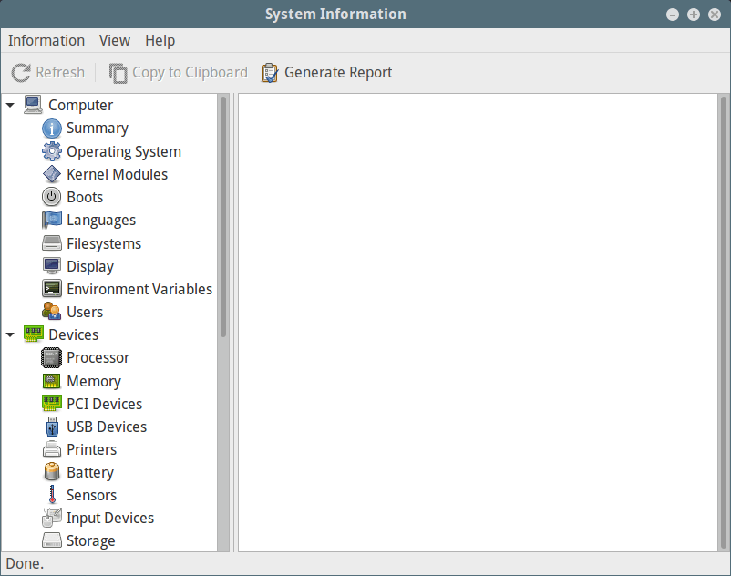

<!-- @import "[TOC]" {cmd="toc" depthFrom=1 depthTo=6 orderedList=false} -->

<!-- code_chunk_output -->

- [1 cat 命令 - 获取 CPU 信息](#1-cat-命令---获取-cpu-信息)
- [2 lscpu 命令 - 显示 CPU 架构信息](#2-lscpu-命令---显示-cpu-架构信息)
- [3 cpuid 命令 - 显示 x86 CPU](#3-cpuid-命令---显示-x86-cpu)
- [4 dmidecode 命令 - 显示 Linux 硬件信息](#4-dmidecode-命令---显示-linux-硬件信息)
- [5 Inxi 工具 - 显示 Linux 系统信息](#5-inxi-工具---显示-linux-系统信息)
- [6 lshw 工具 \- 列出硬件配置](#6-lshw-工具---列出硬件配置)
- [7 hardinfo \- 在 GTK \+窗口中显示硬件信息](#7-hardinfo---在-gtk-窗口中显示硬件信息)
- [hwinfo - 显示当前硬件信息](#hwinfo---显示当前硬件信息)
- [nproc - 打印处理单元数](#nproc---打印处理单元数)
- [脚本](#脚本)
- [其它资料](#其它资料)

<!-- /code_chunk_output -->

# 1 cat 命令 - 获取 CPU 信息

```
# cat /proc/cpuinfo
```

# 2 lscpu 命令 - 显示 CPU 架构信息

命令 lscpu 从 sysfs 和/proc/cpuinfo 打印 CPU 体系结构信息

```
# lscpu
Architecture:          x86_64
CPU op-mode(s):        32-bit, 64-bit
Byte Order:            Little Endian
CPU(s):                12
On-line CPU(s) list:   0-11
Thread(s) per core:    2
Core(s) per socket:    6
座:                  1
NUMA 节点:          1
厂商 ID:            GenuineIntel
CPU 系列:           6
型号:               158
型号名称:         Intel(R) Core(TM) i7-8700 CPU @ 3.20GHz
步进:               10
CPU MHz:              898.632
CPU max MHz:           4200.0000
CPU min MHz:           800.0000
BogoMIPS:             6384.00
虚拟化:            VT-x
L1d 缓存:           32K
L1i 缓存:           32K
L2 缓存:            256K
L3 缓存:            12288K
NUMA 节点 0 CPU:     0-11
Flags:                 fpu vme de pse tsc msr pae mce cx8 apic sep mtrr pge mca cmov pat pse36 clflush dts acpi mmx fxsr sse sse2 ss ht tm pbe syscall nx pdpe1gb rdtscp lm constant_tsc art arch_perfmon pebs bts rep_good nopl xtopology nonstop_tsc aperfmperf eagerfpu pni pclmulqdq dtes64 monitor ds_cpl vmx smx est tm2 ssse3 sdbg fma cx16 xtpr pdcm pcid sse4_1 sse4_2 x2apic movbe popcnt tsc_deadline_timer aes xsave avx f16c rdrand lahf_lm abm 3dnowprefetch epb intel_pt ssbd ibrs ibpb stibp tpr_shadow vnmi flexpriority ept vpid fsgsbase tsc_adjust bmi1 hle avx2 smep bmi2 erms invpcid rtm mpx rdseed adx smap clflushopt xsaveopt xsavec xgetbv1 dtherm ida arat pln pts hwp hwp_notify hwp_act_window hwp_epp spec_ctrl intel_stibp flush_l1d
```

# 3 cpuid 命令 - 显示 x86 CPU

命令 cpuid 转储从 CPUID 指令收集的 CPU 的完整信息, 并从该信息中发现 x86 CPU 的确切型号.

安装包

```
$ sudo apt install cpuid        #Debian/Ubuntu systems
$ sudo yum install cpuid	#RHEL/CentOS systems
$ sudo dnf install cpuid	#Fedora 22+
```

命令

```
# cpuid
```

# 4 dmidecode 命令 - 显示 Linux 硬件信息

dmidecode 是用于检索任何 Linux 系统的硬件信息的工具.  它以人性化的格式转储计算机的 DMI(又称 SMBIOS)表格, 便于检索.

```
[root@localhost ~]# dmidecode --type processor
# dmidecode 3.1
Getting SMBIOS data from sysfs.
SMBIOS 3.0.0 present.

Handle 0x004C, DMI type 4, 48 bytes
Processor Information
	Socket Designation: LGA1151
	Type: Central Processor
	Family: Core i7
	Manufacturer: Intel(R) Corporation
	ID: EA 06 09 00 FF FB EB BF
	Signature: Type 0, Family 6, Model 158, Stepping 10
	Flags:
		FPU (Floating-point unit on-chip)
		VME (Virtual mode extension)
		DE (Debugging extension)
		PSE (Page size extension)
		TSC (Time stamp counter)
		MSR (Model specific registers)
		PAE (Physical address extension)
		MCE (Machine check exception)
		CX8 (CMPXCHG8 instruction supported)
		APIC (On-chip APIC hardware supported)
		SEP (Fast system call)
		MTRR (Memory type range registers)
		PGE (Page global enable)
		MCA (Machine check architecture)
		CMOV (Conditional move instruction supported)
		PAT (Page attribute table)
		PSE-36 (36-bit page size extension)
		CLFSH (CLFLUSH instruction supported)
		DS (Debug store)
		ACPI (ACPI supported)
		MMX (MMX technology supported)
		FXSR (FXSAVE and FXSTOR instructions supported)
		SSE (Streaming SIMD extensions)
		SSE2 (Streaming SIMD extensions 2)
		SS (Self-snoop)
		HTT (Multi-threading)
		TM (Thermal monitor supported)
		PBE (Pending break enabled)
	Version: Intel(R) Core(TM) i7-8700 CPU @ 3.20GHz
	Voltage: 1.0 V
	External Clock: 100 MHz
	Max Speed: 8300 MHz
	Current Speed: 3200 MHz
	Status: Populated, Enabled
	Upgrade: Socket LGA1151
	L1 Cache Handle: 0x0049
	L2 Cache Handle: 0x004A
	L3 Cache Handle: 0x004B
	Serial Number: To Be Filled By O.E.M.
	Asset Tag: To Be Filled By O.E.M.
	Part Number: To Be Filled By O.E.M.
	Core Count: 6
	Core Enabled: 6
	Thread Count: 12
	Characteristics:
		64-bit capable
		Multi-Core
		Hardware Thread
		Execute Protection
		Enhanced Virtualization
		Power/Performance Control
```

关于 dmidecode 可查看 dmidocode 命令详细信息

# 5 Inxi 工具 - 显示 Linux 系统信息

Inxi 是一款功能强大的命令行系统信息脚本, 用于控制台和 IRC(Internet Relay Chat).  您可以使用它来即时检索硬件信息.

安装

```
$ sudo apt install inxi 	#Debian/Ubuntu systems
$ sudo yum install inxi		#RHEL/CentOS systems
$ sudo dnf install inxi		#Fedora 22+
```

要显示完整的 CPU 信息, 包括每个 CPU 时钟速度和 CPU 最大速度(如果有的话), 请使用\-C 标志, 如下所示:

```
[root@localhost ~]# inxi -C
CPU:       Topology: 6-Core model: Intel Core i7-8700 bits: 64 type: MT MCP L2 cache: 12.0 MiB
           Speed: 3731 MHz min/max: 800/4200 MHz Core speeds (MHz): 1: 898 2: 870 3: 876 4: 2007 5: 3795 6: 3798 7: 3591
           8: 876 9: 3794 10: 3718 11: 3718 12: 3770
```

关于 inxi 命令可以查看命令详细

# 6 lshw 工具 \- 列出硬件配置

lshw 是收集有关计算机硬件配置的深入信息的最小工具.

在这种情况下, 可以使用-C 选项来选择硬件类, CPU

```
[root@localhost ~]# lshw -C CPU
  *-cpu
       description: CPU
       product: Intel(R) Core(TM) i7-8700 CPU @ 3.20GHz
       vendor: Intel Corp.
       vendor_id: GenuineIntel
       physical id: 4c
       bus info: cpu@0
       version: Intel(R) Core(TM) i7-8700 CPU @ 3.20GHz
       serial: To Be Filled By O.E.M.
       slot: LGA1151
       size: 3899MHz
       capacity: 4200MHz
       width: 64 bits
       clock: 100MHz
       capabilities: lm fpu fpu_exception wp vme de pse tsc msr pae mce cx8 apic sep mtrr pge mca cmov pat pse36 clflush dts acpi mmx fxsr sse sse2 ss ht tm pbe syscall nx pdpe1gb rdtscp x86-64 constant_tsc art arch_perfmon pebs bts rep_good nopl xtopology nonstop_tsc aperfmperf eagerfpu pni pclmulqdq dtes64 monitor ds_cpl vmx smx est tm2 ssse3 sdbg fma cx16 xtpr pdcm pcid sse4_1 sse4_2 x2apic movbe popcnt tsc_deadline_timer aes xsave avx f16c rdrand lahf_lm abm 3dnowprefetch epb intel_pt ssbd ibrs ibpb stibp tpr_shadow vnmi flexpriority ept vpid fsgsbase tsc_adjust bmi1 hle avx2 smep bmi2 erms invpcid rtm mpx rdseed adx smap clflushopt xsaveopt xsavec xgetbv1 dtherm ida arat pln pts hwp hwp_notify hwp_act_window hwp_epp spec_ctrl intel_stibp flush_l1d cpufreq
       configuration: cores=6 enabledcores=6 threads=12
```

# 7 hardinfo \- 在 GTK \+窗口中显示硬件信息

hardinfo 在 GTK +窗口中显示硬件信息

安装

```
$ sudo apt install hardinfo 	#Debian/Ubuntu systems
$ sudo yum install hardinfo	#RHEL/CentOS systems
$ sudo dnf install hardinfo	#Fedora 22+
```

输入

```
# hardinfo
```

Linux 系统信息:



它还使您能够通过单击" 生成报告 "按钮生成系统硬件信息报告.  从下面的界面, 点击" 生成 "继续.  请注意, 您可以选择要生成的硬件信息类别.

生成系统信息报告:


一旦您以 html 格式生成报告, 您可以从网络浏览器查看, 如下所示.


# hwinfo - 显示当前硬件信息

hwinfo 用于提取有关 Linux 系统中存在的硬件的信息.  要显示有关 CPU 的信息, 请使用\-\-cpu

```
[root@localhost ~]# hwinfo --cpu
```

# nproc - 打印处理单元数

nproc 命令用于显示计算机上存在的处理单元数量:

```
[root@localhost ~]# nproc
12
```

# 脚本

cpuinfo: https://github.com/workhorsy/py-cpuinfo


# 其它资料

- [Cpustat - 通过在 Linux 中运行进程监视 CPU 利用率](https://www.howtoing.com/cpustat-monitors-cpu-utilization-by-processes-in-linux/)
- [CoreFreq - 用于 Linux 系统的强大的 CPU 监控工具](https://www.howtoing.com/corefreq-linux-cpu-monitoring-tool/)
- [通过 Linux 中最高内存和 CPU 使用情况查找最高运行进程](https://www.howtoing.com/find-linux-processes-memory-ram-cpu-usage/)
- [如何使用"压力"工具在 Linux 上强加高 CPU 负载和压力测试](https://www.howtoing.com/linux-cpu-load-stress-test-with-stress-ng-tool/)