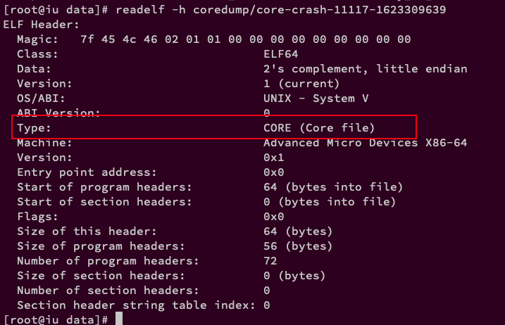

<!-- @import "[TOC]" {cmd="toc" depthFrom=1 depthTo=6 orderedList=false} -->

<!-- code_chunk_output -->

- [什么是 coredump](#什么是-coredump)
- [coredump 文件的存储位置](#coredump-文件的存储位置)
- [如何判断一个文件是 coredump 文件](#如何判断一个文件是-coredump-文件)
- [产生 coredum 的一些条件总结](#产生-coredum-的一些条件总结)
  - [打开 core dump](#打开-core-dump)
  - [查看保存路径和文件名格式](#查看保存路径和文件名格式)
- [coredump 产生的几种可能情况](#coredump-产生的几种可能情况)
- [利用 gdb 进行 coredump 的定位](#利用-gdb-进行-coredump-的定位)

<!-- /code_chunk_output -->

# 什么是 coredump

在使用半导体作为内存的材料前, 人类是利用线圈当作内存的材料(发明者为王安), 线圈就叫作 core , 用线圈做的内存就叫作"core memory". (线圈的单词应该是 coil)如今, 半导体工业澎勃发展, 已经没有人用线圈当内存了, 不过, 在许多情况下, 人们还是把内存叫作"core". 所以注意了: 这里的 core 不是核心, 而是内存. 不过结合实际来看, 好像也有点"内核所占内存"的意思.

core dump 又是什么?我们在开发(或使用)一个程序时, 最怕的就是程序莫明其妙地挂掉. 虽然系统没事, 但我们下次仍可能遇到相同的问题. 于是, 这时操作系统就会把**程序挂掉时的内存内容**写入一个叫做**core 的文件**里(这个写入的动作就叫 dump, dump 的英语意思是垃圾、倾倒. 从这里来看, 这些内存的内容是程序错误运行的结果, 所以算是垃圾, 把他弄出来就好比从大的内存池里"倾倒". ), 以便于我们调试. **这个过程**, 因此叫做**core dump**.

通常情况下, core 文件会包含了**程序运行时**的**内存**, **寄存器状态**, **堆栈指针**, **内存管理信息**还有**各种函数调用堆栈信息**等, 我们可以理解为是**程序工作当前状态**存储生成**一个文件**, 许多的程序出错的时候都会产生一个 core 文件, 通过工具分析这个文件, 我们可以定位到程序异常退出的时候对应的堆栈调用等信息, 找出问题所在并进行及时解决.

Linux 下的 C 程序常常会因为内存访问错误等原因造成 segment fault(段错误), 此时如果系统 core dump 功能是打开的, 那么将会有内存映像转储到硬盘上来, 之后可以用 gdb 对 core 文件进行分析, 还原系统发生段错误时刻的堆栈情况. 这对于我们发现程序 bug 很有帮助.

# coredump 文件的存储位置

1. core 文件默认的存储位置与对应的可执行程序在同一目录下, 文件名是 core, 大家可以通过下面的命令看到 core 文件的存在位置:

```
cat  /proc/sys/kernel/core_pattern
缺省值是 core
```

注意: 这里是指**在进程当前工作目录的下创建**. 通常与程序在相同的路径下. 但如果程序中调用了**chdir 函数**, 则有可能改变了当前工作目录. 这时 core 文件创建在 chdir 指定的路径下. 有好多程序崩溃了, 我们却找不到 core 文件放在什么位置. 和 chdir 函数就有关系. 当然程序崩溃了不一定都产生 core 文件.

如下程序代码: 则会把生成的 core 文件存储在/data/coredump/wd, 而不是大家认为的跟可执行文件在同一目录.

```cpp
#include <stdio.h>
#include <unistd.h>

int main(){
	const char *wdir = "/data/coredump/wd";
	int ret = -1;
	ret = chdir(wdir);
	if (0 != ret){
		printf("chdir failed, ret: %s", ret);
		return 0;
	}
	char *ptr = "linux.xxx";
	*ptr = 0;

	return 0;
}
```

2. 可以在`/proc/sys/kernel`中找到`core_user_pid`, 通过下面命令使 core 文件名加上 pid 号, 还可以用

```
echo "1" > /proc/sys/kernel/core_uses_pid
```

如果这个文件的内容被配置成 1, 那么即使 core_pattern 中没有设置%p, 最后生成的 core dump 文件名仍会加上进程 ID.

3. 还可以通过下面命令控制 core 文件保存位置和文件名格式.

```
mkdir -p /root/corefile

echo "/root/corefile/core-%e-%p-%t" > /proc/sys/kernel/core_pattern
```

以下是参数列表:
```
%%   单个%字符
%p - insert pid into filename 添加 pid
%u - insert current uid into filename 添加当前 uid
%g - insert current gid into filename 添加当前 gid
%s - insert signal that caused the coredump into the filename 添加导致产生 core 的信号
%t - insert UNIX time that the coredump occurred into filename 添加 core 文件生成时的 unix 时间
%h - insert hostname where the coredump happened into filename 添加主机名
%e - insert coredumping executable name into filename 添加程序文件名
```

4. 通过下面的命令可以更改 coredump 文件的存储位置, 若你希望把 core 文件生成到/data/coredump/core 目录下:

```
echo "/data/coredump/core"> /proc/sys/kernel/core_pattern
```

注意, 这里当前用户必须具有对/proc/sys/kernel/core_pattern 的写权限.

5. 使用下面的命令使 kernel 生成名字为 core.filename.pid 格式的 core dump 文件:

```
echo "/data/coredump/core.%e.%p" >/proc/sys/kernel/core_pattern
```

这样配置后, 产生的 core 文件中将带有崩溃的程序名、以及它的进程 ID. 上面的%e 和%p 会被替换成程序文件名以及进程 ID.

如果在上述文件名中包含目录分隔符"/", 那么所生成的 core 文件将会被放到指定的目录中.

# 如何判断一个文件是 coredump 文件

在类 unix 系统下, coredump 文件本身主要的格式也是 ELF 格式, 因此, 我们可以通过 readelf 命令进行判断.

> readelf -h coredump/core-crash-11117-1623309639



可以看到 ELF 文件头的 Type 字段的类型是: CORE (Core file)

可以通过简单的 file 命令进行快速判断:


# 产生 coredum 的一些条件总结

1. 产生 coredump 的条件, 首先需要确认当前会话打开了 core dump.

`ulimit -c`, 若为 0, 则不会产生对应的 coredump, 需要进行修改和设置.

使用`ulimit -a`可以查看系统 core 文件的大小限制


可以看出, 这里的 size 的单位是 blocks, 一般 `1block = 512bytes`

使用`ulimit -c [kbytes]`可以设置系统允许生成的 core 文件大小

```
ulimit -c 0 不产生 core 文件
ulimit -c 100 设置 core 文件最大为 100k
ulimit -c unlimited 不限制 core 文件大小
```

若想甚至对应的字符大小, 则可以指定: `ulimit –c [size]`

但当前设置的 ulimit 只对当前会话有效, 若想系统均有效, 则需要进行如下设置:

## 打开 core dump

方法一:   配置 profile 文件, 打开 `/etc/profile` 文件, 在里面可以找到【`ulimit -S -c 0 > /dev/null 2>&1`】, 将它改成【`ulimit -S -c unlimited > /dev/null 2>&1`】; 或者下面命令

```
echo "ulimit -c unlimited"  >> /etc/profile
```


方法二: 修改 `/etc/security/limits.conf` 文件, 添加【* soft core 0】, 这个方法可以针对指定用户或用户组打开 core dump【user soft core 0 或@group soft core 0】. 不过要使用这个方法一定要将方法一提到的那行注释掉, 不可同时存在

## 查看保存路径和文件名格式

`/proc/sys/kernel/core_pattern` 和 `/proc/sys/kernel/core_uses_pid`

- 在/etc/sysctl.conf 中加入以下一行, 这将使程序崩溃时生成的 coredump 文件位于/data/coredump/目录下, 再执行命令【sysctl -p】即可生效:

```
kernel.core_pattern = /data/coredump/core.%e.%p
```

注意:需要注意的是该路径必须应用有写的权限, 不然 core 文件是不会生成的

更多 ulimit 的命令使用, 可以参考: https://baike.baidu.com/item/ulimit

2. 当前用户, 即执行对应程序的用户具有对写入 core 目录的写权限以及有足够的空间.

3. 几种不会产生 core 文件的情况说明:

```
The core file will not be generated if
(a) the process was set-user-ID and the current user is not the owner of the program file, or
(b) the process was set-group-ID and the current user is not the group owner of the file,
(c) the user does not have permission to write in the current working directory,
(d) the file already exists and the user does not have permission to write to it, or
(e) the file is too big (recall the RLIMIT_CORE limit in Section 7.11). The permissions of the core file (assuming that the file doesn't already exist) are usually user-read and user-write, although Mac OS X sets only user-read.
```

# coredump 产生的几种可能情况

发生 doredump 一般都是在**进程收到某个信号**的时候, linux 上现在大概有 60 多个信号, 可以使用 kill -l 命令全部列出来.

```
[root@bogon coredump_test]# kill -l
 1) SIGHUP	 2) SIGINT	 3) SIGQUIT	 4) SIGILL	 5) SIGTRAP
 6) SIGABRT	 7) SIGBUS	 8) SIGFPE	 9) SIGKILL	10) SIGUSR1
11) SIGSEGV	12) SIGUSR2	13) SIGPIPE	14) SIGALRM	15) SIGTERM
16) SIGSTKFLT	17) SIGCHLD	18) SIGCONT	19) SIGSTOP	20) SIGTSTP
21) SIGTTIN	22) SIGTTOU	23) SIGURG	24) SIGXCPU	25) SIGXFSZ
26) SIGVTALRM	27) SIGPROF	28) SIGWINCH	29) SIGIO	30) SIGPWR
31) SIGSYS	34) SIGRTMIN	35) SIGRTMIN+1	36) SIGRTMIN+2	37) SIGRTMIN+3
38) SIGRTMIN+4	39) SIGRTMIN+5	40) SIGRTMIN+6	41) SIGRTMIN+7	42) SIGRTMIN+8
43) SIGRTMIN+9	44) SIGRTMIN+10	45) SIGRTMIN+11	46) SIGRTMIN+12	47) SIGRTMIN+13
48) SIGRTMIN+14	49) SIGRTMIN+15	50) SIGRTMAX-14	51) SIGRTMAX-13	52) SIGRTMAX-12
53) SIGRTMAX-11	54) SIGRTMAX-10	55) SIGRTMAX-9	56) SIGRTMAX-8	57) SIGRTMAX-7
58) SIGRTMAX-6	59) SIGRTMAX-5	60) SIGRTMAX-4	61) SIGRTMAX-3	62) SIGRTMAX-2
63) SIGRTMAX-1	64) SIGRTMAX
```

针对**特定的信号**, 应用程序可以写**对应的信号处理函数**. 如果**不指定**, 则采取**默认的处理方式**, **默认处理是 coredump 的信号**如下:

```
3)SIGQUIT   4)SIGILL    6)SIGABRT   8)SIGFPE    11)SIGSEGV
7)SIGBUS   31)SIGSYS    5)SIGTRAP  24)SIGXCPU   25)SIGXFSZ
29)SIGIOT
```

我们看到**SIGSEGV**在其中, 一般**数组越界**或是**访问空指针**都会产生这个信号. 另外虽然默认是这样的, 但是你也可以写自己的信号处理函数改变默认行为, 更多信号相关可以看参考网络.

造成程序 coredump 的原因有很多, 这里总结一些比较常用的经验吧:

1. 内存访问越界

a) 由于使用错误的下标, 导致数组访问越界.

b) 搜索字符串时, 依靠字符串结束符来判断字符串是否结束, 但是字符串没有正常的使用结束符.

c) 使用 strcpy, strcat, sprintf, strcmp,strcasecmp 等字符串操作函数, 将目标字符串读/写爆. 应该使用 strncpy, strlcpy, strncat, strlcat, snprintf, strncmp, strncasecmp 等函数防止读写越界.

2. 多线程程序使用了线程不安全的函数.

3. 多线程读写的数据未加锁保护.

对于会被多个线程同时访问的全局数据, 应该注意加锁保护, 否则很容易造成 coredump

4. 非法指针

a) 使用空指针

b) 随意使用指针转换. 一个指向一段内存的指针, 除非确定这段内存原先就分配为某种结构或类型, 或者这种结构或类型的数组, 否则不要将它转换为这种结构或类型的指针, 而应该将这段内存拷贝到一个这种结构或类型中, 再访问这个结构或类型. 这是因为如果这段内存的开始地址不是按照这种结构或类型对齐的, 那么访问它时就很容易因为 bus error 而 core dump.

5. 堆栈溢出

不要使用大的局部变量(因为局部变量都分配在栈上), 这样容易造成堆栈溢出, 破坏系统的栈和堆结构, 导致出现莫名其妙的错误.

# 利用 gdb 进行 coredump 的定位

- 第一个例子

1. 我们写一段代码往受到系统保护的地址写内容.

```cpp
#include <stdio.h>

void core_test1(){
	int i = 0;
	scanf("%d", i);
	printf("%d\n", i);
}

void core_test2(){
	char *ptr = "test";
	*ptr = 0;
}

int main(){
	core_test1();
	return 0;
}
```

2. 按如下方式进行编译和执行, 注意这里需要-g 选项编译.

```
[root@bogon coredump_test]# gcc -g -o test access_protected_addr.c
[root@bogon coredump_test]# ./test
12
Segmentation fault (core dumped)
```

可以看到, 当输入 12 的时候, 系统提示段错误并且 core dumped


3. 进入对应的 core 文件生成目录, 先确认是否 core 文件格式并 gdb 调试

```
[root@bogon coredump_test]# gdb test core.23499
GNU gdb (GDB) Red Hat Enterprise Linux 7.6.1-80.el7
Copyright (C) 2013 Free Software Foundation, Inc.
License GPLv3+: GNU GPL version 3 or later <http://gnu.org/licenses/gpl.html>
This is free software: you are free to change and redistribute it.
There is NO WARRANTY, to the extent permitted by law.  Type "show copying"
and "show warranty" for details.
This GDB was configured as "x86_64-redhat-linux-gnu".
For bug reporting instructions, please see:
<http://www.gnu.org/software/gdb/bugs/>...
Reading symbols from /home/gerry/coredump_test/test...done.

warning: exec file is newer than core file.
[New LWP 23499]
Core was generated by `./test'.
Program terminated with signal 11, Segmentation fault.
#0  0x00000000004004fc in deregister_tm_clones ()
Missing separate debuginfos, use: debuginfo-install glibc-2.17-105.el7.x86_64
(gdb) bt
#0  0x00000000004004fc in deregister_tm_clones ()
#1  0x00007fff153a5240 in ?? ()
#2  0x0000000000400512 in register_tm_clones ()
#3  0x0000000000000000 in ?? ()
(gdb) run
Starting program: /home/gerry/coredump_test/test
12

Program received signal SIGSEGV, Segmentation fault.
0x00007ffff7a744f2 in __GI__IO_vfscanf () from /lib64/libc.so.6
(gdb) bt
#0  0x00007ffff7a744f2 in __GI__IO_vfscanf () from /lib64/libc.so.6
#1  0x00007ffff7a82f29 in __isoc99_scanf () from /lib64/libc.so.6
#2  0x00000000004005c3 in core_test1 () at access_protected_addr.c:5
#3  0x00000000004005fc in main () at access_protected_addr.c:15
```


从红色方框截图可以看到, 程序中止是因为信号 11, 且从 bt(backtrace)命令(或者 where)可以看到函数的调用栈, 即程序执行到 access_protected_addr.c 的第 5 行, 且里面调用 scanf 函数, 而该函数其实内部会调用__GI__IO_vfscanf ()函数.

关于 gdb 用法详见其他资料

注: SIGSEGV 11 Core Invalid memoryreference

一些常用 signal 的含义

SIGABRT: 调用 abort 函数时产生此信号. 进程异常终止.

SIGBUS: 指示一个实现定义的硬件故障.

SIGEMT: 指示一个实现定义的硬件故障. EMT 这一名字来自 PDP-11 的 emulator trap 指令.

SIGFPE: 此信号表示一个算术运算异常, 例如除以 0, 浮点溢出等.

SIGILL: 此信号指示进程已执行一条非法硬件指令. 4.3BSD 由 abort 函数产生此信号. SIGABRT 现在被用于此.

SIGIOT: 这指示一个实现定义的硬件故障. IOT 这个名字来自于 PDP-11 对于输入／输出 TRAP(input/outputTRAP)指令的缩写. 系统 V 的早期版本, 由 abort 函数产生此信号. SIGABRT 现在被用于此.

SIGQUIT: 当用户在终端上按退出键(一般采用 Ctrl-/)时, 产生此信号, 并送至前台进程组中的所有进程. 此信号不仅终止前台进程组(如 SIGINT 所做的那样), 同时产生一个 core 文件.

SIGSEGV: 指示进程进行了一次无效的存储访问. 名字 SEGV 表示"段违例(segmentationviolation)".

SIGSYS: 指示一个无效的系统调用. 由于某种未知原因, 进程执行了一条系统调用指令, 但其指示系统调用类型的参数却是无效的.

SIGTRAP: 指示一个实现定义的硬件故障. 此信号名来自于 PDP-11 的 TRAP 指令.

SIGXCPUSVR4 和 4.3+BSD 支持资源限制的概念. 如果进程超过了其软 C P U 时间限制, 则产生此信号.

SIGXFSZ: 如果进程超过了其软文件长度限制, 则 SVR4 和 4.3+BSD 产生此信号.

- 第二个例子

先看一段会造成段错误的程序:

```
#include <stdio.h>

int func(int *p)
{
        *p = 0;
}

int main()
{
        func(NULL);
        return 0;
}
```

编译运行后结果如下:

```
[root@bogon coredump_test]# gcc -g -o test segment_fault.cc
[root@bogon coredump_test]# ./test
Segmentation fault (core dumped)
```

此时并没有产生 core 文件, 接下来使用 ulimit -c 设置 core 文件大小为无限制, 再执行./test 程序, 结果如下:

```
[root@bogon coredump_test]# ll
total 16
-rw-r--r--. 1 root root  139 Jul 25 19:51 segment_fault.cc
-rwxr-xr-x. 1 root root 9704 Jul 25 19:51 test
[root@bogon coredump_test]# ulimit -a
core file size          (blocks, -c) 0
data seg size           (kbytes, -d) unlimited
scheduling priority             (-e) 0
file size               (blocks, -f) unlimited
pending signals                 (-i) 39752
max locked memory       (kbytes, -l) 64
max memory size         (kbytes, -m) unlimited
open files                      (-n) 1024
pipe size            (512 bytes, -p) 8
POSIX message queues     (bytes, -q) 819200
real-time priority              (-r) 0
stack size              (kbytes, -s) 8192
cpu time               (seconds, -t) unlimited
max user processes              (-u) 39752
virtual memory          (kbytes, -v) unlimited
file locks                      (-x) unlimited
[root@bogon coredump_test]# ulimit -c unlimited
[root@bogon coredump_test]# ulimit -a
core file size          (blocks, -c) unlimited
data seg size           (kbytes, -d) unlimited
scheduling priority             (-e) 0
file size               (blocks, -f) unlimited
pending signals                 (-i) 39752
max locked memory       (kbytes, -l) 64
max memory size         (kbytes, -m) unlimited
open files                      (-n) 1024
pipe size            (512 bytes, -p) 8
POSIX message queues     (bytes, -q) 819200
real-time priority              (-r) 0
stack size              (kbytes, -s) 8192
cpu time               (seconds, -t) unlimited
max user processes              (-u) 39752
virtual memory          (kbytes, -v) unlimited
file locks                      (-x) unlimited
[root@bogon coredump_test]# ./test
Segmentation fault (core dumped)
[root@bogon coredump_test]# ll -al
total 160
drwxr-xr-x. 2 root  root      57 Jul 25 19:56 .
drwx------. 9 gerry gerry   4096 Jul 25 19:32 ..
-rw-------. 1 root  root  249856 Jul 25 19:56 core.23499
-rw-r--r--. 1 root  root     139 Jul 25 19:51 segment_fault.cc
-rwxr-xr-x. 1 root  root    9704 Jul 25 19:51 test
```

可见 core 文件已经生成, 接下来可以用 gdb 分析, 查看堆栈情况:

```
[root@bogon coredump_test]# gdb ./test core.23499
GNU gdb (GDB) Red Hat Enterprise Linux 7.6.1-80.el7
Copyright (C) 2013 Free Software Foundation, Inc.
License GPLv3+: GNU GPL version 3 or later <http://gnu.org/licenses/gpl.html>
This is free software: you are free to change and redistribute it.
There is NO WARRANTY, to the extent permitted by law.  Type "show copying"
and "show warranty" for details.
This GDB was configured as "x86_64-redhat-linux-gnu".
For bug reporting instructions, please see:
<http://www.gnu.org/software/gdb/bugs/>...
Reading symbols from /home/gerry/coredump_test/test...done.
[New LWP 23499]
Core was generated by `./test'.
Program terminated with signal 11, Segmentation fault.
#0  0x00000000004004fc in func (p=0x0) at segment_fault.cc:15
15	        *p = 0;
Missing separate debuginfos, use: debuginfo-install glibc-2.17-105.el7.x86_64
(gdb)
```

从上述输出可以清楚的看到, 段错误出现在 segment_fault.cc 的第 15 行, 问题已经清晰地定位到了.

很多系统默认的 core 文件大小都是 0, 我们可以通过在 shell 的启动脚本/etc/bashrc 或者~/.bashrc 等地方来加入 ulimit -c 命令来指定 core 文件大小, 从而确保 core 文件能够生成.

除此之外, 还可以在/proc/sys/kernel/core_pattern 里设置 core 文件的文件名模板, 详情请看 core 的官方 man 手册.

