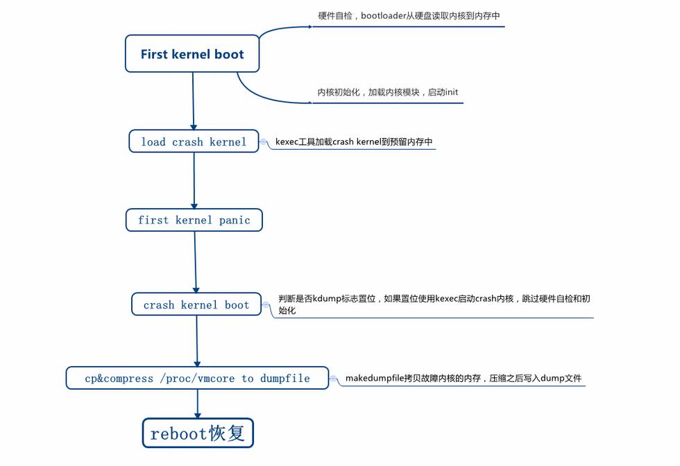
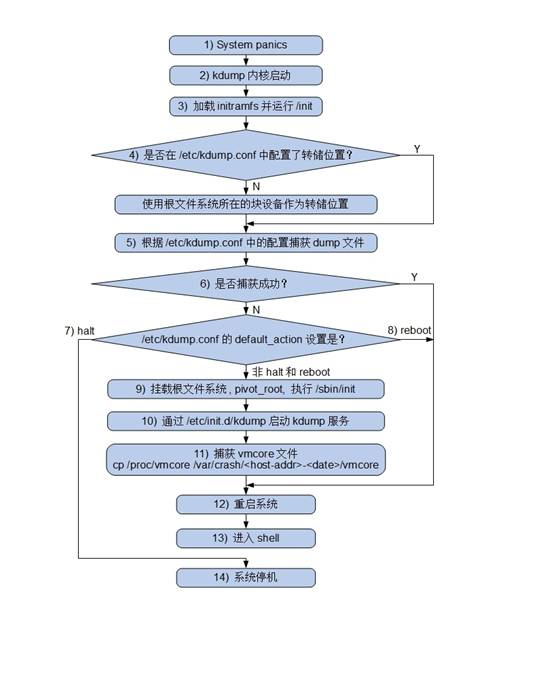
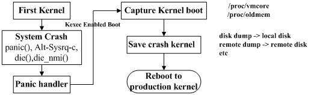

<!-- @import "[TOC]" {cmd="toc" depthFrom=1 depthTo=6 orderedList=false} -->

<!-- code_chunk_output -->

- [1. 介绍](#1-介绍)
  - [1.1. kexec](#11-kexec)
  - [1.2. kdump](#12-kdump)
  - [1.3. 两种内核](#13-两种内核)
  - [1.4. 捕获内核访问原有内存](#14-捕获内核访问原有内存)
  - [1.5. kdump 的优势](#15-kdump-的优势)
- [2. Kdump 实现流程](#2-kdump-实现流程)
- [3. 配置 kdump](#3-配置-kdump)
  - [3.1. kexec-tools 和 kernel-debuginfo](#31-kexec-tools-和-kernel-debuginfo)
  - [3.2. 内核选项](#32-内核选项)
- [4. 加载新的系统内核](#4-加载新的系统内核)
- [5. kdump 配置文件](#5-kdump-配置文件)
- [6. 启动 kdump 服务](#6-启动-kdump-服务)
- [7. 加载捕捉内核](#7-加载捕捉内核)
- [8. 确认并修改捕获内核](#8-确认并修改捕获内核)
- [9. 触发内核崩溃](#9-触发内核崩溃)
- [11. 安装分析工具](#11-安装分析工具)
- [12. 分析内存转储文件](#12-分析内存转储文件)
- [13. 参考](#13-参考)

<!-- /code_chunk_output -->

# 1. 介绍

## 1.1. kexec

git://git.kernel.org/pub/scm/utils/kernel/kexec/kexec-tools.git

Kexec 是实现 kdump 机制的关键, 它包括 2 个组成部分:

* 一是**内核**空间的**系统调用** `kexec_load`(`sys_enter_kexec_load`), 负责在**生产内核**(`production kernel` 或 first kernel)**启动时**将**捕获内核**(`capture kernel` 或 sencond kernel)**加载到指定地址**.

* 二是**用户**空间的工具 `kexec-tools`, 他将**捕获内核的地址**传递给**生产内核**, 从而**在系统崩溃的时候**能够**找到捕获内核的地址并运行**.

没有 kexec 就没有 kdump. 先有 kexec 实现了在一个内核中可以启动另一个内核, 才让 kdump 有了用武之地. kexec 原来的目的是为了节省 kernel 开发人员重启系统的时间, 谁能想到这个"偷懒"的技术却孕育了最成功的内存转存机制呢?

## 1.2. kdump

kdump 是当内核崩溃的时候, 用来转储运行内存的一个工具.

Kdump 的概念出现在 2005 左右, 是一种基于 kexec 的内核崩溃转储机制.

当系统崩溃时, kdump 使用 kexec 启动到**第二个内核**. 第二个内核通常叫做捕获内核, 以很小内存启动以捕获转储镜像. **第一个内核保留了内存的一部分**给**第二内核启动用**. 由于 kdump 利用 **kexec 启动捕获内核**, **绕过了 BIOS**, 所以第一个内核的内存得以保留. 这是**内核崩溃转储的本质**.

kdump 需要两个不同目的的内核:
* 生产内核
* 捕获内核

**捕获内核**会在生产内核崩溃时启动起来, 与相应的 ramdisk 一起组建一个微环境, 用以对**生产内核**下的内存进行收集和转存. 以便之后分析崩溃原因.

为什么需要一个特殊的 capture kernel 呢?因为原来的 kernel 已经出问题了, 发生 crash 或 hang 了.

一旦内存信息收集完成, 可以让系统将自动重启.

## 1.3. 两种内核

构建**系统**和 **dump-capture 内核**, 此操作有 2 种方式可选:

1)构建一个单独的**自定义转储捕获内核**以捕获内核转储;

2) 将**系统内核本身**作为**转储捕获内核**, 这就不需要构建一个单独的转储捕获内核.

方法(2)只能用于**可支持可重定位内核**的**体系结构**上; 目前 i386, x86_64, ppc64 和 ia64 体系结构支持可重定位内核. 构建一个可重定位内核使得不需要构建第二个内核就可以捕获转储. 但是可能有时想构建一个自定义转储捕获内核以满足特定要求.

## 1.4. 捕获内核访问原有内存

**捕获内核启动后**, 会像一般内核一样, 去运行为它创建的 ramdisk 上的**init 程序**. 而各种**转储机制！！！** 都可以事先**在 init 中实现**.

为了在**生产内核崩溃时**能顺利**启动捕获内核**, **捕获内核**以及它的**ramdisk**是**事先**放到**生产内核的内存**中的.

在**内核崩溃之前**所有关于**核心映像**的**必要信息**都用 **ELF 格式编码**并**存储在保留的内存区域！！！**中. **ELF 头**所在的**物理地址**被作为命令行参数(`fcorehdr=`)传递给**新启动的捕获内核**.

而在 **i386** 体系结构上, 启动的时候需要**使用物理内存开始的 640K**, 而不管操作系统内核转载在何处. 因此, 这个 640K 的区域在重新启动第二个内核的时候由 **kexec** 备份.

在**第二个内核**中, "**前一个系统的内存**"可以通过两种方式访问:

1. 通过 `/dev/oldmem` 这个设备接口.

一个"捕捉"设备可以使用"raw"(裸的)方式 "读"这个设备文件并写出到文件. 这是关于内存的 "裸"的数据转储, 同时这些分析 / 捕捉工具应该足够"智能"从而可以知道从哪里可以得到正确的信息. ELF 文件头(通过命令行参数传递过来的 elfcorehdr)可能会有帮助.

2. 通过 `/proc/vmcore`.

这个方式是将转储输出为一个 ELF 格式的文件, 并且可以使用一些文件拷贝命令(比如 cp, scp 等)将信息读出来. 同时, gdb 可以在得到的转储文件上做一些调试(有限的). 这种方式保证了内存中的页面都以正确的途径被保存 (注意内存开始的 640K 被重新映射了).

为了生成`/proc/vmcore`, 用户工具在**生产内核**中分析出**内存的使用和分布**等情况, 然后把这些信息综合起来**生成一个 ELF 头文件**并保存在**保留的内存区域**中. **捕获内核被引导时**, 会同时**传递这个 ELF 文件头的地址**(`elfcorehdr=`)给**捕获内核**. 通过分析它, 捕获内核就可以生成出 `/proc/vmcore`.

有了 `/proc/vmcore` 这个文件, 捕获内核的 ramdisk 中的脚本就可以通过通常的文件读写和网络来实现各种策略了.

## 1.5. kdump 的优势

高可靠性

崩溃转储数据可从一个新启动内核的上下文中获取, 而不是从已经崩溃内核的上下文.

多版本支持

LKCD(Linux Kernel Crash Dump), netdump, diskdump 已被纳入 LDPs(Linux Documen-tation Project) 内核. SUSE 和 RedHat 都对 kdump 有技术支持.

# 2. Kdump 实现流程



rhel 系统中执行流程:



sles11 系统中执行流程:



kdump 整个流程涉及到两次内核启动:

1. **系统内核**启动, 包括硬件自检初始化, bootloader 加载内核并发引导内核启动, 然后配置预留内存, 给 `dump-capture kernel` 预留一块内存空间;

2. **系统内核**启动完成后, 使用 kexec 工具将 crash 内核加载到保留内存中;

> kdump service 会执行 `kexec -p` 命令把 `dump-capture kernel` 载入预留的内存里;

3. 如果系统内核**发生 panic**, 会自动启动`dump-capture kernel`, kexec 启动 crash kernel 只执行内核初始化逻辑, 不再做硬件自检初始化, 启动速度很快.

4. `dump-capture kernel`**只使用自己的预留内存**, 确保**其余的内存数据不会被改动**. 通过`/proc/vmcore`内存镜像文件等方式, 把**其他系统内存**里的**数据写入到 dump 文件**, 为了减小文件的大小, 它会通过`makedumpfile(8)`命令对**内存数据**进行**挑选和压缩**;

4. dump 文件写完之后, `dump-capture kernel`自动 reboot, 进入系统内核.

# 3. 配置 kdump

如前面所述, 支持 kdump 的系统使用**两个内核**进行工作. 目前一些发行版, 如 RedHat 和 SUSE 的 Linux 都**已经编译并设置好这两个内核**.

如果你使用其他发行版的 Linux 或者想自己编译内核支持 kdump, 那么可以根据如下介绍进行.

## 3.1. kexec-tools 和 kernel-debuginfo

Kdump 用到的各种工具都在 kexec-tools 中.

kernel-debuginfo 则是用来分析 vmcore 文件, 如果是编译的内核打开 `CONFIG_DEBUG_INFO=Y`.

从 rhel5 开始, kexec-tools 已被默认安装在发行版. 而 novell 也在 sles10 发行版中把 kdump 集成进来.

```
yum install kexec-tools
```

或编译安装

```
./configure
make && make install
```

## 3.2. 内核选项

配置**系统内核**和**捕捉内核**都需要的内核选项:

"Processor type and features" --> "kexec system call". 启用 kexec system call:

```
CONFIG_KEXEC=y
```

"File systems" --> "Pseudo filesystems" --> "sysfs file system support". sysfs 文件系统支持:

```
CONFIG_SYSFS=y
```

"Kernel hacking" --> "Compile-time checks and compiler options" --> "Compile the kernel with debug info". 编译内核带 debug 信息

```
CONFIG_DEBUG_INFO=Y
```

配置**捕捉内核**的与**架构无关**的选项:

"Processor type and features" --> "kernel crash dumps". 内核 crash 时 dump:

```
CONFIG_CRASH_DUMP=y
```

下面这个是不是必须的??:

```
CONFIG_CRASH_CORE=y
```

"File systems" --> "Pseudo filesystems" --> "/proc/vmcore support". `/proc/vmcore` 支持

```
CONFIG_PROC_VMCORE=y
```

配置**捕捉内核**的与架构相关的选项:

"Processor type and features" --> "Build a relocatable kernel". 打开**可支持可重定位内核**, 将**系统内核本身**作为**转储捕获内核**, 这就**不需要构建一个单独的转储捕获内核**

```
CONFIG_RELOCATABLE=y
```

"Processor type and features" --> "Physical address where the kernel is loaded". 为内核设置一个加载起始地址. 在大多数的机器上, 16M 是一个合适的值:

```
CONFIG_PHYSICAL_START=0x1000000
```

# 4. 加载新的系统内核

编译**系统内核**和**捕捉内核**.

将重新编译好的系统内核添加到启动引导中, 注意**不要将捕捉内核添加到启动引导菜单**中.

修改**系统内核**引导参数, 为启动捕获内核预留内存:

通过下面的方法来配置 kdump 使用的内存大小. 添加启动参数"`crashkernel=Y@X`", 这里, Y 是**为捕捉内核保留的内存大小**, X 是保留部分内存的开始位置.

对于 i386 和 x86_64, 编辑 /etc/grub.conf, 在内核行的最后添加"crashkernel=128M" .

对于 ppc64, 在 /etc/yaboot.conf 最后添加"crashkernel=128M".

在 ia64, 编辑 /etc/elilo.conf, 添加"crashkernel=256M"到内核行.

# 5. kdump 配置文件

kdump 的配置文件是 /etc/kdump.conf(RHEL6.2)

每个文件头部都有选项说明, 可以根据使用需求设置相应的选项.

# 6. 启动 kdump 服务

在设置了预留内存后, 需要重启机器, 否则 kdump 是不可使用的.

启动 kdump 服务:

```
systemctl restart kdump
systemctl enable kdump.service
systemctl status kdump
```

这个服务会:

1. 通过 dracut 命令生成捕获内核的 initramfs

> /boot/initramfs-5.11.0-tlinux2-0050kdump.img

2. 通过 kexec 命令加载捕获内核到保留的内存位置

# 7. 加载捕捉内核

> 现在这一步已经在 kdump.service 中完成

在**系统内核**引导完成后, 需要将**捕捉内核**加载到**内存**中.

使用 kexec 工具将捕捉内核加载到内存:

```
kexec -p <dump-capture-kernel-bzImage> \
--initrd=<initrd-for-dump-capture-kernel> \
--append="root=<root-dev> <arch-specific-options>"
```

```
kexec -p <dump-capture-kernel> \
	--initrd=<initrd-for-dump-capture-kernel> --args-linux \
	--append="root=<root-dev> init 1 irqpoll"
```

装载转储捕捉内核的注意事项:

1. 转储**捕捉内核**应当是一个 vmlinux 格式的映像(即是一个**未压缩的 ELF 映像文件**), 而不能是 bzImage 格式;

2. 默认情况下, ELF 文件头采用 ELF64 格式存储以支持那些拥有**超过 4GB 内存**的系统. 但是可以指定"`--elf32-core-headers`"标志以**强制使用 ELF32 格式**的 ELF 文件头. 这个标志是有必要注意的, 一个重要的原因就是: **当前版本的 GDB 不能在一个 32 位系统上打开一个使用 ELF64 格式的 vmcore 文件**. ELF32 格式的文件头不能使用在一个"没有物理地址扩展"(non-PAE)的系统上(即: 少于 4GB 内存的系统);

3. 一个"irqpoll"的启动参数可以减低由于在"转储捕获内核"中使用了"共享中断"技术而导致出现驱动初始化失败这种情况发生的概率 ;

4. 必须指定 `<root-dev>`, 指定的格式是和要使用根设备的名字. 具体可以查看 mount 命令的输出;

5. "`init 1`"这个命令将启动"转储捕捉内核"到一个**没有网络支持的单用户模式**. 如果你希望有**网络支持**, 那么使用"`init 3`".

# 8. 确认并修改捕获内核

捕获内核是一个未压缩的 ELF 映像文件, 查看捕获内核是否加载到内存中:

```
# cat /sys/kernel/kexec_crash_loaded
```

也可以观察`/proc/iomem`中是否成功 load 了 crash kernel

```
# cat /proc/iomem | grep 'Crash kernel'
  3b000000-4affffff : Crash kernel
  c00f000000-c03effffff : Crash kernel
```

缩小捕获内核占用的内存:

```
# echo N > /sys/kernel/kexec_crash_size
```

# 9. 触发内核崩溃

在捕捉内核被加载进入内存后, **如果系统崩溃开关被触发**, 则系统会**自动切换进入捕捉内核**.

触发系统崩溃的开关有 `panic()`, `die()`, `die_nmi()` **内核函数**和 `sysrq` **触发事件**, 可以使用其中任意的一个来触发内核崩溃.

这里使用 sysrq 触发事件.

```
echo 1 > /proc/sys/kernel/sysrq
echo c > /proc/sysrq-trigger
```

可能会有如下打印

```
[root@vm7 ~]# echo c > /proc/sysrq-trigger
[  659.039656] sysrq: Trigger a crash
[  659.040702] Kernel panic - not syncing: sysrq triggered crash
[  659.042375] CPU: 13 PID: 1345 Comm: bash Kdump: loaded Not tainted 5.11.0-tlinux2-0050 #1
[  659.044747] Hardware name: QEMU Standard PC (i440FX + PIIX, 1996), BIOS rel-1.14.0-0-g155821a1990b-prebuilt.qemu.org 04/01/2014
[  659.048213] Call Trace:
[  659.048953]  dump_stack+0x7d/0x9f
[  659.049938]  panic+0x10c/0x2fb
[  659.050846]  ? lock_release+0x200/0x3e0
[  659.052110]  ? rcu_read_unlock+0x16/0x70
[  659.053332]  sysrq_handle_crash+0x1a/0x20
[  659.054490]  __handle_sysrq+0xe1/0x240
[  659.055578]  write_sysrq_trigger+0x51/0x60
[  659.056784]  proc_reg_write+0x62/0x90
[  659.057901]  vfs_write+0xef/0x380
[  659.059000]  ksys_write+0xad/0xf0
[  659.060054]  __x64_sys_write+0x1a/0x20
[  659.061133]  do_syscall_64+0x38/0x50
[  659.062176]  entry_SYSCALL_64_after_hwframe+0x44/0xa9
[  659.063669] RIP: 0033:0x7f116cfc9a90
[  659.064893] Code: 73 01 c3 48 8b 0d e0 73 2d 00 f7 d8 64 89 01 48 83 c8 ff c3 66 0f 1f 44 00 00 83 3d 2d d5 2d 00 00 75 10 b8 01 4
[  659.070622] RSP: 002b:00007ffd7891ced8 EFLAGS: 00000246 ORIG_RAX: 0000000000000001
[  659.073096] RAX: ffffffffffffffda RBX: 0000000000000002 RCX: 00007f116cfc9a90
[  659.075402] RDX: 0000000000000002 RSI: 00007f116d8f5000 RDI: 0000000000000001
[  659.077732] RBP: 00007f116d8f5000 R08: 000000000000000a R09: 00007f116d8e7740
[  659.080060] R10: 00007f116d8e7740 R11: 0000000000000246 R12: 00007f116d2a2400
[  659.082361] R13: 0000000000000002 R14: 0000000000000001 R15: 0000000000000000
[    2.141637] scftorture: --- Start of test:  verbose=0 holdoff=10 longwait=0 nthreads=-1 onoff_holdoff=0 onoff_interval=0 shutdown1
[    2.315906] kvm-guest: host does not support poll control
[    2.317483] kvm-guest: host upgrade recommended
[    2.321359] mce: Unable to init MCE device (rc: -5)
kdump: dump target is /dev/mapper/cl-root
kdump: saving to /sysroot//var/crash/127.0.0.1-2021-06-15-18:10:33/
kdump: saving vmcore-dmesg.txt
Missing the log_buf symbol
kdump: saving vmcore-dmesg.txt failed
kdump: saving vmcore
Copying data                                      : [100.0 %] -           eta: 0s
kdump: saving vmcore complete
[    7.088553] reboot: Restarting system
```

这造成**内核崩溃**, 如配置有效, 系统将重启进入 kdump **捕获内核**, 当系统进程进入到启动 kdump 服务的点时, `/proc/vmcore` 将会被拷贝到你在 **kdump 配置文件中设置的位置**.

RHEL 的缺省目录是 : /var/crash; SLES 的缺省目录是 : /var/log/dump.

然后系统重启进入到正常的内核. 一旦回复到正常的内核, 就可以在上述的目录下发现 vmcore 文件, 即**内存转储文件**.

```
# ll /var/crash/
total 0
drwxr-xr-x 2 root root 53 Jun 15 18:10 127.0.0.1-2021-06-15-18:10:33

# ll /var/crash/127.0.0.1-2021-06-15-18\:10\:33/
total 101392
-rw------- 1 root root 103825344 Jun 15 18:10 vmcore
-rw-r--r-- 1 root root         0 Jun 15 18:10 vmcore-dmesg-incomplete.txt
```


# 11. 安装分析工具

```
# ./configure
# make &&make install
```

或者

```
yum install crash
```

# 12. 分析内存转储文件

现在有了一个内存转储文件, 接下来使用 crash 对其进行分析

```
crash vmlinux mydumpfile
```

这里 vmlinux 是带调试信息的内核. 如果一切正常, 将会进入到 crash 中, 如图所示.

crash 命令提示符:


在该提示符下, 可以执行 crash 的内部命令. 通过 crash 的内部命令, 可以查看寄存器的值、函数的调用堆栈等信息. 在图 2 中, 显示了执行 bt 命令后得到的函数调用的堆栈信息.

函数调用堆栈信息:


crash 使用 gdb 作为它的内部引擎, crash 中的很多命令和语法都与 gdb 相同. 如果你曾经使用过 gdb, 就会发现 crash 并不是很陌生. 如果想获得 crash 更多的命令和相关命令的详细说明, 可以使用 crash 的内部命令 help 来获取.

# 13. 参考

* 参考 developerWorks 中国 首页查看 IBM 软件和开放技术的最新信息.
* 参考 [LKCD 主页](http://lkcd.sourceforge.net/)了解关于 LKCD 的信息.
* 参考 [Diskdump 的讨论](http://lwn.net/Articles/87684/)查看关于 Diskdump 的介绍.
* 参考 [Crash 工具的主页](http://people.redhat.com/anderson/)了解 crash 工具相关内容.
* 参考 Alicia 的主页了解 Alicia 分析工具.
* 参考 Linux 内核源代码下的 `Documentation/admin-guide/kdump/kdump.rst` 了解更多关于 Kdump 的信息.
* 查看 Linux 内核源代码下的 README 了解如何编译内核.
* 参考 [kdump 的主页](http://lse.sourceforge.net/kdump/)获取更多关于 kdump 和 kexec 的信息.
* 参考 [GDB 文档](http://www.gnu.org/software/gdb/documentation/)获取更多关于 gdb 的信息.


深入探索 Kdump, 第 3 部分: Kdump 原理探秘: https://blog.csdn.net/newningning/article/details/12622777 (none)

深入探索 Kdump, 第 4 部分: kdump 的亲密战友 crash: https://blog.csdn.net/lllzd/article/details/8182592 (none)

