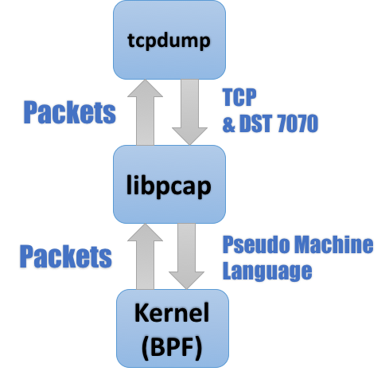
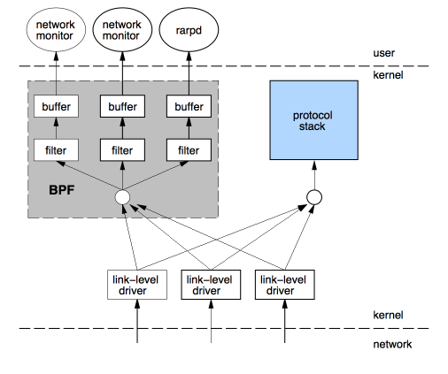
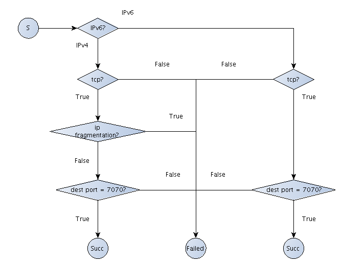
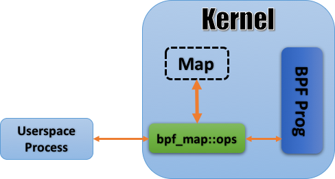
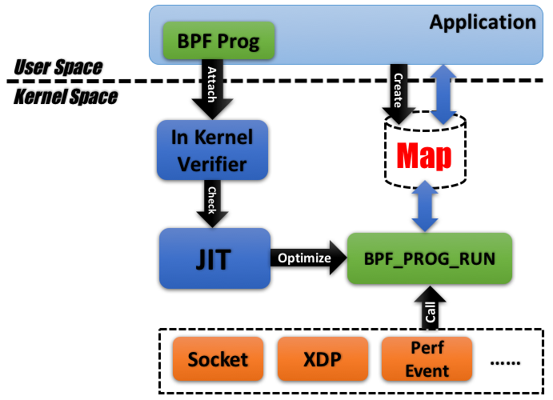

本文来自: https://www.ibm.com/developerworks/cn/linux/l-lo-eBPF-history/index.html , 2017 年

数日之前, 笔者参加某一技术会议之时, 为人所安利了一款开源项目, 演讲者对其性能颇为称道, 称其乃基于近年在内核中炙手可热的 eBPF 技术.

对这 eBPF 的名号, 笔者略有些耳熟, 会后遂一番搜索学习, 发现 eBPF 果然源于早年间的成型于 BSD 之上的传统技术 BPF(Berkeley Packet Filter), 但无论其性能还是功能已然都不是 BPF 可以比拟的了.

# 源头: 一篇 1992 年的论文

## 什么是 BPF?

笔者在前文中说过了, BPF 的全称是 `Berkeley Packet Filter`, 顾名思义, 这是一个用于**过滤(filter)网络报文(packet)的架构**.

其实 BPF 可谓是名气不大, 作用不小的典范: 如果笔者一开始提出 BPF 的同时还捎带上大名鼎鼎的 **tcpdump** 或 **wireshark**, 估计绝大部分读者都会了然了: BPF 即为 tcpdump 抑或 wireshark 乃至**网络监控(Network Monitoring)领域**的基石.

今天我们看到的 BPF 的设计, 最早可以追溯到 **1992** 年刊行在 USENIX conference 上的一篇论文: `The BSD Packet Filter: A New Architecture for User-level Packet Capture`. 由于最初版本的 BPF 是实现于 **BSD 系统**之上的, 于是在论文中作者称之为"`BSD Packet Filter`"; 后来由于 BPF 的理念渐成主流, 为各大操作系统所接受, B 所代表的 BSD 便也渐渐淡去, 最终演化成了今天我们眼中的 `Berkeley Packet Filter`.

诚然, 无论 BSD 和 Berkeley 如何变换, 其后的 Packet Filter 总是不变的, 这两个单词也基本概括了 BPF 的两大核心功能:

* 过滤(Filter): 根据外界输入的规则**过滤报文**;
* 复制(Copy): 将**符合条件的报文**由**内核空间复制到用户空间**;

以 tcpdump 为例: 熟悉网络监控(network monitoring)的读者大抵都知道 tcpdump 依赖于 **pcap** 库, tcpdump 中的诸多核心功能都经由后者实现, 其整体工作流程如下图所示:

图 1. Tcpdump 工作流程



由图 1 不难看出, 位于**内核**之中的 **BPF 模块**是整个流程之中最核心的一环: 它一方面接受 tcpdump 经由 libpcap 转码而来的**滤包条件**(Pseudo Machine Language) , 另一方面也将符合条件的报文复制到用户空间最终经由 libpcap 发送给 tcpdump.

读到这里, 估计有经验的读者已经能够在脑海里大致勾勒出一个 BPF 实现的大概了, 图 2 引自文献 1, 读者们可以管窥一下当时 BPF 的设计:

图 2. BPF Overview



时至今日, 传统 BPF 仍然遵循图 2 的路数: 途经网卡驱动层的报文在上报给协议栈的同时会多出一路来传送给 BPF, 再经后者过滤后最终拷贝给用户态的应用. 除开本文提及的 tcpdump, 当时的 RARP 协议也可以利用 BPF 工作(Linux 2.2 起, 内核开始提供 rarp 功能, 因此如今的 RARP 已经不再需要 BPF 了).

整体来说, BPF 的架构还是相对浅显易懂的, 不过要是深入细节的话就没那么容易了: 因为其中的 filter 的设计(也是文献 1 中着墨最多的地方)要复杂那么一点点.

Pseudo Machine Language

估计在阅读本文之前, 相当数量的读者都会误以为所谓的 Filter 是挂在 tcpdump 末尾处的 expression 吧, 类似于图 1 中的"tcp and dst port 7070"这样. 但倘若我们如下文这样在 tcpdump 的调用中加入一个-d, 还会发现其中大有乾坤:

清单 1 tcpdump -d

```
#以下代码可以在任意支持 tcpdump 的类 Unix 平台上运行, 输出大同小异
bash-3.2$ sudo tcpdump -d -i lo tcp and dst port 7070
(000) ldh [12]
(001) jeq #0x86dd jt 2 jf 6 #检测是否为 ipv6 报文, 若为假(jf)则按照 ipv4 报文处理(L006)
(002) ldb [20]
(003) jeq #0x6 jt 4 jf 15 #检测是否为 tcp 报文
(004) ldh [56]
(005) jeq #0x1b9e jt 14 jf 15 #检测是否目标端口为 7070(0x1b9e), 若为真(jt)则跳转 L014
(006) jeq #0x800 jt 7 jf 15 #检测是否为 ipv4 报文
(007) ldb [23]
(008) jeq #0x6 jt 9 jf 15 #检测是否为 tcp 报文
(009) ldh [20]
(010) jset #0x1fff jt 15 jf 11 #检测是否为 ip 分片(IP fragmentation)报文
(011) ldxb 4*([14]&0xf)
(012) ldh [x + 16] #找到 tcp 报文中 dest port 的所在位置
(013) jeq #0x1b9e jt 14 jf 15 #检测是否目标端口为 7070(0x1b9e), 若为真(jt)则跳转 L014
(014) ret #262144 #该报文符合要求
(015) ret #0 #该报文不符合要求
```

根据 man page, tcpdump 的-d 会将输入的 expression 转义为一段"human readable"的"compiled packet-matching code". 当然, 如清单 1 中的内容, 对于很多道行不深的读者来说, 基本是"human unreadable"的, 于是笔者专门加入了一些注释加以解释, 但是相较于-dd 和-ddd 反人类的输出, 这确可以称得上是"一目了然"的代码了.

这段看起来类似于汇编的代码, 便是 BPF 用于定义 Filter 的伪代码, 亦即图 1 中 libpcap 和内核交互的 pseudo machine language(也有一种说法是, BPF 伪代码设计之初参考过当时大行其道的 RISC 令集的设计理念), 当 BPF 工作时, 每一个进出网卡的报文都会被这一段代码过滤一遍, 其中符合条件的(ret #262144)会被复制到用户空间, 其余的(ret #0)则会被丢弃.

BPF 采用的报文过滤设计的全称是 CFG(Computation Flow Graph), 顾名思义是将过滤器构筑于一套基于 if-else 的控制流(flow graph)之上, 例如清单 1 中的 filter 就可以用图 3 来表示:

图 3 基于 CFG 实现的 filter 范例



CFG 模型最大的优势是快, 参考文献 1 中就比较了 CFG 模型和基于树型结构构建出的 CSPF 模型的优劣, 得出了基于 CFG 模型需要的运算量更小的结论; 但从另一个角度来说, 基于伪代码的设计却也增加了系统的复杂性: 一方面伪指令集已经足够让人眼花缭乱的了; 另一方面为了执行伪代码, 内核中还需要专门实现一个虚拟机(pseudo-machine), 这也在一定程度上提高了开发和维护的门槛.

当然, 或许是为了提升系统的易用性, 一方面 BPF 设计者们又额外在 tcpdump 中设计了我们今天常见的过滤表达式(实际实现于 libpcap, 当然两者也都源于 Lawrence Berkeley Lab), 令过滤器真正意义上"Human Readable"了起来; 另一方面, 由于设计目标只是过滤字节流形式的报文, 虚拟机及其伪指令集的设计相对会简单不少: 整个虚拟机只实现了两个 32 位的寄存器, 分别是用于运算的累加器 A 和通用寄存器 X; 且指令集也只有寥寥 20 来个, 如表 1 所示:


易用性方面的提升很大程度上弥补了 BPF 本身的复杂度带来的缺憾, 很大程度上推动了 BPF 的发展, 此后数年, BPF 逐渐称为大众所认同, 包括 Linux 在内的众多操作系统都开始将 BPF 引入了内核.

鉴于 Linux 上 BPF 如火如荼的大好形势, 本文余下的部分笔者将基于 Linux 上的 BPF 实现进行展开.

LSF: Linux 下的 BPF 实现
BPF 是在 1997 年首次被引入 Linux 的, 当时的内核版本尚为 2.1.75. 准确的说, Linux 内核中的报文过滤机制其实是有自己的名字的: Linux Socket Filter, 简称 LSF. 但也许是因为 BPF 名声太大了吧, 连内核文档都不大买这个帐, 直言 LSF 其实就是(aka)BPF.

当然, LSF 和 BPF 除了名字上的差异以外, 还是有些不同的, 首当其冲的分歧就是接口: 传统的 BSD 开启 BPF 的方式主要是靠打开(open)/dev/bpfX 设备, 之后利用 ioctl 来进行控制; 而 linux 则选择了利用套接字选项(sockopt)SO_ATTACH_FILTER/SO_DETACH_FILTER 来执行系统调用, 篇幅所限, 这部分内容笔者就不深入了, 有兴趣的读者可以通过移步 socket 的 manual page 或内核 filter 文档深入了解. 这里笔者只给出一个例子来让读者们对 Linux 下的 BPF 的开发有一个直观的感受:

清单 2 BPF Sample

```cpp
#include <......>
// tcpdump -dd 生成出的伪代码块
// instruction format:
// opcode: 16bits; jt: 8bits; jf: 8bits; k: 32bits
static struct sock_filter code[] = {
    { 0x28, 0, 0, 0x0000000c }, // (000) ldh [12]
    { 0x15, 0, 4, 0x000086dd }, // (001) jeq #0x86dd jt 2 jf 6
    { 0x30, 0, 0, 0x00000014 }, // (002) ldb [20]
    { 0x15, 0, 11, 0x00000006 }, // (003) jeq #0x6 jt 4 jf 15
    { 0x28, 0, 0, 0x00000038 }, // (004) ldh [56]
    { 0x15, 8, 9, 0x00000438 }, // (005) jeq #0x438 jt 14 jf 15
    { 0x15, 0, 8, 0x00000800 }, // (006) jeq #0x800 jt 7 jf 15
    { 0x30, 0, 0, 0x00000017 }, // (007) ldb [23]
    { 0x15, 0, 6, 0x00000006 }, // (008) jeq #0x6 jt 9 jf 15
    { 0x28, 0, 0, 0x00000014 }, // (009) ldh [20]
    { 0x45, 4, 0, 0x00001fff }, // (010) jset #0x1fff jt 15 jf 11
    { 0xb1, 0, 0, 0x0000000e }, // (011) ldxb 4*([14]&0xf)
    { 0x48, 0, 0, 0x00000010 }, // (012) ldh [x + 16]
    { 0x15, 0, 1, 0x00000438 }, // (013) jeq #0x438 jt 14 jf 15
    { 0x6, 0, 0, 0x00040000 }, // (014) ret #262144
    { 0x6, 0, 0, 0x00000000 }, // (015) ret #0
};
int main(int argc, char **argv)
{
    // ......
    struct sock_fprog bpf = { sizeof(code)/sizeof(struct sock_filter), code };
    // ......
    // 1. 创建 raw socket
    s = socket(AF_PACKET, SOCK_RAW, htons(ETH_P_ALL));
    // ......
    // 2. 将 socket 绑定给指定的 ethernet dev
    name = argv[1]; // ethernet dev 由 arg 1 传入
    memset(&addr, 0, sizeof(addr));
    addr.sll_ifindex = if_nametoindex(name);
    // ......
    if (bind(s, (struct sockaddr *)&addr, sizeof(addr))) {
        // ......
    }
    // 3. 利用 SO_ATTACH_FILTER 将 bpf 代码块传入内核
    if (setsockopt(s, SOL_SOCKET, SO_ATTACH_FILTER, &bpf, sizeof(bpf))) {
        // ......
    }
    for (; ;) {
        bytes = recv(s, buf, sizeof(buf), 0); // 4. 利用 recv()获取符合条件的报文
        // ......
        ip_header = (struct iphdr *)(buf + sizeof(struct ether_header));
        inet_ntop(AF_INET, &ip_header->saddr, src_addr_str, sizeof(src_addr_str));
        inet_ntop(AF_INET, &ip_header->daddr, dst_addr_str, sizeof(dst_addr_str));
        printf("IPv%d proto=%d src=%s dst=%s\n",
        ip_header->version, ip_header->protocol, src_addr_str, dst_addr_str);
    }
    return 0;
}
```

篇幅所限, 清单 2 中笔者只列出了部分代码, 代码分析也以注释为主. 有兴趣的读者可以移步这里阅读完全版.

由于主要是和过滤报文打交道, 内核中(before 3.18)的 BPF 的绝大部分实现都被放在了 net/core/filter.c 下, 篇幅原因笔者就不对代码进行详述了, 文件不长, 600 来行(v2.6), 比较浅显易懂, 有兴趣的读者可以移步品评一下. 值得留意的函数有两个, sk_attach_filter()和 sk_run_filter(): 前者将 filter 伪代码由用户空间复制进内核空间; 后者则负责在报文到来时执行伪码解析.

演进: JIT For BPF
BPF 被引入 Linux 之后, 除了一些小的性能方面的调整意外, 很长一段时间都没有什么动静. 直到 3.0 才首次迎来了比较大的革新: 在一些特定硬件平台上, BPF 开始有了用于提速的 JIT(Just-In-Time) Compiler.

最先实现 JIT 的是 x86 平台, 其后包括 arm、ppc、S390、mips 等一众平台纷纷跟进, 到今天 Linux 的主流平台中支持 JIT For BPF 的已经占了绝大多数了.

BPF JIT 的接口还是简单清晰的: 各平台的 JIT 编译函数都实现于 bpf_jit_compile()之中(3.16 之后, 开始逐步改为 bpf_int_jit_compile()), 如果 CONFIG_BPF_JIT 被打开, 则传入的 BPF 伪代码就会被传入该函数加以编译, 编译结果被拿来替换掉默认的处理函数 sk_run_filter(). JIT 的实现不在本文讨论之列, 其代码基本位于 arch/<platform>/net 之下, 有致力于优化的同学可以尝试学习一下.

打开 BPF 的 JIT 很简单, 只要向/proc/sys/net/core/bpf_jit_enable 写入 1 即可; 对于有调试需求的开发者而言, 如果写入 2 的话, 还可以在内核 log 中看到载入 BPF 代码时候 JIT 生成的优化代码, 内核开发者们还提供了一个更加方便的工具 bpf_jit_disam, 可以将内核 log 中的二进制转换为汇编以便阅读.

JIT Compiler 之后, 针对 BPF 的小改进不断: 如将 BPF 引入 seccomp(3.4); 添加一些 debug 工具如 bpf_asm 和 bpf_dbg(3.14). 不过比较革命性的大动作就要等到 3.17 了, 这次的改进被称为 extended BPF, 即 eBPF.

进化: extended BPF

自 3.15 伊始, 一个套源于 BPF 的全新设计开始逐渐进入人们的视野, 并最终(3.17)被添置到了 kernel/bpf 下. 这一全新设计最终被命名为了 extended BPF(eBPF): 顾名思义, 有全面扩充既有 BPF 功能之意; 而相对应的, 为了后向兼容, 传统的 BPF 仍被保留了下来, 并被重命名为 classical BPF(cBPF).

相对于 cBPF, eBPF 带来的改变可谓是革命性的: 一方面, 它已经为内核追踪(Kernel Tracing)、应用性能调优/监控、流控(Traffic Control)等领域带来了激动人心的变革; 另一方面, 在接口的设计以及易用性上, eBPF 也有了较大的改进.

Linux 内核代码的 samples 目录下有大量前人贡献的 eBPF sample, 这里笔者先挑选其中相对简单的 sockex1 来帮助读者们建立一个 eBPF 的初步印象:

清单 3 sockex1_user.c

```cpp
#include <...>
// 篇幅所限, 清单 3 和 4 都只罗列出部分关键代码, 有兴趣一窥全貌的读者可以移步 http://elixir.free-electrons.com/linux/v4.12.6/source/samples/bpf 深入学习
int main(int ac, char **argv)
{
    // 1. eBPF 的伪代码位于 sockex1_kern.o 中, 这是一个由 llvm 生成的 elf 格式文件, 指令集为 bpf;
    snprintf(filename, sizeof(filename), "%s_kern.o", argv[0]);
    if (load_bpf_file(filename)) {
        // load_bpf_file()定义于 bpf_load.c, 利用 libelf 来解析 sockex1_kern.o
        // 并利用 bpf_load_program 将解析出的伪代码 attach 进内核;
    }
    // 2. 因为 sockex1_kern.o 中 bpf 程序的类型为 BPF_PROG_TYPE_SOCKET_FILTER
    // 所以这里需要用用 SO_ATTACH_BPF 来指明程序的 sk_filter 要挂载到哪一个套接字上
    sock = open_raw_sock("lo");
    assert(setsockopt(sock, SOL_SOCKET, SO_ATTACH_BPF, prog_fd,
    sizeof(prog_fd[0])) == 0);
    //......
    for (i = 0; i < 5; i++) {
        // 3. 利用 map 机制获取经由 lo 发出的 tcp 报文的总长度
        key = IPPROTO_TCP;
        assert(bpf_map_lookup_elem(map_fd[0], &key, &tcp_cnt) == 0);
        // ......
    }
    return 0;
}
```

清单 4 sockex1_kern.c

```cpp
#include <......>
// 预先定义好的 map 对象
// 这里要注意好其实 map 是需要由用户空间程序调用 bpf_create_map()进行创建的
// 在这里定义的 map 对象, 实际上会在 load_bpf_file()解析 ELF 文件的同时被解析和创建出来
// 这里的 SEC(NAME)宏表示在当前 obj 文件中新增一个段(section)
struct bpf_map_def SEC("maps") my_map = {
    .type = BPF_MAP_TYPE_ARRAY,
    .key_size = sizeof(u32),
    .value_size = sizeof(long),
    .max_entries = 256,
};
SEC("socket1")
int bpf_prog1(struct __sk_buff *skb)
{
    // 这个例子比较简单, 仅仅是读取输入报文的包头中的协议位而已
    // 这里的 load_byte 实际指向了 llvm 的 built-in 函数 asm(llvm.bpf.load.byte)
    // 用于生成 eBPF 指令 BPF_LD_ABS 和 BPF_LD_IND
    int index = load_byte(skb, ETH_HLEN + offsetof(struct iphdr, protocol));
    long *value;
    // ......
    // 根据 key(&index, 注意这是一个指向函数的引用)获取对应的 value
    value = bpf_map_lookup_elem(&my_map, &index);
    if (value)
        __sync_fetch_and_add(value, skb->len); //这里的__sync_fetch_and_add 是 llvm 中的内嵌函数, 表示 atomic 加操作
    return 0;
}
// 为了满足 GPL 毒药的需求, 所有会注入内核的 BPF 代码都须显式的支持 GPL 协议
char _license[] SEC("license") = "GPL";
```

对比一下清单 3&4 以及清单 2 的代码片段, 很容易看出一些 eBPF 显而易见的革新:

* 用 C 写成的 BPF 代码(sockex1_kern.o);
* 基于 map 的内核与用户空间的交互方式;
* 全新的开发接口;
除此之外, 还有一些不那么明显的改进隐藏在内核之中:

* 全新的伪指令集设计;
* In-kernel verifier;
由一个文件(net/core/filter.c)进化到一个目录(kernel/bpf), eBPF 的蜕变三言两语间很难交代清楚, 下面笔者就先基于上述的几点变化来帮助大家入个门, 至于个中细节, 就只能靠读者以后自己修行了.

再见了汇编

利用高级语言书写 BPF 逻辑并经由编译器生成出伪代码来并不是什么新鲜的尝试, 比如 libpcap 就是在代码中内嵌了一个小型编译器来分析 tcpdump 传入的 filter expression 从而生成 BPF 伪码的. 只不过长久以来该功能一直没有能被独立出来或者做大做强, 究其原因, 主要还是由于传统的 BPF 所辖领域狭窄, 过滤机制也不甚复杂, 就算是做的出来, 估计也不堪大用.

然而到了 eBPF 的时代, 情况终于发生了变化: 现行的伪指令集较之过去已经复杂太多, 再用纯汇编的开发方式已经不合时宜, 于是, 自然而然的, 利用 C 一类的高级语言书写 BPF 伪代码的呼声便逐渐高涨了起来.

目前, 支持生成 BPF 伪代码的编译器只有 llvm 一家, 即使是通篇使用 gcc 编译的 Linux 内核, samples 目录下的 bpf 范例也要借用 llvm 来编译完成. 还是以 sockex1 为例, 用户态下的代码 sockex_user.c 是利用 HOSTCC 定义的编译器编译的; 但 sockex_kern.c 就需要用到 clang 和 llvm 了. 在`samples/bpf/Makefile`中, 可以看到:

清单 5 `samples/bpf/Makefile`

```makefile
# ......
# List of programs to build
hostprogs-y := test_lru_dist
hostprogs-y += sockex1
# ......
sockex1-objs := bpf_load.o $(LIBBPF) sockex1_user.o
# ......
# 注意, 这里有一个小 tip, 就是如果在内核的 Makefile 中,
# 有某一个目标文件你不希望使用内核的通用编译规则的话(类似于本文的 sockex1_kern.o),
# 可以像这里一样, 并不把该文件加入任何 xxxprogs 或 xxx-objs,
# 而是直接放入 always, 这样内核就会在本地 Makefile 中搜索编译规则了.
always := $(hostprogs-y)
<strong>always </strong><strong>+= sockex1_kern.o</strong>
# ......
LLC ?= llc
CLANG ?= clang
# ......
# sockex1_kern.o 就是使用了下述规则编译为 BPF 代码的, 请注意笔者加粗的部分
$(obj)/%.o: $(src)/%.c
$(CLANG) $(NOSTDINC_FLAGS) $(LINUXINCLUDE) $(EXTRA_CFLAGS) \
-D__KERNEL__ -D__ASM_SYSREG_H -Wno-unused-value -Wno-pointer-sign \
-Wno-compare-distinct-pointer-types \
-Wno-gnu-variable-sized-type-not-at-end \
-Wno-address-of-packed-member -Wno-tautological-compare \
-Wno-unknown-warning-option \
-O2 -emit-llvm -c $< -o -|
$(LLC) -march=bpf -filetype=obj -o
$@
```

能用 C 书写 BPF 自然是便利了许多, 但也不代表余下的开发工作就是一片坦途了: 首先 llvm 的输出是 elf 文件, 这也意味着想要获取能传入内核的代码, 我们还需要额外做一段解析 elf 的工作, 这也是为什么 Sample 下的范例几乎无一例外地都链接了 libelf 库; 其次, 同时也是比较重要的一点, 不要忘记 BPF 的代码是跑在内核空间中的, 因此书写时必得煞费苦心一番才好, 以防一个不小心就做出个把内核干趴下的漏洞来: 下文中提及的 verifier 就是为了这一点而生, 每一个被放进内核的 BPF 代码, 都须要经过它的检验才行.

# BPF 程序的类别以及 Map 机制

清单 3 中我们看到 sockex1_kern.o 是由 load_bpf_file()函数载入内存的, 但实际上 eBPF 提供用来将 BPF 代码载入内核的正式接口函数其实是 bpf_load_program(), 该接口负责通过参数向内核提供三类信息:

* BPF 程序的类型、
* BPF 代码
* 代码运行时所需要的存放 log 的缓存地址(位于用户空间);
有意思的是, 目前所有注入内核的 BPF 程序都需要附带 GPL 协议支持信息, bpf_load_program()的 license 参数就是用来载入协议字串的.

由 eBPF 伊始, BPF 程序开始有分类了, 通过 bpf_load_program 的参数 bpf_prog_type, 我们可以看到 eBPF 支持的程序类型. 这里笔者将一些常用的类型罗列于下表之中供读者参考:

表 2 常见 bpf_prog_type 定义

bpf_prog_type | BPF prog 入口参数(R1) | 程序类型
--------------|-----------------------|-----
BPF_PROG_TYPE_SOCKET_FILTER | struct __sk_buff | 用于过滤进出口网络报文, 功能上和 cBPF 类似.
BPF_PROG_TYPE_KPROBE | struct pt_regs | 用于 kprobe 功能的 BPF 代码.
BPF_PROG_TYPE_TRACEPOINT | 这类 BPF 的参数比较特殊, 根据 tracepoint 位置的不同而不同.  | 用于在各个 tracepoint 节点运行.
BPF_PROG_TYPE_XDP | struct xdp_md | 用于控制 XDP(eXtreme Data Path)的 BPF 代码.
BPF_PROG_TYPE_PERF_EVENT | struct bpf_perf_event_data | 用于定义 perf event 发生时回调的 BPF 代码.
BPF_PROG_TYPE_CGROUP_SKB | struct __sk_buff | 用于在 network cgroup 中运行的 BPF 代码. 功能上和 Socket_Filter 近似. 具体用法可以参考范例 test_cgrp2_attach.
BPF_PROG_TYPE_CGROUP_SOCK | struct bpf_sock | 另一个用于在 network cgroup 中运行的 BPF 代码, 范例 test_cgrp2_sock2 中就展示了一个利用 BPF 来控制 host 和 netns 间通信的例子.

深入对比清单 3(eBPF)和清单 2(cBPF)的实现的差异, 还会发现一个比较明显的不同之处: BPF 代码进内核之后, cBPF 和内核通讯的方式是 recv(); 而 eBPF 则将 socket 丢到一边, 使用一种名为 map 的全新机制和内核通讯, 其大致原理下图所示:

图 4 eBPF 的 map 机制



从图上看, 这套设计本身不复杂: 位于用户空间中的应用在内核中辟出一块空间建立起一个数据库用以和 eBPF 程序交互(bpf_create_map()); 数据库本身以 Key-Value 的形式进行组织, 无论是从用户空间还是内核空间都可以对其进行访问, 两边有着相似的接口, 最终在逻辑上也都殊途同归.

不难发现, map 带来的最大优势是效率: 相对于 cBPF 一言不合就把一个通信报文从内核空间丢出来的豪放, map 机制下的通讯耗费就要小家碧玉的多了: 还是以 sockex1 为例, 一次通信从内核中仅仅复制 4 个字节, 而且还是已经处理好了可以直接拿来就用的, 做过内核开发的人都知道这对于性能意味着什么.

map 机制解决的另一个问题是通信数据的多样性问题. cBPF 所覆盖的功能范围很简单, 无外乎是网络监控和 seccomp 两块, 数据接口设计的粗放一点也就算了; 而 eBPF 的利用范围则要广的多, 性能调优、内核监控、流量控制什么的应有尽有, 数据接口的多样性设计就显得很必要了. 下表中就列出了现有 eBPF 中的 map 机制中常见的数据类型:

表 3. map 机制下的常见数据类型

<table>
    <tr>
        <th>Category</th>
        <th>Source</th>
        <th>Bpf_map_type</th>
        <th>用途</th>
    </tr>
    <tr>
        <td>Array</td>
        <td>Arraymap.c</td>
        <td>row</td>
        <td>row</td>
    </tr>
    <tr>
        <td>row</td>
        <td>row</td>
    </tr>
</table>

# 新的指令集

eBPF 对于既有 cBPF 令集的改动量之大, 以至于基本上不能认为两者还是同一种语言了. 个中变化, 我们可以通过反汇编清单 4 的源代码(llvm-objdump --disassemble)略知一二:

清单 6 Disassemble of sockex1_kern.o

```
sockex1_kern.o: file format ELF64-BPF
Disassembly of section socket1:
bpf_prog1:
0: bf 16 00 00 00 00 00 00 r6 = r1
1: 30 00 00 00 17 00 00 00 r0 = *(u8 *)skb[23]
2: 63 0a fc ff 00 00 00 00 *(u32 *)(r10 - 4) = r0
3: 61 61 04 00 00 00 00 00 r1 = *(u32 *)(r6 + 4)
4: 55 01 08 00 04 00 00 00 if r1 != 4 goto 8
5: bf a2 00 00 00 00 00 00 r2 = r10
6: 07 02 00 00 fc ff ff ff r2 += -4
7: 18 01 00 00 00 00 00 00 00 00 00 00 00 00 00 00 r1 = 0ll
9: 85 00 00 00 01 00 00 00 call 1
10: 15 00 02 00 00 00 00 00 if r0 == 0 goto 2
11: 61 61 00 00 00 00 00 00 r1 = *(u32 *)(r6 + 0)
12: db 10 00 00 00 00 00 00 lock *(u64 *)(r0 + 0) += r1
LBB0_3:
13: b7 00 00 00 00 00 00 00 r0 = 0
14: 95 00 00 00 00 00 00 00 exit
```

我们不用管这段汇编写了点儿什么, 先跟清单 2 开头的那段 cBPF 代码对比一下两者的异同:

* 寄存器: eBPF 支持更多的寄存器;
    * cBPF: A, X + stack, 32bit;
    * eBPF: R1~R10 + stack, 64bit, 显然, 如此的设计主要针对现在大行其道的 64 位硬件, 同时更多的寄存器设计也便于运行时和真实环境下的寄存器进行对应, 以提高效率;
* opcode: 两者的格式不同;
    * cBPF: op 16b, jt 8b, jf 8b, K 32b;
    * eBPF: op 8b, dstReg 4b, srcReg 4b, off 16b, imm 32b;
* 其他: sockex1_kern.o 设计的比较简单, 但还是可以从中看出 eBPF 的一大改进: 可以调用内核中预设好的函数(Call 1, 这里指向的函数是 bpf_map_lookup_elem(), 如果需要比较全的预设函数索引的话可以移步这里). 除此之外, eBPF 命令集中比较重要的新晋功能还有:
    * load/store 多样化:
        * cBPF: 仅可以读 packet(即 skb)以及读写 stack;
        * eBPF: 可以读写包括 stack/map/context, 也即 BPF prog 的传入参数可读写. 换句话说, 任意传入 BPF 代码的数据流均可以被修改;
    * 除开预设函数外, 开发者还可以自定义 BPF 函数(JUMP_TAIL_CALL);
    * 除了前向跳转外(Jump Forward, cBPF 支持), 还可以后向跳转(Jump Backword);

至于 eBPF 具体的指令表, 因为过于庞杂这里笔者就不作文抄公了. 不过 eBPF 中的几个寄存器的利用规则这里还是可以有的, 否则要读懂清单 6 中的代码略有困难:

* R0: 一般用来表示函数返回值, 包括整个 BPF 代码块(其实也可被看做一个函数)的返回值;
* R1~R5: 一般用于表示内核预设函数的参数;
* R6~R9: 在 BPF 代码中可以作存储用, 其值不受内核预设函数影响;
* R10: 只读, 用作栈指针(SP);

# In-kernel Verifier

其实结合前面那么多的内容看下来不难发现 eBPF 其实近似于一种改头换面后的内核模块, 只不过它比内核模块更短小精干, 实现的功能也更新颖一些罢了, 但无论是什么样的架构, 只要存在注入的代码就会有安全隐患, eBPF 也不外如是——毕竟注入的代码是要在内核中运行的.

为了最大限度的控制这些隐患, cBPF 时代就开始加入了代码检查机制以防止不规范的注入代码; 到了 eBPF 时代则在载入程序(bpf_load_program())时加入了更复杂的 verifier 机制, 在运行注入程序之前, 先进行一系列的安全检查, 最大限度的保证系统的安全. 具体来说, verifier 机制会对注入的程序做两轮检查:

首轮检查(First pass, 实现于 check_cfg())可以被认为是一次深度优先搜索, 主要目的是对注入代码进行一次 DAG(Directed Acyclic Graph, 有向无环图)检测, 以保证其中没有循环存在; 除此之外, 一旦在代码中发现以下特征, verifier 也会拒绝注入:
代码长度超过上限, 目前(内核版本 4.12)eBPF 的代码长度上限为 4K 条指令——这在 cBPF 时代很难达到, 但别忘了 eBPF 代码是可以用 C 实现的;
存在可能会跳出 eBPF 代码范围的 JMP, 这主要是为了防止恶意代码故意让程序跑飞;
存在永远无法运行(unreachable)的 eBPF 令, 例如位于 exit 之后的指令;
次轮检查(Second pass, 实现于 do_check())较之于首轮则要细致很多: 在本轮检测中注入代码的所有逻辑分支从头到尾都会被完全跑上一遍, 所有的指令的参数(寄存器)、访问的内存、调用的函数都会被仔细的捋一遍, 任何的错误都会导致注入程序被退货. 由于过分细致, 本轮检查对于注入程序的复杂度也有所限制: 首先程序中的分支(branch)不允许超过 1024 个; 其次经检测的指令数也必须在 96K 以内.

Overview: eBPF 的架构
诚然, eBPF 设计的复杂程度已是超越 cBPF 太多太多, 笔者罗里吧嗦了大半天, 其实也就是将将领着大家入门的程度而已, 为了便于读者们能够把前文所述的碎片知识串到一起, 这里笔者将 eBPF 的大体架构草绘一番, 如下图所示, 希望能帮助大家对 eBPF 构建一个整体的认识.

图 5. Architecture of eBPF



追求极简: BPF Compiler Collection(BCC)
现在让我们将目光聚焦到 eBPF 的使用——相信这是大部分读者最感兴趣的部分, 毕竟绝大多数人其实并没有多少机会参与 eBPF 的开发——重新回到清单 3&4 中的 sockex1: 说句良心话, 虽然现在可以用 C 来实现 BPF, 但编译出来的却仍然是 ELF 文件, 开发者需要手动析出真正可以注入内核的代码. 这部分工作多少有些麻烦, 如果可以有一个通用的方案一步到位的生成出 BPF 代码就好了, 开发者的注意力应该放在其他更有价值的地方, 不是吗?

于是就有人设计了 BPF Compiler Collection(BCC), BCC 是一个 python 库, 但是其中有很大一部分的实现是基于 C 和 C++的, python 只不过实现了对 BCC 应用层接口的封装而已.

使用 BCC 进行 BPF 的开发仍然需要开发者自行利用 C 来设计 BPF 程序——但也仅此而已, 余下的工作, 包括编译、解析 ELF、加载 BPF 代码块以及创建 map 等等基本可以由 BCC 一力承担, 无需多劳开发者费心.

限于篇幅关于 BCC 笔者不再过多展开, 文章的最后笔者再给出一个基于 BCC 实现的 sockex1 的例子, 读者可以感受一下使用 BCC 带给开发者们的便利性:

清单 7 A sample of BCC

```python
from bcc import BPF
# 和清单 2 一样, 篇幅所限, 这里只贴一部分源码, 完全版请移步 https://raw.githubusercontent.com/windywolf/example/master/eBPF/bccsample.py
interface="ens160"
# BCC 可以接受直接将 BPF 代码嵌入 python code 之中
# 为了方便展示笔者使用了这一功能
# 注意: prog 中的中文注释是由于笔者需要写作之故加入, 如果读者想尝试运行这段代码,
# 则请将中文全部删除, 因为目前 BCC 还不支持在内嵌 C 代码中使用中文注释
prog = """
#include <net/sock.h>
#include <bcc/proto.h>
// BCC 中专门为 map 定义了一系列的宏, 以方便使用
// 宏中的 struct 下还定义了相应的函数, 让开发者可以如 C++一般操作 map
// 这里笔者定义了一个 array 类型的 map, 名为 my_map1
BPF_ARRAY(my_map1, long);
// BCC 下的 BPF 程序中不再需要定义把函数或变量专门放置于某个 section 下了
int bpf_prog1(struct __sk_buff *skb)
{
    // ......
    struct ethernet_t *eth = cursor_advance(cursor, sizeof(*eth));
    // ......
    struct ip_t *ip = cursor_advance(cursor, sizeof(*ip));
    int index = ip->nextp;
    long zero = 0; // BCC 下的 bpf 书写还是有很多坑的
    // 例如, 这里如果不去定义一个局部变量 zero,
    // 而是直接用常量 0 作为 lookup_or_init()的变量就会报错
    // map 类下的各个方法的具体细节可以参照 reference_guide.md
    value = my_map1.lookup_or_init(&index, &zero);
    if (value)
        __sync_fetch_and_add(value, skb->len);
    return 0;
}
"""
bpf = BPF(text=prog, debug = 0)
# 注入 bpf_prog1 函数
function = bpf.load_func("bpf_prog1", BPF.SOCKET_FILTER)
# 这是一段 SOCKET_FILTER 类型的 BPF, 所以需要挂载到某一个 interface 上
BPF.attach_raw_socket(function, interface)
# 利用 map 机制获取进出 interface 的各个协议的报文总长
bpf_map = bpf["my_map1"]
while 1:
    print ("TCP : {}, UDP : {}, ICMP: {}".format(
bpf_map[socket.IPPROTO_TCP].value,
# ...
```

# 结束语
本文从 BPF 的源头开始, 一路讲到了近年来刚刚杀青的 eBPF, 虽说拘泥于篇幅, 大多内容只能蜻蜓点水、浅尝辄止, 但文中 BPF 的原理、设计、实现和应用均有所涉猎, 勉强也能拿来入个门了. 加之近年来基于 eBPF 的应用层出不穷, 希望本文能激发读者们的奇思妙想, 从而设计出更多基于 BPF 的优秀应用来.

# 参考资源

本文来自 https://www.ibm.com/developerworks/cn/linux/l-lo-eBPF-history/index.html , 2017 年 9 月 20 日

1. [Steven McCanne, Van Jacobson] The BSD Packet Filter: A New Architecture for User-level Packet Capture, BPF 的源头, 可在这里查阅;
2. http://www.tcpdump.org/tcpdump_man.html, tcpdump 的 manual page;
3. https://www.kernel.org/doc/Documentation/networking/filter.txt, 内核的 BPF 文档;
4. http://man7.org/linux/man-pages/man7/socket.7.html, Linux 套接字的 manual page, 其中有对 Linux Kernel 中 BPF 接口的大致介绍, 不过论及详细程度还是不及参考文献 3 的;
5. https://lwn.net/Articles/437981/, LWN 上刊载的 JIT For BPF 首次被引入的消息: A JIT For Packet Filters;
6. https://lwn.net/Articles/603983/, LWN 上刊载的 eBPF 的介绍文献: Extending extended BPF. 由于年代久远接口相关的内容已经落后于最新代码了, 权作参考;
7. https://github.com/iovisor/bcc, BCC 的源码, 但由于编译需要比较多的依赖, 如果想偷个懒的话可以移步这里直接获取 docker image;
8. https://github.com/iovisor/bcc/blob/master/docs/reference_guide.md, BCC 开发指南;
9. http://elixir.free-electrons.com/linux/latest/source, Linux Kernel 源码阅读利器.