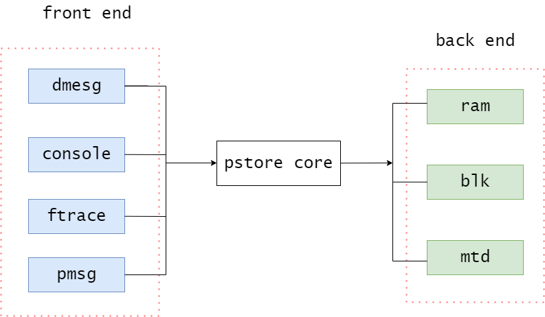

# 简介

pstore最初是用于系统发生oops或panic时，自动保存内核log buffer中的日志。不过在当前内核版本中，其已经支持了更多的功能，如保存console日志、ftrace消息和用户空间日志。同时，它还支持将这些消息保存在不同的存储设备中，如内存、块设备或mtd设备。 为了提高灵活性和可扩展性，pstore将以上功能分别抽象为前端和后端，其中像dmesg、console等为pstore提供数据的模块称为前端，而内存设备、块设备等用于存储数据的模块称为后端，pstore core则分别为它们提供相关的注册接口。

通过模块化的设计，实现了前端和后端的解耦，因此若某些模块需要利用pstore保存信息，就可以方便地向pstore添加新的前端。而若需要将pstore数据保存到新的存储设备上，也可以通过向其添加后端设备的方式完成。

<div align='center'>

</div>

除此之外，pstore还设计了一套pstore文件系统，用于查询和操作上一次重启时已经保存的pstore数据。当该文件系统被挂载时，保存在backend中的数据将被读取到pstore fs中，并以文件的形式显示。

# 工作原理

pstore 源文件主要有以下几个：fs/pstore/

```
$ tree fs/pstore/
fs/pstore/
├── blk.c
├── ftrace.c        # ftrace 前端的实现
├── inode.c         # pstore 文件系统的注册与操作
├── internal.h
├── Kconfig
├── Makefile
├── platform.c      # pstore 前后端功能的核心
├── pmsg.c          # pmsg 前端的实现
├── ram.c           # pstore/ram 后端的实现,dram空间分配与管理
├── ram_core.c
├── ram_internal.h  # pstore/ram 后端的实现,dram的读写操作
└── zone.c
```

## 文件创建

pstore文件系统位置在：

```
# ls /sys/fs/pstore
console-ramoops-0 dmesg-ramoops-0
```

控制台日志位于 pstore 目录下的console-ramoops文件中，因为采用console机制，该文件中的日志信息也受printk level控制，并不一定是全的。

oops/panic日志位于 pstore 目录下的dmesg-ramoops-x文件中，根据缓冲区大小可以有多个文件，x从0开始。

函数调用序列日志位于 pstore 目录下的ftrace-ramoops文件中。

相关代码在inode.c pstore_mkfile里：

```cpp

```

pstore_mkfile根据不同的type，使用snprintf函数生成文件名name。生成的文件名格式为`<type>-<psname>-<id>`，其中type是enum pstore_type_id类型的一个值，psname是给定的psname参数，id是给定的id参数。

接着使用d_alloc_name函数为根目录创建一个目录项dentry，最后使用d_add函数将目录项dentry与索引节点inode关联起来，将其添加到文件系统中。

## pstore_register

ramoops负责把message write到某个ram区域上，platform负责从ram读取存到/sys/fs/pstore，ok，先来看机制代码platform.c。

backend需要用pstore_register来注册：

```cpp

```

backend判断确保一次只能有一个并记录了全局psinfo。

看下结构体pstore_info:

```cpp

```

name就是backend的name了。

`*write` 和 `*write_buf_user` 如果backend没有给出会有个默认compat func，最终都走的*write_buf。


