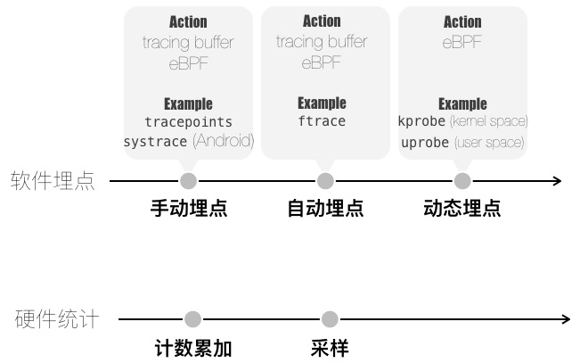
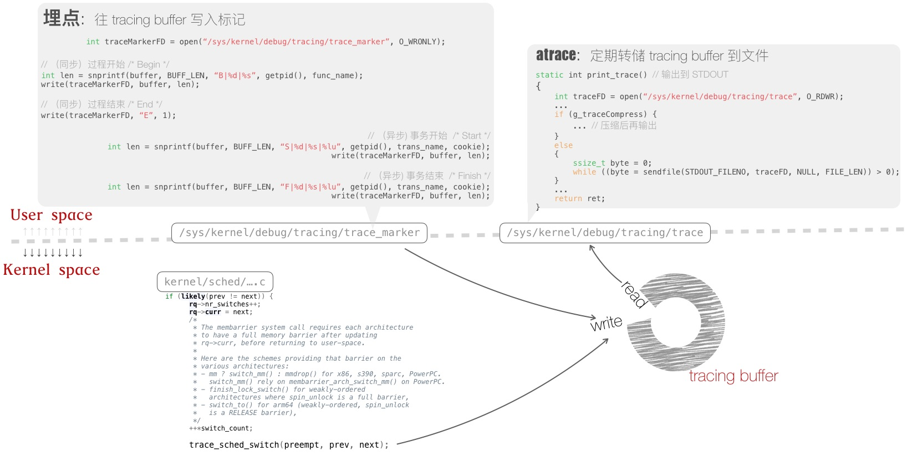
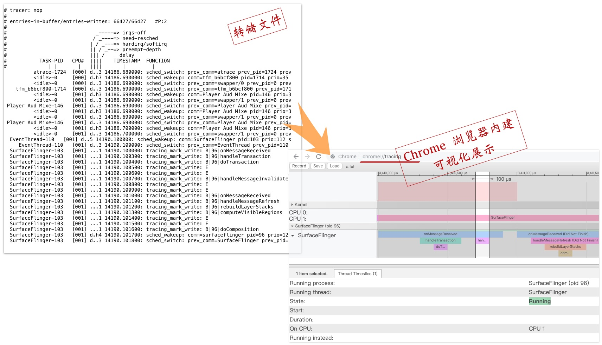
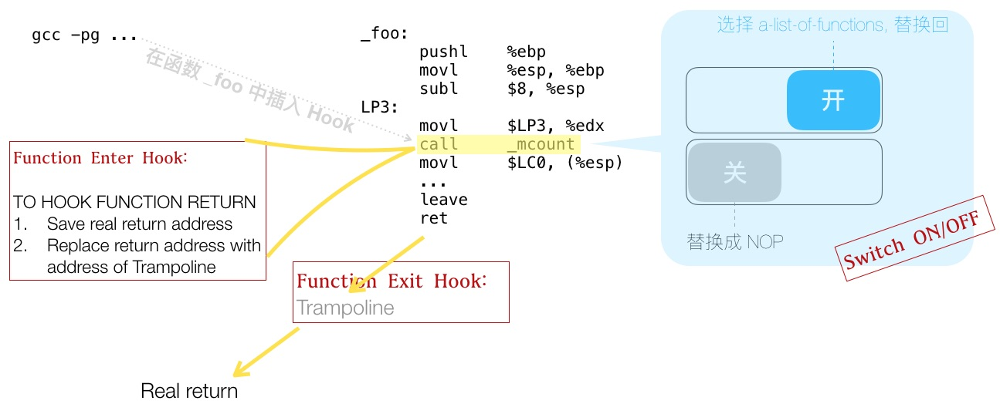
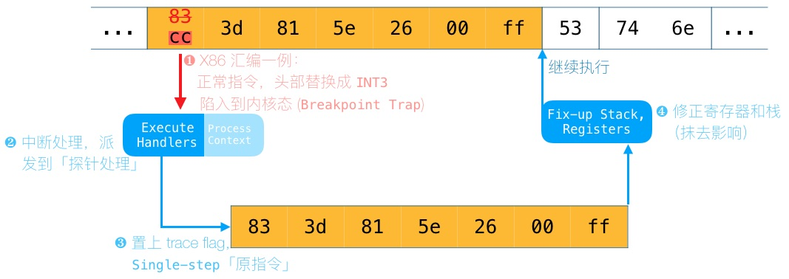
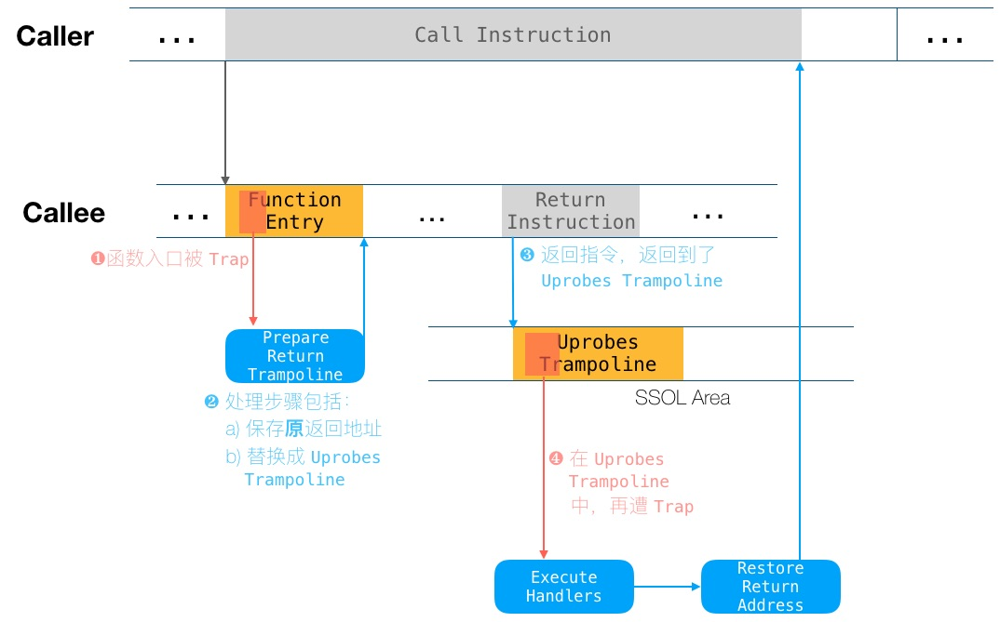
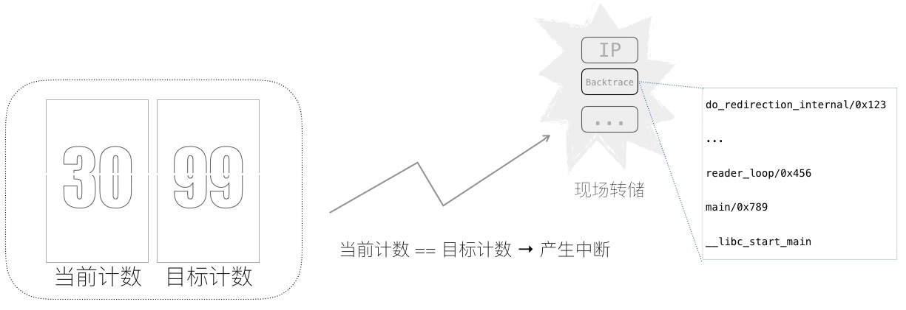

<!-- @import "[TOC]" {cmd="toc" depthFrom=1 depthTo=6 orderedList=false} -->

<!-- code_chunk_output -->

- [1. Linux profiling 手段一览](#1-linux-profiling-手段一览)
  - [1.1. 软件埋点](#11-软件埋点)
    - [1.1.1. 手动埋点](#111-手动埋点)
    - [1.1.2. 自动埋点](#112-自动埋点)
    - [1.1.3. 动态埋点](#113-动态埋点)
  - [1.2. 硬件统计](#12-硬件统计)
    - [1.2.1. 计数累加](#121-计数累加)
    - [1.2.2. 采样](#122-采样)
- [2. Android systrace 工作原理](#2-android-systrace-工作原理)
  - [2.1. User space](#21-user-space)
    - [2.1.1. 埋点处](#211-埋点处)
    - [2.1.2. atrace](#212-atrace)
  - [2.2. Kernel space](#22-kernel-space)
- [3. Android atrace 输出文件及图形化展示](#3-android-atrace-输出文件及图形化展示)
- [4. Linux ftrace 实现原理回顾](#4-linux-ftrace-实现原理回顾)
- [5. uprobe 的实现原理](#5-uprobe-的实现原理)
- [6. uretprobe 工作原理](#6-uretprobe-工作原理)
- [7. 性能计数采样工作原理](#7-性能计数采样工作原理)
- [8. 参考](#8-参考)

<!-- /code_chunk_output -->

# 1. Linux profiling 手段一览

图一:



为方便介绍, 将 Linux Profiling 手段分为两大类:

## 1.1. 软件埋点

第一类是**软件埋点**, 又分为三种

### 1.1.1. 手动埋点

实现: 主动调用 trace 函数来实现埋点.

    Android systrace 即是这样一个例子, 如图 2 和 图 3 所示

### 1.1.2. 自动埋点

实现: 借助工具链, 自动埋点, 对**函数**的 **entry** 和 **return** 进行 hook.

Linux ftrace 即是这样一个例子, 图 4 简示了其实现原理

### 1.1.3. 动态埋点

实现: 运行时刻, 在**指定位置**上加**断点**, 断点触发时执行相应 **handler**.

Handler 为注入内核的 eBPF 字节码

Linux kprobe / uprobe 就是这样的例子, 图 5 和 图 6 简示了 uprobe 以及 uretprobe 的实现原理

## 1.2. 硬件统计

第二类是**硬件统计**, 又分为两种

### 1.2.1. 计数累加

实现: 统计一段时间内, **某个性能监控单元**(PMU)的**计数**.

例如: `perf stat -e cache-misses -p PID`, 参见 brendangregg.com/perf.html , Counting Events 一节

函数接口: 参见 libperf 的封装, `fd = perf_event_open(...); read(fd, ...)`

### 1.2.2. 采样

实现: **计数达标**, 产生**中断**, 伴随 Backtrace 对应到代码行.

例如: `perf record -F 99 -p PID sleep 10`, 以及对应图形化展示 FlameGraph

函数接口: 参见 `perf_event_open, fd = perf_event_open(...); void *addr = mmap(..., fd, ...);`

图 7 简示了其实现原理

# 2. Android systrace 工作原理

图 2:



## 2.1. User space

User space 分为两部分

### 2.1.1. 埋点处

埋点处: 通过嵌入代码中的 Trace API 调用, 向 Linux kernel 的 tracing buffer 写日志.

上图中, 裸示了写 tracing buffer 的过程

### 2.1.2. atrace

atrace: 读取 tracing buffer, 存于磁盘文件, 以免 tracing buffer 溢出丢失信息.

## 2.2. Kernel space

Kernel space, 通过 scheduler 嵌入的 tracepoint, 将调度事件, 写入 tracing buffer.

tracing buffer 犹如一段 in-memory 的日志流, 对齐了写入的各个标记和事件.

# 3. Android atrace 输出文件及图形化展示

图 3:



atrace 转储的 tracing buffer 内容, 以及载入到 Chrome 浏览器, 进行图形化分析.

>Discuss: 想象一个进程同时播放两段视频, 视频解码库是多线程的, 线程来自全局的 thread pool. 通过 systrace, 能区分这两个视频播放任务的 CPU 时间片吗?

# 4. Linux ftrace 实现原理回顾

图 4:



- 通过 `gcc -pg` 选项, **编译**时, **函数开头**自动插入 `_mcount` 调用.

- `_mcount` 处: 除了 hook entry , 还通过修改返回地址, 来 hook return.

Linux kernel 热补丁方案, "kernel livepatch", 便借用了 ftrace 的原理: 替换有漏洞的函数实现, 从而实现热补丁.

更多关于 ftrace 使用, 参考[「Advanced Features of Ftrace」](https://events.static.linuxfound.org/sites/events/files/slides/linuxconjapan-ftrace-2014.pdf)

# 5. uprobe 的实现原理

图 5:



注: 上图修改自 [dev.framing.life/tracing/kernel-and-user-probes-magic](https://dev.framing.life/tracing/kernel-and-user-probes-magic/)

指定位置上的指令, 头部修改为**软件中断指令**(同时原指令存档他处):

1. 当执行到该位置时, 触发**软件中断**, 陷入内核
2. 在内核, **执行**以 **eBPF 字节码**形式注入的 **Handler**
3. **单步执行原指令**
4. 修正寄存器和栈, 回到**原有指令流**

>Discuss: 这与 gdb 中设断点有什么区别?

>断点的 Handler 运行于 Kernel space, 无需多次的 User space ↔ Kernel space 通信

>Discuss: 用户空间注入的 Handler 在 Kernel space 执行, 安全性如何保证?

>听说过 eBPF 吗?

简单介绍下 extended Berkeley Packet Filter(eBPF)

* 一种功能有限、沙箱化的字节码.
* 由 User space 注入到 Kernel space 执行.
* 基于 BPF 扩展.

原始的 BPF 用于网路包过滤, 下面是一个 BPF 裸用的例子:

```cpp
/**
* 通过 netlink socket, 获得关心进程的消亡信息
*/
int sock_fd = socket(PF_NETLINK, SOCK_DGRAM | SOCK_NONBLOCK | SOCK_CLOEXEC, NETLINK_CONNECTOR);

union {
  struct sockaddr sa;
  struct sockaddr_nl nl;
} addr = { .nl.nl_family = AF_NETLINK, .nl.nl_pid = getpid(), .nl.nl_groups = CN_IDX_PROC };

enum proc_cn_mcast_op op = PROC_CN_MCAST_LISTEN;
struct cn_msg cn_msg = { .id.idx = CN_IDX_PROC, .id.val = CN_VAL_PROC, .len = sizeof(op) };

struct iovec iov[3] = {
  [0] = { .iov_base = nlmsghdrbuf, .iov_len = NLMSG_LENGTH(0) },
  [1] = { .iov_base = &cn_msg,     .iov_len = sizeof(cn_msg) },
  [2] = { .iov_base = &op,         .iov_len = sizeof(op) }
};

bind(sock_fd, &addr.sa, sizeof(addr.nl));

/* start proc connector */
writev(sock_fd, iov, 3);

/* 借助 BPF, 从 Process Events 中, 滤出「进程消亡事件」 */
struct sock_filter filter[] = {
  ...
  /* 6-7: filter out proc connector message other than 'PROC_EVENT_EXIT' */
  BPF_STMT(BPF_LD|BPF_W|BPF_ABS,
           NLMSG_LENGTH(0) + offsetof(struct cn_msg, data)
                           + offsetof(struct proc_event, what)),
  BPF_JUMP(BPF_JMP|BPF_JEQ|BPF_K,
           htonl(PROC_EVENT_EXIT), 0 /* true offset */, 1 /* false offset */),

  /* 8: the @ret_cmd_idx */
  BPF_STMT (BPF_RET|BPF_K, 0xffffffff),
  /* 9: the @drop_cmd_idx */
  BPF_STMT (BPF_RET|BPF_K, 0)
};

struct sock_fprog fprog = { .filter = filter, .len = 10 };

setsockopt (sock_fd, SOL_SOCKET, SO_ATTACH_FILTER, &fprog, sizeof (fprog)) < 0)
```

eBPF 形式上类似, 裸用相当不方便, 好在有编译器 bcc, 以及高级语言 bpftrace.

# 6. uretprobe 工作原理

图 5 展示的是 **User level 埋点**, 故而叫做 **uprobe**. **Kernel level** 对应款叫做 **kprobe**.

uprobe 和 kprobe 的通常用法中, 以**函数入口地址！！！**, 进行**埋点**. 而对于**函数返回**, 其位置可能有**多处**:

```cpp
int foo(..) {
    size_t n_written = 0;
    if (cond1) return -EINVAL;
    if (cond2) goto fail;
    n_written = do_io(...);
    return n_written;
fail:
  free(...); return -EIO;
}
```

于是就有了 **kretprobe** 以及 **uretprobe**. 下图展示了 uretprobe 工作原理, 同样修改自[dev.framing.life/tracing/kernel-and-user-probes-magic](https://dev.framing.life/tracing/kernel-and-user-probes-magic/)

图 6:



uprobe 的工作流中, 需要**指定位置**方能埋点. 除了上述提及的函数 **entry** & **return**, 在**函数中间某处埋点**, 意味着要**反汇编**, 找到源代码行对应汇编地址, 有些反人类.

于是, 可以**预先在代码中埋"标记**", 再通过 uprobe 找到"标记", 进行**埋点** —— [**USDT**(User Statically-Defined Tracing)](https://lwn.net/Articles/753601/) 就是这样一个技术, 其实现简介参见这个链接.

节末, 再提一个 uprobe 应用 "[malloc() Flame Graph](http://www.brendangregg.com/FlameGraphs/memoryflamegraphs.html)" , 通过埋点 malloc() / free() 来剖析目标进程的内存使用情况, 分析是否存在泄漏.

# 7. 性能计数采样工作原理

- 云上:  服务端程序需要扛住超高的并发请求;
- 手机上: 需要有效降低延时;
- 计算密集型的神经网络中: GPU 需要极致优化的 kernel.

借助诸如**硬件性能监控单元**(PMU), 可以统计高速硬件上的各种 "塞车" 事件, 指出程序为何跑的慢. 进一步对其采样, 还可将 "塞车事件", 对应到造成 "塞车" 的热点代码行上.

>["Cache Line 伪共享发现与优化"](https://yq.aliyun.com/articles/465504)一文, 介绍了如何发现名为 "Cache Line 伪共享" 的 "塞车事件", 并对应到代码行上.

下图简示了采样的工作原理: 当 "塞车" 计数达到采样频率时, 产生一次中断, 转储现场, 从而回溯到代码行和相关上下文.

图 7:



# 8. 参考

https://tinylab.org/linux-profiling-methods-overview