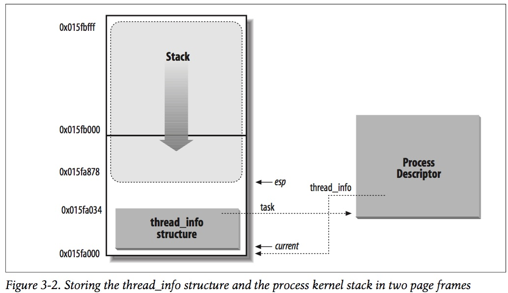

<!-- @import "[TOC]" {cmd="toc" depthFrom=1 depthTo=6 orderedList=false} -->

<!-- code_chunk_output -->

- [1. 编译调试版内核](#1-编译调试版内核)
- [2. 构建 initramfs 根文件系统](#2-构建-initramfs-根文件系统)
- [3. 调试](#3-调试)
- [4. 获取当前进程](#4-获取当前进程)
- [5. 参考](#5-参考)

<!-- /code_chunk_output -->

用 `qemu+GDB` 来调试内核和 ko, 当然我们需要准备如下:

- 带调试信息的内核 vmlinux
- 一个压缩的内核 vmlinuz 或者 bzImage
- 一份裁剪过的文件系统 initrd

# 1. 编译调试版内核

对内核进行调试需要解析符号信息, 所以得编译一个调试版内核.

```
make menuconfig
make -j 20
```

这里需要开启内核参数 CONFIG_DEBUG_INFO 和 CONFIG_GDB_SCRIPTS. GDB 提供了 Python 接口来扩展功能, 内核基于 Python 接口实现了一系列辅助脚本, 简化内核调试, 开启 CONFIG\_GDB\_SCRIPTS 参数就可以使用了.

```
Kernel hacking  --->
    [*] Kernel debugging
    Compile-time checks and compiler options  --->
        [*] Compile the kernel with debug info
        [*]   Provide GDB scripts for kernel debugging
```

编译后, **bzImage**这个是**被压缩了的**, **不带调试信息的**内核, 供 qemu 虚拟机使用(**arch/x86/boot/bzImage**), **vmlinux(当前目录**)里面带了**调试信息**, 没有压缩, 供**gdb 使用**.

当编译结束后, 可以将 vmlinux 和 bzImage 文件 copy 到一个干净的目录下.

# 2. 构建 initramfs 根文件系统

Linux 系统启动阶段, boot loader 加载完**内核文件 vmlinuz 后**, 内核**紧接着**需要挂载磁盘根文件系统, 但如果此时内核没有相应驱动, 无法识别磁盘, 就需要先加载驱动, 而驱动又位于 `/lib/modules`, 得挂载根文件系统才能读取, 这就陷入了一个两难境地, 系统无法顺利启动. 于是有了**initramfs 根文件系统**, 其中包含必要的设备驱动和工具, boot loader 加载 initramfs 到内存中, 内核会将其挂载到根目录 / ,然后**运行 /init 脚本**, 挂载真正的磁盘根文件系统.

这里借助 BusyBox 构建极简 initramfs, 提供基本的用户态可执行程序.

编译 BusyBox, 配置 **CONFIG_STATIC 参数**, 编译**静态版 BusyBox**, 编译好的可执行文件 busybox**不依赖动态链接库**, 可以独立运行, 方便构建 initramfs.

```
make menuconfig
```

```
Settings  --->
    [*] Build static binary (no shared libs)
General Configuration  --->
    [*] Don't use /usr
```

`Don't use /usr` 也一定要选,否则 make install 后 busybox 将安装在原系统的/usr 下,这将覆盖掉系统原有的命令. 选择这个选项后,make install 后会在 busybox 目录下生成一个叫\_install 的目录,里面有 busybox 和指向它的链接.

```
make -j 20
make install
```

会安装在\_install 目录:

```
# ls _install/
bin  linuxrc  sbin
```

创建 initramfs, 其中包含**BusyBox 可执行程序**、必要的**设备文件**、**启动脚本 init**. 这里没有内核模块, 如果需要调试内核模块, 可将需要的**内核模块**包含进来. **init 脚本只挂载了虚拟文件系统 procfs 和 sysfs, 没有挂载磁盘根文件系统**, 所有调试操作都**在内存中进行**, 不会落磁盘.

```
$ mkdir initramfs
$ cd initramfs
$ cp ../_install/* -rf ./
$ mkdir dev proc sys
$ sudo cp -a /dev/{null, console, tty, tty1, tty2, tty3, tty4} dev/
$ rm linuxrc
$ vim init
$ chmod a+x init
$ ls
bin   dev  init  proc  sbin  sys   usr
```

init 文件内容:

```
#!/bin/busybox sh
mount -t proc none /proc
mount -t sysfs none /sys

exec /sbin/init
```

打包 initramfs:

```
$ find . -print0 | cpio --null -ov --format=newc | gzip -9 > ../initramfs.cpio.gz
```

# 3. 调试

qemu 是一款虚拟机, 可以模拟 x86 & arm 等等硬件平台<似乎可模拟的硬件平台很多...>, 而 qemu 也内嵌了一个 gdbserver.

这个 gdbserver 于是就可以和 gdb 构成一个远程合作伙伴, 通过 ip:port 网络方式或者是通过串口`/dev/ttyS*`来进行工作, 一个在这头, 一个在那头.

启动内核:

> cd busybox-1.28.0
> qemu-system-x86_64 -s -S -m 512 -kernel arch/x86/boot/bzImage -initrd initramfs.cpio.gz -nographic -append "console=ttyS0, loglevel=8"

- `-s`: `-gdb tcp::1234` 的缩写, 监听 1234 端口, 在 GDB 中可以通过`target remote localhost:1234`连接;
- `-S`: 表示 QEMU 虚拟机会冻结 CPU 直到远程的 GDB 输入相应控制命令, 所以运行后看不到任何输出;
- `-kernel`: 指定编译好的调试版内核;
- `-initrd`: 指定制作的 initramfs, 这个文件可以从 /boot/initrd.img\-3.13.0\-43\-generic  拷贝而来, 关于它是什么东西呢? 可以参考这个:  http://www.linuxfly.org/post/94/ , 或者是这个 http://blog.csdn.net/chrisniu1984/article/details/3907874;
- `-nographic`: 取消图形输出窗口, 使 QEMU 成简单的命令行程序;
- `-append "console=ttyS0"`: 将输出重定向到 console, 将会显示在标准输出 stdio. \-append 后面跟的是**虚拟机的 cmdline**

**内核安装**的 vmlinuz-2.6.32-504.el6.x86_64 是 bzImage 格式(需要使用 arch/x86/boot/bzImage 文件), 而内核编译完, 内核源码根目录下的 vmlinux 是 ELF 格式.

**启动后的根目录**, 就是**initramfs**中包含的内容:

```
/ # ls
bin   dev  init  proc  root  sbin  sys   usr
```

由于系统自带的 GDB 版本为 7.2, 内核辅助脚本无法使用, 重新编译了一个**新版 GDB**:

```
$ cd gdb-7.9.1
$ ./configure --with-python=$(which python2.7)
$ make -j 20
$ sudo make install
```

```
./configure --prefix=../../tools/
make
make install
```

上面是重新编译 gdb, gdb-7.8/目录下并没有 Makefile 文件, 需要使用\./configure 来生产. 在配置的时候, 如果要指定 gdb 安装的路径(目录), 那么就需要跟上\-\-prefix=$PATH 的相关参数, 一般这种情况可能会针对系统已经有一个 gdb 了但无法使用, 同时也未删除, 那么新编译的 gdb 可能需要安装在另外的目录了. 当然我自己的是安装在 ../../tools/ 目录下.

启动 GDB:

```
$ cd linux-4.14
$ /usr/local/bin/gdb vmlinux
(gdb) target remote localhost:1234
```

或者

```
$ cd linux-4.14
$ /usr/local/bin/gdb
(gdb) file vmlinux
(gdb) target remote localhost:1234
```

```
break *0x7c00
```

使用内核提供的 GDB 辅助调试功能:

```
(gdb) apropos lx
function lx_current -- Return current task
function lx_module -- Find module by name and return the module variable
function lx_per_cpu -- Return per-cpu variable
function lx_task_by_pid -- Find Linux task by PID and return the task_struct variable
function lx_thread_info -- Calculate Linux thread_info from task variable
function lx_thread_info_by_pid -- Calculate Linux thread_info from task variable found by pid
lx-cmdline --  Report the Linux Commandline used in the current kernel
lx-cpus -- List CPU status arrays
lx-dmesg -- Print Linux kernel log buffer
lx-fdtdump -- Output Flattened Device Tree header and dump FDT blob to the filename
lx-iomem -- Identify the IO memory resource locations defined by the kernel
lx-ioports -- Identify the IO port resource locations defined by the kernel
lx-list-check -- Verify a list consistency
lx-lsmod -- List currently loaded modules
lx-mounts -- Report the VFS mounts of the current process namespace
lx-ps -- Dump Linux tasks
lx-symbols -- (Re-)load symbols of Linux kernel and currently loaded modules
lx-version --  Report the Linux Version of the current kernel
(gdb) lx-cmdline
console=ttyS0
```

在函数 cmdline\_proc\_show 设置断点, 虚拟机中运行 cat /proc/cmdline 命令即会触发.

```
(gdb) b cmdline_proc_show
Breakpoint 1 at 0xffffffff81298d99: file fs/proc/cmdline.c, line 9.
(gdb) c
Continuing.

Breakpoint 1, cmdline_proc_show (m=0xffff880006695000, v=0x1 <irq_stack_union+1>) at fs/proc/cmdline.c:9
9               seq_printf(m, "%s\n", saved_command_line);
(gdb) bt
#0  cmdline_proc_show (m=0xffff880006695000, v=0x1 <irq_stack_union+1>) at fs/proc/cmdline.c:9
#1  0xffffffff81247439 in seq_read (file=0xffff880006058b00, buf=<optimized out>, size=<optimized out>, ppos=<optimized out>) at fs/seq_file.c:234
#2  0xffffffff812908b3 in proc_reg_read (file=<optimized out>, buf=<optimized out>, count=<optimized out>, ppos=<optimized out>) at fs/proc/inode.c:217
#3  0xffffffff8121f174 in do_loop_readv_writev (filp=0xffff880006058b00, iter=0xffffc900001bbb38, ppos=<optimized out>, type=0, flags=<optimized out>) at fs/read_write.c:694
#4  0xffffffff8121ffed in do_iter_read (file=0xffff880006058b00, iter=0xffffc900001bbb38, pos=0xffffc900001bbd00, flags=0) at fs/read_write.c:918
#5  0xffffffff81220138 in vfs_readv (file=0xffff880006058b00, vec=<optimized out>, vlen=<optimized out>, pos=0xffffc900001bbd00, flags=0) at fs/read_write.c:980
#6  0xffffffff812547ed in kernel_readv (offset=<optimized out>, vlen=<optimized out>, vec=<optimized out>, file=<optimized out>) at fs/splice.c:361
#7  default_file_splice_read (in=0xffff880006058b00, ppos=0xffffc900001bbdd0, pipe=<optimized out>, len=<optimized out>, flags=<optimized out>) at fs/splice.c:416
#8  0xffffffff81253c7c in do_splice_to (in=0xffff880006058b00, ppos=0xffffc900001bbdd0, pipe=0xffff8800071a1f00, len=16777216, flags=<optimized out>) at fs/splice.c:880
#9  0xffffffff81253f77 in splice_direct_to_actor (in=<optimized out>, sd=0xffffc900001bbe18, actor=<optimized out>) at fs/splice.c:952
#10 0xffffffff812540e3 in do_splice_direct (in=0xffff880006058b00, ppos=0xffffc900001bbec0, out=<optimized out>, opos=<optimized out>, len=<optimized out>, flags=<optimized out>) at fs/splice.c:1061
#11 0xffffffff8122147f in do_sendfile (out_fd=<optimized out>, in_fd=<optimized out>, ppos=0x0 <irq_stack_union>, count=<optimized out>, max=<optimized out>) at fs/read_write.c:1434
#12 0xffffffff812216f5 in SYSC_sendfile64 (count=<optimized out>, offset=<optimized out>, in_fd=<optimized out>, out_fd=<optimized out>) at fs/read_write.c:1495
#13 SyS_sendfile64 (out_fd=1, in_fd=3, offset=0, count=<optimized out>) at fs/read_write.c:1481
#14 0xffffffff8175edb7 in entry_SYSCALL_64_fastpath () at arch/x86/entry/entry_64.S:203
#15 0x0000000000000000 in ?? ()
(gdb) p saved_command_line
$2 = 0xffff880007e68980 "console=ttyS0"
```

# 4. 获取当前进程

《深入理解 Linux 内核》第三版第三章–进程, 讲到内核采用了一种精妙的设计来获取当前进程.



Linux 把跟一个进程相关的 thread\_info 和内核栈 stack 放在了同一内存区域, 内核通过 esp 寄存器获得当前 CPU 上运行进程的内核栈栈底地址, 该地址正好是 thread\_info 地址, 由于进程描述符指针 task 字段在 thread\_info 结构体中偏移量为 0, 进而获得 task. 相关汇编指令如下:

```
movl $0xffffe000, %ecx      /* 内核栈大小为 8K, 屏蔽低 13 位有效位.
andl $esp, %ecx
movl (%ecx), p
```

指令运行后, p 就获得当前 CPU 上运行进程的描述符指针.

然而在调试器中调了下, 发现**这种机制早已经被废弃掉了**. thread\_info 结构体中只剩下一个字段 flags, 进程描述符字段 task 已经删除, 无法通过 thread\_info 获取进程描述符了.

而且进程的 thread\_info 也不再位于进程内核栈底了, 而是放在了进程描述符 task\_struct 结构体中, 见提交 sched/core: Allow putting thread\_info into task\_struct 和 x86: Move thread\_info into task\_struct, 这样也无法通过 esp 寄存器获取 thread\_info 地址了.

```
(gdb) p $lx_current().thread_info
$5 = {flags = 2147483648}
```

这样做是从安全角度考虑的, 一方面可以防止 esp 寄存器泄露后进而泄露进程描述符指针, 二是防止内核栈溢出覆盖 thread_info.

Linux 内核从 2.6 引入了 Per-CPU 变量, 获取当前指针也是通过 Per-CPU 变量实现的.

```
(gdb) p $lx_current().pid
$50 = 77
(gdb) p $lx_per_cpu("current_task").pid
$52 = 77
```

# 5. 参考

- [Tips for Linux Kernel Development](http://eisen.io/slides/jeyu_tips_for_kernel_dev_cmps107_2017.pdf)
- [How to Build A Custom Linux Kernel For Qemu](http://mgalgs.github.io/2015/05/16/how-to-build-a-custom-linux-kernel-for-qemu-2015-edition.html)
- [Linux Kernel System Debugging](https://blog.0x972.info/?d=2014/11/27/18/45/48-linux-kernel-system-debugging-part-1-system-setup)
- [Debugging kernel and modules via gdb](https://www.kernel.org/doc/html/latest/dev-tools/gdb-kernel-debugging.html)
- [BusyBox simplifies embedded Linux systems](https://www.ibm.com/developerworks/library/l-busybox/index.html)
- [Custom Initramfs](https://wiki.gentoo.org/wiki/Custom_Initramfs)
- [Per-CPU variables](https://0xax.gitbooks.io/linux-insides/content/Concepts/per-cpu.html)
- [Linux kernel debugging with GDB: getting a task running on a CPU](http://slavaim.blogspot.com/2017/09/linux-kernel-debugging-with-gdb-getting.html)