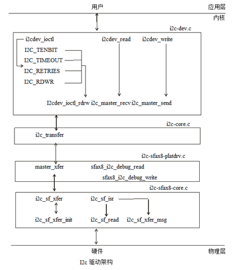

本文介绍了Siflower的I2C驱动的流程

# 1. I2C概述

I2C总线是由philips公司开发的一种简单、双向二线制同步串行总线. 它只需要两根线即可在连接于总线上的器件之间传送信息.

sfax8 i2c总线由一个串行数据线SDA和串行时钟线SCL组成.这两根线负责在连到bus上的设备之间传输信息. 每个设备必须要有一个单独的地址, 并且在数据传输时, 可以作为master或者slave. Master发起数据传输并生成时钟信号, 并允许这个传输, 这时指定地址的设备都作为slave,.为了服从于i2c系统, i2c总线接口需要外部的硬件i2c(sfax8 i2c有3个)支持. 这个i2c可以作为master或者slave.

I2C block diagram

Master/slave and transmit/receive relationship

Data transfer on the i2c bus

Master transmit and slave receive: master transmitter初始化数据传输, 生成时钟, 向slave地址发出请求, Slave receiver在收到master的请求后回这个请求,transmitter在收到receiver的ack后发出数据, receiver从bus获取数据,当数据发完也由master transmitter来终止传输.
Master receive and slave transmit: master receiver初始化数据传输, 生成时钟, 并发出数据请求, slave transmitter在收到请求后, 回复这个请求, 发送数据到bus,receiver从bus获取数据,数据发完后, 由master receiver来终止传输.

# 2. I2C驱动

## 2.1. 重要接口

	static struct file_operations i2c_ops = {
	    .owner = THIS_MODULE,
	    .open  = sfax8_i2c_debug_open,
	    .read  = sfax8_i2c_debug_read,
	    .write  = sfax8_i2c_debug_write,
	    .llseek  = default_llseek,
	    .release = single_release,
	};
//创建debug节点, 并有debug的作用

	static struct i2c_algorithm i2c_sf_algo = {
	    .master_xfer    = i2c_sf_xfer,    //进行数据传输
	    .functionality  = i2c_sf_func,
	};

	static const struct file_operations i2cdev_fops = {
	    .owner      = THIS_MODULE,
	    .llseek     = no_llseek,
	    .read       = i2cdev_read,
	    .write      = i2cdev_write,
	    .unlocked_ioctl = i2cdev_ioctl,
	    .open       = i2cdev_open,
	    .release    = i2cdev_release,
	};
//对i2c设备的数据传输过程

## 2.2. 重要结构体

	struct i2c_rdwr_ioctl_data {
	    struct i2c_msg __user \*msgs;    /\* pointers to   i2c_msgs \*/
	    __u32 nmsgs;            /\* number of i2c_msgs \*/
	};
	/* This is the structure as used in the I2C_RDWR ioctl call */

	struct i2c_msg {
	    __u16 addr; /* slave address */
	    __u16 flags;
	    __u16 len;      /* msg length */
	    __u8 *buf;      /* pointer to msg data */
	};
	//an I2C transaction segment beginning with START

	struct i2c_adapter {
	    struct module *owner;
	    unsigned int class;       /* classes to allow probing for */
	    const struct i2c_algorithm *algo; /* the algorithm to access the bus */
	    void *algo_data;
	    struct rt_mutex bus_lock;        /* data fields that are valid for all devices */
	    int timeout;            /* in jiffies */
	    int retries;
	    struct device dev;      /* the adapter device */
	};
	/*
	 * i2c_adapter is the structure used to identify a physical i2c bus along
	 * with the access algorithms necessary to access it.
	 */

## 2.3. 驱动框架

- sf\_i2c\_probe:获取设备中断, 分配设备内存, 请求io资源, 获取dts中的时钟频率, 这里只支持standard mode(100kHz),fast mode(400kHz),high speed mode(3.4mHz),若fifo depth为0, 则设为16.注册i2c\_sf\_isr到i2c中断, 当出现i2c中断时都会调这个函数. 添加i2c adapter.

- I2cdec\_ioctl:

| cmd | function |
| --- | -------- |
| I2C\_TENBIT | flag设置７bit或者10bit地址模式 |
| I2C\_PEC | flag设置packet err checking |
| I2C\_RETRIES | 设置当丢失仲裁时, 重试的次数 |
| I2C\_TIMEOUT | 设置i2c等待传输完成的最大时间 |
| I2C\_RDWR | 进行数据传输 |
其中flag配置, 都需要在进行数据传输的时候才会去配置寄存器进行配置.

- i2cdev\_ioctl\_rdrw:从用户层将数据copy到内核.为了避免因为仲裁导致数据不能立即发出去, 所以message数量不能特别大, 这里定义最大message数量为42.每个message的长度也限制为8192,确定了配置正确后, 调用i2c\_transfer传输数据, 数据传输完成后, 将receiver的数据copy到用户空间.
- i2c\_master\_recv:进行master receive模式的单个message传输.
- I2c\_master\_send:进行master transmit模式的单个message传输.
- i2c\_transfer:调用master\_xfer来传输数据, 考虑到仲裁的问题, 在timeout时间时候数据发送不成功, 则会重新进行调用master\_xfer来进行数据传输.
- i2c\_sf\_xfer:判断i2c bus状态是否为busy,如果为busy,则会直接结束, 若为idle,则调用i2c\_sf\_xfer\_init开始传输, 然后等待数据传输完, 若在timeout时间内还没有完成则报错退出(timeout时间为设置的值, 若未设, 则会根据数据量与传输速度计算得到).
- i2c\_sf\_xfer\_init:根据用户配置的参数, 配置是否为10bit地址, 配置slave地址, 打开i2c adapter.
- i2c\_sf\_isr:当出现i2c中断时被调用, 首先会判断i2c是否被enable,中断是否打开, 若i2c enable且中断打开, 则会去判断是什么中断, 若是tx abort中断, 将bus状态置为idle,并丢弃tx/rx buffer中的数据. 若是rx full中断, 调用i2c\_sf\_read. 若是tx empty中断, 则调用i2c\_sf\_xfer\_msg.
- i2c\_sf\_read:触发rx full中断时, 从rx data buffer中读出有效数据.
- i2c\_sf\_xfer\_msg:触发tx empty时, 写数据到tx buffer.
- sfax8\_i2c\_debug\_read:cat i2c\_debug,可以看到i2c debug的用法.
- sfax8\_i2c\_debug\_write: 可以通过echo i2c\_debug来读写目的寄存器.
- sfax8_i2c_debug_write: 可以通过echo i2c_debug来读写目的寄存器.
