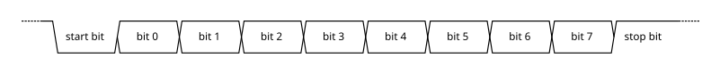

# 介绍

通用异步收发传输器(Universal Asynchronous Receiver/Transmitter, 通常称为UART)是一种异步串行收发传输器, 其数据格式和传输速度是可配置的. 它逐个发送数据位, 从最低有效位到最高有效位, 由起始位和停止位组成, 以便通信通道处理精确的时序. 电信号电平由 UART 外部的驱动电路处理. 常见的信号电平是RS-232、RS-485和用于短调试链路的原始TTL [1]. 早期的电传打字机使用电流环路.

它是最早的计算机通信设备之一, 用于连接操作员控制台的电传打字机. 它也是互联网的早期硬件系统.

UART 通常是用于通过计算机或外围设备串行端口进行串行通信的单个集成电路(IC) (或集成电路的一部分) . 微控制器芯片中通常集成一个或多个 UART 外围设备. 专用 UART 用于汽车、智能卡和SIM 卡.

相关设备通用同步和异步接收器-发送器(USART) 也支持同步操作.

从 OSI 层次上讲, UART 位于第 2 层, 即数据链路层.

是电脑硬件的一部分, 将数据通过串列通信进行传输. UART通常用在与其他通信接口(如EIA RS-232)的连接上.

具体实物表现为独立的模块化芯片, 或是微处理器中的内部周边设备(peripheral). 一般和RS-232C规格的, 类似Maxim的MAX232之类的标准信号幅度变换芯片进行搭配, 作为连接外部设备的接口. 在UART上追加同步方式的串行信号变换电路的产品, 被称为USART(Universal Synchronous Asynchronous Receiver Transmitter).

# 功能

UART是通用异步收发器(异步串行通信口)的英文缩写, 它包括了RS232、RS449、RS423、RS422和RS485等接口标准规范和总线标准规范, 即UART是异步串行通信口的总称. 而RS232、RS449、RS423、RS422和RS485等, 是对应各种异步串行通信口的接口标准和总线标准, 它规定了通信口的电气特性、传输速率、连接特性和接口的机械特性等内容. 实际上是属于通信网络中的物理层(Physical Layer)的概念, 与通信协议没有直接关系. 而通信协议, 是属于通信网络中的数据链路层(Data Link Layer)的概念. COM是PC(个人计算机)上, 异步串行通信口的简写. 由于历史原因, IBM的PC外部接口配置为RS232, 成为实际上的PC界默认标准. 所以, 现在PC机的COM均为RS232. 若配有多个异步串行通信口, 则分别称为COM1、COM2... .

# 原理

通用异步接受器-发送器(UART)把数据的字节按照比特顺序发送. 另一端的UART把比特组装为字节. 每个UART包含一个移位寄存器. 通过一根线或其他介质的串行通信比通过多根线的并行通信具有更低成本.

UART通常并不直接产生或接收其他设备的外部信号. 独立接口设备用于转换信号的逻辑电平给UART.

通信可以是单工、全双工或半双工.

## 数据帧

空闲状态, 即没有数据传输, 是高电平. 这是从(有线)电报时代的历史遗存. 线路保持高电平表明线路与传输设备没有损坏. 每个字符表示为一个帧, 以逻辑低电平为开始比特, 然后是数据比特, 可选的奇偶校验比特, 最后是一个或多个停止比特(逻辑高电平). 大部分应用都是先传最低位的数据比特(the least significant data bit), 但也有例外(如IBM 2741打印终端).

如果线路长期(至少大于传输一帧的时间)保持低电平, 这被UART检测为Break condition.

## 接收器

UART硬件受一个内部时钟信号控制. 该时钟信号是数据传输率的倍频, 典型是比特率的8或16倍. 接收器在每个时钟脉冲时测试接收到的信号状态是否为开始比特. 如果开始比特的低电平持续传输1个比特所需时间的一半以上, 则认为开始了一个数据帧的传输; 否则, 则认为是毛刺脉冲并忽略. 到了下一个比特时间后, 线路状态被采样并送入移位寄存器. 约定的表示一个字符的所有数据比特(典型为5至8个比特)接收后, 移位寄存器可被接收系统使用. UART将设置一个标记指出新数据可用, 并产生一个处理器中断请求主机处理器取走接收到的数据.

简化的UART在开始比特下降沿开始重新同步时间, 然后在每个数据比特的中心时刻采样.

UART的标准特性之一是在接收下一个字符时在缓冲区保存上一个接收到的字符. 这种"双缓冲区"允许接收计算机用一个字符的传输时段来获取缓冲区内的上一个字符. 许多UART有更大的FIFO缓冲区, 允许主机一次处理多个字符, 这特别适用于高传输数据率的串行通信同时处理器中断频率有限(通常中断间隔大于1毫秒).

## 发送器

UART把一个字符放入移位寄存器, 就开始产生一个数据帧. 对于全双工通信, 发送与接受使用不同的移位寄存器. 使用更大的FIFO使得主机处理器或DMA放置多个字节后由UART自主完成传输. 　UART用一个标志位表示busy.

## 应用

接收与发送的UART必须达成数据帧协议. 如果接收方发现这方面错误, 会向主机报告"framing error"标志.

典型的连接modem的串口, 使用8个比特表示一个字节, 没有奇偶校验位, 1个停止位. 比特率除以10就是发送ASCII字符的传输速率.

超低成本的嵌入式系统没有UART而是用处理器来实现异步串行通信.

# UART 型号

**8250** 是IBM PC及兼容机使用的第一种串口芯片. 这是一种相对来说很慢的芯片, 有时候装载到它的寄存器速度太快, 它来不及处理, 就会出现数据丢失现象. 8250有7个寄存器, 支持的最大波特率为56kb.

**8250A** 是 8250的修正版. 修正了一些小问题, 增加了一个用来表示安装了8250的寄存器, 最大速度还是56kb.

16450 是 8250A 的快速版. 加快了处理器存取它的速度, 但最大速度还是 56kb. 有些人实际用得比这高也可以.

16C451 是 16450 的CMOS版本. CMOS是制作材料和工艺的术语, 一般比其它技术省电. 速度方面无变化

16550 是第一种带先进先出(FIFO)功能的 8250 系列串口芯片. 但因为有缺陷, 很快就被下一种代替.

**16550A** 用于 **8250** 的软件兼容, 而前者提供更高的性能. 16550A的最大波特率为256kb. 但因为PC硬件设计的原因, 编程时只能用到115kb. 16550A 的管脚与8250、8250A和16450相同. 如果你的扩展串口板上串口芯片安装在插座上, 你可以用16550A替换进行简单的升级. 16550A性能增强的关键是使用了先进先出(FIFO). 它有16字节的发送FIFO寄存器和16字节的接收FIFO寄存器.

**16C551** 是 **16550AF** 的 COMS 版本.

**16C552** 是在一个芯片上包含两个 16C551.

**82510** 是 Intel公司出品, 提供多种操作模式, 默认方式为 16450. 82510 含有4字节发送 FIFO 缓冲区和 4 字节接收 FIFO 缓冲区.

* 在 **486 以下**的兼容机器中, 串口一般是集成在多功能卡上, 也多使用 **8250** 方式, 这就不能充分利用 28800 BPS及以上速度的调制解调器, 传输文件时容易出现CRC错.

* 586 以上的机器中, 串口一般是集成在主板上, 也多使用 **16550A** 方式, 可以充分利用 28800 BPS 及以上速度的调制解调器. 高速内置调制解调器中的串口芯片多使用兼容的 16550A 方式.

* 8250 是 IBM PC 及兼容机使用的一种串口芯片; 16550 是一种带先进先出(FIFO)功能的 8250 系列串口芯片; 16550A 则是 16550 的升级版本, 修复了 FIFO 相关 BUG, 也是目前比较常见的串口芯片.

# reference

https://en.wikipedia.org/wiki/Universal_asynchronous_receiver-transmitter
