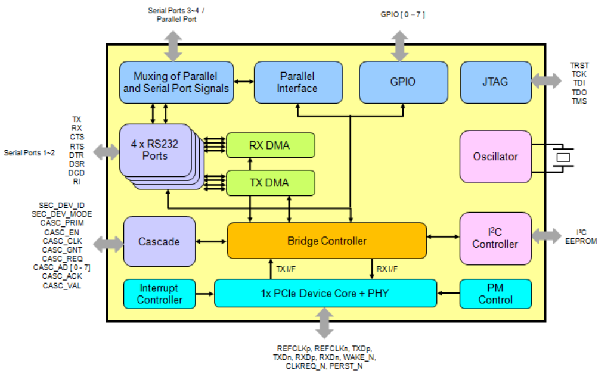

MCS9900 是一个 PCIe 转 多 I/O(4S, 2S+1P)的控制器. (PCI-E 转串口芯片)

MCS9900 是一个 **单通道**(single lane)**多功能**(multifunction)串行总线的 I/O 控制器(`single lane multifunction PCI express to I/O controller`). 

它支持两种操作模式, 通过**设备模式选择引脚**(device mode select pins) 来选择. **模式 1** 支持四个串行端口(4 serial ports, 4S)和GPIO, **模式2** 支持两个串行端口(2 serial ports, 2S), 一个并行端口(1 parallel, 1P)和 GPIO. 

MCS9900 还通过专有级联接口提供外设扩展选项. 通用级联接口允许与类似芯片 (如 MCS9900、MCS9904、MCS9901CV-CC 和 MCS9922) 互连, 以进行端口扩展. 

兼容RS232串行端口, RS422 & RS485标准和支持吞吐量从50个基点到16 mbps. 并行端口与IEEE 1284兼容,支持Nibble, Byte, SPP, ECP, 和 EPP 模式. 所有的针是可编程的,可以作为输入或输出. 一个I2C接口提供了通过一个外部 EEPROM 配置 MCS9900 设备选项. 

具有的特性:

* PCI Express
  - 带集成 PHY 的单通道 (X1) PCI Express 端点控制器
  - 符合 PCI Express 基本规范, 修订版 1.1
  - 符合 PCI Express 卡规范
  - 支持四种 PCI Express 功能
  - 支持配置请求的自动完成
  - 支持内置流量控制
  - 支持消息 TLP (错误) 生成
  - 支持非发布请求的集成超时处理
  - 支持传统和 MSI 中断
  - 支持 PCIe 电源管理
* 串行端口
  - 四个 16C450/550/扩展 550/650/增强模式兼容 UART
  - 支持 RS232、RS422 和 RS485 模式
  - 每端口双向速度从 50 bps 到 16 Mbps
  - 全串行调制解调器控制
  - 支持硬件、软件流量控制
  - 支持 5、6、7、8 位串行格式
  - 支持偶数、奇数、无、空格和标记奇偶校验
  - 支持自定义波特率通过编程内部 PLL 或外部时钟
  - 支持每个串行端口的发送、接收路径中的片上 256 字节深度 FIFO
  - 支持远程唤醒和电源管理功能
  - 串行端口收发器关机支持
  - 支持所有串行端口上的慢速 IrDA 模式 (高达 115200bps) 
* 并行端口
  - 与 IEEE 1284 兼容
  - Nibble 模式
  - 字节模式
  - 增强型并行端口 (EPP 1.9) 
  - 扩展功能端口 (ECP) 
  - FIFO 模式 (缓冲 SPP 模式) 
* 级联: MCS9900 支持 13 针专有接口, 可连接到其他支持级联的 ASIX 设备以进行 IO 扩展. 例如, MCS9900 可以与另一个 MCS9900 接口以获得以下产品配置
  - PCIe 至 8 个串行端口
  - PCIe 至 6 个串行端口和 1 个并行端口
  - PCIe 至 4 个串行端口和 2 个并行端口
* 一般设备特性
  - EEPROM 的 I2C 接口
  - 通过 PCIe 接口读取/写入 EEPROM
  - 最多 8 条双向多功能 GPIO 线
  - 片上振荡器
  - 电源: 1.2V, 3.3V
  - 封装: 128 针 LQFP, RoHS
  - 工作温度: 0 至 +70°C

MCS9900是一个PCI Express单通道 (‌X1) ‌的端点控制器, ‌具有集成的物理层 (‌PHY) ‌. ‌它通过外部EEPROM提供C接口来配置MCS9901CV-CC设备选项. ‌这个控制器被设计用于实现PCI Express通信协议, ‌支持单通道PCI Express端点设备的连接和通信. ‌通过提供集成的PHY, ‌MCS9900简化了PCI Express端点设备的物理层连接, ‌减少了额外硬件的需求, ‌从而降低了系统的整体成本和复杂性. ‌此外, ‌通过外部EEPROM的配置选项, ‌用户可以根据具体的应用需求灵活地调整控制器的参数, ‌以适应不同的工作环境和性能要求.

也就是一个办法就是, 将 MCS9900 作为 PCI 设备存在, 而 uart 是它的一部分 