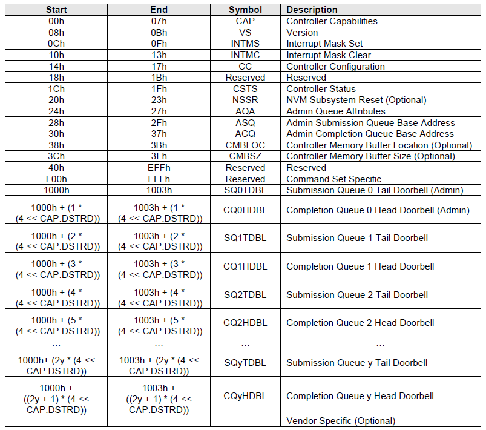

<!-- @import "[TOC]" {cmd="toc" depthFrom=1 depthTo=6 orderedList=false} -->

<!-- code_chunk_output -->

- [整体顺序](#整体顺序)
- [1. 参考](#1-参考)
- [2. 源代码阅读顺序](#2-源代码阅读顺序)
- [3. 模块函数](#3-模块函数)
- [4. workqueue](#4-workqueue)
- [5. alloc_chrdev_region](#5-alloc_chrdev_region)
- [6. class_create](#6-class_create)
- [7. struct device](#7-struct-device)
- [8. reference](#8-reference)

<!-- /code_chunk_output -->

# 整体顺序

1. NVMe 协议

2. NVMe 驱动

# 1. 参考

书籍: 《LINUX 设备驱动程序》第三版

初始化参考链接: linux 里的 nvme 驱动代码分析(加载初始化), https://blog.csdn.net/panzhenjie/article/details/51581063, nvme_reset_work() 函数后的代码大致相同

IO 入口点: NVMe 的 Linux 内核驱动分析, https://zhuanlan.zhihu.com/p/72234187

块设备层相关数据结构: Block multi-queue 架构解析(一)数据结构, https://blog.csdn.net/qq_32740107/article/details/106302376

> Linux 块设备层已逐步切换到 multiqueue , Linux5.0 以后单队列代码已被完全移除. multiqueue 核心思路是为每个 CPU 分配一个软件队列, 为存储设备的每个硬件队列分配一个硬件派发队列, 再将软件队列与硬件派发队列做绑定, 减少了 IO 请求过程中对锁的竞争, 从而提高 IO 性能.

块设备层文档: Block Device Drivers, https://linux-kernel-labs.github.io/refs/heads/master/labs/block_device_drivers.html#block-device-drivers

linux 内核源码分析 - nvme 设备的初始化, https://www.cnblogs.com/tolimit/p/8779876.html

其他博客:

手把手教 Linux 驱动: https://blog.csdn.net/daocaokafei/article/details/108071589

linux 驱动开发: https://www.cnblogs.com/xiaojiang1025/category/918665.html

nvme kernel driver 阅读笔记: https://www.dazhuanlan.com/karenchan/topics/1006006

nvme 协议详解: https://www.zhihu.com/column/c_1338070478725480449

# 2. 源代码阅读顺序

1. `nvme_core` 模块初始化

`nvme_core_init()`:创建工作队列, 类; 申请设备号

2. nvme 模块初始化

`nvme_init()`: 注册 `pci_driver` 结构体

3. nvme 设备初始化

`nvme_probe()`: 加载 nvme 设备

* `nvme_dev_map()`: 申请 IO 内存并进行映射

* `nvme_setup_prp_pools()`: 创建 DMA 池

* `nvme_init_ctrl()`: 填充 `nvme_ctrl` 结构体, 创建字符设备 /dev/nvme0

* `nvme_reset_ctrl()`: 修改 `nvme_ctrl` 结构体状态, 将 `nvme_reset_work` 加入工作队列 `nvme_reset_wq`

4. nvme 设备重启

`nvme_reset_work()`: 重启设备, 涉及许多 nvme 协议相关知识, 还有设备各阶段对寄存器的操作

* `nvme_dev_disable(dev, false)`: 设备关闭. 如果 controller 是 live 的, disable 掉 nvme

* `nvme_pci_enable()`: 初始化 pci 设备(BAR 寄存器, `MSI-X` 中断, CMB 等)

* `nvme_pci_configure_admin_queue()`: 映射 bar 寄存器, 申请并初始化 admin 队列

* `nvme_alloc_admin_tags()`: 初始化 `dev->admin_tagset` 结构体, 并创建请求队列

* `nvme_init_identify()`: 向 NVMe 设备发送 identify 命令

* `nvme_setup_io_queues()`: 向 NVMe 设备发送 set feature 命令, 再次申请中断号, 注册中断函数, 申请空间, 创建 IO 队列

* `nvme_dev_add()`: 填充 `dev->tagset`

* `nvme_start_ctrl()` -> `nvme_queue_scan()` -> `ctrl->scan_work->nvme_scan_work()`:

5. 创建块设备

`nvme_scan_work()`: 发送一系列 identify 命令, 创建块设备

* 只需看 `nvme_scan_ns_list()` -> `nvme_validate_ns()` -> `nvme_alloc_ns()`

* `nvme_alloc_ns()`: 填充 ns, 创建块设备

# 3. 模块函数

一个模块 mod1 中定义一个函数 func1; 在另外一个模块 mod2 中定义一个函数 func2, func2 调用 func1.

1. 在模块 mod1 中, EXPORT_SYMBOL(func1);
2. 在模块 mod2 中, extern int func1();

就可以在 mod2 中调用 func1 了.

# 4. workqueue

Linux-workqueue 讲解: https://www.cnblogs.com/vedic/p/11069249.html

workqueue 是**对内核线程封装**的用于处理各种工作项的一种处理方法, 由于处理对象是用**链表拼接一个个工作项**, 依次取出来处理, 然后**从链表删除**, 就像一个队列排好队依次处理一样, 所以也称**工作队列**

所谓封装可以简单理解一个**中转站**,  **一边**指向"合适"的**内核线程**, **一边**接受你丢过来的**工作项**, 用结构体 `workqueue_srtuct` 表示,  而所谓**工作项**也是个**结构体** – `work_struct`, 里面有个**成员指针**, 指向你最终要**实现的函数**

```cpp
struct workqueue_struct *workqueue_test;

struct work_struct work_test;

void work_test_func(struct work_struct *work)
{
    printk("%s()\n", __func__);

    //mdelay(1000);
    //queue_work(workqueue_test, &work_test);
}


static int test_init(void)
{
    printk("Hello,world!\n");

    /* 1. 自己创建一个 workqueue,  中间参数为 0, 默认配置 */
    workqueue_test = alloc_workqueue("workqueue_test", 0, 0);

    /* 2. 初始化一个工作项, 并添加自己实现的函数 */
    INIT_WORK(&work_test, work_test_func);

    /* 3. 将自己的工作项添加到指定的工作队列去,  同时唤醒相应线程处理 */
    queue_work(workqueue_test, &work_test);

    return 0;
}
```

# 5. alloc_chrdev_region

alloc_chrdev_region 是让内核**分配**给我们一个**尚未使用的主设备号**, 不是由我们自己指定的, 该函数的四个参数意义如下:

dev: alloc_chrdev_region 函数向内核申请下来的设备号

baseminor: 次设备号的起始

count: 申请次设备号的个数

name: 执行 cat /proc/devices 显示的名称

# 6. class_create

内核中定义了 struct class 结构体, 一个 struct class 结构体类型变量对应一个类, 内核同时提供了 `class_create()` 函数 , 可以用它来创建一个类, 这个类存放于 sysfs 下面, 一旦创建了这个类, 再调用 `device_create()` 函数 在 /dev 目录下创建相应的设备节点(/sys/class/类名/设备名)

# 7. struct device

Linux 内核中的设备驱动模型, 是建立在 sysfs 设备文件系统和 kobject 上的, 由总线(bus)、设备(device)、驱动(driver)和类(class)所组成的关系结构, 在底层, Linux 系统中的每个设备都有一个 device 结构体的实例

dev_to_node: 返回 struct device 中的 numa_node 变量, 即所属的内存节点

```cpp
struct device {
#ifdef CONFIG_NUMA
	int		numa_node;	/* NUMA node this device is close to */
#endif
}

static inline int dev_to_node(struct device *dev)
{
	return dev->numa_node;
}
```

kzalloc_node: 从特定的内存节点分配零内存

```cpp
/**
 * kzalloc_node - allocate zeroed memory from a particular memory node.
 * @size: how many bytes of memory are required.
 * @flags: the type of memory to allocate (see kmalloc).
 * @node: memory node from which to allocate
 */
static inline void *kzalloc_node(size_t size, gfp_t flags, int node)
{
	return kmalloc_node(size, flags | __GFP_ZERO, node);
}
```

驱动中的队列, 通过函数 kcalloc_node 创建, 可以看到队列数量是和系统中所拥有的 cpu 数量有关.

```cpp
dev->queues = kcalloc_node(num_possible_cpus() + 1,sizeof(struct nvme_queue), GFP_KERNEL, node);
```

Queue 有的概念, 那就是**队列深度**, 表示其**能够放多少个成员**. 在 NVMe 中, 这个队列深度是**由 NVMe SSD 决定**的, 存储在 NVMe 设备的 **BAR 空间**里.

**队列**用来存放 `NVMe Command`, NVMe Command 是**主机与 SSD 控制器交流**的基本单元, 应用的 **I/O 请求**也要转化成 NVMe Command.

不过需要注意的是, 就算有很多 CPU 发送请求, 但是**块层**并不能保证都能处理完, **将来**可能要**绕过 IO 栈的块层**, 不然瓶颈就是操作系统本身了.

当前 Linux 内核提供了 `blk_queue_make_request` 函数, 调用这个函数**注册自定义的队列处理方法**, 可以**绕过 io 调度和 io 队列**, 从而缩短 io 延时. **Block 层**收到上层发送的 **IO 请求**, 就会选择该方法处理.

get_device: https://deepinout.com/linux-kernel-api/device-driver-and-device-management/linux-kernel-api-get_device.html

```cpp
struct device *get_device(struct device *dev)
```

get_device 输入参数说明

函数 get_device() 的输入参数是 struct device 结构体类型的指针, 代表增加计数的逻辑设备

get_device 返回参数说明

函数 get_device() 的返回结果是 struct device 结构体类型的变量, 返回的结果与传入的参数代表的是**同一个变量**, 只是此时变量的引用计数器的值增大了 1.

pci_set_drvdata

pci_set_drvdata() 为 pci_dev 设置**私有数据指针**, 把**设备指针地址**放入 PCI 设备中的设备指针中, 便于后面调用 pci_get_drvdata

```cpp
static inline void pci_set_drvdata(struct pci_dev *pdev, void *data)
{
	dev_set_drvdata(&pdev->dev, data);
}
static inline void dev_set_drvdata(struct device *dev, void *data)
{
	dev->driver_data = data;
}
```

to_pci_dev

```cpp
dev->dev = get_device(&pdev->dev);
struct pci_dev *pdev = to_pci_dev(dev->dev);
```

to_pci_dev 应该是对 container_of 宏的封装, 根据成员地址获得结构体地址.

pci_request_mem_regions

内核 request_mem_region 和 ioremap 的理解: https://blog.csdn.net/skyflying2012/article/details/8672011

pci_request_mem_regions 应该是对 request_mem_region 的封装,

几乎每一种外设都是通过读写设备上的寄存器来进行的, 通常包括控制寄存器、状态寄存器和数据寄存器三大类, **外设的寄存器**通常**被连续的编址**. 根据 CPU 体系结构的不同, CPU 对 IO 端口的编址方式有两种:

(1)I/O 映射方式(I/O-mapped)

典型地, 如 X86 处理器为外设专门实现了一个单独的地址空间, 称为"I/O 地址空间"或者"I/O 端口空间", CPU 通过专门的 I/O 指令(如 X86 的 IN 和 OUT 指令)来访问这一空间中的地址单元.

(2)内存映射方式(Memory-mapped)

RISC 指令系统的 CPU(如 MIPS ARM PowerPC 等)通常只实现一个物理地址空间, 像这种情况,外设的 I/O 端口的物理地址就被映射到内存地址空间中, 外设 I/O 端口成为内存的一部分. 此时, CPU 可以象访问一个内存单元那样访问外设 I/O 端口, 而不需要设立专门的外设 I/O 指令.

但是, 这两者在硬件实现上的差异对于软件来说是完全透明的, 驱动程序开发人员可以将内存映射方式的 I/O 端口和外设内存统一看作是"I/O 内存"资源.

一般来说, 在系统运行时, **外设**的 **I/O 内存资源**的**物理地址**是**已知的**, 由**硬件的设计决定**. 但是 CPU 通常并没有为这些已知的外设 I/O 内存资源的物理地址预定义虚拟地址范围, 驱动程序并不能直接通过物理地址访问 I/O 内存资源, 而必须将它们**映射到核心虚地址空间内**(通过页表), 然后才能根据映射所得到的核心虚地址范围, 通过访内指令访问这些 I/O 内存资源. Linux 在 io.h 头文件中声明了函数 `ioremap()`, 用来**将 I/O 内存资源的物理地址映射到核心虚地址空间**.

但要使用 I/O 内存首先要申请,然后才能映射,使用 I/O 端口首先要申请,或者叫请求,对于 I/O 端口的请求意思是让内核知道你要访问这个端口,这样内核知道了以后它就不会再让别人也访问这个端口了.毕竟这个世界僧多粥少啊.申请 I/O 端口的函数是 request_region, 申请 I/O 内存的函数是 request_mem_region,  来自 include/linux/ioport.h

说白了, request_mem_region 函数并**没有做实际性的映射工作**, 只是告诉内核要使用一块内存地址, **声明占有**, 也方便内核管理这些资源.

重要的还是 ioremap 函数, ioremap 主要是检查传入地址的合法性, 建立页表(包括访问权限), 完成物理地址到虚拟地址的转换.

```cpp
void * ioremap(unsigned long phys_addr, unsigned long size, unsigned long flags);
```

iounmap 函数用于取消 ioremap()所做的映射, 原型如下:

```cpp
void iounmap(void * addr);
```

在将 I/O 内存资源的物理地址映射成核心虚地址后, 理论上讲我们就可以像读写 RAM 那样直接读写 I/O 内存资源了. 为了保证驱动程序的跨平台的可移植性, 我们应该**使用** Linux 中**特定的函数**来**访问 I/O 内存资源**, 而不应该通过指向核心虚地址的指针来访问.

pci_resource_start

pci_resource_start 是如何得到 PCI 的物理地址的: https://bbs.csdn.net/topics/390998915

Linux PCIe BAR 物理地址的获取: https://blog.csdn.net/zhang_shuaifeng/article/details/128468748

```cpp
#define pci_resource_start(dev,bar) ((dev)->resource[(bar)].start)
```

在**硬件加电初始化**时, **BIOS** 固件**统一检查**了**所有的 PCI 设备**,  并**统一**为他们**分配**了一个**和其他互不冲突的地址**, 让他们的**驱动**程序可以**向这些地址映射他们的寄存器**, 这些地址被 **BIOS** 写进了**各个设备**的**配置空间**, 因为这个活动是**一个 PCI 统一标准的活动**, 所以自然**写**到各个设备的**配置空间**里而**不是**他们风格各异的**控制寄存器空间**里. 当然**只有 BIOS** 可以**访问配置空间**. 当**操作系统 初始化**时, 它为**每个 PCI 设备**分配了 `pci_dev` 结构, 并且把 BIOS 获得的并写到了配置空间中的**地址读出来**写到了 `pci_dev` 中的 **resource 字段**中. 这样以后我们在读这些地址就不需要在访问配置空间了, 直接跟 pci_dev 要就可以了, 我们这里的四个函数就是直接从 `pci_dev` 读出了相关数据, 代码在 `include/linux/pci.h` 中. 定义如下:

```cpp
#define pci_resource_start(dev,bar) ((dev)->resource[(bar)].start)
#define pci_resource_end(dev,bar) ((dev)->resource[(bar)].end)
```

这里需要说明一下, 每个 PCI 设备有 `0-5` 一共 6 个地址空间, 我们通常只使用前两个, 这里我们把参数 1 传给了 bar 就是使用内存映射的地址空间.

如果要更具体, 查看 `pci_dev` 结构的初始化过程

调用 `pci_resource_flags` 函数来判断 PCI 是**内存映射模式**, 还是**IO 端口模式**

调用 `pci_resource_len` 函数来判断内存空间是否小于设备所需要的内存空间, 如果小于, 明显出错

init_completion

线程同步手段—completion: https://www.linuxidc.com/Linux/2011-10/44625p3.htm

首先是 struct completion 的结构, 由一个计数值和一个等待队列组成.

1、unsigned int done;

指示等待的事件是否完成. 初始化时为 0. 如果为 0, 则表示等待的事件未完成. 大于 0 表示等待的事件已经完成.

2、wait_queue_head_t wait;

存放等待该事件完成的进程队列

completion 是类似于信号量的东西, 用 completion.done 来表示资源是否可用, 获取不到的线程会阻塞在 completion.wait 的等待队列上, 直到其它线程释放 completion

物理地址、虚拟地址、总线地址

什么是物理地址、虚拟地址、总线地址: https://blog.csdn.net/renlonggg/article/details/82684407

所有的地址都可以称为总线地址, 因为开发环境下所有的设备都是接在总线上, 如 AXI 总线, APB 总线, PCI 总线 I2C 总线 SPI 总线. 也就会存在很多种地址空间.

大部分情况下, 总线地址=物理地址, 为什么呢, 物理地址是处理器在该系统总线上发出的地址, 因此处理器发出的物理地址完全可以理解为处理器地址空间的总线地址, 这肯定是相等的.

大部分程序操作都是处理器作为主设备, 根据指令, 来发出地址, 读写数据. 这时总线地址=物理地址

有一种情况下不是处理器做主设备, DMA, DMA controller 操作 RAM 是不需要经过处理器的, 这是 DMA controller 是主设备, 但是因为 DMA controller 也是挂接在系统总线上, 也就是处理器的地址空间中.

所以这时 DMA controller 发出的地址也是物理地址.

有一种特殊情况下, 总线地址与物理地址不同, 就是 PCI 总线.

因为 PCI 总线存在地址映射, 这是因为 PCI 控制器内部有桥接电路, 桥接电路会将 I/O 地址映射为不同的物理地址.

可以想象, PCI 控制器挂接在处理器的系统总线上, 而另一端的 PCI 总线上外扩了一些 PCI 设备.

假如某个 PCI 设备具有 DMA 能力, 要去操作 RAM, 这时该设备看到的 RAM 的地址就应该是由系统总线映射到 PCI 总线上的总线地址.

映射关系由 PCI 控制器地址窗口来配置, 一般是一个偏移量, 所以这时映射到 PCI 总线上的 RAM 的总线地址就不是 RAM 在处理器系统地址空间上的物理地址(也可以称为系统总线地址)了.

因此总线地址 ！= 物理地址

dma_pool_create

Linux 下的 DMA 浅析: https://blog.csdn.net/zqixiao_09/article/details/51089088

许多驱动程序需要**又多又小**的**一致映射内存区域**给 DMA 描述子或 I/O 缓存 buffer, 这使用 DMA 池比用 dma_alloc_coherent 分配的一页或多页内存区域好, DMA 池用函数 dma_pool_create 创建, 用函数 dma_pool_alloc 从 DMA 池中分配一块一致内存, 用函数 dmp_pool_free 放内存回到 DMA 池中, 使用函数 dma_pool_destory 释放 DMA 池的资源

```cpp
struct dma_pool {	/* the pool */
	struct list_head	page_list;//页链表
	spinlock_t		lock;
	size_t			blocks_per_page;　//每页的块数
	size_t			size;     //DMA 池里的一致内存块的大小
	struct device		*dev; //将做 DMA 的设备
	size_t			allocation; //分配的没有跨越边界的块数, 是 size 的整数倍
	char			name [32];　//池的名字
	wait_queue_head_t	waitq;  //等待队列
	struct list_head	pools;
};

struct dma_pool *dma_pool_create (const char *name, struct device *dev,
	　　　　　　　　　　size_t size, size_t align, size_t allocation)
```

函数 `dma_pool_create` 给 DMA 创建一个一致内存块池, 其参数 **name** 是**DMA 池的名字**, 用于诊断用, 参数 **dev** 是将**做 DMA 的设备**, 参数 size 是 DMA 池里的**块的大小**, 参数 align 是块的对齐要求, 是 2 的幂, 参数 allocation 返回没有跨越边界的块数(或 0)

WARN_ON_ONECE

linux 内核态调试函数 BUG_ON()与 WARN_ON 区别: https://blog.csdn.net/xiaohua0877/article/details/78515472

WARN_ON 则是调用 dump_stack, 打印堆栈信息, 不会 OOPS

```cpp
#define WARN_ON(condition) do {

    if (unlikely((condition)!=0)) {

        printk("Badness in %s at %s:%d/n", __FUNCTION__, __FILE__,__LINE__);

        dump_stack();

    }

} while (0)
```

mempool_create_node

linux 内存管理(十五)-内存池: https://blog.csdn.net/sinat_22338935/article/details/118719738

平时我们直接所使用的 malloc,new,free,delete 等等 API 申请内存分配, 这做缺点在于, 由于所申请内存块的大小不定, 当频繁使用时会造成**大量的内存碎片**并**进而降低性能**

memory pool 是一种内存分配方式, 又被称为**固定大小区块规划**.

**内存池**(Memery Pool)技术是在**真正使用内存之前**, 先**申请**分配**一定数量**的、**大小相等**(一般情况下)的**内存块**留作备用.

当有**新的内存需求**时, 就从**内存池**中**分出一部分内存块**, 若内存块**不够**再继续**申请新的内存**. 这样做的一个显著优点是尽量**避免了内存碎片**, 使得内存分配效率得到提升. 不仅在用户态应用程序中被广泛使用, 同时在 Linux 内核也被广泛使用, 在内核中有不少地方内存分配不允许失败.

作为一个在这些情况下确保分配的方式, 内核开发者创建了一个已知为内存池(或者是 "mempool" )的抽象, 内核中**内存池**真实地只是相当于**后备缓存**, 它尽力一直保持一个空闲内存列表给紧急时使用, 而在通常情况下有内存需求时还是从公共的内存中直接分配, 这样的做法虽然有点霸占内存的嫌疑, 但是可以从根本上保证**关键应用**在**内存紧张时申请内存**仍然能够成功.

```cpp
typedef struct mempool_s {
	spinlock_t lock;//防止多处理器并发而引入的锁
	int min_nr;	//elements 数组中的成员数量
	int curr_nr;//当前 elements 数组中空闲的成员数量
	void **elements;//用来存放内存成员的二维数组, 等于 elements[min_nr][内存对象的长度]

	//内存池与内核缓冲区结合使用的指针(这个指针专门用来指向这种内存对象对应的缓存区的指针)
	void *pool_data;
	mempool_alloc_t *alloc;//内存分配函数
	mempool_free_t *free;//内存释放函数
	wait_queue_head_t wait;//任务等待队列
} mempool_t;

mempool_t *mempool_create(int min_nr, mempool_alloc_t *alloc_fn,
				mempool_free_t *free_fn, void *pool_data)
{
	return mempool_create_node(min_nr,alloc_fn,free_fn, pool_data,
				   GFP_KERNEL, NUMA_NO_NODE);
}
EXPORT_SYMBOL(mempool_create);

/******************
创建一个内存池对象
参数:
min_nr :  	为内存池分配的最小内存成员数量
alloc_fn :  用户自定义内存分配函数(可以使用系统定义函数)
free_fn :	用户自定义内存释放函数(可以使用系统定义函数)
pool.data : 根据用户自定义内存分配函数所提供的可选私有数据, 一般是缓存区指针
gfp_mask :  内存分配掩码
node_id :  	内存节点的 id
******************/
mempool_t *mempool_create_node(int min_nr, mempool_alloc_t *alloc_fn,
			       mempool_free_t *free_fn, void *pool_data,
			       gfp_t gfp_mask, int node_id)
{
	mempool_t *pool;

	// 为内存池对象分配内存
	pool = kzalloc_node(sizeof(*pool), gfp_mask, node_id);
	if (!pool)
		return NULL;

	// 初始化内存池
	if (mempool_init_node(pool, min_nr, alloc_fn, free_fn, pool_data,
			      gfp_mask, node_id)) {
		kfree(pool);
		return NULL;
	}

	return pool;//返回内存池结构体
}
EXPORT_SYMBOL(mempool_create_node);
```

alloc_page

https://www.cnblogs.com/linhaostudy/p/10161229.html

```cpp
#define alloc_page(gfp_mask) alloc_pages(gfp_mask, 0)
```

ida_simple_get

https://biscuitos.github.io/blog/IDA_ida_simple_get/

```cpp
#define ida_simple_get(ida, start, end, gfp)    \
                        ida_alloc_range(ida, start, (end) - 1, gfp)
```

`ida_simple_get()` 函数用于获得一个**未使用的 ID**. ida 参数对应 IDA; 参数 start 指定起始 ID; 参数 end 指定结束 ID, end 为 0 应该就是最大值; 参数 gfp 指向内存分配时的标志. 函数 最终调用 ida_alloc_range() 函数进行分配.

Linux 内核 device 结构体分析

device_initialize() 函数是设备在 sysfs 中注册的第一个阶段, 用于将 struct device 结构体进行初始化, 主要是对结构体内的一些成员进行初始化, 结构体内嵌的 kobject 下的 kset 配置为 devices_kset, 调用 kobject_init() 函数设置 device_ktyp e 和 sysfs_ops 结构中的两个函数和 device_release() 函数, 另外还有一些特定资源需要的成员的初始化.

```
Linux 内核的 MKDEV 宏定义

定义位置: <linux/cdev.h>

#define MKDEV(major,minor) (((major) << MINORBITS) | (minor))

宏作用:  获取设备在设备表中的位置

major 主设备号

minor 次设备号

执行成功后返回 dev_t 类型的设备编号
```

device_add() 会在 /sys 目录**对应设备目录**下创建 uevent 属性节点, 应用层的 udev 则会根据 uevent 来创建 /dev 目录下的设备节点, `cdev_add()` **注册字符设备**.

**字符设备**的**设备号**已经在 `nvme_core` 模块初始化时申请

```cpp
alloc_chrdev_region(&nvme_ctrl_base_chr_devt, 0, NVME_MINORS, "nvme");

alloc_chrdev_region(&nvme_ns_chr_devt, 0, NVME_MINORS, "nvme-generic");
```


**nvme 模块初始化**负责创建字符设备

设备关闭:

* Host 停止提交新的 I/O 命令, 但允许未完成的命令继续完成;

* Host 删除所有 I/O SQ, 删除所有 SQ 队列后, 所有未完成的命令将被撤销;

* Host 删除所有 I/O CQ;

* Host 将 CC.SHN 置 01b, 表示正常关闭; 关闭程序完成时, 将 CSTS.SHST 置 10b.

pci_enable_device_mem

pci_enable_device()与 pci_enable_device_mem()区别: https://blog.csdn.net/bryanwang_3099/article/details/106794149

PCI/PCIE 的 BAR 有两种类型, memory 和 IO. pci_enable_device_mem() 只初始化 memory 类型的 BAR, pci_enable_device() 同时初始化 memory 和 IO 类型的 BAR. 如果要驱动的 PCI/PCIE 设备包含 IO 空间, 那么必须使用 pci_enable_device()

pci_set_master:

调用 pci_set_master(pdev) 函数, 设置设备具有获得总线的能力, 即调用这个函数, 使设备具备申请使用 PCI 总线的能力

dma_set_mask_and_coherent

LINUX 网络子系统中 DMA 机制的实现: https://cloud.tencent.com/developer/article/1628161

函数 `dma_set_mask_and_coherent()` 用于对 `dma_mask` 和 `coherent_dma_mask` 赋值.

`dma_mask` 表示的是该设备通过 **DMA** 方式**可寻址的物理地址范围**, `coherent_dma_mask` 表示所有设备通过 DMA 方式可寻址的公共的物理地址范围,

因为不是所有的硬件设备都能够支持 64bit 的地址宽度.

```cpp
/*
 * Set both the DMA mask and the coherent DMA mask to the same thing.
 * Note that we don't check the return value from dma_set_coherent_mask()
 * as the DMA API guarantees that the coherent DMA mask can be set to
 * the same or smaller than the streaming DMA mask.
 */
static inline int dma_set_mask_and_coherent(struct device *dev, u64 mask)
{
    int rc = dma_set_mask(dev, mask);
    if (rc == 0)
        dma_set_coherent_mask(dev, mask);
    return rc;
}
```

rc==0 表示该设备的 dma_mask 赋值成功, 所以可以接着对 coherent_dma_mask 赋同样的值.

控制寄存器:



MSI/MSI-x 中断

PCIe 学习笔记之 MSI/MSI-x 中断及代码分析: https://blog.csdn.net/yhb1047818384/article/details/106676560

**传统中断**在**系统初始化**扫描 PCI bus tree 时就已**自动为设备分配好中断号**, 但是如果设备需要使用 MSI, 驱动需要进行一些额外的配置.

当前 linux 内核提供 `pci_alloc_irq_vectors` 来进行 `MSI/MSI-X capablity` 的**初始化配置**以及**中断号分配**.

```cpp
int pci_alloc_irq_vectors(struct pci_dev *dev, unsigned int min_vecs,
                unsigned int max_vecs, unsigned int flags);
```

函数的返回值为该 PCI 设备分配的中断向量个数.

min_vecs 是设备对中断向量数目的最小要求, 如果小于该值, 会返回错误.

max_vecs 是期望分配的中断向量最大个数.

flags 用于区分设备和驱动能够使用的中断类型

```cpp
#define PCI_IRQ_LEGACY		(1 << 0) /* Allow legacy interrupts */
#define PCI_IRQ_MSI		(1 << 1) /* Allow MSI interrupts */
#define PCI_IRQ_MSIX		(1 << 2) /* Allow MSI-X interrupts */
#define PCI_IRQ_ALL_TYPES   (PCI_IRQ_LEGACY | PCI_IRQ_MSI | PCI_IRQ_MSIX)
```

```cpp
static inline __u64 lo_hi_readq(const volatile void __iomem *addr)
{
	const volatile u32 __iomem *p = addr;
	u32 low, high;

	low = readl(p);
	high = readl(p + 1);

	return low + ((u64)high << 32);
}

static inline void lo_hi_writeq(__u64 val, volatile void __iomem *addr)
{
	writel(val, addr);
	writel(val >> 32, addr + 4);
}
```

CMB

Controller Memory Buffer

关于 SSD HMB 与 CMB: https://blog.csdn.net/TV8MbnO2Y2RfU/article/details/78103780

但是如果 CPU 将整条指令而不是指针直接写到 SSD 端的 DRAM 的话, 并不耗费太多资源, 此时能够节省一次 PCIE 往返及一次 SSD 控制器内部的中断处理. 于是, 人们就想将 SSD 控制器上的一小段 DRAM 空间映射到 host 物理地址空间从而可以让**驱动直接写指令**进去, 甚至写一些数据进去也是可以的. 这块被映射到 host 物理地址空间的 DRAM 空间便被称为 CMB 了

ioremap_wc

函数解读: ioremap、ioremap_cached、ioremap_wc: https://blog.csdn.net/student456852/article/details/116868447

ioremap_wc 用来映射 memory type 为 normal memory 的设备, 同时不使用 cache

sysfs API 总结

https://blog.csdn.net/qb_2008/article/details/6846412

sysfs_add_file_to_group()将一个属性 attr 加入 kobj 目录下已存在的的属性集合 group.

PCI 驱动使用函数

https://blog.csdn.net/qiao_zz/article/details/53287749

readl

Linux I/O 映射(ioremap)和 writel/readl: https://www.cnblogs.com/lialong1st/p/7756675.html

byte word long

readb readw readl: 从虚拟地址读取 1 2 4 字节数据

```cpp
unsigned int readl(unsigned int addr);
void writel(unsigned int data, unsigned int addr);
```

```
result = nvme_alloc_queue(dev, 0, NVME_AQ_DEPTH); //为 admin queue 申请空间
```

dma_zalloc_coherent

DMA 内存申请--dma_alloc_coherent 及 寄存器与内存: https://www.cnblogs.com/sky-heaven/p/9579742.html

dma_alloc_coherent() – 获取物理页, 并将该物理页的总线地址保存于 dma_handle, 返回该物理页的虚拟地址

DMA 映射建立了一个新的结构类型---------dma_addr_t 来表示总线地址. dma_addr_t 类型的变量对驱动程序是不透明的; 唯一允许的操作是将它们传递给 DMA 支持例程以及设备本身. 作为一个总线地址, 如果 CPU 直接使用了 dma_addr_t, 将会导致发生不可预期的后果！

一致性 DMA 映射存在与驱动程序的生命周期中, 它的缓冲区必须可同时被 CPU 和外围设备访问！因此一致性映射必须保存在一致性缓存中. 建立和使用一致性映射的开销是很大的！

```cpp
void * dma_alloc_coherent(struct device *dev,    size_t size, dma_addr_t  *dma_handle, gfp_t gfp)
```

```cpp
static const struct nvme_ctrl_ops nvme_pci_ctrl_ops = {
	.name			= "pcie",
	.module			= THIS_MODULE,
	.flags			= NVME_F_METADATA_SUPPORTED,
	.reg_read32		= nvme_pci_reg_read32,
	.reg_write32		= nvme_pci_reg_write32,
	.reg_read64		= nvme_pci_reg_read64,
	.free_ctrl		= nvme_pci_free_ctrl,
	.submit_async_event	= nvme_pci_submit_async_event,
	.get_address		= nvme_pci_get_address,
};
ctrl->ops->reg_write32 等价于 nvme_pci_reg_write32
```

```cpp
blk_mq_alloc_tag_set: Alloc a tag set to be associated with one or more request queues
struct request_queue *blk_mq_init_queue(struct blk_mq_tag_set *set)
{
	return blk_mq_init_queue_data(set, NULL);
}
static struct request_queue *blk_mq_init_queue_data(struct blk_mq_tag_set *set,
		void *queuedata)
{
	struct request_queue *q;
	int ret;

	q = blk_alloc_queue(set->numa_node);
	if (!q)
		return ERR_PTR(-ENOMEM);
	q->queuedata = queuedata;
	ret = blk_mq_init_allocated_queue(set, q);
	if (ret) {
		blk_cleanup_queue(q);
		return ERR_PTR(ret);
	}
	return q;
}
int blk_mq_init_allocated_queue(struct blk_mq_tag_set *set,
		struct request_queue *q)
{
	/* mark the queue as mq asap */
	q->mq_ops = set->ops;

	q->poll_cb = blk_stat_alloc_callback(blk_mq_poll_stats_fn,
					     blk_mq_poll_stats_bkt,
					     BLK_MQ_POLL_STATS_BKTS, q);
	if (!q->poll_cb)
		goto err_exit;

	if (blk_mq_alloc_ctxs(q))
		goto err_poll;

	/* init q->mq_kobj and sw queues' kobjects */
	blk_mq_sysfs_init(q);

	INIT_LIST_HEAD(&q->unused_hctx_list);
	spin_lock_init(&q->unused_hctx_lock);

	blk_mq_realloc_hw_ctxs(set, q);
	if (!q->nr_hw_queues)
		goto err_hctxs;

	INIT_WORK(&q->timeout_work, blk_mq_timeout_work);
	blk_queue_rq_timeout(q, set->timeout ? set->timeout : 30 * HZ);

	q->tag_set = set;

	q->queue_flags |= QUEUE_FLAG_MQ_DEFAULT;
	if (set->nr_maps > HCTX_TYPE_POLL &&
	    set->map[HCTX_TYPE_POLL].nr_queues)
		blk_queue_flag_set(QUEUE_FLAG_POLL, q);

	q->sg_reserved_size = INT_MAX;

	INIT_DELAYED_WORK(&q->requeue_work, blk_mq_requeue_work);
	INIT_LIST_HEAD(&q->requeue_list);
	spin_lock_init(&q->requeue_lock);

	q->nr_requests = set->queue_depth;

	/*
	 * Default to classic polling
	 */
	q->poll_nsec = BLK_MQ_POLL_CLASSIC;

	blk_mq_init_cpu_queues(q, set->nr_hw_queues);
	blk_mq_add_queue_tag_set(set, q);
	blk_mq_map_swqueue(q);
	return 0;

err_hctxs:
	kfree(q->queue_hw_ctx);
	q->nr_hw_queues = 0;
	blk_mq_sysfs_deinit(q);
err_poll:
	blk_stat_free_callback(q->poll_cb);
	q->poll_cb = NULL;
err_exit:
	q->mq_ops = NULL;
	return -ENOMEM;
}
// q->mq_ops = set->ops; 请求队列继承 tag_set 的操作符集合
```

```
cpu_to_le32
le32_to_cpu  cpu<--->小端 32 位数(little endian)
cpu_to_be32
be32_to_cpu  cpu<--->大端 32 位数(big endian)
```

......


# 8. reference


NVMe 驱动学习记录-2: https://blog.csdn.net/freedom1523646952/article/details/124734309

